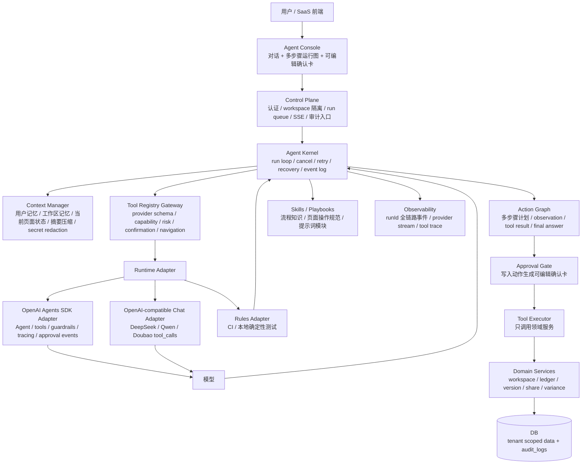
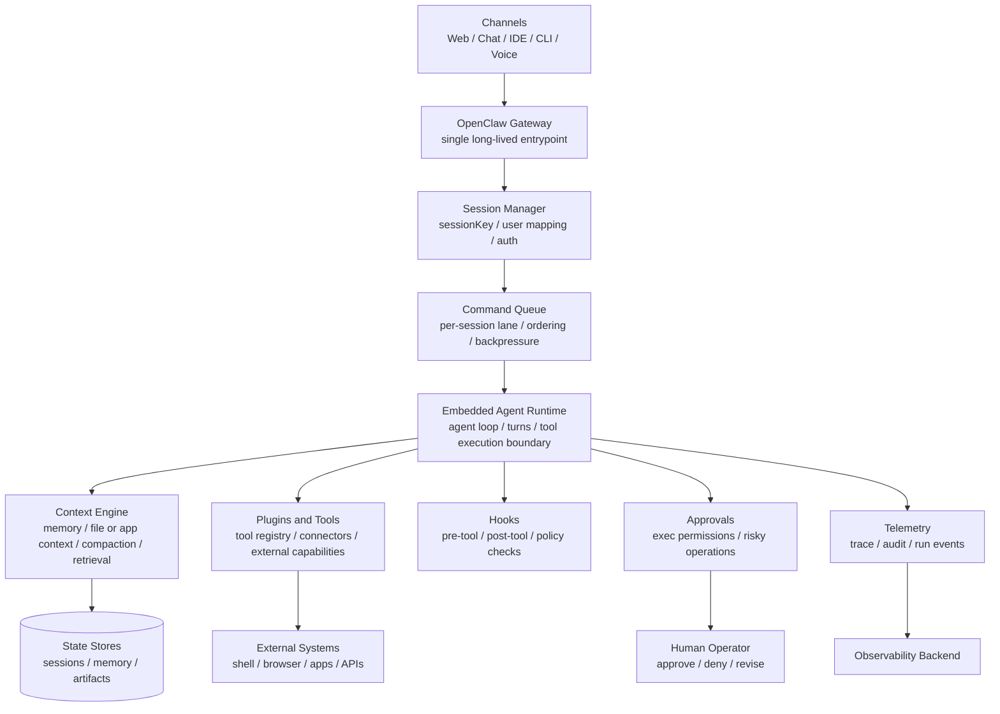
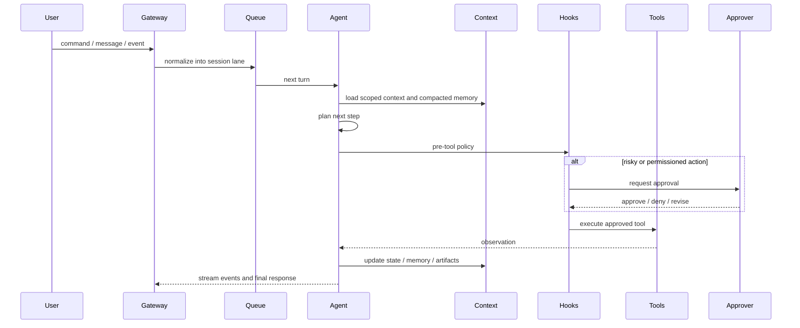
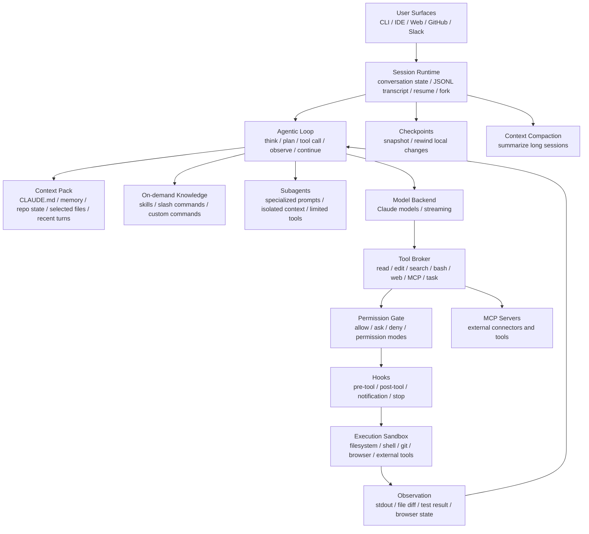
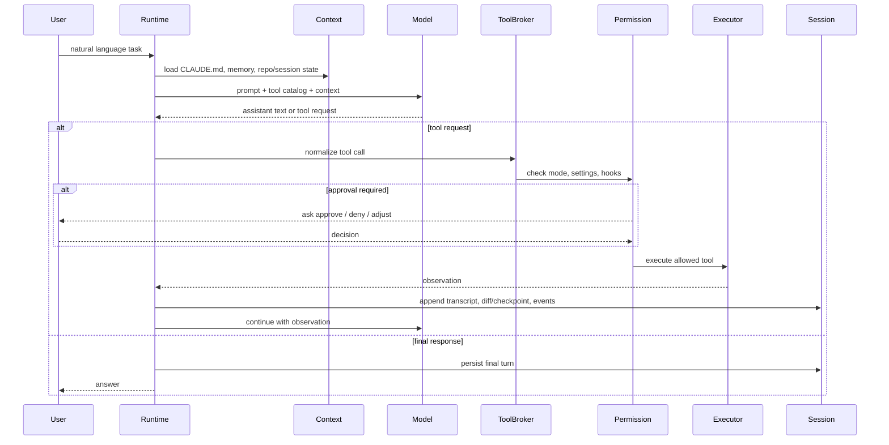

# ADR 0002: Harness Agent 架构

日期：2026-05-17

## 状态

Accepted for next implementation iteration.

## 背景

ADR 0001 已经明确：`xox-model` 的 Agent OS 不应把 DeepSeek 或任意 OpenAI-compatible `tool_calls` 当成完整 Agent 架构，也不引入 Claude Agent SDK；OpenAI Agents SDK 是目标 runtime 方向，Claude Code 和 OpenClaw 是架构与交互参考。

本 ADR 进一步明确 Agent OS 的产品架构：系统不能只是“模型返回 tool call 后服务端直接执行”的函数调用 demo。成熟的 Claude Code、Codex、OpenClaw 类系统更接近 harness agent：模型在受控运行壳内工作，外层 harness 负责租户隔离、上下文预算、记忆注入、工具注册、权限、确认、执行、审计、事件流和恢复。

当前实现已经具备真实 provider tool-call、确认卡、run event、SSE、memory、可编辑 pending action 和真实 smoke test，但仍存在关键差距：

- 工具目录需要从裸 schema 收敛为带 capability、风险、确认和导航元数据的 registry。
- route、planner、runtime、tool policy、confirmation、thread state 的边界仍不够清晰。
- 多步骤 action graph 已可展示，但还不是独立的 kernel run loop。
- memory/context 已有基础能力，但缺少正式的 context budget 和 retrieval/compaction policy。
- skills 还没有作为可审查的过程知识层稳定下来。

## 决策

采用“应用自有 Harness Agent + 可替换 Runtime Adapter”的架构。

OpenAI Agents SDK、OpenAI-compatible Chat Completions、rules adapter 都只能位于 `Runtime Adapter` 层。它们负责模型交互和工具调用归一化，不拥有 SaaS 权限、租户边界、确认卡、React 页面协议、业务执行和审计。

Harness Agent 的事实源在本项目后端：

- `Agent Kernel` 负责 run lifecycle、action graph、事件流、取消、恢复和重试边界。
- `Context Manager` 负责当前用户、当前 workspace、当前 thread 的上下文构造、记忆注入、敏感信息过滤和压缩。
- `Tool Registry Gateway` 负责提供 provider-facing schema，并维护 capability、风险、确认模式和导航目标等服务端 metadata。
- `Approval Gate` 负责把所有写入动作转成可编辑确认卡。
- `Tool Executor` 只调用现有 domain/module service，不直接写 DB，不读取 provider SDK。
- `Event/Audit` 负责把每一步变成可恢复、可观察、可审计的服务端状态。

本 ADR 暂不纳入 OpenAI 原生 `tool_search` 作为实现依赖。后续如果要引入，也只能作为 runtime 优化，不能替代项目自己的权限、租户隔离和确认卡策略。

## 架构图



## OpenClaw 架构解读

OpenClaw 官方披露的架构重点不是“更聪明的 prompt”，而是把外部入口、会话队列、agent runtime、上下文、插件、hooks、安全审批和 telemetry 组合成一个可嵌入的 harness。公开第三方分析也基本把它理解为：在现有 agent/core 能力外层增加 gateway、channel、tool wrapper、policy、memory、subagent 和 observability，而不是让模型直接接触所有系统能力。

### 基于官方文档的架构抽象



### 基于官方文档的 Agent Loop 抽象



### 为什么这么设计

OpenClaw 的思想可以概括为四点：

1. **入口归一化**：Web、聊天、CLI、IDE、语音等入口都进 Gateway。这样上层产品可以换入口，但 agent loop、权限、memory、审计不用复制。
2. **会话串行化**：每个 session 有自己的 lane/queue。这样同一个用户或同一个任务不会被多个并发消息打乱，恢复和取消也有明确边界。
3. **模型只在 runtime 内行动**：模型不能直接碰系统能力。工具、上下文、权限、approval、telemetry 都由 harness 提供。
4. **可嵌入而非单体产品**：OpenClaw 的定位更接近 agent infrastructure，可以嵌入不同应用；所以它强调 plugin、hooks、context engine 和 gateway，而不是某一个业务 UI。

### 优势

- 多入口一致：同一套 agent loop 支持不同客户端和渠道。
- 会话安全：session key、queue/lane 和 scoped context 有利于避免串线。
- 可恢复：run event、telemetry 和 state store 让崩溃恢复、重试和调试更可控。
- 权限清晰：hooks 和 approval 把确定性策略放在模型外面。
- 工具可扩展：plugin/tool registry 让系统能力增长时仍能被治理。
- 适合平台化：gateway + runtime + plugins 的结构适合做 agent infrastructure。

### 劣势

- 系统复杂度高：gateway、queue、runtime、context、hooks、approval、telemetry 都需要长期维护。
- 延迟更高：每个动作都经过队列、policy、approval 和事件持久化，交互路径更长。
- 业务语义需要再落地：OpenClaw 能给 infrastructure 思路，但不能天然理解财务 SaaS 的账期、锁账、版本、分录、审计语义。
- 多租户仍需应用实现：即使有 session/context 概念，具体 user/workspace/account 权限仍必须由业务系统掌控。
- 工具治理成本高：工具多以后必须有 registry、projection、测试和观测，否则仍会退化成混乱的 function-calling catalog。

### 对 xox-model 的启发

OpenClaw 最值得借鉴的不是某个具体接口，而是“模型外壳优先”的设计顺序：

```text
先有 harness 边界
  -> 再接 runtime/provider
  -> 再提供 provider-neutral tool catalog
  -> 再允许模型规划
  -> 再通过 approval gate 执行
```

因此 `xox-model` 应该采用这些设计：

- `Agent Console` 相当于一个 channel，不直接驱动业务写入。
- `apps/api` 需要一个明确的 `Agent Kernel`，承担 OpenClaw Gateway/Agent Runtime 的职责。
- 每个 workspace/thread/run 应有明确 session lane，避免并发消息导致重复确认卡或乱序执行。
- `Context Manager` 必须像 OpenClaw Context Engine 一样成为一等模块，而不是在 planner 里拼字符串。
- `Tool Registry Gateway` 必须在 runtime 调用前提供 provider-neutral schema 和服务端 policy metadata；模型通过原生 `tool_calls` 做语义选择，后端不写关键词路由器。
- 写入动作必须经过 `Approval Gate`，这对应 OpenClaw 的 hooks/approvals，但要使用本项目的可编辑确认卡。
- telemetry 不能只是日志，要继续作为用户可见 run graph 和后台审计事实源。

## Claude Code 架构解读

本节只采用 Claude Code 官方披露和公开分析的架构结论，不引用或复刻任何非授权源码。公开分析普遍认为 Claude Code 的核心不是复杂图引擎，而是一个被工程化到极致的 agentic loop：模型在循环中读上下文、选择工具、观察结果、继续行动；真正的产品能力来自 loop 外围的权限、上下文、记忆、工具包装、hooks、subagents、skills、MCP、session 持久化和 checkpoint。

### 基于官方文档和公开分析的架构抽象



### 基于官方文档和公开分析的 Agent Loop 抽象



### 为什么这么设计

Claude Code 的设计思想可以概括为六点：

1. **简单 loop，复杂 harness**：核心循环保持可理解，外围系统承担上下文、权限、工具、记忆、恢复和观测复杂度。
2. **把代码库当工作环境**：模型不是只回答问题，而是通过读文件、搜索、编辑、运行命令和测试来闭环完成任务。
3. **人类保持控制权**：权限模式、hooks、checkpoint、plan mode 和 interrupt 让用户能在高风险动作前接管。
4. **上下文是产品能力**：`CLAUDE.md`、memory、skills、subagents 和 compaction 都是在控制模型看见什么，而不是无限塞历史。
5. **按需扩展，而非全量注入**：skills、subagents、MCP 和命令把能力拆成可发现、可选择、可限制的模块。
6. **本地事实优先**：session transcript、文件 diff、命令输出和测试结果构成 agent 的 observation，比纯自然语言推理更可靠。

### 优势

- 任务闭环强：读、改、跑、看结果都在一个循环里，适合复杂代码任务。
- 用户可控：权限、hooks、checkpoint 和 interrupt 降低误操作成本。
- 上下文治理成熟：项目规则、用户记忆、skills、subagents 和压缩共同控制上下文预算。
- 扩展性好：MCP、skills、slash commands、subagents 让能力增长时仍可分层治理。
- 可恢复和可追踪：session transcript、checkpoint 和运行轨迹使长任务能恢复、复盘和回滚。
- 专业化分工：subagents 用独立上下文处理探索、审查、测试等支线任务，避免主上下文被污染。

### 劣势

- 默认面向开发者环境：文件系统、shell、git、测试和 IDE 是核心场景，不能直接映射到财务 SaaS。
- 安全面大：shell、MCP、浏览器和文件编辑都可能带来 prompt injection、权限误配和外部副作用。
- checkpoint 有边界：本地文件可回滚，但远程 API、第三方系统和真实业务写入不能靠本地快照恢复。
- 上下文仍可能漂移：`CLAUDE.md`、skills 和 memory 是强上下文，不是确定性权限系统。
- loop 成本高：长任务会产生多轮模型调用、工具调用和观察，延迟与 token 成本都会上升。
- 协调复杂：subagents 和并行探索提高吞吐，但也带来结果合并、冲突处理和信任边界问题。

### 对 xox-model 的启发

Claude Code 最值得学习的是“把 agent 当受控工作台，而不是聊天框”：

- `Agent Console` 应该像 Claude Code session 一样有可恢复 transcript、run graph、事件和未完成动作。
- `CLAUDE.md` 的思想可映射为本项目的 `prompts/*.md`、workspace playbooks 和用户可管理 memory，但它们只能影响上下文，不能授予权限。
- `Permission Gate + Checkpoint` 应映射为我们的可编辑确认卡、业务 preview、二次校验和 audit log；财务 SaaS 不能依赖文件快照回滚真实业务动作。
- `Tool Broker` 应映射为 provider-neutral tool registry 和模型选择的 capability router；不能用后端关键词/正则替模型选择业务工具。
- `Subagents` 的思想可以用于后续的只读分析、审计检查、数据核对和长任务拆分，但不引入 Claude Agent SDK。
- `Hooks` 应映射为确定性 policy：锁账、跨 workspace、账号动作、派生分录、版本不可变、审计必写。
- `MCP/skills` 应作为外部连接器和过程知识层，核心账务、版本、分享、模型编辑仍必须走本项目 server tools。

## 模块划分

### `apps/api/src/agent/kernel`

Agent OS 内核，不依赖具体模型 provider：

- `agent-kernel.ts`：创建和推进 run，协调 context、runtime、action graph、approval 和 event。
- `action-graph.ts`：维护多步骤计划、依赖、状态、失败定位和用户可见 timeline。
- `run-lifecycle.ts`：排队、lease、取消、恢复、超时和幂等边界。
- `approval-gate.ts`：写入动作的 preview、editable payload、confirm、cancel。
- `event-log.ts`：持久化运行事件，并投影到 REST/SSE thread state。

### `apps/api/src/agent/context`

上下文与记忆层：

- `context-builder.ts`：构造本轮模型输入，只使用当前 user/workspace/thread 数据。
- `memory-manager.ts`：list/delete/inject memory，禁止跨租户读取。
- `context-compactor.ts`：长对话摘要和上下文预算。
- `secret-redactor.ts`：过滤 API key、token、密码、验证码等敏感文本。

### `apps/api/src/agent/tool-catalog.ts`

工具注册层：

- `AGENT_TOOL_CATALOG`：provider-facing tool schema。
- `AGENT_TOOL_REGISTRY`：同源维护 capability、risk level、confirmation mode 和 navigation target。
- 语义 tool selection 由模型原生 `tool_calls` 完成；后端只做 catalog 外工具拒绝、policy、确认卡和领域执行。

### `apps/api/src/agent/tools`

受控工具层：

- `tool-registry.ts`：统一工具元数据、schema、风险等级、导航目标、是否写入、是否需要确认。
- `ledger-tools.ts`
- `workspace-tools.ts`
- `version-tools.ts`
- `share-tools.ts`
- `variance-tools.ts`
- `ui-tools.ts`

工具只能返回 read result 或 action request draft。写入必须经过 approval gate。

### `apps/api/src/agent/runtime`

模型 runtime adapter 层：

- `runtime-adapter.ts`：统一内部接口。
- `openai-agents-adapter.ts`：OpenAI Agents SDK。
- `openai-compatible-chat-adapter.ts`：DeepSeek、Qwen、Doubao 等兼容 Chat Completions providers。
- `rules-adapter.ts`：确定性测试和无 provider 的本地路径。

runtime adapter 不直接访问 DB，不创建确认卡，不执行业务服务。

### `apps/api/src/agent/prompts`

提示词和过程知识：

- `operator.system.md`
- `planner.system.md`
- `tool-policy.system.md`
- `memory.system.md`
- `skills/*.md`

skills 是可检索的流程知识，不是业务工具，不具备执行权限。

### `apps/web/src/components/agent`

React Agent OS：

- `AgentShell`
- `AgentConsole`
- `AgentPlanTimeline`
- `AgentActionCard`
- `AgentMemoryPanel`
- `AgentEventLog`

前端只渲染后端 thread state。可编辑确认卡提交后仍由后端重新校验。

## Dependency Graph

```text
apps/web
  -> packages/contracts
  -> apps/api routes
      -> agent kernel
          -> context manager
          -> capability router
          -> model tool selection
          -> runtime adapter
          -> approval gate
          -> event/audit
      -> agent tools
          -> domain/module services
              -> db

runtime adapter -/-> db
runtime adapter -/-> domain services
model -/-> db
model -/-> tenant identifiers
skills -/-> business execution
```

## Tool Registry 策略

当前实现把 provider-neutral tool catalog 交给模型通过原生 `tool_calls` 语义选择；后端不使用关键词或正则预选工具。每个工具必须有元数据：

- `capability`：所属能力域。
- `riskLevel`：`read | low | medium | high`。
- `confirmationMode`：`never | always | conditional`。
- `navigationTarget`：执行前必须显式打开的页面或面板。
- `allowedWhen`：锁账、版本状态、workspace 状态、角色权限等约束。
- `inputSchema`：provider-facing schema。
- `previewSchema`：确认卡展示和编辑 schema。
- `auditKind`：审计事件类型。

一次 run 的工具选择流程：

1. `Context Manager` 注入当前页面、workspace 摘要、memory 和最近消息。
2. `Tool Registry` 提供 provider-facing schema 和服务端 policy metadata。
3. `Runtime Adapter` 把 catalog 交给模型。
4. 模型返回 tool call 或 assistant text。
5. `Agent Kernel` 把 tool call 转成 read result 或 action request draft。

如果模型提出 catalog 外工具或危险动作，kernel 必须拒绝或重新规划，不能临时扩大权限后直接执行。未来如果工具目录大到影响模型选择，应引入模型选择的 capability router 或重新设计更高层工具，而不是在后端写语义关键词路由。

## 多步骤与可编辑动作

用户一次输入多个目标时，系统必须生成多步骤 action graph，而不是一个 opaque batch：

- 每个步骤都有 `stepId`、状态、导航目标、tool intent、依赖关系和错误信息。
- 读操作可以自动执行并形成 observation。
- 写操作必须生成独立确认卡。
- batch 工具只能展开为多张确认卡，不能把多笔写入藏在一个不可编辑 payload 中。
- 用户编辑确认卡后，执行前必须重新走 policy check 和 domain validation。
- 任一步失败时，后续依赖步骤不得静默执行。

## Memory 与 Context Compaction

SaaS memory 必须分层：

| 层级 | 范围 | 内容 | 约束 |
| --- | --- | --- | --- |
| user memory | `userId` | 用户偏好、展示习惯 | 用户可查看/删除 |
| workspace memory | `workspaceId + userId` | 当前工作区别名、默认记账习惯 | 不跨 workspace 注入 |
| thread memory | `threadId + workspaceId + userId` | 当前对话目标、未完成步骤 | 可压缩 |
| run context | `runId` | 本轮临时事实和 observation | 不进入长期记忆，除非显式保存 |

Context compaction 规则：

- 摘要只来自同 user、同 workspace、同 thread。
- 摘要必须保留未完成动作、用户确认过的业务事实和关键错误。
- 摘要不得包含 secrets。
- 用户删除 memory 后，后续 prompt 不得继续注入相关内容。
- memory 不能授予权限，只能补充上下文。

## Skills 边界

skills 是面向模型的过程知识和操作指南，例如：

- 记账流程。
- 版本发布流程。
- 预实分析追问策略。
- 页面导航规范。
- 确认卡字段说明。

skills 不能：

- 直接执行工具。
- 生成绕过确认卡的写入。
- 保存或扩大租户上下文。
- 替代 domain validation。
- 作为账号类动作的授权入口。

## OpenAI Agents SDK 采用边界

OpenAI Agents SDK 可用于：

- agent runtime orchestration。
- tool definition 和 tool call normalization。
- guardrails。
- handoffs。
- tracing / observability。
- human-in-the-loop event 对接。
- streaming event 映射。

OpenAI Agents SDK 不负责：

- SaaS 租户隔离。
- 业务权限。
- 可编辑确认卡。
- React 页面导航协议。
- 账务、版本、分享领域服务。
- audit log 的业务语义。
- memory 的租户作用域。

因此 SDK 必须被包在 `openai-agents-adapter.ts` 内部，不能让 SDK 类型进入 `packages/contracts` 或 `packages/domain`。

## OpenAI-compatible Provider 边界

DeepSeek、Qwen、Doubao 等 provider 通过 `openai-compatible-chat-adapter.ts` 接入：

- 只依赖兼容 Chat Completions、tool calls 和 streaming chunks 的能力。
- provider key 只来自当前用户/workspace provider settings 或 env 兜底。
- provider 响应必须归一化成内部 `RuntimePlanResult` 和 `RuntimeStreamEvent`。
- provider 不知道 `userId`、`workspaceId` 的真实权限选择权。

## 迁移顺序

### M1: 固化架构文档

编辑路径：

- `docs/adr/0002-harness-agent-architecture.md`
- `docs/agent-design.md`
- `.agent/lessons.md`

验收：

- 架构图、模块边界、tool catalog、memory、skills、SDK 边界写清。
- 明确本 ADR 暂不依赖 OpenAI 原生 `tool_search`。

### M2: Tool Registry 元数据化

编辑路径：

- `apps/api/src/agent/tool-catalog.ts`
- `apps/api/src/agent/tools/*`
- `apps/api/tests/api.test.ts`

验收：

- 每个工具都有 capability、risk、navigation、confirmation、audit metadata。
- 测试证明当前工具注册表可以按能力域筛选。

### M3: Tool Registry Gateway 与 Policy

编辑路径：

- `apps/api/src/agent/tool-catalog.ts`
- `apps/api/src/agent/tool-policy.ts`
- `apps/api/src/agent/runtime/*`
- `apps/api/src/agent/planner.ts`

验收：

- 不同用户指令不得由后端关键词/正则选择业务工具；语义选择由模型 tool_call 完成。
- 账号类动作只能规划为 `account_forbidden`，不能执行账号写入。
- 跨 workspace 或锁账状态下相关写入工具不可见或不可执行。

### M4: Agent Kernel 拆分

编辑路径：

- `apps/api/src/modules/agent.ts`
- `apps/api/src/agent/kernel/*`
- `apps/api/src/agent/approval-executor.ts`
- `apps/api/src/agent/tool-executor.ts`

验收：

- route 只负责 HTTP、auth 和 DTO。
- kernel 统一负责 run lifecycle、action graph、approval、event。
- runtime adapter 不写 DB，不创建确认卡。

### M5: Context Manager 与 Skills

编辑路径：

- `apps/api/src/agent/context/*`
- `apps/api/src/agent/prompts/*`
- `apps/api/tests/api.test.ts`

验收：

- memory 注入和 summary 压缩有明确 token/context budget。
- skills 可以按能力域注入。
- 删除 memory 后后续 prompt 不再注入。

### M6: Runtime Maturity

编辑路径：

- `apps/api/src/agent/runtime/openai-agents-adapter.ts`
- `apps/api/src/agent/runtime/openai-compatible-chat-adapter.ts`
- `apps/api/src/agent/real-provider-smoke.ts`

验收：

- OpenAI Agents SDK adapter 映射 streaming、tracing、human-in-the-loop events。
- OpenAI-compatible provider 继续通过真实 smoke 覆盖只读、多步骤、确认卡和 memory。
- 切换 provider 不改业务工具代码。

## 验收标准

- 文档审查能清晰区分 `harness`、`runtime adapter`、`tools`、`domain services`。
- `docs/agent-design.md` 与本 ADR 不冲突。
- 当前实现差距在 acceptance 或 follow-up 中可追踪。
- 后续代码实现不能再默认全量暴露工具给模型，除非测试环境显式使用 rules adapter。
- 所有写入动作继续满足：显式导航、可编辑确认卡、二次 policy check、domain validation、audit log。
- 所有 memory/context 能证明按 user/workspace/thread 隔离。

## 参考

- OpenAI Agents guide: `https://developers.openai.com/api/docs/guides/agents`
- OpenAI Agents SDK human-in-the-loop: `https://openai.github.io/openai-agents-js/guides/human-in-the-loop/`
- Claude Code overview: `https://code.claude.com/docs/en/overview`
- Claude Code how it works: `https://code.claude.com/docs/en/how-claude-code-works`
- Claude Code memory: `https://code.claude.com/docs/en/memory`
- Claude Code subagents: `https://code.claude.com/docs/en/sub-agents`
- Claude Code tool search: `https://code.claude.com/docs/en/agent-sdk/tool-search`
- Claude Code permissions: `https://code.claude.com/docs/en/permissions`
- Claude Code hooks: `https://code.claude.com/docs/en/hooks`
- Claude Code MCP: `https://code.claude.com/docs/en/mcp`
- Claude Code skills: `https://code.claude.com/docs/en/skills`
- Claude Code public architecture analysis: `https://arxiv.org/abs/2604.14228`
- Claude Code public reverse-engineering notes: `https://minusx.ai/blog/decoding-claude-code/`
- OpenClaw system architecture: `https://docs.openclaw.ai/architecture`
- OpenClaw agent loop: `https://docs.openclaw.ai/agent-loop`
- OpenClaw command queue: `https://docs.openclaw.ai/concepts/queue`
- OpenClaw context engine: `https://docs.openclaw.ai/concepts/context-engine`
- OpenClaw exec approvals: `https://docs.openclaw.ai/tools/exec-approvals`
- OpenClaw third-party architecture notes: `https://openclaw.design/learn/how-openclaw-works`

## 后果

收益：

- Agent OS 不再被某个 provider 的 function calling 能力定义。
- 工具能力随产品增长时，不会因为全量注入而持续扩大上下文和误调用风险。
- 多用户、多 workspace、记忆、审批、审计和恢复成为 harness 的一等能力。
- OpenAI Agents SDK 可以逐步增强 runtime，但业务内核保持 provider-neutral。

代价：

- 需要把现有 flat tool catalog 改造成带 metadata 的 registry。
- 需要新增 capability router 和 model tool selection 测试。
- 需要拆分现有 route/planner 中仍混杂的 lifecycle 职责。
- 短期内文档架构会领先于部分代码，需要用 acceptance 跟踪落地差距。
