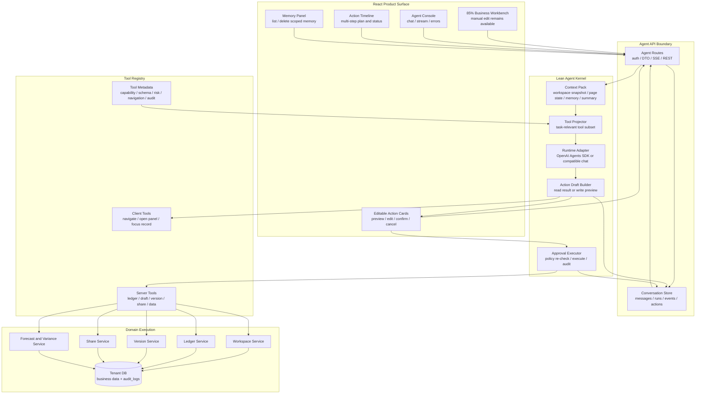
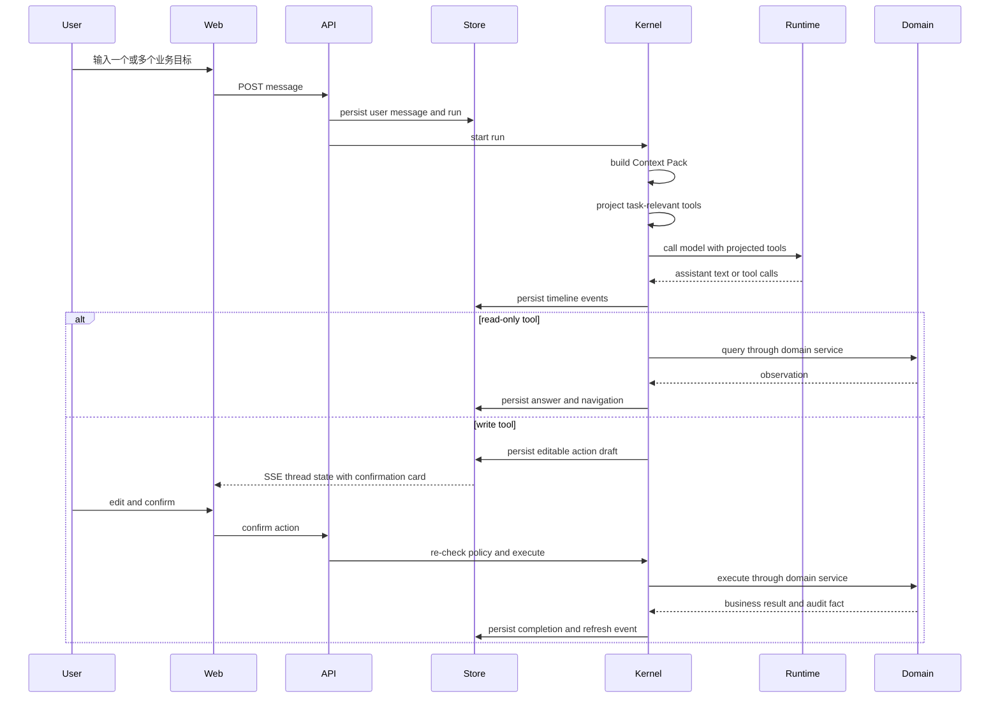

# ADR 0003: xox-model Lean Harness Agent 架构

日期：2026-05-17

## 状态

Accepted for next implementation iteration.

## 背景

ADR 0001 定义 runtime 采用策略，ADR 0002 分析 OpenClaw、Claude Code 和 Harness Agent 的领先实践。本 ADR 重新把这些实践收敛到 `xox-model` 这个具体产品。

上一版 ADR 0003 把 OpenClaw 的 control plane、session lane、queue、gateway 等基础设施概念放得过重。这个方向对通用 agent infrastructure 合理，但对 `xox-model` 当前产品过度。`xox-model` 是一个 SaaS 财务模型和记账工作台，不是多入口 agent 平台，也不是 Claude Code 那样的本地开发者运行环境。

因此本 ADR 调整为：不复制 OpenClaw 的 control plane，不复制 Claude Code 的开发者沙箱，而是提炼二者的共同思想，形成一个更小、更优雅、可迭代的产品内嵌 Harness Agent。

## 核心判断

`xox-model` 需要的不是“大 agent 平台”，而是一个 **Lean Product Harness**：

```text
React Agent Surface
  -> Agent API Boundary
  -> Conversation Store
  -> Lean Agent Kernel
      -> Context Pack
      -> Tool Projector
      -> Runtime Adapter
      -> Action Draft Builder
      -> Approval Executor
  -> Domain Services
  -> DB + audit_logs
```

这套架构故意比 OpenClaw 和 Claude Code 小：

- 不需要 multi-channel gateway。
- 不需要独立 control plane。
- 不需要一开始就有 subagent orchestration。
- 不需要 MCP/plugin host 作为核心。
- 不需要分布式 worker/queue 作为前置条件。
- 不需要把 skills 做成执行系统。

但它保留了 Harness Agent 的关键边界：

- 模型只规划和解释，不拥有执行权。
- 后端拥有 thread/run/action state。
- 工具按任务投影，不全量暴露。
- 写入动作是可编辑 action draft，确认后才执行。
- 所有执行复用同一套 domain services。
- memory/context 按 user/workspace/thread 隔离。

## 最小必要复杂度

当前阶段只需要五个核心部件。

| 部件 | 责任 | 为什么必要 |
| --- | --- | --- |
| Conversation Store | 保存 messages、runs、events、action requests | 刷新、断网、历史对话、确认卡未执行时必须能恢复 |
| Context Pack | 组装当前用户、workspace、页面、memory、summary | SaaS 多用户隔离和长对话稳定性不能靠 prompt 即兴处理 |
| Tool Projector | 从完整工具注册表中选择本轮小工具集 | 工具增长后，全量注入会降低准确率并扩大误调用面 |
| Runtime Adapter | 连接 OpenAI Agents SDK 或 OpenAI-compatible provider | provider 可替换，业务协议不被模型供应商绑定 |
| Approval Executor | 生成可编辑确认卡，确认后调用 domain services | 财务写入有真实后果，必须 preview、edit、confirm、audit |

这五个部件之外，都是后续扩展，不是 MVP 架构前置条件。

## 目标架构图



## 运行流程



## 设计思想

### 1. 小内核，不做平台

OpenClaw 的价值是告诉我们：模型外面必须有 harness。Claude Code 的价值是告诉我们：agent loop 可以很简单，复杂度在工具、权限、上下文和恢复边界里。

但 `xox-model` 不需要复制它们的外壳体量。我们只做产品内部需要的最小 harness：一次用户消息、一次 run、一个上下文包、一组投影工具、一批 action drafts。

### 2. Conversation Store 是事实源，不是 control plane

我们需要持久状态，但不需要独立 control plane。Conversation Store 只做产品所需事实源：

- 对话消息。
- run 状态。
- timeline events。
- navigation events。
- pending action cards。
- memory records。

它解决恢复和审计，不承担 gateway、multi-channel routing 或分布式编排。

### 3. Tool Projector 是优雅架构的中心

Agent 架构是否能扩展，关键不在于有多少模块，而在于工具增长时是否仍然可控。

`xox-model` 的优雅点应该是一个 metadata-driven tool registry：

```text
tool = {
  capability,
  inputSchema,
  riskLevel,
  requiresConfirmation,
  navigationTarget,
  previewBuilder,
  executor,
  auditKind
}
```

Tool Projector 根据用户指令、当前页面、workspace 状态和权限，只把相关工具交给 runtime。这样工具从 10 个增长到 100 个时，架构仍然稳定。

### 4. Action draft 是业务交易对象

确认卡不是 UI 附件，而是后端业务交易草稿。它必须可编辑、可取消、可确认、可审计，并且执行前重新校验。

这比普通 human-in-the-loop 更适合财务 SaaS：用户不是简单点“允许”，而是能修改“实际要执行什么”。

### 5. Domain services 是执行真相

Agent 不直接写 DB，也不复制业务逻辑。页面手动操作和 Agent 操作都走同一套 `workspace / ledger / version / share / forecast` 服务。

这保证了 Agent 不会变成第二套业务系统，也让测试和审计有共同边界。

### 6. Memory 是上下文，不是权限

Memory 只参与 Context Pack。它可以帮助模型理解“这个工作区里 A 是谁”“默认账期是什么”，但不能改变 user/workspace 权限，不能跨租户，不能绕过确认。

### 7. Runtime 是可替换薄层

OpenAI Agents SDK、DeepSeek、Qwen 或其他兼容 provider 都是 runtime adapter。Runtime 只负责模型调用、streaming 和 tool-call normalization，不拥有业务执行权。

## 为什么这套架构适合 xox-model

`xox-model` 的复杂度来自业务风险，而不是 agent infrastructure：

- 用户会通过 Agent 修改模型、记账、发布版本、恢复版本、分享链接。
- 写入动作必须能被用户检查和编辑。
- 账本历史、版本、审计不能被模型随意改写。
- 多 workspace 和 provider settings 不能串。
- 未来工具会越来越多，但大多数仍是同一个财务领域内的能力。

所以我们需要强边界，但不需要大平台。最合适的是 **thin runtime + strong domain harness**。

## 先进性

这套架构的先进性不是“模块多”，而是把当前 Harness Agent 领域最重要的几个趋势压缩到产品可落地的最小形态。

- **Tool projection first**：从一开始避免 flat function-calling catalog，这是工具规模化的核心。
- **Editable action drafts**：把 human approval 升级为可编辑业务交易草稿，适合 SaaS 写入场景。
- **Domain-owned execution**：Agent 只规划，业务服务执行，避免影子业务系统。
- **Provider-neutral runtime**：OpenAI Agents SDK 和兼容 Chat Completions 都是薄 adapter，未来切 provider 不改业务工具。
- **Server-owned conversation state**：具备恢复、审计、SSE 实时投影，不依赖前端临时状态。
- **Scoped context and memory**：从架构层避免跨用户、跨 workspace memory 泄漏。
- **UI navigation as protocol**：Agent 调用业务能力必须显式驱动页面，用户能看到系统在哪里操作。

它比 OpenClaw 小，因为我们不是通用 agent infra。它比 Claude Code 小，因为我们不是本地开发者沙箱。但它保留了二者最关键的 harness 思想。

## 未来可扩展性

### 工具扩展

新增业务能力时，只需要沿着一个稳定路径扩展：

1. domain service 支持该能力。
2. tool registry 增加 metadata。
3. projector 增加选择规则。
4. action draft 增加 preview/edit schema。
5. smoke test 增加真实 provider 场景。

不需要重写 runtime，也不需要改前端对话协议。

### Runtime 扩展

Runtime adapter 可以替换或并存：

- OpenAI Agents SDK adapter。
- DeepSeek/Qwen/Doubao compatible chat adapter。
- rules adapter for CI。

SDK tracing、guardrails、handoffs 可以后续接入，但它们是增强项，不是业务架构核心。

### Memory 扩展

Context Pack 可以从简单 memory 升级为：

- typed memory。
- workspace playbook。
- TTL/confidence/source metadata。
- vector retrieval。
- summary invalidation。

但外部接口不变：Kernel 只拿一个经过作用域过滤和脱敏的 Context Pack。

### Execution 扩展

当前可以同步执行或使用现有轻量 run state。未来如果需要多实例或长任务，只在 Conversation Store 后面升级实现：

- background worker。
- db lease。
- pub/sub。
- WebSocket。

这些不改变 Agent Kernel 的抽象。

### Read-only subagents

短期不引入 subagents。未来如果需要，也只从只读场景开始：

- variance analyst。
- audit reviewer。
- import normalizer。
- scenario simulator。

写入仍必须回到主 Kernel 的 action draft 和 approval executor。

### 外部集成

MCP 或 connector 只作为外部系统接入：

- 文件导入。
- 表格。
- 通知。
- CRM/财务系统。

核心账务、草稿、版本和分享仍走本项目 server tools。

## 不做什么

- 不做 OpenClaw 式 control plane。
- 不做 multi-channel gateway。
- 不引入 Claude Agent SDK。
- 不把 OpenClaw 作为运行框架 fork。
- 不让模型直接写 DB。
- 不让 skills 执行业务动作。
- 不把 memory 当权限来源。
- 不默认全量暴露工具。
- 不把 subagents 作为当前架构前置条件。

## 落地优先级

1. 把现有 flat `tool-catalog.ts` 收敛为带 metadata 的 tool registry。
2. 实现 tool projector，让 runtime 每轮只看到任务相关工具。
3. 把 planner 中的上下文拼装收敛为 Context Pack。
4. 把写入 preview、editable action、confirm execution 收敛到 Approval Executor。
5. 保持 Runtime Adapter 薄层化，禁止它访问 DB 或 domain services。
6. React 继续只渲染 server-owned thread state。

## 验收标准

- 任意用户请求只暴露任务相关工具子集，而不是完整工具目录。
- 多步骤请求在前端显示多个 timeline steps 和 action cards。
- 所有写入 action draft 都可编辑，确认后执行前重新校验。
- Memory 注入可证明不会跨用户、跨 workspace。
- 账号影响类动作不会进入工具投影。
- Runtime adapter 不读取 DB，不创建确认卡，不执行 domain service。
- Tool executor 不依赖 provider SDK。
- 前端刷新后仍能恢复 thread messages、run events 和 pending action drafts。

## 参考

- [ADR 0001: Agent Runtime 架构采用策略](0001-agent-runtime-architecture.md)
- [ADR 0002: Harness Agent 架构](0002-harness-agent-architecture.md)
- OpenAI Agents guide: `https://developers.openai.com/api/docs/guides/agents`
- OpenAI Agents SDK human-in-the-loop: `https://openai.github.io/openai-agents-js/guides/human-in-the-loop/`
- Claude Code overview: `https://code.claude.com/docs/en/overview`
- Claude Code how it works: `https://code.claude.com/docs/en/how-claude-code-works`
- OpenClaw architecture: `https://docs.openclaw.ai/architecture`
- OpenClaw agent loop: `https://docs.openclaw.ai/agent-loop`

## 后果

收益：

- 架构从大平台收敛为产品内核，更适合当前迭代速度。
- 保留 Harness Agent 的关键先进性：tool projection、editable approval、provider-neutral、server-owned state。
- 后续扩展 runtime、memory、工具、外部集成时不需要推翻核心。
- 业务执行仍统一在 domain services，减少 Agent 和手动页面漂移。

代价：

- 需要尽快把 flat tool catalog 改成 metadata registry。
- 需要为 tool projection 和 action draft lifecycle 增加测试。
- 不追求一开始就支持通用 agent platform 能力。
