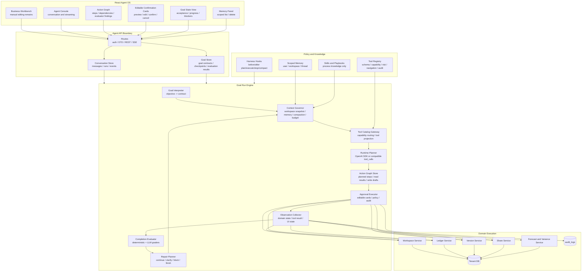
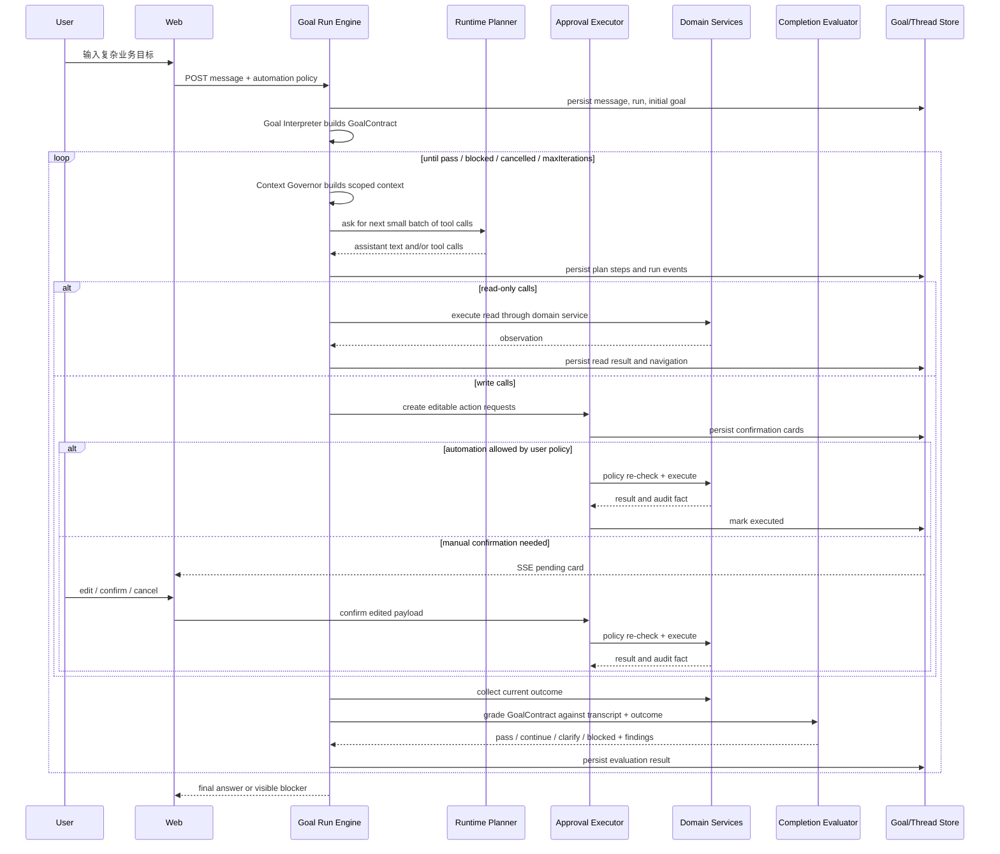

# ADR 0004: Evaluator-Centered Harness Agent 架构

日期：2026-05-19

## 状态

Accepted as the target Agent OS architecture.

本 ADR 取代 ADR 0003 中“Lean Product Harness”作为最终目标架构的表述。ADR 0003 仍保留为一次重要的收敛记录，但它的重点是防止过度平台化；本 ADR 进一步明确：`xox-model` 的目标不是最小可落地助手，而是面向复杂 SaaS 财务操作的、evaluator-centered、可长期演进的 Harness Agent OS。

2026-05-19 实现切片：已落地 `AgentGoalContract`、`agent_goals`、`agent_evaluations`、run `goal_status`、`goal-run-engine.ts`、`completion-evaluator.ts`、`observation-collector.ts`、主动 memory candidate detector/consolidator，以及 React Goal/Evaluation 面板。OpenAI-compatible provider stream trace 已改为 redacted/coalesced chunk events：adapter 仍实时读取 token/chunk，但按时间和长度合并写入 `provider_stream_delta`，避免长 tool-call 参数被每 token DB trace 拖慢甚至中断。当前实现以 deterministic policy/domain/action-graph evaluator 为主，LLM rubric evaluator、独立 memory promotion scheduler 和更细粒度 evaluator 子模块仍是后续演进项。

2026-05-24 约束修订：`automationLevel` 只表示 planner 推进力度，不再表示自动确认权限。复杂经营模型、记账、版本、分享、导入和草稿修改等所有写入都必须保持可编辑确认卡，用户确认后才执行。

## 背景

`xox-model` 的产品目标不是在页面底部放一个聊天助手，而是把平台升级为 Agent OS：

- 用户可以用自然语言完成页面上可手动完成的业务动作。
- 多步骤目标必须可视化为 action graph，而不是隐藏在一次模型回复里。
- 读操作可以自动执行；写操作必须显式导航、生成可编辑确认卡、确认后执行。
- 复杂目标不能假设模型一次性吐出全部 tool calls；模型应该在 harness 中小步调用工具、观察结果、继续规划，直到目标完成或明确阻塞。
- SaaS 多用户、多工作区、provider settings、memory、审计和版本不可变性都必须是架构事实，不是 prompt 约定。

此前实现已经有 provider-native tool calls、Tool Catalog Gateway、Action Graph、确认卡、run event、SSE、memory 和 DeepSeek smoke 方向，但仍缺少一个关键部件：**Completion Evaluator / Goal Run Engine**。没有 evaluator，系统只能相信模型说“完成了”，或者相信一次 tool-call plan 足够完整。这两种都不符合复杂财务 SaaS 的可靠性要求。

## 领先实践提炼

### OpenAI Agents SDK

OpenAI Agents SDK 的 Runner 本身是一个 model/tool/handoff loop：调用模型、检查输出、执行工具或 handoff、把结果追加回上下文，直到 final output 或达到 `maxTurns`。SDK 也提供 guardrails、tracing、session、streaming 和 human-in-the-loop approval。

对 `xox-model` 的启发：

- SDK loop 适合做 runtime execution loop，但它的 stop condition 是“模型输出 final text 且没有 tool call”。这不能等价为“业务目标已完成”。
- SDK HITL approval 可以作为 runtime 能力参考，但本项目需要更强的可编辑确认卡、页面导航、业务 preview、二次 policy check 和 audit。
- SDK tracing 可以进入 run event，但不能替代本项目的 domain-state evaluator。

### Anthropic Building Effective Agents

Anthropic 强调 agent 在执行过程中必须从环境获得 ground truth，并通过 tool results 或代码执行结果判断进展；复杂 agent 适合无法预先固定步骤数的问题，同时需要 stopping conditions、guardrails、透明规划和清晰工具文档。

对 `xox-model` 的启发：

- 每一步都必须有 observation，且 observation 优先来自领域服务和数据库状态，而不是模型自评。
- 多步骤目标需要显式 stopping condition：通过 evaluator 判定 pass、blocked、needs_confirmation、needs_clarification 或 continue。
- 工具文档和工具接口是 Agent-Computer Interface；工具不是随便暴露函数，而是产品操作语言。

### Anthropic Agent Evals

Anthropic 对 agent eval 的定义区分了 task、trial、grader、transcript、outcome、evaluation harness 和 agent harness。其中最关键的是：agent 说自己完成不算完成，最终要看环境 outcome。

对 `xox-model` 的启发：

- `AgentRun` 的 transcript 是 messages、tool calls、run events、action graph、确认卡编辑和执行结果。
- `Outcome` 是 workspace draft、ledger periods、versions、shares、audit logs 和 projected finance state。
- `Evaluator` 不能只看 assistant 文本；它必须读取 outcome 并按 goal contract 评分。
- real-provider smoke 不应该只检查“模型返回了 tool_call”，还要检查最终领域状态和运行图是否满足用户目标。

### Anthropic Long-Running Harness

Anthropic 的长任务 harness 用 feature list、progress file、incremental work、end-to-end testing 和 structured handoff 防止模型过早宣布完成。复杂任务被拆成可验证的、逐步推进的工作项。

对 `xox-model` 的启发：

- 用户的复杂财务目标需要转成 `GoalContract`，其中包含可验证标准，而不是一条长 prompt。
- 每轮 planner 只处理一小批下一步动作，执行后由 evaluator 再读状态。
- 复杂目标跨多轮、多上下文时，下一轮必须从结构化 goal state 和 action graph 恢复，而不是从自然语言历史猜。

### Anthropic Generator-Evaluator Harness

Anthropic 在更复杂的长任务中把 generator 和 evaluator 分离，原因是模型自评倾向过度乐观。独立 evaluator 基于具体标准和真实运行环境给出反馈，generator 再根据反馈迭代。

对 `xox-model` 的启发：

- Planner 负责提出下一步 tool calls；Evaluator 负责判断目标是否满足、缺什么、哪里违反约束。
- 对能确定的业务事实，优先使用 deterministic evaluator；对解释质量、分析深度、回答是否覆盖用户追问等软目标，可使用 LLM evaluator，但必须带领域事实和评分 rubric。
- evaluator findings 必须成为 action graph 的一部分，让用户看到系统为什么继续、为什么阻断、为什么请求确认。

### Claude Code

Claude Code 的官方披露显示了 hooks、permissions、subagents、memory、compaction 和 transcript 的设计模式。Hooks 可在 `PreToolUse`、`PostToolUse`、`Stop`、`PreCompact` 等生命周期点介入；subagents 用独立上下文处理支线；memory 是 context，不是权限。

对 `xox-model` 的启发：

- 我们需要自己的 hook/evaluator 生命周期：before_plan、after_plan、before_execute、after_execute、before_stop、before_compact。
- `Stop` 不能只由模型决定；before_stop 必须运行 Completion Evaluator。
- Subagent 思想可以用于只读 evaluator、审计 reviewer、variance analyst，但写入仍回主 Goal Run Engine 和确认卡。
- Memory 必须可管理、可删除、可作用域隔离，并由 Context Governor 决定注入，不允许变成权限来源。

### OpenClaw

OpenClaw 官方把 agent 抽象为 Model Layer、Memory Layer、Tool Layer、Channel Layer，并强调 channel adapters、skill engine、sandbox、model-agnostic、persistent memory 和大量 skills。它适合通用 agent platform，但 `xox-model` 是一个具体财务 SaaS。

对 `xox-model` 的启发：

- 借鉴层次化思想，不复制平台壳。
- Tool/Skill 区分非常重要：低层工具是函数；高层 capability 是用户能理解的业务能力。
- Model-agnostic runtime 必须存在，但 provider 不拥有业务语义。
- Sandbox 的等价物不是容器，而是 business policy、tenant scope、confirmation card、domain validation 和 audit。
- OpenClaw memory 的关键不是“用户说记住才写入”，而是把 durable memory、daily/episodic notes、active memory recall、compaction 前自动 flush、dreaming/background promotion 和 memory search 组成一个主动维护系统。

### Hermes Agent Memory

Hermes Agent 的公开 memory 设计强调分层记忆和边界感：长期 profile/facts 被限制在很小的系统 prompt 预算内，skills/episodic documents 承载从经验中沉淀的过程知识，session DB / FTS5 负责跨会话检索。它还强调 memory 写入要有安全扫描、容量预算和会话边界，而不是把所有历史无限追加到 prompt。

对 `xox-model` 的启发：

- 长期记忆必须小而稳定，适合用户偏好、工作区约定、业务口径和反复确认过的事实。
- 短期和情节记忆负责保留“发生过什么、为什么这么做、结果如何”，用于下一轮目标修复和未来检索。
- 程序性记忆/skills 负责沉淀“怎样做某类任务”，但它是过程知识，不是执行权限。
- 记忆写入必须经过安全扫描、作用域判断、容量预算、证据记录和可删除/可审计管理。

## 决策

采用 **Evaluator-Centered Product Harness**：

```text
React Agent OS
  -> Agent API Boundary
  -> Conversation and Goal Store
  -> Goal Run Engine
      -> Goal Interpreter
      -> Context Governor
      -> Tool Catalog Gateway
      -> Runtime Planner
      -> Action Graph Store
      -> Approval Executor
      -> Observation Collector
      -> Completion Evaluator
      -> Repair Planner
  -> Domain Services
  -> DB + audit_logs
```

这不是“最小可落地版本”，而是一个完整的目标架构。实现可以分阶段，但每个阶段都必须是这套目标架构的一块，不允许临时回到 one-shot function calling、后端关键词路由或假对话。

核心原则：

1. **业务完成由 evaluator 判定，不由模型自称完成判定。**
2. **模型每轮只负责下一批合理动作，不负责一次性吐完整业务剧本。**
3. **读操作可以由 harness 自动执行并形成 observation；写操作先进入可编辑确认卡。**
4. **用户选择自动化阈值时，只允许 planner 更积极地补齐步骤；写入仍等待用户确认，再由 Approval Executor 走同一套 policy/domain/audit。**
5. **所有状态以 server-owned transcript、goal state、action graph 和 domain outcome 为事实源。**
6. **Memory 和 skills 是 context/capability，不是权限。**
7. **Runtime adapter 是薄层；OpenAI Agents SDK、DeepSeek、Qwen 都不能拥有 SaaS 权限和业务执行权。**

## 目标架构图



## 运行循环



## Goal Contract

复杂用户输入进入系统后，第一件事不是直接给模型全部工具，而是建立可评估的 `GoalContract`。这个 contract 可以由模型辅助解释，但必须被服务端结构化保存，并在后续每轮 evaluator 中使用。

目标 contract 的概念模型：

```ts
type AgentGoalContract = {
  goalId: string;
  threadId: string;
  runId: string;
  userId: string;
  workspaceId: string;
  objective: string;
  scope: {
    workspace: 'current';
    pages: Array<'model' | 'ledger' | 'variance' | 'versions' | 'share'>;
    allowedCapabilities: string[];
  };
  acceptanceCriteria: AgentGoalCriterion[];
  forbiddenActions: AgentForbiddenAction[];
  humanCheckpoints: AgentHumanCheckpoint[];
  automationLevel: 'manual' | 'low' | 'medium' | 'high';
  maxIterations: number;
  contextStrategy: {
    memoryScopes: Array<'user' | 'workspace' | 'thread'>;
    compactionMode: 'none' | 'summary' | 'reset_with_handoff';
  };
};
```

`acceptanceCriteria` 必须尽量落到可验证字段，例如：

- draft 中存在 50 个成员。
- 有多个股东，投资金额和分红比例满足约束。
- 预测周期为 12 个月。
- 成本类型、员工编制、月度节奏已进入 draft。
- 预实或测算结果能由 `projectModel` 计算，不是 assistant 文本编造。
- 所有写入都有确认卡、审计和 action graph。
- 未请求发布时不得发布版本；请求发布时必须打开版本页面并生成发布确认卡。

## Completion Evaluator

Completion Evaluator 是 harness 的核心，不是附属测试脚本。它在每一轮执行后运行，并决定下一步。

### 输入

- `GoalContract`
- `AgentThreadState`
- 当前 run 的 action graph
- run events 和 provider stream 摘要
- pending/executed/cancelled action requests
- scoped memory 注入记录
- domain outcome：workspace draft、projection、ledger summary、versions、shares、audit logs
- UI navigation state

### 输出

```ts
type AgentEvaluationResult = {
  status: 'pass' | 'continue' | 'needs_confirmation' | 'needs_clarification' | 'blocked' | 'failed';
  confidence: number;
  satisfiedCriteria: string[];
  unsatisfiedCriteria: AgentEvaluationFinding[];
  policyFindings: AgentEvaluationFinding[];
  nextPlannerBrief?: string;
  userQuestion?: string;
  blocker?: string;
};
```

### 评估层级

| 层级 | 类型 | 用途 | 是否可阻断 |
| --- | --- | --- | --- |
| Policy Evaluator | deterministic | 跨 workspace、账号动作、锁账、版本不可变、派生分录、secret 泄漏 | 必须阻断 |
| Domain Evaluator | deterministic | 成员数、月份数、金额、版本、账本、audit、projection 等硬事实 | 必须阻断或继续 |
| Action Graph Evaluator | deterministic | 多步骤是否可见、依赖是否正确、写入是否有确认卡、失败是否停止后续依赖 | 必须阻断或继续 |
| Context Evaluator | deterministic + heuristic | memory 是否越权、summary 是否含 secret、上下文是否接近预算 | 可要求压缩或 reset |
| LLM Rubric Evaluator | model-assisted | 解释质量、分析深度、是否覆盖用户追问、是否需要澄清 | 不能单独越过硬事实 |
| Human Evaluator | user decision | 高风险确认、歧义澄清、业务口径选择 | 用户决定 |

Evaluator 的设计原则：

- 硬事实用代码评估，不用模型打分。
- LLM evaluator 只能补软指标，不能推翻 deterministic policy。
- 每个 finding 必须能映射到下一轮 planner brief 或用户可见 blocker。
- evaluator 本身不能执行写入；它只能要求继续规划、请求确认、请求澄清、阻断或完成。

## 解决工具过多问题

工具过多不能靠后端关键词筛选，也不能靠把完整目录一次性交给模型硬扛。目标架构采用四层治理：

1. **Capability Router**：模型先选能力域，例如 ledger、draft、version、share、variance、import_export、memory、clarification。
2. **Tool Projection**：Tool Catalog Gateway 只投影本轮能力域下的工具，并保留 account/clarification 安全协议。
3. **Goal-Aware Cursor**：Goal Run Engine 根据 evaluator findings 只给 planner 下一小段任务，例如“先建立经营模型草稿，不要发布版本”。
4. **High-Level Tools + Low-Level Edits**：批量经营模型、bundle 导入等使用高阶工具；用户精修时再使用低层 semantic tools 或 generic patch。

这解决两个问题：

- 复杂任务不需要一次性暴露全部工具。
- 模型仍然通过 provider-native tool_calls 做语义选择，服务端不写正则或关键词路由。

## 复杂任务策略

以“投资阶段 + 多股东 + 50 位成员 + 多成本 + 12 个月预测 + 后续记账/发布”为例，目标架构不是要求模型一次性调用完所有工具，而是这样运行：

1. Goal Interpreter 把用户输入转成经营模型目标 contract。
2. 第一轮 planner 选择经营模型配置、必要的只读查询或澄清工具。
3. 写入 draft 时生成可编辑确认卡；若用户选择 `automationLevel=high`，仍先落卡，再自动确认执行。
4. Observation Collector 读取当前 draft 和 projection。
5. Domain Evaluator 检查成员数量、股东、成本项、12 个月、projectModel 结果、audit 和 action graph。
6. 若缺口存在，Repair Planner 把缺口压成下一轮 brief，例如“补齐员工专项成本和 12 月营销节奏，不要重建已有成员”。
7. 循环直到 evaluator pass，或出现需要用户选择的业务歧义。

这套机制同时支持用户一次输入多个动作：

- “先按 50 人预测 12 个月，再把 3 月实际收入记进去，再发布版本并创建分享链接。”
- Goal Contract 会把它拆成有依赖的阶段：draft -> forecast -> ledger -> publish -> share。
- Action Graph 展示每个阶段、每个确认卡和 evaluator findings。
- 任一步写入失败或用户取消，后续依赖不静默执行。

## Memory 与 Context Governor

Memory 不是“把旧聊天塞回 prompt”，也不能只是用户显式说“记住”时才触发。目标架构采用 **Active Memory + Consolidation Memory** 双闭环：

```text
before_plan active recall
  -> Memory Candidate Detector
  -> scoped hybrid retrieval
  -> Context Governor projection
  -> planner sees relevant memory

after_turn / after_execute / after_evaluate / before_compact capture
  -> candidate extraction
  -> safety and scope filter
  -> short-term episodic write
  -> consolidation / promotion
  -> long-term semantic or procedural memory
```

### 记忆分层

| 层级 | 作用域 | 内容 | 生命周期 | 注入方式 |
| --- | --- | --- | --- | --- |
| Working Memory | `runId` | 当前目标、pending cards、evaluator findings、tool observations | run 内 | 必须完整保留，不进长期 |
| Thread Episodic Memory | `threadId + userId + workspaceId` | 本对话发生过什么、用户改了什么、失败和修复过程 | 可压缩，可检索 | 与当前 goal 强相关时注入 |
| Workspace Episodic Memory | `workspaceId + userId` | 某工作区的历史目标、版本/记账决策、经营口径变更 | 中期，带 TTL/证据 | 检索命中后注入摘要 |
| User Semantic Memory | `userId` | 稳定偏好、展示习惯、模型/provider 偏好 | 长期，小容量 | 预算内常驻或主动召回 |
| Workspace Semantic Memory | `workspaceId + userId` | 业务别名、默认账期、成本归类偏好、成员/股东称谓 | 长期，小容量 | 当前 workspace 内召回 |
| Procedural Memory / Skills | `agent + product domain` | 可复用流程、失败教训、复杂任务 playbook | 版本化、需证据 | 按 capability 注入 |
| Commitments | `userId + workspaceId` | 短期跟进、未来检查点、待确认业务口径 | 到期或完成后失效 | 到期时触发提示 |

这套分层借鉴 OpenClaw 的 durable memory、daily notes、active memory、compaction flush、dreaming promotion 和 Hermes 的长期 profile、episodic/session search、skills 分层，但必须落到 SaaS 租户隔离和财务业务边界上。

### 主动召回

每次 `before_plan` 都应运行主动召回，而不是等待用户说“查记忆”：

1. 从当前 goal、用户消息、页面状态、evaluator findings、pending action 和 workspace outcome 中生成 memory query。
2. 只在当前 `userId/workspaceId/threadId` 允许范围内检索。
3. 同时使用结构化过滤、关键词/ID 精确匹配和语义相似度；金额、成员名、版本号、entryId 这类事实不能只靠向量相似度。
4. 对召回结果做 rerank、去重、secret redaction、freshness 检查和 token budget 裁剪。
5. Context Governor 记录本轮注入了哪些 memory、为何注入、来自哪个 scope、是否被截断。

主动召回只服务于用户可见、持久的 Agent OS 会话；内部 worker、smoke、一次性 API、sub-evaluator 和后台 consolidation 默认不使用 hidden personalization，避免不可解释的上下文污染。

### 主动沉淀

记忆沉淀由 harness 主动触发，不依赖用户显式指令。触发点包括：

- 用户确认或编辑了高风险确认卡。
- 用户纠正了 Agent 的业务理解或页面操作。
- Completion Evaluator 发现并修复了一个可复用错误。
- 某个工作区业务口径被反复使用，例如默认账期、成员别名、成本归类偏好。
- 版本发布、恢复版本、锁账、重要导入等高价值业务事件完成。
- 上下文即将压缩或 reset_with_handoff，需要先 flush 重要事实。
- 对话结束或 run 完成后，做轻量候选提取。
- 周期性 consolidation / dreaming 从短期 episodic memory 中晋升高价值长期记忆。

沉淀流程：

```text
conversation / action graph / outcome
  -> Memory Candidate Detector
  -> candidate(type, scope, evidence, confidence, freshness, sensitivity)
  -> Safety Filter(secret / prompt injection / cross-tenant / account risk)
  -> Short-term Episodic Store
  -> Consolidation Scorer(repetition / user correction / business value / recency / diversity)
  -> Promotion Gate
  -> Semantic Memory or Procedural Skill
```

### 候选类型

| 类型 | 示例 | 默认处理 |
| --- | --- | --- |
| Preference | “这个用户习惯看月度 ROI 和回本月” | user semantic candidate |
| Workspace Convention | “A 成员在本工作区常被称为 小A” | workspace semantic candidate |
| Business Rule | “线上收入按 0.3 系数试算是本项目常用口径” | workspace semantic candidate，需要证据 |
| Episode | “2026-05-19 发布版 1 后创建分享链接” | workspace episodic |
| Correction | “用户指出成员数问题不能回答财务总览” | procedural candidate |
| Failure Pattern | “复杂经营 brief 不能一次性工具爆炸，应走高阶配置 + evaluator” | procedural candidate |
| Commitment | “下周复查 4 月实际和预算差异” | commitment with due date |

### 晋升规则

长期记忆必须高信号，不能把每条聊天都永久化：

- 显式用户要求可以直接进入候选，但仍要经过安全和作用域过滤。
- 主动候选先进入短期 episodic store；长期 semantic/procedural 晋升必须满足置信度、重复出现、用户确认/纠正、业务价值或 evaluator 证据。
- 金额、版本、成员、股东等业务事实必须带 evidence pointer，例如 messageId、actionRequestId、auditLogId、versionId 或 ledgerEntryId。
- 过期信息必须能被 freshness/TTL 降权或淘汰。
- 冲突记忆不能直接覆盖；必须记录 contradiction，并让 evaluator 或用户决策。
- 用户可在 Memory Panel 查看、删除、禁用、导出本用户/工作区 memory。

### 记忆安全规则

- API key、token、密码、验证码、session cookie、私钥、provider key 不进入任何 memory 层。
- Memory 不能扩大权限，不能改变 risk level，不能绕过确认卡，不能让模型选择 `userId/workspaceId`。
- 跨 workspace 的成员别名、业务口径、账本事实不得注入当前 workspace。
- 自动沉淀的长期记忆必须记录来源、创建 run、最后使用时间、置信度和作用域。
- Memory 写入和删除要有轻量审计事件；业务审计仍以 `audit_logs` 为准。

### Context Governor 责任

目标架构中，Context Governor 按以下顺序工作：

1. 运行主动召回，读取当前 user/workspace/thread 的候选 memory。
2. 读取当前 goal state、最近 evaluator findings、未完成确认卡、已执行 outcome。
3. 删除 secret-like、跨租户、过期、冲突未解决或被用户删除的记忆。
4. 根据本轮 planner brief 投影最小必要 context。
5. 上下文接近预算时，先触发 memory flush，再选择 summary 或 reset_with_handoff。

Context Governor 需要维护这些事实：

- 哪些 memory 被注入了本轮 prompt。
- 哪些候选被主动提取、拒绝、短期保存或晋升长期。
- 哪些 thread summary 被使用。
- 哪些信息被 redacted。
- 哪些 action/pending state 必须保留，不能被压缩丢失。

Memory 只影响模型理解，不影响权限、风险等级、可执行工具或 tenant scope。

## Hooks

采用 Claude Code 风格的生命周期 hook 思想，但映射为产品内 deterministic services：

| Hook | 触发点 | 责任 |
| --- | --- | --- |
| `before_goal_interpret` | 用户消息入队后 | secret redaction、账号动作早期标记 |
| `after_goal_interpret` | contract 生成后 | scope、automation、acceptance sanity check |
| `before_plan` | 每次模型调用前 | context budget、tool projection、pending action guard |
| `after_plan` | tool calls 返回后 | catalog 外工具拒绝、action graph shape check |
| `before_execute` | 确认卡执行前 | policy、tenant、revision、lock、derived-entry check |
| `after_execute` | domain service 执行后 | audit、refresh、observation collection |
| `before_stop` | 模型或 planner 想结束时 | Completion Evaluator 必跑 |
| `before_compact` | summary/reset 前 | 未完成动作、secrets、goal state 保护 |

这些 hooks 是 harness 层服务，不是任意 shell script，也不允许绕过 domain services。

## 与 OpenAI Agents SDK 的关系

OpenAI Agents SDK 可以作为 runtime adapter 的成熟实现，但不能替代本项目的 Goal Run Engine。

| 能力 | OpenAI Agents SDK | xox-model Harness |
| --- | --- | --- |
| model/tool/handoff loop | 可复用 | 包在 runtime adapter 内 |
| tool approval | 可参考 / 可映射 | 以可编辑确认卡为准 |
| guardrails | 可接入单轮输入/输出/工具检查 | 不替代 deterministic policy |
| tracing | 可映射到 run events | 仍以本项目 ThreadState 为 UI 事实源 |
| sessions | 可作为 provider state | 不能替代 user/workspace/thread store |
| final output stop | SDK 内部 stop | 仍必须经过 Completion Evaluator |
| provider portability | OpenAI 最强 | DeepSeek/Qwen 走 compatible adapter，同一 Goal Engine |

因此实现边界保持：

```text
Goal Run Engine
  -> Runtime Planner interface
      -> OpenAI Agents SDK adapter
      -> OpenAI-compatible Chat adapter
      -> test fake provider
```

SDK 类型不进入 `packages/contracts`、`packages/domain` 或业务 tool executor。

## 模块划分

目标代码模块应向以下边界演进：

```text
packages/contracts
  -> AgentGoalContract
  -> AgentEvaluationResult
  -> AgentGoalRunRecord
  -> AgentActionGraph
  -> AgentAutomationLevel

apps/api/src/agent
  -> goal-run-engine.ts
  -> goal-contract.ts
  -> completion-evaluator.ts
  -> evaluation/domain-evaluator.ts
  -> evaluation/policy-evaluator.ts
  -> evaluation/action-graph-evaluator.ts
  -> evaluation/context-evaluator.ts
  -> evaluation/llm-rubric-evaluator.ts
  -> context-governor.ts
  -> memory-candidate-detector.ts
  -> memory-consolidator.ts
  -> memory-retriever.ts
  -> repair-planner.ts
  -> harness-hooks.ts
  -> planner.ts
  -> runtime-planning-call.ts
  -> tool-gateway.ts
  -> action-graph-store.ts
  -> approval-executor.ts
  -> tool-executor.ts
  -> memory.ts
  -> run-events.ts
  -> thread-store.ts

当前代码已实现的核心模块：

- `goal-contract.ts`：创建和序列化目标契约，维护 goal/run 状态。
- `goal-run-engine.ts`：多轮 `plan -> action graph -> execute/confirm -> evaluate -> repair` 循环；repair turn 不再按用户多步骤分隔符拆分，避免把 evaluator brief 当作多个独立用户任务。
- `completion-evaluator.ts`：读取 action graph、确认卡、audit 和领域 observation；硬事实不依赖模型自评。
- `observation-collector.ts`：用当前工作区 draft、projection、versions、shares、ledger/audit 形成 evaluator observation。
- `memory-candidate-detector.ts` / `memory-consolidator.ts`：从已执行 action 中主动沉淀 scoped episodic/procedural memory，而不是只响应显式“记住”。
- `thread-store.ts`：ThreadState 投影 goals/evaluations，REST/SSE/前端恢复共用一个 server-owned state。

apps/web/src/components/agent
  -> AgentShell
  -> AgentConsole
  -> AgentGoalPanel
  -> AgentPlanTimeline
  -> AgentActionCard
  -> AgentEvaluationFindings
  -> AgentMemoryPanel
```

复用现有边界，不创建平行系统：

- `planner.ts` 继续协调 provider planning，但不再是完整任务终点。
- `action-graph-store.ts` 继续持久化 plan steps 和 action requests。
- `approval-executor.ts` 继续是写入的唯一执行入口。
- `tool-executor.ts` 继续调用 domain services。
- `run-events.ts` 和 `thread-store.ts` 继续是 UI 恢复事实源。
- 新增 evaluator 读取这些事实，不绕过它们。

## 依赖图

```text
apps/web
  -> packages/contracts
  -> apps/api/routes
      -> run-submission / run-worker
          -> goal-run-engine
              -> goal-contract
              -> context-governor
                  -> memory / thread-store / domain read services
              -> tool-gateway
                  -> tool-catalog
              -> runtime-planning-call
                  -> runtime adapters
              -> action-graph-store
                  -> approval-executor
              -> completion-evaluator
                  -> policy evaluator
                  -> domain evaluator
                  -> action graph evaluator
                  -> context evaluator
                  -> llm rubric evaluator
              -> repair-planner
          -> run-events / thread-events
      -> approval-executor
          -> tool-policy
          -> tool-executor
              -> workspace / ledger / version / share / forecast modules
                  -> db
```

禁止依赖：

```text
runtime adapter -/-> db
runtime adapter -/-> domain write services
completion evaluator -/-> write services
model -/-> db
memory -/-> permission grant
skills -/-> business execution
frontend -/-> local action truth
```

## 命名规范

- 运行目标：`AgentGoalRun`
- 目标契约：`AgentGoalContract`
- 验收项：`AgentGoalCriterion`
- 评估结果：`AgentEvaluationResult`
- 评估发现：`AgentEvaluationFinding`
- 下一轮修复 brief：`AgentRepairBrief`
- 目标状态：`goalStatus = interpreting | planning | waiting_for_confirmation | evaluating | repairing | completed | blocked | failed | cancelled`
- 评估状态：`evaluationStatus = pass | continue | needs_confirmation | needs_clarification | blocked | failed`

命名必须体现职责。不要使用 `smartPlanner`、`agentBrain`、`magicEvaluator`、`projector` 这类模糊名称。

## 前端体验

前端不是只显示聊天气泡，而是 Agent OS 的控制台：

- 顶部业务工作台仍保持可手动编辑。
- Agent Console 显示对话、流式回复、错误和 provider 运行状态。
- Action Graph 显示阶段、依赖、工具调用、确认卡、执行、失败和 evaluator findings。
- Goal Panel 显示当前目标、验收标准、已满足项、未满足项、阻塞项和下一步。
- 确认卡可编辑；编辑后 server 重新校验并同步 action graph。
- 自动化级别显示在 run 上，用户能看到本轮 planner 为什么会主动补齐更多步骤。
- 新对话能注入 scoped memory；用户可以查看和删除 memory。

## 验收标准

架构验收：

- 文档能清晰区分 Runtime Loop、Goal Run Engine、Completion Evaluator、Approval Executor、Domain Services。
- ADR 0003 的“lean/minimum”表述不再作为最终目标架构；ADR 0004 是后续 Agent OS 实现的最高优先级架构依据。
- evaluator 不被描述为测试脚本，而是一等运行时模块。
- OpenAI Agents SDK 被定位为 runtime adapter 能力，不拥有业务完成判定。
- Anthropic/OpenClaw/Claude Code 的设计思想被映射到本项目，不照搬平台壳。

代码实现后的验收：

- 复杂目标不会要求模型一次性返回所有 tool calls；Goal Run Engine 支持多轮 plan -> execute/confirm -> observe -> evaluate -> repair。
- `before_stop` 必须运行 Completion Evaluator；模型 final text 不能绕过 evaluator。
- Action Graph 展示每轮 planner、每个动作、每次执行、每次 evaluator finding。
- 所有写入仍满足显式导航、可编辑确认卡、policy 二次校验、domain service 执行和 audit log。
- 自动化级别不决定 pending card 是否可自动确认；所有写入卡都必须由用户确认。
- DeepSeek real smoke 对复杂经营目标检查最终 domain outcome，而不是只检查 tool_call 存在。
- 多用户、多 workspace、memory 注入和 provider settings 不串线。
- 账号影响类动作即使在复杂目标中出现，也由 policy/evaluator 阻断。
- Memory 必须支持主动召回和主动沉淀：用户未说“记住”时，系统也能把高价值、通过安全过滤的候选写入短期 episodic memory，并在满足晋升规则后进入长期 semantic/procedural memory。
- Memory 注入必须可解释、可删除、可审计；每条长期记忆必须有作用域、来源证据、置信度、最后使用时间和安全过滤结果。

## 迁移顺序

这些步骤不是“最小版本”，而是从现有代码迁移到目标架构的稳定切片。每一步都必须保留最终形态，不允许临时建第二套 agent。

1. **文档与契约**
   - 新增本 ADR。
   - 更新 `docs/agent-design.md`、`.agent/lessons.md`。
   - 在 `packages/contracts` 设计 `AgentGoalContract`、`AgentEvaluationResult`、goal status。

2. **Goal Store**
   - 为 goal contract、evaluation results、goal checkpoints 增加持久化。
   - ThreadState 投影 goal state，前端可恢复。

3. **Completion Evaluator**
   - 先实现 deterministic policy/domain/action-graph/context evaluators。
   - LLM rubric evaluator 只作为软指标，不能覆盖硬事实。

4. **Goal Run Engine Loop**
   - 在现有 run-worker/agent-kernel 之后加入多轮 loop。
   - 每轮 planner 只请求下一批动作，执行后 evaluator 决定 continue/pass/block。

5. **Repair Planner**
   - evaluator findings 生成下一轮 planner brief。
   - 继续使用 provider-native tool calls，不引入后端语义正则。

6. **React Goal Panel**
   - 展示 goal contract、criteria、evaluation results、blockers、next steps。
   - Action Graph 继续以 server-owned state 为事实源。

7. **Active Memory Loop**
   - 实现主动召回、候选提取、安全过滤、短期 episodic store、长期 semantic/procedural promotion。
   - Memory Panel 展示最近候选、已注入记忆、长期记忆、删除和禁用动作。

8. **Real Provider Evaluation Smoke**
   - DeepSeek 复杂经营目标必须验证 final outcome。
   - smoke 覆盖多轮继续、可编辑确认卡、用户确认执行、memory 注入、账号动作阻断。
   - smoke 增加“未说记住但后续新对话正确召回”的主动记忆场景，同时验证跨 workspace 不注入。

## 参考

- OpenAI Agents SDK Running Agents: `https://openai.github.io/openai-agents-js/guides/running-agents/`
- OpenAI Agents SDK Human-in-the-loop: `https://openai.github.io/openai-agents-js/guides/human-in-the-loop/`
- OpenAI Agents SDK Guardrails: `https://openai.github.io/openai-agents-js/guides/guardrails/`
- Anthropic Building Effective Agents: `https://www.anthropic.com/engineering/building-effective-agents`
- Anthropic Demystifying Evals for AI Agents: `https://www.anthropic.com/engineering/demystifying-evals-for-ai-agents`
- Anthropic Effective Harnesses for Long-Running Agents: `https://www.anthropic.com/engineering/effective-harnesses-for-long-running-agents`
- Anthropic Harness Design for Long-Running Application Development: `https://www.anthropic.com/engineering/harness-design-long-running-apps`
- Claude Code Hooks: `https://code.claude.com/docs/en/hooks`
- Claude Code Subagents: `https://code.claude.com/docs/en/sub-agents`
- Claude Code Memory: `https://code.claude.com/docs/en/memory`
- OpenClaw Agents Overview: `https://openclawdoc.com/docs/agents/overview/`
- OpenClaw Skills Overview: `https://openclawdoc.com/docs/skills/overview/`
- OpenClaw Model-Agnostic Architecture: `https://openclawdoc.com/docs/models/overview/`
- OpenClaw Memory concept: `https://github.com/openclaw/openclaw/blob/main/docs/concepts/memory.md`
- Hermes Agent memory system: `https://hermes-agent.ai/blog/hermes-agent-memory-system`
