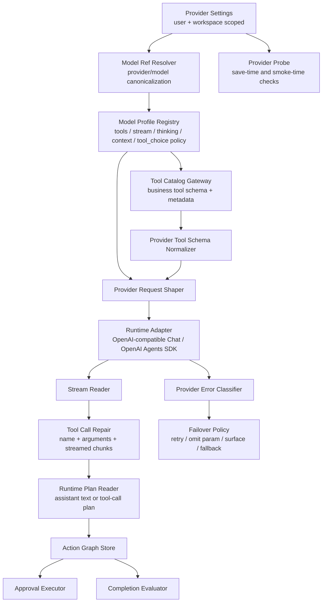
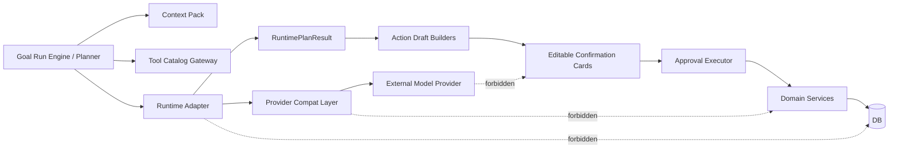

# ADR 0005: OpenClaw-Inspired Provider Runtime 兼容层

Status: Implemented

Date: 2026-05-19

Superseded runtime detail: ADR 0024 (`OpenClaw-First Provider Runtime Capability Layer`) is the current implementation target for provider-owned thinking, replay and stream capability hooks. This ADR remains the baseline provider compatibility decision.

## Context

xox-model 的 Agent OS 已经具备 Tool Catalog Gateway、provider-native tool calls、Action Graph、可编辑确认卡、Goal Run Engine、Completion Evaluator、SSE run trace、租户级 provider settings 和真实 DeepSeek smoke。但是当前 OpenAI-compatible runtime 仍然把很多 provider 差异压在 `openai-compatible-chat-adapter.ts` 内：

- `tool_choice` 只有全局 `auto` 和失败后 omit 的临时处理，缺少 per-provider / per-model capability policy。
- tool-call repair 只覆盖基础 streaming merge 和 `JSON.parse`，缺少成熟的流式 arguments 修复与工具名归一化。
- provider error 只粗分 HTTP/network/timeout/response parse，缺少 provider-scoped rate limit、billing、format、context overflow、unsupported parameter 分类。
- 保存模型配置时没有 provider probe，因此用户填入 DeepSeek、Qwen、Doubao、Kimi、GLM、vLLM 后，只有真正跑任务才知道 tools/stream/thinking 是否可用。

OpenClaw 官方仓库是 MIT License。它的 provider runtime 设计已经很好地解决了多 provider/model 支持问题。参考来源：

- Repository: `https://github.com/openclaw/openclaw`
- Docs: `https://openclawdoc.com/`
- License: MIT, `LICENSE`
- Relevant local research files:
  - `docs/concepts/model-providers.md`
  - `docs/concepts/model-failover.md`
  - `docs/plugins/sdk-provider-plugins.md`
  - `docs/providers/deepseek.md`
  - `docs/providers/qwen.md`
  - `docs/providers/vllm.md`
  - `docs/providers/moonshot.md`
  - `src/agents/pi-embedded-runner/model.ts`
  - `src/agents/pi-embedded-runner/extra-params.ts`
  - `src/agents/pi-embedded-runner/run/attempt.tool-call-normalization.ts`
  - `src/agents/pi-embedded-runner/run/attempt.tool-call-argument-repair.ts`
  - `src/agents/pi-embedded-runner/run/failover-policy.ts`

## Decision

采用 OpenClaw-style provider runtime 兼容层，但不引入 OpenClaw control plane、不迁移业务工具、不让 OpenClaw runtime 拥有 xox-model 的业务执行权。

本项目将优先复用 OpenClaw 的成熟设计和 MIT 可移植代码片段，方式分三层：

1. **架构复用**：吸收 canonical `provider/model`、model profile、provider hooks、request shaping、tool-call repair、provider-scoped failover、live probe 的边界。
2. **代码移植**：只选择小型、纯函数、低耦合模块移植或重写为 xox-model 命名风格，并保留 MIT attribution。候选包括 tool schema normalization、tool-call name normalization、streamed argument repair、provider error classifier。
3. **不直接依赖 OpenClaw app runtime**：OpenClaw 是 gateway/control-plane 产品，包含 CLI、plugin registry、auth profile filesystem、multi-channel routing 和自己的 runner state。xox-model 是 SaaS 业务 Agent OS，必须保留 server-owned thread/action/evaluation/audit/domain boundaries。

## Target Architecture



The runtime layer remains provider-neutral:



## Module Plan

All paths are proposed implementation targets.

| Module | Path | Responsibility | OpenClaw reuse stance |
| --- | --- | --- | --- |
| Model Ref Resolver | `apps/api/src/agent/runtime/provider-model-ref.ts` | Normalize `provider/model`, keep bare model ids strict or explicitly resolved from current provider. | Reuse design from OpenClaw model selection docs, implement locally. |
| Model Profile Registry | `apps/api/src/agent/runtime/provider-model-profile.ts` | Built-in capability profiles for DeepSeek, Qwen, Doubao/Volcengine, Moonshot/Kimi, GLM, OpenAI, OpenRouter, vLLM, generic OpenAI-compatible. | Reuse catalog fields and compat vocabulary; do not import OpenClaw catalog wholesale. |
| Provider Request Shaper | `apps/api/src/agent/runtime/provider-request-shaper.ts` | Decide `tool_choice`, `parallel_tool_calls`, `thinking`, `extra_body`, max tokens and stream flags from model profile. | Port patterns from `extra-params.ts`, not full module. |
| Tool Schema Normalizer | `apps/api/src/agent/runtime/provider-tool-schema.ts` | Normalize JSON schemas for provider restrictions while preserving registry metadata. | Candidate for direct MIT-derived small-function port from `plugin-sdk/provider-tools.ts`. |
| Tool Call Repair | `apps/api/src/agent/runtime/tool-call-repair.ts` | Repair provider tool-call name/id shape and streamed JSON arguments after provider has semantically selected a tool. | Candidate for direct MIT-derived port from `attempt.tool-call-normalization.ts` and `attempt.tool-call-argument-repair.ts`. |
| Error Classifier | `apps/api/src/agent/runtime/provider-error-classifier.ts` | Classify unsupported param, auth, billing, rate limit, timeout, context overflow, format errors. | Reuse OpenClaw failover taxonomy; implement only needed provider cases first. |
| Provider Probe | `apps/api/src/agent/runtime/provider-probe.ts` | Probe saved provider config for auth, base URL, model existence, stream and tool-call support. | Reuse OpenClaw `models status --probe` principle; implement SaaS API endpoint locally. |
| Runtime Adapter | `apps/api/src/agent/runtime/openai-compatible-chat-adapter.ts` | Becomes orchestration-only: build shaped request, stream, call repair/classifier, return `RuntimePlanResult`. | Refactor existing code; do not duplicate adapter paths. |

## Provider Profiles

Provider profiles are not prompt instructions. They are runtime facts.

Initial profile fields:

```ts
type ProviderModelProfile = {
  provider: string
  model: string
  apiFamily: 'openai-compatible-chat' | 'openai-responses' | 'openai-agents-sdk'
  supportsTools: boolean
  supportsStreaming: boolean
  supportsParallelToolCalls: boolean
  toolChoicePolicy: 'omit' | 'auto' | 'required-allowed' | 'never'
  thinking?: {
    mode: 'none' | 'binary' | 'reasoning-effort' | 'provider-extra-body'
    disabledPayload?: Record<string, unknown>
  }
  schemaProfile?: 'openai-strict' | 'gemini' | 'deepseek' | 'generic-json-schema'
  replayPolicy?: 'openai-compatible' | 'deepseek-v4-thinking' | 'moonshot-thinking' | 'generic'
  contextWindow?: number
  maxOutputTokens?: number
}
```

First-class profiles:

| Provider | Default model examples | Important policy |
| --- | --- | --- |
| `deepseek` | `deepseek-v4-pro`, `deepseek-v4-flash`, `deepseek-chat`, `deepseek-reasoner` | Do not force named `tool_choice`; V4 thinking/tool replay needs `reasoning_content` handling; unsupported `tool_choice` should be classified and shaped away. |
| `qwen` | `qwen3.5-plus`, `qwen3.6-plus`, `qwen3-coder-plus` | OpenAI-compatible transport; thinking maps to DashScope `enable_thinking`; endpoint differs by region/subscription. |
| `doubao` / `volcengine` | provider-specific model ids | OpenAI-compatible transport, but request params must be profile-owned, not global. |
| `moonshot` / `kimi` | `kimi-k2.6`, `kimi-k2-thinking` | Thinking mode only supports `tool_choice` auto/none; incompatible values must normalize before request. |
| `glm` / `zai` | GLM coding/general models | Keep tool streaming and schema quirks profile-owned. |
| `vllm` | arbitrary local model ids | Local OpenAI-compatible provider; `tool_choice: required` may be a per-model workaround, never global. |
| `openai` | GPT models | Native OpenAI/Agents SDK path may support richer params; still returns provider-neutral plan results. |

## Reuse Rules

OpenClaw code can be reused only when all conditions hold:

- The source is MIT-licensed and attribution is preserved in file comments or `docs/operations.md` dependency notes when substantial portions are copied.
- The imported logic is small, pure, and testable without OpenClaw runtime state.
- The xox-model module exposes project-native types and does not leak OpenClaw plugin/runtime types into contracts, domain, DB schema, or React.
- Tests include OpenClaw-inspired edge cases plus xox-model provider smoke cases.
- Business execution remains behind Action Draft Builder, editable confirmation cards, Approval Executor, domain services and audit logs.

Do not reuse:

- OpenClaw CLI, channel gateway, plugin registry runtime, filesystem auth-profile store, session override store, app-server harness, or control-plane model picker.
- Any OpenClaw module that requires its runner transcript, plugin state, hook runner, multi-channel delivery, or gateway config graph as a runtime dependency.

## Design Principles

1. **Model owns semantic tool selection**  
   The model chooses business tools via provider-native `tool_calls`. The provider compatibility layer only repairs provider formatting after the choice is made.

2. **Provider differences are runtime facts**  
   `tool_choice`, thinking payloads, schema cleanup, context limits and stream behavior belong to provider/model profile, not planner prompts or scattered adapter branches.

3. **Probe before trust**  
   Saving a provider setting should optionally run a low-cost probe. Complex Agent OS tasks should refuse to claim “configured model works” until tool-call support has been observed.

4. **Fail visibly on format errors**  
   Unsupported parameters, bad schema and invalid model names should surface as provider configuration problems. Retry/fallback is for transient or classified recoverable failures.

5. **SaaS isolation outranks provider convenience**  
   Provider settings, API keys, memory and thread state stay scoped by user/workspace. OpenClaw-style auth profile rotation is useful later, but it must be rebuilt on top of SaaS tables, not filesystem profiles.

## Implementation Milestones

1. **Provider profile foundation**
   - Edit: `runtime-adapter.ts`, new `provider-model-ref.ts`, `provider-model-profile.ts`.
   - Validation: unit tests for provider/model normalization and default DeepSeek/Qwen/Kimi/vLLM profiles.

2. **Request shaper**
   - Edit: new `provider-request-shaper.ts`, refactor `openai-compatible-chat-adapter.ts`.
   - Validation: tests prove DeepSeek reasoner does not receive unsupported `tool_choice`; Kimi thinking normalizes incompatible tool choice; vLLM can opt into `required` only per model.

3. **Tool schema and tool-call repair**
   - Edit: new `provider-tool-schema.ts`, `tool-call-repair.ts`.
   - Validation: streamed partial JSON arguments, prefixed tool names, blank ids, and strict schema cleanup tests.

4. **Provider error classifier and failover policy**
   - Edit: new `provider-error-classifier.ts`, `provider-failover-policy.ts`, `runtime-plan-reader.ts`.
   - Validation: unsupported parameter returns actionable UI message; timeout and transient server errors retry within budget; auth/key mismatch remains visible.

5. **Provider probe**
   - Edit: `provider-settings.ts`, `routes.ts`, new `provider-probe.ts`, React provider settings panel.
   - Validation: save-time or manual probe reports auth/model/tool/stream status without leaking keys.

6. **Real-provider smoke matrix**
   - Edit: `real-provider-smoke.ts`.
   - Validation: DeepSeek V4 real smoke remains green; provider-agnostic fake server covers Qwen/Kimi/vLLM shaping; no business tool code changes when switching provider.

## Acceptance Criteria

- No forced named `tool_choice` exists in the generic OpenAI-compatible adapter.
- Provider request body is produced by `ProviderRequestShaper`, based on `ProviderModelProfile`.
- Tool-call repair is provider-output-only and contains no natural-language intent routing.
- DeepSeek `deepseek-v4-pro` complex Agent OS smoke still passes.
- A provider returning `does not support this tool_choice` is handled by profile/shaper/classifier, not by hidden semantic fallback.
- Saving or testing provider config can produce a redacted probe result for auth/model/tool/stream capability.
- Switching between DeepSeek, Qwen, Doubao, Kimi/GLM/vLLM-style OpenAI-compatible providers does not require changes to business tools, action drafts, confirmation cards, evaluator or domain services.
- All reused OpenClaw-derived code carries MIT attribution when substantial code is copied.

## Consequences

Benefits:

- Moves provider compatibility out of ad hoc adapter branches.
- Makes model capability visible and testable.
- Enables faster support for new OpenAI-compatible vendors without weakening business safety.
- Preserves xox-model's evaluator-centered SaaS harness instead of adopting an external control plane.

Costs:

- More small runtime modules and tests.
- Provider profile data must be kept current.
- Direct OpenClaw updates will not automatically flow in unless we intentionally re-port changes.

## Relationship To Earlier ADRs

This ADR refines ADR 0001-0004. It does not replace the evaluator-centered harness. The Goal Run Engine, Completion Evaluator, Action Graph, editable confirmation cards, tenant-scoped memory and audit logs remain the product core. OpenClaw informs the provider runtime compatibility layer only.

## Implementation Notes

Implemented modules:

- `apps/api/src/agent/runtime/provider-model-ref.ts`
- `apps/api/src/agent/runtime/provider-model-profile.ts`
- `apps/api/src/agent/runtime/provider-request-shaper.ts`
- `apps/api/src/agent/runtime/provider-tool-schema.ts`
- `apps/api/src/agent/runtime/tool-call-repair.ts`
- `apps/api/src/agent/runtime/provider-error-classifier.ts`
- `apps/api/src/agent/runtime/provider-failover-policy.ts`
- `apps/api/src/agent/runtime/provider-probe.ts`
- `apps/api/src/agent/runtime/openai-compatible-chat-adapter.ts`

Validation coverage:

- `apps/api/tests/provider-runtime.test.ts` covers provider/model canonicalization, per-provider profiles, request shaping, schema normalization, provider-output repair, error classification and retry policy.
- `apps/api/tests/api.test.ts` covers tenant-scoped provider probe, redacted provider setting responses, DeepSeek-style `tool_choice` rejection retry, provider assistant text and authentication failure surfacing.
- `apps/api/tests/agent-architecture.test.ts` now locks all provider runtime modules against DB, route, approval, executor and business-domain imports.

DeepSeek V4 note:

- DeepSeek V4 Pro supports `tools/tool_calls` and thinking mode. The runtime does not persist or expose provider reasoning content. Probe requests may explicitly disable provider thinking to keep capability checks low cost; normal Agent planning leaves model reasoning policy to the configured provider/model profile and request budget.
