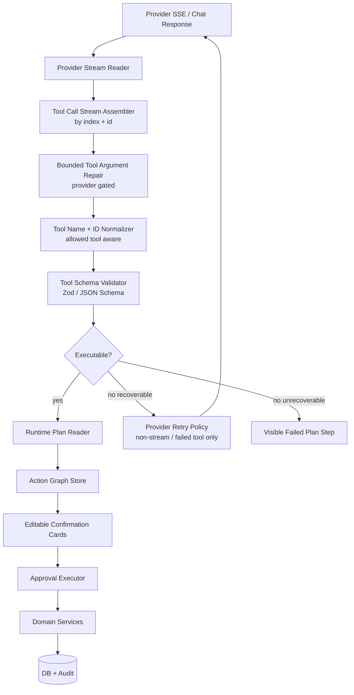
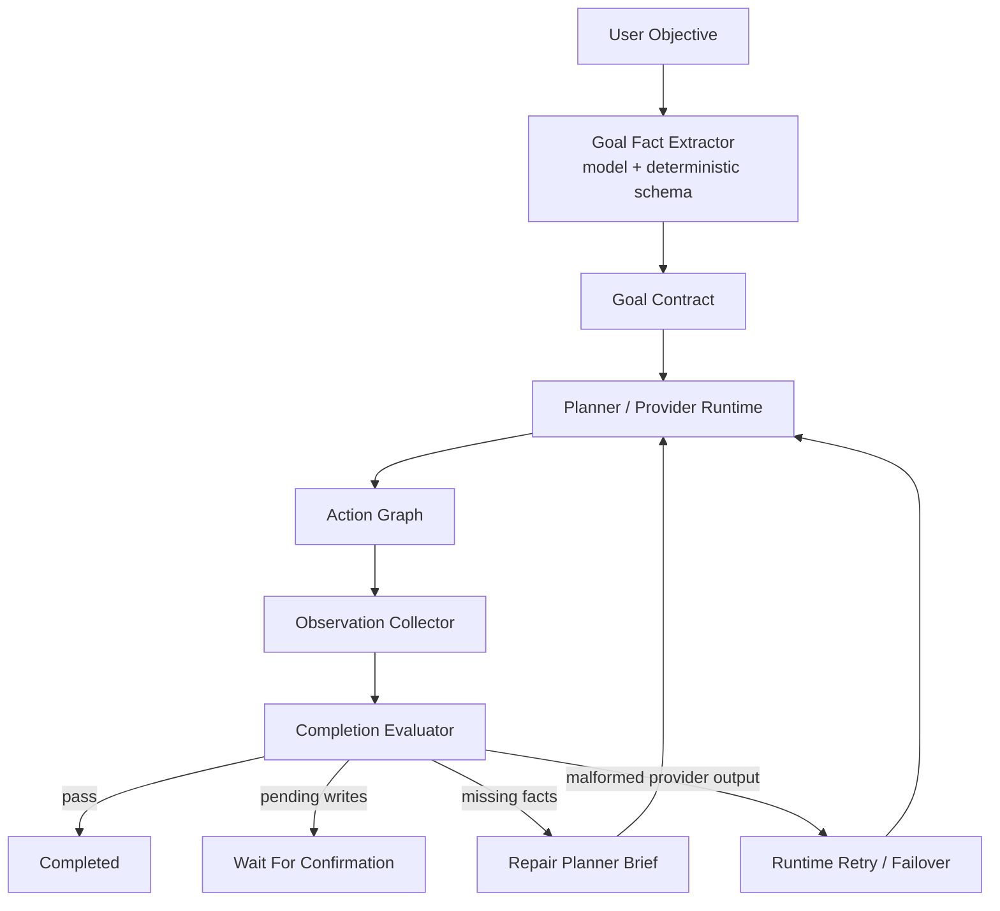
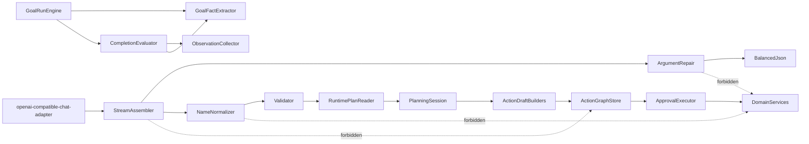

# ADR 0006: OpenClaw-Style Streamed Tool-Call Repair And Complex Goal Runtime

Status: Accepted / Implemented

Date: 2026-05-20

Implementation note: implemented in the TypeScript API runtime on 2026-05-20. The implementation ports the small OpenClaw-style pure-runtime patterns into xox-model modules, keeps OpenClaw out of the dependency graph, and validates behavior with provider-runtime tests, API integration tests, and real-provider smoke.

## Context

xox-model 的 Agent OS 已经采用 provider-native `tool_calls`、Tool Catalog Gateway、Action Graph、可编辑确认卡、Approval Executor、Goal Run Engine 和 Completion Evaluator。最近一次网页高自动化复杂任务暴露了一个更具体的问题：

- DeepSeek 流式输出先返回了 `workspace_rename`。
- 同一轮里第二个长参数工具 `workspace_configure_operating_model` 的 JSON arguments 在 streaming/parse 阶段损坏。
- runtime 旧实现丢失了“失败的是第二个工具”的事实，retry 错误地只重试了第一个已观察到的 `workspace_rename`。
- action graph 被错误缩窄成一个成功 rename，Completion Evaluator 只评估缩窄后的图，因此误判完成。

这说明 `JSON arguments once streamed can be malformed` 不是边缘问题，而是 Agent harness runtime 的一等边界。复杂任务的正确性不能建立在“provider 一定给出完整 JSON string”这个假设上。

OpenClaw 在这个方向上有成熟实现，且官方仓库为 MIT License。参考来源：

- Repository: `https://github.com/openclaw/openclaw`
- License: MIT, `LICENSE`, copyright Peter Steinberger
- Relevant source files in the researched checkout:
  - `src/agents/pi-embedded-runner/run/attempt.tool-call-argument-repair.ts`
  - `src/agents/pi-embedded-runner/run/attempt.tool-call-normalization.ts`
  - `src/shared/balanced-json.ts`
  - `src/agents/pi-embedded-runner/run/stream-wrapper.ts`
  - `src/agents/transcript-policy.ts`
- Relevant docs:
  - `https://docs.openclaw.ai/concepts/agent-loop`
  - `https://docs.openclaw.ai/reference/transcript-hygiene`
  - `https://docs.openclaw.ai/tools/lobster`
  - `https://docs.openclaw.ai/concepts/experimental-features`

ADR 0005 已经把 provider profile、request shaping、provider probe 和 provider error classifier 作为 provider runtime 兼容层落地。本 ADR 继续收窄到 streamed tool-call repair、validated execution gate、goal fact evaluator 和 typed workflow reuse strategy。

## Decision

采用 OpenClaw-style streamed tool-call repair 设计，但不引入 OpenClaw control plane、runner、plugin registry、filesystem auth profile 或 session store。

xox-model 将复用 OpenClaw 的设计思想，并优先移植小型 MIT 许可纯函数/小模块，而不是从零开始写脆弱的半成品。复用边界如下：

1. **可以直接移植或改写的小模块**
   - balanced JSON extraction
   - bounded streamed argument repair
   - tool-call name/id normalization
   - stream object event wrapper pattern
   - provider-gated transcript/tool-call hygiene strategy

2. **只能借鉴思想，不能直接依赖的系统**
   - OpenClaw embedded runner
   - Gateway/control-plane protocol
   - CLI/channel delivery
   - plugin registry/runtime hooks
   - filesystem auth-profile/session transcript store
   - Lobster embedded workflow runtime as a product dependency

3. **xox-model 必须保留的产品边界**
   - tenant-scoped provider settings
   - server-owned threads/runs/events
   - Action Graph
   - editable confirmation cards
   - Approval Executor
   - domain services
   - audit logs
   - Completion Evaluator

## Why JSON Arguments Break In Streaming

OpenAI-compatible Chat Completions 流式工具调用通常把 `function.arguments` 当成字符串片段发送。这个字段只有在最终拼装完成后才是 JSON。损坏或不可解析通常来自：

- SSE 片段切分导致 JSON 跨 chunk。
- provider/proxy 中断，最后的 closing delimiter 没到。
- provider 把 `.functions.<name>:<index>`、XML/text scaffolding 或短后缀混入 arguments。
- 多个 tool calls 并发 streaming 时，assembler 把不同 `index` 的状态混在一起。
- 工具 schema 太大或工具数量太多，使弱 OpenAI-compatible 后端产生半结构化输出。
- client parser 在 final snapshot 之前就把 partial tool call 当成 executable input。

因此，streamed tool-call arguments 的原则是：

> Stream is progress, final validated tool call is executable state.

流式内容只能用于实时展示和诊断。进入 Action Graph 前必须经过 per-tool-call assembler、bounded repair、schema validation 和 provider-aware retry/fail-closed。

## OpenClaw Practice Summary

OpenClaw 的相关实现体现了几个关键思想：

1. **per-content-index buffering**
   `attempt.tool-call-argument-repair.ts` 为每个 `contentIndex` 维护 partial JSON，不把不同 tool-call 的 delta 混在一起。

2. **bounded repair**
   它设置最大 repair buffer、最大 leading prefix、最大 trailing suffix，只修复已知 provider 污染形态，不做无限宽松 JSON 猜测。

3. **balanced JSON extraction**
   `balanced-json.ts` 用 bracket stack、string state、escape state 找完整 JSON object/array，而不是简单找第一个 `{` 和最后一个 `}`。

4. **patch all stream surfaces**
   修复成功后同步 patch partial message、streamed tool call、tool-call end message 和 final result，避免 UI 预览与 executor 输入不一致。

5. **provider-gated enablement**
   不是所有 provider 都启用同一种 repair。OpenClaw 通过 provider/model API policy 判断何时启用，例如 OpenAI Completions、Codex Responses、Azure Responses、Kimi Anthropic-compatible 等。

6. **tool name/id normalization is separate**
   工具名 trim、provider 前缀归一、从 tool-call id 推断工具名、unknown-tool loop guard 和 replay sanitization 被放在独立边界，而不是混进业务 intent 解析。

7. **transcript hygiene**
   OpenClaw 对历史 tool calls、tool results、reasoning/thinking metadata、provider-specific turn ordering 做 replay 前清理，保证下一轮工具调用不会被坏历史污染。

8. **typed workflow for deterministic complexity**
   Lobster 展示了另一条路线：复杂多步骤、审批、resume 的流程不必都让 LLM 逐步调工具；可以让模型生成/选择 typed workflow，workflow runtime 负责可审计执行。

## Target Architecture



Complex goal loop:



## Module Division

| Module | Path | Responsibility | OpenClaw reuse |
| --- | --- | --- | --- |
| Balanced JSON | `apps/api/src/agent/runtime/balanced-json.ts` | Extract complete JSON object/array from polluted streamed text. | Candidate for MIT-derived port from `src/shared/balanced-json.ts`. |
| Stream Assembler | `apps/api/src/agent/runtime/tool-call-stream-assembler.ts` | Accumulate `delta.tool_calls` by `index/id`, preserve failed tool identity, emit final candidates only. | Local implementation, informed by OpenClaw stream wrapper pattern. |
| Argument Repair | `apps/api/src/agent/runtime/tool-call-argument-repair.ts` | Bounded provider-gated repair of malformed arguments before validation. | Candidate for MIT-derived port from `attempt.tool-call-argument-repair.ts`. |
| Name Normalizer | `apps/api/src/agent/runtime/tool-call-name-normalizer.ts` | Trim/prefix/id-based tool name normalization against allowed provider tool names. | Candidate for MIT-derived port from `attempt.tool-call-normalization.ts`, reduced to xox needs. |
| Tool Call Validator | `apps/api/src/agent/runtime/tool-call-validator.ts` | Validate repaired arguments against provider tool schemas and internal contracts. | Local implementation using current registry/Zod. |
| Runtime Retry Policy | `apps/api/src/agent/runtime/provider-failover-policy.ts` | Retry failed tool only, non-stream fallback, unsupported parameter shaping, visible failure. | Extends ADR 0005 implementation. |
| Goal Fact Extractor | `apps/api/src/agent/goal-fact-extractor.ts` | Extract objective facts such as member count, horizon, required/no-publish constraints. | Local business harness module, not OpenClaw. |
| Evaluator Fact Checks | `apps/api/src/agent/completion-evaluator.ts` | Compare original goal facts against domain state/action graph, not only generated graph. | Local business harness module, not OpenClaw. |
| Typed Operating Workflow | `apps/api/src/agent/workflows/operating-model-workflow.ts` | Optional deterministic workflow for large operating model setup. | Inspired by Lobster, implemented as xox domain workflow. |

## Dependency Graph



Runtime repair modules must not import DB, routes, domain services, confirmation services, or React contracts beyond shared tool schema types. They are transport hygiene modules only.

## Reuse And Attribution Policy

OpenClaw is MIT-licensed, so code can be reused if we preserve license terms. Since xox-model currently has no third-party notice file, the first implementation that copies substantial OpenClaw code must add one of:

- `docs/third-party-notices.md`, or
- source-file comments containing the MIT attribution and original source path.

Required attribution shape for substantially derived source files:

```ts
// Portions derived from OpenClaw (MIT License)
// Source: https://github.com/openclaw/openclaw
// Original file: src/shared/balanced-json.ts
// Copyright (c) 2025 Peter Steinberger
```

When the implementation only copies an idea but rewrites code independently, cite ADR 0006 and source links in comments only if helpful.

Do not vendor the OpenClaw repository or add it as a runtime dependency. The repo is a full product, not a small library.

## Execution Semantics

1. Provider stream events may update UI trace.
2. Partial tool-call arguments are never executable.
3. A tool call becomes executable only after:
   - stream ended or non-stream response returned,
   - arguments are assembled,
   - bounded repair either succeeds or is not needed,
   - tool name is normalized against projected allowed tool names,
   - arguments pass schema validation,
   - failed tool identity is preserved for retry if validation fails.
4. On recoverable streamed JSON failure:
   - retry once as non-streaming,
   - project only the failed provider-selected tool when known,
   - otherwise retry the selected capability bucket, not the entire large catalog.
5. On unrecoverable failure:
   - persist a failed plan step with provider diagnostic,
   - do not create partial confirmation cards,
   - evaluator must not mark the goal as complete.

## Complex Goal Semantics

For large prompts such as “星河 50 期启动测算”, the harness must not rely only on what the model happened to emit as action graph. It must also preserve a goal contract with objective facts.

Initial goal facts:

```ts
type AgentGoalFacts = {
  workspaceName?: string
  expectedMemberCount?: number
  expectedEmployeeRoles?: string[]
  expectedShareholderCount?: number
  expectedHorizonMonths?: number
  expectedStartMonth?: number
  requiresForecastSummary?: boolean
  forbiddenActions?: Array<'publish_release' | 'share_link' | 'account_action'>
  requiredCapabilities?: Array<'workspace_rename' | 'operating_model' | 'ledger' | 'version' | 'share'>
}
```

Evaluator must compare these facts against observation:

- If objective requires 50 members and current draft has only renamed workspace, status is `continue`, not `pass`.
- If objective says “先不要发布正式版本”, any release/share action is a blocking policy finding.
- If objective requires 12-month forecast summary, assistant text alone is not enough; domain projection must be computable and summary values must be present in run output.
- If objective requires editable confirmation cards and automation is not high, pending cards are expected and evaluator should return `needs_confirmation`.

## Typed Workflow Option

OpenClaw Lobster shows that deterministic workflows are better for repeatable multi-step processes with approval/resume. xox-model should not import Lobster, but can build domain-native typed workflows for business-heavy operations.

Candidate:

```ts
type OperatingModelWorkflowInput = {
  workspaceName: string
  planning: { startMonth: number; horizonMonths: number }
  shareholders: ShareholderInput[]
  memberSegments: MemberSegmentInput[]
  employees: EmployeeInput[]
  fixedCosts: CostInput[]
  perEventCosts: CostInput[]
  perUnitCosts: CostInput[]
  startupCosts: CostInput[]
  monthlyRhythm: MonthlyRhythmInput[]
  specialEvents: SpecialEventInput[]
  assumptions: string[]
}
```

The model's job is to call `workspace_configure_operating_model` with this typed input or to ask clarification. The workflow's job is:

- expand segments to 50 editable members,
- map assumptions into domain config,
- compute forecast preview,
- generate a single high-level editable confirmation card or multiple domain cards based on product mode,
- expose all approximations in confirmation card metadata,
- let evaluator verify facts after execution.

This keeps LLM semantic understanding while moving deterministic expansion and validation into application code.

## Implementation Plan

1. **Document and tests first**
   - This ADR is the design source.
   - Add tests for streamed argument repair before touching runtime behavior.

2. **Port balanced JSON**
   - Add `balanced-json.ts`.
   - Include MIT attribution if code is substantially derived.
   - Validate strings, escapes, nested arrays/objects, polluted prefix/suffix.

3. **Extract stream assembler**
   - Move current stream merge logic out of `openai-compatible-chat-adapter.ts`.
   - Preserve per-tool-call failure identity.
   - Return structured `assembled`, `malformed`, and `repairable` records.

4. **Add bounded argument repair**
   - Provider/profile gated.
   - Repair only known pollution shapes.
   - Emit `provider_tool_call_repaired` trace with redacted metadata.

5. **Add executable gate**
   - No Action Graph persistence before final validation.
   - Invalid final calls become failed plan steps or targeted retry.

6. **Strengthen evaluator with goal facts**
   - Extract objective facts at run start.
   - Add deterministic checks for complex operating model requirements.
   - Ensure “rename only” cannot pass a 50-member/12-month goal.

7. **Real and fake-provider verification**
   - Fake provider: split/malformed multi-tool stream.
   - Fake provider: polluted prefix/suffix arguments.
   - Real DeepSeek: complex operating model smoke.

## Implemented Modules

- `apps/api/src/agent/runtime/balanced-json.ts`
  - Extracts complete balanced JSON object/array from polluted provider text.
  - Carries OpenClaw MIT attribution because it follows the same small pure-module pattern.
- `apps/api/src/agent/runtime/tool-call-argument-repair.ts`
  - Parses exact JSON first, then applies provider-profile-gated bounded repair.
  - Enforces max buffer, max leading prefix, and max trailing suffix.
  - Rejects incomplete streamed JSON instead of creating partial confirmation cards.
- `apps/api/src/agent/runtime/tool-call-name-normalizer.ts`
  - Normalizes provider tool names/id prefixes against the allowed projected tool list.
  - This is provider format hygiene, not business intent routing.
- `apps/api/src/agent/runtime/tool-call-stream-assembler.ts`
  - Accumulates streamed `delta.tool_calls` per index/id before any execution.
- `apps/api/src/agent/runtime/tool-call-validator.ts`
  - Central executable gate from provider tool calls to internal planner steps.
- `apps/api/src/agent/runtime-planning-call.ts`
  - Detects high-volume structured planning turns that include `workspace_configure_operating_model`.
  - Uses non-streaming long-budget planning for those turns so provider SSE does not have to carry very large tool-call argument strings.
- `apps/api/src/agent/goal-fact-extractor.ts`
  - Stores hard objective facts in `AgentGoalContract.facts`.
  - Extracts facts such as workspace name, member count, shareholder count, start month, horizon, forecast-summary requirement, and no-publish/no-share constraints.
- `apps/api/src/agent/workspace-action-drafts.ts`
  - Uses extracted goal facts as a deterministic safety net for high-level operating-model confirmation cards, so a model that omits `plan.workspaceName` from a large argument still produces the requested project/workspace name.
- `apps/api/src/agent/completion-evaluator.ts`
  - Compares original goal facts against domain observation and action graph.
  - Prevents rename-only completion when the original objective asks for a 50-member/12-month operating model.
- `apps/api/src/agent/observation-collector.ts`
  - Re-reads current workspace state during evaluation so renamed workspace facts are evaluated against live DB state, not the stale run-start row.

## Implemented Validation

- `apps/api/tests/provider-runtime.test.ts`
  - Validates balanced JSON extraction, disabled repair failure, bounded repair success, unbounded pollution rejection, incomplete JSON rejection, and failed-tool identity preservation.
- `apps/api/tests/api.test.ts`
  - Validates targeted non-stream retry for malformed `workspace_configure_operating_model` after a streamed `workspace_rename`.
  - Validates prefix/suffix-polluted streamed arguments are repaired before confirmation cards are created.
  - Validates complex goal facts force a second repair loop after rename-only output.
  - Keeps extended provider budget behavior stable for complex structured planning turns, including the stable non-streaming path for large operating-model arguments.
- `apps/api/tests/agent-architecture.test.ts`
  - Guards the new runtime modules against DB/routes/domain execution imports.

## Acceptance Criteria

- `workspace_rename` followed by malformed streamed `workspace_configure_operating_model` retries the failed operating-model tool, not rename.
- Prefix/suffix-polluted arguments like `.functions.read:0 {"x":1}x` are repaired only when provider profile allows it and bounds are respected.
- Partial stream tool calls never create confirmation cards.
- A final malformed tool call creates a visible failed plan step or targeted retry, not a silent fake reply.
- Complex goal evaluator fails or continues when objective facts are unmet, even if the shrunken action graph has no failed step.
- DeepSeek V4 Pro complex operating-model smoke passes with real provider tool calls.
- All substantial OpenClaw-derived code carries MIT attribution.
- No runtime module imports OpenClaw package code directly.

## Consequences

Benefits:

- Aligns xox-model provider runtime with proven OpenClaw practice.
- Makes streamed tool-call corruption recoverable and observable.
- Prevents evaluator false pass after action graph shrinkage.
- Enables future provider support without business-tool rewrites.

Costs:

- More runtime modules and tests.
- Need to maintain attribution for ported code.
- Provider profiles must remain current as vendors change behavior.

## Non-Goals

- Do not introduce Claude Agent SDK.
- Do not replace OpenAI Agents SDK integration.
- Do not import OpenClaw as a dependency.
- Do not use regex/natural-language keyword routing for business intent.
- Do not build a generic workflow DSL unless a domain workflow proves insufficient.

## Relationship To ADR 0005

ADR 0005 is the broad provider runtime compatibility layer and is already implemented. ADR 0006 adds a deeper repair/evaluation layer for streamed tool-call correctness and complex goal completion. It should be implemented as a refinement of existing runtime modules, not as a parallel adapter.
