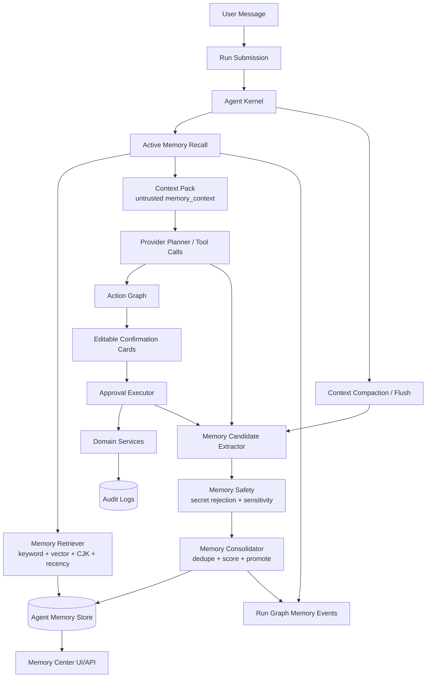
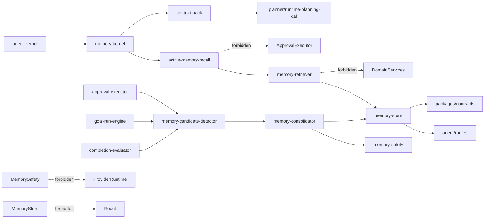

# ADR 0007: OpenClaw-Inspired Tenant-Scoped Memory Kernel

Status: Accepted

Date: 2026-05-20

## Context

xox-model 的 Agent OS 已经有一版基础 memory：

- `agent_memories` 以 `user_id + workspace_id` 隔离。
- `memory_remember` 是 provider-native tool call，不再用正则捕获“记住”。
- `context-pack.ts` 会把同用户 / 同工作区 memory 注入 provider context。
- `memory-candidate-detector.ts` 和 `memory-consolidator.ts` 会从已执行动作中沉淀部分 episodic / procedural memory。
- UI 支持列出和删除 memory。

这套实现证明了产品方向，但还不是成熟的 harness memory runtime：

- 召回仍偏“把所有同租户 memory 放进 context”，缺少 OpenClaw-style active recall、精确检索、预算控制和证据引用。
- 长短期记忆之间缺少严格的 candidate -> working -> episodic -> semantic/procedural 晋升生命周期。
- compaction 目前是 thread summary，不是 OpenClaw-style pre-compaction memory flush。
- memory 使用没有完整进入 run graph，用户难以知道“本轮用了哪些记忆”。
- 还没有混合检索、CJK-aware retrieval、recall scoring、temporal decay、MMR 和 timeout/circuit breaker。
- 多租户 SaaS 需要比 OpenClaw 本地 filesystem workspace 更强的 tenant isolation、deletion、audit 和 redaction。

OpenClaw 官方仓库是 MIT License。它的 memory 设计已经非常成熟，值得作为 xox-model 的直接范本，但不能作为 drop-in runtime：

- Repository: `https://github.com/openclaw/openclaw`
- License: MIT, `LICENSE`
- Researched checkout: `c8a953af9371f0c1e5980283abf554f89f641fea`
- Relevant docs:
  - `docs/concepts/memory.md`
  - `docs/concepts/active-memory.md`
  - `docs/concepts/memory-builtin.md`
  - `docs/reference/memory-config.md`
- Relevant source files:
  - `extensions/memory-core/index.ts`
  - `extensions/active-memory/index.ts`
  - `extensions/memory-core/src/prompt-section.ts`
  - `extensions/memory-core/src/flush-plan.ts`
  - `extensions/memory-core/src/memory/manager.ts`
  - `extensions/memory-core/src/memory/manager-search.ts`
  - `extensions/memory-core/src/memory/hybrid.ts`
  - `extensions/memory-core/src/short-term-promotion.ts`
  - `extensions/memory-core/src/session-search-visibility.ts`
  - `packages/memory-host-sdk/src/host/memory-schema.ts`
  - `packages/memory-host-sdk/src/host/read-file.ts`

## Decision

Adopt an OpenClaw-inspired Memory Kernel for xox-model, but implement it as a SaaS-native, database-backed, tenant-scoped harness module.

The kernel must reuse OpenClaw's mature design and, where safe, port small MIT-licensed pure modules or algorithms with attribution. It must not import OpenClaw's control plane, plugin runtime, filesystem session store, CLI, gateway, or local workspace memory model.

Memory is a first-class harness subsystem, not a prompt trick:

1. **Active Recall before planning**
   - Before provider planning, the harness retrieves only task-relevant memory within the current `user_id + workspace_id` scope.
   - The recall result is injected as untrusted context into the Context Pack.
   - The run graph records memory ids and recall reasoning metadata, not raw provider prompts.

2. **Evidence-based Capture after actions**
   - Executed confirmation cards, evaluator findings, user corrections, completed goals and compaction events generate memory candidates.
   - Candidates keep evidence pointers such as `runId`, `actionRequestId`, `messageId`, `goalId` and domain object references.

3. **Consolidation and Promotion**
   - Working / episodic memory can be promoted to semantic / procedural memory only after safety filtering, dedupe, confidence scoring and repeated usefulness signals.
   - Promotion is explicit and auditable.

4. **User-governed Memory Center**
   - Users can list, search, archive/delete, and inspect memory usage per run.
   - The system can inject memory automatically, but it must never be invisible from an audit/product perspective.

5. **SaaS Isolation**
   - All memory reads and writes are scoped by tenant identity.
   - Cross-user and cross-workspace recall is forbidden unless a future org-level sharing model explicitly authorizes it.

## OpenClaw Practice Summary

OpenClaw's memory design has six important ideas:

1. **File-first durable memory**
   - `MEMORY.md` is curated long-term memory.
   - `memory/YYYY-MM-DD.md` stores daily working memory.
   - `DREAMS.md` and `memory/.dreams/*` store review and promotion state.
   - This makes local memory inspectable and editable.

2. **Indexed retrieval**
   - Memory files are chunked and indexed into SQLite.
   - Builtin retrieval combines FTS5, optional vector search, CJK trigram support, temporal decay and MMR.
   - The agent does not rely on raw transcript stuffing.

3. **Active Memory sub-agent**
   - A `before_prompt_build` hook launches a bounded hidden memory sub-agent.
   - The sub-agent only sees a small query context and only has memory tools such as `memory_search` and `memory_get`.
   - It returns `NONE` or a compact summary that is injected as untrusted context.

4. **Memory tools**
   - `memory_search` finds candidate snippets.
   - `memory_get` reads exact excerpts.
   - The main agent can cite recalled memory instead of guessing from vague summaries.

5. **Flush before compaction**
   - When transcript/context pressure is high, OpenClaw creates a memory flush plan.
   - The flush is append-only and path-restricted so the model cannot write arbitrary files.

6. **Short-term promotion / dreaming**
   - Repeatedly recalled daily notes are scored by recall count, diversity, recency and grounding.
   - High-value memories can be promoted into long-term `MEMORY.md`.

The design intent is not "remember everything"; it is "recall narrowly, capture with evidence, promote only useful and safe memories."

## Why xox-model Must Adapt Instead Of Copy

OpenClaw is optimized for a local agent workspace. xox-model is a SaaS business system. The memory architecture must therefore change in these ways:

| OpenClaw | xox-model |
| --- | --- |
| Markdown files are the durable memory store. | Database rows are the durable memory store. |
| Filesystem path and session visibility are local trust boundaries. | `user_id`, `workspace_id`, optional `org_id` and RBAC are trust boundaries. |
| `MEMORY.md` is the editable surface. | Memory Center UI and API are the editable surface. |
| Active memory is hidden plugin context. | Active memory is injected into prompt but visible in run graph as memory usage. |
| Dreaming can rewrite local memory files. | Consolidation writes structured events and promotes scoped memory records. |
| Session transcripts can be indexed as local artifacts. | Raw provider responses and secrets must not be stored; summaries must be redacted and evidence-based. |

## Target Architecture



## Module Division

The implementation should extend existing code paths instead of creating a parallel memory system.

| Module | Target path | Responsibility | OpenClaw reuse stance |
| --- | --- | --- | --- |
| Memory Kernel | `apps/api/src/agent/memory-kernel.ts` | Orchestrate recall, capture, compaction flush and consolidation for one run. | Local module; adopts OpenClaw lifecycle. |
| Memory Store | split from `apps/api/src/agent/memory.ts` into `memory-store.ts` if needed | Tenant-scoped CRUD, archive, touch, status transitions, DTO serialization. | Local Kysely implementation; no filesystem store. |
| Memory Events | `apps/api/src/agent/memory-events.ts` + migration | Append-only capture/recall/promote/inject/delete event log. | Local; mirrors OpenClaw observability idea. |
| Memory Retriever | `apps/api/src/agent/memory-retriever.ts` | Ranked search over scoped memory rows; later hybrid keyword/vector search. | Candidate to port pure scoring ideas from `memory/hybrid.ts`. |
| Active Recall | `apps/api/src/agent/active-memory-recall.ts` | Bounded pre-planning recall, timeout, cache, circuit breaker, untrusted summary. | Inspired by `extensions/active-memory/index.ts`; do not import plugin runtime. |
| Memory Safety | `apps/api/src/agent/memory-safety.ts` | Secret rejection, redaction, sensitivity classification, provider-injection cleanup. | Local; may reuse regex/policy style only. |
| Candidate Extractor | extend `apps/api/src/agent/memory-candidate-detector.ts` | Extract candidates from executed actions, corrections, evaluator findings, completed goals and compaction. | Local business logic. |
| Consolidator | extend `apps/api/src/agent/memory-consolidator.ts` | Dedupe, score, status transition, promotion and expiry. | Candidate to port scoring concepts from `short-term-promotion.ts`, not filesystem writes. |
| Context Pack Injection | extend `apps/api/src/agent/context-pack.ts` | Inject compact memory context and memory ids into provider context. | Inspired by OpenClaw prompt section; local shape. |
| Run Trace | extend `apps/api/src/agent/run-events.ts` | Emit `memory_recall_started`, `memory_recall_completed`, `memory_injected`, `memory_candidate_stored`, `memory_promoted`. | Local. |
| UI/API Management | `apps/api/src/agent/routes.ts`, `apps/web/src/components/agent/*` | List/search/delete, show memory used in a run. | Local SaaS product surface. |

## Dependency Graph



Memory modules may read/write memory tables and emit run events. They must not execute business tools, mutate drafts, post ledger entries, publish versions, or decide account actions.

## Data Model Direction

The current `agent_memories` table should remain the anchor. It should evolve toward:

```ts
type AgentMemoryItem = {
  id: string
  userId: string
  workspaceId: string
  threadId?: string | null
  scope: 'thread' | 'workspace' | 'user' | 'org'
  kind: 'preference' | 'business_fact' | 'business_rule' | 'workflow' | 'episode' | 'correction'
  memoryType: 'working' | 'episodic' | 'semantic' | 'procedural' | 'commitment'
  status: 'candidate' | 'active' | 'promoted' | 'archived' | 'rejected' | 'expired'
  key: string
  value: string
  evidence: {
    runId?: string
    messageId?: string
    actionRequestId?: string
    goalId?: string
    domainRef?: string
  }
  confidence: number
  sensitivity: 'normal' | 'private' | 'restricted'
  lastUsedAt?: string | null
  promotedAt?: string | null
  expiresAt?: string | null
}
```

Add event tables before adding advanced retrieval:

```ts
type AgentMemoryEvent = {
  id: string
  memoryId?: string | null
  userId: string
  workspaceId: string
  threadId?: string | null
  runId?: string | null
  eventType: 'captured' | 'recalled' | 'injected' | 'promoted' | 'rejected' | 'archived' | 'expired'
  evidenceJson?: string | null
  metadataJson?: string | null
  createdAt: string
}
```

Embeddings are optional in the first implementation but the schema should allow:

```ts
type AgentMemoryEmbedding = {
  memoryId: string
  provider: string
  model: string
  vector: unknown
  contentHash: string
  createdAt: string
}
```

## Active Recall Semantics

Active recall runs before the planner receives provider context.

Inputs:

- current user message,
- current goal contract,
- bounded recent messages,
- current workspace id,
- selected capabilities when available,
- redacted context summary.

Allowed tools:

- `memory_search`
- `memory_get`

Forbidden:

- draft writes,
- ledger writes,
- version/share actions,
- provider setting writes,
- account actions,
- arbitrary DB queries,
- web/network tools.

Output:

```ts
type ActiveMemoryRecallResult = {
  injectedSummary: string | null
  usedMemoryIds: string[]
  skippedReason?: 'disabled' | 'timeout' | 'circuit_open' | 'no_relevant_memory' | 'no_provider'
  confidence: number
}
```

The injected prompt section must be marked as data, never instructions:

```xml
<memory_context trust="untrusted" scope="current_user_current_workspace">
...
</memory_context>
```

Provider prompts must say that memory context is background evidence and must not override current user instructions, tenant boundaries, confirmation policies or tool schemas.

## Capture And Promotion Semantics

Memory capture is active, not only explicit `memory_remember`.

Capture sources:

- confirmed business actions,
- cancelled or edited confirmation cards,
- user corrections,
- evaluator findings,
- completed complex goals,
- compaction flush,
- explicit `memory_remember` tool call.

Candidate rules:

- Store candidates with evidence before promotion.
- Reject secrets before storage.
- Redact secrets before provider injection.
- Do not store raw provider hidden reasoning.
- Do not store raw API keys, tokens, credentials, payment info or personal secrets.
- Do not promote one-off ledger rows into semantic defaults.

Promotion rules:

- A memory can be promoted when it is repeatedly recalled, recently useful, backed by execution evidence, or explicitly confirmed by the user.
- Promotion should preserve source evidence and write a memory event.
- Procedural memory should affect tool/context hints only through the harness; it must not become prompt-only hidden policy.

## Reuse And Attribution Policy

OpenClaw code can be reused only when all conditions hold:

- The source is MIT-licensed and attribution is preserved.
- The imported logic is small, pure, and testable without OpenClaw runtime state.
- The xox-model module exposes project-native types.
- No OpenClaw plugin/runtime/session/filesystem types leak into contracts, domain, DB schema or React.
- Tests include both OpenClaw-inspired edge cases and xox-model SaaS isolation cases.

Eligible for direct port or close adaptation:

- Hybrid ranking / score merge / MMR concepts from `extensions/memory-core/src/memory/hybrid.ts`.
- CJK-aware query normalization and FTS fallback concepts from `manager-search.ts`.
- Active recall timeout/cache/circuit breaker pattern from `extensions/active-memory/index.ts`.
- Short-term promotion scoring concepts from `short-term-promotion.ts`.
- Prompt-section wording pattern from `prompt-section.ts`, rewritten for SaaS untrusted context.

Not eligible as dependencies:

- OpenClaw memory plugin registry.
- `MEMORY.md` / daily Markdown as primary storage.
- Filesystem auth/session/transcript store.
- Hook runner and plugin config graph.
- CLI memory commands.
- Session visibility guard as-is; xox-model needs DB tenant and RBAC checks.
- Dreaming file writer as-is.

If substantial source is copied, add source comments or `docs/third-party-notices.md`:

```ts
// Portions derived from OpenClaw (MIT License)
// Source: https://github.com/openclaw/openclaw
// Original file: extensions/memory-core/src/memory/hybrid.ts
// Copyright (c) 2025 Peter Steinberger
```

## Naming And Style

- Public contract types use `AgentMemory*`.
- Backend modules use `memory-*` filenames under `apps/api/src/agent`.
- Run events use `memory_*` event type names.
- Memory values in provider context are called `memory_context`, not `system_memory`, to avoid implying instruction authority.
- Business facts use domain names from xox-model: workspace, draft, ledger, version, shareholder, member, employee, forecast.
- Avoid OpenClaw-specific terms in product UI unless they are internal references. For example, use “记忆晋升” or “长期记忆” instead of “dreaming”.

## Acceptance Criteria

Implementation of this ADR is complete only when:

- Active memory recall runs before provider planning without requiring the user to say “记住”.
- Recall is scoped by `user_id + workspace_id`; tests prove cross-user and cross-workspace memory is not injected.
- Memory usage is visible in the run graph, including memory ids and whether recall was skipped, timed out or injected.
- Explicit `memory_remember` still works through provider-native tool calls and server-side validation.
- Confirmed actions, user corrections, evaluator findings and completed goals generate memory candidates with evidence pointers.
- Secrets are rejected before long-term storage and redacted before provider injection.
- Users can list, search and archive/delete memory from the product UI/API.
- Compaction creates evidence-backed memory candidates or summaries instead of only losing old context into a thread-local summary.
- Hybrid or ranked retrieval is tested with Chinese business terms and does not rely on substring-only matching.
- Promotion from episodic to semantic/procedural memory is deterministic enough to test.
- OpenClaw-derived code, if copied substantially, carries MIT attribution.
- No memory module imports OpenClaw as a runtime dependency.
- The Agent cannot execute business writes from memory recall; writes still flow through action graph, editable confirmation cards, approval executor, domain services and audit logs.

## Implementation Plan

1. **Stabilize the Memory Kernel boundary**
   - Keep `memory.ts` as the current store façade or split it into `memory-store.ts` only if it improves readability.
   - Add `memory-kernel.ts` to coordinate recall/capture/consolidation.
   - Validation: architecture tests prevent memory recall modules from importing approval executor or domain mutation services.

2. **Add memory events and usage trace**
   - Add `agent_memory_events`.
   - Emit run events for recall, injection, capture and promotion.
   - Validation: API tests inspect run graph and memory event rows.

3. **Implement Active Recall**
   - Add `active-memory-recall.ts`.
   - Use a bounded recall budget, cache and circuit breaker.
   - Start with deterministic scoped retrieval; introduce memory sub-agent only when it improves relevance without widening permissions.
   - Validation: new thread receives relevant memory; unrelated memory is not injected.

4. **Add ranked retrieval**
   - Add `memory-retriever.ts`.
   - Port or adapt OpenClaw hybrid ranking ideas where useful.
   - Keep embeddings optional and provider-neutral.
   - Validation: Chinese queries retrieve business facts by meaning/terms, not just insertion order.

5. **Strengthen capture and promotion**
   - Extend candidate detector to user corrections, evaluator findings, completed goals and compaction.
   - Add promotion scoring and dedupe.
   - Validation: repeated useful episodic memory promotes; one-off ledger facts do not become defaults.

6. **Upgrade Memory Center**
   - Show scope, type, confidence, evidence and last used time.
   - Add search/filter and archive/delete.
   - Show which memories were used by a run.
   - Validation: frontend tests cover memory list/delete/used-in-run rendering.

7. **Real-provider smoke**
   - Smoke should prove memory injection across new threads, automatic candidate capture after confirmed actions, user deletion preventing future injection, and no secret leakage.

## Non-Goals

- Do not import OpenClaw as a dependency.
- Do not introduce Claude Agent SDK.
- Do not replace OpenAI Agents SDK runtime adapter.
- Do not use filesystem Markdown files as the primary SaaS memory store.
- Do not use memory recall as a hidden permission system.
- Do not let memory override current user instructions, confirmation-card policy, tenant isolation or domain validation.
- Do not implement production semantic routing with regex or keyword enumerations.

## Relationship To Earlier ADRs

This ADR refines ADR 0004's evaluator-centered harness memory requirements and complements ADR 0005 / ADR 0006's OpenClaw-inspired provider runtime work.

ADR 0004 remains the overall Agent OS architecture source. ADR 0007 owns the memory subsystem target architecture.

## Implementation Notes

Not implemented in this change. This ADR is the source document for the next memory refactor.

The current implementation paths to preserve and evolve are:

- `apps/api/src/agent/memory.ts`
- `apps/api/src/agent/memory-candidate-detector.ts`
- `apps/api/src/agent/memory-consolidator.ts`
- `apps/api/src/agent/context-pack.ts`
- `apps/api/src/agent/prompts/memory.system.md`
- `apps/api/src/agent/tool-catalog.ts`
- `apps/api/src/db/migrations.ts`
- `apps/web/src/components/agent/AgentConsole.tsx`
- `apps/web/src/hooks/useAgentThread.ts`
