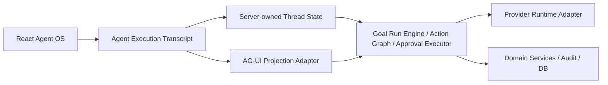

# ADR 0008: AG-UI-Compatible Agent Execution Transcript

Status: Implemented

Date: 2026-05-22

## Context

xox-model 的 Agent OS 已经具备后端主导的 run lifecycle、Goal Run Engine、Action Graph、可编辑确认卡、Memory Kernel、provider token/tool-call stream trace 和 thread state SSE。当前前端也已经能显示：

- `AgentConsole`：对话、provider 设置、自动化级别、记忆中心。
- `AgentPlanTimeline`：运行事件、计划步骤、导航事件和确认卡状态。
- `AgentActionCard`：写入动作确认、取消和 JSON 级编辑。

但这还不够像 Codex、Claude Code、OpenClaw 这类成熟 harness agent 的执行界面：

- 用户发起复杂目标后，仍会感觉自己在等待一个聊天回复，而不是看到一个系统正在逐步执行。
- provider tool-call 参数流、工具等待、工具返回、确认卡中断、确认卡编辑、执行结果、evaluator 修复循环、memory 注入等事件没有被统一成一条可审计 transcript。
- `AgentPlanTimeline` 现在更像 compact debug timeline；它还不是用户可以信任和操作的 execution console。
- 确认卡虽然可编辑，但编辑体验仍偏 JSON 调试面板，缺少业务字段级 diff 和 interrupt/resume 语义。

本 ADR 讨论前端对话与运行图下一阶段形态：xox-model 不是加一个聊天助手，而是把 Agent OS 的运行过程透明展示给用户。

## Mature References

### AG-UI

AG-UI 是当前最贴近本产品需求的开放协议。它把 agent 与前端交互抽象成事件流，覆盖 run lifecycle、text streaming、tool call streaming、state snapshot/delta、messages snapshot、custom events 和 interrupt/HITL。

关键事件模型包括：

- `RUN_STARTED / RUN_FINISHED / RUN_ERROR`
- `STEP_STARTED / STEP_FINISHED`
- `TEXT_MESSAGE_START / TEXT_MESSAGE_CONTENT / TEXT_MESSAGE_END`
- `TOOL_CALL_START / TOOL_CALL_ARGS / TOOL_CALL_END / TOOL_CALL_RESULT`
- `STATE_SNAPSHOT / STATE_DELTA / MESSAGES_SNAPSHOT`
- `CUSTOM`

AG-UI 的价值不是“又一个聊天 UI”，而是给 Agent 后端和用户界面之间提供一套标准执行语言。它特别适合 xox-model 这种需要把模型输出、工具调用、确认卡和业务状态都呈现给用户的 SaaS Agent OS。

Observed package state on 2026-05-22:

- `@ag-ui/core@0.0.53`
- `@ag-ui/client@0.0.53`
- `@assistant-ui/react-ag-ui@0.0.30`

### assistant-ui

assistant-ui 是成熟的 React AI chat component/runtime 体系，并且已经有 `@assistant-ui/react-ag-ui` adapter。它适合作为未来视觉层或通用 chat primitives 的候选，但不应该在本阶段接管 xox-model 的 Agent state。

原因：

- xox-model 的核心不是聊天气泡，而是业务 action graph、确认卡、审计和页面导航。
- assistant-ui 的 AG-UI runtime 可以消费 AG-UI-compatible backend；因此我们先把协议做好，未来可以接 assistant-ui，而不是现在强行迁移 UI 壳。

### CopilotKit

CopilotKit 提供 React copilot、generative UI、human-in-the-loop 和 AG-UI 生态能力。它适合从零构建 agentic app UI，但对 xox-model 来说重叠太多：

- xox-model 已经有后端 Goal Run Engine、tool catalog、确认卡、Memory Kernel、audit 和 SaaS isolation。
- CopilotKit 可以作为 AG-UI 生态参考，不作为本项目当前 runtime owner。

### Vercel AI SDK UI

Vercel AI SDK UI 的 message parts / tool invocation 展示模式值得借鉴：工具调用不应该隐藏在后台，而应该作为 message part 或 transcript item 渲染。

但 AI SDK UI 更偏 model-to-UI transport 和 chat app primitives，不拥有 xox-model 所需的业务确认、审计、显式导航和 evaluator loop。

### Magentic-UI / OpenClaw / Claude Code / Codex

这些产品和项目共同证明了一点：复杂 agent 任务必须展示 execution transcript，而不是只展示最后回答。

可借鉴的交互原则：

- 每个行动都要可见：模型在想、正在调用什么工具、等待什么结果、哪个步骤失败，都要出现在运行轨迹里。
- 高风险动作必须中断：用户要看到将执行的动作、参数、影响对象和恢复/取消路径。
- 长任务需要持续反馈：运行图必须支持多轮规划、修复、确认和继续执行。
- transcript 是审计对象：刷新页面、切换对话、恢复历史时，用户看到的运行轨迹必须来自服务端持久状态，而不是前端临时 spinner。

## Decision

Adopt an **AG-UI-compatible projection layer** for xox-model Agent OS.

This is not a rewrite to CopilotKit, assistant-ui, Vercel AI SDK, or AG-UI runtime ownership. The existing xox harness remains the system of record:

The decision has five parts:

1. **Keep xox thread state as truth**
   - `messages`, `runEvents`, `planSteps`, `actionRequests`, `navigationEvents`, `evaluations` and `memories` remain server-owned.
   - Frontend never invents progress state that is not backed by server events.

2. **Add AG-UI-compatible event projection**
   - Existing xox state is projected into AG-UI event semantics.
   - External or future UI layers can consume the AG-UI stream.
   - Internal React components can use the same projection model without losing xox-specific fields.

3. **Expose a user-facing execution transcript**
   - Replace the current compact timeline with a richer transcript model.
   - Show assistant text, provider stream, tool calls, tool args, tool result, navigation, confirmation cards, evaluator decisions and memory usage as first-class rows.
   - Filter out harness-internal lifecycle details from the default user transcript.
   - Do not expose raw chain-of-thought or provider reasoning content.

4. **Treat confirmation cards as HITL interrupts**
   - A pending write action is a visible interrupt, not a hidden backend queue item.
   - The interrupt payload includes target page, action kind, risk, editable fields, original payload, edited payload and execution preview.
   - Confirm/cancel/edit events resume the same run/action graph through existing approval APIs.

5. **Use mature UI libraries later, not now**
   - Once the AG-UI-compatible layer is stable, assistant-ui or AG-UI client can be tested as a rendering/runtime option.
   - The first implementation should stay close to current React components to avoid rewriting the whole console before the protocol is proven.

## User Visibility Boundary

The execution transcript is not a dump of internal run events.

The backend should still persist internal run trace for recovery, debugging and audit. However, the default user UI must not show infrastructure/harness labels such as:

- `Run 已入队`
- `Worker 已认领`
- `run lease`
- `lease guard`
- `目标契约已建立`
- `目标循环 1`
- `Completion Evaluator 已运行`
- `后台 worker`

Those are implementation details of the harness. Showing them makes the product feel like a debug console and hides the business work the Agent is actually doing.

The user-facing transcript should instead translate the same underlying facts into product/action language:

- `正在理解你的目标`
- `已拆解为 4 个业务步骤`
- `正在准备记账动作`
- `调用工具：ledger_create_entry`
- `等待工具返回`
- `已打开：记实际 / 3月账本`
- `需要确认：新增一笔收入`
- `已按你的编辑更新确认卡`
- `已执行并刷新预实分析`
- `检查结果：还缺 2 个待确认动作`

Internal events may be available behind an explicit developer/debug disclosure such as "技术日志", but they are not part of the normal SaaS user experience.

## Event Mapping

| xox source | AG-UI-compatible event | Default user rendering |
| --- | --- | --- |
| run queued / worker claimed | `RUN_STARTED`, `CUSTOM:xox.internal_run_lifecycle` | Hidden by default; optional technical log only |
| goal contract created | `CUSTOM:xox.goal_contract` | Business summary such as "已拆解目标"; never show "Goal Contract" |
| provider stream started | `STEP_STARTED`, optional `CUSTOM:xox.provider_stream_started` | "正在规划下一步" or "正在准备工具调用" |
| provider content delta | `TEXT_MESSAGE_START / CONTENT / END` | Streaming assistant text |
| provider tool call delta | `TOOL_CALL_START / ARGS / END` | Tool call row with live argument preview |
| malformed tool call repaired | `CUSTOM:xox.tool_call_repaired` | Warning row tied to tool id |
| action graph step created | `STEP_STARTED / STEP_FINISHED` or `CUSTOM:xox.plan_step` | Action graph node |
| navigation event | `CUSTOM:xox.navigation` | “打开页面/面板/定位记录” row |
| pending action request | `CUSTOM:xox.interrupt.confirmation_card` | Editable confirmation card |
| action card edited | `CUSTOM:xox.confirmation_edited` | Diff row and card updated state |
| action confirmed/executed | `TOOL_CALL_RESULT`, `CUSTOM:xox.action_executed` | Tool result + audit summary |
| action cancelled | `CUSTOM:xox.action_cancelled` | Cancelled interrupt row |
| evaluator result | `CUSTOM:xox.evaluation_result` | Business check such as "还缺哪些步骤"; never show raw evaluator plumbing |
| memory recalled/injected/promoted | `CUSTOM:xox.memory_*` | Memory usage row |
| run failed/cancelled/completed | `RUN_ERROR / RUN_FINISHED` | Terminal run state |

`CUSTOM` events must include stable `name`, `runId`, `threadId`, `sequence`, `createdAt` and a redacted `payload`. No provider raw response, API key, secret, prompt body or raw reasoning may be emitted.

## Frontend Product Shape

The Agent Console should become three coordinated surfaces:

1. **Conversation Lane**
   - User messages and assistant text.
   - Streaming content appears immediately.
   - Tool calls are referenced inline but not hidden inside prose.

2. **Execution Transcript Lane**
   - Chronological event stream similar to Codex/Claude Code/OpenClaw.
   - Rows can expand to show tool args, result preview, navigation target, evaluator findings or memory ids.
   - Long tool-call arguments use progressive preview and a “view structured payload” affordance.

3. **Review Lane**
   - Pending confirmation cards live here.
   - Cards are editable before execution.
   - Known business actions render structured editors; unknown/rare actions keep a JSON fallback.
   - Cards show old value/new value, assumptions, impact objects, target page, risk and audit note.

The user must never see a silent waiting state for a running run. At minimum the console shows one of:

- received and interpreting the user request
- decomposing the business goal
- planning the next visible action
- streaming text
- tool call arguments streaming
- tool waiting / executing
- waiting for confirmation
- evaluating
- repairing
- completed / failed / cancelled

These labels must be written for business users. They should not mention queues, leases, workers, goal contracts, evaluator class names or provider internals.

## Implementation Direction

This ADR only records the design direction. Implementation should be a separate change.

Recommended module boundaries:

- `packages/contracts`: add xox-owned transcript DTOs and custom event names. Do not leak provider SDK types into domain contracts.
- `apps/api/src/agent/ag-ui-projection.ts`: project server-owned thread state and run events to AG-UI-compatible events.
- `apps/api/src/agent/agent-transcript-projector.ts`: derive user-facing transcript rows from AG-UI-compatible events, applying the visibility boundary above.
- `apps/api/src/agent/routes.ts`: add additive AG-UI-compatible stream/read endpoints; keep existing thread state API.
- `apps/web/src/components/agent`: split console into transcript, review cards, tool detail drawer and memory/evaluation panels.
- `apps/web/src/hooks/useAgentThread.ts`: continue using server-owned thread state; optionally add AG-UI stream consumption after projection is proven.

The first implementation should prefer existing state and components over a wholesale UI library migration:

- Reuse `AgentActionCard`, but add structured field editors and diff rendering.
- Reuse `AgentPlanTimeline` pure helpers where possible, but rename the richer surface to `AgentExecutionTranscript`.
- Reuse existing SSE fallback behavior; do not introduce a second frontend truth store.

## Acceptance Criteria

- A complex multi-step user instruction visibly produces a run transcript with planning, tool calls, waiting states, confirmation cards, evaluator results and final status.
- The default transcript does not show internal harness labels such as queued runs, worker leases, goal contracts, goal loops or evaluator class names.
- A separate collapsed technical log may show internal trace, but only by explicit user action and without secrets/raw prompts.
- Provider text streaming and tool-call argument streaming are visible without requiring the user to open developer tools.
- Every write action appears as an editable confirmation card before execution, with target page and audit-impact preview.
- Editing a card shows a clear diff between model proposal and user-edited payload before confirmation.
- Tool results are shown after confirmation/execution, including success, failure and retry/repair paths.
- Page navigation caused by the Agent appears as explicit transcript rows.
- Memory recall/injection and evaluator decisions appear in the transcript with redacted ids/summary.
- Refreshing or reopening a thread reconstructs the same transcript from server-owned persisted state.
- Existing tests still pass:
  - `npm.cmd run test:web`
  - `npm.cmd run test:api`
  - `npm.cmd run build:web`
  - `npm.cmd run build:api`
- Real provider smoke still demonstrates provider-native tool calls and complex operating-model task visibility.

## Implementation Notes

2026-05-22 implementation slice:

- `packages/contracts` now exposes `AgentAgUiEvent` and `AgentTranscriptItem` as xox-owned protocol DTOs.
- `apps/api/src/agent/ag-ui-projection.ts` projects server-owned thread state into AG-UI-compatible event semantics.
- `apps/api/src/agent/agent-transcript-projector.ts` derives the default user transcript and filters harness internals into technical-only rows.
- `GET /api/v1/agent/threads/:threadId/ag-ui-events` returns the projected AG-UI events and transcript items without replacing the existing thread state API.
- `AgentThreadState` and `AgentSendResponse` include `agUiEvents` and `transcriptItems`, so REST, SSE recovery and the immediate background response all share the same server-owned projection.
- React now renders `AgentExecutionTranscript` instead of exposing raw run trace as the default timeline. Technical rows such as worker leases and goal loops are collapsed behind "技术日志".
- `AgentActionCard` renders structured detail inputs and shows persisted edit diffs before confirmation.

## Non-Goals

- Do not replace xox-model's Goal Run Engine with CopilotKit, assistant-ui, Vercel AI SDK, LangGraph or AG-UI runtime.
- Do not let frontend tools execute business writes directly.
- Do not expose raw model reasoning, provider raw responses, prompts, API keys or secret-like memory content.
- Do not remove existing thread state API until AG-UI compatibility is proven and the migration has separate acceptance coverage.
- Do not make a decorative chat UI. The product goal is inspectable Agent OS execution, not a prettier assistant bubble.

## Risks

- AG-UI packages are still moving quickly. Keep xox-owned transcript DTOs stable and treat AG-UI as a projection compatibility layer, not the core storage schema.
- If both existing thread state SSE and AG-UI SSE become independent sources, UI drift will reappear. The implementation must project from the same backend facts.
- Too much raw JSON in the UI will make the product feel technical rather than trustworthy. Business actions need structured editors and diff views.
- Showing too many provider deltas can overwhelm users. The UI should aggregate token/tool arg chunks into readable rows while keeping enough progress to prove work is happening.

## References

- AG-UI overview: `https://docs.ag-ui.com/`
- AG-UI event docs: `https://docs.ag-ui.com/concepts/events`
- AG-UI JS event docs: `https://docs.ag-ui.com/sdk/js/core/events`
- AG-UI agents/tool-call flow: `https://docs.ag-ui.com/concepts/agents`
- AG-UI GitHub repository: `https://github.com/ag-ui-protocol/ag-ui`
- assistant-ui AG-UI runtime: `https://www.assistant-ui.com/docs/runtimes/ag-ui/overview`
- CopilotKit docs: `https://docs.copilotkit.ai/`
- Vercel AI SDK UI tool usage: `https://ai-sdk.dev/docs/ai-sdk-ui/chatbot-tool-usage`
- Magentic-UI GitHub repository: `https://github.com/microsoft/magentic-ui`
- Microsoft Research Magentic-UI article: `https://www.microsoft.com/en-us/research/blog/magentic-ui-an-experimental-human-centered-web-agent/`
