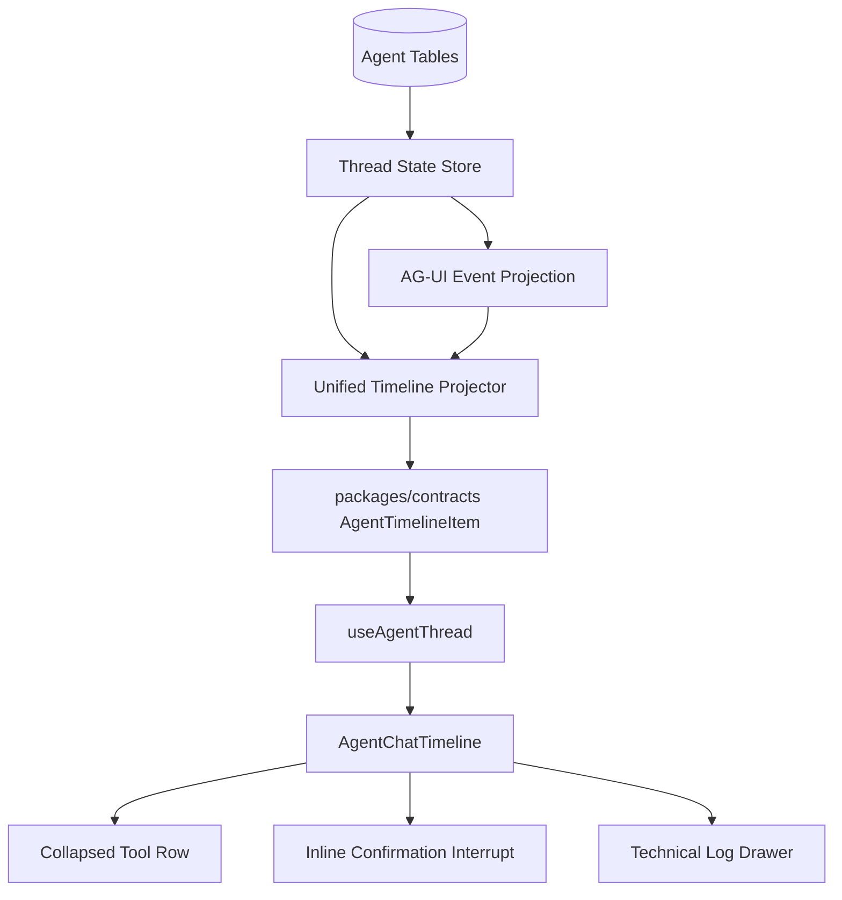
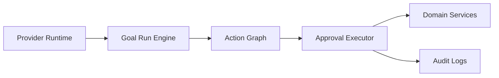
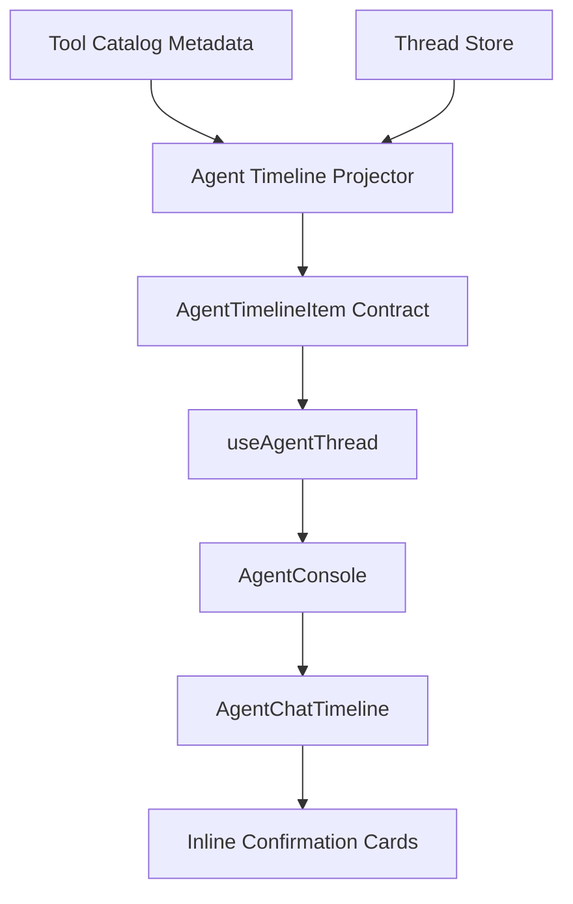

# ADR 0009: OpenClaw-Style Unified Agent Chat Transcript

Status: Proposed

Date: 2026-05-22

Refines: ADR 0008 AG-UI-Compatible Agent Execution Transcript

## Context

ADR 0008 fixed one important problem: the default Agent UI must not expose harness internals such as queued runs, worker leases, goal contracts, goal loops, or evaluator class names. It introduced AG-UI-compatible events and a user-facing execution transcript projection.

That is necessary but not sufficient.

The current frontend still separates the user experience into three visual areas:

- recent chat messages
- execution transcript
- pending confirmation cards

This is not how mature agent products feel. Codex, Claude Code, OpenClaw, and AG-UI-style clients present model replies, tool calls, tool results, interruptions, and final summaries inside one chronological transcript. Tool calls are visible but compact. They usually render as one collapsed row and expand only when the user wants arguments, output, or confirmation details.

xox-model should follow that pattern. The product is Agent OS, not a chat assistant plus a debug panel.

## Research Notes

### OpenClaw

OpenClaw was cloned locally for inspection. The relevant source files are:

- `ui/src/ui/chat/build-chat-items.ts`
- `ui/src/ui/chat/grouped-render.ts`
- `ui/src/ui/chat/tool-cards.ts`
- `ui/src/ui/chat/tool-expansion-state.ts`
- `ui/src/ui/tool-display.ts`
- `docs/reference/transcript-hygiene.md`

The useful OpenClaw ideas are:

- Build one ordered chat item stream from history messages, live stream segments, and tool messages.
- Normalize tool calls and tool results into compact tool cards.
- Pair tool calls and tool results by stable call id where available.
- Keep tool rows collapsed by default.
- Expand a tool row to inspect input, output, preview artifacts, and raw details.
- Maintain per-session expansion state outside message data.
- Use a tool display registry to turn technical tool names and arguments into readable labels.
- Keep runtime/system context out of the visible transcript.

OpenClaw is MIT licensed. We can port small pure modules with attribution when the adaptation cost is justified. We should not import its control plane, channel system, plugin registry, auth/session store, Lit UI renderer, or runner state.

### AG-UI

AG-UI already models this as one event stream:

- `TEXT_MESSAGE_*`
- `TOOL_CALL_*`
- `TOOL_CALL_RESULT`
- `RUN_*`
- custom interrupt/HITL events

The frontend should not treat those as separate products. They are parts of one visible conversation timeline.

### Codex And Claude Code

Codex-style and Claude Code-style harness agents use a loop:

1. model emits assistant text or tool calls
2. harness executes or interrupts
3. tool results are returned to the model
4. model continues
5. once complete, model produces a final assistant summary

The UI mirrors that loop. Tool calls do not live in a separate dashboard. They are inline evidence of what the agent did before the final response.

## Decision

Adopt a **Unified Agent Chat Transcript** as the primary Agent OS user interface.

ADR 0008 remains valid as the protocol and projection foundation. ADR 0009 changes the frontend product shape:

- Chat messages, model streaming, tool calls, tool results, navigation, confirmation cards, action edits, evaluator checks, memory events, and final summaries must render in the same chronological lane.
- The separate execution transcript panel should be removed from the primary surface or demoted to a technical/debug view.
- Pending confirmation cards should render inline as interrupt cards attached to the relevant tool/action row.
- A side review drawer may exist for editing convenience, but it must mirror the inline interrupt rather than become a separate source of truth.
- Internal harness traces remain behind an explicit technical log disclosure.

## Target Experience

For a complex instruction, the user should see a single transcript shaped like this:

```text
你：帮我新建星河 50 期启动测算，生成 12 个月预测，先不要发布。

Agent：我会先建立项目假设，再准备一个可编辑的经营模型配置。

▸ 打开页面  调模型 / 项目设置
  已完成

▸ 调用工具  workspace_configure_operating_model
  50 成员 / 12 个月 / 多股东 / 启动投入
  待确认

  [展开后显示可编辑确认卡]

Agent：我已经准备好 1 个写入动作。请先检查成员分层、股东比例和专项活动假设。确认后我会生成预测结果，但不会发布正式版本。
```

The user must not need to scan a second panel to understand what happened.

## Architecture



The harness remains backend-owned:



The visible transcript is a projection of this state, not another execution engine.

## Module Division

### Contracts

Path: `packages/contracts/src/index.ts`

Add a timeline DTO separate from raw run events:

- `AgentTimelineItem`
- `AgentTimelineItemKind`
- `AgentTimelineToolState`
- `AgentTimelineConfirmationState`
- `AgentTimelineVisibility`

Recommended item kinds:

- `user_message`
- `assistant_message`
- `assistant_stream`
- `tool_call`
- `tool_result`
- `navigation`
- `confirmation`
- `action_edit`
- `memory`
- `evaluation`
- `summary`
- `technical`

`AgentTimelineItem` is the frontend source of truth for rendering. Raw `runEvents` remain available for technical log and debugging.

### API Projection

Paths:

- `apps/api/src/agent/ag-ui-projection.ts`
- `apps/api/src/agent/agent-transcript-projector.ts`
- new or renamed `apps/api/src/agent/agent-timeline-projector.ts`

Responsibilities:

- Merge persisted messages, AG-UI events, plan steps, action requests, navigation events, evaluations, and memories into one stable ordered timeline.
- Pair tool calls and tool results by `toolCallId`, provider call id, action request id, or deterministic fallback id.
- Attach pending confirmation cards to the tool/action row that produced them.
- Attach action edits to the same row as a visible diff.
- Attach final assistant summary after tool/evaluator completion.
- Keep technical lifecycle events hidden from default timeline.

### Frontend Timeline

Paths:

- `apps/web/src/components/agent/AgentConsole.tsx`
- new `apps/web/src/components/agent/timeline/AgentChatTimeline.tsx`
- new `apps/web/src/components/agent/timeline/AgentToolRow.tsx`
- new `apps/web/src/components/agent/timeline/AgentInlineConfirmation.tsx`
- new `apps/web/src/components/agent/timeline/toolExpansionState.ts`
- new `apps/web/src/components/agent/timeline/toolDisplay.ts`

Responsibilities:

- Render user and assistant messages in the same lane as tool rows.
- Render tool rows collapsed by default.
- Expand a tool row to show arguments, result preview, audit details, and inline confirmation card.
- Keep per-thread expansion state stable during SSE/polling refresh.
- Render model final summaries as normal assistant messages.
- Keep technical log behind a disclosure.

### Reuse And Porting Plan

OpenClaw-inspired reusable ideas:

| OpenClaw source | Reuse mode | xox-model target |
| --- | --- | --- |
| `tool-cards.ts` extraction/pairing | Port small pure logic with MIT attribution if simpler than rewriting | `timeline/toolCardModel.ts` |
| `tool-expansion-state.ts` | Reimplement as React hook or pure map helper | `timeline/toolExpansionState.ts` |
| `tool-display.ts` plus shared display registry shape | Adopt the registry idea, not the exact UI | `timeline/toolDisplay.ts` and xox tool catalog metadata |
| `build-chat-items.ts` stream/history/tool merge pattern | Reuse algorithmic shape, adapted to backend-projected items | `agent-timeline-projector.ts` |
| `transcript-hygiene.md` principle | Adopt as policy | ADR 0009 and tests |

Do not reuse:

- Lit templates and CSS classes
- OpenClaw chat shell
- OpenClaw control UI
- OpenClaw plugin/channel infrastructure
- OpenClaw auth, session files, filesystem persistence, or runner state
- Any OpenClaw prompt/control-plane concepts that conflict with xox-model SaaS tenancy

If any source code is ported substantially, add a short attribution comment near the ported module and preserve MIT license requirements. Prefer small adapted pure functions over wholesale file copies.

## Dependency Graph



Allowed dependency direction:

```text
web timeline components -> web hook -> contracts -> api timeline projector -> thread/action/memory/evaluation stores -> domain services/db
```

Forbidden dependency direction:

```text
web components -> raw DB concepts
web components -> provider SDK types
api projector -> React component concerns
tool display -> semantic intent routing
```

## Naming And Style

Use `timeline` for the unified visible transcript. Keep `transcript` for generic persisted conversation semantics and `technical log` for raw harness diagnostics.

Recommended names:

- `AgentChatTimeline`
- `AgentTimelineItem`
- `AgentToolRow`
- `AgentInlineConfirmation`
- `AgentTechnicalLog`
- `buildAgentTimelineItems`
- `toolDisplay`
- `toolExpansionState`

Avoid names that imply a separate dashboard:

- `ExecutionPanel`
- `RunGraphPanel`
- `PlanTimeline` as primary UI
- `ToolMonitor`

Visual style:

- Compact terminal-like density inside the Agent console.
- Tool row collapsed height should be close to one text line plus padding.
- Expanded details may use structured cards, but default rows should not become a dashboard grid.
- Tool name and payload previews may use monospace.
- User-facing labels must describe business action, not harness internals.

## Final Summary Requirement

After a run reaches any terminal or interrupt state, the user should receive a model-authored assistant message when the provider is available:

- completed after read-only tools
- completed after auto-executed tools
- waiting after confirmation cards are prepared
- failed with actionable reason after unrecoverable tool/provider errors

The summary is part of the same timeline. It should not be a local template pretending to be the model. If the provider is unavailable, the run should show a visible failure state and technical log, not a fake assistant conclusion.

For confirmation waits, the model summary should say what is ready, what assumptions matter, and what the user can edit before confirming.

## Confirmation Card Placement

Confirmation cards are HITL interrupts. They should render inline under the tool/action row that created them.

The inline card must support:

- structured field editing for known business actions
- JSON fallback for rare actions
- original proposal vs current edited value diff
- target page/panel
- affected object
- risk level
- audit note
- confirm and cancel

A right-side review lane may remain as an optional mirror for dense editing, but it must not be the primary only place where confirmation exists.

## Technical Log Boundary

The default timeline must not show:

- `Run 已入队`
- `Worker 已认领`
- `run lease`
- `lease guard`
- `目标契约已建立`
- `目标循环`
- `Completion Evaluator`
- raw provider request/response
- raw prompts
- API keys or secret-like text
- chain-of-thought or hidden reasoning

These can appear only in an explicit technical log, redacted and collapsed by default.

## Implementation Milestones

1. Design and contract alignment
   - Add `AgentTimelineItem` contracts.
   - Document mapping from existing `AgentTranscriptItem` to timeline items.
   - Decide whether `AgentTranscriptItem` is deprecated or retained as technical/debug DTO.

2. Backend unified projector
   - Implement `buildAgentTimelineItems`.
   - Use persisted server-owned state only.
   - Pair tool calls/results and attach confirmation cards inline.
   - Add tests for ordering, pairing, hiding internals, and refresh reconstruction.

3. OpenClaw-inspired frontend primitives
   - Implement compact collapsed `AgentToolRow`.
   - Implement per-thread expansion state.
   - Implement tool display registry backed by xox tool catalog metadata.
   - Port only small pure helpers when justified, with MIT attribution.

4. Replace primary Agent console layout
   - Replace separated `recentMessages + AgentExecutionTranscript + side-only cards` with `AgentChatTimeline`.
   - Keep technical log disclosure.
   - Keep provider settings, history, memory center, and automation controls outside the transcript.

5. Model final summary loop
   - Ensure post-tool/post-confirmation planning asks the provider for a user-facing summary when appropriate.
   - Do not fabricate model prose when no provider summary exists.

6. Validation and docs
   - Update acceptance docs and lessons.
   - Add web tests for collapsed rows, inline confirmation, final summary, and hidden internals.
   - Add API tests for timeline projection reconstruction.
   - Run existing build/test suite and real-provider smoke.

## Acceptance Criteria

- User message, assistant text, tool call, tool result, confirmation card, action edit, evaluator check, memory note, and final summary render in one chronological timeline.
- Tool calls are collapsed to a one-line row by default.
- Expanding a tool row shows tool arguments, result preview, linked confirmation card, and audit details.
- Pending write actions are editable inline before execution.
- The optional review lane mirrors the same action request id and cannot drift from inline state.
- Multi-step tasks show multiple compact tool/action rows in order.
- Multiple model-tool loops append to the same timeline rather than replacing the previous step list.
- After tool execution or confirmation preparation, the model provides a user-facing summary message unless the provider failed.
- Internal harness events stay out of the default timeline and appear only in a collapsed technical log.
- Refreshing or reopening a thread reconstructs the same timeline from backend state.
- Existing commands still pass:
  - `npm.cmd run test:web`
  - `npm.cmd run test:api`
  - `npm.cmd run build:web`
  - `npm.cmd run build:api`
- Real-provider smoke demonstrates a complex operating-model request with inline tool rows and confirmation cards.

## Risks

- A naive frontend-only merge of messages and transcript rows will drift under SSE/polling. The unified timeline should be backend-projected.
- Copying OpenClaw UI wholesale would import the wrong product assumptions. xox-model needs business confirmations and SaaS audit, not a control UI clone.
- Over-expanding tool rows by default will recreate dashboard noise. The default must stay compact.
- Requiring a model summary after every tool loop can add latency. This is acceptable for completed/waiting terminal states, but intermediate rows should stream compact progress without forcing extra prose.

## References

- AG-UI Messages: https://docs.ag-ui.com/concepts/messages
- AG-UI Events: https://docs.ag-ui.com/concepts/events
- OpenAI Codex agent loop: https://openai.com/index/unrolling-the-codex-agent-loop/
- Claude Code hooks: https://code.claude.com/docs/en/hooks
- OpenClaw: https://github.com/openclaw/openclaw
