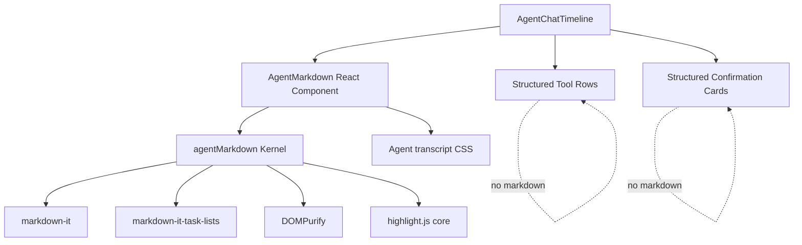

# ADR 0010: OpenClaw-Inspired Markdown Transcript Rendering

Status: Implemented

Date: 2026-05-23

Refines: ADR 0009 OpenClaw-Style Unified Agent Chat Transcript

Implementation note: implemented in the React frontend on 2026-05-23. The implementation adds an OpenClaw-inspired Markdown kernel at `apps/web/src/lib/agentMarkdown.ts`, a scoped React wrapper at `apps/web/src/components/agent/AgentMarkdown.tsx`, and assistant-only integration in `AgentChatTimeline`. User bubbles remain escaped plain text, while tool rows and confirmation cards remain structured UI.

## Context

ADR 0009 moved xox-model toward a single user-facing Agent transcript. That solved the product shape problem: model replies, tool calls, tool results, confirmation cards and final summaries should live in one chronological lane.

The next defect is renderer quality. Assistant replies currently render as escaped plain text in `AgentChatTimeline`:

```tsx
<p className="... whitespace-pre-wrap ...">
  {props.item.content ?? props.item.summary}
</p>
```

This is safe, but it means model-authored Markdown is not rendered. Users see raw strings such as:

```markdown
我是 **xox-model Agent OS**
---
### 数据问答
- 查询任意月份
```

This is not a prompt issue. The model is producing reasonable Markdown. The frontend does not have a Markdown renderer, sanitizer, styling layer or streaming boundary. The `apps/web` package also has no Markdown dependencies such as `markdown-it`, `dompurify`, `highlight.js`, `react-markdown`, `remark-gfm` or `rehype-sanitize`.

The product expectation is now closer to Codex, Claude Code and OpenClaw:

- assistant prose renders as readable Markdown
- tool calls remain structured, compact and collapsible
- confirmation cards remain editable structured UI
- harness internals remain hidden from the main transcript
- streaming text should not look broken while Markdown is incomplete

## Research Notes

### OpenClaw

OpenClaw was cloned locally and inspected. The most relevant file is:

- `ui/src/ui/markdown.ts`

OpenClaw's Markdown renderer is not a casual `dangerouslySetInnerHTML` wrapper. It is a hardened rendering subsystem:

- `markdown-it` parses Markdown.
- `DOMPurify` sanitizes generated HTML with an allowlist.
- `highlight.js` highlights code fences.
- raw HTML blocks and inline HTML are escaped.
- task-list checkboxes are allowed only when produced by the Markdown plugin.
- links are sanitized and forced to `rel="noreferrer noopener"` and `target="_blank"`.
- dangerous URL schemes are stripped.
- fuzzy autolinks are disabled to avoid turning filenames such as `README.md` into bogus links.
- CJK-adjacent autolinks are trimmed so Chinese text is not swallowed into URLs.
- remote Markdown images are flattened to text; only base64 data images are allowed.
- fenced and indented code blocks get code chrome, highlighting and copy affordances.
- JSON code blocks can collapse.
- long content has char limits, parse limits, cache limits and escaped plain-text fallback.
- render failures do not crash chat; they fall back to escaped plaintext.

OpenClaw is MIT licensed. Its renderer is TypeScript and mostly pure, but it is not drop-in for xox-model because it also depends on OpenClaw-specific i18n, citation control marker stripping, formatting helpers, Lit rendering assumptions and CSS conventions.

The right reuse stance is therefore:

- port/adapt the small pure renderer logic and edge-case policies
- preserve MIT attribution if substantial code is copied
- do not import OpenClaw as a runtime dependency
- do not import OpenClaw's control plane, chat shell, runner state, channel delivery or plugin system

### Codex

The public Codex repo has two useful patterns:

- `codex-rs/tui/src/markdown_render.rs` renders Markdown through `pulldown-cmark`, including headings, emphasis, lists, tables, code and links.
- `codex-rs/tui/src/markdown_stream.rs` uses a `MarkdownStreamCollector` that commits stream source at newline boundaries. This prevents half-finished Markdown from being rendered as if it were stable.

Codex also keeps command/tool output as structured events instead of mixing it into one assistant string. That matches ADR 0009: Markdown belongs to assistant prose, not to tool rows or confirmation cards.

### Claude Code

Do not use leaked Claude Code source. Public Claude Code behavior and docs are still useful as UX reference:

- model prose is Markdown-like and readable
- tool/command activity is visible as structured transcript rows
- user-facing summaries appear after tool loops
- internal harness details are not the default transcript

For xox-model, Claude Code is a design reference, not a code source.

## Decision

Adopt an **OpenClaw-inspired Markdown rendering kernel** for the Agent transcript.

This renderer should be implemented in xox-model's React frontend, but the core parsing, sanitization, fallback and edge-case behavior should be directly ported or adapted from OpenClaw's `ui/src/ui/markdown.ts` when practical.

Use this default stack:

- `markdown-it` for Markdown parsing
- `markdown-it-task-lists` for display-only task lists
- `dompurify` for HTML sanitization
- `highlight.js` core plus a small allowlist of languages for code fences
- local React wrapper component for transcript integration

Do not choose `react-markdown` as the default implementation for this project. It is a valid React library, but it would make us recreate many of the mature OpenClaw hardening choices from scratch. xox-model's current problem is not "find any Markdown renderer"; it is "build a transcript-grade renderer that behaves safely under agent output, streaming, CJK text, code blocks, links and malformed content."

## Module Division

Target modules:

| Module | Target path | Responsibility | OpenClaw reuse stance |
| --- | --- | --- | --- |
| Markdown Kernel | `apps/web/src/lib/agentMarkdown.ts` | Convert assistant Markdown source into sanitized HTML; own parser, sanitizer, cache, limits, fallback and link/image policy. | Port/adapt pure logic from OpenClaw `markdown.ts` with attribution when copied. |
| Markdown Component | `apps/web/src/components/agent/AgentMarkdown.tsx` | React wrapper around sanitized HTML, styling class names, copy-code event handling and accessibility labels. | Local React wrapper; do not copy OpenClaw Lit renderer. |
| Transcript Integration | `apps/web/src/components/agent/AgentChatTimeline.tsx` | Render assistant text/stream/summary with `AgentMarkdown`; keep user bubbles as plain text; keep tool rows/cards structured. | Local integration. |
| Styles | `apps/web/src/index.css` or agent CSS module if introduced | Typography, list spacing, code blocks, inline code, tables, blockquotes, horizontal overflow, compact transcript fit. | Adapt visual principles, not OpenClaw CSS wholesale. |
| Tests | `apps/web/src/lib/agentMarkdown.test.ts` and `apps/web/src/components/agent/AgentChatTimeline.test.ts` | Validate Markdown output, sanitizer behavior, streaming boundaries and transcript ownership. | Add OpenClaw-inspired malicious/edge fixtures. |

No changes should be needed in `packages/contracts`, `packages/domain` or API storage for this renderer. The backend should continue sending typed timeline items. Markdown is a presentation concern for assistant prose only.

## Dependency Graph



The important boundary is that `AgentMarkdown` never becomes a generic renderer for all transcript rows. It is for assistant-authored text. Tool rows, tool arguments, tool results, confirmation cards and editable business payloads remain typed UI.

## Reuse Plan

Port or adapt these OpenClaw patterns first:

1. **Sanitized HTML pipeline**
   - local `toSanitizedAgentMarkdownHtml(markdown: string): string`
   - `markdown-it` parse
   - `DOMPurify.sanitize` with an explicit allowlist
   - fallback to escaped plain text on parser errors

2. **Raw HTML escape policy**
   - raw `html_block` and `html_inline` must render as text
   - only plugin-produced task-list inputs may pass through

3. **Link policy**
   - strip `javascript:`, `data:`, `vbscript:`, `file:` and malformed dangerous URLs
   - allow only `http:`, `https:`, `mailto:` and safe relative URLs
   - set `rel="noreferrer noopener"` and `target="_blank"`
   - disable fuzzy links to avoid false positives on filenames
   - keep CJK URL trimming or an equivalent test-backed adaptation

4. **Image policy**
   - remote Markdown images do not load by default
   - render remote image alt text as escaped text
   - base64 data images may be allowed only if product needs them; default can be stricter and disallow all images

5. **Code block policy**
   - support fenced and indented code blocks
   - highlight only a small language allowlist
   - render code in horizontally scrollable blocks
   - provide copy-code affordance without leaking unsanitized content into unsafe attributes

6. **Performance and resilience**
   - maximum source char limit
   - parse char limit
   - bounded cache
   - plain-text fallback for oversized content
   - no renderer crash can break the transcript

Do not port these OpenClaw parts:

- Lit template/rendering layer
- OpenClaw chat shell
- OpenClaw control UI state
- plugin registry
- command/channel runtime
- i18n runtime
- citation-control marker dependencies unless xox-model later has the same model marker problem
- any code that assumes local filesystem agent sessions

If a substantial block is copied, add a file-level attribution comment:

```ts
// Portions adapted from OpenClaw (MIT License)
// Source: https://github.com/openclaw/openclaw/blob/main/ui/src/ui/markdown.ts
```

If the implementation copies more than small snippets, add a third-party notice entry in docs or a dedicated notice file before merging.

## Streaming Strategy

Assistant streaming must avoid broken Markdown flashes.

Adopt a two-layer strategy:

1. **Stable completed source**
   - Keep completed stream source renderable as Markdown.
   - Prefer committing at newline boundaries, following Codex's `MarkdownStreamCollector` idea.

2. **Volatile tail**
   - Keep the current incomplete tail safe and readable.
   - Either render it as escaped plain text until the next boundary or debounce full rendering with a short interval.

For the first implementation, a debounced render is acceptable only if tests cover incomplete fences and incomplete links. The long-term target is newline/block-boundary collection because it is more deterministic and matches Codex's mature TUI approach.

## Rendering Rules

Assistant text:

- render Markdown through `AgentMarkdown`
- support headings, bold, italic, lists, blockquotes, horizontal rules, inline code, code blocks, tables and links
- keep typography compact enough for the Agent OS console

Assistant stream:

- render completed stable text through `AgentMarkdown`
- show incomplete tail safely
- replace the stream with the final assistant message when the backend marks it complete

User text:

- keep as escaped plain text inside the compact right-aligned bubble
- do not auto-render user Markdown by default

Tool calls:

- remain compact one-line collapsible rows
- do not render tool names, args or results as arbitrary Markdown in the collapsed row
- expanded raw JSON/code may use code styling, but not assistant-prose Markdown semantics

Confirmation cards:

- remain structured editable UI
- model-written assumptions inside a card may use a controlled rich text or plain text area later, but that is separate from assistant Markdown rendering

Technical log:

- may keep raw text
- does not need Markdown in the first implementation

## Security Requirements

The renderer must satisfy these requirements before it is used in production:

- raw HTML is escaped or sanitized away
- scripts never execute
- event handlers such as `onerror` and `onclick` are removed
- dangerous URL schemes do not survive in `href` or `src`
- remote images are not loaded by default
- sanitizer allowlists are explicit
- `dangerouslySetInnerHTML` is used only in `AgentMarkdown`, never scattered through timeline components
- renderer errors fall back to escaped text
- copied code text is sourced from safe component state or sanitized attributes

## Tests

Add focused tests before or with implementation:

1. Markdown rendering
   - `**bold**`, `### heading`, lists, blockquote, horizontal rule
   - inline code and fenced code
   - GFM table
   - Chinese text around links

2. Security
   - `<script>alert(1)</script>` renders as text or is removed
   - `` does not execute or preserve handler
   - `[x](javascript:alert(1))` does not keep dangerous href
   - remote image Markdown does not load remote image

3. Resilience
   - malformed Markdown does not crash
   - very large content hits parse fallback
   - incomplete code fence during stream remains readable

4. Transcript integration
   - assistant message uses `AgentMarkdown`
   - assistant stream uses `AgentMarkdown` or safe tail rendering
   - user message stays plain text bubble
   - tool row remains compact/collapsible and not parsed as Markdown

Validation commands:

```powershell
npm.cmd run test:web
npm.cmd run build:web
```

After implementation, run a browser check against a local transcript containing:

- the user's "你能干什么？" style Markdown answer
- a code block
- a table
- a link
- a tool row
- a confirmation card

The expected result is a Codex/OpenClaw-style single transcript where assistant prose is formatted and tool rows are still compact.

## Acceptance Criteria

- Assistant Markdown renders correctly in the Agent transcript.
- User bubbles remain plain escaped text.
- Tool calls, tool results and confirmation cards remain structured UI, not Markdown blobs.
- No raw Markdown markers such as `**`, `###`, `---` or list bullets appear when they should be rendered.
- Tables and code blocks do not create page-level horizontal overflow.
- Dangerous HTML, links and images are neutralized.
- Renderer failures fall back to escaped plain text.
- Streaming output does not visibly corrupt incomplete Markdown.
- All new Markdown rendering behavior has tests.
- Any substantial OpenClaw-derived code has MIT attribution.

## Consequences

Benefits:

- Fixes the current raw Markdown transcript defect at the right layer.
- Reuses a mature OpenClaw pattern instead of inventing another unsafe renderer.
- Keeps xox-model's existing typed tool/confirmation UI intact.
- Aligns the Agent console with Codex, Claude Code and OpenClaw user expectations.

Costs:

- Adds frontend dependencies.
- Introduces a sanitized HTML boundary that must remain tightly scoped.
- Requires CSS work so rendered Markdown stays compact inside the 85% Agent OS shell.
- Requires ongoing security tests when renderer rules change.

## Relationship To Earlier ADRs

- ADR 0008 defines the AG-UI-compatible projection layer.
- ADR 0009 defines the unified transcript product shape.
- ADR 0010 defines how assistant prose inside that transcript is rendered safely.

ADR 0010 does not replace the unified transcript. It fills the missing renderer layer required for the transcript to feel like a mature harness-agent product.

## References

- OpenClaw Markdown renderer: `https://github.com/openclaw/openclaw/blob/main/ui/src/ui/markdown.ts`
- OpenClaw grouped chat rendering: `https://github.com/openclaw/openclaw/blob/main/ui/src/ui/chat/grouped-render.ts`
- OpenClaw MIT License: `https://github.com/openclaw/openclaw/blob/main/LICENSE`
- Codex Markdown renderer: `https://github.com/openai/codex/blob/main/codex-rs/tui/src/markdown_render.rs`
- Codex Markdown stream collector: `https://github.com/openai/codex/blob/main/codex-rs/tui/src/markdown_stream.rs`
- Codex app-server event model: `https://github.com/openai/codex/blob/main/codex-rs/app-server/README.md`
- Claude Code output styles: `https://docs.anthropic.com/en/docs/claude-code/output-styles`
