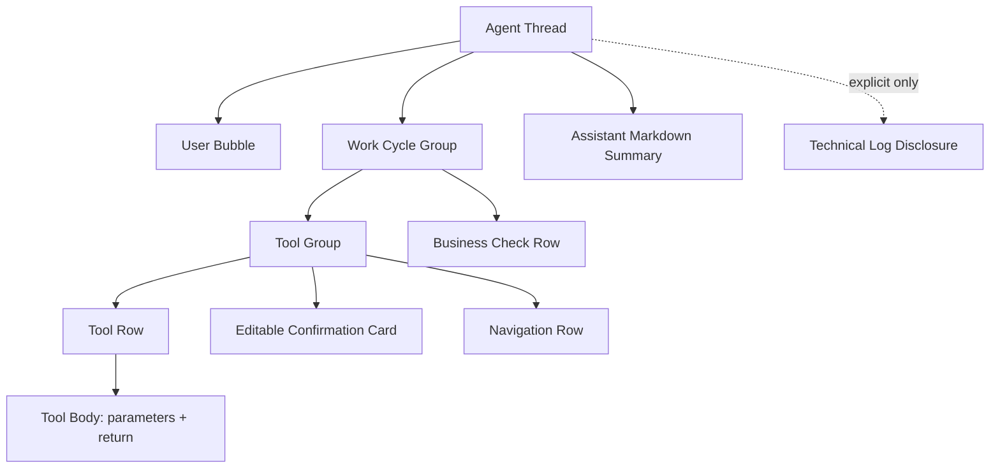
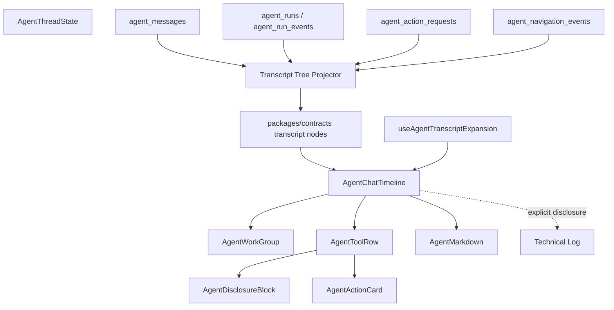

# ADR 0011: Layered Agent Transcript Disclosure

Status: Implemented

Date: 2026-05-23

Refines: ADR 0009 OpenClaw-Style Unified Agent Chat Transcript, ADR 0010 OpenClaw-Inspired Markdown Transcript Rendering

Initial partial implementation: 2026-05-23

Revision: 2026-05-23 strict work-cycle transcript contract

Implemented: 2026-05-23

Latest revision: 2026-05-24 Codex-style combined tool body

## Context

ADR 0009 unified the Agent conversation surface: model replies, tool calls, tool results, navigation and confirmation cards now live in one transcript lane. ADR 0010 fixed assistant Markdown rendering.

The remaining issue is information architecture. The current transcript is still structurally flat:

- `packages/contracts/src/index.ts` exposes a flat `AgentTimelineItem[]`.
- `apps/api/src/agent/agent-timeline-projector.ts` merges and deduplicates flat items.
- `apps/web/src/components/agent/AgentChatTimeline.tsx` renders all non-message rows through one `TimelineEventRow`.
- frontend expansion state is one `expandedIds` set, so it cannot distinguish group expansion, tool body expansion and confirmation-card expansion.

This cannot produce the mature Codex / Claude Code / OpenClaw style interaction where users see a compact work summary first, then expand progressively:

```text
Worked for 12s
  Ran 3 tools
    data_query_workspace
      tool body: arguments + return
    ui.navigate
    confirmation card
Assistant summary
```

The product requirement is not "show more logs". It is the opposite:

- hide harness internals by default
- show user-facing business/tool steps in the main transcript
- keep each visible step compact by default
- let users expand one level at a time when they want evidence
- keep editable confirmation cards inline with the tool/action that produced them

## Revision Note

The initial implementation was accepted too early. It satisfied a weaker "unified transcript with some collapsible rows" interpretation, but it did not satisfy the product contract below:

```text
Agent Transcript
├─ User Bubble
├─ Work Cycle Group              Worked for 12s / 3 tools / 1 pending
│  ├─ Tool Group                 调用 3 个工具
│  │  ├─ Tool Row                data_query_workspace · completed
│  │  │  └─ Tool Body            展开后同一区域展示参数和返回
│  │  ├─ Navigation Row          已打开：看测算
│  │  └─ Confirmation Card       可编辑，等待确认
│  └─ Evaluation/Check Row       只展示业务检查，不展示 harness 内部
└─ Assistant Markdown Summary
```

The design error was that ADR 0011 allowed conditional grouping:

- a single tool could render without a `Work Cycle Group`
- a single tool could render without a `Tool Group`
- navigation rows could remain sibling rows in the top-level transcript
- tool arguments could leak into the compact row instead of living only inside the expanded tool body
- the evaluator/check concept was defined mostly as hidden technical state, not as a business-facing check row

This revision makes the tree shape mandatory. Passing tests that only prove "harness internals are hidden" and "some rows are collapsible" is no longer enough.

## Research Notes

### Codex

The public Codex repository separates execution cells from assistant prose.

Relevant public source:

- `codex-rs/tui/src/exec_cell/model.rs`
- `codex-rs/tui/src/exec_cell/render.rs`
- `codex-rs/tui/src/history_cell/mcp.rs`
- `codex-rs/tui/src/history_cell/separators.rs`

Codex does not flatten every event into the same row type. It has dedicated history cells:

- `ExecCell` represents a command or an "exploring" group of read/list/search calls.
- sequential read calls can coalesce into one `Explored` group.
- command display lines show a compact `Ran ...` row and only limited output.
- full command output is available through transcript/raw views rather than flooding the default lane.
- `Worked for ...` separators mark a top-level turn/work boundary.

The transferable idea is not the Rust TUI code. It is the model:

```text
turn/work boundary -> grouped execution cells -> compact row -> detailed transcript/raw output
```

### OpenClaw

OpenClaw is closer to xox-model because it is a web UI. It is also MIT licensed, so small pure modules can be ported or adapted with attribution.

Relevant public source:

- `ui/src/ui/chat/build-chat-items.ts`
- `ui/src/ui/chat/tool-cards.ts`
- `ui/src/ui/chat/tool-expansion-state.ts`
- `ui/src/ui/chat/grouped-render.ts`
- `ui/src/ui/chat/constants.ts`

The important OpenClaw boundaries are:

- chat items are built before rendering
- tool cards are extracted and rendered by a dedicated module
- tool expansion state is tracked per session, separate from message data
- inline tool calls and standalone tool outputs have collapsed summaries by default
- expanded tool cards show input, output, raw details and optional sidebar/canvas previews
- long output is truncated or collapsed using explicit thresholds
- duplicate or noisy messages can be collapsed before reaching the UI

This is the best direct reference for xox-model. We should port the design and small pure pieces where practical, not rebuild the same behaviors from scratch.

### Claude Code

Do not use leaked Claude Code source. Public Claude Code behavior and documentation still support the same product pattern:

- the conversation lane contains assistant prose and tool/command activity
- slash commands, hooks and output styles are product-level surfaces, not raw harness internals
- user-visible summaries appear after tool loops
- internal run machinery is not the default transcript

For xox-model, Claude Code is a UX reference only.

## Decision

Replace the flat Agent timeline renderer with a **layered transcript disclosure model**.

The final user-facing transcript must be a tree, not a list of unrelated rows. For any run that performs visible work, the top-level order is fixed:

```text
User Bubble
Work Cycle Group
Assistant Markdown Summary
Technical Log Disclosure
```

Inside the work cycle, visible operational state is also fixed:

```text
Work Cycle Group
Tool Group
Tool Row
Tool Body
Navigation Row
Confirmation Card
Evaluation/Check Row
```

The tree is a product contract, not an optimization. A single tool still gets a work cycle and a tool group. Compactness comes from collapsed rows, not from removing structural levels.



The visible default should be:

- user messages as right-aligned bubbles
- assistant messages as Markdown prose, no assistant bubble chrome
- active turn status as a small `Thinking`, then a compact `Work Cycle Group`
- every visible run with tool/navigation/confirmation/check state as one `Work Cycle Group`
- every visible run with one or more tools/actions/navigation as one `Tool Group`, even if there is only one tool
- tool calls as one-line collapsed rows with only a short summary, tool name and status
- writes as inline editable confirmation interrupts
- navigation rows inside the same work cycle/tool group, never as unrelated top-level rows
- business checks inside the work cycle; harness evaluator implementation labels remain hidden in technical logs
- final assistant summary after tool loops
- technical logs behind an explicit disclosure only

The 2026-05-24 refinement changes tool detail disclosure from "separate Arguments / Result Preview / Raw JSON boxes" to a single Codex-style tool body. When the user expands a tool row, parameters and real return text appear in one lightweight inline area. `Raw JSON` is no longer a normal second-level visual element in the main transcript; raw provider details belong in technical logs or explicit debug/evidence surfaces.

Layering is a semantic and interaction contract, not permission to draw nested cards. The renderer must not show work group, tool group, tool row and disclosure sections as stacked rounded boxes. The preferred visual language is:

- one transcript lane
- a lightweight work-cycle separator
- indentation and a subtle vertical rule for tool groups
- row-level expand/collapse controls at the start of the row, before the icon and title
- one-line collapsed tool/navigation/check rows
- one inline tool body per expanded tool row; parameters and real return previews live together in that body, not in separate frames
- real card chrome only for editable confirmation interrupts
- no generic status slogans such as "tools selected", "parameters can be expanded", or "opened page for checking"; keep those facts in structure, status badges and technical details instead of prose
- hide successful check rows when their only content is a generic success/read-only assertion; show check rows only when they contain an actionable failure, pending item, incomplete goal, or specific business finding
- normalize backend engineering titles in the renderer: do not show raw strings such as `Worked for 0s / 1 tools / 0 pending`, and do not show a tool name twice in the same row
- start turn timing as soon as the user message appears in the transcript; show a lightweight running timer before tool rows exist, then keep the elapsed duration on the completed work cycle
- suppress generic `Result Preview` placeholders such as "tool call completed and used for reply"; render result preview only when it contains real business output

This keeps the exact tree inspectable while matching mature command/transcript UIs such as Codex, Claude Code and OpenClaw.

## Target Module Division

| Module | Target path | Responsibility | Reuse stance |
| --- | --- | --- | --- |
| Transcript contract | `packages/contracts/src/index.ts` | Define nested transcript node DTOs, disclosure state hints, node kinds and section kinds. | Local contract. Do not copy OpenClaw types directly because xox is SaaS/domain-specific. |
| Transcript projector | `apps/api/src/agent/agent-timeline-projector.ts` or replacement `agent-transcript-tree-projector.ts` | Project server-owned messages, run events, actions and navigation into nested user-facing nodes. | Reuse OpenClaw build-before-render principle. |
| Tool display registry | `apps/web/src/components/agent/agentToolDisplay.ts` or shared `packages/contracts` metadata if needed | Map tool names to compact labels, icons, risk display and default disclosure behavior. | Local business labels; no regex intent routing. |
| Expansion state hook | `apps/web/src/hooks/useAgentTranscriptExpansion.ts` | Track expansion by `threadId / runId / nodeId / sectionId`, with defaults and auto-open rules. | Port/adapt OpenClaw `tool-expansion-state.ts` shape with attribution if code is copied. |
| Transcript renderer | `apps/web/src/components/agent/AgentChatTimeline.tsx` | Render transcript tree, route node kinds to specialized components, remove flat `TimelineEventRow` as the primary abstraction. | Local React renderer. |
| Tool row | `apps/web/src/components/agent/AgentToolRow.tsx` | One-line collapsed tool row; expanded single tool body containing parameters and real return, plus inline confirmation interrupts. | Port/adapt OpenClaw `tool-cards.ts` concepts, not Lit templates. |
| Work group | `apps/web/src/components/agent/AgentWorkGroup.tsx` | Codex-style top-level run/work group such as `Worked for 12s`, counts and status. | Local React implementation inspired by Codex separators. |
| Tool body/details block | `apps/web/src/components/agent/AgentDisclosureBlock.tsx` | Reusable inline block for tool parameters, real return preview, audit detail and terminal-like output. Normal tool params/results are combined, not split into nested boxes. | May reuse OpenClaw thresholds/constants. |
| Markdown | `apps/web/src/components/agent/AgentMarkdown.tsx` and `apps/web/src/lib/agentMarkdown.ts` | Continue assistant-only Markdown rendering from ADR 0010. | Already implemented. |
| Tests | `apps/web/src/components/agent/*.test.tsx`, `apps/api/tests/*agent*` | Verify tree projection, grouping, defaults, expand/collapse, hidden technical logs and confirmation-card ownership. | Add fixtures based on Codex/OpenClaw behavior. |

## Dependency Graph



The backend remains the source of truth. The frontend may hold expansion state, but it must not infer whether an action exists, whether a tool completed, or whether a confirmation card is valid.

## Transcript Node Model

Introduce a nested model conceptually shaped like this:

```ts
export type AgentTranscriptNodeKind =
  | 'user_message'
  | 'assistant_message'
  | 'assistant_stream'
  | 'work_group'
  | 'tool_group'
  | 'tool_call'
  | 'tool_result'
  | 'navigation'
  | 'confirmation'
  | 'action_update'
  | 'memory'
  | 'evaluation'
  | 'technical_group'
  | 'technical'

export type AgentTranscriptDisclosureKind =
  | 'group'
  | 'tool_body'
  | 'arguments'
  | 'result'
  | 'raw'
  | 'confirmation'
  | 'audit'

export type AgentTranscriptNode = {
  id: string
  threadId: string
  runId: string | null
  kind: AgentTranscriptNodeKind
  title: string
  summary?: string
  content?: string
  status: AgentTimelineItemStatus
  visibility: 'user' | 'technical'
  defaultOpen?: boolean
  disclosure?: {
    kind: AgentTranscriptDisclosureKind
    defaultOpen: boolean
    reason?: string
  }
  tool?: {
    name: string
    callId?: string | null
    argumentsPreview?: string
    resultPreview?: string
  }
  actionRequest?: AgentActionRequest | null
  navigation?: AgentNavigationEvent | null
  sections?: AgentTranscriptSection[]
  children?: AgentTranscriptNode[]
  createdAt: string
}
```

This can be implemented either by replacing `timelineItems` with nested nodes or by introducing a transitional field. The final state should not keep two competing primary transcript surfaces.

## Default Disclosure Policy

Default open/closed behavior should be deterministic and test-backed:

| Node/section | Default | Rule |
| --- | --- | --- |
| user message | visible | Bubble only. |
| assistant message | visible | Markdown prose, no assistant label bubble. |
| assistant stream | visible while active | Shows stable streaming text plus thinking indicator. |
| work group | visible for every visible run | Summary row like `Worked for 12s / 3 tools / 1 pending`; closed after completion, open while running/waiting/failed. |
| tool group | present for every visible tool/action/navigation run | Shows `调用 1 个工具` or `调用 3 个工具`; closed after completion, open while running/waiting/failed. |
| read-only tool row | closed after completion | One line with business label, tool name chip and status. No JSON argument body in the compact row. |
| write tool row with pending confirmation | open to confirmation card path | User must inspect/edit before execution; the row is attached to the same tool group that produced the write. |
| navigation row | closed after completion | Lives inside the work cycle/tool group, close to the related tool/action. It must not appear as a top-level transcript sibling. |
| confirmation card | open while pending | Editable card is attached to the producing tool/action, not rendered as a separate primary region. |
| business check row | visible when useful | Show only business checks such as `只读，未修改业务数据`, `已打开看测算`, `等待 1 张确认卡`; never expose evaluator class names. |
| failed tool row | open | Show concise error and relevant retry/correction hint. |
| tool body | closed through the tool row after completion | Expanding the tool row shows one inline body with `参数` and real `返回` together. Generic completion placeholders are hidden. |
| raw provider details | technical/debug only | Raw provider payloads are not a normal second-level visual block in the main transcript. Use technical logs or explicit evidence/debug views when needed. |
| technical log | always closed, separate explicit entry | No harness internals in default transcript. |

## Grouping Rules

The projector should group by server-owned identifiers, not text heuristics:

- Create one `Work Cycle Group` for every run that has visible operational work: provider tool calls, read results, navigation, confirmation cards, action edits, execution results, failures, or business checks.
- Do not create a work cycle for pure chat. A greeting remains `User Bubble -> Assistant Markdown Summary`.
- Create one `Tool Group` inside each work cycle whenever the run has any tool/action/navigation/confirmation state. This is mandatory even for a single tool.
- Group provider tool calls emitted in the same planning turn into the same tool group.
- Attach pending `AgentActionRequest` cards to the producing tool/action row. If the provider tool-call argument stream and the server confirmation card represent the same canonical tool, merge them into one tool row.
- Attach navigation rows to the same work cycle/tool group as the related tool/action. Navigation rows must not be top-level siblings between the user bubble and tool row.
- Create a business `Evaluation/Check Row` from structured run/action/domain state, not from harness labels. Examples: `本次只读，未修改业务数据`, `等待 1 张确认卡`, `已打开看测算`.
- Keep memory/evaluator/provider lifecycle rows technical unless they are transformed into a business check.
- Collapse repeated technical rows in the technical log only.
- Preserve chronological order at the top level: user message, work cycle, assistant summary. Assistant final summary should not appear before visible tool/work rows from the same run.

No regex or keyword routing should be introduced. Grouping is display projection over already-known server state.

## Compact Row Rules

Tool rows must be compact, but not lossy:

- The collapsed row may show: icon, business title, canonical tool name, status, short natural-language summary.
- The collapsed row must not show long JSON, raw provider arguments, raw provider output or stack traces.
- The expanded row shows one combined tool body. `参数` and `返回` are labels inside the same body, not separate cards or disclosure boxes.
- `返回` appears only when it contains real business-readable output. Boilerplate such as "tool call completed and used for reply" is suppressed.
- Raw JSON/provider detail is not part of the normal main-lane tool body.
- If content exceeds the preview threshold, show a truncated summary plus an explicit expand affordance.
- A screenshot-level acceptance check must verify that JSON strings such as `{"question":...}` are not visible in the collapsed tool row.

## Reuse Plan

Reuse OpenClaw in three layers.

### Directly portable or adaptable

- per-session/per-thread expansion state map from `tool-expansion-state.ts`
- tool card concepts from `tool-cards.ts`: collapsed summary, expanded input/output, raw details
- output preview constants from `constants.ts`: inline threshold, preview line limit, preview char limit
- build-before-render principle from `build-chat-items.ts`
- tests that prove collapsed and expanded states render different bodies

If substantial code is copied, add file-level attribution:

```ts
// Portions adapted from OpenClaw (MIT License)
// Source: https://github.com/openclaw/openclaw/blob/main/ui/src/ui/chat/tool-expansion-state.ts
```

The OpenClaw MIT license notice must remain available when substantial portions are reused.

### Adapt as design only

- OpenClaw's Lit rendering templates
- OpenClaw sidebar/canvas preview behavior
- OpenClaw session model
- OpenClaw plugin/channel runtime

These do not match xox-model's React SaaS architecture.

### Do not import

- OpenClaw control plane
- runner state
- plugin registry
- auth/session store
- local filesystem assumptions
- non-business agent shell behavior

xox-model's source of truth is still tenant-scoped API state, confirmation cards, audit logs and domain services.

## UX Target

For a simple greeting:

```text
你: 你好

你好，我可以帮你查看数据、调整模型、记账或管理版本。
```

No memory recall rows, no goal setup rows, no provider lifecycle rows.

For a read-only question:

```text
你: 我现在几个月回本？

▸ Worked for 3s / 1 tool / 0 pending
  ▸ 调用 1 个工具
    ▸ 查询数据  data_query_workspace  completed
      参数 + 返回      同一展开区域
    ▸ 已打开：看测算
  ✓ 本次只读取当前工作区数据，未修改业务数据

基准场景尚未回本。总收入 ... 总成本 ...
```

The collapsed `查询数据` row must not show raw JSON arguments inline. Expanding it shows one lightweight tool body with `参数` and real `返回` together. It must not create separate `Arguments`, `Result Preview`, or `Raw JSON` frames in the normal transcript.

For a write action:

```text
你: 把 4 月线上系数改成 0.3 并保存

▾ Worked for 5s / 1 tool / 1 pending
  ▾ 调用 1 个工具
    ▾ 修改模型  workspace_update_online_factor  waiting
      参数 + 返回      同一展开区域
      确认卡：4 月线上系数 0.35 -> 0.3
      [编辑] [确认执行] [取消]
    ▸ 已打开：调模型
  ! 等待 1 张确认卡，确认前不会写入草稿
```

For a complex multi-step goal:

```text
▸ Worked for 34s / 5 tools / 2 pending
  ▸ 调用 5 个工具
    ▸ 工作区改名  workspace_rename  waiting
    ▸ 配置股东和投资  workspace_configure_operating_model  waiting
    ▸ 建立 50 个成员  workspace_configure_operating_model  waiting
    ▸ 设置成本和节奏  workspace_configure_operating_model  waiting
    ▸ 生成 12 个月预测  data_query_workspace  completed
  ! 等待 2 张确认卡；不会发布正式版本

我已生成可编辑确认卡。你确认后我会保存草稿，但不会发布正式版本。
```

The first screen should be compact. Expansion reveals detail, not another page of raw logs.

## Implementation Strategy

1. Extend contracts with transcript tree nodes and section types.
2. Add backend tree projector that consumes current messages/run events/actions/navigation without changing business execution.
3. Keep technical events out of the default tree unless they are user-actionable failures.
4. Add frontend expansion hook with per-thread/per-run/per-node keys.
5. Split `AgentChatTimeline` into specialized node renderers.
6. Port/adapt OpenClaw-style tool-card display and expansion modules with MIT attribution where code is copied.
7. Replace the flat `TimelineEventRow` primary path; do not keep old and new primary UIs side by side.
8. Add snapshot/static-render tests for simple greeting, read-only tool, pending confirmation, failed tool, technical log disclosure and complex multi-step grouping.
9. Verify in browser after implementation; this is a UI behavior change and cannot be accepted by unit tests alone.

## Acceptance Criteria

- Simple greeting shows only the user bubble, optional thinking state while running, and one assistant Markdown reply.
- Harness internals such as queue, worker lease, goal contract, evaluator loop and provider lifecycle are hidden from the default transcript.
- Every non-chat run with visible operational work renders exactly one top-level `Work Cycle Group` between the user bubble and assistant summary.
- Every work cycle that has tools/actions/navigation/confirmations renders a `Tool Group`, even when there is only one tool.
- Navigation rows are children of the relevant work cycle/tool group, not top-level transcript siblings.
- Completed read-only tool calls render as one-line collapsed rows with status and no inline raw JSON arguments.
- Expanding a tool row reveals one combined inline tool body; `参数` and real `返回` appear together when present.
- The normal main transcript does not create a separate `Raw JSON` second-level fold for tool arguments/results.
- Pending write actions render inline editable confirmation cards attached to the producing tool/action row inside the same tool group.
- Failed tool rows auto-open to a concise error summary.
- Single-tool and multi-tool turns both render compact tool groups with counts.
- Work cycle headers show elapsed/work summary and counts such as `Worked for 12s / 3 tools / 1 pending`.
- Business evaluation/check rows are visible when relevant and use business wording only, not harness/evaluator class names.
- Complex multi-step goals render as `Work Cycle Group -> Tool Group -> Tool Rows -> Sections/Cards/Checks`, not as a wall of flat events.
- Assistant final summary appears after the work cycle for the same run.
- Expansion state persists while switching within the same thread and does not leak across threads.
- Technical log remains accessible through explicit disclosure.
- Web tests cover mandatory work group, mandatory tool group, collapsed vs expanded states, default visibility rules, no inline collapsed JSON, navigation nesting and confirmation-card ownership.
- API tests cover strict tree projection from existing server-owned state, including single-tool read-only runs and write runs.
- Browser verification confirms the exact structural contract in the real Agent console for at least greeting, read-only query, pending write and multi-step goal.

## Implementation Notes

- `packages/contracts/src/index.ts` exposes recursive `AgentTranscriptNode.children` and `AgentTranscriptSection.children` so the API can send a true transcript tree instead of a flat row list.
- `apps/api/src/agent/agent-timeline-projector.ts` now builds the strict top-level order for visible operational runs: user message, one work cycle, assistant Markdown summary. Pure chat remains only user message plus assistant summary.
- The backend projector always creates a `Work Cycle Group` and `Tool Group` for non-chat runs, including single-tool runs.
- Provider tool-call argument rows are merged into server-owned confirmation rows by canonical tool identity. For example, `workspace_update_online_factor` and the resulting `workspace.update_draft` confirmation render as one tool row with a combined tool body and the editable card.
- Read-only plan-step results are attached back to the nearest producing provider tool row as that row's `返回`. The same text may still be summarized by the assistant afterward, but the tool row itself must carry the evidence of what came back.
- Navigation rows are attached inside the relevant tool group and no longer appear as top-level transcript siblings.
- Business check rows are generated from structured node state and use business wording such as read-only/no-write or pending confirmation counts; harness/evaluator implementation labels remain technical.
- Raw provider arguments/results are projected into one combined frontend tool body; raw provider detail remains technical/debug evidence rather than a second visual fold in the normal lane.
- `apps/web/src/components/agent/AgentChatTimeline.tsx` renders the nested transcript directly and exposes stable `data-transcript-kind` / `data-transcript-section-kind` markers for browser-level structural verification.
- `apps/web/src/hooks/useAgentTranscriptExpansion.ts` handles recursive section expansion without leaking expansion state across nodes or threads.

## Validation

- `npm.cmd run test:web` passed: 9 files, 50 tests.
- `npm.cmd run test:api` passed: 5 files, 99 tests.
- `npm.cmd run build` passed: web `tsc --noEmit` + Vite production build, API `tsc --noEmit`.
- Targeted API transcript tests cover pure chat, single read-only tool run, pending write confirmation, provider-tool/action-row merge, navigation nesting, no top-level navigation and business check wording.
- Targeted web tests cover strict work cycle/tool group hierarchy, combined tool body rendering, Markdown ownership, user bubble escaping and collapsed tool rows without inline JSON.
- Browser DOM verification passed against a built web bundle and local API with an OpenAI-compatible fake provider. The script verified:
  - greeting renders only `user_message -> assistant_message`
  - read-only query renders `user_message -> work_group -> assistant_message`
  - the work group contains `Tool Group`, `data_query_workspace`, nested navigation and business check
  - collapsed tool rows do not expose `{"question":...}` or `workspace_summary`
  - expanding the tool reveals one combined tool body with `参数` and real `返回`, while generic completion placeholders stay hidden
  - pending write renders one merged `workspace_update_online_factor` row with inline editable confirmation, nested navigation and `1 pending`
  - a multi-step run renders one work cycle with `2 tools / 1 pending`

## Risks

- Adding a tree DTO beside the flat DTO can create competing sources of truth. The final implementation must converge on one primary transcript model.
- Over-grouping can hide important failures. Failed or waiting nodes must auto-open.
- Copying OpenClaw UI code too broadly would import the wrong product assumptions. Reuse should stay at pure expansion/tool-card logic and documented design patterns.
- Business confirmation cards must remain server-owned. The frontend may render and edit them, but it must not infer pending writes from tool-call text.

## Sources

- OpenClaw `tool-expansion-state.ts`: https://github.com/openclaw/openclaw/blob/main/ui/src/ui/chat/tool-expansion-state.ts
- OpenClaw `tool-cards.ts`: https://github.com/openclaw/openclaw/blob/main/ui/src/ui/chat/tool-cards.ts
- OpenClaw `grouped-render.ts`: https://github.com/openclaw/openclaw/blob/main/ui/src/ui/chat/grouped-render.ts
- OpenClaw `build-chat-items.ts`: https://github.com/openclaw/openclaw/blob/main/ui/src/ui/chat/build-chat-items.ts
- OpenClaw `constants.ts`: https://github.com/openclaw/openclaw/blob/main/ui/src/ui/chat/constants.ts
- Codex `exec_cell/model.rs`: https://github.com/openai/codex/blob/main/codex-rs/tui/src/exec_cell/model.rs
- Codex `exec_cell/render.rs`: https://github.com/openai/codex/blob/main/codex-rs/tui/src/exec_cell/render.rs
- Codex `history_cell/mcp.rs`: https://github.com/openai/codex/blob/main/codex-rs/tui/src/history_cell/mcp.rs
- Codex `history_cell/separators.rs`: https://github.com/openai/codex/blob/main/codex-rs/tui/src/history_cell/separators.rs
- Claude Code overview: https://docs.claude.com/en/docs/claude-code/overview
