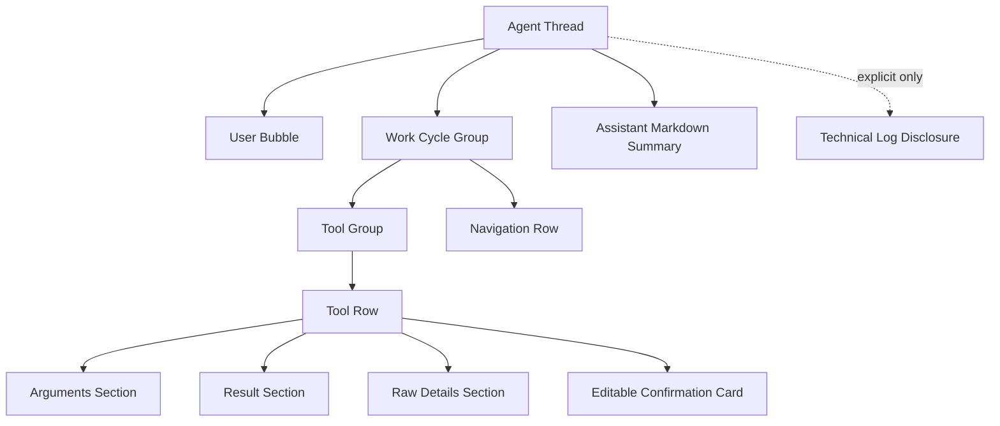
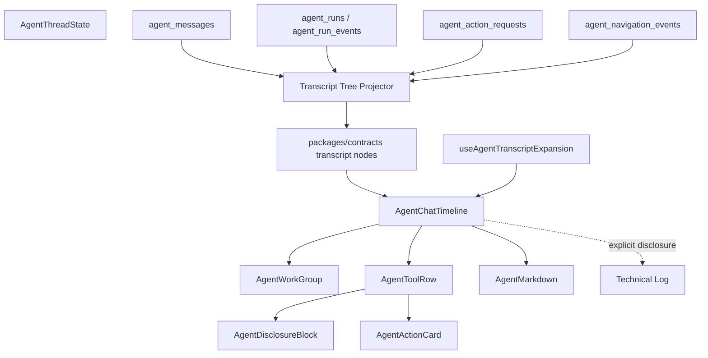

# ADR 0011: Layered Agent Transcript Disclosure

Status: Implemented

Date: 2026-05-23

Refines: ADR 0009 OpenClaw-Style Unified Agent Chat Transcript, ADR 0010 OpenClaw-Inspired Markdown Transcript Rendering

Implemented: 2026-05-23

## Context

ADR 0009 unified the Agent conversation surface: model replies, tool calls, tool results, navigation and confirmation cards now live in one transcript lane. ADR 0010 fixed assistant Markdown rendering.

The remaining issue is information architecture. The current transcript is still structurally flat:

- `packages/contracts/src/index.ts` exposes a flat `AgentTimelineItem[]`.
- `apps/api/src/agent/agent-timeline-projector.ts` merges and deduplicates flat items.
- `apps/web/src/components/agent/AgentChatTimeline.tsx` renders all non-message rows through one `TimelineEventRow`.
- frontend expansion state is one `expandedIds` set, so it cannot distinguish group expansion, tool body expansion, raw JSON expansion and confirmation-card expansion.

This cannot produce the mature Codex / Claude Code / OpenClaw style interaction where users see a compact work summary first, then expand progressively:

```text
Worked for 12s
  Ran 3 tools
    data_query_workspace
      arguments
      result preview
      raw JSON
    ui.navigate
    confirmation card
Assistant summary
```

The product requirement is not "show more logs". It is the opposite:

- hide harness internals by default
- show user-facing business/tool steps in the main transcript
- keep each visible step compact by default
- let users expand one level at a time when they want evidence
- keep editable confirmation cards inline with the tool/action that produced them

## Research Notes

### Codex

The public Codex repository separates execution cells from assistant prose.

Relevant public source:

- `codex-rs/tui/src/exec_cell/model.rs`
- `codex-rs/tui/src/exec_cell/render.rs`
- `codex-rs/tui/src/history_cell/mcp.rs`
- `codex-rs/tui/src/history_cell/separators.rs`

Codex does not flatten every event into the same row type. It has dedicated history cells:

- `ExecCell` represents a command or an "exploring" group of read/list/search calls.
- sequential read calls can coalesce into one `Explored` group.
- command display lines show a compact `Ran ...` row and only limited output.
- full command output is available through transcript/raw views rather than flooding the default lane.
- `Worked for ...` separators mark a top-level turn/work boundary.

The transferable idea is not the Rust TUI code. It is the model:

```text
turn/work boundary -> grouped execution cells -> compact row -> detailed transcript/raw output
```

### OpenClaw

OpenClaw is closer to xox-model because it is a web UI. It is also MIT licensed, so small pure modules can be ported or adapted with attribution.

Relevant public source:

- `ui/src/ui/chat/build-chat-items.ts`
- `ui/src/ui/chat/tool-cards.ts`
- `ui/src/ui/chat/tool-expansion-state.ts`
- `ui/src/ui/chat/grouped-render.ts`
- `ui/src/ui/chat/constants.ts`

The important OpenClaw boundaries are:

- chat items are built before rendering
- tool cards are extracted and rendered by a dedicated module
- tool expansion state is tracked per session, separate from message data
- inline tool calls and standalone tool outputs have collapsed summaries by default
- expanded tool cards show input, output, raw details and optional sidebar/canvas previews
- long output is truncated or collapsed using explicit thresholds
- duplicate or noisy messages can be collapsed before reaching the UI

This is the best direct reference for xox-model. We should port the design and small pure pieces where practical, not rebuild the same behaviors from scratch.

### Claude Code

Do not use leaked Claude Code source. Public Claude Code behavior and documentation still support the same product pattern:

- the conversation lane contains assistant prose and tool/command activity
- slash commands, hooks and output styles are product-level surfaces, not raw harness internals
- user-visible summaries appear after tool loops
- internal run machinery is not the default transcript

For xox-model, Claude Code is a UX reference only.

## Decision

Replace the flat Agent timeline renderer with a **layered transcript disclosure model**.

The final user-facing transcript should be a tree, not a list of unrelated rows:



The visible default should be:

- user messages as right-aligned bubbles
- assistant messages as Markdown prose, no assistant bubble chrome
- active turn status as a small `Thinking` or compact work row
- tool calls as one-line collapsed rows
- writes as inline editable confirmation interrupts
- final assistant summary after tool loops
- technical logs behind an explicit disclosure only

## Target Module Division

| Module | Target path | Responsibility | Reuse stance |
| --- | --- | --- | --- |
| Transcript contract | `packages/contracts/src/index.ts` | Define nested transcript node DTOs, disclosure state hints, node kinds and section kinds. | Local contract. Do not copy OpenClaw types directly because xox is SaaS/domain-specific. |
| Transcript projector | `apps/api/src/agent/agent-timeline-projector.ts` or replacement `agent-transcript-tree-projector.ts` | Project server-owned messages, run events, actions and navigation into nested user-facing nodes. | Reuse OpenClaw build-before-render principle. |
| Tool display registry | `apps/web/src/components/agent/agentToolDisplay.ts` or shared `packages/contracts` metadata if needed | Map tool names to compact labels, icons, risk display and default disclosure behavior. | Local business labels; no regex intent routing. |
| Expansion state hook | `apps/web/src/hooks/useAgentTranscriptExpansion.ts` | Track expansion by `threadId / runId / nodeId / sectionId`, with defaults and auto-open rules. | Port/adapt OpenClaw `tool-expansion-state.ts` shape with attribution if code is copied. |
| Transcript renderer | `apps/web/src/components/agent/AgentChatTimeline.tsx` | Render transcript tree, route node kinds to specialized components, remove flat `TimelineEventRow` as the primary abstraction. | Local React renderer. |
| Tool row | `apps/web/src/components/agent/AgentToolRow.tsx` | One-line collapsed tool row; expanded arguments/result/raw/confirmation sections. | Port/adapt OpenClaw `tool-cards.ts` concepts, not Lit templates. |
| Work group | `apps/web/src/components/agent/AgentWorkGroup.tsx` | Codex-style top-level run/work group such as `Worked for 12s`, counts and status. | Local React implementation inspired by Codex separators. |
| Raw/details block | `apps/web/src/components/agent/AgentDisclosureBlock.tsx` | Reusable disclosure block for arguments, result preview, raw JSON, audit detail and terminal-like output. | May reuse OpenClaw thresholds/constants. |
| Markdown | `apps/web/src/components/agent/AgentMarkdown.tsx` and `apps/web/src/lib/agentMarkdown.ts` | Continue assistant-only Markdown rendering from ADR 0010. | Already implemented. |
| Tests | `apps/web/src/components/agent/*.test.tsx`, `apps/api/tests/*agent*` | Verify tree projection, grouping, defaults, expand/collapse, hidden technical logs and confirmation-card ownership. | Add fixtures based on Codex/OpenClaw behavior. |

## Dependency Graph



The backend remains the source of truth. The frontend may hold expansion state, but it must not infer whether an action exists, whether a tool completed, or whether a confirmation card is valid.

## Transcript Node Model

Introduce a nested model conceptually shaped like this:

```ts
export type AgentTranscriptNodeKind =
  | 'user_message'
  | 'assistant_message'
  | 'assistant_stream'
  | 'work_group'
  | 'tool_group'
  | 'tool_call'
  | 'tool_result'
  | 'navigation'
  | 'confirmation'
  | 'action_update'
  | 'memory'
  | 'evaluation'
  | 'technical_group'
  | 'technical'

export type AgentTranscriptDisclosureKind =
  | 'group'
  | 'tool_body'
  | 'arguments'
  | 'result'
  | 'raw'
  | 'confirmation'
  | 'audit'

export type AgentTranscriptNode = {
  id: string
  threadId: string
  runId: string | null
  kind: AgentTranscriptNodeKind
  title: string
  summary?: string
  content?: string
  status: AgentTimelineItemStatus
  visibility: 'user' | 'technical'
  defaultOpen?: boolean
  disclosure?: {
    kind: AgentTranscriptDisclosureKind
    defaultOpen: boolean
    reason?: string
  }
  tool?: {
    name: string
    callId?: string | null
    argumentsPreview?: string
    resultPreview?: string
  }
  actionRequest?: AgentActionRequest | null
  navigation?: AgentNavigationEvent | null
  sections?: AgentTranscriptSection[]
  children?: AgentTranscriptNode[]
  createdAt: string
}
```

This can be implemented either by replacing `timelineItems` with nested nodes or by introducing a transitional field. The final state should not keep two competing primary transcript surfaces.

## Default Disclosure Policy

Default open/closed behavior should be deterministic and test-backed:

| Node/section | Default | Rule |
| --- | --- | --- |
| user message | visible | Bubble only. |
| assistant message | visible | Markdown prose, no assistant label bubble. |
| assistant stream | visible while active | Shows stable streaming text plus thinking indicator. |
| work group | closed after completion, open while running if useful | Summary row like `Worked for 12s`, with counts. |
| tool group | closed after completion, open while running or failed | Shows `调用 3 个工具` / `查询 6 项数据`. |
| read-only tool row | closed after completion | One line with label, tool name chip, status. |
| write tool row with pending confirmation | open to confirmation card | User must inspect/edit before execution. |
| failed tool row | open | Show concise error and relevant retry/correction hint. |
| arguments | closed | Open from tool body. |
| result preview | closed unless short and business-readable | Avoid raw data floods. |
| raw JSON/provider details | always closed | Only for debugging/evidence. |
| technical log | always closed, separate explicit entry | No harness internals in default transcript. |

## Grouping Rules

The projector should group by server-owned identifiers, not text heuristics:

- group nodes by `runId` into work cycles
- group provider tool calls emitted in the same planning turn into a tool group
- group read-only query/navigation pairs when they are part of the same data answer
- attach a pending `AgentActionRequest` to the tool/action row that produced it
- attach navigation rows to the nearest related tool/action when possible
- keep memory/evaluator rows technical unless they are directly user-actionable
- collapse repeated technical rows in the technical log only

No regex or keyword routing should be introduced. Grouping is display projection over already-known server state.

## Reuse Plan

Reuse OpenClaw in three layers.

### Directly portable or adaptable

- per-session/per-thread expansion state map from `tool-expansion-state.ts`
- tool card concepts from `tool-cards.ts`: collapsed summary, expanded input/output, raw details
- output preview constants from `constants.ts`: inline threshold, preview line limit, preview char limit
- build-before-render principle from `build-chat-items.ts`
- tests that prove collapsed and expanded states render different bodies

If substantial code is copied, add file-level attribution:

```ts
// Portions adapted from OpenClaw (MIT License)
// Source: https://github.com/openclaw/openclaw/blob/main/ui/src/ui/chat/tool-expansion-state.ts
```

The OpenClaw MIT license notice must remain available when substantial portions are reused.

### Adapt as design only

- OpenClaw's Lit rendering templates
- OpenClaw sidebar/canvas preview behavior
- OpenClaw session model
- OpenClaw plugin/channel runtime

These do not match xox-model's React SaaS architecture.

### Do not import

- OpenClaw control plane
- runner state
- plugin registry
- auth/session store
- local filesystem assumptions
- non-business agent shell behavior

xox-model's source of truth is still tenant-scoped API state, confirmation cards, audit logs and domain services.

## UX Target

For a simple greeting:

```text
你: 你好

你好，我可以帮你查看数据、调整模型、记账或管理版本。
```

No memory recall rows, no goal setup rows, no provider lifecycle rows.

For a read-only question:

```text
你: 我现在几个月回本？

▸ 查询数据  data_query_workspace  ✓

基准场景尚未回本。总收入 ... 总成本 ...
```

Expanding `查询数据` shows arguments, result preview and raw JSON.

For a write action:

```text
你: 把 4 月线上系数改成 0.3 并保存

▾ 修改模型  workspace_update_online_factor  待确认
  已打开：调模型
  确认卡：4 月线上系数 0.35 -> 0.3
  [编辑] [确认执行] [取消]
```

For a complex multi-step goal:

```text
Worked for 34s
▸ 配置经营模型  5 个动作 / 2 个待确认
  ▸ 工作区改名
  ▸ 配置股东和投资
  ▸ 建立 50 个成员
  ▸ 设置成本和节奏
  ▸ 生成 12 个月预测

我已生成可编辑确认卡。你确认后我会保存草稿，但不会发布正式版本。
```

The first screen should be compact. Expansion reveals detail, not another page of raw logs.

## Implementation Strategy

1. Extend contracts with transcript tree nodes and section types.
2. Add backend tree projector that consumes current messages/run events/actions/navigation without changing business execution.
3. Keep technical events out of the default tree unless they are user-actionable failures.
4. Add frontend expansion hook with per-thread/per-run/per-node keys.
5. Split `AgentChatTimeline` into specialized node renderers.
6. Port/adapt OpenClaw-style tool-card display and expansion modules with MIT attribution where code is copied.
7. Replace the flat `TimelineEventRow` primary path; do not keep old and new primary UIs side by side.
8. Add snapshot/static-render tests for simple greeting, read-only tool, pending confirmation, failed tool, technical log disclosure and complex multi-step grouping.
9. Verify in browser after implementation; this is a UI behavior change and cannot be accepted by unit tests alone.

## Acceptance Criteria

- Simple greeting shows only the user bubble, optional thinking state while running, and one assistant Markdown reply.
- Harness internals such as queue, worker lease, goal contract, evaluator loop and provider lifecycle are hidden from the default transcript.
- Completed read-only tool calls render as one-line collapsed rows with status.
- Expanding a tool row reveals at least arguments and result preview.
- Raw JSON/provider detail is a second-level disclosure and closed by default.
- Pending write actions render inline editable confirmation cards attached to the producing tool/action row.
- Failed tool rows auto-open to a concise error summary.
- Multi-tool turns render a compact tool group with counts.
- Complex multi-step goals render as a work group plus child action/tool rows, not as a wall of flat events.
- Expansion state persists while switching within the same thread and does not leak across threads.
- Technical log remains accessible through explicit disclosure.
- Web tests cover collapsed vs expanded states, default visibility rules and confirmation-card ownership.
- API tests cover tree projection from existing server-owned state.
- Browser verification confirms one-line collapsed tool rows and multi-level expansion in the real Agent console.

## Implementation Notes

- `packages/contracts/src/index.ts` now exposes `AgentTranscriptNode` and `AgentTranscriptSection`; `AgentThreadState` and `AgentSendResponse` include `transcriptNodes`.
- `apps/api/src/agent/agent-timeline-projector.ts` still keeps the flat timeline DTO as a compatibility/debug projection, but the frontend primary surface consumes the nested tree.
- Provider streamed tool-call argument rows are merged into the related server-owned confirmation tool node when both refer to the same canonical tool identity, so write actions render as one compact row with arguments, raw details and inline confirmation card.
- `apps/web/src/components/agent/AgentChatTimeline.tsx` renders the nested transcript directly: user bubbles, assistant Markdown prose, collapsed tool/work rows, nested disclosure sections, and explicit technical-log disclosure.
- `apps/web/src/hooks/useAgentTranscriptExpansion.ts` owns per-thread/per-run expansion state, separate from server-owned transcript data.
- The deprecated frontend provider stream preview helper and its old test were removed; provider stream visibility now comes through server-owned transcript nodes.

## Validation

- `npm.cmd run test:web` passed: 9 files, 49 tests.
- `npm.cmd run test:api` passed: 5 files, 97 tests.
- `npm.cmd run build:web` passed.
- `npm.cmd run build:api` passed.
- `npm.cmd run test` passed: web + api.
- Browser verification used a temporary Edge headless profile against `http://127.0.0.1:5174` and existing API on `127.0.0.1:8000`; checks confirmed the Agent console rendered, the simple send path showed user-visible progress, and default transcript text did not expose `对话时间线`, `Run 已入队`, `Worker 已认领`, or `目标契约`.

## Risks

- Adding a tree DTO beside the flat DTO can create competing sources of truth. The final implementation must converge on one primary transcript model.
- Over-grouping can hide important failures. Failed or waiting nodes must auto-open.
- Copying OpenClaw UI code too broadly would import the wrong product assumptions. Reuse should stay at pure expansion/tool-card logic and documented design patterns.
- Business confirmation cards must remain server-owned. The frontend may render and edit them, but it must not infer pending writes from tool-call text.

## Sources

- OpenClaw `tool-expansion-state.ts`: https://github.com/openclaw/openclaw/blob/main/ui/src/ui/chat/tool-expansion-state.ts
- OpenClaw `tool-cards.ts`: https://github.com/openclaw/openclaw/blob/main/ui/src/ui/chat/tool-cards.ts
- OpenClaw `grouped-render.ts`: https://github.com/openclaw/openclaw/blob/main/ui/src/ui/chat/grouped-render.ts
- OpenClaw `build-chat-items.ts`: https://github.com/openclaw/openclaw/blob/main/ui/src/ui/chat/build-chat-items.ts
- OpenClaw `constants.ts`: https://github.com/openclaw/openclaw/blob/main/ui/src/ui/chat/constants.ts
- Codex `exec_cell/model.rs`: https://github.com/openai/codex/blob/main/codex-rs/tui/src/exec_cell/model.rs
- Codex `exec_cell/render.rs`: https://github.com/openai/codex/blob/main/codex-rs/tui/src/exec_cell/render.rs
- Codex `history_cell/mcp.rs`: https://github.com/openai/codex/blob/main/codex-rs/tui/src/history_cell/mcp.rs
- Codex `history_cell/separators.rs`: https://github.com/openai/codex/blob/main/codex-rs/tui/src/history_cell/separators.rs
- Claude Code overview: https://docs.claude.com/en/docs/claude-code/overview
