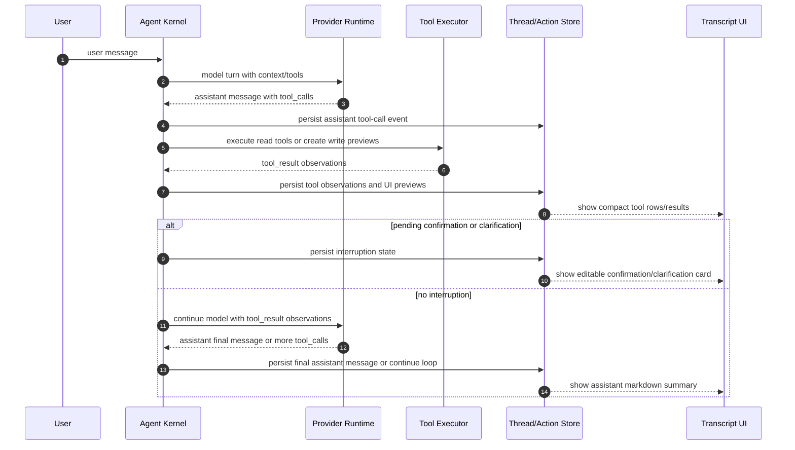

# ADR 0012: Tool Result Observation Continuation Loop

Status: Implemented

Date: 2026-05-24

Refines: ADR 0004 Evaluator-Centered Harness Agent, ADR 0009 OpenClaw-Style Unified Agent Chat Transcript, ADR 0011 Layered Agent Transcript Disclosure

## Context

The current Agent transcript and run loop have a deeper harness boundary error.

The user-facing symptom is that read-only tools such as `data_query_workspace` can appear to answer the user directly. The deeper problem is that the backend can treat tool results as an `assistant` reply instead of feeding those results back into the model and waiting for a real assistant continuation.

This violates the common agent-loop contract used by Codex-style, Claude Code-style, OpenAI Agents SDK-style, OpenClaw-style and Hermes-style harnesses:

```text
assistant tool_call -> tool result / observation -> model continues -> assistant final answer
```

Tool results are not final answers. They are observations. The UI may show them as evidence inside the tool row, but the assistant summary must come from a model message after the model has seen those observations.

## Current Problem

The current xox-model implementation can blur three different concepts:

1. **Tool observation**
   - Output from a domain service or executor.
   - Should be model-visible context for the next model turn.
   - May be rendered under the tool row as evidence.

2. **Assistant final message**
   - Natural-language answer generated by the model.
   - Should appear after tool loops or after an interruption state.
   - Should never be synthesized by joining tool result strings.

3. **Transcript display preview**
   - Compact UI summary for the user.
   - Helps users inspect arguments/results without reading raw JSON.
   - Must not become the assistant response source of truth.

Specific current risk points:

| Path | Risk |
| --- | --- |
| `apps/api/src/agent/action-graph-store.ts` | `storePlannedActionGraph` can build `assistant` from read-step `messages.join(' ')`, effectively turning tool observations into a reply. |
| `apps/api/src/agent/data-agent.ts` | Read services return polished user-facing prose such as read-only disclaimers. This should become structured observation plus optional display preview, not final answer text. |
| `apps/api/src/agent/agent-timeline-projector.ts` | Read plan-step summaries are attached to tool rows as result previews. This is acceptable only as UI evidence, not as the source of the assistant summary. |
| `apps/api/src/agent/goal-run-engine.ts` and related evaluator code | Completion must not be inferred from tool-result existence alone. A terminal state needs either a final assistant message, a pending confirmation/clarification interruption, or a failed/blocked state. |

The correct fix is not to hide the sentence in the frontend. The harness must represent tool results as observations and run another model turn when a final answer is required.

## Research Notes

### OpenClaw

OpenClaw was inspected locally at `C:\Github\openclaw`.

Relevant source:

- `src/agents/session-transcript-repair.ts`
- `ui/src/ui/chat/tool-cards.ts`
- `ui/src/ui/chat/build-chat-items.ts`
- `ui/src/ui/chat/tool-expansion-state.ts`

OpenClaw treats tool results as transcript items that must be paired with the matching assistant tool call. The repair logic keeps them as `toolResult`, moves them directly after the matching assistant tool-call turn, inserts missing error tool results when needed, and drops orphan/duplicate tool results.

The relevant design point is not just display. It is transcript validity:

```text
assistant with tool calls
  -> matching toolResult items
  -> next assistant turn
```

OpenClaw is MIT licensed. The local `package.json` and `LICENSE` confirm MIT terms. This allows small pure modules or functions to be ported with attribution, but it does not justify importing OpenClaw's control plane or product shell.

### OpenAI Agents JS

OpenAI Agents JS was inspected locally at `C:\Github\openai-agents-js`.

Relevant source:

- `packages/agents-core/src/runner/turnResolution.ts`
- `packages/agents-core/src/runner/conversation.ts`
- `packages/agents-core/src/runner/toolExecution.ts`
- `packages/agents-core/src/items.ts`

The SDK separates:

- `RunMessageOutputItem`: assistant message output
- `RunToolCallOutputItem`: tool output item

Tool outputs are appended to generated run items and converted back into input for the next model step. The turn resolver returns `next_step_run_again` after tool execution unless a real final output condition exists. Final text extraction uses message output items, not tool output items.

This is the clearest implementation of the target invariant:

```text
tool output item != assistant output item
```

### Hermes Agent

Hermes was inspected locally at `C:\Github\hermes-agent`.

Relevant source:

- `website/docs/developer-guide/agent-loop.md`
- `agent/tool_dispatch_helpers.py`
- `agent/tool_executor.py`

Hermes documents the same loop:

```text
if tool_calls:
  execute tools
  append {"role": "tool", "tool_call_id": "...", "content": result}
  call model again
else text response:
  persist and return
```

The sequential and concurrent executors append tool messages to the message list. They do not convert the tool result into an assistant message. A pending steer or later user instruction is injected so the model sees it on the next API iteration.

## Decision

xox-model will adopt a **tool-result-as-observation continuation loop**.

The harness must enforce this invariant:

```text
Only model-authored assistant message items can become assistant replies.
Tool results can be shown in the transcript, but they must remain observations.
```

### Target Run Loop



### Terminal States

A run can stop only in one of these states:

| State | Meaning | User-facing output |
| --- | --- | --- |
| `final_answer` | Model produced assistant text after seeing required observations. | Assistant Markdown summary. |
| `waiting_confirmation` | A write preview needs user approval/edit/cancel. | Editable confirmation card, no fake final answer. |
| `waiting_clarification` | Required fields or policy ambiguity need user input. | Clarification card/message. |
| `blocked` | Provider/tool/policy failure prevents progress. | Clear failure row and optional assistant explanation if model continuation is possible. |
| `cancelled` | User or worker lifecycle cancelled the run. | Cancelled state. |

The run must not stop as `completed` merely because a read tool returned a prose result.

## Module Division

| Module | Target path | Responsibility | Reuse / abstraction plan |
| --- | --- | --- | --- |
| Runtime item model | `packages/contracts/src/index.ts` | Distinguish assistant messages, tool calls, tool observations, confirmation interruptions and final outputs in DTOs. | Extend local contracts; do not expose OpenClaw types. |
| Agent kernel loop | `apps/api/src/agent/agent-kernel.ts` or current kernel boundary | Own `model -> tools -> observations -> model continuation -> final/interruption` loop. | Follow OpenAI Agents SDK state machine; keep provider-neutral. |
| Tool observation store | `apps/api/src/agent/tool-observation-store.ts` or folded into thread store if small | Persist tool results with `runId`, `toolCallId`, `toolName`, structured payload, display preview and redacted raw detail. | Candidate for new module only if existing thread store becomes mixed. |
| Provider transcript adapter | `apps/api/src/agent/runtime/*` | Convert observations to provider-specific next-turn input: OpenAI-compatible `role: tool` / `function_call_result`, OpenAI Agents SDK run items, or future provider formats. | Adapt OpenClaw pairing/repair ideas below runtime adapter. |
| Tool result pairing repair | `apps/api/src/agent/runtime/tool-result-pairing.ts` | Ensure assistant tool calls are followed by matching tool observations before provider continuation. | Candidate for MIT-attributed small pure port from OpenClaw `session-transcript-repair.ts`. |
| Data read tools | `apps/api/src/agent/data-agent.ts` and related read services | Return structured `observation` plus optional `displayPreview`; remove final-answer prose responsibility. | Local domain services. |
| Action graph store | `apps/api/src/agent/action-graph-store.ts` | Persist plan/action rows and interruption state; stop synthesizing assistant replies from tool result strings. | Refactor existing path; avoid parallel store. |
| Completion evaluator | `apps/api/src/agent/completion-evaluator.ts` | Check final assistant presence or valid interruption state, plus domain/action facts. | Extend current evaluator. |
| Transcript projector | `apps/api/src/agent/agent-timeline-projector.ts` | Render tool observations inside tool rows and assistant messages only from model-authored messages. | Keep ADR 0011 tree, but fix source ownership. |
| Frontend transcript | `apps/web/src/components/agent/*` | Show tool results as expandable evidence; show final assistant Markdown only from assistant messages. | Reuse existing layered renderer. |

## Dependency Graph

```text
web transcript
  -> contracts transcript DTO
    -> api thread projection
      -> thread/action/tool-observation stores
        -> agent kernel
          -> runtime adapter
          -> tool executor
            -> domain services
```

The dependency direction must stay one-way:

```text
runtime adapter -> internal runtime result
agent kernel -> tool executor / action graph / thread store
tool executor -> domain services
transcript projector -> persisted messages/events/observations
frontend -> contracts only
```

Forbidden dependencies:

- domain services depending on Agent transcript types
- frontend inferring assistant summaries from tool result previews
- provider adapters writing confirmation cards directly
- action graph store synthesizing assistant final answers
- OpenClaw runtime/control-plane types leaking into xox-model contracts

## Data Model

Introduce or normalize an internal observation shape:

```ts
type AgentToolObservation = {
  id: string
  threadId: string
  runId: string
  toolCallId: string
  toolName: string
  status: 'completed' | 'failed' | 'cancelled'
  structured: unknown
  displayPreview?: string
  modelContent: string | Array<unknown>
  redactedRaw?: unknown
  createdAt: string
}
```

Rules:

- `modelContent` is what gets sent back to the model.
- `displayPreview` is what the UI can show under the tool row.
- `structured` is for evaluator/domain validation.
- `redactedRaw` is for technical logs only.
- none of these fields are an assistant message.

The persisted assistant message should have a different type and source:

```ts
type AgentAssistantMessage = {
  role: 'assistant'
  source: 'model'
  content: string
  runId: string
}
```

There should be no `source: 'tool_result_as_assistant'` compatibility path.

## OpenClaw Reuse Plan

Reuse OpenClaw in three levels.

### Directly portable candidates

Only small MIT-attributed pure modules/functions should be ported:

| OpenClaw source | Reuse target | Notes |
| --- | --- | --- |
| `src/agents/session-transcript-repair.ts` | `apps/api/src/agent/runtime/tool-result-pairing.ts` | Port/adapt the idea of pairing assistant tool calls with matching tool results. Convert OpenClaw `toolResult` role to xox/OpenAI-compatible observation types. |
| `ui/src/ui/chat/tool-cards.ts` | existing transcript tool body logic | Reuse display principles only if current ADR 0011 implementation still lacks compact evidence rendering. |
| `ui/src/ui/chat/tool-expansion-state.ts` | frontend expansion hook | Already covered by ADR 0011; reuse only if further expansion bugs remain. |
| output threshold constants | transcript body preview limits | Safe to adapt with attribution. |

Attribution pattern for substantial ports:

```ts
// Portions adapted from OpenClaw (MIT License)
// Source: https://github.com/openclaw/openclaw/blob/main/src/agents/session-transcript-repair.ts
```

The OpenClaw MIT license notice must remain available when substantial code is reused.

### Architecture reuse only

Use as design reference, not code:

- build-before-render transcript projection
- strict tool call/result transcript validity
- tool rows as compact user-visible evidence
- technical details behind explicit disclosure
- provider compatibility and repair below the business harness

### Do not reuse

Do not import or port:

- OpenClaw control plane
- gateway/channel system
- plugin registry
- filesystem session/auth store
- runner state machine wholesale
- Lit UI templates
- OpenClaw product shell or settings UI

xox-model must remain a SaaS business harness with tenant-owned workspaces, editable confirmations, domain validation and audit logs.

## Implementation Plan

This ADR is intentionally written before implementation. The implementation should proceed in small verifiable steps.

1. **Add failing tests for the invariant**
   - API tests should assert that a run with a read tool does not persist the tool result as an assistant message.
   - API tests should assert that after a read tool result, the runtime is invoked again unless the run is waiting for confirmation/clarification or failed.
   - Frontend tests should assert that the tool row shows the tool return while the final assistant summary comes from a separate assistant message.

2. **Introduce tool observation ownership**
   - Add or normalize an internal `AgentToolObservation` representation.
   - Persist observations with `toolCallId`.
   - Project observations into tool rows.

3. **Refactor read tools**
   - Change read services to return structured observation and display preview.
   - Remove read-only disclaimer prose from tool output.
   - Keep domain facts precise for evaluator and model continuation.

4. **Refactor action graph assistant synthesis**
   - Remove `messages.join(' ')` assistant synthesis.
   - Let action graph persistence return observations/interruption state, not final reply text.

5. **Add model continuation**
   - After tool observations are stored, call the provider runtime again with matching tool results in transcript.
   - Continue until final assistant text, pending confirmation/clarification, failure, cancellation or budget stop.

6. **Add pairing/repair boundary**
   - Port/adapt OpenClaw-style pairing repair if needed.
   - Validate no orphan tool results reach provider continuation.

7. **Update evaluator**
   - Completion requires a final assistant message or explicit interruption/failure state.
   - Tool observation alone is not completion.

8. **Update transcript projection**
   - Tool observations remain inside tool rows.
   - Assistant Markdown summary renders only model-authored assistant messages.
   - Technical logs can show raw observation details behind explicit disclosure.

## Implementation Notes

Implemented in the TypeScript Agent harness on 2026-05-24.

Key paths:

- `apps/api/src/agent/tool-observation-continuation.ts`
  - Introduces the internal `AgentToolObservation` representation.
  - Builds a provider-compatible continuation transcript: assistant tool calls followed by matching `role: tool` observations.
  - Emits continuation run events and creates a failed plan step when the model cannot produce a final assistant message.
- `apps/api/src/agent/action-graph-store.ts`
  - Stops synthesizing assistant replies from read-tool strings.
  - Returns `assistantText` only for model-authored assistant messages and `observations` for tool results.
- `apps/api/src/agent/goal-run-engine.ts`
  - Feeds read and auto-executed action observations back into the model before adding an assistant message.
  - Keeps pending confirmation cards as interruption states without fake final answers.
- `apps/api/src/agent/approval-executor.ts`
  - Feeds confirmed-write execution observations back into the model before adding a post-confirmation assistant message.
- `apps/api/src/agent/data-agent.ts`
  - Converts read tools to structured observations plus display previews, removing canned read-only final-answer prose.
- `apps/api/src/agent/runtime/*`
  - Accepts explicit chat-message transcripts for continuation turns while keeping provider-specific formatting below the harness boundary.
- `apps/api/tests/api.test.ts`
  - Covers read-tool continuation, no synthesized assistant message, continuation failure as a failed run, provider assistant text, write interruption, and confirmed-write continuation paths.

No substantial OpenClaw source was copied. The implementation reuses OpenClaw's transcript-validity idea, while keeping xox-model's provider-neutral SaaS harness and tenant-scoped storage.

## Acceptance Criteria

Behavior:

- A simple greeting with no tools renders only the user bubble and model assistant reply.
- A read-only question such as "我们几个月可以回本？" runs `data_query_workspace`, stores a tool observation, sends that observation back to the model, and renders a model-authored answer after the tool row.
- The tool row can show parameters and the actual tool return, but the final assistant summary is not copied from the tool result.
- Tool output text such as read-only disclaimers does not appear as canned final prose.
- A write request creates editable confirmation cards and stops in `waiting_confirmation`; it does not fabricate a final answer before confirmation.
- After the user confirms a write action, the execution observation is fed back into the model so the assistant can summarize completion or continue the multi-step goal.
- Multi-step goals can alternate model turns and tool batches until evaluator completion.

Safety:

- Tool observations are paired to assistant tool calls by `toolCallId`.
- Orphan tool results fail closed or are repaired before model continuation.
- Tool results are redacted before provider injection and before transcript projection.
- No provider raw chunks or secrets become assistant messages.
- Tenant/workspace scope is preserved for observations, messages, confirmations and evaluator checks.

Tests:

- `npm.cmd run test:api` includes coverage for read-tool continuation, write interruption, confirmed-write continuation, failed tool observation and evaluator terminal states.
- `npm.cmd run test:web` includes coverage for transcript ownership: tool result in tool row, assistant summary from assistant message.
- `npm.cmd run build` passes.
- If OpenClaw code is substantially ported, tests cover the ported pairing/repair logic and attribution comments are present.

Manual verification:

- In the browser, ask a read-only question. The UI should show:

```text
User bubble
Work cycle
  Tool group
    Tool row with expandable params/result
Assistant Markdown summary from model continuation
```

- The assistant summary should be natural language generated after the model saw the tool result.
- The tool result should remain inspectable but not be duplicated as final answer.

## Consequences

Benefits:

- Aligns xox-model with mature harness practice.
- Fixes the root cause instead of hiding bad transcript text.
- Makes read operations useful to the model, not just to the UI.
- Keeps transcript evidence and assistant prose separate.
- Enables complex multi-step loops where the model can inspect intermediate results before deciding the next action.

Costs:

- Adds at least one provider continuation call after read tools.
- Requires careful timeout/budget policy for long multi-step goals.
- Requires migration or projection handling for older tool-result-shaped assistant messages in existing local data.
- Tests need to distinguish model-authored assistant messages from tool observations.

Risks:

- Some providers may mishandle tool-result continuation formats. This must live in runtime adapters and provider profiles, not business tools.
- If continuation is forced after every tool, latency can rise. The evaluator should decide when an interruption state is terminal and when model continuation is necessary.
- Porting OpenClaw code too broadly would import the wrong product assumptions. Keep reuse small, pure, attributed and below xox-model's SaaS boundaries.

## References

- OpenClaw repository: `https://github.com/openclaw/openclaw`
- OpenClaw MIT License: `https://github.com/openclaw/openclaw/blob/main/LICENSE`
- OpenClaw transcript repair: `https://github.com/openclaw/openclaw/blob/main/src/agents/session-transcript-repair.ts`
- OpenAI Agents JS run loop: `https://github.com/openai/openai-agents-js/blob/main/packages/agents-core/src/runner/turnResolution.ts`
- OpenAI Agents JS run items: `https://github.com/openai/openai-agents-js/blob/main/packages/agents-core/src/items.ts`
- Hermes Agent loop docs: `https://github.com/NousResearch/hermes-agent/blob/main/website/docs/developer-guide/agent-loop.md`
