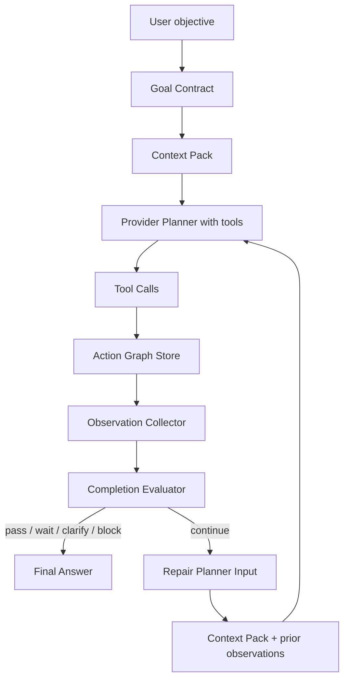
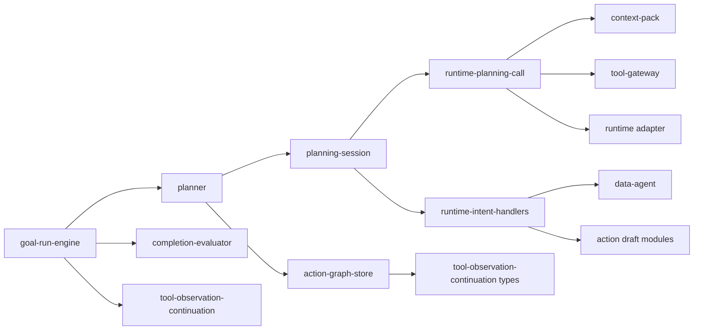

# ADR 0014: Observation-Driven Planning Loop And Entity Inspection

Status: Accepted

Date: 2026-05-24

## Context

The `04ee0e0a` production thread exposed a harness-level failure:

- The run made multiple provider planning calls, but the main transcript showed only a few projected rows, making the actual tool loop hard to understand.
- The model tried to ask the user for the first shareholder name and current investment amount, even though this is tenant-scoped workspace state the system should be able to inspect.
- The Goal Run Engine repeated the same failed repair brief and eventually marked the run `completed` while the goal row remained `repairing`.
- Tool observations were fed only into the final-answer pass. They were not available to the next planning turn with tools still enabled, so the model could not do a Codex-style loop: inspect state, reason from observations, then call the next tools.
- The evaluator treated read-only ledger/history questions and explicit no-write checks as missing write confirmations. That made the repair loop continue after the model had already produced the correct read observation.

This is not a regex or keyword-routing problem. The model should still own semantic tool selection. The harness must provide the right visible read tools, preserve tool observations across repair turns, and stop cleanly when the goal remains unfinished.

## Decision

Adopt an observation-driven planning loop for multi-step Agent goals.

### Module Division

- `context-pack.ts`
  - Continues to provide compact tenant-scoped workspace context.
  - Must expose high-value entity facts needed for business references, especially shareholders with current investment and dividend data.

- `data-agent.ts`
  - Adds a first-class read scope for entity inspection, including members, shareholders, employees and cost item names.
  - This read is visible as a business tool row, not hidden as technical context.

- `runtime-planning-call.ts`
  - Accepts prior tool observations and includes them in the next provider planning request while tools remain available.
  - Reuses the same provider-native tool-call path; it does not introduce JSON planning or regex routing.

- `goal-run-engine.ts`
  - Accumulates observations across iterations.
  - Sends observations into repair planning turns.
  - Does not call the final-answer continuation until the evaluator reaches a terminal state or iterations are exhausted.
  - If iterations are exhausted while the evaluator still says `continue`, the run must not be presented as successfully completed.

- `goal-fact-extractor.ts` / `completion-evaluator.ts`
  - Must distinguish write goals from read-only inspections. Phrases like ledger history filtering, variance questions, and explicit no-write checks are read goals unless the user asks to create, edit, void, restore, save, or publish business state.
  - No-op write tool arguments are observations, not missing confirmation cards.

- `tool-catalog.ts`
  - Extends `data_query_workspace` rather than adding a parallel read mechanism, unless future entity tools become large enough to deserve separation.
  - Tool descriptions must tell the model to inspect current entities before asking the user for information that exists in the workspace.

### Dependency Graph

## Product Behavior

For a cross-domain request such as:

> 我们几个月才能回本？帮我记一笔成员A的今天的线上10张，然后帮我第一个股东注资100w

The expected loop is:

1. The model may emit a short visible planning preface.
2. It can call `data_query_workspace(scope=workspace_summary)` for payback.
3. It can call `data_query_workspace(scope=entity_summary)` to inspect members/shareholders if the write references depend on existing workspace entities.
4. After those read observations return, a later planning turn receives the observation facts and can call write tools or ask only for truly missing information.
5. The user sees compact tool rows in one work cycle, grouped by actual tool calls.
6. Final assistant Markdown is generated after tool calls and confirmation cards are prepared.

## Validation

Automated tests must prove:

- Prior observations are included in repair planning prompts.
- `data_query_workspace(scope=entity_summary)` returns current shareholders and members from the current tenant workspace.
- A multi-step cross-domain fake-provider run can inspect entities in one turn and then create pending write confirmations in a later turn without repeated memory injection.
- A run that exhausts repair iterations while the evaluator still says `continue` is not silently treated as a successful completed goal.
- Read-only ledger filters and explicit no-write checks do not trigger missing-write repair loops.

## Non-Goals

- Do not add regex-based semantic routing.
- Do not hide business entity inspection inside invisible context only.
- Do not introduce a second planner protocol beside provider-native tool calls.
- Do not expose queue, worker lease, provider retry, memory recall, or evaluator internals in the default user transcript.
