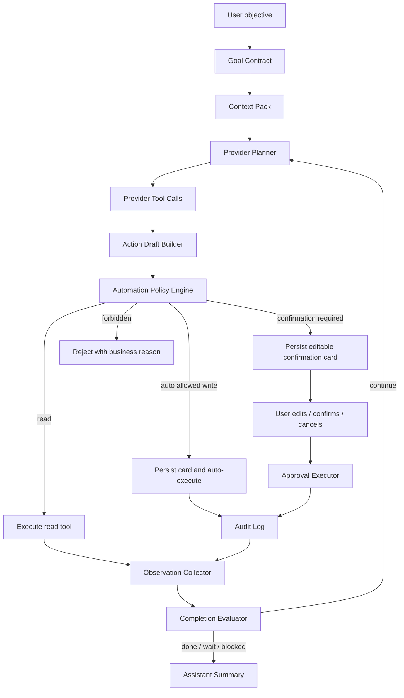

# ADR 0015: Automation Level As Execution Authority

Status: Accepted

Date: 2026-05-24

## Context

The current Agent OS design incorrectly treats `automationLevel` as planner aggressiveness:

- `manual / low / medium / high` were documented as different degrees of planner willingness to complete multi-step goals.
- `high` still produced pending confirmation cards for medium-risk business writes.
- Tests and smoke coverage reinforced the wrong behavior by expecting `automationLevel=high` to never auto-execute writes.

This contradicts the product intent. In xox-model, the Agent is an operating layer for a SaaS business system:

- The planner should always pursue the user's goal with full effort, subject to budget, tools, tenant scope, evaluator state and safety policy.
- `manual / low / medium / high` should describe execution authority, not reasoning quality or planning depth.
- User-visible actions should still be editable, auditable and page-grounded.

The local references point to the same separation:

- OpenClaw's exec approval model separates where a tool runs from how it is approved. `tools.exec.host=auto` chooses the execution location; YOLO is `security=full` plus `ask=off`, which changes approval behavior, not planning depth. See `C:\Github\openclaw\docs\tools\exec-approvals.md`.
- OpenClaw's ACP approval classifier auto-approves narrow read/search classes but prompts for mutating, exec-capable and control-plane tools. See `C:\Github\openclaw\src\acp\approval-classifier.ts`.
- OpenAI Agents JS models this as tool-level HITL. `needsApproval` can pause a run with `interruptions`; applications can approve/reject and resume the same `RunState`. Programmatic approval callbacks can continue the run without pausing. See `C:\Github\openai-agents-js\docs\src\content\docs\zh\guides\human-in-the-loop.mdx`.
- Hermes Agent uses YOLO and session approvals as execution permission controls. Hardline blocks remain below YOLO. Tool progress and reasoning display are presentation settings, not planner-effort settings. See `C:\Github\hermes-agent\tools\approval.py`.

## Decision

Redefine `AgentAutomationLevel` as an execution authority policy.

The Goal Run Engine, provider planner, tool catalog projection, observation loop, evaluator and repair planner must always run at full planning effort. Automation level is evaluated only after the model has selected tools and the server has produced typed action drafts.



## Automation Semantics

Automation level is a maximum execution authority. It does not change:

- model choice
- reasoning effort
- tool catalog breadth
- evaluator strictness
- repair-loop depth
- memory recall policy
- transcript visibility rules

```text
manual  -> reads may run; every write remains an editable pending confirmation card
low     -> reads and low-risk writes may auto-execute; medium/high writes wait
medium  -> reads, low-risk writes and medium-risk writes may auto-execute; high writes wait
high    -> reads, low-risk writes and medium-risk writes may auto-execute; high writes require action-kind policy
```

High automation is not a universal bypass. It means the user grants the maximum normal business automation authority, but xox-model still applies SaaS safety floors:

- account actions are never agent-executable
- cross-tenant actions are impossible
- locked-period and derived-entry invariants still apply
- destructive or irreversible high-risk actions require an explicit `autoExecutableAtHigh` policy before they can run without manual confirmation
- tool execution always goes through domain services and audit

## Risk And Authority Matrix

| Action class | Examples | Risk | Manual | Low | Medium | High |
| --- | --- | --- | --- | --- | --- | --- |
| Read | forecast query, entity summary, ledger filter | read | auto | auto | auto | auto |
| Low write | save snapshot, harmless preference-style business state where supported | low | pending | auto | auto | auto |
| Medium write | member income entry, normal expense entry, workspace rename, draft patch, share revoke | medium | pending | pending | auto | auto |
| High reversible write | restore/void entry, lock/unlock period, promote/rollback if policy allows | high | pending | pending | pending | depends on `autoExecutableAtHigh` |
| High destructive or publishing write | publish release, delete version, import overwrite, reset draft, delete member/shareholder/employee | high | pending | pending | pending | pending unless explicitly whitelisted later |
| Account action | logout, delete account, password change | forbidden | forbidden | forbidden | forbidden | forbidden |

This matrix is intentionally product-owned. Tool metadata must expose `riskLevel`, but the authority decision belongs to a central policy engine rather than scattered action builders.

## Module Division

### `apps/api/src/agent/tool-policy.ts`

Current responsibility remains:

- action kind metadata
- required navigation
- minimum risk validation
- tenant/workspace/version/ledger invariant checks

New responsibility:

- export a pure authority decision helper, for example:

```ts
type AgentActionAuthorityDecision =
  | { mode: 'auto_execute'; reason: string }
  | { mode: 'require_confirmation'; reason: string }
  | { mode: 'forbidden'; reason: string }
```

This helper must accept:

- `automationLevel`
- action kind
- risk level
- tool metadata
- action payload summary
- current workspace/user policy facts

It must not inspect user text or implement semantic routing.

### `apps/api/src/agent/approval-executor.ts`

Current responsibility remains:

- create editable action requests
- edit pending requests
- execute confirmed requests
- record audit

New responsibility:

- support Agentic OS `ToolRuntime`-owned auto-execution after action preview
- always persist an action request before auto execution
- let Agentic OS write standard `action.executed` / `action.audited` lifecycle events; xox may project them as product `action_executed` run events
- re-use `assertActionExecutionAllowed` for both manual confirmations and auto-executed actions

Auto-execution must be a lifecycle branch of the same confirmation-card path, not a second business execution path.

### `apps/api/src/agent/action-graph-store.ts`

Current responsibility remains:

- persist plan steps, action requests, navigation rows and run events

New responsibility:

- report pending, executed, failed and auto-executed counts based on actual action request state
- make auto-executed actions visible in the user transcript as completed tool rows

### `apps/api/src/agent/goal-run-engine.ts`

Responsibility must explicitly exclude automation policy. It should:

- always run the full plan/observe/evaluate/repair loop
- pass `automationLevel` to the action graph / approval boundary
- never reduce planning effort because the level is `manual` or `low`

### `apps/api/src/agent/tool-catalog.ts`

Tool metadata should continue to carry:

- provider tool schema
- capability bucket
- risk level
- navigation target
- action kind where applicable

Add when needed:

- `authorityClass`
- `autoExecutableAtHigh`
- `requiresExplicitUserConfirmationReason`

These are business-policy flags, not prompt instructions.

### `apps/web/src/components/agent/*`

The selector label should be execution-authority language, not planner-strength language.

Suggested labels:

```text
手动确认
低自动化
中自动化
高自动化
```

The UI should explain through compact tooltip/help text:

- planning effort is always full
- the level controls whether eligible write cards can execute automatically
- high-risk business changes may still require confirmation

## Dependency Graph

```mermaid
flowchart LR
  Web[web automation selector] --> Contracts[contracts AgentAutomationLevel]
  Contracts --> Routes[agent routes / run submission]
  Routes --> Run[agent_runs.automation_level]
  Run --> Goal[goal-run-engine]
  Goal --> Planner[planner / runtime planning call]
  Planner --> Drafts[action draft builders]
  Drafts --> Store[action-graph-store]
  Store --> Policy[tool-policy authority decision]
  Policy --> Approval[approval-executor]
  Approval --> Domain[domain services / modules]
  Domain --> Audit[audit logs]
  Approval --> Transcript[agent transcript projection]
```



The planner produces intent and action drafts. The policy engine decides execution authority. The executor performs the business mutation. The transcript renders the result.

## OpenClaw Reuse Plan

OpenClaw is MIT licensed, and its local `LICENSE` confirms that small pure modules can be reused with attribution. The reuse should be surgical:

### Good candidates to port or adapt

- Approval classification vocabulary:
  - OpenClaw: `readonly_scoped`, `readonly_search`, `mutating`, `exec_capable`, `control_plane`, `unknown`
  - xox-model adaptation: `read`, `low_write`, `medium_write`, `high_reversible`, `high_destructive`, `account_forbidden`
- Decision-shape pattern:
  - OpenClaw classifier returns `{ approvalClass, autoApprove }`
  - xox-model should return `{ mode, reason }`
- Policy layering idea:
  - OpenClaw effective policy is the stricter result of requested policy and host policy.
  - xox-model should combine user automation level, action metadata, workspace policy and hard SaaS invariants.
- Stable approval vocabulary:
  - `auto-approved`, `requested`, `denied`, `cancelled`
  - xox-model should map these to run events and transcript states.

### What must not be imported

- OpenClaw control plane
- local host exec approvals JSON store
- node/gateway host routing
- ACP session actor queues
- CLI permission prompts
- local filesystem path approval assumptions
- plugin registry
- OpenClaw runner state
- channel delivery and device pairing

xox-model is a SaaS business harness. Approval state lives in DB tables and is scoped by user/workspace/thread/run/action. It cannot inherit OpenClaw's local-machine trust model.

### Attribution rule

If implementation copies non-trivial code from OpenClaw, add an inline source comment in the new file header:

```ts
// Inspired by OpenClaw's MIT-licensed approval classifier.
// Adapted for xox-model SaaS business action authority.
```

Prefer adaptation over direct copy because the domain classes and trust boundary are different.

## Naming And Style

Use names that reflect authority, not planning strength:

- `automationLevel` can remain the contract field for compatibility.
- Internal helpers should use `authority` naming:
  - `resolveActionAuthority`
  - `AgentActionAuthorityDecision`
  - `canAutoExecuteAction`
  - `autoExecutableAtHigh`
- Do not introduce names like:
  - `plannerAggressiveness`
  - `planningLevel`
  - `highEffortMode`
  - `lowEffortMode`

The planner may have separate runtime budgets or model reasoning settings in the future, but those must be named separately and must not reuse `automationLevel`.

## Expected Product Behavior

For:

> 我们几个月才能回本？帮我记一笔成员A的今天的线上10张，然后帮我第一个股东注资100w

At any automation level, the planner should fully pursue all three subgoals:

1. inspect payback facts
2. inspect current members/shareholders if needed
3. prepare the member income write
4. prepare the shareholder investment write
5. evaluate whether anything remains missing
6. produce a final model-authored summary

The difference is execution authority:

- `manual`: both writes remain editable pending confirmation cards
- `medium`: eligible medium-risk writes auto-execute after persisted action/audit lifecycle
- `high`: eligible medium-risk writes auto-execute; high-risk writes follow `autoExecutableAtHigh`

The model should not ask for first-shareholder facts that the workspace can inspect. If an entity reference remains ambiguous after inspection, only that dependent action should become a clarification, while independent actions continue.

## Validation Requirements

Implementation must add or update tests proving:

- `automationLevel` does not change tool projection breadth, repair-loop depth or evaluator behavior.
- `manual` keeps medium-risk writes pending.
- `medium` and `high` auto-execute an eligible medium-risk write through the same action request and approval executor lifecycle.
- Auto-execution still writes `agent_action_requests`, `audit_logs`, navigation, run events and transcript rows.
- High-risk destructive actions remain pending unless action metadata explicitly allows auto execution at high automation.
- Account actions remain forbidden for every automation level.
- The cross-domain complex request can inspect data, prepare/execute eligible writes according to authority, wait only for genuinely pending or ambiguous parts, and still generate a final assistant summary.
- Real-provider smoke must validate execution facts, not only action count or assistant prose.

## Migration Notes

This ADR supersedes the old `docs/agent-design.md` section that said automation level controls planner aggressiveness.

Implementation should proceed in this order:

1. Introduce authority decision helpers and tests without changing planner behavior.
2. Wire approval executor auto-execution through the existing confirmation-card lifecycle.
3. Update API integration tests that currently expect `high` to keep all writes pending.
4. Update real-provider smoke coverage from `automation_high_requires_confirmation` to authority-specific assertions.
5. Update frontend selector copy and transcript display for auto-executed actions.
6. Run `npm.cmd run test:api`, `npm.cmd run test:web`, `npm.cmd run build:web`, `npm.cmd run test`, and one real-provider `smoke:agent`.

## Non-Goals

- Do not introduce regex or keyword semantic routing.
- Do not create a second business execution path for auto-executed actions.
- Do not import OpenClaw's control plane or local exec approval store.
- Do not lower planner quality for lower automation levels.
- Do not hide auto-executed writes from the action graph or audit log.
