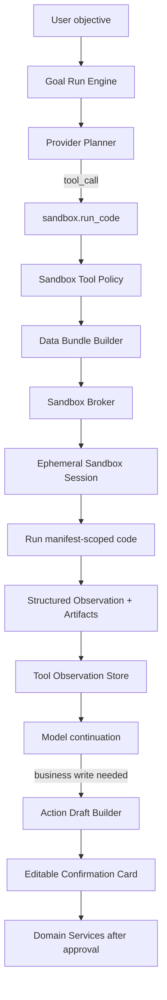
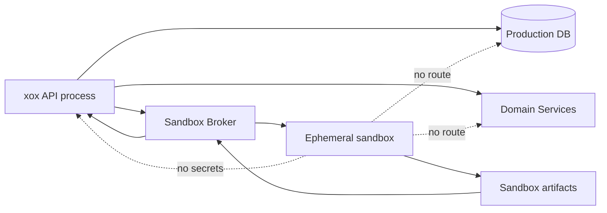
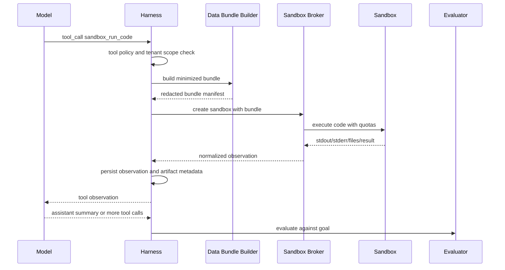

# ADR 0016: Manifest-Scoped Sandbox Tool

Status: Accepted, refined by ADR 0026 and ADR 0030

Date: 2026-05-29

## Context

`xox-model` is a multi-tenant SaaS business system. Its Agent OS already follows a harness model: model-selected tools, typed action drafts, editable confirmation cards, domain-service execution, audit logs, observation feedback, evaluator repair loops and tenant-scoped memory.

The missing capability is controlled code execution. Users will eventually ask the Agent to:

- run heavier financial simulations than a prompt or deterministic domain function should handle;
- clean uploaded CSV/XLSX files before import;
- compare alternative operating formulas, commission plans or scenario grids;
- generate charts, tables or intermediate artifacts that help users decide what to save;
- validate, reconcile or reshape temporary business data before it becomes an editable xox action.

Local coding agents such as OpenClaw and Hermes can execute code because their normal trust model is a user-owned machine, repo or container. Even when they run on a remote box, that box is usually dedicated to the operator's workspace. `xox-model` is different: a production API host sits next to many tenants' data, credentials, caches, object-storage access, logs and internal services. Letting a model generate arbitrary code inside the API process, the production container, the production VPC or with production secrets would turn a user-level execution feature into a cross-tenant security boundary.

The product requirement is therefore narrower than a hosted coding agent, but broader than analysis only:

> Give the harness Agent manifest-scoped code execution without giving it business write authority or production-runtime access.

This ADR defines a **Manifest-Scoped Sandbox Tool**. "Read-only" means read-only with respect to durable business state, not limited to analytical use cases. The sandbox may create temporary files and artifacts inside its own workspace, but it cannot mutate `xox-model` workspaces, ledgers, versions, users, provider settings, memory records or any production database. Its real boundary is the manifest: identity, data bundle, filesystem, runtime, network and capability policy are all declared before execution and enforced outside the model-generated code.

## Reference Findings

### OpenAI Agents JS

Local reference: `C:\Github\openai-agents-js`.

Relevant files and docs:

- `docs/src/content/docs/guides/sandbox-agents/concepts.mdx`
- `docs/src/content/docs/guides/sandbox-agents/clients.mdx`
- `docs/src/content/docs/guides/human-in-the-loop.mdx`
- `docs/src/content/docs/guides/guardrails.mdx`
- `packages/agents-core/src/sandbox/runtime/agentPreparation.ts`
- `packages/agents-core/src/sandbox/runtime/providedSessionManifest.ts`

Useful ideas:

- `SandboxAgent` separates normal agent orchestration from sandbox execution. The agent still has instructions, tools, handoffs, guardrails and hooks; the sandbox session owns command/file execution.
- `Manifest` is the starting workspace contract. It materializes only the files, environment and mounts explicitly provided for that run.
- `sandbox` run options decide whether a run creates, resumes or injects a sandbox session. Session lifecycle is explicit.
- Capabilities such as shell, filesystem, memory and compaction are attached to the sandbox agent and bound to the live sandbox session.
- Hosted clients such as E2B, Daytona, Modal, Runloop, Vercel and Cloudflare are treated as interchangeable execution backends behind the same agent shape.
- HITL interruptions and tool guardrails are still owned by the outer runtime. Sandbox execution does not replace approval policy.
- The docs explicitly warn that serialized run context can persist app data, so secrets should not be placed into run context.

Direct implication for xox-model:

- We can reuse the **layering**: `Agent -> Sandbox Tool -> Sandbox Session -> Observation`.
- We should not expose a full `SandboxAgent` as the business Agent's primary identity yet. The product needs one governed sandbox tool, not a second coding assistant living inside the SaaS app.
- If we use OpenAI Agents SDK sandbox clients later, they should sit behind our own `sandbox-broker` interface. The harness and business policy should not depend on one provider's sandbox API.

### OpenClaw

Local reference: `C:\Github\openclaw`.

Relevant files and docs:

- `docs/tools/exec-approvals.md`
- `src/acp/approval-classifier.ts`
- `src/infra/path-guards.ts`
- `docs/agent-runtime-architecture.md`
- `LICENSE` and `THIRD_PARTY_NOTICES.md`

Useful ideas:

- Exec approval has two separate concepts: where code runs and how it is approved.
- Effective policy is the stricter result of requested policy and host-local policy.
- Read/search tools can be auto-approved only when they are known, scoped and non-mutating.
- Exec-capable, mutating and control-plane tools are separate approval classes.
- Host exec approvals reduce accidental execution risk, but are not a per-user authentication boundary.
- Path guards and workspace-only checks are deterministic safety boundaries, not semantic intent routing.
- OpenClaw is MIT licensed, so small pure patterns may be adapted with attribution.

Direct implication for xox-model:

- Do not import OpenClaw's local exec model. It assumes an operator-owned host and is too permissive for a SaaS production plane.
- Reuse the approval vocabulary and stricter-policy composition pattern.
- Treat model-authored code execution as a new authority class: `sandbox_compute`. It is not a business write, but it is not the same as a cheap read.
- Deterministic security validation is allowed. The existing ban on regex/keyword routing applies to business intent selection, not to sandbox file/path/network safety checks.

### Hermes Agent

Local reference: `C:\Github\hermes-agent`.

Relevant files:

- `tools/approval.py`
- `agent/agent_init.py`
- `agent/agent_runtime_helpers.py`
- `agent/message_sanitization.py`

Useful ideas:

- Dangerous command approval is centralized instead of being scattered across tools.
- YOLO is frozen at module import to avoid prompt-injection escalation through environment mutation.
- Gateway session identity uses context-local state instead of process-global env to avoid cross-session races.
- `execute_code` is treated as special because arbitrary Python can spawn subprocesses or mutate files without passing through shell-string approval.
- Isolated backends such as Docker, Modal, Daytona and Vercel can skip some local command approval checks because the child is already sandboxed.
- Tool call/result transcript repair and JSON argument repair are runtime concerns, not business logic.

Direct implication for xox-model:

- Code execution must have a central broker and a central policy gate.
- Session/run/tenant identity must be explicit values passed through the broker, not inferred from process env.
- Approval or automation settings must be captured as immutable run facts. A model-generated script cannot mutate its own permission level.
- Even if the sandbox is isolated, xox-model still needs business-layer confirmation cards for any write suggested from sandbox results.

## Decision

Add a future `sandbox.run_code` capability as a **manifest-scoped, business-readonly execution tool** in the Agent harness.

The tool may execute code only inside an isolated, per-run sandbox workspace created by a `Sandbox Broker`. It can receive a minimized data bundle from the current tenant workspace and return structured observations plus optional artifacts. It cannot directly call domain services, internal APIs, databases, object storage, memory stores, provider settings or account actions.



## Implementation Status

As of 2026-06-03, the core harness boundary is implemented in the TypeScript API:

- `packages/contracts` defines `SandboxRunCodeInput`, `SandboxManifest`, `SandboxCapabilityProfile`, `SandboxObservation`, `SandboxFileKind` and `SandboxArtifactKind`.
- `apps/api/src/agent/tool-catalog.ts` registers provider-native `sandbox_run_code`; `tool-gateway.ts` can project the `sandbox` capability bucket; `runtime-intent-handlers.ts` maps it to `sandbox.run_code`.
- `apps/api/src/agent/sandbox-service.ts` is the thin sandbox tool façade for manifest construction, minimized workspace data bundles and tool observation projection.
- `apps/api/src/agent/sandbox/sandbox-broker.ts` owns policy, backend selection and execution.
- `apps/api/src/agent/sandbox/backend-registry.ts` registers only real execution backends: default `local-script` and optional `docker`.
- `apps/api/src/agent/sandbox/backends/local-script-backend.ts` really executes Python/Node in a temporary child process with scrubbed environment.
- `apps/api/src/agent/sandbox/backends/docker-backend.ts` is selected by `XOX_SANDBOX_BACKEND=docker` and runs the same manifest workspace in a container with network disabled.
- `apps/api/src/agent/sandbox-file-adapters.ts` owns typed file kind normalization and deterministic file safety checks for common business formats.
- Sandbox output is returned as a `tool_observation`, so the model must continue and author the final user answer or choose ordinary write tools that create editable confirmation cards.

ADR 0026 removed the prior non-executing backend from production runtime. ADR 0030 further refines sandbox success semantics: a sandbox-required calculation must come from real execution with a model-readable observation; parseable structured output is preferred for UI and deterministic follow-up, but it is not the only valid way for the model to reason from code output.

## Scope

Supported code-backed tasks are defined by manifest capabilities, not by a single "analysis" label:

1. **Financial computation**
   - Monte Carlo simulations.
   - Scenario grids.
   - Cash-flow sensitivity analysis.
   - Break-even and ROI decomposition.
   - Cost allocation experiments.

2. **Temporary data transformation**
   - Parse and normalize uploaded spreadsheets, documents, structured text and image files.
   - Detect duplicate rows, missing fields and outliers.
   - Map columns to xox-model import schemas.
   - Produce import previews, not direct imports.

3. **Formula and model experiments**
   - Compare commission formulas.
   - Test member segmentation assumptions.
   - Create charts/tables for planning.
   - Generate recommended draft patches as proposals.

4. **Validation and reconciliation**
   - Check whether a pasted table matches the current workspace schema.
   - Reconcile exported totals against current forecast or ledger slices.
   - Explain row-level validation failures before the user imports anything.

5. **Temporary artifact generation**
   - Generate short-lived CSV/JSON/spreadsheet/document/chart artifacts from approved input bundles.
   - Produce downloadable review files that are not durable workspace state.
   - Prepare model-visible structured observations for later tool calls.

## File Format Support

Common business formats should be supported through typed adapters, not by handing arbitrary uploaded bytes to the model. The sandbox can process a broad set of formats as long as each file enters through a manifest-declared adapter, passes scan/size limits, and is mounted into the sandbox as a scoped input.

File support is split into four concerns:

1. **Input parsing**: read user-provided files into normalized tables, text, images or binary metadata.
2. **Output artifacts**: create short-lived files for user review or download.
3. **Preview rendering**: render a safe preview in the Agent transcript or product UI.
4. **Security controls**: scan, sanitize, redact, limit and expire files before model feedback or persistence.

Initial supported input formats:

| Family | Extensions | Typical adapters | Notes |
| --- | --- | --- | --- |
| Spreadsheet | `.xlsx`, `.xls`, `.csv`, `.tsv` | `openpyxl`, `pandas`, `xlrd`, SheetJS-style parsing | `.xls` is legacy binary and should be converted in a hardened adapter before model code sees rows. |
| Structured text | `.json`, `.jsonl`, `.txt`, `.md` | native parsers, JSON schema validation, markdown parser | Large JSON should become an artifact reference plus schema/summary, not a prompt blob. |
| Web document | `.html`, `.htm` | HTML sanitizer, `BeautifulSoup`/`lxml`-style extraction | Scripts, external resources and inline event handlers must be stripped before preview or feedback. |
| Image | `.png`, `.jpg`, `.jpeg`, `.webp` | Pillow/OpenCV-style metadata and image processing | OCR is optional and should be a separate manifest capability because it is slower and may need another model/service. |
| PDF | `.pdf` | PyMuPDF/pdfplumber/pypdf-style text/table extraction | Rendered previews must be sandboxed; embedded files, JavaScript and external links are not executable. |
| Word document | `.docx`, `.doc` | `python-docx`/Mammoth/LibreOffice-style conversion | `.doc` is legacy binary and should be converted outside model code in a hardened adapter. Macros are never executed. |

Initial output artifact formats:

| Family | Extensions | Notes |
| --- | --- | --- |
| Tables/data | `.csv`, `.tsv`, `.json`, `.jsonl`, `.xlsx` | Used for review/export; importing into business state still requires normal confirmation cards. |
| Text/document | `.txt`, `.md`, `.html`, `.pdf`, `.docx` | HTML must be sanitized; PDF/DOCX generation must stay inside output quotas. |
| Images/charts | `.png`, `.jpg`, `.jpeg`, `.webp` | Generated charts and screenshots are temporary artifacts by default. |

Format support is not a permission grant. A file being parseable does not mean model code can access object storage, fetch remote resources, call internal APIs, preserve hidden metadata, or write durable workspace state.

Explicit non-goals:

- No production DB access.
- No internal REST/API access.
- No tenant-to-tenant data access, execution or artifact sharing.
- No account actions.
- No deployment, migration, code editing or build execution.
- No arbitrary browser automation with user session tokens.
- No direct business writes from sandbox output.
- No long-lived general-purpose development environment inside the SaaS product.

## Product Contract

The model sees `sandbox.run_code` as a tool. The user sees it as a compact tool row in the Agent transcript.

The tool row should show:

- what data bundle was provided;
- language/runtime used;
- code preview, collapsed by default for long code;
- execution duration and resource usage;
- structured result preview;
- artifact list, if any;
- sandbox failure reason, if blocked or timed out.

The tool result is an observation, not the final assistant answer. The model must continue after the observation and produce the final answer or the next business action draft.

If the sandbox result suggests a business mutation, the normal Agent OS lifecycle applies:

```text
sandbox observation -> model continuation -> action draft -> editable confirmation card -> policy -> domain service -> audit
```

The sandbox never writes `workspace_drafts`, `actual_entries`, `workspace_versions`, `agent_memory`, `provider_settings` or `audit_logs` directly.

## Tool Contract

Provider-facing name:

```text
sandbox_run_code
```

Internal intent:

```text
sandbox.run_code
```

Formal contract:

```ts
type SandboxFileKind =
  | 'csv'
  | 'tsv'
  | 'json'
  | 'jsonl'
  | 'xlsx'
  | 'xls'
  | 'png'
  | 'jpg'
  | 'jpeg'
  | 'webp'
  | 'html'
  | 'htm'
  | 'txt'
  | 'md'
  | 'pdf'
  | 'docx'
  | 'doc';

type SandboxArtifactKind =
  | 'csv'
  | 'tsv'
  | 'json'
  | 'jsonl'
  | 'xlsx'
  | 'png'
  | 'jpg'
  | 'jpeg'
  | 'webp'
  | 'html'
  | 'txt'
  | 'md'
  | 'pdf'
  | 'docx';

type SandboxRunCodeInput = {
  purpose: string;
  language: 'python' | 'javascript';
  code: string;
  dataRequest: {
    scope:
      | 'workspace_summary'
      | 'forecast_months'
      | 'ledger_entries'
      | 'entity_summary'
      | 'uploaded_file'
      | 'custom_bundle';
    fields?: string[];
    monthLabels?: string[];
    fileIds?: string[];
    fileKinds?: SandboxFileKind[];
    rowLimit?: number;
  };
  expectedOutputs?: Array<'json' | 'table' | 'chart' | 'csv' | 'spreadsheet' | 'document' | 'image' | 'markdown'>;
};

type SandboxManifest = {
  schemaVersion: 1;
  identity: {
    tenantId: string;
    workspaceId: string;
    threadId: string;
    runId: string;
    toolCallId: string;
    userIdHash: string;
  };
  inputBundle: {
    bundleId: string;
    kind:
      | 'workspace_summary'
      | 'forecast_months'
      | 'ledger_entries'
      | 'entity_summary'
      | 'uploaded_file'
      | 'custom_bundle';
    schemaVersion: string;
    mountPath: '/input';
    readonly: true;
    fields: string[];
    rowCount?: number;
    fileCount?: number;
    fileKinds?: SandboxFileKind[];
    mimeTypes?: string[];
    redactions: number;
    contentHash: string;
  };
  runtime: {
    language: 'python' | 'javascript';
    entrypoint: 'single_script';
    timeoutMs: number;
    cpuMs: number;
    memoryMb: number;
    processLimit: number;
    openFileLimit: number;
    stdoutLimitBytes: number;
    stderrLimitBytes: number;
  };
  capabilities: SandboxCapabilityProfile;
  network: {
    mode: 'disabled' | 'allowlisted';
    allowlist: Array<{ host: string; port?: number; protocol: 'https' }>;
  };
  outputPolicy: {
    writableMountPath: '/output';
    maxArtifactCount: number;
    maxArtifactBytes: number;
    allowedArtifactKinds: SandboxArtifactKind[];
    expiresInSeconds: number;
  };
};

type SandboxCapabilityProfile = {
  filesystem: 'input_readonly_output_tmp';
  shell: false;
  packageInstall: false;
  internalApi: false;
  productionDatabase: false;
  objectStorage: 'none' | 'selected_upload_readonly';
  providerSecrets: false;
  userSessionTokens: false;
  businessWrites: false;
  memoryWrites: false;
  accountActions: false;
};
```

The manifest is server-owned. The model may request data and write code, but it cannot declare broader capabilities for itself. Automation level does not modify `SandboxManifest.capabilities`.

Observation shape:

```ts
type SandboxObservation = {
  runId: string;
  sandboxRunId: string;
  status: 'completed' | 'blocked' | 'failed' | 'timeout' | 'cancelled';
  executionMode: 'executed' | 'not_executed';
  backendId: string;
  sessionId: string;
  exitCode: number | null;
  durationMs: number;
  stdout: string;
  stderr: string;
  structuredOutput: unknown;
  manifestHash: string;
  inputEvidenceIds: string[];
  purpose: string;
  language: 'python' | 'javascript';
  manifest: Pick<SandboxManifest, 'schemaVersion' | 'identity' | 'inputBundle' | 'runtime' | 'capabilities' | 'network' | 'outputPolicy'>;
  dataBundleSummary: {
    scope: string;
    rows?: number;
    files?: number;
    fields: string[];
    redactions: number;
  };
  result: {
    summary: string;
    structured?: unknown;
    tables?: Array<{ name: string; rows: unknown[] }>;
    charts?: Array<{ title: string; artifactId: string }>;
    proposedPatches?: unknown[];
  };
  artifacts: Array<{
    artifactId: string;
    kind: SandboxArtifactKind;
    name: string;
    sizeBytes: number;
  }>;
  resourceUsage: {
    wallTimeMs: number;
    cpuMs?: number;
    memoryPeakMb?: number;
    stdoutBytes: number;
    stderrBytes: number;
  };
};
```

`proposedPatches` are model-visible evidence only. They are not executable until the model chooses a normal write tool and the server creates an editable confirmation card.

## Security Model

### Trust Boundary



The sandbox is untrusted. The code is untrusted. The output is untrusted until parsed, size-limited, scanned and converted into a typed observation.

### Required Controls

- Per-run sandbox identity: `tenantId`, `workspaceId`, `threadId`, `runId`, `toolCallId`.
- Ephemeral workspace by default; optional short-lived cached image layers only.
- No production database credentials.
- No internal service credentials.
- No provider API keys.
- No user session tokens.
- No object-storage write credentials.
- Network egress default deny.
- Metadata service blocked.
- CPU, memory, wall-time, process count, open-file and output-byte limits.
- Read-only input bundle mounted separately from writable temp/output directories.
- Output artifacts capped by size, type and count.
- Artifact content scanned/redacted before persistence or model feedback.
- Sandbox stdout/stderr truncated and treated as untrusted.
- Deterministic cleanup with a fallback sweeper for orphaned sessions.

### Data Minimization

The sandbox does not query business state itself. `Data Bundle Builder` queries domain services on behalf of the current user/workspace and materializes a minimized bundle:

- only requested scopes and fields;
- row caps;
- no credentials, provider keys, session cookies or secrets;
- no cross-workspace rows;
- no hidden system logs;
- no memory records unless explicitly requested and policy allows it;
- stable schema version for reproducibility.

For uploaded files, the broker should copy only the selected upload into the sandbox. Upload parsing should not grant the sandbox access to the whole object-storage bucket.

### File Safety

All file adapters must run before or inside the broker boundary, never in the API process with production secrets. The broker should enforce:

- extension, MIME and magic-byte agreement;
- maximum file size, worksheet count, page count, image pixel count and decompressed size;
- zip-bomb and nested-archive rejection;
- macro and active-content blocking for Office documents;
- HTML sanitization before preview or model feedback;
- PDF JavaScript, embedded-file and launch-action blocking;
- EXIF and document metadata stripping unless explicitly requested;
- antivirus or malware scanning when a deployment environment provides it;
- conversion to normalized intermediate forms when possible, for example rows, extracted text, page images or sanitized HTML.

Legacy binary formats such as `.xls` and `.doc` are allowed only through hardened conversion adapters. Model-written code should see the converted safe representation or a read-only copied file, not privileged object-storage handles.

### Network Policy

Default: no outbound network.

Allowed exceptions must be explicit product features, not model discretion:

- package installation is not allowed during execution;
- common data, validation, document, image and finance packages should be prebuilt into the runtime image;
- external data fetches should use existing web/data tools with SSRF controls, then pass a sanitized result bundle into the sandbox;
- if future customer-owned connectors are needed, they must be broker-mediated and read-only.

### Why Not Rely On Regex

The business Agent must not use regex or keyword routing to understand user intent. That rule stays.

Sandbox safety is different. Deterministic allow/deny checks on paths, network targets, output types, file sizes, interpreter flags or blocked syscalls are security policy, not natural-language intent parsing. They are required and should be explicit, tested and centralized.

## Runtime Choices

### Initial Preference

Start with a broker abstraction and one backend:

```ts
interface SandboxBackend {
  create(input: SandboxCreateInput): Promise<SandboxSessionRef>;
  execute(session: SandboxSessionRef, input: SandboxExecuteInput): Promise<SandboxExecuteResult>;
  collect(session: SandboxSessionRef): Promise<SandboxArtifact[]>;
  destroy(session: SandboxSessionRef): Promise<void>;
}
```

Backend candidates:

| Backend | Fit | Caveat |
| --- | --- | --- |
| OpenAI hosted Code Interpreter | Fastest hosted prototype for compute and transformation | Third-party data processing, runtime limits, provider coupling |
| OpenAI Agents SDK SandboxAgent + E2B/Daytona/Vercel/Modal client | Good abstraction and future portability | SDK sandbox is beta; still needs xox broker and SaaS policy |
| Self-hosted container with gVisor/Kata/Firecracker later | Stronger control and data-residency story | Operationally heavier |
| Wasm/WASI | Excellent for deterministic plugins/formulas | Too narrow for pandas/openpyxl-style workflows |

The ADR does not require choosing a production backend now. It requires the xox boundary to make backend choice swappable.

### Language Support

Initial supported language should be Python because the first useful tasks are data/finance/transformation heavy and benefit from `pandas`, `numpy`, `openpyxl`, `scipy` and plotting libraries.

JavaScript can be added later for lightweight transformations, but it should not imply `npm install` or shell access.

### Shell Access

Do not expose general shell as the first product surface.

The tool should run a single submitted code cell or script through a broker-owned runner. The runner may internally invoke Python/Node, but the model does not get an `exec_command` primitive.

This keeps the feature aligned with governed sandbox execution, not a coding agent inside the SaaS production plane.

## Integration With Current Harness

### `tool-catalog.ts`

Add metadata:

```ts
{
  name: 'sandbox_run_code',
  capability: 'sandbox',
  riskLevel: 'sandbox_compute',
  confirmationMode: 'none_for_business_read',
  authorityClass: 'sandbox_business_readonly_compute',
}
```

This tool is a read tool from the business perspective, but the policy engine still applies sandbox resource and data-scope policy before execution.

### `tool-gateway.ts`

Add `sandbox` as a capability bucket. The router should expose the sandbox tool when the user asks for:

- complex calculations;
- simulations;
- data cleaning;
- formula experiments;
- validation or reconciliation on scoped data;
- artifact generation from current workspace or uploaded files.

The gateway must not inspect user text with regex. The provider-native capability router selects the bucket.

### `context-pack.ts`

Do not inject large datasets directly into the model prompt. For large data, the context pack should tell the model that `sandbox_run_code` can request a scoped bundle.

### `runtime-intent-handlers.ts`

Map the provider tool call to:

```text
sandbox.run_code -> sandbox-service -> observation
```

No action draft builder runs inside the sandbox path.

### `tool-observation-continuation.ts`

Feed sandbox results back as tool observations. The model writes the user-facing interpretation after seeing the observation.

### `completion-evaluator.ts`

Evaluator may use sandbox observations as evidence, but cannot accept sandbox output as proof of business mutation. A write goal is complete only after the normal action/audit/domain-state checks pass.

### `memory-candidate-detector.ts`

Sandbox outputs should not automatically become long-term memory. Memory candidates can be created only from:

- user-confirmed conclusions;
- executed business actions;
- evaluator-validated recurring procedures;
- explicit user instruction.

Temporary sandbox artifacts expire unless the user saves or exports them.

## Data Flow



## Persistence

Suggested future tables:

```text
agent_sandbox_runs
  id
  tenant_id
  workspace_id
  thread_id
  run_id
  tool_call_id
  backend
  status
  language
  data_scope
  created_at
  started_at
  finished_at
  expires_at
  resource_usage_json
  error_code
  error_message

agent_sandbox_artifacts
  id
  sandbox_run_id
  tenant_id
  workspace_id
  kind
  name
  storage_key
  size_bytes
  content_hash
  created_at
  expires_at
```

Artifact storage keys must be tenant/workspace scoped. Expiration should be short by default, for example 24 hours for temporary artifacts.

## UI Behavior

Default transcript:

```text
Worked for 42s
  调用 1 个工具
    受控沙箱 · completed
      参数: scope, language, expected outputs
      返回: summary, tables/artifacts/resource usage
Assistant Markdown Summary
```

Expanded details can show:

- submitted code;
- input bundle manifest;
- stdout/stderr snippets;
- structured JSON;
- artifact previews.

Do not show broker internals, container IDs, provider retry logs, queue leases or low-level sandbox lifecycle events in the default transcript. These belong in the technical log.

If the sandbox proposes imports or model changes, render them as normal confirmation cards after model continuation, not inside the sandbox result.

## Reuse Plan

### Reuse Directly

- OpenAI Agents SDK sandbox abstractions may be used behind a backend adapter if the chosen backend is compatible.
- OpenAI HITL and guardrail concepts map to our policy/evaluator boundaries.
- OpenClaw approval classification vocabulary can inspire `sandbox_compute`, `readonly_scoped`, `exec_capable` and `control_plane` policy classes.
- OpenClaw path/workspace guard patterns can inspire pure path safety helpers, with MIT attribution if code is copied.
- Hermes' one-shot `execute_code` approval insight should be reused conceptually: arbitrary code is a distinct authority class.

### Do Not Reuse Directly

- OpenClaw host exec approval as-is. It is host/operator scoped, not SaaS tenant scoped.
- Hermes local dangerous-command regex list as a SaaS security boundary.
- Any local-agent YOLO bypass semantics.
- Any mechanism that lets generated code read env vars from the API process.
- Any general filesystem bridge into production volumes.

## Acceptance Criteria

Before implementation can be considered complete:

- `sandbox_run_code` is registered as a provider-native tool and is selected by the model through normal tool calls.
- The tool can execute a deterministic finance simulation from a minimized workspace bundle and return a structured observation.
- The tool can parse uploaded `.xlsx`, `.xls`, `.csv`, `.json`, `.html`, `.txt`, `.md`, `.pdf`, `.docx`, `.doc`, `.png` and `.jpg/.jpeg` fixtures through typed adapters and return previews without importing them.
- The tool can compare formulas and return proposed patches that still require normal confirmation-card flow.
- The tool can run a non-analytical but valid transformation/validation task from a manifest-scoped input bundle without broadening its capabilities.
- Every sandbox run persists or emits the server-owned `SandboxManifest` used for execution.
- Sandbox code cannot access production DB credentials, provider keys, internal API URLs, memory store, account tokens or other tenants' data.
- Network egress is denied by default and covered by tests.
- Data bundle builder rejects cross-workspace and over-broad requests.
- File adapters reject extension/MIME/magic mismatches, zip bombs, over-large PDFs/images/spreadsheets, Office macros and unsafe HTML/PDF active content.
- Resource limits stop runaway code.
- Artifacts are tenant/workspace scoped, size-limited and expire.
- Tool results are observations; final user answers are model-authored continuation messages.
- Any business write derived from sandbox output still creates an editable confirmation card and audit log.
- Automation level controls business write execution authority only; it does not grant sandbox extra privileges.
- Technical transcript can show sandbox diagnostics only under explicit technical log expansion.

## Implementation Milestones

1. **Broker interface and real backend registry**
   - Add contracts for sandbox run input/output and artifacts.
   - Register only real execution backends; tests may mock broker output outside the runtime registry.

2. **Data Bundle Builder**
   - Build minimized bundles from domain services.
   - Add redaction, row caps and cross-tenant tests.

3. **File Adapter Registry**
   - Add typed input adapters for spreadsheet, structured text, HTML, image, PDF and Word families.
   - Normalize files into safe intermediate rows/text/images/sanitized HTML before model feedback.
   - Add fixture tests for supported extensions and rejection tests for unsafe files.

4. **Tool registration and observation loop**
   - Register `sandbox_run_code`.
   - Persist observations and continue model generation after tool results.

5. **Real backend**
   - Choose one backend behind `SandboxBackend`.
   - Prefer provider-managed sandbox for speed only if data policy allows it.
   - Keep self-hosted backend as a clean replacement path.

6. **Artifact and UI**
   - Render compact tool rows.
   - Add artifact previews and expiration.

7. **Security hardening**
   - Egress tests.
   - Secret absence tests.
   - File safety tests.
   - Quota/timeouts.
   - Cleanup sweeper.
   - Audit coverage for sandbox run metadata.

## Open Questions

- Whether production data policy permits a hosted third-party sandbox for paid tenants, or whether we need self-hosted isolation before launch.
- Whether Python-only is sufficient for the first release.
- Whether sandbox-generated charts should be persisted as normal workspace artifacts or temporary agent artifacts.
- Whether repeated sandbox outputs should be eligible for memory consolidation after user confirmation.
- Whether high automation should allow low-risk import previews to auto-generate confirmation cards, while still never executing imports without normal write policy.

## Consequences

Benefits:

- Adds meaningful code-backed agent power without turning xox-model into an unsafe hosted coding agent.
- Keeps resource usage small because sandboxes are short-lived and data bundles are minimized.
- Preserves the existing SaaS harness invariants: tenant scope, confirmation cards, domain services, audit and evaluator.
- Leaves backend choice open: OpenAI hosted sandbox, Agents SDK hosted clients, E2B/Daytona/Modal, or self-hosted isolation.

Costs:

- Adds a new execution plane and operational surface.
- Requires artifact lifecycle management.
- Adds latency for complex code-backed tasks.
- Requires careful data minimization and security tests.

The key design tradeoff is intentional: xox-model gains manifest-scoped code execution, but does not grant the Agent general-purpose production execution power.
