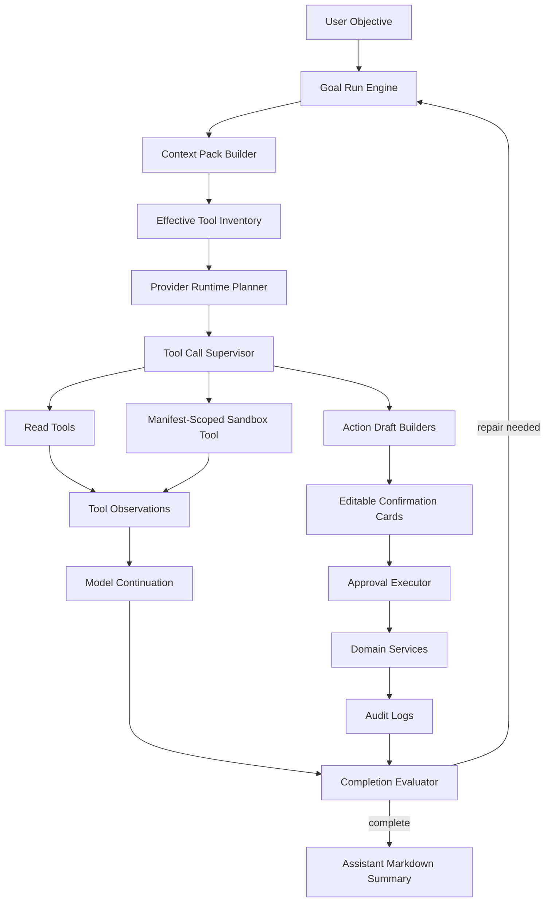

# ADR 0017: OpenAI/OpenClaw/Hermes-Inspired Tool Runtime Maturity Upgrade

Status: Accepted

Date: 2026-05-30

## Context

`xox-model` 的 Agent OS 已经不是一个聊天助手。它的核心路径是：

```text
User Objective
  -> Goal Run Engine
  -> provider-native tool_calls
  -> Action Graph / Tool Observation
  -> editable Confirmation Cards
  -> Domain Services
  -> Audit
  -> Completion Evaluator
  -> Repair Loop
```

这条路径比本地 coding agent 更适合 SaaS 业务系统，因为它把写入权、租户隔离、确认卡、审计和领域服务放在服务端权威边界内。但它仍有短板：

- tool catalog projection 还不够像成熟 agent runtime 的 **effective tool inventory**，缺少稳定的来源、缓存、兼容标记和变更解释。
- tool call 执行仍分散在规划、intent handler、action graph、observation continuation 之间，缺少一个清晰的 **Tool Call Supervisor**。
- evaluator repair loop 可以发现目标未完成，但缺少 Hermes 风格的纯 tool-loop guardrail 来识别重复失败、无进展和循环调用。
- provider 兼容已经有 request shaping 和 retry，但还需要更系统地吸收 OpenClaw / Hermes 的 provider profile、payload sanitation、strict-provider 兼容思想。
- OpenAI Agents JS 已经提供成熟的 tool approval、guardrail、handoff、tracing、sandbox 边界；xox 已有 adapter，但还没有把这些原生 runtime 事件完整映射到 provider-neutral harness hooks。
- 新增 sandbox tool 后，tool runtime 需要更明确地区分 read tool、sandbox_compute、confirmation-producing write tool 和 account/manual-only action。

本 ADR 的目标不是把 OpenAI Agents JS、OpenClaw 或 Hermes 之一替换为 xox 的主架构，而是把三者成熟部分吸收到 xox 当前 harness 内，解决上述短板，同时保留 SaaS 产品的服务端权威边界。

## Reference Findings

### OpenAI Agents JS

Local reference: `C:\Github\openai-agents-js`.

Relevant implementation areas:

- `packages/agents-core/src/tool.ts`
- `packages/agents-core/src/runner/runLoop.ts`
- `packages/agents-core/src/runner/toolExecution.ts`
- `packages/agents-core/src/runner/turnResolution.ts`
- `packages/agents-core/src/sandbox/*`

Useful mature parts:

- `FunctionTool`/`tool()` 把 schema、enabled predicate、approval、strict mode 和 invocation 绑定成一个 runtime unit。
- `toolExecution` 把参数解析、approval interruption、tool output normalization、tool guardrail、parallel execution 和 error shaping 放在同一层。
- `turnResolution` 明确区分 `nextTurn`、`interruption`、`finalOutput`，避免 tool result 被伪装成 assistant answer。
- SandboxAgent 的 workspace/session/manifest/capability 边界适合 xox 的 manifest-scoped sandbox tool。
- SDK tracing / lifecycle events 可以成为 xox provider-neutral run events 的来源。

Direct implication for xox-model:

- 复用 OpenAI Agents JS 的 **概念与小型纯逻辑边界**，而不是让 SDK Runner 直接拥有业务写入权。
- SDK tool `execute` 在 xox 中只能收集 provider-selected tool call 和 observation，不允许调用 `Domain Services`。
- HITL / approval / guardrail / tracing 事件应映射到 xox 的 `Tool Policy`、`Action Graph`、`Run Events` 和 `Technical Log`，不能替代确认卡。

### OpenClaw

Local reference: `C:\Github\openclaw`.

Relevant implementation areas:

- `packages/agent-core/src/agent-loop.ts`
- `src/agents/runtime-plan/tools.ts`
- `src/gateway/server-methods/tools-effective.ts`
- `src/agents/sessions/tools/tool-contracts.ts`
- `src/infra/exec-approvals-effective.ts`

Useful mature parts:

- Agent loop 有明确的 before/after tool hooks、tool execution start/update/end events、next-turn preparation 和 stop condition。
- Effective tool inventory 按 session/config/model/account/channel/workspace 组合计算，区分 fresh/stale cache 与来源。
- Tool contracts 把 name/schema/approval/description 统一到一个目录，避免工具能力散落。
- Effective approval policy 是 requested policy 与 host policy 的组合，严格者优先。
- UI transcript 只展示用户可理解的 tool rows，把内部 lifecycle 细节放到技术日志。

Direct implication for xox-model:

- 复用 OpenClaw 的 effective inventory 思想，给 xox tool catalog 增加 provider/model/workspace-aware snapshot 和 provenance。
- 复用 OpenClaw 风格的 tool event vocabulary，但输出仍进入 xox `agent_run_events` 和 AG-UI-compatible transcript projection。
- 不引入 OpenClaw control plane、gateway session ownership 或 local exec model；这些假设的是本地/专属机器，不适合多租户 SaaS。

### Hermes Agent

Local reference: `C:\Github\hermes-agent`.

Relevant implementation areas:

- `agent/tool_executor.py`
- `agent/tool_guardrails.py`
- `agent/conversation_loop.py`
- `agent/transports/chat_completions.py`
- `agent/message_sanitization.py`

Useful mature parts:

- Tool executor 在真正 dispatch 前做 deferrable scope gate、checkpoint、plugin hook、guardrail 和 progress callbacks。
- Tool guardrails 用 tool-call signatures 检测重复失败、无进展、同工具循环和 mutating tool 风险。
- Chat Completions transport 会根据 strict provider 删除不兼容字段，避免 provider 因内部字段或 tool_choice 不兼容失败。
- Checkpoint/interrupt 模型把“可能改变状态的动作”与“已执行观察”分开处理。

Direct implication for xox-model:

- 复用 Hermes 的 pure guardrail 思想，移植为 TypeScript `ToolLoopGuardrail`，但 guardrail 只判断 tool loop，不做业务语义路由。
- 复用 provider payload sanitation 策略，集中处理 DeepSeek/Qwen/Kimi/GLM/Doubao/vLLM/OpenAI 兼容差异。
- 不引入 Hermes 的 CLI conversation loop 或本地文件执行模型；xox 的 run loop 仍由 `Goal Run Engine` 和 SaaS policy 管理。

## Decision

保留 xox 现有 SaaS harness 为主线，并新增一个 **Tool Runtime Maturity Layer**。这个层只负责工具目录、工具调用监督、provider 兼容、循环防护和 runtime 事件映射，不拥有业务数据库写入权。



The invariant is:

```text
Models select tools.
Tool Runtime supervises tool calls.
Domain Services own business writes.
Confirmation Cards own user-visible write approval.
Evaluator owns completion.
```

## Implementation Status

As of 2026-05-30, the first implementation pass is complete:

- `packages/contracts/src/index.ts` defines `AgentToolInventorySnapshot`, `AgentToolRuntimeEvent`, `AgentToolLoopGuardrailFinding` and `AgentToolExecutionObservation`.
- `apps/api/src/agent/tool-runtime/effective-tool-inventory.ts` builds provider/model/workspace/user-aware inventory snapshots from the existing tool catalog projection, including authority class, provider compatibility flags and provenance.
- `apps/api/src/agent/tool-runtime/tool-call-supervisor.ts` supervises model-selected tool calls before they enter intent handlers, preserves tool identity, blocks tools outside the effective inventory and returns structured execution observations. It intentionally does not write per-tool run events by default, because provider stream trace events already own the run-event sequence during planning.
- `apps/api/src/agent/tool-runtime/tool-loop-guardrails.ts` adds pure Hermes-style loop findings for repeated failures, no-progress repair turns and reapplying already executed write actions.
- `apps/api/src/agent/runtime/provider-payload-sanitizer.ts` centralizes OpenAI-compatible request sanitation below `provider-request-shaper.ts`.
- `apps/api/src/agent/tool-runtime/approval-policy-composer.ts` cleanly separates automation authority from planning effort and is used by `tool-policy.ts`.
- `THIRD_PARTY_NOTICES.md` records the MIT upstream references used as architectural/runtime inspiration.
- `apps/api/tests/tool-runtime.test.ts` covers inventory, sanitizer, supervisor, guardrails and approval composition.

Validation evidence:

- `npm.cmd run build:api` passed.
- `npm.cmd run test:api` passed with 127/127 tests.

## Module Plan

### Existing modules to keep

- `apps/api/src/agent/tool-catalog.ts`
  - Continue to be the single source for provider tool schema, capability, risk, confirmation mode and navigation target.
- `apps/api/src/agent/tool-gateway.ts`
  - Continue to produce provider-ready tool projections.
- `apps/api/src/agent/runtime-planning-call.ts`
  - Continue to orchestrate context pack, provider call and retry policy.
- `apps/api/src/agent/runtime-intent-handlers.ts`
  - Continue to map already model-selected tool intents to read/action/sandbox handlers.
- `apps/api/src/agent/action-graph-store.ts`
  - Continue to persist plan steps and confirmation cards.
- `apps/api/src/agent/approval-executor.ts`
  - Continue to be the only path from confirmed action request to domain services.
- `apps/api/src/agent/goal-run-engine.ts`
  - Continue to own plan/observe/evaluate/repair.

### New or upgraded modules

```text
apps/api/src/agent/tool-runtime/
  effective-tool-inventory.ts
  tool-call-supervisor.ts
  tool-loop-guardrails.ts
  tool-execution-events.ts
  approval-policy-composer.ts

apps/api/src/agent/runtime/
  provider-payload-sanitizer.ts
  provider-capability-profile.ts

packages/contracts/src/
  AgentToolRuntimeEvent
  AgentToolInventorySnapshot
  AgentToolLoopGuardrailFinding
  AgentToolExecutionObservation

THIRD_PARTY_NOTICES.md
```

Dependency direction:

```text
tool-catalog
  -> effective-tool-inventory
  -> tool-gateway
  -> runtime-planning-call
  -> tool-call-supervisor
  -> runtime-intent-handlers
  -> read tools / sandbox-service / action draft builders
  -> action-graph-store
  -> approval-executor
  -> domain services

runtime adapters
  -> provider-capability-profile
  -> provider-payload-sanitizer
  -> provider request shaper
  -> RuntimePlanResult

tool-loop-guardrails
  -> goal-run-engine repair brief
  -> completion evaluator evidence
```

No module in `tool-runtime` may import database repositories directly or call business domain write services. The only write-side effect allowed in this layer is persisting run events/observations through existing Agent state services.

## Upgrade Tracks

### Track 1: Effective Tool Inventory

Replace ad hoc tool projection facts with an inventory snapshot inspired by OpenClaw:

```ts
type AgentToolInventorySnapshot = {
  snapshotId: string
  userId: string
  workspaceId: string
  provider: string
  model: string
  automationLevel: 'manual' | 'low' | 'medium' | 'high'
  source: 'full_registry' | 'model_selected_capabilities' | 'business_core_fallback'
  freshness: 'fresh' | 'stale' | 'fallback'
  capabilities: string[]
  tools: Array<{
    name: string
    capability: string
    risk: string
    authorityClass: 'read' | 'sandbox_compute' | 'confirmation_write' | 'manual_only'
    providerCompatibility: string[]
    provenance: 'xox' | 'openai_agents_js_inspired' | 'openclaw_inspired' | 'hermes_inspired'
  }>
}
```

Rules:

- Tool selection remains model-owned through provider-native `tool_calls`.
- Capability projection can still be model-selected, but the output must become an inspectable inventory snapshot.
- Inventory must include provenance, authority class, compatibility flags and fallback reason.
- No regex/keyword semantic routing is allowed.

### Track 2: Tool Call Supervisor

Introduce a supervisor between `RuntimePlanResult` and `runtime-intent-handlers`:

```text
RuntimePlanResult.toolCalls
  -> ToolCallSupervisor
  -> beforeToolCall event
  -> validate tool exists and is allowed by inventory
  -> parse/normalize args through catalog schema
  -> run read/sandbox/draft handler
  -> afterToolCall event
  -> produce ToolExecutionObservation
```

The supervisor must:

- preserve provider `tool_call_id` / index so returns attach to the correct tool row;
- run safe independent read tools in parallel when allowed;
- keep confirmation-producing writes ordered unless the catalog explicitly marks them independent;
- never treat tool observations as assistant replies;
- send observations back to model continuation when needed;
- emit product-visible rows and technical events through one event vocabulary.

### Track 3: Tool Loop Guardrails

Add Hermes-inspired pure loop guardrails:

- repeated exact failing tool call;
- repeated same tool with no material argument change;
- no new observation and no new confirmation card across repair turns;
- repeated clarification for fields already available in thread context or workspace data;
- mutating/confirmation-producing tool repeated after already executed observation.

Guardrail output is evidence, not a final answer:

```ts
type AgentToolLoopGuardrailFinding = {
  severity: 'warn' | 'block'
  pattern: 'repeated_failure' | 'no_progress' | 'stale_clarification' | 'executed_write_reapplied'
  toolName?: string
  evidence: string[]
  repairBrief: string
}
```

Warnings should tighten the next repair prompt. Blocks should fail the run with a user-visible explanation and a technical log entry.

### Track 4: Provider Capability Profiles And Payload Sanitizer

Centralize OpenAI-compatible differences:

```ts
type ProviderCapabilityProfile = {
  provider: string
  supportsTools: boolean
  supportsParallelToolCalls: boolean
  supportsToolChoiceAuto: boolean
  supportsForcedToolChoice: boolean
  supportsStreamingToolCallArgs: boolean
  strictMessageFields: boolean
  maxToolSchemaBytes?: number
}
```

The sanitizer must:

- strip internal fields before sending requests to strict providers;
- omit `tool_choice` when the provider rejects it;
- avoid forced named `tool_choice` in provider-neutral code;
- preserve normal assistant text when no tool calls are returned;
- classify provider failures separately from model no-op behavior.

### Track 5: OpenAI Agents JS Runtime Alignment

Keep the existing OpenAI Agents SDK adapter, but mature it:

- map SDK function-tool lifecycle into `ToolCallSupervisor` events;
- map SDK approvals into xox confirmation cards, not SDK-only interruptions;
- map SDK guardrail/tracing/handoff events into provider-neutral `agent_run_events`;
- keep SDK tool execution callbacks side-effect-light and observation-only;
- preserve xox `Domain Services -> Audit` as the only durable business write path.

### Track 6: Approval Policy Composition

Adopt OpenClaw-style stricter-policy composition:

```text
effectiveAuthority =
  strictest(
    userAutomationLevel,
    tenantPolicy,
    workspaceLockState,
    toolRisk,
    actionKindPolicy,
    account/manual-only policy
  )
```

Important distinction:

- `manual/low/medium/high` means **execution authority**, not planning effort.
- The planner always works at full effort.
- High automation may execute eligible low/medium/high actions only after action request creation, policy validation, domain execution and audit.
- Account-impacting actions stay manual-only.

### Track 7: Deferred Tool Search

Do not add backend keyword routing. If the tool catalog grows beyond provider comfort:

- expose a provider-native `tool_catalog_search` / `tool_catalog_select_capabilities` tool;
- return an inventory snapshot;
- rerun the same provider with the narrowed tool list;
- record the narrowing path in technical log.

This is optional until the catalog size or provider schema limits require it.

## Reuse Strategy

All three referenced repositories are MIT-licensed locally. Reuse is allowed only through explicit attribution and small, reviewable modules.

| Source | Reuse type | Candidate pieces | Do not import |
| --- | --- | --- | --- |
| OpenAI Agents JS | Prefer dependency/adapter and concept reuse | tool schema/approval/guardrail lifecycle, turn resolution, sandbox manifest/session/capability boundary | SDK-owned business execution, OpenAI-specific contracts in `packages/contracts`, provider lock-in |
| OpenClaw | Small TS module adaptation with attribution | effective tool inventory cache shape, tool execution event vocabulary, stricter approval composition | control plane, local exec model, session/gateway ownership, local filesystem authority |
| Hermes | TypeScript port of pure logic with attribution | tool-call signature guardrails, provider message/tool payload sanitation, checkpoint/interrupt patterns | Python conversation loop, CLI state, local command execution, plugin system as product architecture |

Attribution rule:

- Every substantially adapted module must include a top-level comment naming the upstream repository, file and MIT license.
- Add any copied/adapted notices to a repo-level `THIRD_PARTY_NOTICES.md` or an Agent-specific notices file.
- Prefer reimplementing simple ideas from scratch when the target xox module is shorter and clearer than a direct port.

## Acceptance Criteria

### Architecture

- No new semantic regex/keyword router is introduced.
- Tool catalog remains the single source of provider schema, capability, risk and navigation metadata.
- Tool runtime modules do not call business write services directly.
- Tool observations are never rendered or persisted as assistant replies.
- Provider-specific behavior is isolated under runtime adapter/profile/sanitizer modules.

### Tests

- `npm.cmd run test:api` passes.
- `npm.cmd run test:web` passes.
- `npm.cmd run build` passes.
- New API tests cover:
  - inventory snapshot creation and provenance;
  - provider payload sanitation for strict OpenAI-compatible providers;
  - tool result attachment by `tool_call_id` or provider index;
  - repeated failed/no-progress tool loop guardrails;
  - automation level as execution authority only;
  - confirmation-producing writes still going through action requests and audit;
  - sandbox tool stays observation-only.

### Product Behavior

- A cross-domain prompt such as "我们几个月才能回本？帮我记一笔成员A的今天的线上10张，然后帮我第一个股东注资100w" must:
  - inspect current workspace entities before asking clarification;
  - answer the read question from read-tool observations;
  - create or execute eligible write actions according to automation authority;
  - preserve each tool row and final model-authored summary in the transcript;
  - avoid repeating memory recall across evaluator repair turns;
  - stop only after evaluator confirms all requested sub-goals are complete, pending confirmation, or explicitly blocked with evidence.

### Provider Behavior

- DeepSeek/Qwen/Kimi/GLM/Doubao/OpenAI-compatible providers can run without forced named `tool_choice`.
- Provider plain assistant text is persisted once and stops the loop.
- Malformed streamed tool arguments trigger repair/retry at runtime level, not business regex fallback.
- `LLM_PROVIDER=openai` still works through OpenAI Agents SDK adapter without leaking SDK types into shared contracts.

## Migration Plan

1. Add this ADR and link it from `docs/agent-design.md`.
2. Add `AgentToolInventorySnapshot`, `AgentToolRuntimeEvent`, `AgentToolLoopGuardrailFinding` contracts.
3. Extract `effective-tool-inventory.ts` from existing `tool-gateway.ts` behavior without changing external behavior.
4. Add provider capability profile and payload sanitizer tests; move existing provider-specific request shaping into it.
5. Add `ToolCallSupervisor` in front of `runtime-intent-handlers`; first run in behavior-preserving mode.
6. Add Hermes-inspired `ToolLoopGuardrail`; surface findings to evaluator repair briefs.
7. Connect OpenAI Agents SDK adapter lifecycle/tool execution to the supervisor event vocabulary.
8. Add third-party notices for any ported module.
9. Run API/web/build tests plus one real-provider smoke before marking accepted.

## Consequences

Positive:

- xox keeps the correct SaaS authority model while absorbing mature runtime design.
- Tool calls become inspectable, replayable and easier to debug.
- Provider compatibility moves out of prompts and business tools.
- Multi-step goals become more reliable because tool loops have both evaluator-level and runtime-level checks.
- Future tool catalog growth has a principled path through inventory/deferred search rather than backend intent routing.

Tradeoffs:

- Adds a new runtime layer, so module naming and dependency rules must stay strict.
- Tool execution latency may increase if every run records too many events; event coalescing remains necessary.
- Direct code reuse requires attribution discipline and review to avoid importing local-agent assumptions.

Rejected alternatives:

- Replace xox harness with OpenAI Agents SDK Runner end-to-end: rejected because SDK approvals/tracing do not by themselves enforce xox confirmation cards, tenant audit and domain service boundaries.
- Import OpenClaw as control plane: rejected because its host/session assumptions are local-agent oriented.
- Import Hermes conversation loop: rejected because it is a Python local-agent loop and would duplicate xox Goal Run Engine.
- Add backend keyword routing for tool selection: rejected because it recreates the original fake-agent failure mode.
