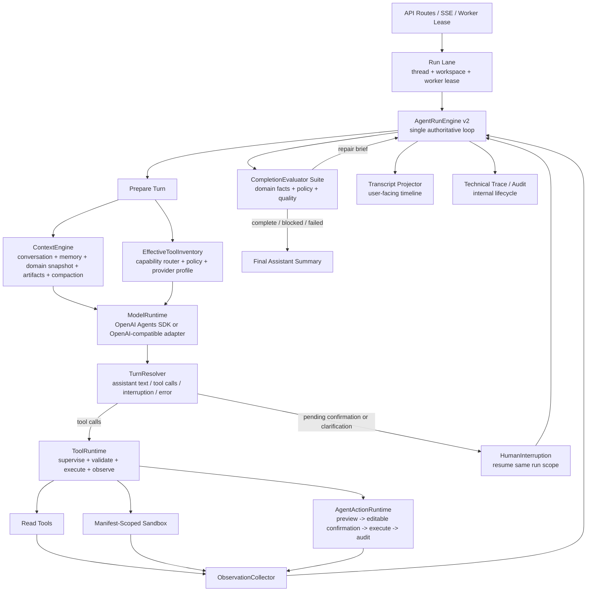

# ADR 0018: AgentRunEngine v2 Single-Loop Harness Upgrade

Status: Accepted

Date: 2026-05-30

Refines: ADR 0004 Evaluator-Centered Harness Agent, ADR 0012 Tool Result Observation Continuation Loop, ADR 0015 Automation Level As Execution Authority, ADR 0016 Manifest-Scoped Sandbox Tool, ADR 0017 Tool Runtime Maturity Upgrade

Implementation note: the first implementation pass is complete on 2026-05-30. The codebase now has `agent-run-engine.ts` as the single run-loop entrypoint, `turn-resolver.ts` as the typed next-step boundary, `agent-action-runtime.ts` as the Agent-owned write lifecycle boundary, and `context-engine/index.ts` as the provider-planning context entrypoint. Architecture guard tests lock these boundaries. Deeper internal decomposition of evaluator/context internals remains an allowed maturity improvement, but no longer changes the top-level harness ownership model.

## Context

`xox-model` has already moved past the fake chat-assistant stage. The current SaaS harness has:

- provider-native tool calls;
- server-owned threads, runs, action graph and confirmation cards;
- tenant-scoped provider settings and memory;
- read/tool observation continuation;
- automation levels as execution authority;
- manifest-scoped sandbox boundaries;
- a mature first pass of tool runtime inventory, supervision, payload sanitation and guardrails.

The remaining architecture problem is not lack of capability. The problem is **control ownership**.

The current diagram looks more complex than OpenClaw because several modules can appear to own "what happens next":

- `goal-run-engine.ts` owns evaluation and repair loops;
- `runtime-planning-call.ts` owns context, tool projection and provider invocation;
- `tool-observation-continuation.ts` owns final model continuation;
- `tool-runtime/*` owns supervision and tool-loop findings;
- `approval-executor.ts` owns confirmed writes and post-execution evaluator checks;
- transcript projectors own the user-visible shape;
- run worker and route services own queueing, lease and recovery.

Those modules are individually useful, but the architecture should make one fact obvious:

```text
Only AgentRunEngine owns the run loop and the next step.
Everything else is a capability called by that loop.
```

This ADR defines the next architecture upgrade: preserve the mature pieces already implemented, absorb the best boundaries from OpenAI Agents JS, OpenClaw and Hermes, and recompose them into a single-loop harness that is simpler to reason about.

## Reference Findings

### OpenAI Agents JS

Local reference: `C:\Github\openai-agents-js`.

Useful source areas:

- `packages/agents-core/src/runner/runLoop.ts`
- `packages/agents-core/src/runner/turnResolution.ts`
- `packages/agents-core/src/runner/toolExecution.ts`
- `packages/agents-core/src/runner/steps.ts`
- `packages/agents-core/src/runner/guardrails.ts`
- `docs/src/content/docs/guides/sandbox-agents/concepts.mdx`

Key ideas to absorb:

- `NextStep` is explicit: final output, run again, handoff, interruption.
- Tool execution and approval are part of turn resolution, not ad hoc follow-up logic.
- Interruptions are resumable run state, not new unrelated user messages.
- Guardrails/tracing are runtime events around the loop, not replacements for application policy.
- Sandbox boundaries are expressed through workspace/session/manifest/capability.

Direct implication for `xox-model`:

- Add a project-native `TurnResolver` that returns typed `nextStep`.
- Keep OpenAI Agents SDK as a runtime adapter, but do not let SDK tool callbacks execute business writes.
- Map SDK tracing, guardrail, handoff and HITL events into provider-neutral harness events.
- Reuse SandboxAgent's boundary language behind our own manifest-scoped sandbox contract.

### OpenClaw

Local reference: `C:\Github\openclaw`.

Useful source areas:

- `docs/concepts/agent-loop.md`
- `packages/agent-core/src/agent-loop.ts`
- `src/gateway/server-methods/tools-effective.ts`
- `src/agents/sessions/tools/tool-contracts.ts`
- `src/infra/exec-approvals-effective.ts`

Key ideas to absorb:

- A single serialized session lane owns the loop.
- The loop shape is clear: intake -> context assembly -> model inference -> tool execution -> observation -> next turn -> final reply.
- `prepareNextTurn` and `shouldStopAfterTurn` are explicit extension points.
- Effective tool inventory is a snapshot with source/provenance, not a loose list of schemas.
- Tool lifecycle events are emitted by the loop but projected differently for user transcript and technical trace.

Direct implication for `xox-model`:

- Keep `agent_runs`/worker lease as the SaaS session lane, but make `AgentRunEngine` the single in-process loop owner once a run is claimed.
- Treat context, tools, evaluator and transcript as loop collaborators, not competing control planes.
- Continue to reuse small MIT-licensed pure ideas with attribution, never OpenClaw's local control plane or host exec model.

### Hermes Agent

Local reference: `C:\Github\hermes-agent`.

Useful source areas:

- `agent/context_engine.py`
- `agent/memory_manager.py`
- `agent/conversation_loop.py`
- `agent/transports/base.py`
- `agent/message_sanitization.py`

Key ideas to absorb:

- Context is an engine with lifecycle, token accounting, compaction and optional context tools.
- Memory is prefetched once before a run/turn, fenced, scrubbed from streaming output and synchronized after the turn.
- Transports own provider message/tool conversion, not business policy.
- Tool-loop guardrails detect repeated failures and no-progress loops.

Direct implication for `xox-model`:

- Upgrade `context-pack.ts` into a `ContextEngine` boundary with run-scoped memory recall and compaction state.
- Keep provider adapters thin and sanitize messages below runtime adapters.
- Keep memory context fenced and never repeat recall injection on every evaluator repair turn.

## Decision

Adopt **AgentRunEngine v2**, a single-loop harness that owns each claimed run from first user message to final assistant summary, pending interruption, blocked state or failure.

The engine is not a new product shell. It is a refactoring and boundary clarification of the current SaaS harness.



Core invariant:

```text
AgentRunEngine owns the loop.
TurnResolver owns the next-step classification.
ToolRuntime owns tool-call supervision.
AgentActionRuntime owns Agent-initiated write lifecycle.
CompletionEvaluator owns completion judgment.
Transcript Projector owns user-facing disclosure.
Technical Trace owns internal diagnostics.
```

No module outside `AgentRunEngine` decides that the overall run is complete.

## Eight Upgrade Tracks

### 1. AgentRunEngine As The Only Loop Owner

Target paths:

- replace `apps/api/src/agent/goal-run-engine.ts` with `apps/api/src/agent/agent-run-engine.ts`;
- keep route/worker entrypoints in `apps/api/src/agent/run-worker.ts`, `run-submission.ts`, `routes.ts`;
- keep `apps/api/src/agent/agent-kernel.ts` as a thin facade only if routes still need a stable import during the rename.

Responsibilities:

- accept a claimed run and immutable run scope;
- initialize the goal contract;
- call `ContextEngine`, `EffectiveToolInventory`, `ModelRuntime`, `TurnResolver`, `ToolRuntime`, `CompletionEvaluator`;
- manage repair iterations, interruptions, cancellation and terminal state;
- emit user-facing transcript events and technical trace events through separate sinks;
- fail closed when iteration budget is exhausted.

Non-responsibilities:

- no direct SQL except through existing stores;
- no provider-specific payload shaping;
- no domain write execution;
- no React transcript layout decisions.

This renames the architecture from `GoalRunEngine` to `AgentRunEngine` because the run loop now owns more than goal evaluation. The goal contract remains a capability inside the engine.

### 2. TurnResolver State Machine

Target paths:

- new `apps/api/src/agent/turn-resolver.ts`;
- contracts in `packages/contracts/src/index.ts` if DTOs must expose interruptions or next-step summaries.

Inspired by OpenAI Agents JS `NextStep`, but project-native:

```ts
type AgentNextStep =
  | { type: 'continue_with_observations'; observations: AgentToolObservation[] }
  | { type: 'await_confirmation'; actionRequestIds: string[] }
  | { type: 'await_clarification'; clarificationId: string; prompt: string }
  | { type: 'final_output'; assistantMessageId: string }
  | { type: 'run_again'; reason: string }
  | { type: 'blocked'; reason: string; evidence: string[] }
  | { type: 'failed'; reason: string; evidence: string[] }
```

Rules:

- assistant text plus tool calls is valid; preserve the model-authored preface and still process tool calls;
- tool observations are never assistant answers;
- a final assistant message is not terminal until the evaluator passes or blocks with evidence;
- pending confirmation and clarification interrupt the same run scope instead of starting a new standalone objective;
- provider error, no tool, malformed tool call and user-visible business block are different states.

### 3. ContextEngine Instead Of Ad Hoc Context Pack

Target paths:

- evolve `apps/api/src/agent/context-pack.ts` into `apps/api/src/agent/context-engine/`;
- keep small exported facade `buildContextPack` only during migration if existing callers require it, then remove it.

Responsibilities:

- conversation window;
- workspace/domain snapshot;
- current date and month resolution;
- run-scoped memory recall;
- artifact summaries;
- compaction state and token budgeting;
- entity inspection facts for references such as `第一个股东` and `成员 A`;
- provider-safe system/context message construction.

Rules:

- memory recall happens once per run unless explicit resume state requires a refresh;
- recalled memory is fenced and redacted before provider injection;
- evaluator repair findings enter as harness instructions, not as user messages to be segmented;
- context summaries distinguish observed facts, assumptions and unresolved fields.

This absorbs Hermes' context-engine lifecycle without importing Hermes' Python loop.

### 4. ToolRuntime As A Small Tool OS

Target paths:

- keep and tighten `apps/api/src/agent/tool-runtime/*`;
- keep `apps/api/src/agent/tool-gateway.ts` as the provider projection boundary;
- keep `apps/api/src/agent/runtime-intent-handlers.ts` as the mapping from already model-selected tools to local handlers, or split by capability when files become too large.

Responsibilities:

- effective inventory snapshot;
- provider/model compatibility flags;
- tool call identity and argument normalization;
- read/sandbox/write authority class enforcement;
- tool-loop guardrails;
- parallelism rules for safe independent read tools;
- ordered execution for dependent write previews;
- observation shaping for model continuation.

Rules:

- no semantic regex/keyword routing;
- no domain write services inside ToolRuntime;
- all provider-selected tools must be represented in the action graph or an explicit blocked observation;
- if the catalog grows too large, use a model-selected capability router or `tool_catalog_search`, not backend intent matching.

ADR 0017 remains the local design for this layer. ADR 0018 only clarifies that ToolRuntime is subordinate to `AgentRunEngine`, not a second loop.

### 5. AgentActionRuntime For All Agent-Initiated Writes

Target paths:

- new or clarified `apps/api/src/agent/agent-action-runtime.ts`;
- existing `apps/api/src/agent/action-graph-store.ts`;
- existing `apps/api/src/agent/approval-executor.ts`;
- existing `apps/api/src/agent/tool-executor.ts`;
- existing domain modules under `apps/api/src/modules/*`.

`AgentActionRuntime` is deliberately named around Agent action lifecycle, not "business" logic. Domain meaning stays in domain services; this module owns the server-authoritative lifecycle of actions initiated by the Agent.

Lifecycle:

```text
preview -> persist action request -> editable confirmation card
  -> policy re-check -> execute through domain service
  -> audit -> observation -> evaluator
```

Rules:

- every write, including high-automation auto-execution, first becomes a server-owned action request;
- user edits re-run validation and preview before execution;
- navigation events are attached to the action request, not silently inferred by React;
- account-impacting actions remain manual-only and never become business write tools;
- no-op patches become observations, not confirmation cards.

This track exists because SaaS business writes are the major place where `xox-model` must differ from local coding agents.

### 6. CompletionEvaluator Suite

Target paths:

- split `apps/api/src/agent/completion-evaluator.ts` when necessary into:
  - `completion-evaluator.ts` as orchestration;
  - `evaluators/domain-facts.ts`;
  - `evaluators/action-graph.ts`;
  - `evaluators/policy.ts`;
  - `evaluators/quality-rubric.ts` for future LLM soft checks.

Evaluator layers:

- **Domain fact evaluator**: live workspace state, draft config, ledger rows, versions, share links, memory records, audit logs.
- **Action graph evaluator**: planned, pending, executed, failed and cancelled steps.
- **Policy evaluator**: tenant isolation, locked periods, account/manual-only actions, confirmation requirements.
- **Quality evaluator**: explanation completeness, assumptions, uncertainty and final summary quality.

Rules:

- hard facts are deterministic;
- LLM rubrics can only score soft quality;
- final assistant text cannot bypass evaluator;
- evaluator repair brief must be scoped and must not cause duplicate writes;
- exhausted repair budget ends as `failed` or `blocked`, never fake success.

### 7. Manifest-Scoped Sandbox Capability

Target paths:

- keep `apps/api/src/agent/sandbox-service.ts`;
- keep `apps/api/src/agent/sandbox-file-adapters.ts`;
- future backend behind a `SandboxBackend` or `SandboxBroker` interface.

Role in v2:

- sandbox is a tool capability under ToolRuntime;
- sandbox output is a typed observation for model continuation;
- sandbox cannot call internal APIs, DBs, provider settings, memory stores or business write services;
- sandbox may create temporary artifacts only inside its manifest-scoped workspace.

This keeps OpenAI Agents JS SandboxAgent's boundary vocabulary while preserving xox's SaaS authority model.

### 8. Transcript And Trace Are Separate Projections

Target paths:

- user-facing: `apps/api/src/agent/agent-transcript-projector.ts`, `agent-timeline-projector.ts`, `ag-ui-projection.ts`, frontend `apps/web/src/components/agent/*`;
- technical: `agent_run_events` and technical log panel.

Rules:

- user transcript shows user bubbles, work cycles, tool rows, navigation, editable confirmations, concrete failures and assistant Markdown summaries;
- technical trace stores queue, lease, provider retry, evaluator class names, memory recall internals and diagnostic details;
- a run event can feed both projections, but projection policy is explicit;
- successful generic business checks and confirmation lifecycle noise do not appear in the main transcript;
- tool rows auto-fold after final assistant summary, preserving Codex-style progressive disclosure.

This track keeps OpenClaw/Codex-style UX while preventing harness internals from leaking into product UI.

## Module Dependency Graph

```text
routes / run-submission / run-worker
  -> agent-run-engine
    -> context-engine
      -> thread-store / memory-store / domain read services / artifact parser
    -> tool-gateway
      -> tool-catalog / effective-tool-inventory
    -> runtime-planning-call
      -> runtime adapters / provider profiles / payload sanitizer
    -> turn-resolver
    -> tool-runtime
      -> runtime-intent-handlers
        -> read services / sandbox-service / action draft builders
    -> agent-action-runtime
      -> action-graph-store / approval-executor / tool-executor / domain services / audit
    -> completion-evaluator
      -> domain read services / action-graph-store / audit / memory evidence
    -> transcript projector
    -> technical trace store
```

Forbidden dependencies:

- `runtime adapters -> domain write services`
- `tool-runtime -> database repositories for business writes`
- `transcript projector -> provider adapters`
- `context-engine -> approval-executor`
- `completion-evaluator -> confirmation card creation`
- `frontend -> inferred action state not backed by server thread state`

## Reuse Strategy

Reuse must be deliberate and narrow.

| Source | Reuse level | Absorb | Do not absorb |
| --- | --- | --- | --- |
| OpenAI Agents JS | Direct dependency where already used, plus concept reuse | `NextStep`-style turn resolution, tool approval lifecycle, guardrail/tracing event mapping, sandbox boundary language | SDK-owned business writes, OpenAI-specific DTOs in contracts, provider lock-in |
| OpenClaw | Small MIT-attributed TypeScript ports or reimplementations | single-loop shape, effective tool inventory, event vocabulary, before/after tool hooks, transcript grouping principles | control plane, gateway/session ownership, local host exec model, plugin runtime |
| Hermes | Conceptual reuse and small pure ports if valuable | context-engine lifecycle, memory fencing/scrubbing, provider transport sanitation, tool-loop guardrails | Python conversation loop, CLI state, local command execution, plugin system |

Attribution rule:

- If substantial code is copied or closely ported, add a file header naming upstream repository, file and MIT license.
- Keep `THIRD_PARTY_NOTICES.md` aligned.
- Prefer a shorter project-native implementation when porting code would import unrelated assumptions.

## Migration Plan

### Phase 0: Documentation And Golden Tests

Edit paths:

- `docs/adr/0018-agent-run-engine-v2-single-loop-harness.md`;
- `docs/agent-design.md`;
- `.agent/lessons.md`.

Validation:

- `git diff --check`;
- inspect docs for broken ADR references.

### Phase 1: Turn Boundary Without Behavior Change

Edit paths:

- `apps/api/src/agent/turn-resolver.ts`;
- `apps/api/src/agent/goal-run-engine.ts`;
- `apps/api/tests/*agent*`.

Validation:

- `npm.cmd run test:api -- --runInBand` if available, otherwise `npm.cmd run test:api`;
- tests prove assistant text plus tool calls, tool observations, pending confirmation, clarification and provider errors produce distinct `AgentNextStep` values.

### Phase 2: Rename And Recenter The Loop

Edit paths:

- `apps/api/src/agent/agent-run-engine.ts`;
- remove or reduce `goal-run-engine.ts` after imports move;
- `apps/api/src/agent/run-worker.ts`;
- `apps/api/src/agent/agent-kernel.ts`;
- `docs/agent-design.md`.

Validation:

- API tests pass;
- architecture guard test proves routes and worker call `AgentRunEngine`, not planner internals.

### Phase 3: ContextEngine Extraction

Edit paths:

- `apps/api/src/agent/context-engine/*`;
- migrate from `apps/api/src/agent/context-pack.ts`;
- memory recall and compaction tests.

Validation:

- one run emits memory recall/injection at most once unless explicitly refreshed;
- entity references are available to the model before clarification;
- no prompt contains raw provider keys or cross-tenant memory.

### Phase 4: ToolRuntime Tightening

Edit paths:

- `apps/api/src/agent/tool-runtime/*`;
- `apps/api/src/agent/tool-gateway.ts`;
- `apps/api/src/agent/runtime-intent-handlers.ts`;
- API tests for the multi-domain prompt.

Validation:

- no backend regex semantic router is introduced;
- read observations feed later planning turns with tools still enabled;
- tool call results attach to correct provider `tool_call_id` or index;
- repeated no-progress calls produce guardrail findings.

### Phase 5: AgentActionRuntime

Edit paths:

- `apps/api/src/agent/agent-action-runtime.ts`;
- `apps/api/src/agent/action-graph-store.ts`;
- `apps/api/src/agent/approval-executor.ts`;
- `apps/api/src/agent/tool-executor.ts`.

Validation:

- all writes create action requests before execution;
- high automation auto-executes only through the same confirmation/action/audit path;
- no-op patches do not create confirmation cards;
- account actions remain manual-only.

### Phase 6: Evaluator Suite Split

Edit paths:

- `apps/api/src/agent/completion-evaluator.ts`;
- `apps/api/src/agent/evaluators/*`;
- evaluator fixtures/tests.

Validation:

- complex operating model goals evaluate live domain state, not last action graph only;
- exhausted repair iterations fail closed;
- pending clarification interrupts only dependent actions.

### Phase 7: Projection Cleanup

Edit paths:

- `apps/api/src/agent/agent-transcript-projector.ts`;
- `apps/api/src/agent/agent-timeline-projector.ts`;
- `apps/web/src/components/agent/*`.

Validation:

- simple `你好` shows only user bubble and assistant reply;
- multi-tool run shows compact work cycle, tool group, tool rows and final summary;
- technical lifecycle rows remain behind technical log.

## Acceptance Criteria

### Architecture

- A single `AgentRunEngine` module owns the run loop and terminal state.
- `TurnResolver` is the only boundary that converts model output into `nextStep`.
- `ContextEngine`, `ToolRuntime`, `AgentActionRuntime`, `CompletionEvaluator`, `Transcript Projector` and `Technical Trace` are collaborators, not competing loops.
- No new production regex/keyword semantic routing exists.
- OpenAI Agents SDK, OpenClaw and Hermes concepts are absorbed without importing local-agent control planes or business-unsafe execution models.

### Behavior

- Multi-step prompt handling supports inspect -> observe -> act -> observe -> final answer.
- Read tools can automatically execute and feed model continuation.
- Write tools create editable confirmation cards first; automation only decides whether eligible cards auto-execute after creation.
- Human interruption/resume keeps the same goal scope.
- Memory recall is run-scoped and not repeated across evaluator repair turns.
- Tool results are never presented as final assistant answers without model continuation.

### Validation Commands

- `npm.cmd run test:api`
- `npm.cmd run test:web`
- `npm.cmd run build:api`
- `npm.cmd run build:web`
- `npm.cmd run test`

Real-provider validation remains required for runtime changes:

- DeepSeek/OpenAI-compatible read-only smoke;
- DeepSeek/OpenAI-compatible confirmation-card write smoke;
- complex multi-domain prompt smoke;
- provider key never written to repo files, docs, tests or logs.

## Risks

- A rename from `GoalRunEngine` to `AgentRunEngine` can create temporary churn. The migration should be behavior-preserving and test-backed.
- Over-porting OpenClaw or Hermes would reintroduce local-agent assumptions. Reuse must stay pure, attributed and below xox's SaaS boundaries.
- Splitting evaluator and context modules too early could create more files without improving ownership. Each split must remove real responsibility overlap.
- Provider-neutral event mapping must stay compact; too many technical run events will degrade frontend transcript performance.

## Non-Goals

- Do not replace xox's harness with OpenAI Agents SDK Runner end-to-end.
- Do not import OpenClaw control plane, local exec approvals, gateway session ownership or plugin runtime.
- Do not import Hermes' Python conversation loop or local command execution model.
- Do not make the sandbox a business write channel.
- Do not expose harness internals as default user transcript rows.

## Final Shape

After this ADR is implemented, the architecture should be explainable in one sentence:

> `AgentRunEngine` runs a typed loop; `ContextEngine` prepares what the model sees, `ToolRuntime` executes what the model selected, `AgentActionRuntime` governs Agent-initiated writes, `CompletionEvaluator` decides whether the goal is done, and separate projectors turn the same facts into user transcript or technical trace.

That is the clean synthesis of the three reference systems:

- OpenClaw's clear loop and inventory discipline;
- OpenAI Agents JS's turn state, interruptions and runtime primitives;
- Hermes' context/memory/provider sanitation discipline;
- xox-model's SaaS confirmation, tenant isolation, audit and domain evaluator.
