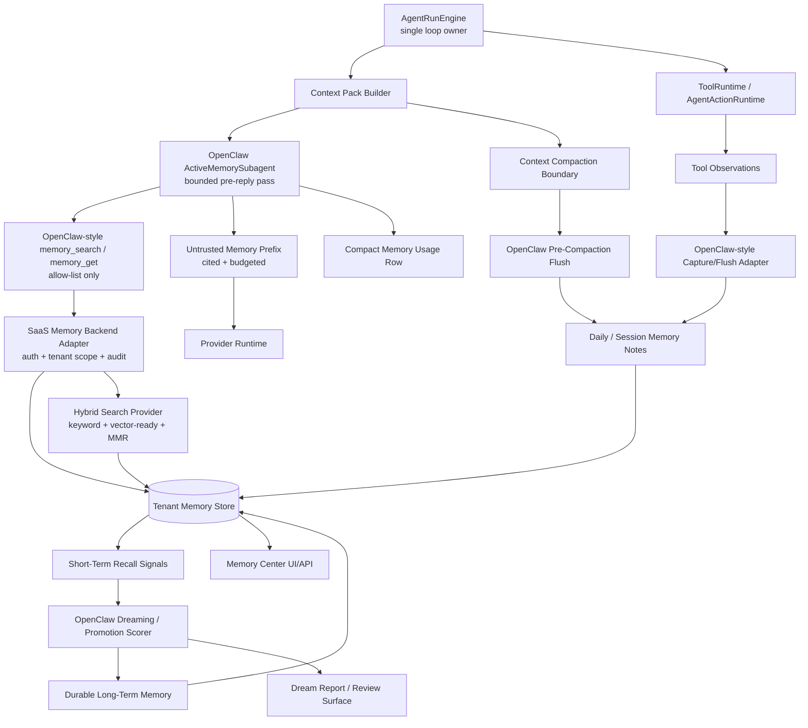

# ADR 0019: OpenClaw-First SaaS Memory Kernel

Status: Accepted / Revised Plan

Date: 2026-05-30

Revised: 2026-05-31

Refines: ADR 0007 OpenClaw-Inspired Tenant-Scoped Memory Kernel, ADR 0018 AgentRunEngine v2 Single-Loop Harness Upgrade

Implementation note: first implementation completed on 2026-05-31. It adds `packages/agent-memory-core` for OpenClaw-derived pure memory logic, `memory_search / memory_get` as provider-native read tools, SaaS DB adapters for daily notes / recall signals / dreaming reports, OpenClaw-style pre-compaction flush into daily notes, and Memory Center API/UI visibility for durable memories, daily notes, recall signals and dream reports.

## Context

`xox-model` already has DB-backed memory rows, active recall, candidate detection, promotion policy, Memory Center UI, and run-trace events. That direction fixed the original pollution problem, but it still leaves us with a custom memory architecture that is less mature and less elegant than OpenClaw's memory system.

The product decision is now stronger:

```text
OpenClaw memory is the reference implementation.
xox-model should adopt the OpenClaw memory mechanism as the kernel design,
then upgrade it for SaaS, multi-user, multi-workspace isolation.
```

This is not a request to copy OpenClaw's whole product. OpenClaw is local-first and assumes a personal workspace; `xox-model` is a SaaS platform with tenant data, business audit, provider keys, financial records, and multiple users. The target is therefore:

- reuse OpenClaw's mature memory algorithms and runtime boundaries as much as possible;
- keep all memory storage, authorization, audit, and prompt injection tenant-scoped;
- avoid a parallel "xox custom memory" path when an OpenClaw mechanism already exists;
- preserve ADR 0018's single-loop harness invariant.

## Problem With The Previous ADR 0019

The previous implementation was structurally safer than the original memory system, but it still framed OpenClaw as inspiration. That leads to three risks:

1. xox-model keeps rebuilding ideas that OpenClaw already solved, such as active recall, short-term promotion, memory budgets, dreaming, and pre-compaction flush.
2. The local architecture drifts from mature harness practice and accumulates one-off policies.
3. The team spends effort validating custom memory behavior instead of porting and adapting battle-tested OpenClaw behavior.

The new design changes the ownership model:

```text
OpenClaw memory-core/active-memory concepts own the mechanism.
xox-model owns SaaS isolation, domain governance, storage adapters, audit, and UI.
```

## Current Database Audit

Read-only inspection of `apps/api/data/xox.db` on 2026-05-30 found 32 rows in `agent_memories`.

| Group | Count | Assessment |
| --- | ---: | --- |
| `candidate / episodic / episode / workspace` | 10 | Mostly repeated action logs. |
| `candidate / episodic / workflow / procedural` | 10 | Mostly evaluator failure diagnostics. |
| `active / episodic / episode / workspace` | 5 | Repeated action logs already eligible for recall. |
| `promoted / procedural / workflow` | 4 | Critical defect: transient evaluator errors promoted into procedural memory. |
| `active / procedural / workflow` | 1 | Useful high-level workflow memory. |
| `active / semantic / preference` | 1 | Potentially useful, but needs evidence review. |
| `candidate / episodic / fact` | 1 | Run-local working memory incorrectly stored as durable memory. |

Observed pollution patterns:

- repeated draft episodes such as `已通过 Agent 更新草稿...`;
- promoted evaluator errors such as `目标要求 1 个股东/分红主体，当前草稿为 5 个。`;
- completed goal episodes with the full user objective;
- run-local entity references such as `最近一次 Agent 账本动作关联对象是 成员 1。`.

This audit remains valid as the migration baseline. The OpenClaw-first migration must keep those rows non-injectable or archived while replacing the recall/promotion mechanism.

## Reference System: OpenClaw Memory

Local reference: `C:\Github\openclaw`.

Primary source areas:

| OpenClaw area | Purpose |
| --- | --- |
| `docs/concepts/memory.md` | Long-term memory, daily notes, memory tools, automatic flush, dreaming. |
| `docs/concepts/active-memory.md` | Bounded pre-reply memory sub-agent with eligibility, timeout, cache, circuit breaker, and narrow tool access. |
| `extensions/active-memory/index.ts` | Active memory runtime, gates, query modes, cache, circuit breaker, tool allow-list. |
| `extensions/memory-core/src/tools.ts` | `memory_search` / `memory_get` behavior and citation-oriented tool surface. |
| `extensions/memory-core/src/memory-budget.ts` | Budget discipline for long-term memory growth. |
| `extensions/memory-core/src/short-term-promotion.ts` | Recall-frequency/query-diversity/recency/consolidation promotion scoring. |
| `extensions/memory-core/src/flush-plan.ts` | Pre-compaction memory flush plan and safety hints. |
| `extensions/memory-core/src/tools.citations.ts` | Memory result citation discipline. |

OpenClaw mechanisms to adopt as first-class concepts:

- `MEMORY.md` as the compact curated long-term layer;
- `memory/YYYY-MM-DD.md` as the short-term/daily notes layer;
- `DREAMS.md` as the reviewable consolidation/dreaming layer;
- `memory_search` and `memory_get` as the narrow memory tool API;
- active memory as a bounded pre-main-reply sub-agent, not a passive database lookup;
- hybrid retrieval, MMR/diversity, citation-bearing results;
- short-term recall tracking and promotion based on repeated useful recall, query diversity, recency, and consolidation signals;
- pre-compaction memory flush before context is discarded;
- memory budgets that prevent long-term context from growing without bound;
- human-readable diagnostics that are separate from hidden prompt injection.

OpenClaw parts not to adopt:

- gateway/control plane;
- local filesystem as production source of truth;
- local workspace/session/auth assumptions;
- arbitrary file mutation or local command execution authority;
- plugin registry ownership of SaaS business state.

## Decision

Adopt an **OpenClaw-first SaaS Memory Kernel**.

The target is not "OpenClaw-inspired". The target is:

```text
OpenClaw memory-core semantics
  + OpenClaw active-memory runtime shape
  + xox-model SaaS storage/authorization/audit adapters
  + xox-model AgentRunEngine single loop
```

The memory kernel must remain a collaborator under `AgentRunEngine`:

```text
AgentRunEngine owns what happens next.
OpenClawMemoryKernel can recall, capture, search, get, flush, score, promote,
expire, and report memory.
OpenClawMemoryKernel cannot decide the next business step, execute business
actions, skip confirmations, or override tenant policy.
```

## OpenClaw-To-SaaS Mapping

| OpenClaw concept | SaaS equivalent in xox-model | Why |
| --- | --- | --- |
| `MEMORY.md` | Tenant-scoped durable memory page/rows: `long_term` lane | Keep curated long-term facts without a shared filesystem. |
| `memory/YYYY-MM-DD.md` | Tenant-scoped daily/session memory notes | Preserve working history and flush output without injecting everything. |
| `DREAMS.md` | Tenant-scoped memory review/dream report records | Keep promotion review visible and auditable. |
| `memory_search` | Authorized memory search tool over current user/workspace | Same tool semantics, different storage backend. |
| `memory_get` | Authorized memory get/read tool by memory id/range | Same narrow access, no arbitrary DB/file access. |
| Active Memory plugin | `ActiveMemorySubagent` inside `AgentRunEngine` pre-context phase | Same bounded pre-reply recall; no plugin control plane. |
| Hybrid search backend | DB/vector-ready search provider interface | Preserve ranking model while allowing SaaS indexes. |
| Short-term promotion store | `agent_memory_recall_signals` / `agent_memory_promotion_candidates` | Same promotion math, tenant scoped. |
| Memory budget | Prompt and durable-memory budgets per workspace/user | Prevent bloated prompt context. |
| Pre-compaction flush | Session-context flush before summarization/compaction | Avoid losing useful facts in long SaaS conversations. |
| Dreaming sweep | Background consolidation job per tenant/workspace | Promote only qualified memories, reviewable in UI. |

## Target Architecture



## SaaS Isolation Contract

Every memory operation must carry an explicit scope:

```ts
type MemoryScope = {
  userId: string;
  workspaceId: string;
  threadId?: string | null;
  agentId: 'xox-agent-os';
};
```

Rules:

- `memory_search` and `memory_get` must always filter by `userId` and `workspaceId`.
- Thread-scoped working/session notes may only be injected into the same thread unless promoted.
- Cross-workspace recall is forbidden by default.
- Cross-user recall is forbidden.
- Provider keys, API tokens, cookies, raw prompts, raw provider chunks, and private auth state are never eligible for memory.
- Memory text is untrusted context; it cannot override user instructions, system policy, tool schemas, confirmation rules, or live domain facts.
- Live domain state beats memory. If a memory says there are 5 shareholders but the current draft says 4, the model must use current draft state.

## Storage Model

The production store stays DB-backed. OpenClaw's file layers become logical layers:

| Logical layer | Storage shape | Injection behavior |
| --- | --- | --- |
| Durable memory (`MEMORY.md`) | compact curated `agent_memories` rows/page sections | Eligible for active recall if relevant and safe. |
| Daily/session memory (`memory/YYYY-MM-DD.md`) | `agent_memory_notes` or typed rows with date/thread metadata | Searchable by memory tools; not injected by bootstrap wholesale. |
| Dream diary (`DREAMS.md`) | `agent_memory_dream_reports` / review records | Human review and promotion evidence; not ordinary prompt context. |
| Recall signals | `agent_memory_recall_signals` | Promotion evidence; never prompt text. |
| Citations/evidence | existing evidence/audit/message/action refs | Returned with memory search/get and shown in Memory Center. |

The old `lane/status/injectable` fields remain useful as the SaaS governance layer, but they should become storage metadata around OpenClaw's conceptual layers rather than a separate memory theory.

## Formal Contracts

### Memory Item

```ts
type MemoryLayer = 'durable' | 'daily' | 'dream' | 'signal' | 'diagnostic';

type AgentMemoryLane =
  | 'working'
  | 'session'
  | 'semantic'
  | 'procedural'
  | 'episodic'
  | 'diagnostic'
  | 'archived';

type AgentMemoryStatus =
  | 'candidate'
  | 'active'
  | 'promoted'
  | 'archived'
  | 'rejected'
  | 'expired'
  | 'superseded';

type AgentMemoryItem = {
  id: string;
  scope: MemoryScope;
  layer: MemoryLayer;
  lane: AgentMemoryLane;
  status: AgentMemoryStatus;
  key: string;
  value: string;
  normalizedHash: string;
  confidence: number;
  evidenceScore: number;
  sensitivity: 'normal' | 'private' | 'restricted';
  injectable: boolean;
  source:
    | 'user_memory'
    | 'daily_note'
    | 'memory_flush'
    | 'dreaming'
    | 'confirmed_action'
    | 'edited_confirmation'
    | 'domain_snapshot'
    | 'manual_review'
    | 'diagnostic';
  expiresAt?: string | null;
  supersededBy?: string | null;
  evidence: AgentMemoryEvidence[];
  metadata?: Record<string, unknown>;
  createdAt: string;
  updatedAt: string;
  lastUsedAt?: string | null;
  promotedAt?: string | null;
};
```

### Evidence And Citations

```ts
type AgentMemoryEvidence = {
  type:
    | 'user_message'
    | 'assistant_message'
    | 'confirmed_action'
    | 'edited_confirmation'
    | 'cancelled_confirmation'
    | 'domain_snapshot'
    | 'memory_flush'
    | 'dreaming_report'
    | 'evaluator_result'
    | 'manual_review';
  runId?: string;
  threadId?: string;
  messageId?: string;
  actionRequestId?: string;
  auditLogId?: string;
  domainRef?: string;
  createdAt: string;
};

type AgentMemoryCitation = {
  memoryId: string;
  layer: MemoryLayer;
  evidenceRefs: string[];
  score?: number;
  usedAt?: string;
};
```

### Memory Tools

OpenClaw's memory tool surface should be preserved:

```ts
type MemorySearchInput = {
  query: string;
  maxResults?: number;
  includeDailyNotes?: boolean;
  includeDurable?: boolean;
};

type MemoryGetInput = {
  memoryId: string;
  range?: { startLine?: number; endLine?: number };
};

type MemoryToolResult = {
  items: Array<{
    memoryId: string;
    layer: MemoryLayer;
    title: string;
    snippet: string;
    score?: number;
    citations: AgentMemoryCitation[];
  }>;
};
```

The model may use these tools to inspect memory. They are read-only and cannot mutate business data.

### Recall Result

```ts
type ActiveMemoryRecallResult = {
  status:
    | 'ok'
    | 'disabled'
    | 'no_relevant_memory'
    | 'timeout'
    | 'circuit_open'
    | 'unavailable';
  injectedSummary: string | null;
  usedMemoryIds: string[];
  citations: AgentMemoryCitation[];
  budget: {
    maxItems: number;
    maxChars: number;
    usedChars: number;
  };
  elapsedMs: number;
  source: 'openclaw_active_memory';
};
```

## OpenClaw Source Reuse Plan

The implementation should prefer porting OpenClaw's MIT-licensed pure modules and tests into a small local package instead of recreating equivalent logic.

Target local package:

```text
packages/agent-memory-core
```

This package should contain OpenClaw-derived pure code with attribution and xox-specific adapters kept outside the package.

| OpenClaw source | Local target | Reuse level |
| --- | --- | --- |
| `memory-budget.ts` | `packages/agent-memory-core/src/memory-budget.ts` | Port directly with minimal changes. |
| `short-term-promotion.ts` scoring functions | `packages/agent-memory-core/src/short-term-promotion.ts` | Port scoring/ranking logic; replace filesystem IO with interfaces. |
| `flush-plan.ts` | `packages/agent-memory-core/src/flush-plan.ts` | Port prompt/budget planning; adapt target names from files to logical layers. |
| `tools.citations.ts` | `packages/agent-memory-core/src/citations.ts` | Port citation formatting principles; ids replace file line refs. |
| active-memory gates/cache/circuit ideas | `apps/api/src/agent/memory/active-memory-subagent.ts` | Adapt runtime code; do not import OpenClaw plugin SDK. |
| hybrid/MMR utilities if present in local OpenClaw revision | `packages/agent-memory-core/src/retrieval/*` | Port pure reranking/merge utilities. |

Reuse rules:

- preserve MIT attribution in copied/derived files;
- port upstream tests where possible before changing behavior;
- keep source-derived pure logic in `packages/agent-memory-core`;
- keep SaaS DB, auth, audit, provider, and AgentRunEngine integration in `apps/api`;
- do not import OpenClaw's gateway, plugin registry, file auth store, routing, local session store, or workspace mutation runtime.

## Module Division

Target paths:

| Module | Path | Responsibility |
| --- | --- | --- |
| OpenClaw-derived pure core | `packages/agent-memory-core/*` | Budget, promotion scoring, flush planning, citations, retrieval helpers. |
| SaaS memory backend | `apps/api/src/agent/memory/memory-backend.ts` | Tenant-scoped CRUD/search/get over DB rows. |
| Active memory subagent | `apps/api/src/agent/memory/active-memory-subagent.ts` | OpenClaw-style bounded pre-reply recall pass. |
| Memory tool runtime | `apps/api/src/agent/memory/memory-tools.ts` | `memory_search` / `memory_get` tool schemas and executors. |
| Daily/session notes | `apps/api/src/agent/memory/daily-notes.ts` | OpenClaw daily-note equivalent in DB. |
| Pre-compaction flush | `apps/api/src/agent/memory/memory-flush.ts` | Build and execute OpenClaw-style flush turn. |
| Dreaming worker | `apps/api/src/agent/memory/dreaming-worker.ts` | Periodic/reviewable promotion sweep using ported scoring. |
| Recall signal store | `apps/api/src/agent/memory/recall-signals.ts` | Track recall count, query diversity, recency, usefulness. |
| Memory governance | `apps/api/src/agent/memory/memory-policy.ts` | SaaS safety, tenant scope, domain contradiction, injectable gate. |
| Memory API | `apps/api/src/agent/memory-routes.ts` | List/search/get/promote/reject/archive/delete/review. |
| Memory UI | `apps/web/src/components/agent/*` | Memory Center and active-memory usage disclosure. |
| Contracts | `packages/contracts/src/index.ts` | Memory DTOs and tool/result schemas. |

Dependency direction:

```text
AgentRunEngine
  -> Context Pack Builder
      -> ActiveMemorySubagent
          -> MemoryTools
              -> SaaS Memory Backend
                  -> packages/agent-memory-core
  -> ToolRuntime / AgentActionRuntime
      -> Memory Capture / Daily Notes
  -> Context Compaction
      -> Memory Flush
  -> Background Worker
      -> Dreaming / Promotion
```

Forbidden dependencies:

- `packages/agent-memory-core` must not import app DB, Kysely, auth, provider, or domain modules.
- memory modules must not call business write services.
- memory modules must not execute non-memory tools.
- memory modules must not decide `nextStep`.
- provider adapters must not write memory directly.
- evaluator diagnostics must not become prompt-injectable through recall frequency alone.

## Migration Plan

### Phase 0: Upstream Boundary And License Audit

- Record OpenClaw source files and MIT attribution headers.
- Identify pure modules vs runtime modules.
- Add a document section listing copied/derived files and upstream commit/reference.

### Phase 1: Port Pure OpenClaw Core

- Create `packages/agent-memory-core`.
- Port memory budget, flush planning, citation helpers, and short-term promotion scoring.
- Port or adapt OpenClaw tests for the pure functions.
- Keep xox-specific tenant logic out of the package.

### Phase 2: Replace Custom Recall With OpenClaw Active Memory Shape

- Replace direct DB recall as the conceptual owner with `ActiveMemorySubagent`.
- Give the subagent only `memory_search` and `memory_get`.
- Keep timeout, cache, circuit breaker, query modes, and summary budget.
- Emit compact user-facing memory usage only; detailed diagnostics go to technical logs.

### Phase 3: Replace Custom Promotion With OpenClaw Short-Term Promotion Signals

- Store recall signals: recall count, unique query hashes, recall days, total/max score, first/last recalled.
- Promote only through OpenClaw-style scoring thresholds plus SaaS safety/domain checks.
- Keep user/manual promotion available in Memory Center.

### Phase 4: Add OpenClaw-Style Daily Notes And Flush

- Store daily/session memory notes in DB as the equivalent of `memory/YYYY-MM-DD.md`.
- Before compaction/session compression, run the OpenClaw-style memory flush.
- Flush writes daily/session notes, not durable memory directly.

### Phase 5: Add Dreaming Review Layer

- Add background dreaming/consolidation sweeps.
- Generate reviewable dream reports equivalent to `DREAMS.md`.
- Promote durable memory only when score, evidence, safety, and domain verification pass.

### Phase 6: Upgrade Memory Center

- Show durable memory, daily notes, recall signals, dream reports, diagnostics, archived records.
- Show why an item was recalled/promoted/rejected.
- Allow promote/reject/archive/delete where policy permits.

### Phase 7: Cleanup Existing V2 Custom Paths

- Remove duplicate custom scoring/promotion code once OpenClaw-derived modules own those responsibilities.
- Keep only SaaS adapters and policy gates.
- Archive polluted legacy rows and keep migration evidence.

## Data Migration And Cleanup

Initial cleanup remains required:

1. archive all `agent.evaluator.finding.*` memories;
2. archive all promoted evaluator-finding procedural memories;
3. archive duplicate `workspace.episode.*` rows and keep them only as episodic archive/audit references;
4. expire `workspace.recent_related_entity.*` rows unless they are same-thread working memory;
5. stop storing completed-goal episodes by default;
6. preserve explicit user preferences only after evidence review;
7. keep valid high-level procedural workflow memories only if they pass the new promotion gate.

Additional schema targets:

- `agent_memory_notes` for daily/session notes;
- `agent_memory_recall_signals` for OpenClaw-style short-term recall tracking;
- `agent_memory_dream_reports` for reviewable consolidation output;
- `agent_memory_citations` or normalized evidence refs if the current evidence JSON becomes too loose;
- optional vector index metadata for hybrid search.

Backward compatibility:

- existing `agent_memories` rows remain the durable/governed store during migration;
- old `lane/status/injectable` fields remain policy metadata;
- old rows are archived/expired/reclassified, not deleted in the first migration;
- new OpenClaw-derived recall must ignore polluted legacy rows unless explicitly included by Memory Center/history search.

## User Experience

Memory Center should mirror OpenClaw's mental model, but with SaaS governance:

- Durable Memory: curated long-term facts/preferences/procedures.
- Daily Notes: flushed/session-level working notes.
- Dreams: consolidation reports and promotion candidates.
- Recall Signals: why a memory is becoming more trusted.
- Diagnostics: harness/provider/evaluator failures, never injected.
- Archived: duplicates, expired notes, superseded facts.

Run transcript behavior:

- Ordinary users should not see raw memory internals.
- A compact row such as `已参考 2 条相关记忆` is acceptable.
- Expanded details should show title/snippet/citation, not raw prompt injection.
- Technical logs may show active-memory status, elapsed time, skipped reason, and recall scores.

## Acceptance Criteria

Design acceptance:

- ADR 0019 explicitly treats OpenClaw memory as the target mechanism, not just inspiration.
- `packages/agent-memory-core` contains OpenClaw-derived pure modules with attribution.
- SaaS adapters are the only place that add user/workspace/thread isolation.
- `memory_search` and `memory_get` are first-class memory tools available to the active-memory subagent.
- active recall uses OpenClaw-style eligibility, timeout, cache, circuit breaker, query mode, and budget.
- short-term promotion uses OpenClaw-style recall count, unique query diversity, recency, relevance, and consolidation signals.
- pre-compaction memory flush writes daily/session notes before context is discarded.
- dreaming/consolidation produces reviewable reports before durable promotion.
- no candidate, diagnostic, archived, expired, superseded, or polluted legacy memory is injected into ordinary provider context.
- live domain state overrides memory.

Implementation validation:

- port/adapt OpenClaw pure-module tests for budget, flush plan, promotion scoring, citations, and retrieval reranking;
- add tenant-isolation tests proving memory from another user/workspace is never searched, retrieved, injected, or promoted;
- add active-memory tests for timeout, cache, circuit breaker, allow-list, and no-relevant-memory behavior;
- add promotion tests for recall count, unique query diversity, recency, and safety gates;
- add pre-compaction flush tests proving session facts are saved to daily notes, not directly promoted;
- add dreaming tests proving candidate promotion requires score/evidence and produces review output;
- add migration tests proving the polluted DB patterns are archived/non-injectable;
- add API/UI tests for Memory Center durable/daily/dream/diagnostic/archive views;
- run real-provider smoke proving a multi-step run uses relevant memory without stale evaluator diagnostics.

Manual validation:

- inspect Memory Center after a complex Agent run and confirm daily notes, recall signals, dreams, durable memory, diagnostics, and archive are separated;
- ask a simple question after cleanup and confirm stale evaluator findings are absent from model context;
- run a multi-turn task with a clarification and confirm same-thread memory helps the run without becoming long-term memory;
- trigger compaction/session close and confirm memory flush creates daily notes;
- run a dreaming sweep and confirm only high-signal candidates are proposed for durable promotion.

## Non-Goals

- Do not replace `AgentRunEngine` with OpenClaw's runner.
- Do not use local filesystem `MEMORY.md` as production source of truth.
- Do not import OpenClaw's gateway/control plane/plugin registry.
- Do not give memory tools business-write authority.
- Do not expose raw provider prompts or raw memory injection text to end users.
- Do not allow memory to override live domain facts, confirmation policy, or tenant boundaries.
- Do not keep a parallel custom promotion/recall engine after OpenClaw-derived modules own the behavior.

## Consequences

Positive:

- memory architecture becomes simpler and more aligned with a mature harness;
- the team can reuse OpenClaw's tested memory ideas instead of rebuilding them;
- active recall, daily memory, dreaming, and memory budgets become one coherent mechanism;
- SaaS isolation remains explicit and auditable;
- future provider/runtime changes do not require rewriting memory semantics.

Costs:

- existing Memory Kernel v2 code must be treated as a transition layer;
- new storage tables/adapters are required;
- OpenClaw source ports need attribution and ongoing upstream comparison;
- tests must cover both OpenClaw parity and SaaS isolation.

Risks:

- copying too much runtime code could accidentally import local-agent assumptions;
- copying too little could recreate the same custom-memory drift;
- OpenClaw's file-centric terminology may confuse SaaS implementation if not mapped clearly.

Mitigation:

- port only pure modules into `packages/agent-memory-core`;
- keep SaaS boundaries in explicit adapters;
- preserve OpenClaw terminology as logical layers, not filesystem requirements;
- require parity tests for ported logic and isolation tests for adapters;
- remove duplicate local custom memory code after replacement.
