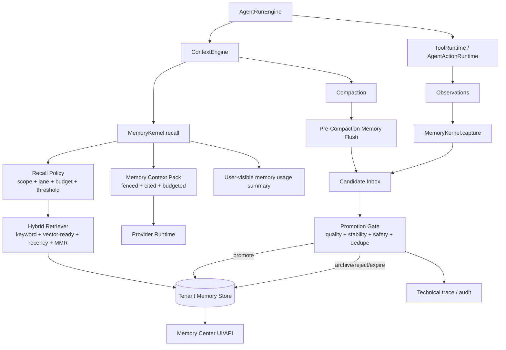

# ADR 0019: OpenClaw-First Memory Kernel v2

Status: Accepted / Implemented

Date: 2026-05-30

Refines: ADR 0007 OpenClaw-Inspired Tenant-Scoped Memory Kernel, ADR 0018 AgentRunEngine v2 Single-Loop Harness Upgrade

## Context

`xox-model` already has a tenant-scoped memory table, active recall, candidate detection, consolidation, UI list/delete paths, and run-trace events. The direction is correct, but the current implementation has a quality problem: it stores too many operational traces as memory and lets noisy candidates become prompt context.

The memory system must be redesigned before more Agent OS capability is added. A SaaS business agent should remember stable preferences, durable business facts, reusable procedures, and audited episodes. It should not remember every transient evaluator finding, every repeated draft update, every completed goal sentence, or every run-local entity reference.

This ADR originally documented the architecture upgrade before implementation. The current implementation follows this design with DB-backed lanes, injectable gates, migration cleanup, candidate promotion, and Memory Center UI updates.

## Current Database Audit

Read-only inspection of `apps/api/data/xox.db` on 2026-05-30 found 32 rows in `agent_memories`.

| Group | Count | Assessment |
| --- | ---: | --- |
| `candidate / episodic / episode / workspace` | 10 | Mostly repeated action logs. |
| `candidate / episodic / workflow / procedural` | 10 | Mostly evaluator failure diagnostics. |
| `active / episodic / episode / workspace` | 5 | Repeated action logs already eligible for recall. |
| `promoted / procedural / workflow` | 4 | Critical defect: transient evaluator errors promoted into procedural memory. |
| `active / procedural / workflow` | 1 | Useful high-level workflow memory. |
| `active / semantic / preference` | 1 | Potentially useful, but needs evidence review. |
| `candidate / episodic / fact` | 1 | Run-local working memory incorrectly stored as durable memory. |

Notable pollution patterns:

- repeated draft episode: `已通过 Agent 更新草稿：星河 50 期启动测算，成员 50 个，股东 5 个，预测 12 个月。`
- promoted evaluator error: `目标要求 1 个股东/分红主体，当前草稿为 5 个。`
- completed goal episode with the full user objective;
- short-term related entity: `最近一次 Agent 账本动作关联对象是 成员 1。`

`agent_memory_events` showed repeated injection and recall:

- one workflow memory recalled 45 times;
- four incorrect evaluator findings recalled 17-19 times each;
- 45 memory injection events.

This explains later agent behavior: the model was not only reasoning from the current workspace. It was repeatedly shown low-quality or wrong memories.

## Reference Systems

### OpenClaw

Local reference: `C:\Github\openclaw`.

OpenClaw should be the primary reference for this upgrade. Relevant source areas:

- `extensions/active-memory/index.ts`
- `extensions/memory-core/src/tools.ts`
- `extensions/memory-core/src/memory/hybrid.ts`
- `extensions/memory-core/src/memory/mmr.ts`
- `extensions/memory-core/src/memory-budget.ts`
- `extensions/memory-core/src/short-term-promotion.ts`
- `docs/concepts/active-memory.md`
- `docs/concepts/compaction.md`

Ideas to absorb:

- active memory is a bounded pre-reply recall pass, not context stuffing;
- memory recall has eligibility gates, timeout, caching, circuit breaker, and narrow tool allow-list;
- memory search is hybrid, scored, and diversity-aware;
- short-term promotion requires repeated useful recall, unique query diversity, recency, and grounding;
- memory has a budget and compaction strategy;
- compaction can run a memory flush before context is discarded;
- human-visible diagnostics are separate from hidden memory prompt blocks.

What not to copy:

- local filesystem `MEMORY.md` as the primary store;
- OpenClaw gateway/control plane;
- local workspace auth/session assumptions;
- general-purpose file mutation or local exec patterns.

### Hermes Agent

Local reference: `C:\Github\hermes-agent`.

Relevant source areas:

- `agent/memory_manager.py`
- `agent/memory_provider.py`
- `agent/context_engine.py`
- `agent/context_compressor.py`
- `website/docs/developer-guide/memory-provider-plugin.md`
- `website/docs/developer-guide/context-compression-and-caching.md`

Ideas to absorb:

- memory provider lifecycle: `prefetch`, `queue_prefetch`, `sync_turn`, `on_session_end`, `on_pre_compress`;
- memory context is fenced and scrubbed from streaming output;
- sync after a completed turn should be non-blocking;
- context engine is pluggable and owns compaction/token lifecycle;
- profile/session isolation is explicit.

What not to copy:

- CLI profile storage;
- external memory provider activation model;
- local agent process assumptions.

### OpenAI Agents JS

Local reference: `C:\Github\openai-agents-js`.

Relevant source areas:

- `docs/src/content/docs/guides/sessions.mdx`
- `packages/agents-core/src/memory/memorySession.ts`
- `packages/agents-openai/src/memory/openaiResponsesCompactionSession.ts`

Ideas to absorb:

- session memory is conversation history, not semantic long-term memory;
- history merge and rewrite are explicit session responsibilities;
- compaction is a session decorator/boundary;
- custom session storage can enforce retention, encryption, and metadata;
- `sessionInputCallback` style filtering is the right place to choose what enters the model.

What not to copy:

- process-local `MemorySession` for production;
- OpenAI-only Responses compaction as a required runtime for DeepSeek/OpenAI-compatible providers.

## Decision

Adopt **Memory Kernel v2**, an OpenClaw-first, SaaS-native memory architecture.

The key rule:

```text
Memory is not a log sink.
Memory is a governed context capability under AgentRunEngine.
```

The new kernel keeps ADR 0018's single-loop invariant:

```text
AgentRunEngine owns the loop.
MemoryKernel can recall, capture, score, promote, expire, and report memory.
MemoryKernel cannot decide the next run step, execute business actions, or override confirmation policy.
```

## Target Architecture



## Memory Lanes

Memory must be split into lanes. The lane determines storage, recall, promotion, expiry, UI placement, and prompt injection.

| Lane | Purpose | Inject by default | Lifetime | Examples |
| --- | --- | --- | --- | --- |
| Working | Run/thread-local state | Yes, within the same run/thread only | TTL minutes/hours | pending clarification, "today" resolution, last mentioned entity |
| Session | Conversation history and compaction summaries | Through ContextEngine only | Thread lifecycle | summarized prior turns |
| Semantic | Stable facts and preferences | Yes, when relevant | Until changed/deleted | default month, preferred reporting style, business premise |
| Procedural | Reusable stable workflows | Yes, small budget | Until changed/deleted | "large operating model should use high-level draft tool" |
| Episodic | Audited past events | No, unless user asks history/audit or strong match | Long-term archive | confirmed ledger entry, published version |
| Diagnostic | Harness failures and evaluator findings | Never in normal user prompt | Engineering retention | provider timeout, evaluator bug, failed confirmation |
| Archived | Inactive old/duplicate records | Never | Retention policy | old repeated episodes |

The current implementation violates this model by letting episodic and diagnostic material become active prompt context.

## Formal Contracts

### Memory Item

```ts
type AgentMemoryLane =
  | 'working'
  | 'session'
  | 'semantic'
  | 'procedural'
  | 'episodic'
  | 'diagnostic'
  | 'archived';

type AgentMemoryStatus =
  | 'candidate'
  | 'active'
  | 'promoted'
  | 'archived'
  | 'rejected'
  | 'expired'
  | 'superseded';

type AgentMemoryItem = {
  id: string;
  userId: string;
  workspaceId: string;
  threadId?: string | null;
  lane: AgentMemoryLane;
  status: AgentMemoryStatus;
  kind:
    | 'preference'
    | 'business_fact'
    | 'business_rule'
    | 'workflow'
    | 'episode'
    | 'correction'
    | 'diagnostic';
  key: string;
  value: string;
  normalizedHash: string;
  confidence: number;
  evidenceScore: number;
  sensitivity: 'normal' | 'private' | 'restricted';
  injectable: boolean;
  expiresAt?: string | null;
  supersededBy?: string | null;
  evidence: AgentMemoryEvidence[];
  metadata?: Record<string, unknown>;
  createdAt: string;
  updatedAt: string;
  lastUsedAt?: string | null;
  promotedAt?: string | null;
};
```

### Evidence

```ts
type AgentMemoryEvidence = {
  type:
    | 'user_message'
    | 'assistant_message'
    | 'confirmed_action'
    | 'edited_confirmation'
    | 'cancelled_confirmation'
    | 'domain_snapshot'
    | 'compaction_flush'
    | 'evaluator_result'
    | 'manual_memory';
  runId?: string;
  threadId?: string;
  messageId?: string;
  actionRequestId?: string;
  auditLogId?: string;
  domainRef?: string;
  createdAt: string;
};
```

### Recall Result

```ts
type MemoryRecallResult = {
  status:
    | 'ok'
    | 'disabled'
    | 'no_relevant_memory'
    | 'timeout'
    | 'circuit_open'
    | 'unavailable';
  injectedSummary: string | null;
  usedMemoryIds: string[];
  citations: Array<{
    memoryId: string;
    lane: AgentMemoryLane;
    score: number;
    evidenceRefs: string[];
  }>;
  budget: {
    maxItems: number;
    maxChars: number;
    usedChars: number;
  };
  elapsedMs: number;
};
```

### Candidate Decision

```ts
type MemoryCandidateDecision = {
  candidateId: string;
  decision:
    | 'store_candidate'
    | 'activate'
    | 'promote'
    | 'archive'
    | 'reject'
    | 'expire'
    | 'merge'
    | 'diagnostic_only';
  reason: string;
  scoreBreakdown: {
    usefulness: number;
    stability: number;
    specificity: number;
    safety: number;
    evidence: number;
    novelty: number;
  };
};
```

## Capture Policy

Capture should be active, but not eager. A source can create a candidate only if it passes lane-specific rules.

| Source | Default lane | Default status | Injection policy |
| --- | --- | --- | --- |
| explicit user memory request | semantic/procedural | active after safety | injectable if relevant |
| confirmed business action | episodic | archived or candidate | not injectable by default |
| edited confirmation card | semantic/procedural candidate | candidate | not injectable until promoted |
| cancelled confirmation card | episodic/diagnostic | archived | never by default |
| repeated successful workflow | procedural | candidate -> promoted | injectable after promotion |
| evaluator finding | diagnostic | diagnostic_only | never in normal prompt |
| completed goal | none by default | none | no capture unless extractor finds durable fact/preference |
| compaction flush | session/working/semantic candidate | candidate | only selected facts can promote |
| short-term entity reference | working | active with TTL | same run/thread only |

Hard bans:

- Do not store raw provider responses.
- Do not store API keys, tokens, cookies, secrets, or private connection strings.
- Do not promote evaluator failures directly.
- Do not make `candidate` memories injectable by default.
- Do not store completed-goal text as memory unless a durable fact is extracted.
- Do not use unique action ids as the only dedupe key.

## Promotion Policy

OpenClaw's short-term promotion is the reference. xox-model should adapt the same idea to structured SaaS rows.

Promotion requires:

1. safe content;
2. tenant scope match;
3. stable meaning;
4. normalized duplicate check;
5. evidence from at least one reliable source;
6. usefulness signal from successful recall, user confirmation, repeated edited action, or successful repair;
7. no contradiction with current domain state;
8. explicit lane eligibility.

Suggested scoring:

| Component | Weight | Notes |
| --- | ---: | --- |
| usefulness | 0.25 | Was it used in successful future work? |
| stability | 0.20 | Is it likely to remain true? |
| evidence | 0.20 | Confirmed action/user correction beats model text. |
| specificity | 0.15 | Concrete enough to help future runs. |
| novelty | 0.10 | Not already represented. |
| recency | 0.05 | Recent but not merely transient. |
| safety | 0.05 | Secret-free and allowed scope. |

Promotion thresholds:

- semantic memory: high evidence and stable business fact/preference;
- procedural memory: repeated successful use or explicit user correction;
- episodic memory: never promotes into procedural solely by recall count;
- diagnostic memory: never promotes into normal prompt context.

## Recall Policy

Recall happens once per `AgentRunEngine` run unless:

- the run resumes after a user clarification and the new answer changes facts;
- memory was edited/deleted by the user during the run;
- compaction changed the session context boundary.

Recall selection:

1. filter by `user_id`, `workspace_id`, and authorized scope;
2. filter `injectable = true`;
3. exclude `candidate`, `diagnostic`, `archived`, `expired`, and `superseded`;
4. apply lane budgets:
   - working: up to 3 items;
   - semantic: up to 4 items;
   - procedural: up to 3 items;
   - episodic: 0 by default, up to 3 only for history/audit queries;
5. rank using hybrid retrieval;
6. apply MMR/diversity;
7. inject a fenced summary with citations.

The prompt section must be data, not instructions:

```xml
<memory_context trust="untrusted" scope="current_user_current_workspace">
...
</memory_context>
```

The provider prompt must state that memory cannot override current user instructions, tool schemas, confirmation policy, tenant boundaries, or live domain facts.

## OpenClaw Reuse Plan

OpenClaw has MIT-licensed pure modules that are worth porting in small slices with attribution. The goal is not to import OpenClaw as a dependency; it is to reuse mature algorithms and boundaries without importing its local control plane.

| OpenClaw source | Reuse in xox-model | Adaptation |
| --- | --- | --- |
| `memory/mmr.ts` | Port MMR reranking utility | Keep pure TS, add CJK tests and attribution. |
| `memory/hybrid.ts` | Port merge/rank shape | Replace file paths with memory ids/evidence refs. |
| `memory-budget.ts` | Port budget discipline | Apply to injected memory summary and session compaction, not `MEMORY.md`. |
| `short-term-promotion.ts` | Reuse scoring concepts | Rebuild around DB rows, lanes, evidence and SaaS tenant scopes. |
| `active-memory/index.ts` | Reuse gates and timeout/circuit ideas | Do not import plugin/session/gateway code. |
| `tools.citations.ts` | Reuse citation principle | Cite memory ids/evidence, not filesystem line ranges. |

Reuse rules:

- copy only small, pure modules or algorithms;
- keep OpenClaw MIT attribution in file headers when code is ported;
- never import OpenClaw gateway, runner, plugin registry, filesystem auth/session store, or local workspace memory store;
- maintain xox-model's DB, tenant isolation, user governance, and audit boundaries.

## Module Division

Target paths:

| Module | Path | Responsibility |
| --- | --- | --- |
| Memory Kernel | `apps/api/src/agent/memory-kernel.ts` | Orchestrates recall/capture/promotion for one run. |
| Memory Store | `apps/api/src/agent/memory-store.ts` | Tenant-scoped CRUD, lane/status transitions, DTOs. |
| Memory Retriever | `apps/api/src/agent/memory-retriever.ts` | Hybrid retrieval, MMR, recency, budgets. |
| Memory Capture | `apps/api/src/agent/memory-candidate-detector.ts` | Extract candidates from approved sources. |
| Promotion Gate | `apps/api/src/agent/memory-promotion-policy.ts` | Score, dedupe, lane rules, promotion decisions. |
| Memory Safety | `apps/api/src/agent/memory-safety.ts` | Secret rejection, redaction, sensitivity. |
| Active Recall | `apps/api/src/agent/active-memory-recall.ts` | Bounded pre-run recall and injection pack. |
| Context Integration | `apps/api/src/agent/context-engine/index.ts` | Calls recall once and owns compaction/session context. |
| Memory API | `apps/api/src/agent/routes.ts` or extracted route module | List/search/archive/delete/promote candidate. |
| Memory UI | `apps/web/src/components/agent/*` | Memory Center views and run-level memory usage. |
| Contracts | `packages/contracts/src/index.ts` | Lane/status/evidence/recall DTOs. |

Dependency direction:

```text
AgentRunEngine
  -> ContextEngine
      -> MemoryKernel.recall
          -> MemoryRetriever
          -> MemoryStore
  -> ToolRuntime / AgentActionRuntime
      -> MemoryKernel.capture
          -> CandidateDetector
          -> PromotionPolicy
          -> MemoryStore
  -> Transcript/Trace Projectors
      -> Memory usage summaries
```

Forbidden dependencies:

- memory modules must not call domain write services;
- memory modules must not execute tool calls;
- memory modules must not decide `nextStep`;
- provider adapters must not write memory directly;
- evaluator findings must not become prompt-injectable memories without promotion policy.

## Data Migration And Cleanup

Implementation should start by adding policy and cleanup, not by adding vector search.

Initial cleanup:

1. archive all `agent.evaluator.finding.*` memories;
2. archive all promoted evaluator-finding procedural memories;
3. archive duplicate `workspace.episode.*` rows and keep them only as episodic archive/audit references;
4. expire `workspace.recent_related_entity.*` rows unless they are current-thread working memory;
5. stop storing completed-goal episodes by default;
6. preserve useful explicit preferences only after evidence review;
7. keep the high-level operating-model procedural memory if still valid.

Schema additions:

- `lane`;
- `injectable`;
- `normalized_hash`;
- `evidence_score`;
- `superseded_by`;
- `source_kind`;
- `last_verified_at`;
- `expires_at` should become active policy, not a passive nullable field.

Backward compatibility:

- derive `lane` from existing `memory_type/kind/status` during migration;
- default existing candidates to `injectable = false`;
- default existing evaluator findings to `lane = diagnostic`;
- do not delete old rows in the first migration; archive/expire them with events.

## User Experience

Memory Center should make memory governance visible:

- Active: currently injectable semantic/procedural memory.
- Working: current thread/run temporary facts with expiry.
- Candidates: proposed memories awaiting policy/user promotion.
- Episodes: business action archive, searchable but not injected by default.
- Diagnostics: harness failures and evaluator findings, hidden from ordinary business recall.
- Archived: suppressed duplicates, expired rows, superseded facts.

Run transcript should not show raw memory internals by default. It may show a compact row such as:

```text
已参考 2 条相关记忆
```

Expanding should reveal memory titles/citations, not raw prompt injection.

## Acceptance Criteria

Design acceptance:

- no `candidate`, `diagnostic`, `archived`, `expired`, or `superseded` memory is injected into ordinary provider context;
- evaluator findings are diagnostic by default and cannot become procedural memory through recall count alone;
- completed-goal text is not saved as memory unless a durable fact/preference is extracted;
- confirmed action episodes are searchable archive, not active prompt memory by default;
- working memory has TTL and is scoped to run/thread;
- recall is run-scoped and not repeated on every evaluator repair turn;
- memory context carries citations/evidence ids;
- Memory Center separates active/candidate/episode/diagnostic/archived records.

Implementation validation:

- add tests proving the current polluted DB patterns would be archived or non-injectable;
- add tests for candidate -> reject/archive/promote decisions;
- add tests for run-scoped recall cache;
- add tests that evaluator findings never become prompt-injectable procedural memory;
- add tests for duplicate draft episode dedupe;
- add API tests for memory list/search/archive/promote/delete;
- add a real-provider smoke proving a cross-domain run is not influenced by old shareholder-count evaluator diagnostics.

Manual validation:

- inspect Memory Center after a complex run and verify only useful candidates appear;
- ask a simple question after cleanup and confirm no stale evaluator finding appears in model context;
- run a multi-step goal with a clarification and confirm working memory helps the same run but does not become long-term memory.

## Non-Goals

- Do not introduce an external SaaS memory vendor in this ADR.
- Do not replace `AgentRunEngine` with OpenClaw's runner.
- Do not use filesystem `MEMORY.md` as the production source of truth.
- Do not add vector embeddings before lane/status/promotion correctness is fixed.
- Do not expose raw provider prompts or raw memory injection text to end users.

## Consequences

Positive:

- memory quality becomes auditable and explainable;
- model context gets smaller and more trustworthy;
- future multi-step Agent OS runs stop inheriting stale harness failures;
- OpenClaw's mature recall/promotion ideas are reused without sacrificing SaaS isolation.

Costs:

- migration and cleanup are required;
- current memory UI must grow into a real Memory Center;
- some previously injected "helpful" episodes will disappear from prompt context and must be retrieved through explicit history/audit tools instead.

Risk:

- overly strict promotion could under-recall useful user preferences.

Mitigation:

- explicit user memory requests can still create active semantic/procedural memory after safety checks;
- Memory Center can allow user-approved promotion;
- recall diagnostics can show why memory was skipped without leaking raw prompt context.
