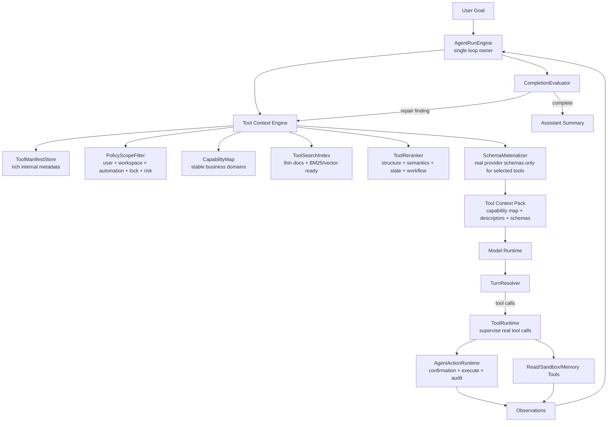

# ADR 0020: Progressive Tool Discovery Runtime

Status: Accepted / Implemented

Date: 2026-05-31

Refines: ADR 0017 Tool Runtime Maturity Upgrade, ADR 0018 AgentRunEngine v2 Single-Loop Harness Upgrade, ADR 0019 OpenClaw-First Memory Kernel v2

## Context

`xox-model` now has a real SaaS Agent OS harness:

- one authoritative `AgentRunEngine` loop;
- server-owned threads, runs, action graph, confirmation cards and transcript;
- provider-native tool calls;
- tenant-scoped memory and provider settings;
- tool inventory snapshots, policy, automation authority and audit;
- read/tool observation continuation and evaluator repair.

The remaining tool-runtime problem is not "no tools" or "fake tool calls". The problem is **tool context selection**.

The current `Tool Catalog Gateway` already avoids the worst pattern of exposing every tool on every turn. It uses a model-selected capability router to choose buckets such as `data`, `ledger`, `draft`, `version`, `share`, `memory`, `sandbox` and then exposes the tools in those buckets. This is a good progressive-disclosure direction, but the grain is still too coarse. A cross-domain goal can still expose 12, 17, 26 or 36 tools, leaving the model to choose from a large schema surface.

Hermes Agent recently added a mature `tool_search` mechanism for a related but different problem: it defers MCP and plugin tool schemas behind `tool_search`, `tool_describe` and `tool_call` so the model does not pay for every schema up front. That design is retrieval-first.

The product requirement for `xox-model` is neither a pure capability bucket nor a pure tool search bridge. We need to fuse both ideas:

```text
Progressive disclosure decides which layer of tool context is visible.
Retrieval decides which tools are visible inside that layer.
```

The goal of this ADR is to define one unified runtime, not two runtime adapters and not another parallel control plane.

## Reference Findings

### Hermes Agent

Local reference: `C:\Github\hermes-agent`.

Relevant source areas:

- `tools/tool_search.py`
- `model_tools.py`
- `tests/tools/test_tool_search.py`
- `website/docs/user-guide/features/tool-search.md`

Useful mature ideas:

- The model-facing search surface is tiny.
- Full schemas are deferred.
- Search indexes tool name, description and top-level parameter names, not the whole schema.
- The catalog is rebuilt from live tool definitions and scoped to the current session's toolsets.
- Core tools are never deferred.
- Bridge execution unwraps to the underlying tool so hooks, guardrails, approvals and result shaping still apply to the real tool.

Direct implication for `xox-model`:

- Reuse Hermes' retrieval discipline: short search documents, BM25-style lexical retrieval, scoped catalogs, threshold-based disclosure and regression tests.
- Do not copy Hermes' local-agent assumptions or universal `tool_call` as the product-facing execution model.
- In xox, the model should still call real business tools after schemas are materialized, so transcript, confirmations and audit show real business actions.

### OpenClaw

Local reference: `C:\Github\openclaw`.

Relevant source areas previously reviewed:

- effective tool inventory;
- single session lane and agent loop;
- tool contracts;
- transcript versus technical trace projection.

Useful mature ideas:

- Tool inventory should be an effective, scoped snapshot with provenance.
- The loop should own disclosure, tool execution, observation and next-turn continuation.
- User-facing transcript should not expose internal lifecycle noise.

Direct implication for `xox-model`:

- Keep `AgentRunEngine` as the only loop owner.
- Keep tool discovery as a collaborator under the loop, not a second planner.
- Store enough trace to explain why a tool pack was selected without showing technical internals in the main transcript.

### OpenAI Agents JS / OpenAI Tool Search

Local reference: `C:\Github\openai-agents-js`.

Official reference: [OpenAI Tool Search](https://developers.openai.com/api/docs/guides/tools-tool-search).

Useful mature ideas:

- Tool search can load tools dynamically instead of placing all definitions in the initial context.
- Namespaces/MCP descriptions are effective high-level discovery handles.
- Tool definitions can be loaded at the end of the context window to preserve cache.
- Agents SDK keeps tool execution, approvals, tracing and guardrails as runner-side concepts.

Direct implication for `xox-model`:

- Use the idea of dynamic schema materialization.
- Keep provider-specific native `tool_search` as a future transport optimization only; the architecture must remain one project-owned `Tool Context Engine`.
- Do not let SDK tools execute business writes directly.

## Decision

Introduce a single **Progressive Tool Discovery Runtime** owned by `Tool Context Engine`.

This runtime fuses:

- `xox-model` / OpenClaw-style progressive disclosure as the **layering model**;
- Hermes-style tool search as the **retrieval model**.

It is not a second run loop. It is not a second provider adapter. It is not a heavy prompt-visible "Action Card" system.

The engine answers one question for `AgentRunEngine`:

```text
Given the current goal, observations, unresolved evaluator findings, user/workspace scope,
automation authority, provider profile and page state, what is the smallest useful tool
context the model should see next?
```

## Architecture



Invariant:

```text
AgentRunEngine owns what happens next.
Tool Context Engine owns what tool context is visible next.
ToolRuntime owns supervision of selected real tools.
AgentActionRuntime owns writes.
CompletionEvaluator owns completion judgment.
```

## Progressive Disclosure Layers

### Layer 0: Stable Capability Map

Always small, stable and cacheable.

The model can know that the system has these domains:

- `data` — query current workspace facts, forecast, ROI, payback, ledger summaries and entity lists;
- `ledger` — actual entries, planned batches, void/restore/update, period locks;
- `draft` — operating model changes such as members, employees, shareholders, costs, prices, cadence and workspace name;
- `version` — snapshots, release, rollback, promote, delete;
- `share` — create/revoke share links;
- `memory` — scoped recall and durable user/workspace preferences;
- `sandbox` — manifest-scoped computation and file transformation;
- `navigation` — explicit UI navigation when needed;
- `account` — manual-only account-impacting actions.

Layer 0 is not a list of tools. It is the skeleton of the product.

### Layer 1: Thin Tool Descriptors

Returned by retrieval. Extremely short. Model-visible.

Example:

```text
data_query_workspace — 查询回本、利润、现金、成员、股东、账本摘要
ledger_create_member_income — 记录成员线上/线下收入
workspace_patch_config — 修改模型草稿中的股东、成员、员工、成本或预测输入
```

This is the layer that replaces a heavy "Action Card". It should usually fit in one line per tool.

### Layer 2: Materialized Tool Schemas

Only 3-8 likely tools should have full provider schemas in a normal turn.

The model calls real tools such as:

- `data_query_workspace`
- `ledger_create_member_income`
- `workspace_patch_config`

It should not call a product-visible universal `tool_call`.

### Layer 3: Observations

Tool results return tenant-scoped facts. They are fed back into the next model turn.

For example, if the user says "第一个股东" or "成员 A", the first tool pack should favor `data_query_workspace` so the model can inspect current shareholders and members before asking the user.

### Layer 4: Confirmation / Interruption

Writes remain server-owned confirmation cards unless automation policy allows auto-execution. This layer is unchanged by tool discovery.

## Internal Data Shapes

### ToolManifest

Internal only. Not shown directly to the model.

```ts
type ToolManifest = {
  name: string
  capability: AgentToolCapability
  title: string
  aliases: string[]
  entityTags: string[]
  parameterNames: string[]
  riskLevel: AgentToolRiskLevel
  confirmationMode: AgentToolConfirmationMode
  authorityClass: AgentToolAuthorityClass
  navigationTarget?: string
  requiredFacts?: string[]
  resolvesFacts?: string[]
  prerequisiteTools?: string[]
  providerSchema: ChatTool
}
```

The manifest can be rich because it is harness-owned. It does not create prompt bloat.

### ToolSearchDocument

Index unit. Internal only.

```ts
type ToolSearchDocument = {
  name: string
  capability: AgentToolCapability
  text: string
  parameterNames: string[]
  entityTags: string[]
}
```

`text` is built from title, aliases, short description, business verbs and parameter names. It must not include full JSON schema bodies.

### ToolDescriptor

Thin model-visible candidate.

```ts
type ToolDescriptor = {
  name: string
  title: string
  summary: string
  risk: 'read' | 'write' | 'manual_only' | 'sandbox_compute'
}
```

The summary should be short enough to render as one transcript row if needed.

### ToolContextPack

Provider-turn input produced by `Tool Context Engine`.

```ts
type ToolContextPack = {
  capabilityMap: AgentToolCapability[]
  descriptors: ToolDescriptor[]
  materializedTools: ChatTool[]
  discoveryTrace: {
    source: 'preload' | 'model_requested' | 'evaluator_repair'
    selectedCapabilities: AgentToolCapability[]
    candidateToolNames: string[]
    materializedToolNames: string[]
    reasonCodes: string[]
  }
}
```

`discoveryTrace` is for technical logs and tests. The main user transcript should show real tool calls, not discovery internals.

## Retrieval And Ranking

Tool selection must be fast and accurate by combining four signals.

### 1. Hard Policy Scope

Before retrieval:

- filter by `userId`;
- filter by `workspaceId`;
- filter by automation authority;
- filter by account/manual-only rules;
- filter by lock state and risk where deterministically known;
- filter provider-incompatible schemas.

Search must never return a tool the current run cannot call.

### 2. Capability Structure

Use the stable capability map to avoid searching unrelated tool families.

Example:

```text
"回本" -> data
"线上10张入账" -> ledger
"股东注资" -> draft
```

This is not a regex intent router. It is a small model-visible structure and an internal weighted prior.

### 3. Semantic Retrieval

Use Hermes-style retrieval over `ToolSearchDocument`.

Initial implementation can use BM25 because the catalog is small, deterministic and easy to test. Vector retrieval can be added later behind the same `ToolSearchIndex` interface.

Search corpus:

- tool name split by `_`, `-`, `.`, `:`;
- short Chinese title;
- aliases;
- business verbs;
- entity tags;
- top-level parameter names.

Do not index full schemas.

### 4. Workflow Reranking

The reranker should prefer tools that unblock missing facts.

Examples:

- If user says "第一个股东", prefer `data_query_workspace` before `workspace_patch_config`.
- If user says "成员 A" and the workspace may name members `成员 1...成员 50`, prefer `data_query_workspace` before `ledger_create_member_income`.
- If user says "今天", resolve current date in context; do not ask the user.
- `ask_user_clarification` should rank high only after available read tools cannot resolve the missing fact.

This is the practical difference between "tool search" and "business action discovery".

## Model Interaction Pattern

### Fast Path: Preloaded Small Pack

Before a model call, `AgentRunEngine` asks `Tool Context Engine` for a small tool context pack based on:

- user message;
- active goal contract;
- previous observations;
- evaluator findings;
- current workspace context;
- current page state;
- automation level.

For a simple read-only query, this may materialize only `data_query_workspace`.

### Expansion Path: Model-Requested Discovery

If the model needs a capability not in the materialized pack, it may call a small discovery tool:

```ts
tool_discover({
  objective: string
  neededCapability?: AgentToolCapability
  neededFacts?: string[]
  excludeToolNames?: string[]
})
```

`tool_discover` returns thin descriptors, not full schemas. On the next turn, `Tool Context Engine` may materialize the selected tools.

This preserves a single loop:

```text
model asks for discovery -> observation -> AgentRunEngine continues -> Tool Context Engine materializes -> model calls real tools
```

### No Product-Facing Universal Tool Call

Unlike Hermes, xox should not make `tool_call(name, arguments)` the normal business execution path. A universal bridge weakens provider schema constraints and makes UI/audit less direct.

The model should ultimately call real tools. Internally, the engine may use bridge-like mechanics, but the product-visible tool identity must remain the real business tool.

## Complex Goal Example

User:

```text
我们几个月才能回本？帮我记一笔成员A的今天的线上10张，然后帮我第一个股东注资100w
```

Expected discovery sequence:

1. Preloaded capability map: `data`, `ledger`, `draft`.
2. Preloaded candidate descriptors:
   - `data_query_workspace`
   - `ledger_create_member_income`
   - `workspace_patch_config`
   - `ask_user_clarification` as fallback only
3. Materialized first-turn schemas:
   - `data_query_workspace`
4. Model calls `data_query_workspace` for:
   - payback summary;
   - member list / aliases;
   - shareholder list / investment amounts;
   - current period/date context.
5. Observation returns current facts.
6. Next tool context materializes:
   - `ledger_create_member_income`
   - `workspace_patch_config`
7. Writes produce confirmation cards or auto-execute according to automation authority.
8. Evaluator checks:
   - payback answered;
   - member income entry created or pending confirmation;
   - shareholder investment patch created/executed;
   - no unnecessary clarification.

The model should not ask who the first shareholder is if the workspace can answer it.

## Module Plan

### New Module Boundary

```text
apps/api/src/agent/tool-context-engine/
  index.ts
  tool-manifest.ts
  tool-search-document.ts
  tool-search-index.ts
  tool-reranker.ts
  schema-materializer.ts
  discovery-trace.ts
```

### Existing Modules To Extend

- `apps/api/src/agent/tool-catalog.ts`
  - Add manifest metadata beside the existing provider schema.
  - Keep this the single source for real tool definitions.

- `apps/api/src/agent/tool-gateway.ts`
  - Convert from capability projection owner into facade over `Tool Context Engine`.
  - Keep existing event shape during migration where possible.

- `apps/api/src/agent/tool-runtime/effective-tool-inventory.ts`
  - Feed policy-scoped inventory into `Tool Context Engine`.

- `apps/api/src/agent/agent-run-engine.ts`
  - Request `ToolContextPack` before provider calls and after evaluator repair findings.

- `apps/api/src/agent/turn-resolver.ts`
  - Treat `tool_discover` as a read-only discovery step that continues the loop.

- `packages/contracts/src/index.ts`
  - Add DTOs only for persisted/observable discovery trace if needed.
  - Keep internal ranking metadata out of public contracts unless the UI needs it.

### Reuse Plan

Hermes-inspired reusable logic:

- BM25 implementation over small catalog;
- schema token estimation;
- threshold gate;
- stateless catalog rebuild;
- session-scope tests;
- "core/always visible tools are never deferred" invariant.

OpenClaw-inspired reusable logic:

- effective inventory snapshot and provenance;
- single loop ownership;
- transcript/technical-trace separation;
- tool lifecycle event vocabulary.

OpenAI Agents JS / OpenAI docs-inspired reusable logic:

- schema materialization as runtime capability;
- typed tool definitions and approval/guardrail boundaries;
- dynamic tool loading concept;
- namespace-like high-level capability descriptions.

Reuse must be by small pure modules or rewritten TypeScript equivalents with attribution where license requires. Do not import local-agent control planes, host execution models or non-SaaS session ownership.

## Dependency Direction

```text
tool-catalog
  -> effective-tool-inventory
  -> tool-context-engine
  -> agent-run-engine
  -> model-runtime
  -> turn-resolver
  -> tool-runtime
  -> agent-action-runtime / read tools / sandbox / memory
  -> observations
  -> completion-evaluator
```

No module below `AgentRunEngine` may decide final completion or start a parallel planning loop.

## Non-Goals

- Do not add separate OpenAI-native and Hermes-bridge runtime adapters.
- Do not expose heavy Action Cards to the model.
- Do not make regex or keyword rules the business intent router.
- Do not replace confirmation cards with model trust.
- Do not let discovery execute tools.
- Do not show discovery internals in the main transcript.
- Do not bypass tenant/workspace/tool-policy scope.

## Acceptance Criteria

### Architecture

- `AgentRunEngine` remains the only loop owner.
- `Tool Context Engine` is the only owner of tool-context selection.
- Tool discovery produces real tool schemas, not a universal product-facing `tool_call`.
- Rich metadata stays internal; model-visible descriptors remain short.

### Accuracy

- For simple read-only questions, the first materialized tool set is small, normally 1-4 tools.
- For cross-domain tasks, the first visible schema set should stay below 8 real business tools unless evaluator repair explicitly widens it.
- References such as "第一个股东", "成员 A", "今天" prefer tenant-scoped fact tools before clarification.
- `ask_user_clarification` is used only after available read/fact tools cannot resolve required fields.

### Safety

- Search results and materialized schemas are filtered by user, workspace, provider profile, automation authority, risk, account/manual-only rules and known lock state.
- Write tools still produce editable confirmation cards unless automation authority allows execution.
- Auto-executed writes still pass through action request, policy, domain service, audit and observation paths.

### Observability

- Technical trace records selected capabilities, candidate tools, materialized tools and reason codes.
- Main transcript shows real business tool calls and confirmations, not discovery plumbing.
- Regression tests cover empty retrieval, broad retrieval, scoped retrieval, no schema bloat, no cross-workspace leak and no premature clarification.

### Performance

- Search index rebuild is deterministic and cheap for the current catalog size.
- Full schema materialization is bounded by selected tools.
- Provider prompt size should decrease for broad goals compared with the current bucket-only projection.

## Migration Plan

1. Add internal manifest metadata to existing `tool-catalog.ts` without changing provider schemas.
2. Add `ToolSearchDocument` builder and BM25 search index with unit tests.
3. Add `ToolReranker` with deterministic policy and workflow priors.
4. Add `SchemaMaterializer` that returns real `ChatTool` schemas for selected tools.
5. Wrap existing `tool-gateway.ts` behind `Tool Context Engine` while preserving current public events.
6. Add `tool_discover` as read-only discovery only if preload packs are insufficient in real smoke tests.
7. Update transcript projection so discovery internals stay in technical logs.
8. Run complex cross-domain smoke and compare tool counts, latency and accuracy against current bucket projection.

## Implementation Notes

Implemented in this change:

- `apps/api/src/agent/tool-context-engine/`
  - `tool-manifest.ts` builds rich internal `ToolManifest` metadata from the existing provider-native catalog.
  - `tool-search-document.ts` builds thin Hermes-style search documents.
  - `tool-search-index.ts` implements deterministic BM25-style lexical retrieval with CJK n-gram support.
  - `tool-reranker.ts` combines retrieval score, capability priors, canonical tools and workflow prerequisites.
  - `schema-materializer.ts` returns the bounded set of real `ChatTool` schemas and short descriptors.
  - `discovery-trace.ts` records candidate, selected and pruned tools for technical inspection.
- `apps/api/src/agent/tool-gateway.ts`
  - keeps the existing capability router;
  - replaces bucket-wide projection with `progressive_tool_discovery` materialization;
  - preserves full registry projection for explicit registry inspection/tests;
  - stores descriptors and discovery trace in the technical `tool_catalog_ready` event.
- `packages/contracts/src/index.ts` and `apps/api/src/agent/tool-runtime/effective-tool-inventory.ts`
  - add `progressive_tool_discovery` as an inventory source.
- `apps/api/tests/tool-context-engine.test.ts`
  - verifies small read packs, cross-domain retrieval, descriptor/schema separation and gateway integration.
- `apps/api/tests/api.test.ts`
  - updates previous bucket-wide assumptions to the new relevant-tool materialization contract.

Verification completed:

- `cmd.exe /c npm.cmd run test --workspace @xox/api -- tests/tool-context-engine.test.ts tests/tool-runtime.test.ts tests/sandbox-tool.test.ts`
  - 15 tests passed.
- `cmd.exe /c npm.cmd run test:api`
  - 150 tests passed.

## Open Questions

- Whether vector retrieval is needed after BM25 plus aliases and workflow reranking.
- Whether `tool_discover` should be model-visible immediately or introduced only after preloaded packs prove insufficient.
- The exact descriptor length budget for Chinese and English tool summaries.
- Whether discovery trace should become a public API field or remain technical log only.

## Final Design Rule

```text
xox progressive disclosure is the skeleton.
Hermes retrieval is the selection muscle.
The model sees only the smallest useful context for the next step.
The SaaS harness remains the authority for policy, confirmation, audit and completion.
```
