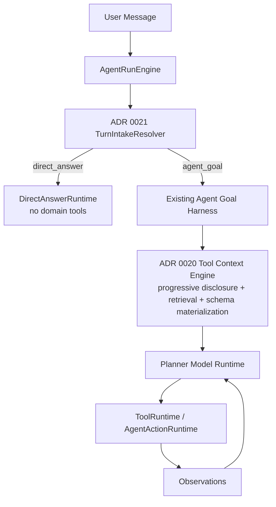
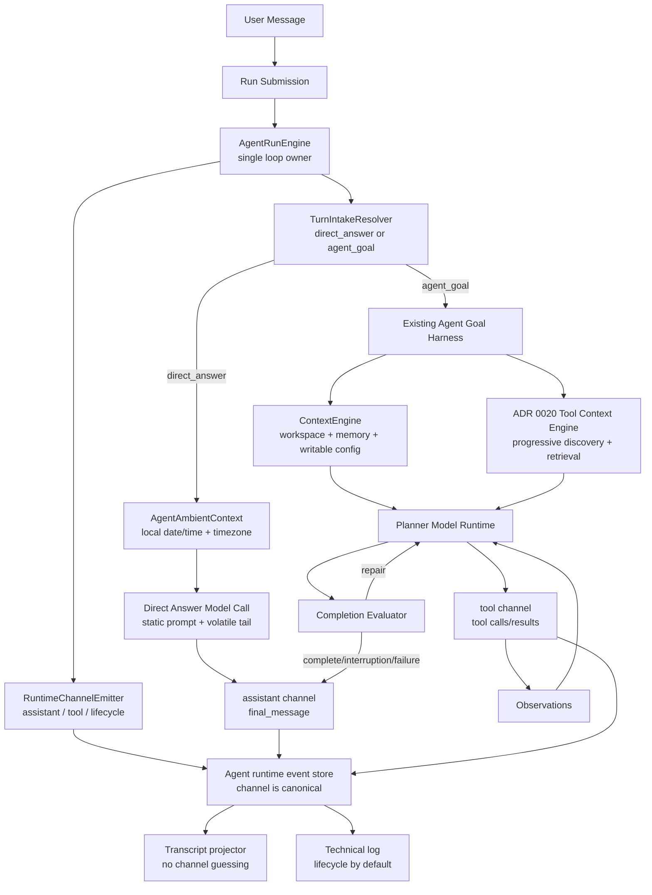

# ADR 0021: OpenClaw-Style Runtime Channels and Direct Answer Lane

Status: Implemented

Date: 2026-06-01

Refines: ADR 0018 AgentRunEngine v2 Single-Loop Harness Upgrade, ADR 0020 Progressive Tool Discovery Runtime, ADR 0019 OpenClaw-First Memory Kernel v2

## Context

`xox-model` already has the hard SaaS Agent OS pieces for workspace-domain work:

- provider-native tool calls;
- server-owned runs, action graph and editable confirmation cards;
- observation continuation;
- Completion Evaluator repair;
- tenant-scoped memory and audit;
- progressive tool discovery.

The defect exposed by `今天是几月几号` is narrower than the previous ADR draft implied.

The current architecture does **not** need a broad rewrite of read-only domain inspection. `read_inspect` already exists in practice through `data_query_workspace`, read observations and model-authored finalization. The real gaps are:

1. Runtime events are not first-class `assistant / tool / lifecycle` streams. They are mixed run events that projectors later classify.
2. Current date/time is injected through the large agent context (`currentDate`) instead of an OpenClaw-style prompt-cache-stable session/ambient boundary.
3. There is no lightweight `direct_answer` path, so ordinary chat and ambient facts are forced through Goal Contract, domain tool discovery, memory recall and Completion Evaluator.

This ADR corrects the scope:

```text
Do not rebuild read_inspect now.
Do not weaken agent_goal.
Add direct_answer and clean runtime channels first.
```

## Reference Findings

### OpenClaw

Local reference: `C:\Github\openclaw`.

Relevant source:

- `docs/concepts/agent-loop.md`
- `src/gateway/server-chat.ts`
- `src/agents/embedded-agent-runner/run/incomplete-turn.ts`
- `src/agents/embedded-agent-runner/run/attempt-trajectory-status.ts`
- `src/agents/system-prompt.ts`

Useful ideas to copy conceptually:

- Runtime emits separate streams:
  - `assistant` for assistant text deltas and final answer payloads;
  - `tool` for tool start/update/end;
  - `lifecycle` for queue, run state, compaction, retry, timeout and diagnostics.
- Pre-tool assistant text is flushed before tool-start events so users see the model's short plan before cards.
- A model turn that uses tools is incomplete until tool observations are fed back and the model produces final assistant text.
- Final payloads prefer assistant text; tool summaries support the answer but must not masquerade as the answer.
- Exact current date/time is deliberately not baked into the static system prompt. OpenClaw keeps prompt cache stable and uses session status/message timestamps when the agent needs live time.

Direct implication:

- `xox-model` should stop treating `assistant/tool/lifecycle` as only a transcript projection concern. They should be runtime event channels emitted by the harness and then projected to UI/technical log.
- Date/time belongs in a volatile ambient/session context or tiny session status source, not in the cacheable planner prompt or full workspace-domain context.

### OpenAI Agents JS

Local reference: `C:\Github\openai-agents-js`.

Relevant source:

- `packages/agents-core/src/runner/turnResolution.ts`
- `packages/agents-core/src/runner/runLoop.ts`
- `packages/agents-core/src/runner/toolExecution.ts`

Useful ideas to copy conceptually:

- Turn resolution is typed.
- If the model issued tool calls, the loop runs again with tool results.
- If there are no tool calls/actions, a plain assistant message can be final output.
- Approval/interruption is explicit run state, not a fake assistant answer.

Direct implication:

- A `direct_answer` turn with assistant text and no tool calls must be accepted as final output. It should not be downgraded into "missing tool call" or upgraded into an `agent_goal`.

### Hermes Agent

Local reference: `C:\Github\hermes-agent`.

Relevant source:

- `tools/tool_search.py`
- `agent/context_engine.py`
- `agent/conversation_loop.py`
- `agent/memory_manager.py`

Useful ideas to copy conceptually:

- Tool context can be tiny or deferred.
- Catalog assembly is scoped to the current turn.
- Core dispatch paths still apply when a real tool is called.
- Context and memory injection should be scoped and should not run noisily when a turn does not need them.

Direct implication:

- `direct_answer` should use zero domain tools.
- If exact live time is required, use an ambient `session_status` source instead of materializing domain tool schemas.
- Memory recall should not run for ordinary greetings, identity questions or current-date questions.

## Decision

Adopt three focused changes.

### 1. Runtime Channels Become First-Class

Introduce OpenClaw-style event channels in the harness:

```ts
type AgentRuntimeChannel = 'assistant' | 'tool' | 'lifecycle';
```

The channel must be assigned when the event is emitted, not guessed later by transcript projection.

```ts
type AgentRuntimeEvent =
  | AgentAssistantRuntimeEvent
  | AgentToolRuntimeEvent
  | AgentLifecycleRuntimeEvent;

type AgentAssistantRuntimeEvent = {
  channel: 'assistant';
  kind: 'text_delta' | 'planning_preface' | 'final_message' | 'refusal' | 'error_message';
  content: string;
};

type AgentToolRuntimeEvent = {
  channel: 'tool';
  kind: 'tool_call_started' | 'tool_call_delta' | 'tool_call_completed' | 'tool_call_failed';
  toolName: string;
  toolCallId?: string | null;
  payload?: Record<string, unknown> | null;
};

type AgentLifecycleRuntimeEvent = {
  channel: 'lifecycle';
  kind:
    | 'run_queued'
    | 'worker_claimed'
    | 'model_request_started'
    | 'model_request_completed'
    | 'provider_retrying'
    | 'memory_recall_started'
    | 'memory_recall_completed'
    | 'goal_contract_created'
    | 'goal_evaluated'
    | 'run_completed'
    | 'run_failed';
  payload?: Record<string, unknown> | null;
};
```

Mapping rules:

- `assistant` events are the only source of user-facing assistant prose.
- `tool` events are the only source of tool rows, tool details and tool result observations.
- `lifecycle` events are technical by default. The main transcript may show a lifecycle-derived user row only when it represents an actionable interruption or visible failure.

Current `AgentRunEvent` storage can remain during migration, but it must store or derive a canonical `channel` at write time. Projectors should stop using fragile title/message pattern matching as the source of truth.

### 2. Prompt-Cache-Stable Ambient Context

The cacheable planner/direct-answer prompts must not include volatile values such as exact date/time.

Target prompt layout:

```text
Static system prompt                 stable, cacheable
Static tool/capability instructions  stable, cacheable
Conversation / selected context      dynamic but scoped
Ambient session status               small, volatile, appended late
Current user turn                    dynamic
```

For direct answers, do not build the full workspace-domain context pack. Use a small ambient context:

```ts
type AgentAmbientContext = {
  nowIso: string;
  localDate: string;
  timezone: string;
  userDisplayName?: string | null;
  workspaceName?: string | null;
};
```

Rules:

- `planner.system.md` remains static.
- `currentDate` should not be relied on inside the full `buildAgentContextPack` for ordinary chat/date answers.
- Date/time should be supplied through `AgentAmbientContext` at the end of the provider input or through a tiny `session_status` ambient source.
- User timezone must be explicit. Do not use `utcNow().slice(0, 10)` as the user-facing local date.
- The direct-answer prompt may include the current date only in the volatile tail message, not the cacheable prompt head.

Ambient/session facts are not domain reads. They do not inspect tenant workspace data, do not participate in action graph planning, and should not be selected through ADR 0020 tool discovery.

If `session_status` is exposed as a provider-native tool later, its formal contract must identify it as an ambient source:

```ts
type AgentObservationAuthority = 'ambient' | 'domain' | 'action';

type AgentAmbientStatus = {
  authority: 'ambient';
  source: 'session_status';
  nowIso: string;
  localDate: string;
  timezone: string;
  runtime?: {
    provider?: string;
    model?: string;
  };
};
```

This is deliberately separate from `data_query_workspace`, which is a tenant/workspace-scoped domain read.

Expected behavior:

```text
User: 今天是几月几号
Assistant: 今天是 2026 年 6 月 1 日。
```

No workspace draft, no writable config, no memory recall, no domain tool catalog.

### 3. Add `direct_answer`; Do Not Rebuild `read_inspect`

Add one new lightweight turn lane:

```ts
type AgentTurnLane = 'direct_answer' | 'agent_goal';
```

`read_inspect` remains existing behavior for now. It is not a new lane in this ADR because the project already has read-only domain tools and observation continuation.

Direct answer examples:

- `你好`
- `告诉我你是谁`
- `今天是几月几号`
- `现在几点`
- `这个系统能做什么`
- `你能帮我做哪些事`

Direct answer behavior:

- no Goal Contract;
- no Completion Evaluator;
- no domain tool discovery;
- no active long-term memory recall;
- no workspace draft hydration unless explicitly needed;
- optional tiny `session_status` ambient source for exact live time;
- assistant text with no tool calls is final output;
- transcript shows user bubble plus assistant Markdown only.

Agent goal behavior remains unchanged:

- domain reads that require `data_query_workspace` continue using the existing tool path;
- writes continue through action graph and confirmation cards;
- multi-step read/write goals continue through `AgentRunEngine`, observations and evaluator repair.

## Relationship To ADR 0020

ADR 0021 does **not** replace ADR 0020.

They sit at different layers:

```text
ADR 0021: Should this turn enter the Agent goal harness at all?
ADR 0020: Once inside the Agent goal harness, what domain tool context should the model see next?
```

More concretely:

- `direct_answer` bypasses ADR 0020 entirely because it should not expose domain tools.
- `agent_goal` continues to use ADR 0020 exactly as before.
- ADR 0020's `Tool Context Engine`, capability map, Hermes-style retrieval, reranker and schema materializer remain the tool-selection mechanism for domain goals.
- ADR 0021's runtime channels apply across both paths:
  - direct answers emit mostly `assistant` plus hidden `lifecycle`;
  - agent goals emit `assistant`, `tool` and `lifecycle`;
  - ADR 0020 tool-discovery diagnostics are `lifecycle`, while actual provider tool calls and observations are `tool`.

The combined hierarchy is:



This means ADR 0021 should make the top of the system calmer, not make the whole harness larger. The earlier ADR 0021 diagram looked larger than intended because it redrew the downstream tool path. The correct reading is additive and narrow:

```text
Add a direct-answer exit before ADR 0020.
Make runtime channels first-class.
Leave ADR 0020 as the domain-tool context runtime.
```

## Architecture



The core invariant remains:

```text
AgentRunEngine owns the loop.
Runtime events own their channel at emission time.
Direct answers bypass agent-goal machinery.
Domain read/tool behavior is not redesigned in this ADR.
```

## Turn Intake Resolution

`TurnIntakeResolver` is not a domain intent router and must not become a keyword router for domain semantics.

The name is intentional:

- OpenAI Agents JS uses typed turn resolution rather than a "direct answer gate".
- OpenClaw's agent loop naturally treats assistant text with no tool use as a completed turn, and treats tool use as an incomplete turn that needs observations.
- `xox-model` needs the same idea at SaaS intake time: resolve whether the turn can be answered directly or must enter the existing Agent goal harness.

It may use conservative deterministic gates only for obvious direct-answer cases and safety exclusions:

- no pending confirmation/clarification resume;
- no requested domain write/action;
- no requested workspace data query requiring tenant state;
- no file/import/sandbox request;
- no publish/share/version/ledger/model mutation request;
- no account-impacting operation.

If uncertain, route to the existing `agent_goal` path. False negatives are acceptable; false positives that bypass domain actions are not.

Implementation may start with a small provider-native direct-answer model call using no domain tools. If the model emits no tool calls and returns assistant text, it is final. If it asks for workspace data or actions, the engine can restart the same user message through `agent_goal`.

## Prompt Cache Policy

Cache-stable:

- base direct-answer prompt;
- base planner prompt;
- tool behavior rules;
- channel semantics;
- safety rules.

Volatile:

- `nowIso`;
- `localDate`;
- timezone;
- current page/workspace display name;
- selected recent conversation snippets.

Volatile context must be appended late and kept small. It should not be mixed into large static prompts or full workspace-domain context packs.

This mirrors OpenClaw's reason for not embedding exact date/time in the static system prompt: date/time changes constantly and weakens prompt caching.

## Transcript Rules

### direct_answer

Render:

```text
User Bubble
Assistant Markdown
```

Do not render:

- `Worked for ...` work cycle;
- tool group;
- Goal Contract;
- Completion Evaluator;
- memory recall;
- tool catalog;
- queued/worker lifecycle.

### agent_goal

Render existing ADR 0011/0012/0018 behavior:

```text
User Bubble
Assistant planning preface, if model-authored
Work Cycle Group
Tool rows / navigation / confirmation cards / visible failures
Assistant Markdown final summary
```

Lifecycle events remain in the technical log unless they are actionable user interruptions.

## Existing `read_inspect` Position

This ADR does not change read-only domain inspection.

Current behavior should remain:

- questions such as `我们现在有几个人` use `data_query_workspace(scope=team_summary)`;
- entity inspection uses `data_query_workspace(scope=entity_summary)`;
- financial/read-only forecasts use existing read tools;
- tool observations feed back to the model;
- final answer is assistant-authored, not pasted tool output.

Later, if needed, a future ADR may split `read_inspect` from `agent_goal` for latency and UI reasons. That is explicitly out of scope here.

## Module Plan

Target implementation paths:

- `packages/contracts/src/index.ts`
  - add canonical runtime channel metadata for run events or a new runtime event DTO.
- `apps/api/src/agent/runtime-trace-events.ts`
  - emit `assistant/tool/lifecycle` channel at write time.
- `apps/api/src/agent/run-events.ts`
  - persist channel metadata, preserving existing rows during migration.
- `apps/api/src/agent/agent-transcript-projector.ts`
  - stop using title/message regex as the primary visibility model;
  - project by canonical channel first.
- `apps/api/src/agent/agent-run-engine.ts`
  - call `TurnIntakeResolver` before Goal Contract creation;
  - keep existing `agent_goal` flow intact.
- `apps/api/src/agent/direct-answer-runtime.ts`
  - new small runtime for direct answers;
  - uses static direct-answer prompt plus late ambient context;
  - no domain tools, no memory recall, no evaluator.
- `apps/api/src/agent/ambient-context.ts`
  - compute `nowIso`, `localDate`, timezone and optional display names.
- `apps/api/src/agent/context-pack.ts`
  - keep current behavior for agent goals;
  - do not use full context pack for direct answers.
- `apps/api/src/agent/prompts/direct-answer.system.md`
  - static prompt for normal assistant answers and platform identity.

Reuse plan:

- Port OpenClaw's channel separation and final-payload principle conceptually.
- Adapt OpenAI Agents JS's typed final/tool/interruption turn resolution.
- Reuse Hermes' scoped context/tool minimalism; do not add universal `tool_call` or a second runtime adapter.

## Acceptance Criteria

### Runtime Channels

- New runtime events have canonical `channel: assistant | tool | lifecycle`.
- Provider text deltas and final assistant text are `assistant`.
- Tool start/delta/completion/failure are `tool`.
- queue/worker/model/memory/evaluator/retry diagnostics are `lifecycle`.
- Transcript projection uses channel as source of truth, not title/message regex matching.

### Prompt-Cache Stable Ambient Date/Time

- Static prompts do not include exact current date/time.
- Direct-answer date/time questions use `AgentAmbientContext` or `session_status`, not full workspace-domain context.
- Date/time is based on explicit user/workspace timezone.
- `今天是几月几号` does not hydrate draft, writable config, tool catalog or memory.

### Direct Answer

- `你好` returns a normal assistant answer without Goal Contract.
- `告诉我你是谁` returns assistant identity without domain tools.
- `今天是几月几号` returns the local date without Goal Contract, Completion Evaluator, memory recall or domain tool discovery.
- Main transcript for direct answers contains only user bubble and assistant Markdown.
- Technical log may still contain lifecycle rows, but default transcript does not.

### Existing Behavior Preserved

- `我们现在有几个人` continues to use the existing `data_query_workspace` read path.
- `我们几个月才能回本` continues to use existing read/observation/finalizer behavior.
- `帮我记成员 A 今天线上 10 张` still enters full Agent OS action graph and confirmation flow.
- Mixed read/write prompts still use the existing agent-goal loop.

### Commands

- `npm.cmd run test:api` passes.
- `npm.cmd run test:web` passes.
- Add focused API tests for direct-answer no-goal behavior.
- Add projector tests proving channel-based visibility.

## Implementation Notes

Implemented on 2026-06-01:

- `AgentRunEvent.channel` is persisted and serialized as `assistant | tool | lifecycle`.
- Provider content deltas and `assistant_final_message` use `assistant`; provider tool deltas, supervised tool results, and action edit/execute/cancel events use `tool`; queue, worker, memory, evaluator, retry, and diagnostics use `lifecycle`.
- `TurnIntakeResolver` runs before the existing Agent goal harness and only exits to `direct_answer` for conservative ordinary chat or ambient date/time turns with no pending confirmation or clarification.
- `DirectAnswerRuntime` uses a static direct-answer prompt plus a compact late `AgentAmbientContext`; it does not hydrate workspace drafts, tool catalogs, writable config, evaluator state, or long-term memory for direct answers.
- Direct-answer provider failures are surfaced through the same failed status/read draft path instead of being replaced with deterministic fallback text. Deterministic fallback is reserved for the local `rules` provider.
- Existing domain reads and writes remain in the ADR 0020 / AgentRunEngine path; `我们现在有几个人` and `我们几个月才能回本` still use provider-selected workspace read tools and model continuation.

## Risks

- A turn intake resolver that is too aggressive could bypass domain operations. Default uncertain turns to `agent_goal`.
- A direct-answer model call without tools may still answer workspace data from stale conversation. The prompt must tell it to refuse/route when current workspace data is required.
- Adding channels while preserving old `AgentRunEvent` rows needs a migration-compatible DTO.
- Date/time must be timezone-aware; UTC date is not enough for user-visible answers.

## Non-Goals

- Do not rewrite `read_inspect`.
- Do not replace ADR 0018's single `AgentRunEngine`.
- Do not introduce a second provider adapter.
- Do not move domain writes into OpenAI Agents SDK callbacks.
- Do not copy OpenClaw's local control plane.
- Do not add production regex intent routing for domain semantics.
