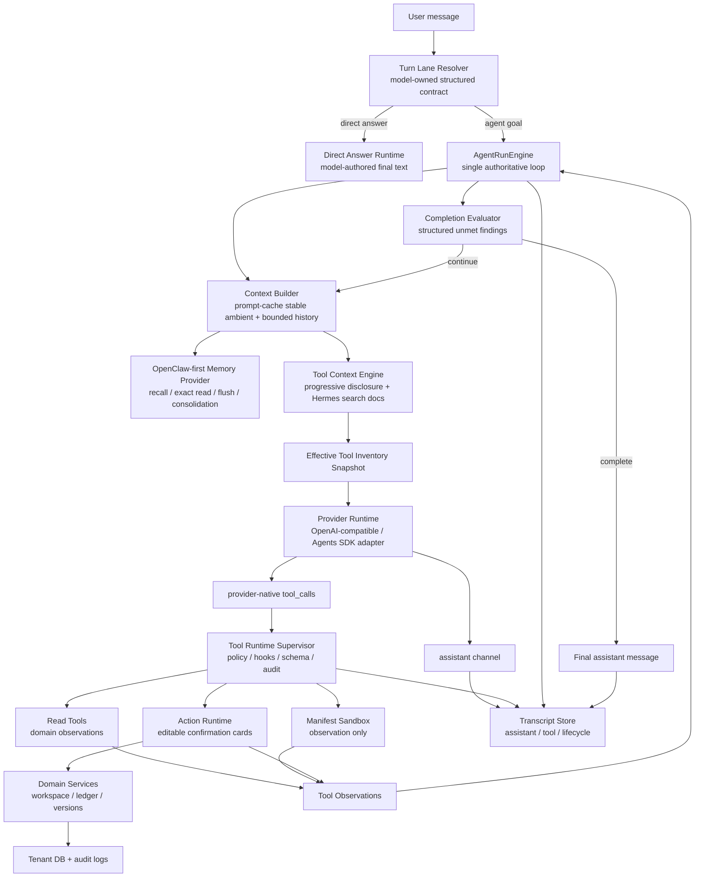
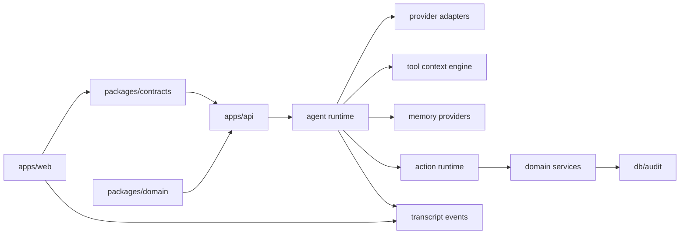

# ADR 0022: OpenClaw/Hermes-Inspired Semantic Runtime Hardening

Status: Accepted

Date: 2026-06-02

Refines: ADR 0018, ADR 0019, ADR 0020, ADR 0021

## Context

xox-model 已经完成了 Agent OS 的核心骨架：单一 `AgentRunEngine`、渐进式工具披露、OpenClaw-first memory kernel、direct answer lane、工具 observation continuation、可编辑确认卡和 SaaS 多租户边界。

但最近的自查暴露了一个更根本的问题：代码里仍然残留一些以中文关键词、`includes`、正则或枚举文本来做语义判断的逻辑。这类逻辑看似能修复一个中文样例，但本质上违背 harness agent 的边界：

- 模型应负责语义理解、工具选择、是否需要继续调用工具。
- Runtime 只负责提供稳定上下文、工具目录、策略边界、确认卡、审计和 observation。
- 确定性代码可以做安全、协议、文件类型、provider 错误、结构化字段校验，但不能通过用户自然语言关键词来决定业务意图。

这也是为什么之前的 `goal-fact-extractor.ts` 会被否定：如果英国用户、英文用户或中英混合用户进来，关键词逻辑会直接失效，而且会掩盖真实模型工具调用是否可靠。

本 ADR 的目标不是再造一个新 harness，而是把当前实现与 OpenClaw / Hermes 的成熟实践对齐，把薄弱点系统性收敛成一个优雅、可验证、可复用的语义硬化方案。

## Architecture Posture

This is an evolutionary hardening plan, not a rebuild.

xox-model 当前的 harness 已经有几块必须保留的资产：

- ADR 0018 的 single-loop `AgentRunEngine`。这是主循环权威，不能被 tool search、memory、lane resolver、evaluator 或 transcript projector 分裂。
- ADR 0019 的 OpenClaw-first SaaS memory kernel。方向正确，继续收敛 memory provider，而不是回到零散 recall 逻辑。
- ADR 0020 的 progressive tool discovery。它解决工具太多的问题，是 xox-model 贴合 SaaS 业务工具的骨架。
- ADR 0021 的 turn lane / direct answer / prompt-cache-stable ambient context。它解决普通对话和当前时间问题，但实现层还有关键词残留。
- 当前 action graph、editable confirmation card、automation authority、audit log、domain service 边界。这些是 SaaS 产品与本地 agent 最大的差异，不能被 OpenClaw/Hermes 的本地执行模型替代。

因此本 ADR 不要求“大幅推翻重来”，而是采用三类处理：

| Category | Meaning | Applies to |
| --- | --- | --- |
| Preserve | 保留当前架构，只加强边界和测试 | `AgentRunEngine`、confirmation card、domain services、audit、automation authority |
| Overlay | 在现有模块上增加更成熟的 contract 或 provider boundary | turn lane contract、tool search document、MemoryProvider、typed transcript display |
| Replace | 删除明显错误的语义实现方式 | 用户自然语言关键词表、direct-answer keyword fallback、fake-provider phrase branches、title/message regex visibility |

换句话说，风险矩阵里的解决方案不是“换一个新系统”，而是在当前系统中移除伪语义逻辑，把理解能力交还给模型，把确定性代码收敛为 contract validator / policy / executor。

## Reference Findings

### OpenClaw

本地参考路径：`C:\Github\openclaw`

OpenClaw 的设计重点不是复杂框架，而是清晰边界：

- 单 session lane：同一会话内串行运行，避免并发 run 互相污染。
- 三类流：`assistant`、`tool`、`lifecycle` 分开，不靠标题文本二次猜语义。
- Prompt assembly 有稳定区和动态区，尽量保护 prompt cache。
- Tool inventory 是有效工具快照，不是把所有工具都常驻塞进模型。
- Tool 调用有 `before_tool_call` / `after_tool_call` / `tool_result_persist` hook。
- Tool result 是 observation，回灌给模型继续生成最终 assistant 文本。
- Memory 是主动但有边界的：active memory、daily/session note、search/get、dreaming/compaction，而不是把所有运行日志丢进长期记忆。

可直接吸收的思想：

- 事件 channel-first，不做标题/正文 pattern projection。
- prompt cache-stable ambient context。
- effective tool inventory snapshot。
- tool result observation continuation。
- memory retrieval / exact read / flush / consolidation 四层。

### Hermes Agent

本地参考路径：`C:\Github\hermes-agent`

Hermes 的优势是工具过多时的简洁做法：

- `run_conversation()` 保持经典 loop：model -> tool_calls -> append tool result -> continue -> assistant final。
- OpenAI roles 保持干净：`system` / `user` / `assistant` / `tool`。
- Tool Search 只暴露 `tool_search` / `tool_describe` / `tool_call` 桥接工具，避免一次性注入全部非核心工具。
- 搜索文档很薄：工具名、描述、顶层参数名，不把完整 schema 暴露给搜索 prompt。
- Catalog 每轮 assembly 重建，避免 stale tool registry。
- 通过同一条 `model_tools.handle_function_call` 路径执行真实工具，让 guardrails、hooks、approval、truncation 不分叉。
- `MemoryProvider` 是插件边界，memory 不 patch core loop。

可直接吸收的思想：

- tool search 是检索层，不是第二套 runtime。
- bridge tool 只能 materialize 真工具，不能成为产品工具 wrapper。
- core tools 和 high-risk action tools 不应被隐藏在搜索背后。
- Memory provider 通过统一接口接入，不在 run loop 里散落自定义 recall 逻辑。

## Decision

采用“模型拥有语义，runtime 拥有契约”的硬边界：

1. 生产 agent runtime 禁止用自然语言关键词、固定短语、语言枚举或正则作为业务语义判断依据。
2. 允许确定性文本规则的范围仅限：
   - security / secret redaction
   - file extension / MIME / magic number validation
   - provider error classification
   - protocol repair and schema normalization
   - Markdown / transcript structural parsing
   - exact entity lookup after the model has emitted structured fields
3. 语义入口统一由模型生成的结构化 contract 驱动：
   - turn lane contract
   - capability selection contract
   - tool search query contract
   - provider-native tool calls
   - tool observations
   - evaluator findings
4. `AgentRunEngine` 仍是唯一主循环。Turn lane、tool search、memory、evaluator、transcript projection 只能提供输入或结果，不能自己决定“下一步是什么”。
5. 优先复用 OpenClaw / Hermes 的思想和纯模块边界；只在 SaaS 多租户、确认卡、审计、domain service 边界上做 xox-model 适配。

## Relationship To Existing ADRs

ADR 0022 does not supersede ADR 0018-0021. It tightens their implementation boundaries.

| Existing ADR | Keep | Harden |
| --- | --- | --- |
| ADR 0018 AgentRunEngine V2 | One authoritative loop, evaluator-driven continuation, action/runtime separation | Prevent helper modules from becoming hidden planners or semantic routers |
| ADR 0019 Memory Kernel V2 | OpenClaw-first recall / exact read / flush / consolidation model | Remove noisy lexical-only promotion and ensure run-scoped recall reuse |
| ADR 0020 Progressive Tool Discovery | Capability skeleton + Hermes-style retrieval + delayed schema materialization | Ensure retrieval hints are not treated as semantic authority; materialized tools still use provider-native calls |
| ADR 0021 Turn Lane Resolution | Direct answer path, prompt-cache-stable ambient context, assistant/tool/lifecycle channels | Replace keyword lane detection and keyword fallback with model-owned structured contracts |

This means the implementation should make existing paths cleaner rather than introduce parallel paths. For example:

- `tool-gateway.ts` should be split only if it reduces responsibility mixing inside the current progressive tool discovery path.
- `turn-intake-resolver.ts` should keep pending-action and pending-clarification guards, but remove language keyword semantics.
- transcript projection should keep current persisted event storage but trust channel/kind fields instead of re-parsing copy.
- memory should keep SaaS-scoped DB storage and UI governance while adopting OpenClaw lifecycle mechanics.

## Target Architecture

## Risk Register And Solutions

### High Risk

| ID | Weak point | Evidence | Why it is dangerous | Solution |
| --- | --- | --- | --- | --- |
| H1 | Turn intake uses fixed phrases and domain keyword hints | `apps/api/src/agent/turn-intake-resolver.ts` has `DIRECT_EXACT_MESSAGES`, `DOMAIN_GOAL_HINTS`, `isDateOrTimeQuestion()` | English, mixed-language, or unseen wording goes to the wrong lane; ordinary chat and business goals become keyword lottery | Replace with a provider-owned `turn_lane_resolve` structured contract. Deterministic code may only force `agent_goal` when a pending action/clarification exists. No semantic fallback when real provider fails. |
| H2 | Direct answer fallback writes semantic answers from keywords | `apps/api/src/agent/direct-answer-runtime.ts` has `fallbackDirectAnswer()` with `text.includes('今天')`, `text.includes('你是谁')` | Runtime can fabricate assistant text and mask broken provider config; direct answer behavior is language-bound | Direct answers must be model-authored. Ambient date/time/user/workspace facts are supplied as stable context; local rules fallback is allowed only for explicit local test provider. Real provider failures surface as failures. |
| H3 | Tool manifest aliases act as hidden intent model | `apps/api/src/agent/tool-context-engine/tool-manifest.ts` has Chinese aliases such as `回本`, `成员A`, `线上10张` | Tool discovery becomes Chinese phrase matching disguised as metadata; business semantics are duplicated outside model | Split manifest into typed capability metadata and thin multilingual `ToolSearchDocument`. Examples may help retrieval, but cannot be required truth. Search hit is only candidate evidence; the model must still emit provider-native tool calls. |
| H4 | Tool search uses Chinese-biased alias scoring as semantic authority | `apps/api/src/agent/tool-context-engine/tool-search-index.ts` adds `aliasMatchScore()` and Han n-grams | The retriever overfits local Chinese samples and can select tools before model reasoning | Keep Hermes-style BM25 as candidate retrieval only; add model-generated search query and optional multilingual/vector rerank. Materialize schemas only after model selection, and trace retrieval evidence separately from final tool choice. |
| H5 | Fake provider tests branch on Chinese instruction substrings | `apps/api/tests/api.test.ts` contains many `instruction.includes(...)` branches | Tests prove the fake provider can pass Chinese fixtures, not that provider-native tool calls work; regressions are hidden | Replace fake provider phrase branches with scriptable provider fixtures: explicit assistant deltas, tool_calls, tool observations, continuation, evaluator findings. Add Chinese/English/mixed-language golden runs. |
| H6 | Capability router prompt still contains trigger-like business rules | `apps/api/src/agent/tool-gateway.ts` uses a long Chinese router prompt listing phrases and scenarios | Although model-side, it mixes capability routing, goal facts, required writes, and product policy in one prompt; hard to cache and reason about | Convert to a compact language-neutral capability contract. Keep policy in runtime schemas and evaluator. Router emits `capabilities`, `requiredActionCapabilities`, `goalFacts`, `toolSearchQueries`; runtime sanitizes and verifies fields, not prose. |

### Medium Risk

| ID | Weak point | Evidence | Why it matters | Solution |
| --- | --- | --- | --- | --- |
| M1 | Data query filters use localized status/direction labels in free-text search | `apps/api/src/agent/data-agent.ts` builds haystack with `收入`, `支出`, `已作废`, `已过账` | Search filters conflate user-language keyword with structured status/direction | Require model to emit structured `direction`, `entryStatus`, `dateMode`, `subjectKey`. Treat `keyword` as literal user search only against user-entered names/descriptions. |
| M2 | Ledger draft utilities normalize business meaning from localized literals | `apps/api/src/agent/ledger-action-drafts.ts` normalizes `today/今天/收入/支出/成本` | Locale-specific normalization leaks semantic parsing into action draft layer | Introduce shared `AmbientDateResolver` and schema enums. The model emits ISO dates and enum values; server validates and asks clarification on invalid/missing fields. |
| M3 | Transcript visibility still depends partly on title/message patterns | `apps/api/src/agent/agent-transcript-projector.ts` has `INTERNAL_LABEL_PATTERNS` | UI can leak or hide wrong events when copy changes; channel contract loses authority | Complete ADR 0021: projection uses canonical `assistant/tool/lifecycle` channel and typed event kind only. Pattern list removed except temporary migration assertion tests. |
| M4 | Frontend timeline cleans display with decorative text regex | `apps/web/src/components/agent/AgentChatTimeline.tsx` has `decorativeSummaryPatterns`, title `includes()` transforms | Presentation becomes dependent on backend copy rather than typed transcript nodes | Backend emits product-facing `displayTitle`, `displaySummary`, and `disclosure` fields. Frontend renders typed fields and only formats layout, not semantics. |
| M5 | Memory retrieval remains mostly lexical | `apps/api/src/agent/memory-retriever.ts`, `apps/api/src/agent/memory/memory-center.ts` use substring matching | Long-term memory can recall noisy or irrelevant facts and misses paraphrases | Finish OpenClaw-first memory kernel: recall loop with hybrid retrieval, exact read loop, flush loop, consolidation loop, MMR/rerank, scope gates, and run-scoped injection reuse. |
| M6 | Tool gateway owns too much state about required actions and goal facts | `apps/api/src/agent/tool-gateway.ts` returns capabilities, required actions, goal facts, inventory | It is becoming a second planner instead of a context provider | Split responsibilities: `ToolContextEngine` retrieves/materializes tools; `GoalContractBuilder` stores model-emitted structured goals; `CompletionEvaluator` decides unmet items. Gateway never infers obligations from prose. |
| M7 | Read tools sometimes return prose-shaped messages as observations | `apps/api/src/agent/data-agent.ts` returns `message` and `displayPreview` strings | Tool result can look like final assistant answer and confuse transcript/finalizer | Tool observations should include structured `modelContent` and compact evidence preview. Final user-facing natural language must come from assistant continuation only. |

### Low Risk

| ID | Weak point | Evidence | Why it is lower risk | Solution |
| --- | --- | --- | --- | --- |
| L1 | Markdown/list structural splitting uses punctuation and markers | `apps/api/src/agent/planning-session.ts` | It parses structure, not business meaning | Keep only as structural parser. Do not let split output decide tool/capability/goal facts. Add tests with Chinese, English, numbered, and bullet formats. |
| L2 | Secret and safety redaction use regex | `apps/api/src/agent/memory-safety.ts`, provider setting smoke checks | Security detection is deterministic policy, not user intent | Keep centralized, documented, and covered by tests. Add allowlist note: security regex is permitted. |
| L3 | Sandbox file adapter checks extension/MIME/magic bytes | `apps/api/src/agent/sandbox-file-adapters.ts` | File validation must be deterministic | Keep adapter-owned checks; do not use file names to infer business intent. |
| L4 | Provider error classifier matches provider error text | `apps/api/src/agent/runtime/provider-error-classifier.ts` | Diagnostics need deterministic classification | Keep isolated under provider runtime. It must not affect business tool selection, only error UX/retry profile. |
| L5 | Exact entity lookup uses `includes()` after structured fields exist | `apps/api/src/agent/version-action-drafts.ts`, ledger/domain lookup helpers | Entity matching after the model supplies a field is domain lookup, not intent routing | Keep only if ambiguity is surfaced. Prefer exact id/name; if multiple matches, ask clarification. Never use lookup to infer the original intent. |
| L6 | Frontend utility panel filtering uses substring search | `apps/web/src/components/agent/AgentConsole.tsx` memory/history filters | This is local UI filtering, not agent planning | Keep as UI-only. It must not feed back into tool selection or memory injection. |

## Reuse Plan

Reuse means absorbing mature boundaries and pure modules, not copying local-agent assumptions into a SaaS product.

### Reuse From OpenClaw

- Adopt assistant/tool/lifecycle event semantics as the source of truth for transcript projection.
- Reuse effective tool inventory shape: provider, model, visible tools, policy, snapshot id, selected capabilities.
- Reuse active memory lifecycle: recall before main reply, exact memory reads only when needed, flush before compaction, consolidation/dreaming outside the hot run.
- Reuse stream/tool-call repair pure package where licensing and dependency shape allow; keep xox-specific provider profiles outside it.
- Reuse hook boundaries: before tool call, after tool call, tool result persist.

Do not reuse:

- local filesystem memory files as the primary SaaS store
- host shell / local exec assumptions
- single-user workspace assumptions

### Reuse From Hermes

- Adopt `ToolSearchConfig` style gating: enabled flag, token threshold, default limit, max limit.
- Adopt thin search documents: name, description, top-level params, optional short examples.
- Rebuild tool catalog at assembly time to avoid registry drift.
- Preserve one execution path: deferred tools must materialize into real xox tools and pass the same policy, approval, audit, and observation path.
- Adopt MemoryProvider-like interface for SaaS memory adapters so memory does not patch core loop.

Do not reuse:

- generic `tool_call` as product-facing action
- plugin execution paths that bypass xox confirmation cards
- local user/process trust assumptions

## Module Plan

### 1. Turn Lane Contract

Paths:

- `apps/api/src/agent/turn-intake-resolver.ts`
- `apps/api/src/agent/direct-answer-runtime.ts`
- `apps/api/src/agent/prompt-registry.ts`
- `packages/contracts/src/index.ts`

Change:

- Replace phrase-based lane detection with a model-owned `TurnLaneResolution` contract:
  - `lane`: `direct_answer | agent_goal`
  - `requiresTools`: boolean
  - `reasonCode`: stable enum
  - `confidence`: number
  - `missingContext`: string[]
- Deterministic preconditions can only force `agent_goal` for pending action/clarification.
- Direct answer always comes from assistant model output. No production semantic fallback.
- Preserve the existing direct-answer lane and ambient context path from ADR 0021; only replace the keyword decision and fallback implementation.

### 2. Tool Search Document Contract

Paths:

- `apps/api/src/agent/tool-context-engine/tool-manifest.ts`
- `apps/api/src/agent/tool-context-engine/tool-search-document.ts`
- `apps/api/src/agent/tool-context-engine/tool-search-index.ts`
- `packages/contracts/src/index.ts`

Change:

- Rename `aliases` to `examples` or `searchHints`, and document that they are retrieval hints only.
- Remove exact alias bonus as semantic authority.
- Add multilingual examples and parameter names, but keep them short.
- Store retrieval trace separately: query, hit score, reason, materialized tools.
- Preserve ADR 0020's progressive disclosure flow; Hermes-style search narrows candidates inside that flow instead of becoming a second runtime adapter.

### 3. Capability Gateway V2

Paths:

- `apps/api/src/agent/tool-gateway.ts`
- `apps/api/src/agent/tool-context-engine/*`
- `apps/api/src/agent/completion-evaluator.ts`

Change:

- Split the current gateway into:
  - `CapabilityResolver`: model emits coarse capability contract.
  - `ToolSearchPlanner`: model/Hermes-style search query retrieves candidates.
  - `ToolMaterializer`: turns candidates into provider-native schemas.
  - `GoalContractStore`: stores model-emitted goal facts without guessing.
  - `CompletionEvaluator`: checks unmet goals from structured action/tool observations.
- No component except `AgentRunEngine` can decide the next loop step.
- Keep this as a responsibility split around the existing `tool-gateway.ts` path. Do not create a second planner, second evaluator, or parallel tool execution path.

### 4. Structured Domain Read Tools

Paths:

- `apps/api/src/agent/data-agent.ts`
- `apps/api/src/agent/ledger-action-drafts.ts`
- `apps/api/src/agent/*-action-drafts.ts`

Change:

- Require model-emitted structured fields for dates, directions, statuses, entity ids/names.
- Free `keyword` remains literal user search.
- Server performs exact/ambiguous entity resolution and returns clarification if needed.
- Tool observations are structured evidence, not final prose.
- Preserve current domain services and data query capabilities. The change is argument discipline and observation shape, not a rewrite of financial/ledger logic.

### 5. Transcript Channel Purity

Paths:

- `apps/api/src/agent/run-events.ts`
- `apps/api/src/agent/agent-transcript-projector.ts`
- `apps/web/src/components/agent/AgentChatTimeline.tsx`
- `packages/contracts/src/index.ts`

Change:

- Remove event title/message regex visibility rules.
- Emit typed `display` fields when a tool/action wants product-facing text.
- Frontend renders typed nodes; no backend-copy regex cleanup.
- Preserve current transcript storage and timeline UI. The hardening target is channel-first projection, not a redesign of the Agent Shell.

### 6. Test Harness Upgrade

Paths:

- `apps/api/tests/api.test.ts`
- `apps/api/tests/agent-transcript.test.ts`
- `apps/api/tests/*agent*`

Change:

- Replace instruction-substring fake provider with scriptable provider fixtures:
  - assistant-only response
  - tool call
  - multiple tool calls
  - malformed tool call repair
  - tool observation continuation
  - evaluator repair loop
  - pending confirmation
- Add multilingual scenario matrix:
  - Chinese
  - English
  - mixed Chinese/English
  - no explicit month/date, requiring ambient context
- Preserve existing coverage semantics. Replace brittle fixture mechanics, not the scenarios themselves.

## Dependency Direction

Rules:

- `contracts` defines typed runtime surfaces.
- `domain` owns business calculations and validations.
- `agent runtime` owns loop and observation flow.
- `tool context engine` proposes candidates, never executes.
- `action runtime` executes writes only through domain services.
- `web` renders transcript/action state; it does not infer runtime semantics.

## Validation Strategy

### Static Audit

Add an allowlisted semantic-hardening audit that fails when production agent code contains natural-language intent tables or user-message keyword routing outside approved policy modules.

Allowed categories:

- secret redaction
- provider error classification
- file adapters
- schema enums
- structural Markdown parsing
- UI-only filtering
- exact entity lookup after structured tool args

Disallowed categories:

- `DIRECT_EXACT_MESSAGES`
- `DOMAIN_GOAL_HINTS`
- direct-answer keyword fallback
- production tool selection via localized aliases
- completion obligation inference from raw prose
- fake-provider tests that choose tool calls from `instruction.includes(...)`

### Test Commands

Required before implementation is complete:

- `npm.cmd run test:api`
- `npm.cmd run test:web`
- `npm.cmd run build:web`
- `npm.cmd run test`

### Behavioral Acceptance

- “今天是几月几号” is answered through direct assistant output with ambient date context, not a hand-written fallback.
- “What date is it today?” follows the same lane and does not require adding English keyword branches.
- “How many months until payback?” can discover the same data tool as “几个月回本” through tool discovery, not alias exact match.
- A mixed request such as “check payback, record member A 10 online units today, and add 1M to the first shareholder” first inspects entities/workspace state, then creates/executes actions according to automation authority, then produces a final model-authored summary.
- Tool rows show real observations, not assistant prose.
- Technical lifecycle remains in technical log; visible transcript is channel-driven.
- Memory recall is run-scoped and does not promote/inject repeatedly in evaluator repair loops.

## Migration Sequence

1. Add contracts and tests for `TurnLaneResolution`, `ToolSearchDocument`, and typed transcript display.
2. Replace production direct-answer fallback and keyword turn intake.
3. Refactor tool manifest/search to Hermes-style thin docs and materialization traces.
4. Split `tool-gateway.ts` responsibilities without creating a second loop.
5. Refactor data/ledger tools to require structured args and return structured observations.
6. Remove transcript title/message regex projection.
7. Replace fake-provider phrase branches with scriptable fixtures.
8. Add static semantic audit and multilingual acceptance tests.
9. Run full web/api/build/test suite.

## Implementation Notes

Implemented on 2026-06-02:

- Added `AgentTurnLaneResolution` as a shared contract and moved turn-lane choice into a model-owned `turn_lane_resolve` tool contract.
- Removed the production keyword lane detector and direct-answer keyword fallback; direct answers are now model-authored, with ambient session facts supplied as stable context.
- Changed tool retrieval metadata from localized `aliases` to non-authoritative `searchHints`, and removed alias scoring as a semantic authority.
- Removed transcript visibility rules based on event title/message regex; user visibility now follows canonical event channels and typed event categories.
- Added API tests for Chinese and English ambient-date direct answers, English payback tool discovery, and a production semantic-hardening audit for removed shortcut markers.
- Started H5 migration by introducing scriptable fake-provider fixtures in API tests. The first migrated fixtures now express provider behavior as ordered tool-call turns instead of `instruction.includes(...)` branches, including multi-step forbidden-account repair, edited ledger policy, OpenAI adapter planning, and SSE thread-state planning.
- Continued H5 migration across memory/provider and dedicated entity-action tests, replacing fake provider branches for memory injection, team member add/delete, employee add/delete, and workspace rename with explicit ordered tool-call scripts.

## Non-Goals

- Do not replace xox-model with OpenClaw or Hermes wholesale.
- Do not introduce arbitrary local code execution outside ADR 0016 sandbox boundaries.
- Do not create a second planner loop.
- Do not hide business writes behind generic `tool_call`.
- Do not treat this ADR as permission to add more prompt examples instead of typed contracts.

## Open Questions

- Whether to implement `TurnLaneResolution` through a tiny provider call or fold it into the first main model turn with zero business tools. The preferred direction is a model-owned structured contract, but final implementation should minimize latency and preserve prompt-cache stability.
- Whether multilingual tool search should start with BM25 + curated examples or immediately add embedding/vector rerank. The static contract should support both; the first implementation can ship BM25 plus provider-generated search queries if tests prove it is language-neutral enough.
- Whether the semantic audit should be a standalone script or part of `test:api`. It should eventually be part of CI, but during migration it may start as an explicit command to avoid blocking unrelated refactors.
