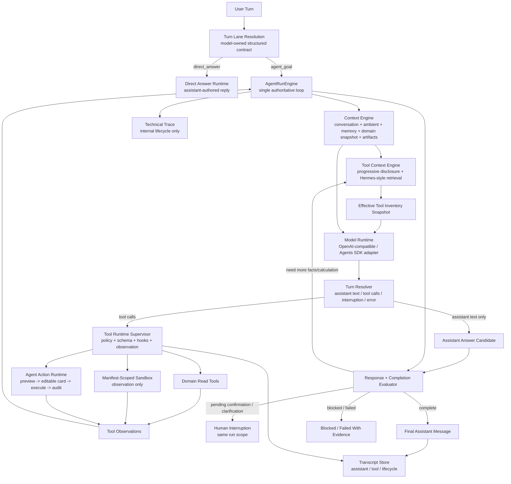

# ADR 0023: OpenClaw-Style Converged Single-Loop Harness

Status: Accepted - Phase 1 implemented

Date: 2026-06-02

Refines: ADR 0016 Manifest-Scoped Sandbox Tool, ADR 0018 AgentRunEngine v2 Single-Loop Harness Upgrade, ADR 0020 Progressive Tool Discovery Runtime, ADR 0021 Runtime Channels and Direct Answer Lane, ADR 0022 Semantic Runtime Hardening

## Context

`xox-model` already has the right SaaS Agent OS assets:

- TypeScript API and server-owned agent state;
- `AgentRunEngine` as the intended single run-loop owner;
- progressive tool discovery;
- tenant-scoped memory kernel;
- editable confirmation cards;
- manifest-scoped sandbox contract;
- domain services, audit logs and automation authority;
- direct-answer lane and assistant/tool/lifecycle channel direction.

The recent failures were not caused by a missing feature alone. They exposed a deeper placement problem:

- tool results can be treated as terminal output too early;
- evaluator can pass before the model has produced a sufficient final answer;
- continuation can lose tool authority after receiving observations;
- sandbox execution exists as a contract but not as a real calculation runtime;
- some helper modules still behave like semantic routers through keywords, aliases or prose patterns;
- transcript projection can still rely on display copy instead of canonical event channels.

The product requirement is unchanged:

> xox-model is an Agent OS for a SaaS business platform. The model uses tools through a harness loop, reads can execute automatically, writes must navigate, create editable confirmation cards, and execute only through domain services and audit.

Therefore this ADR does not rebuild the system. It converges the existing architecture into an OpenClaw-style single loop while absorbing Hermes-style tool retrieval and OpenAI Agents JS runner-side boundaries.

## Reference Findings

### OpenClaw

Local reference: `C:\Github\openclaw`.

Evidence:

- `docs/concepts/agent-loop.md` defines the loop as intake -> context assembly -> model inference -> tool execution -> streaming replies -> persistence.
- `src/agents/sessions/agent-session.ts` runs `agent.prompt(...)`, then repeatedly calls `agent.continue()` while post-run handling requires it.
- Runtime streams are separated into `assistant`, `tool` and `lifecycle`.
- `toolResult.content` is model-visible observation data; `toolResult.details` is UI/diagnostic metadata and is stripped before provider replay/compaction.
- `beforeToolCall`, `afterToolCall` and `tool_result_persist` hooks intercept calls/results but do not own the next step.
- Tool search projections are replayed as assistant `toolCall` plus matching `toolResult`, preserving the normal observation loop.
- `code_execution` is a sandboxed computation tool for calculations, tables, statistics and analysis. It is not a local host shell.

Direct implication:

- xox should copy the loop shape and channel discipline.
- xox should not copy OpenClaw's local-host execution or single-user workspace assumptions.

### Hermes Agent

Local reference: `C:\Github\hermes-agent`.

Useful findings:

- Tool discovery and dispatch are centralized instead of scattered through business code.
- Tool search/retrieval keeps the model-facing search surface small and materializes real tools later.
- Context engines and memory providers are plugin-style boundaries, not ad hoc code patched through the loop.
- Execution still routes through one tool dispatcher so approvals, hooks, truncation and result shaping are not bypassed.

Direct implication:

- xox should keep progressive disclosure but add retrieval as a collaborator inside the same `ToolContextEngine`.
- xox should not introduce a universal `tool_call` wrapper that hides real business tools from confirmation/audit.

### OpenAI Agents JS

Local reference: `C:\Github\openai-agents-js`.

Useful findings:

- Runner concepts such as turn resolution, tool execution, guardrails, tracing, handoffs and interruptions are runner-side capabilities.
- Deferred tool loading requires `toolSearchTool()` and `toolChoice: 'auto'`; forced named tool choices are rejected for deferred tools.
- Sandbox agents use workspace/session/manifest/capability boundaries.

Direct implication:

- xox should keep provider adapters thin and map SDK events into project-native runtime events.
- OpenAI Agents SDK can be used for model/runtime surfaces, but xox domain writes remain outside SDK tool callbacks.
- Native Responses `tool_search` can be a future transport optimization, not the project architecture itself.

## Decision

Adopt a converged single-loop harness:

```text
AgentRunEngine owns the loop.
All other modules provide context, candidate tools, execution results, interruptions or evaluation findings.
No other module decides that the run is complete.
```

This architecture preserves the current assets and changes their placement.



Core rule:

```text
Tool results are observations, not answers.
Final user-facing prose comes from model-authored assistant messages.
```

## Relationship To Existing ADRs

This ADR does not supersede the existing ADRs. It makes their roles explicit.

| ADR | Keep | Move/Reposition | Delete/Forbid | Main-loop phase |
| --- | --- | --- | --- | --- |
| ADR 0016 Manifest-Scoped Sandbox Tool | Manifest, capability, input bundle, observation-only output, no business writes | Sandbox becomes a normal `ToolRuntime` execution target and can be used after domain reads | Fake deterministic backend as proof of correctness for real calculations | Tool execution -> observation -> model continuation |
| ADR 0018 AgentRunEngine v2 | One authoritative run owner, worker lease, evaluator repair, action runtime | `AgentRunEngine` becomes the only place where continue/final/block/fail is decided | Any helper module independently deciding run completion | Whole run |
| ADR 0020 Progressive Tool Discovery | Capability skeleton, effective inventory, schema materialization | Hermes-style retrieval becomes one sub-step inside `ToolContextEngine` | Retrieval hints treated as semantic authority; forced named tool choice for deferred tools | Before each model planning turn |
| ADR 0021 Runtime Channels / Direct Answer | `assistant/tool/lifecycle`, direct answer lane, prompt-cache-stable ambient context | Channel assignment happens at event emission, not transcript projection | Pattern-matching titles/messages to infer event semantics; direct answer keyword fallback | Intake and transcript emission |
| ADR 0022 Semantic Runtime Hardening | Ban keyword/regex business intent routing, model-owned structured contracts | It becomes the implementation guard for this ADR | Case-specific phrase patches and fake-provider prose branches | All phases |

## Module Division

### `AgentRunEngine`

Primary path:

- `apps/api/src/agent/agent-run-engine.ts`

Responsibilities:

- owns the run loop for a claimed run;
- calls context, tool context, model runtime, tool runtime and evaluator in order;
- preserves model-authored preface text before tools;
- feeds observations back into later model turns with tool authority still available;
- stops only on final pass, pending interruption, blocked state or failure.

Non-responsibilities:

- no business write execution;
- no provider-specific payload construction;
- no transcript layout decisions;
- no semantic keyword routing.

### `Turn Lane Resolution`

Primary paths:

- `apps/api/src/agent/turn-intake-resolver.ts`
- `apps/api/src/agent/direct-answer-runtime.ts`

Responsibilities:

- resolve `direct_answer` versus `agent_goal` through a model-owned structured contract;
- deterministically force `agent_goal` only when a pending confirmation or clarification must be resumed;
- keep ambient facts such as current local date/time out of the cacheable static prompt.

Deletion rule:

- no production fallback that answers ordinary chat/date/identity questions by keyword matching.

### `Context Engine`

Primary paths:

- `apps/api/src/agent/context-engine/`
- existing `context-pack` facade during migration only.

Responsibilities:

- bounded conversation window;
- prompt-cache-stable static prompt plus volatile ambient tail;
- run-scoped memory recall reuse;
- domain snapshot summaries when needed;
- uploaded artifact summaries;
- evaluator repair findings as structured harness input.

### `Tool Context Engine`

Primary paths:

- `apps/api/src/agent/tool-context-engine/`
- `apps/api/src/agent/tool-gateway.ts` during migration.

Responsibilities:

- assemble effective inventory snapshot;
- apply tenant, workspace, automation and lock policy;
- apply progressive capability disclosure;
- retrieve thin Hermes-style tool documents;
- materialize only selected real provider schemas.

Non-responsibilities:

- no goal completion judgment;
- no semantic obligations inferred from raw prose;
- no business write execution.

### `Tool Runtime Supervisor`

Primary paths:

- `apps/api/src/agent/tool-runtime/`
- `apps/api/src/agent/runtime-intent-handlers.ts`
- `apps/api/src/agent/sandbox-service.ts`
- `apps/api/src/agent/agent-action-runtime.ts`

Responsibilities:

- validate provider-native tool calls;
- enforce schema, policy, automation authority and risk;
- execute read tools, sandbox tools and action-preview tools;
- create observations;
- preserve tool call id/result id pairing;
- emit `tool` channel events.

### `Response + Completion Evaluator`

Primary paths:

- `apps/api/src/agent/completion-evaluator.ts`
- future `apps/api/src/agent/response-evaluator.ts` if split is needed.

Responsibilities:

- check graph/action/policy/audit requirements;
- check answer sufficiency after final assistant text is produced;
- require additional facts or sandbox calculation when the answer confuses global metrics with entity-specific metrics;
- produce structured repair findings.

Non-responsibilities:

- no natural-language keyword intent classification.

### `Transcript and Trace`

Primary paths:

- `apps/api/src/agent/runtime-trace-events.ts`
- `apps/api/src/agent/agent-transcript-projector.ts`
- `apps/web/src/components/agent/AgentChatTimeline.tsx`

Responsibilities:

- project `assistant` and `tool` channel events into user transcript;
- keep `lifecycle` in technical log unless it is an actionable interruption or visible failure;
- never infer semantics from title/message copy.

## Dependency Direction

```text
routes / worker
  -> AgentRunEngine
    -> Turn Lane Resolution
    -> Context Engine
      -> Memory Provider
      -> Domain read projections
    -> Tool Context Engine
      -> Tool Manifest Store
      -> Tool Search Index
      -> Policy Scope Filter
    -> Model Runtime Adapter
    -> Tool Runtime Supervisor
      -> Domain Read Tools
      -> Manifest-Scoped Sandbox
      -> Agent Action Runtime
        -> Domain Services
        -> Audit
    -> Response + Completion Evaluator
    -> Transcript / Trace sinks
```

Forbidden direction:

```text
Tool Context Engine -> domain write
Memory Provider -> next-step decision
Transcript Projector -> semantic classification
Sandbox -> domain service / DB / memory write
Provider Adapter -> direct business execution
Evaluator -> raw-prose keyword routing
```

## Reuse And Interface Plan

### Reuse From Current xox-model

Keep:

- server-owned `agent_threads`, `agent_runs`, `agent_messages`, `agent_action_requests`;
- `AgentRunEngine` as the loop entrypoint;
- current tool catalog and confirmation-card domain execution;
- SaaS-scoped memory DB and memory management UI;
- provider settings and OpenAI-compatible DeepSeek testing;
- action graph and audit log boundaries.

Refactor only where responsibilities cross the new boundaries.

### Reuse From OpenClaw

Adopt conceptually:

- session/run lane as the serialized authority;
- `assistant/tool/lifecycle` runtime channel separation;
- `toolResult.content` versus `toolResult.details`;
- tool result guard and pairing discipline;
- hook surfaces: before tool call, after tool call, tool result persistence;
- code execution as sandboxed observation, not host execution.

Do not copy:

- host shell assumptions;
- local filesystem memory as primary SaaS storage;
- single-user workspace assumptions.

### Reuse From Hermes

Adopt conceptually:

- thin retrieval documents for tools;
- catalog rebuilt from live tool definitions;
- one dispatcher path for real tools;
- memory provider interface;
- context engine separation.

Do not copy:

- generic product-facing `tool_call` that hides real xox tools;
- local process trust assumptions.

### Reuse From OpenAI Agents JS

Adopt conceptually:

- typed turn resolution;
- runner-side guardrails/tracing/interruption;
- deferred tool loading behavior as a future provider optimization;
- sandbox workspace/session/manifest/capability vocabulary.

Do not allow:

- SDK tool callbacks to execute xox domain writes;
- provider-specific event shapes to leak into contracts/domain;
- forced named `tool_choice` for deferred or provider-incompatible tools.

## Naming And Style Consistency

Use these names consistently:

| Concept | Name |
| --- | --- |
| Authoritative run loop | `AgentRunEngine` |
| Next-step typed decision | `TurnResolver` / `AgentNextStep` |
| Conversation + memory + ambient facts | `ContextEngine` |
| Tool discovery and schema materialization | `ToolContextEngine` |
| Tool execution boundary | `ToolRuntimeSupervisor` |
| Write lifecycle | `AgentActionRuntime` |
| Code execution | `ManifestScopedSandbox` / `sandbox_run_code` |
| Final answer sufficiency | `ResponseEvaluator` |
| User-visible event stream | `assistant` / `tool` |
| Internal event stream | `lifecycle` |

Avoid:

- "Business Runtime";
- "DirectAnswerGate";
- "keyword extractor";
- "fallback planner";
- "tool projector" for semantic routing.

## Expected Behavior For The ROI Failure Case

User:

```text
给我预测一下，如果目前的通胀率是5%，我的投资回报率是多少？
我是第一个股东，我投入的钱都是银行贷款出来的，银行利率是年利率5%
```

Expected loop:

1. `Turn Lane Resolution` selects `agent_goal`, not `direct_answer`.
2. `ToolContextEngine` materializes domain read tools and sandbox tool.
3. Model calls `data_query_workspace` for workspace summary.
4. Model calls `data_query_workspace` or entity read for shareholders.
5. Model calls `sandbox_run_code` with:
   - total profit/cash/forecast horizon;
   - first shareholder investment and dividend ratio;
   - annual loan rate;
   - inflation rate;
   - explicit time basis.
6. Sandbox returns structured calculation observations.
7. Model produces final assistant answer with assumptions and formulas.
8. `ResponseEvaluator` rejects answers that:
   - use global ROI as personal shareholder ROI;
   - ignore loan interest;
   - ignore inflation;
   - fail to state the time basis;
   - produce tool rows without final assistant text.

No server-side keyword patch is allowed for this case.

## Implementation Milestones

### Milestone 1: Observation Loop Placement

Goal:

- tool observations continue through the main `AgentRunEngine` with tool authority still available.

Expected edits:

- `apps/api/src/agent/agent-run-engine.ts`
- `apps/api/src/agent/tool-observation-continuation.ts`
- `apps/api/src/agent/runtime-planning-call.ts`
- relevant tests under `apps/api/tests/`

Validation:

- a read -> read -> sandbox -> final answer fixture passes;
- a tool result alone cannot complete a run.

Phase 1 implementation note:

- `AgentRunEngine` now re-enters the normal model planning loop after domain-read and sandbox observations, with provider-native tools still available.
- `TurnResolver` only asks for observation continuation when the current model turn produced new observations; once those observations have been consumed by a later assistant turn, final assistant text can complete the run.
- Action previews, executed write observations, account-action refusals and clarification observations do not automatically re-enter the full tool inventory after evaluator pass. They are summarized by a model-authored finalizer so the run does not re-apply writes or create duplicate confirmation cards.
- Observation continuation uses standard assistant tool-call plus tool-result replay. It must not inject an extra natural-language user prompt such as "continue the goal" into the message stack.
- `observation_continuation_requested` is emitted as the lifecycle marker for the read/sandbox continuation path.
- Provider failures and tool-call boundary failures are separate. Auth, billing, rate-limit, HTTP, timeout and context-window issues stay in provider classification; a model calling a tool outside the effective inventory or without a registered handler is represented as a tool-call boundary violation, following OpenClaw's runtime guard / transcript repair / loop detection split.

### Milestone 2: Runtime Channels As Source Of Truth

Goal:

- channel is emitted at source, not rediscovered by transcript projection.

Expected edits:

- `apps/api/src/agent/runtime-trace-events.ts`
- `apps/api/src/agent/thread-store.ts`
- `apps/api/src/agent/agent-transcript-projector.ts`
- `apps/web/src/components/agent/AgentChatTimeline.tsx`

Validation:

- lifecycle events stay out of the main transcript;
- assistant/tool rows render from typed channel/kind fields.

### Milestone 3: Tool Context Engine Convergence

Goal:

- Hermes-style retrieval and xox progressive disclosure become one engine.

Expected edits:

- `apps/api/src/agent/tool-context-engine/*`
- `apps/api/src/agent/tool-gateway.ts`
- `apps/api/src/agent/tool-catalog.ts`

Validation:

- materialized tools are minimal and real;
- retrieval hits cannot execute unless schema is materialized;
- no forced named tool choice for providers that reject it.

### Milestone 4: Real Sandbox Backend Boundary

Goal:

- replace fake calculation proof with a real isolated backend implementation while preserving ADR 0016 contract.

Expected edits:

- `apps/api/src/agent/sandbox-service.ts`
- `apps/api/src/agent/sandbox-file-adapters.ts`
- `packages/contracts/src/index.ts`

Validation:

- sandbox cannot access env keys, DB, internal API or domain services;
- sandbox can compute ROI/inflation/loan examples from a manifest bundle;
- returned result is observation-only.

Phase 1 implementation note:

- The contract path is implemented: `requiresSandboxComputation` is a structured model-owned goal fact, the evaluator can require a `sandbox_run_code` observation, and the workspace summary bundle now exposes month-level metrics plus shareholder facts for model-facing calculations.
- The isolated execution backend is intentionally not claimed complete in this phase. The current deterministic backend remains a contract/test backend until ADR 0016's real manifest-scoped sandbox backend is installed and independently verified.

### Milestone 5: Response Sufficiency Evaluator

Goal:

- final answer quality is checked after assistant text is produced.

Expected edits:

- `apps/api/src/agent/completion-evaluator.ts`
- optional `apps/api/src/agent/response-evaluator.ts`
- scripted provider fixtures.

Validation:

- global ROI cannot satisfy personal shareholder ROI;
- missing loan/inflation assumptions cause repair;
- final answer must be model-authored.

Phase 1 implementation note:

- The evaluator no longer treats progressive tool-discovery capability exposure as a mandatory execution requirement.
- Mandatory sandbox use is driven only by structured `goalFacts.requiresSandboxComputation`, not by raw-prose keyword routing or selected tool inventory side effects. Evaluator findings should name the concrete runtime boundary, such as `runtime.sandbox.observation_missing`, rather than treating every check as a capability-router artifact.

### Milestone 6: Semantic Hardening Cleanup

Goal:

- remove remaining production keyword/regex business semantic routing.

Expected edits:

- paths listed in ADR 0022 risk register.

Validation:

- multilingual fixtures pass through provider-native structured contracts;
- deterministic regex remains only for allowed security/protocol/file/UI scopes.

## Acceptance Criteria

- `AgentRunEngine` is the only module that can transition a run to complete/blocked/failed.
- Tool results are persisted and replayed as observations, never as assistant answers.
- After a domain-read or sandbox tool observation, the model can still call additional tools when the evaluator or model requires more facts.
- After an action-preview or executed-write observation, the run must not automatically expose the full write inventory again after evaluator pass; the model-authored final response should summarize the interruption or executed change from the action observation.
- `assistant/tool/lifecycle` are canonical runtime channels at event emission time.
- Direct answers are model-authored, with no production keyword fallback.
- Tool retrieval produces candidate context only; provider-native tool calls remain the execution intent.
- `sandbox_run_code` is observation-only and evaluator-addressable; real isolated calculation backend completion is tracked by ADR 0016.
- The ROI + inflation + first shareholder + loan task completes through read tools + sandbox + final assistant explanation.
- No new server-side prose keyword tables are added for business semantics.
- Provider error taxonomy must not include tool inventory or handler violations. Those belong to the tool-call boundary and should be handled by runtime guardrails and user-visible failed tool/status rows.

## Validation Plan

Commands after implementation:

```powershell
npm.cmd run test:api
npm.cmd run test:web
npm.cmd run build:web
npm.cmd run test
```

Real-provider smoke after implementation:

- direct answer: `今天是几月几号`;
- read: `我们几个月才能回本`;
- complex computation: first shareholder ROI with inflation and loan interest;
- multi-step mixed goal: read payback, create ledger confirmation, update shareholder investment;
- complex planning: 50-member operating model with editable confirmation card.

## Documentation Impact

This ADR is the implementation source of truth for the next harness convergence cycle.

Future code changes must update:

- this ADR if the convergence model changes;
- ADR 0016 when sandbox backend contracts change;
- ADR 0020 when tool retrieval/materialization changes;
- ADR 0021 when runtime channel/direct-answer behavior changes;
- `.agent/lessons.md` when a new root-cause harness failure is fixed.

## Non-Goals

- Do not replace xox confirmation cards with OpenClaw approvals.
- Do not replace SaaS memory DB with local Markdown memory files.
- Do not expose arbitrary host shell execution.
- Do not turn OpenAI Agents SDK into the owner of xox domain writes.
- Do not add another planner/runtime adapter beside `AgentRunEngine`.
