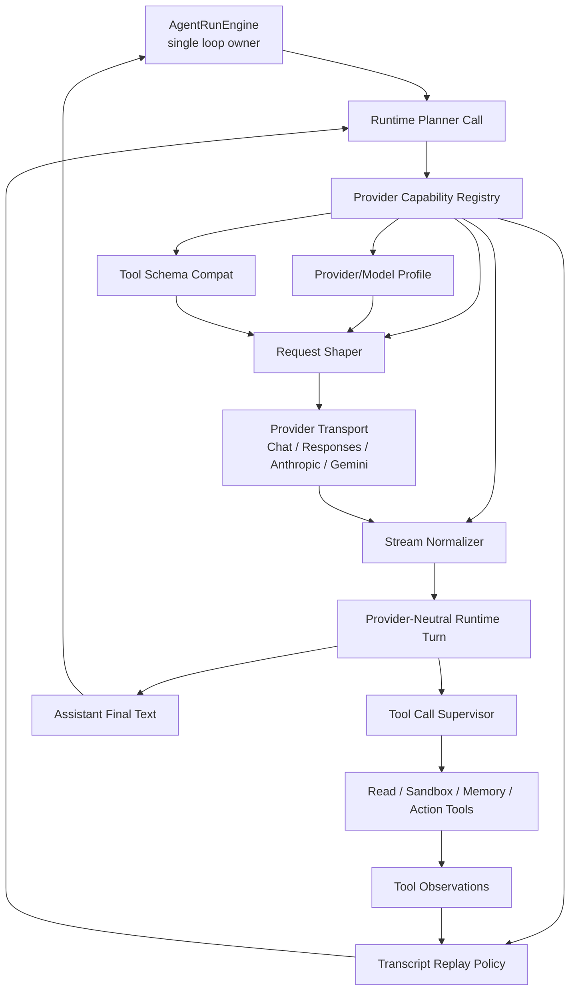

# ADR 0024: OpenClaw-First Provider Runtime Capability Layer

Status: Proposed

Date: 2026-06-02

Refines: ADR 0005 OpenClaw-Inspired Provider Runtime, ADR 0017 Tool Runtime Maturity Upgrade, ADR 0020 Progressive Tool Discovery Runtime, ADR 0023 OpenClaw-Style Converged Single-Loop Harness

## Context

The `219f7a3f` run exposed a provider-runtime defect, not a DeepSeek-only defect.

The run failed after a read tool produced valid data because the next provider call replayed an assistant/tool transcript that was not valid for DeepSeek V4 thinking mode. The provider returned:

```text
The reasoning_content in the thinking mode must be passed back to the API.
```

The wrong fix would be:

```text
Disable DeepSeek V4 thinking by default.
```

That is not what OpenClaw does. OpenClaw treats thinking and transcript replay as provider-owned protocol capabilities. DeepSeek V4 is only one example. Future `xox-model` providers such as MiniMax, Qwen, Doubao, GLM/ZAI, Kimi/Moonshot, Gemini, GPT and Claude all have similar transport-specific rules:

- DeepSeek V4 needs `thinking`, `reasoning_effort` and replay-safe `reasoning_content`.
- Claude needs native reasoning output, signed thinking preservation and Anthropic turn rules.
- Gemini needs `thinkingConfig`, thought signatures and Google turn-order sanitation.
- Kimi/Moonshot may need native tool call IDs preserved and reasoning history retained.
- Qwen may need `enable_thinking` or `chat_template_kwargs.enable_thinking`.
- GLM/ZAI may need preserve/clear thinking request patches.
- Doubao/Volcengine may need tool schema and catalog compatibility.
- OpenAI/GPT may use Responses or Chat Completions reasoning controls.

The provider runtime must therefore become a general capability layer. The `AgentRunEngine` remains the single loop owner; provider runtime only converts requests, stream deltas, replay transcripts and schemas between `xox-model` internal contracts and each provider family.

## Reference Findings

Local OpenClaw reference: `C:\Github\openclaw`.

### Provider-Owned Hooks

OpenClaw provider extensions expose narrow hooks instead of letting core code know every provider field:

- `buildReplayPolicy`
- `sanitizeReplayHistory`
- `validateReplayTurns`
- `normalizeToolSchemas`
- `wrapStreamFn`
- `resolveThinkingProfile`
- `resolveReasoningOutputMode`

Relevant local source:

- `C:\Github\openclaw\src\plugins\types.ts`
- `C:\Github\openclaw\src\plugins\provider-thinking.types.ts`
- `C:\Github\openclaw\src\plugins\provider-thinking.ts`
- `C:\Github\openclaw\src\plugin-sdk\provider-model-shared.ts`
- `C:\Github\openclaw\src\plugin-sdk\provider-stream-shared.ts`

### Provider Family Reuse

OpenClaw has reusable provider-family helpers, then provider extensions opt into them:

- Google uses `google-gemini` replay hooks, Gemini schema normalization and Google thinking stream wrappers.
- Anthropic uses native Anthropic replay policy, signed thinking preservation and stream wrappers.
- Moonshot/Kimi uses OpenAI-compatible replay with provider-specific changes such as preserving tool call IDs and reasoning history.
- MiniMax uses a hybrid Anthropic/OpenAI replay family plus fast-mode stream hooks.
- Qwen uses provider stream wrappers to map thinking into Qwen payload fields.
- ZAI/GLM uses OpenAI-compatible replay plus payload patch wrappers for thinking preservation or disabling.

Relevant local source:

- `C:\Github\openclaw\extensions\deepseek\thinking.ts`
- `C:\Github\openclaw\extensions\deepseek\stream.ts`
- `C:\Github\openclaw\extensions\deepseek\index.test.ts`
- `C:\Github\openclaw\extensions\google\provider-hooks.ts`
- `C:\Github\openclaw\extensions\google\index.test.ts`
- `C:\Github\openclaw\extensions\anthropic\register.runtime.ts`
- `C:\Github\openclaw\extensions\anthropic\index.test.ts`
- `C:\Github\openclaw\extensions\moonshot\index.ts`
- `C:\Github\openclaw\extensions\qwen\stream.ts`
- `C:\Github\openclaw\extensions\minimax\provider-registration.ts`
- `C:\Github\openclaw\extensions\zai\index.ts`

### Reuse Boundary

OpenClaw is MIT licensed. `xox-model` should prioritize porting or adapting small pure modules and tests, but must not import OpenClaw's local-agent control plane.

Allowed reuse:

- provider thinking profile types;
- replay policy vocabulary;
- payload patch stream-wrapper pattern;
- provider-family hook composition pattern;
- focused fixture tests for DeepSeek, Gemini, Anthropic, Kimi/Moonshot and Qwen behavior.

Rejected reuse:

- OpenClaw plugin registry as a runtime dependency;
- OpenClaw gateway/session store/control plane;
- OpenClaw filesystem auth profile store;
- OpenClaw local host execution or approvals;
- OpenClaw channel/product UI.

## Decision

Introduce an **OpenClaw-first Provider Runtime Capability Layer**.

This layer answers:

```text
For the selected provider/model/API family, how should xox shape requests,
normalize tool schemas, stream provider output, replay prior turns, and preserve
or drop reasoning/thinking artifacts?
```

It does not answer:

```text
What should the agent do next?
```

That remains owned by `AgentRunEngine`.

## Core Invariants

1. `AgentRunEngine` owns the single loop.
2. `Tool Context Engine` owns which tools are visible.
3. `Provider Runtime Capability Layer` owns provider protocol conversion.
4. `ToolRuntime` owns provider tool-call supervision.
5. `AgentActionRuntime` owns confirmation cards, writes, audit and domain execution.
6. `CompletionEvaluator` owns completion judgment.
7. No provider capability may execute business writes or decide the next step.
8. No business planner code may know provider private fields such as `reasoning_content`, `thinkingConfig`, `thinkingSignature`, `enable_thinking` or Anthropic signatures.

## Architecture



The capability layer is below the loop. It can transform, validate or fail provider payloads, but it cannot continue, finish, repair, approve or execute goals by itself.

## Public Internal Contracts

### Provider Runtime Capability

```ts
export type ProviderRuntimeCapability = {
  provider: string;
  family: ProviderRuntimeFamily;
  aliases?: string[];

  resolveThinkingProfile?: (ctx: ProviderCapabilityContext) => ProviderThinkingProfile | undefined;
  resolveReasoningOutputMode?: (ctx: ProviderCapabilityContext) => ProviderReasoningOutputMode;

  shapeRequest?: (ctx: ProviderRequestShapeContext) => ProviderRequestPatch;
  normalizeToolSchemas?: (ctx: ProviderToolSchemaContext) => ChatTool[];

  normalizeStreamEvent?: (ctx: ProviderStreamEventContext) => ProviderNeutralStreamEvent[];
  buildReplayPolicy?: (ctx: ProviderReplayPolicyContext) => ProviderReplayPolicy;
  sanitizeReplayMessages?: (ctx: ProviderReplayMessageContext) => RuntimeChatMessage[];
  validateReplayMessages?: (ctx: ProviderReplayMessageContext) => ProviderReplayValidation;
};
```

Naming rule:

- Use `ProviderRuntimeCapability`, not `ProviderQuirk`, `DeepSeekRuntime`, `BusinessProviderRuntime` or provider-specific runtime names.
- Use `family` for shared behavior and `provider` for vendor identity.
- Keep provider-specific field names inside provider capability modules only.

### Thinking Profile

```ts
export type ProviderThinkingLevelId =
  | 'off'
  | 'minimal'
  | 'low'
  | 'medium'
  | 'high'
  | 'xhigh'
  | 'adaptive'
  | 'max';

export type ProviderThinkingProfile = {
  levels: Array<{
    id: ProviderThinkingLevelId;
    label?: string;
    rank?: number;
  }>;
  defaultLevel?: ProviderThinkingLevelId | null;
  preserveWhenCatalogReasoningFalse?: boolean;
};
```

Rules:

- `disableThinking` is not a first-class runtime option.
- The first-class input is `thinkingLevel`.
- `thinkingLevel: 'off'` is the only generic way to request disabled thinking.
- Provider capability decides how `off`, `high`, `adaptive` or `max` maps to request payload.

### Replay Policy

```ts
export type ProviderReplayPolicy = {
  sanitizeMode?: 'full' | 'images-only';

  sanitizeToolCallIds?: boolean;
  toolCallIdMode?: 'strict' | 'strict9' | 'preserve-native';
  preserveNativeAnthropicToolUseIds?: boolean;

  preserveReasoningContent?: boolean;
  backfillAssistantReasoningContent?: boolean;
  dropReasoningFromHistory?: boolean;

  preserveSignatures?: boolean;
  sanitizeThoughtSignatures?: {
    allowBase64Only?: boolean;
    includeCamelCase?: boolean;
  };
  dropThinkingBlocks?: boolean;

  repairToolUseResultPairing?: boolean;
  applyAssistantFirstOrderingFix?: boolean;
  validateGeminiTurns?: boolean;
  validateAnthropicTurns?: boolean;
  allowSyntheticToolResults?: boolean;
};
```

Rules:

- Provider replay policy is the only place that decides whether reasoning/thinking artifacts are preserved, backfilled or dropped.
- Core runtime cannot globally drop reasoning history.
- Core runtime cannot globally backfill provider fields.
- If a transcript cannot be faithfully replayed as provider-native tool history, it must be converted by the provider capability into an explicit observation bundle or fail closed.

### Provider Runtime Artifact

Runtime messages need a provider-private artifact slot:

```ts
export type ProviderRuntimeArtifact = {
  provider: string;
  model: string;
  family: ProviderRuntimeFamily;
  thinkingLevel?: ProviderThinkingLevelId | null;
  reasoningContent?: string | null;
  thinkingSignature?: string | null;
  thoughtSignature?: string | null;
  raw?: Record<string, unknown>;
};
```

Rules:

- Artifacts are not shown in the main transcript.
- Artifacts may be redacted/truncated before persistence.
- Artifacts are used only by provider replay, debugging and tests.
- User-facing assistant text still comes from assistant text events, not tool observations.

## Provider Family Matrix

| Provider family | Example providers | Main capability |
|---|---|---|
| `openai-compatible` | vLLM, generic OpenAI-compatible | Tool-choice policy, tool-call IDs, schema strictness, optional reasoning fields |
| `openai-responses` | OpenAI GPT/Responses | Responses-native reasoning, tool result format, tracing-ready artifacts |
| `deepseek` | DeepSeek V4 | Thinking profile, `reasoning_content` replay, `reasoning_effort`, tool_choice compatibility |
| `anthropic` | Claude, Anthropic-compatible | Signed thinking, native reasoning mode, trailing assistant prefill rules, Anthropic validation |
| `google-gemini` | Gemini | `thinkingConfig`, thought signatures, turn ordering, Gemini schema cleanup |
| `moonshot` | Kimi/Moonshot | Preserve native tool call IDs, retain reasoning history, Kimi thinking stream hooks |
| `qwen` | Qwen/DashScope | `enable_thinking` or chat-template thinking, Qwen OAuth payload normalization |
| `zai` | GLM/ZAI | Thinking preserve/clear payload patch, OpenAI-compatible replay |
| `doubao` | Doubao/Volcengine | Tool schema/model catalog compatibility |
| `hybrid-anthropic-openai` | MiniMax | Anthropic/OpenAI replay bridge, native reasoning output, fast mode |

## Module Plan

| Module | Target path | Responsibility | Reuse stance |
|---|---|---|---|
| Provider capability contract | `apps/api/src/agent/runtime/provider-capability.ts` | Defines capability hook types and provider-neutral artifacts. | Adapt OpenClaw type vocabulary with attribution if code is copied. |
| Provider capability registry | `apps/api/src/agent/runtime/provider-capability-registry.ts` | Resolves provider/model to built-in capability and family helpers. | Implement locally; no OpenClaw plugin registry dependency. |
| Provider family helpers | `apps/api/src/agent/runtime/provider-families/*` | Shared OpenAI-compatible, Anthropic, Gemini, DeepSeek, Qwen, Moonshot, ZAI helpers. | Port/adapt small pure OpenClaw helper patterns. |
| Request shaper | `apps/api/src/agent/runtime/provider-request-shaper.ts` | Apply model profile, thinking level, tool choice and provider patches. | Replace `disableThinking` with `thinkingLevel` and hook-based shaping. |
| Payload sanitizer | `apps/api/src/agent/runtime/provider-payload-sanitizer.ts` | Generic sanitation plus provider policy application. | Stop dropping provider artifacts by default. |
| Stream adapter | `apps/api/src/agent/runtime/openai-compatible-chat-adapter.ts` and future adapters | Capture text, reasoning, tool calls and final provider assistant turn. | Add provider-neutral stream events and replay artifacts. |
| Replay codec | `apps/api/src/agent/runtime/provider-transcript-replay.ts` | Build provider-safe continuation messages from runtime turns and observations. | Port/adapt OpenClaw replay policy and pairing ideas. |
| Tool schema compat | `apps/api/src/agent/runtime/provider-tool-schema.ts` | Provider/family schema normalization. | Keep current module, move provider-specific rules into family helpers. |
| Tests | `apps/api/tests/provider-runtime-capability.test.ts` and focused runtime tests | Verify family behavior and replay invariants. | Port/adapt OpenClaw fixtures for DeepSeek, Gemini, Anthropic, Moonshot/Kimi, Qwen. |

## Dependency Direction

```text
AgentRunEngine
  -> Runtime Planner Call
    -> Provider Capability Registry
      -> Provider Family Helpers
      -> Request Shaper
      -> Stream Normalizer
      -> Transcript Replay Codec
      -> Tool Schema Compat
    -> Runtime Adapter
  -> ToolRuntime / AgentActionRuntime / CompletionEvaluator
```

Provider capability modules may depend on runtime contracts and pure helper utilities.

Provider capability modules must not depend on:

- domain services;
- confirmation cards;
- action graph store;
- memory store;
- React/UI;
- OpenClaw runtime packages.

## Interaction With Existing ADRs

### ADR 0005

ADR 0005 introduced provider profiles. This ADR upgrades that idea from static profile rows to provider-owned capabilities. Static profiles may remain as compatibility data, but runtime behavior should move to capability hooks.

### ADR 0017

ADR 0017 asked for provider payload sanitation and maturity. This ADR gives it a concrete OpenClaw-first implementation boundary.

### ADR 0020

ADR 0020 controls which tool schemas are exposed. This ADR controls how those schemas are normalized for the selected provider. Tool discovery remains above provider capability.

### ADR 0023

ADR 0023 converges the harness to one OpenClaw-style loop. This ADR keeps provider runtime as a collaborator inside that loop, not a second loop.

## Implementation Plan

### Phase 0: Fixtures And Baseline Audit

- Add provider-runtime fixtures for:
  - DeepSeek V4 thinking replay;
  - Anthropic signed thinking replay;
  - Gemini thought signature sanitation;
  - Moonshot/Kimi native tool call IDs;
  - Qwen thinking payload mapping;
  - generic OpenAI-compatible no-reasoning replay.
- Add an audit test that fails if `disableThinking: true` is used as a blanket runtime fix in planning/finalization paths.
- Keep provider probe low-cost, but make probe behavior explicit and separate from normal agent planning.

### Phase 1: Provider Capability Contract

- Add `provider-capability.ts`.
- Add provider family registry with local built-in providers.
- Map existing provider profiles to capability families.
- Keep current API settings shape; do not require frontend provider config changes in this phase.

### Phase 2: Request Shaping Upgrade

- Replace `disableThinking` plumbing with `thinkingLevel`.
- Keep a temporary adapter that maps legacy `disableThinking: true` to `thinkingLevel: 'off'` only in probe or explicitly low-cost paths.
- Remove blanket `disableThinking: true` from normal direct answer and observation continuation once provider replay supports artifacts.

### Phase 3: Runtime Artifacts And Stream Normalization

- Extend runtime results with provider assistant turn artifacts.
- Capture provider reasoning/thinking deltas when the provider emits them.
- Persist redacted/truncated artifacts where needed for same-run and cross-turn replay.
- Do not show raw reasoning artifacts in user transcript unless a future explicit UX policy allows summarized thinking.

### Phase 4: Provider Transcript Replay

- Replace ad hoc assistant/tool synthesis in planning and observation continuation with `provider-transcript-replay.ts`.
- For model-originated tool calls, replay the actual assistant tool-call turn plus matching tool observations.
- For non-provider synthetic observations, use provider policy to decide whether synthetic tool results are allowed. If not, use an explicit observation bundle or fail closed.
- Preserve tool-call pairing and provider-specific replay metadata.

### Phase 5: Provider Family Ports

Port or adapt small OpenClaw-style helpers with attribution:

- DeepSeek family:
  - thinking profile;
  - request patch for enabled/off thinking;
  - assistant `reasoning_content` preservation/backfill.
- Anthropic family:
  - replay policy vocabulary;
  - signed thinking preservation flags;
  - trailing assistant prefill handling if Anthropic adapter is enabled.
- Gemini family:
  - thought signature sanitation;
  - assistant-first ordering fix;
  - thinkingConfig mapping.
- Moonshot/Kimi family:
  - native tool call ID preservation;
  - no reasoning-history drop for thinking models.
- Qwen family:
  - `enable_thinking` and chat-template mapping.
- ZAI/GLM and MiniMax:
  - payload patch and hybrid family hooks.

### Phase 6: End-To-End Validation

- Re-run the `219f7a3f` style scenario:
  - model reads workspace ROI and shareholder facts;
  - model uses sandbox for inflation/loan-interest adjusted calculation when appropriate;
  - tool observations are replayed safely;
  - model produces a final assistant answer;
  - evaluator does not pass before final answer.
- Run real-provider smoke for at least:
  - DeepSeek V4;
  - one non-thinking OpenAI-compatible model;
  - one Qwen/Moonshot-compatible provider if key is available.

## Acceptance Criteria

- No normal agent planning or observation continuation path uses blanket `disableThinking: true`.
- DeepSeek V4 thinking replay preserves or backfills `reasoning_content` and no longer returns the 400 error from `219f7a3f`.
- Provider capability tests cover DeepSeek, Anthropic, Gemini, Moonshot/Kimi, Qwen and generic OpenAI-compatible behavior.
- Tool results remain observations and are never rendered or persisted as assistant final answers.
- Provider-specific payload keys appear only inside provider family modules or provider artifacts, not in planner, tool gateway, action runtime or domain services.
- Provider replay can choose one of three explicit outcomes:
  - faithful provider-native replay;
  - provider-approved synthetic observation replay;
  - fail closed with a provider replay validation error.
- `AgentRunEngine` still owns the single loop and no provider capability can decide completion or next action.
- Any substantial OpenClaw-derived code carries MIT attribution in the copied module and tests.

## Rejected Alternatives

### DeepSeek-Specific Runtime

Rejected. It fixes the symptom but leaves the architecture unable to support Claude, Gemini, Qwen, Kimi, MiniMax, GLM and future GPT models.

### Globally Disable Thinking

Rejected. It loses model capability, diverges from OpenClaw's practice and hides invalid replay transcripts instead of repairing them.

### One Huge Provider Sanitizer

Rejected. Putting every provider field in `provider-payload-sanitizer.ts` recreates the same brittle central table problem the project has been removing from intent routing.

### Import OpenClaw Runtime Directly

Rejected. OpenClaw is local-agent infrastructure. Its provider design is mature, but its plugin registry, gateway, filesystem auth and session ownership are not SaaS-compatible.

### Let Business Tools Handle Provider Quirks

Rejected. Domain tools should not know provider payload fields. They receive validated tool arguments and return observations.

## Risks

- Provider capability drift can happen if copied OpenClaw helper behavior is not periodically compared with upstream.
- Some providers expose thinking through undocumented or changing payload fields. Capability tests and provider probes must fail clearly.
- Persisting provider artifacts creates privacy and storage risks. Artifacts must be redacted, truncated and scoped by tenant/thread/run.
- Over-porting OpenClaw can import local-agent assumptions. Keep reuse pure, attributed and below the SaaS harness boundary.

## Documentation And Lessons

Implementation must update:

- `docs/adr/0005-openclaw-inspired-provider-runtime.md` with a pointer to this ADR as the newer target.
- `docs/operations.md` provider configuration guidance if `thinkingLevel` becomes user-configurable.
- `.agent/lessons.md` when the implementation removes blanket thinking disablement and provider-specific replay fixes.

## References

- OpenClaw provider hooks: `C:\Github\openclaw\src\plugins\types.ts`
- OpenClaw thinking profile types: `C:\Github\openclaw\src\plugins\provider-thinking.types.ts`
- OpenClaw provider thinking resolver: `C:\Github\openclaw\src\plugins\provider-thinking.ts`
- OpenClaw provider family helpers: `C:\Github\openclaw\src\plugin-sdk\provider-model-shared.ts`
- OpenClaw stream/payload wrappers: `C:\Github\openclaw\src\plugin-sdk\provider-stream-shared.ts`
- OpenClaw DeepSeek provider: `C:\Github\openclaw\extensions\deepseek`
- OpenClaw Google/Gemini provider: `C:\Github\openclaw\extensions\google`
- OpenClaw Anthropic provider: `C:\Github\openclaw\extensions\anthropic`
- OpenClaw Moonshot/Kimi provider: `C:\Github\openclaw\extensions\moonshot`
- OpenClaw Qwen provider: `C:\Github\openclaw\extensions\qwen`
- OpenClaw MiniMax provider: `C:\Github\openclaw\extensions\minimax`
- OpenClaw ZAI/GLM provider: `C:\Github\openclaw\extensions\zai`
