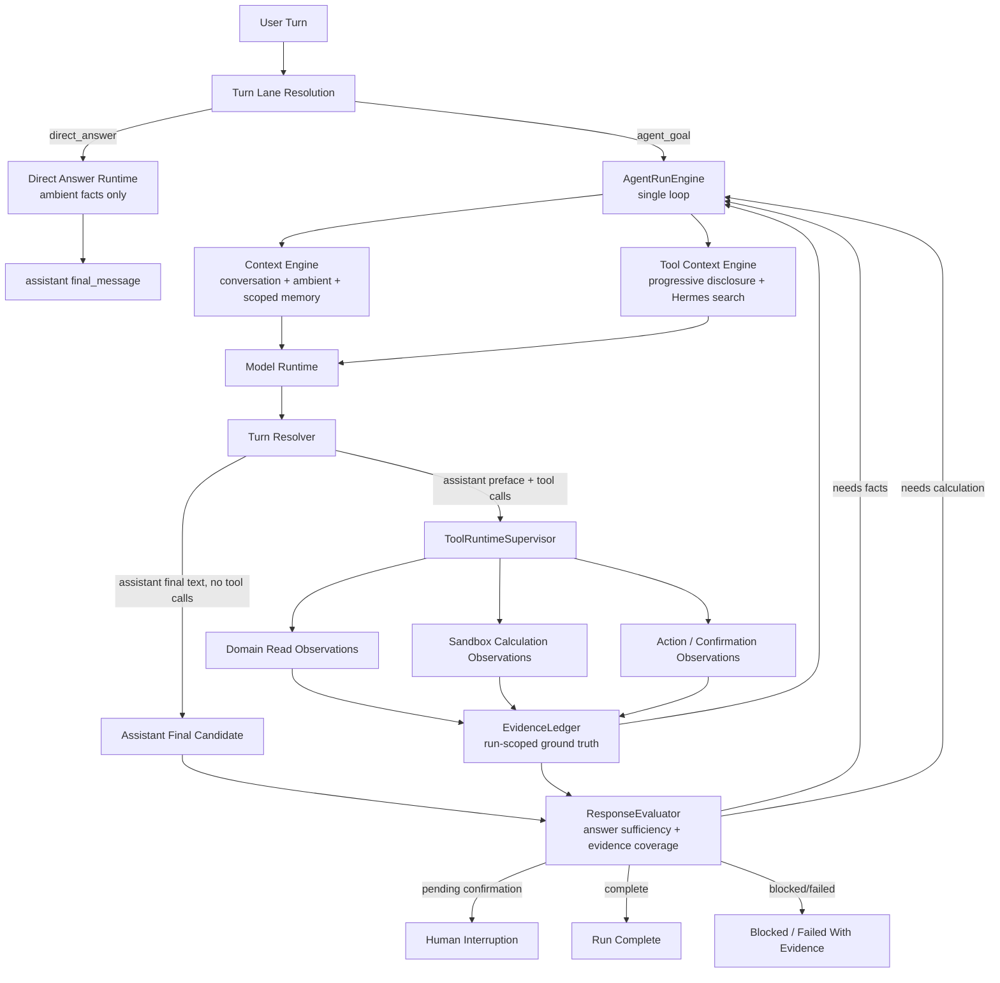

# ADR 0025: OpenClaw-Style Evidence-First Response Loop

Status: Accepted

Date: 2026-06-02

Refines: ADR 0016 Manifest-Scoped Sandbox Tool, ADR 0018 AgentRunEngine v2 Single-Loop Harness, ADR 0020 Progressive Tool Discovery Runtime, ADR 0021 Runtime Channels and Direct Answer Lane, ADR 0023 OpenClaw-Style Converged Single-Loop Harness, ADR 0024 OpenClaw-First Provider Runtime Capability Layer

## Context

Recent real runs exposed a remaining harness weakness after the provider-runtime and semantic-hardening upgrades.

The system is now better than before:

- `e0c8513d` (`今天是星期几？`) correctly used the `direct_answer` lane, model-authored the answer, and avoided Goal Contract, memory recall, tool catalog and evaluator.
- `6ddfcba9` (inflation + first shareholder + bank loan ROI) correctly entered `agent_goal`, called read tools, called `sandbox_run_code`, and produced a model-authored Markdown answer.

But the deeper design still has gaps:

1. The evaluator can mark an iteration as `pass` before the loop has produced the final assistant answer.
2. Complex financial answers can be accepted without a formal evidence ledger that proves which read facts and calculation facts grounded the answer.
3. Entity references such as "第一个股东" can still be resolved too casually by the model unless the loop requires ordered entity observations before personal calculations.

These are not keyword-router problems. They are loop-governance problems.

The required fix is not another case-specific rule. The required fix is to adopt the mature OpenClaw pattern more strictly:

```text
assistant preface -> tool calls -> tool observations -> optional sandbox computation
-> assistant final answer -> response sufficiency evaluation -> complete or continue
```

Tool results are evidence. Sandbox results are evidence. Action results are evidence. None of them are final answers.

## Reference Findings

### OpenClaw

Local reference: `C:\Github\openclaw`.

Relevant source and docs:

- `docs/concepts/agent-loop.md`
- `docs/concepts/streaming.md`
- `docs/tools/code-execution.md`
- `docs/tools/tool-search.md`
- `src/agents/embedded-agent-runner/run/incomplete-turn.ts`
- `src/agents/session-tool-result-guard-wrapper.ts`
- `src/agents/embedded-agent-subscribe.handlers.tools.ts`

OpenClaw's useful practices:

- Runtime streams are separated into `assistant`, `tool` and `lifecycle`.
- Tool-use stop reasons make a turn incomplete until matching tool results are returned and a later assistant message is produced.
- Pre-tool assistant text is preliminary progress, not the final answer.
- Tool results are sanitized observations; `tool_result_persist` can transform persisted evidence but does not decide next action.
- Long-running work can stream tool progress while preserving one final assistant payload.
- `code_execution` is an observation tool for calculations, tables and analysis, not local shell execution.
- Tool search/deferred tools still call back into the gateway so normal policy, approvals, hooks and result handling apply.

Direct implication for `xox-model`:

- Treat any provider turn with tool calls as incomplete, regardless of assistant preface text.
- Only final assistant text can satisfy user-answer requirements.
- Add an evidence layer that is visible to evaluator and model continuation, but not another planner.
- Use sandbox for derived calculations when the answer depends on formulas outside existing domain services.

### Hermes Agent

Local reference: `C:\Github\hermes-agent`.

Useful practices:

- Conversation loop is classic: model -> tool calls -> append tool results -> continue -> assistant final.
- Tool search is compact discovery; real tool execution still goes through one dispatcher.
- Context and memory are provider boundaries, not scattered patches.

Direct implication:

- Do not add a separate calculation planner.
- Do not hide real xox tools behind generic product-facing wrappers.
- Put evidence collection and response checking inside the existing `AgentRunEngine` loop.

### OpenAI Agents JS

Local reference: `C:\Github\openai-agents-js`.

Useful practices:

- Runner-side turn resolution separates final output, tool calls, handoffs, interruptions and guardrails.
- Tool execution and guardrails are runner-owned; domain tools should not decide run completion.
- Sandbox concepts are capability-scoped and session/workspace-bound.

Direct implication:

- `AgentRunEngine` should own "continue vs complete".
- `ToolRuntimeSupervisor` returns observations only.
- `ResponseEvaluator` checks final assistant output after it exists.

## Decision

Introduce an **Evidence-First Response Loop** inside the existing `AgentRunEngine`.

This is not a new runtime. It is a stricter state contract for ADR 0023.

```text
AgentRunEngine owns the loop.
ToolRuntimeSupervisor owns tool execution and observations.
EvidenceLedger owns run-scoped ground truth.
ResponseEvaluator owns final-answer sufficiency.
No tool, sandbox, memory, gateway, provider adapter or transcript projector can mark a user goal complete.
```

## Implementation

Implemented on 2026-06-02.

Code paths:

- `apps/api/src/agent/evidence-ledger.ts`
  - Builds a run-scoped `EvidenceLedger` from structured tool observations.
  - Classifies evidence by structured observation type and tool identity, not by parsing user prose.
  - Keeps evidence in the run loop for now; it is not promoted to memory and is not a write audit substitute.
- `apps/api/src/agent/response-evaluator.ts`
  - Evaluates final assistant candidates after tool/action/sandbox observations exist.
  - Rejects missing final assistant text when observations exist.
  - Requires completed sandbox evidence when `goalFacts.requiresSandboxComputation` is present.
  - Requires ordered entity evidence for sandbox-backed shareholder calculations through structured `shareholders` / `firstShareholder` facts.
  - Treats pending confirmation and pending clarification as human interruptions, not completion.
- `apps/api/src/agent/agent-run-engine.ts`
  - Calls `CompletionEvaluator` with `allowComplete: false`; graph/policy/domain checks can move the goal to evaluating/repairing/waiting states, but cannot close the run.
  - Emits `response_evaluated` only after a final assistant candidate exists.
  - Marks a goal `completed` only after `ResponseEvaluator` returns `pass`.
  - Falls back to a tools-disabled final-answer pass when the main loop budget is exhausted after observations.
- `apps/api/src/agent/approval-executor.ts`
  - Applies the same evidence-first final-answer check after confirmed or auto-executed actions.
  - Keeps multi-card pending states open until remaining confirmations are handled.
- `apps/api/src/agent/completion-evaluator.ts`
  - Keeps existing graph, policy and domain checks.
  - Adds `allowComplete` so caller-owned loop phase decides whether a passing graph evaluation may close the goal.

Tests:

- `apps/api/tests/response-evaluator.test.ts`
  - Tool observations cannot replace final assistant answers.
  - Sandbox-required goals require sandbox evidence.
  - Pending confirmation/clarification are interruptions, not completion.
  - Sandbox evidence with ordered shareholder facts can satisfy the final response evaluator.
- `apps/api/tests/api.test.ts`
  - The complex data -> sandbox -> final-answer integration now asserts `response_evaluated: pass`, at least two evidence items, and final goal status `completed`.

## Architecture



Core invariant:

```text
A run can complete only after the latest model turn produced final assistant text
and ResponseEvaluator accepted that text against the EvidenceLedger.
```

## Evidence Ledger

Add a run-scoped `EvidenceLedger`.

It is not memory. It is not transcript. It is not a planner.

It records facts that the model and evaluator can rely on in this run:

```ts
type AgentEvidenceAuthority = 'ambient' | 'domain_read' | 'sandbox' | 'action' | 'memory';

type AgentEvidenceItem = {
  id: string;
  runId: string;
  threadId: string;
  authority: AgentEvidenceAuthority;
  source:
    | 'ambient_context'
    | 'data_query_workspace'
    | 'sandbox_run_code'
    | 'agent_action_runtime'
    | 'memory_recall';
  toolCallId?: string | null;
  observationId?: string | null;
  subject?: {
    type: 'workspace' | 'shareholder' | 'member' | 'ledger_entry' | 'forecast' | 'calculation';
    id?: string | null;
    label?: string | null;
  };
  facts: Record<string, unknown>;
  summary?: string;
  createdAt: string;
};
```

Rules:

- Evidence is scoped by user, workspace, thread and run.
- Evidence is appended by runtime after tool/action/sandbox completion.
- Evidence can be replayed into later model turns as structured context.
- Evidence is used by `ResponseEvaluator`.
- Evidence does not auto-promote into long-term memory.
- Evidence does not replace audit logs for writes.

## Turn Completion State

Replace the loose "iteration pass then maybe continue" behavior with explicit states.

```ts
type AgentLoopState =
  | 'awaiting_model_turn'
  | 'awaiting_tool_observations'
  | 'awaiting_model_final'
  | 'awaiting_user_confirmation'
  | 'evaluating_final_answer'
  | 'completed'
  | 'blocked'
  | 'failed';
```

State rules:

- A provider turn that contains tool calls always enters `awaiting_tool_observations`.
- After observations are recorded, the loop enters `awaiting_model_final` or another model planning turn with tools still available.
- Evaluator cannot mark a run `completed` while the last material event is a tool observation.
- Evaluator cannot mark a run `completed` while final assistant text is missing.
- Assistant preface text before tools remains visible progress but cannot satisfy final-answer criteria.

This copies OpenClaw's incomplete-turn discipline into the SaaS harness.

## Response Evaluator

`CompletionEvaluator` currently checks graph, policy and action status. Keep that.

Add or split a `ResponseEvaluator` for answer sufficiency:

```ts
type ResponseEvaluation = {
  status: 'pass' | 'needs_more_evidence' | 'needs_calculation' | 'needs_final_answer' | 'blocked';
  confidence: number;
  requiredEvidence: Array<{
    authority: AgentEvidenceAuthority;
    subject?: string;
    reason: string;
  }>;
  findings: Array<{
    severity: 'info' | 'warn' | 'fail';
    code: string;
    evidenceIds: string[];
    message: string;
  }>;
  nextPlannerBrief?: string | null;
};
```

ResponseEvaluator checks:

- The final answer exists and is assistant-authored.
- The answer cites or uses evidence for requested current workspace facts.
- Personal shareholder ROI does not reuse global workspace ROI without shareholder facts.
- Loan-interest and inflation questions include time basis and formulas.
- Sandbox results are used when derived calculations exceed existing domain metrics.
- Pending writes/confirmation cards are described as pending or executed according to action evidence.

The evaluator must not infer business intent from raw prose keywords. It evaluates against:

- model-owned goal facts;
- provider-native tool calls;
- structured observations;
- sandbox calculation outputs;
- action graph state;
- final assistant text.

## Entity Grounding

For references such as:

- "第一个股东"
- "成员 A"
- "当前月份"
- "今天"
- "发布版 1"

the loop must require structured grounding before action or personal calculation.

Expected read observation shape:

```ts
type EntityGroundingObservation = {
  scope: 'entity_summary';
  shareholders?: Array<{
    index: number;
    id: string;
    name: string;
    investmentAmount: number;
    dividendRate: number;
  }>;
  members?: Array<{
    index: number;
    id: string;
    name: string;
  }>;
};
```

Rules:

- "第一个股东" resolves from ordered evidence, not from a name guess.
- If the ordered list is unavailable, ask clarification or run the appropriate read tool.
- Sandbox inputs for personal ROI must reference evidence IDs or structured facts from the ledger.
- The model may choose the read tool, but the evaluator must reject answers that skip required entity grounding.

## Calculation And Sandbox

Use sandbox when the requested answer needs derived computation outside the existing domain model.

Examples:

- personal shareholder ROI with dividend share;
- loan interest adjustment;
- inflation-adjusted real ROI;
- scenario tables;
- multi-month sensitivity analysis;
- imported file normalization or calculation;
- reconciliation math.

Sandbox contract:

```ts
type SandboxComputationRequest = {
  purpose: string;
  language: 'python' | 'javascript';
  code: string;
  evidenceInputs: string[];
  expectedOutputs: Array<'json' | 'markdown' | 'table' | 'chart_spec'>;
};
```

Rules:

- Sandbox cannot access DB, env, provider keys, domain services or internal APIs.
- Sandbox receives only explicit evidence bundles and uploaded artifacts allowed by manifest.
- Sandbox output is an observation.
- The final answer is still model-authored after sandbox observation.
- Sandbox use is recommended by model planning or response evaluation, not raw keyword rules.

## Direct Answer Path

Keep ADR 0021 behavior for ambient questions.

`e0c8513d` is the target behavior:

```text
User: 今天是星期几？
Assistant: 今天是 2026年6月2日，星期二。
```

Rules:

- no Goal Contract;
- no memory recall;
- no tool catalog;
- no domain read;
- no CompletionEvaluator;
- model-authored assistant final;
- prompt-cache-stable static prompt plus volatile ambient tail.

Minor cleanup:

- lifecycle copy for direct answers should not say "模型规划和只读回答已完成";
- direct-answer technical log may remain, but main transcript shows only user bubble and assistant Markdown.

## Complex ROI Expected Loop

User:

```text
给我预测一下，如果目前的通胀率是5%，我的投资回报率是多少？
我是第一个股东，我投入的钱都是银行贷款出来的，银行利率是年利率5%
```

Expected loop:

1. `Turn Lane Resolution` selects `agent_goal`.
2. `ToolContextEngine` materializes:
   - `data_query_workspace`
   - `sandbox_run_code`
   - clarification only as fallback
3. Model emits a short assistant preface.
4. Model calls `data_query_workspace` for:
   - workspace forecast summary;
   - ordered shareholder list;
   - first shareholder investment amount and dividend rate.
5. Tool observations are stored in `EvidenceLedger`.
6. Model calls `sandbox_run_code` with evidence IDs and formulas for:
   - shareholder profit share;
   - loan interest;
   - nominal ROI;
   - real ROI adjusted for inflation;
   - time basis.
7. Sandbox observation is stored in `EvidenceLedger`.
8. Model produces a final assistant Markdown answer.
9. `ResponseEvaluator` checks:
   - shareholder facts were grounded;
   - loan and inflation are included;
   - formula/time basis is stated;
   - final answer used sandbox result;
   - no write action was performed.
10. Only then may the run complete.

## Relationship To Existing ADRs

| ADR | Relationship |
| --- | --- |
| ADR 0016 | Sandbox remains manifest-scoped and observation-only. This ADR says when and how complex calculations should enter the loop. |
| ADR 0018 | Keeps `AgentRunEngine` as the single owner. This ADR adds stricter loop states. |
| ADR 0020 | Tool discovery still decides the smallest useful tool context. This ADR adds evidence requirements after tools run. |
| ADR 0021 | Direct answer lane remains the fast path for ambient/simple chat. This ADR keeps it outside evidence-heavy agent goals. |
| ADR 0022 | No raw-prose keyword routing. Evidence requirements come from contracts, observations and evaluator findings. |
| ADR 0023 | This ADR is the detailed response/evidence sub-loop inside the converged single-loop harness. |
| ADR 0024 | Provider replay remains provider-owned. This ADR consumes provider-neutral assistant/tool observations. |

## Module Plan

### New / Refined Modules

```text
apps/api/src/agent/evidence-ledger.ts
apps/api/src/agent/response-evaluator.ts
apps/api/src/agent/evidence-bundle-builder.ts
apps/api/src/agent/loop-state.ts
```

### Existing Modules To Change

- `apps/api/src/agent/agent-run-engine.ts`
  - own explicit loop state;
  - never complete after raw tool observations;
  - call `ResponseEvaluator` only after assistant final candidate.

- `apps/api/src/agent/completion-evaluator.ts`
  - keep graph/action/policy checks;
  - delegate final-answer sufficiency to `ResponseEvaluator` or merge with clear subtypes.

- `apps/api/src/agent/tool-observation-continuation.ts`
  - write observations into `EvidenceLedger`;
  - replay evidence bundles, not vague continuation prose.

- `apps/api/src/agent/data-agent.ts`
  - return structured entity lists for shareholders/members/versions/ledger entries;
  - separate model content from UI preview.

- `apps/api/src/agent/sandbox-service.ts`
  - accept `evidenceInputs`;
  - return structured calculation observation with formulas and outputs.

- `apps/api/src/agent/agent-transcript-projector.ts`
  - render assistant preface and final answer separately;
  - keep evidence details behind tool rows, not as assistant answers.

## Reuse Plan

### From OpenClaw

Adopt:

- incomplete-turn discipline;
- assistant/tool/lifecycle streams;
- tool result guard and result persistence concept;
- sandbox code execution as analysis observation;
- progress preview while tools are running;
- hook surfaces for before/after tool call and result transform.

Do not adopt:

- local host shell as SaaS compute;
- filesystem memory as primary store;
- single-user assumptions.

### From Hermes

Adopt:

- one dispatcher path for real tools;
- compact tool discovery;
- no duplicate runtime adapter;
- context provider boundaries.

Do not adopt:

- product-facing generic `tool_call`;
- local process trust assumptions.

### From OpenAI Agents JS

Adopt:

- typed turn resolution;
- runner-side guardrail/evaluation/interruption shape;
- sandbox/workspace/session/capability vocabulary.

Do not adopt:

- SDK callback-owned domain writes;
- provider-specific event shapes leaking into domain tools.

## Acceptance Criteria

### Direct Answer

- `今天是星期几？` returns a model-authored direct answer.
- The run has no goal, memory recall, tool catalog, domain tools or evaluator.
- Main transcript contains only user bubble and assistant Markdown.

### Evidence-First Agent Goal

- A provider turn with tool calls cannot complete the run before a later final assistant message.
- `CompletionEvaluator` cannot pass a run as complete immediately after read/sandbox observations.
- `ResponseEvaluator` runs after final assistant text exists.
- Tool observations are recorded into `EvidenceLedger`.
- Final answers use model-authored assistant text, not tool result prose.

### Complex ROI Scenario

- The inflation + bank loan + first shareholder ROI prompt:
  - reads workspace forecast summary;
  - reads ordered shareholder facts;
  - uses sandbox for derived ROI math;
  - states formulas and time basis;
  - distinguishes personal shareholder ROI from global workspace ROI;
  - completes only after final assistant text passes response evaluation.

### Entity Grounding

- "第一个股东" is resolved from ordered shareholder evidence.
- "成员 A" and similar aliases are resolved from entity evidence or ask clarification.
- The model cannot satisfy personal/entity-specific requests using only global workspace summary.

### Safety

- Sandbox cannot access DB, env, internal APIs, provider keys or domain services.
- Sandbox output is observation-only.
- Writes still go through confirmation/action/audit.

### Tests

- Add API fixtures for:
  - direct ambient answer;
  - read -> sandbox -> final answer;
  - missing entity grounding -> evaluator repair;
  - tool observation without final answer -> not complete;
  - sandbox result without final answer -> not complete.
- Required commands:
  - `npm.cmd run test:api`
  - `npm.cmd run test:web`
  - `npm.cmd run build:web`
  - `npm.cmd run test`

## Non-Goals

- Do not replace ADR 0020 tool discovery.
- Do not replace ADR 0024 provider capability layer.
- Do not add raw-prose keyword detectors for financial scenarios.
- Do not make sandbox a write path.
- Do not expose arbitrary local code execution.
- Do not create a second evaluator loop outside `AgentRunEngine`.

## Open Questions

- Whether `EvidenceLedger` should be persisted as a new table or reconstructed from existing run events and tool observations.
- Whether `ResponseEvaluator` should be a separate model call, a structured local validator over evidence, or both.
- Whether sandbox should support both Python and JavaScript immediately or start with one runtime behind the ADR 0016 contract.
- How much evidence detail should be visible in the transcript versus technical log.
