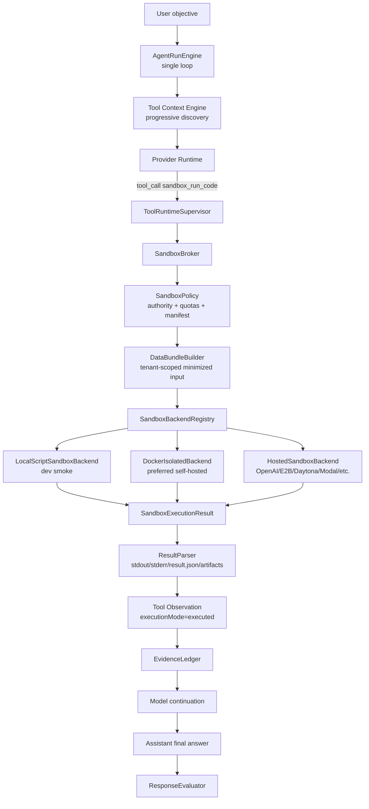

# ADR 0026: Real Manifest-Scoped Sandbox Runtime

> Enforcement amendment: Agentic OS ADR0079 supersedes the historical local
> process and mutable-image backend choices in this ADR. Current execution is
> production-admitted, digest-pinned, and container-isolated in every
> environment, with no alias or fallback.

Status: Superseded for execution enforcement by Agentic OS ADR0079

Date: 2026-06-03

Refines: ADR 0016 Manifest-Scoped Sandbox Tool, ADR 0018 AgentRunEngine v2 Single-Loop Harness, ADR 0020 Progressive Tool Discovery Runtime, ADR 0023 OpenClaw-Style Converged Single-Loop Harness, ADR 0025 OpenClaw-Style Evidence-First Response Loop

Refined by: ADR 0030 OpenClaw/Hermes-Style Sandbox Observation Runtime

## Context

ADR 0016 correctly defined the SaaS boundary for code execution:

- sandbox input must be manifest-scoped;
- sandbox code must not read production databases, provider keys, API process env, user sessions, memory stores or internal APIs;
- sandbox output is an observation for the model, not a business write;
- durable writes still go through Agent actions, editable confirmation cards, domain services and audit.

The missing piece is that the current implementation still uses a deterministic fake backend inside the runtime path. That code proves manifest construction and data minimization, but it does not execute model-authored code. It can return `completed` even when the code would have failed at runtime.

That is no longer acceptable for product validation. For the product capability users expect, `sandbox_run_code` must actually execute code in an isolated runtime. A fake implementation should be deleted from the production runtime. Tests that only verify DTO shape may use fixtures or broker mocks, but those fixtures must not be registered as sandbox backends and must not produce sandbox calculation evidence.

The upgrade must not turn `xox-model` into a local coding agent. This is still a multi-tenant SaaS product. The correct target is:

```text
model-selected sandbox tool
-> server-owned manifest and minimized data bundle
-> isolated execution backend
-> typed observation
-> model continuation
-> response evaluator
```

## Reference Findings

### OpenAI Agents JS

Local reference: `C:\Github\openai-agents-js`.

Relevant sources:

- `docs/src/content/docs/zh/guides/sandbox-agents/concepts.mdx`
- `docs/src/content/docs/zh/guides/sandbox-agents/clients.mdx`
- `packages/agents-core/src/sandbox/*`
- `examples/sandbox/*`

Useful patterns:

- `SandboxAgent` keeps normal `Agent` semantics but changes the execution boundary.
- `Manifest` defines the starting workspace contract.
- `sandbox` run options decide whether a run creates, resumes or injects a sandbox session.
- Sandbox clients are interchangeable: local, Docker and hosted clients sit behind one runner-side shape.
- The outer runner still owns approvals, tracing, guardrails and recovery.

Direct implication for `xox-model`:

- Reuse the **workspace/session/manifest/capability** vocabulary.
- Do not expose a second full `SandboxAgent` as the product's main agent identity.
- If OpenAI Agents SDK sandbox clients are used later, they must sit behind the local `SandboxBroker` interface so provider choice does not leak into contracts or domain services.

### OpenClaw

Local reference: `C:\Github\openclaw`.

Relevant sources:

- `src/agents/sandbox/backend.ts`
- `src/agents/sandbox/backend-handle.types.ts`
- `src/agents/sandbox/docker-backend.ts`
- `src/agents/sandbox/context.ts`
- `src/agents/sandbox/workspace.ts`
- `src/agents/bash-tools.exec.ts`
- `src/infra/host-env-security.ts`

Useful patterns:

- Sandbox backends are registered by id and resolved through a backend registry.
- Docker and SSH backends create real runtime handles and return executable specs.
- Workspace/session preparation happens before command execution.
- Command execution is guarded by policy, approval, target validation and environment sanitization.
- Backend output is real stdout/stderr/exit code, not a fabricated success result.

Direct implication for `xox-model`:

- Reuse the backend registry and handle idea.
- Keep the policy gate outside model code and outside individual business tools.
- Port only small MIT-licensed pure modules or patterns with attribution. Do not import OpenClaw's local control plane, plugin registry, local filesystem session store, channel runtime or host-level command authority.

### Hermes Agent

Local reference: `C:\Github\hermes-agent`.

Relevant source:

- `tools/code_execution_tool.py`

Useful patterns:

- `execute_code` really runs Python in a child process or remote execution backend.
- The child process receives a scrubbed environment and cannot inherit arbitrary secrets.
- Timeout, maximum tool calls, stdout/stderr caps, UTF-8 handling, process-group termination and redaction are centralized.
- Remote backends stage `script.py` and helper files into a sandbox directory, run the script there, then return stdout/stderr/status.
- Only sanitized output enters the model context.

Direct implication for `xox-model`:

- The first real backend can be a Python execution backend with strict input/output contracts.
- Environment scrubbing, output caps, timeout, cancellation and redaction should be adapted from Hermes-style mechanics.
- Hermes' local tool-RPC surface should not be copied wholesale. The xox sandbox should not get arbitrary business tools; it receives explicit input bundles and returns observations.

## Decision

Replace the fake sandbox path with a **Real Manifest-Scoped Sandbox Runtime** behind a `SandboxBroker`.

The existing `sandbox_run_code` provider tool remains the model-facing tool. The model still selects it through normal provider-native tool calls. What changes is the runner-side execution authority:

- Runtime backend registry may contain only real execution backends.
- Tests may mock the broker or use fixtures outside the backend registry.
- Real runs must use an execution backend that runs code and returns real status.
- Evaluators must require executed sandbox results when a goal requires sandbox computation.
- Sandbox results remain observations; they do not write business state.



## Architecture Contract

### Authority classes

`sandbox_run_code` is neither a cheap read nor a business write.

Use these authority classes:

| Authority | Meaning | Can satisfy business write? | Can satisfy sandbox computation? |
| --- | --- | --- | --- |
| `read` | Domain read, no code execution | No | No |
| `sandbox_compute` | Isolated code execution over manifest-scoped data | No | Yes, only when executed |
| `agent_action` | Preview/confirmation/execution through domain services | Yes, after confirmation or auto policy | No |
| `manual_only` | Account or forbidden action | No | No |

Automation level affects only `agent_action` execution after a stored confirmation request exists. It does not broaden sandbox capabilities.

### Execution result

`SandboxExecutionResult` must record whether code actually ran:

```ts
type SandboxExecutionStatus =
  | 'completed'
  | 'failed'
  | 'blocked'
  | 'timeout'
  | 'cancelled';

interface SandboxExecutionResult {
  status: SandboxExecutionStatus;
  executionMode: 'executed' | 'not_executed';
  backendId: string;
  sessionId: string;
  exitCode: number | null;
  durationMs: number;
  stdout: string;
  stderr: string;
  structuredOutput: unknown;
  artifacts: SandboxArtifactRef[];
  manifestHash: string;
  inputEvidenceIds: string[];
  resourceUsage?: {
    cpuMs?: number;
    memoryBytesPeak?: number;
    stdoutBytes: number;
    stderrBytes: number;
  };
}
```

Evaluator rule:

```text
requiresSandboxComputation can pass only if:
executionMode == executed
status == completed
exitCode == 0
the sandbox observation contains stdout, parsed output or artifacts that are available to the model
the final assistant answer is produced after that observation and is grounded in it
```

There is no `simulated` execution mode in production runtime contracts. `not_executed` is allowed only for honest pre-execution policy blocks and can never satisfy `requiresSandboxComputation`. Manifest-only tests should mock the broker response or use test-local fixtures that cannot be appended to the evidence ledger as `authority=sandbox`.

### Output protocol

The sandbox runner stages:

- `input.json` and `input/input.json`: minimized data bundle and manifest metadata.
- `script.py` or `script.js`: model-authored code.
- `output/result.json`: optional structured result written by the script.
- `output/`: temporary outputs permitted by manifest policy.

The preferred structured output is:

```json
{
  "schemaVersion": "xox.sandbox.result.v1",
  "summary": "short human-readable summary",
  "structured": {},
  "tables": [],
  "artifacts": []
}
```

If `result.json` is absent, the parser may attempt to parse stdout as JSON. Otherwise stdout is preserved as raw model-readable output. ADR 0030 separates model-readable calculation grounding from structured UI/evidence extraction; raw stdout can ground a final model answer, while structured output remains preferred for tables, artifacts and deterministic follow-up actions.

## Module Division

Keep the public tool name and existing manifest contract. Move execution responsibilities behind clearer modules.

| Module | Path | Responsibility |
| --- | --- | --- |
| Sandbox tool facade | `apps/api/src/agent/sandbox-service.ts` | Keep `planSandboxRunCode` entrypoint and tool observation integration. Thin facade only. |
| Broker | `apps/api/src/agent/sandbox/sandbox-broker.ts` | Create run record, enforce policy, call bundle builder, select backend, execute, parse result. |
| Backend registry | `apps/api/src/agent/sandbox/backend-registry.ts` | OpenClaw-style backend registration/resolution. |
| Backend contract | `apps/api/src/agent/sandbox/backend.ts` | `SandboxBackend`, `SandboxSessionRef`, `SandboxExecutionResult`. |
| Local dev backend | `apps/api/src/agent/sandbox/backends/local-script-backend.ts` | Real local Python/Node child-process execution for development smoke, with scrubbed env and temp workspace. |
| Docker backend | `apps/api/src/agent/sandbox/backends/docker-backend.ts` | Real container execution selected by `XOX_SANDBOX_BACKEND=docker`. Preferred self-hosted production path once Docker is available. |
| Hosted backend adapter | `apps/api/src/agent/sandbox/backends/hosted-backend.ts` | Optional OpenAI Agents JS / E2B / Daytona / Modal / Vercel adapter. |
| Policy | `apps/api/src/agent/sandbox/sandbox-policy.ts` | Authority, runtime, network, file, size, timeout and artifact limits. |
| Data bundle builder | `apps/api/src/agent/sandbox/data-bundle-builder.ts` | Tenant-scoped minimized inputs using existing domain/read services. |
| Result parser | `apps/api/src/agent/sandbox/result-parser.ts` | Parse stdout/stderr/result.json/artifacts, redact and validate. |
| Artifact store | `apps/api/src/agent/sandbox/artifact-store.ts` | Temporary artifact metadata, expiry and download handles. |
| Test fixtures | `apps/api/tests/helpers/sandbox-fixtures.ts` | Manifest/DTO fixtures only; not importable by production runtime and not registered as a backend. |

Existing `sandbox-file-adapters.ts` remains the file safety and typed parsing boundary.

## Dependency Graph

```text
Provider Runtime
  -> ToolRuntimeSupervisor
    -> sandbox-service facade
      -> SandboxBroker
        -> SandboxPolicy
        -> DataBundleBuilder -> domain/read services
        -> SandboxBackendRegistry -> selected backend
        -> ResultParser -> ArtifactStore
      -> Tool Observation Store
        -> EvidenceLedger
          -> Model continuation
          -> ResponseEvaluator
```

Forbidden dependencies:

- backends must not import domain services;
- backends must not read provider settings, session cookies, memory stores or production DB handles;
- sandbox code must not call xox internal REST APIs;
- sandbox output must not create action requests directly;
- evaluator must require a real backend execution result for sandbox computation evidence.

## Backend Strategy

### 1. LocalScriptSandboxBackend

Purpose: local developer smoke and early real execution tests.

Rules:

- creates a per-run temporary directory;
- writes `input.json`, `input/input.json`, the selected `script.py` or `script.js`, and an empty `output/`;
- launches a child Python or Node process;
- passes scrubbed env only;
- disables stdin;
- enforces timeout and output caps;
- kills the process group on timeout/cancellation;
- returns stdout/stderr/exit code and parsed `result.json`.

This backend is not a production SaaS isolation boundary. It is a real execution backend for local validation.

### 2. DockerSandboxBackend

Purpose: preferred self-hosted production backend.

Rules:

- creates an ephemeral container per run or per short-lived session;
- mounts only the sandbox workspace;
- network disabled by default;
- no host Docker socket inside the container;
- resource limits for CPU, memory, pids, disk and runtime;
- read-only base image plus writable workdir;
- output copied out through broker only;
- container removed or recycled after strict cleanup.
- selected by `XOX_SANDBOX_BACKEND=docker`; Python image defaults to `python:3.12-alpine`, Node image defaults to `node:22-alpine`.

### 3. HostedSandboxBackend

Purpose: optional provider-managed isolation.

Candidates:

- OpenAI Agents JS sandbox client;
- E2B;
- Daytona;
- Modal;
- Vercel Sandbox;
- Cloudflare sandbox.

Rules:

- backend adapter must satisfy the same `SandboxBackend` contract;
- no provider-specific DTOs leak into `packages/contracts`;
- tenant data policy must explicitly allow hosted execution;
- provider logs and persisted sessions must be reviewed for retention and deletion.

## Security Rules

The sandbox is untrusted. The code is untrusted. The output is untrusted until parsed and validated.

Mandatory controls:

- no API process env inheritance except a tiny allowlist required by the runtime;
- no provider keys, database URLs, auth cookies, user tokens or memory values;
- network disabled unless a future manifest explicitly grants an allowlisted external resource;
- no direct business writes, no internal API access, no object-storage bucket access; ADR 0042 later allows nested business write tools only by bridging back to the normal Tool Runtime Gateway with policy, confirmation and audit;
- maximum input bundle size;
- maximum code size;
- maximum stdout/stderr bytes;
- maximum artifact count and artifact bytes;
- timeout and cancellation;
- path traversal guards for all mounted files and artifacts;
- output redaction before model continuation;
- audit metadata for backend id, manifest hash, run id, duration, status and resource usage.

Deterministic security checks are allowed and required. They are not semantic intent routing.

## Reuse Plan

### From OpenClaw

Prefer adapting:

- backend registry shape;
- backend handle shape;
- workspace/session preparation concepts;
- Docker command execution structure;
- path guard and env sanitization patterns;
- approval/policy composition vocabulary.

Do not import:

- OpenClaw control plane;
- plugin registry;
- local channel runtime;
- host-wide filesystem permissions;
- general shell access policy as product permission.

### From Hermes

Prefer adapting:

- child-process execution mechanics for the local dev backend;
- env scrub strategy;
- stdout/stderr head-tail truncation;
- timeout and process-group termination;
- output redaction and error reporting shape.

Do not import:

- Hermes local tool RPC surface as a business tool channel;
- broad `terminal/read_file/write_file/patch` capabilities;
- local user-home/project-mode trust assumptions.

### From OpenAI Agents JS

Prefer adapting:

- manifest/session/capability vocabulary;
- sandbox client adapter shape;
- runner-owned lifecycle and cleanup thinking;
- future hosted sandbox adapter compatibility.

Do not import:

- a second full `SandboxAgent` control loop as the primary xox agent;
- provider-specific types into `packages/contracts`;
- SDK-owned business action execution.

## Implementation Plan

### Phase 1: Remove fake runtime authority

Edit paths:

- `packages/contracts/src/index.ts`
- `apps/api/src/agent/sandbox-service.ts`
- `apps/api/src/agent/evidence-ledger.ts`
- `apps/api/src/agent/response-evaluator.ts`
- `apps/api/tests/sandbox-tool.test.ts`
- `apps/api/tests/response-evaluator.test.ts`

Expected result:

- `FakeDeterministicSandboxBackend` is removed from production runtime code;
- backend registry contains no fake or contract-only backend;
- `SandboxExecutionResult` represents real execution or honest pre-execution policy block only;
- tests that verify manifest construction use test-local fixtures or broker mocks;
- manifest-only fixtures cannot satisfy sandbox-required goals.

Validation:

- `npm.cmd run test:api -- tests/sandbox-tool.test.ts tests/response-evaluator.test.ts`

### Phase 2: Broker and backend registry

Edit paths:

- `apps/api/src/agent/sandbox/*`
- `apps/api/src/agent/sandbox-service.ts`
- `apps/api/tests/sandbox-tool.test.ts`

Expected result:

- one `SandboxBroker` owns policy, bundle, backend selection, execution and parsing;
- backends are registered and selected by env/config;
- unsupported or missing real backend fails closed with a visible sandbox failure event.

Validation:

- unsupported backend fails closed with a visible sandbox failure event.

### Phase 3: Local real Python backend

Edit paths:

- `apps/api/src/agent/sandbox/backends/local-script-backend.ts`
- `apps/api/src/agent/sandbox/result-parser.ts`
- `apps/api/src/agent/sandbox/sandbox-policy.ts`
- `apps/api/tests/sandbox-tool.test.ts`

Expected result:

- a simple script can read `input.json`, compute values and write `result.json`;
- syntax errors fail;
- timeout fails;
- env secret access is blocked;
- stdout/stderr are capped and redacted.

Validation:

- `npm.cmd run test:api -- sandbox-tool.test.ts response-evaluator.test.ts`

### Phase 4: Docker isolated backend

Edit paths:

- `apps/api/src/agent/sandbox/backends/docker-backend.ts`
- `docs/operations.md`
- `docs/api.md`
- `docs/acceptance.md`

Expected result:

- Docker backend can execute the same fixture as local Python;
- network is disabled by default;
- resource quotas are configured;
- artifact extraction works through broker only.

Validation:

- Docker-gated integration test passes when Docker is available;
- test is skipped with a clear reason when Docker is unavailable.

### Phase 5: Real provider smoke

Edit paths:

- `apps/api/tests/api.test.ts`
- `docs/acceptance.md`
- `.agent/lessons.md`

Expected result:

- a real model can call `data_query_workspace`, then `sandbox_run_code`, then produce a final answer;
- evaluator requires executed sandbox evidence;
- final assistant answer cites the computed result, not tool-output prose.

Validation:

- real-provider smoke with saved provider key;
- `npm.cmd run test:api`;
- `npm.cmd run test:web`;
- `npm.cmd run build:web`.

## Acceptance Criteria

- `sandbox_run_code` truly executes model-authored code in the selected real backend.
- A syntax error or runtime error produces `status=failed` and cannot pass the evaluator.
- A timeout produces `status=timeout` and cannot pass the evaluator.
- No fake or contract-only backend is registered in production runtime.
- Manifest-only test fixtures cannot satisfy `requiresSandboxComputation`.
- A derived finance question can complete through:
  `data_query_workspace -> sandbox_run_code(executed) -> final assistant answer -> response_evaluated(pass)`.
- Sandbox code cannot read API process secrets, provider keys, DB URLs, cookies or memory values.
- Sandbox code cannot write xox business state.
- Sandbox artifacts are temporary, size-limited, scoped by tenant/workspace/run and accessible only through broker-managed handles.
- Transcript shows sandbox as a compact tool row with arguments/result summary; backend internals stay in the technical log.
- Switching from local dev backend to Docker/hosted backend changes configuration, not tool schemas or business tool code.

## Migration Notes

- ADR 0016 remains the manifest and capability contract.
- This ADR supersedes the idea that a deterministic fake backend is an acceptable implementation phase for real calculation features.
- `FakeDeterministicSandboxBackend` should be deleted from production runtime code, not renamed into another backend.
- The word `fake` may remain only in test helper names for scripted providers or DTO fixtures, never as a sandbox backend or evidence authority.
- Existing tests that only need manifest verification should use broker mocks or fixtures outside the backend registry.
- Tests that assert calculation correctness must use a real backend or explicitly mock an executed result at the broker boundary.

## Open Questions

- Should the first real language runtime be Python only, or Python plus JavaScript?
- Should Docker be required for production before any hosted sandbox option is enabled?
- Which artifact formats should be downloadable in the first production backend?
- Should user-visible sandbox code be editable before execution, or should code remain a model-owned tool argument with only result artifacts shown?

## Non-Goals

- No general terminal for the product Agent.
- No arbitrary filesystem browsing.
- No direct business writes from sandbox. ADR 0042 later allows sandbox code to request write-capable tools only through the unified Tool Runtime Gateway.
- No internal API access from sandbox.
- No provider-specific sandbox DTOs in shared contracts.
- No second agent loop owned by sandbox.
