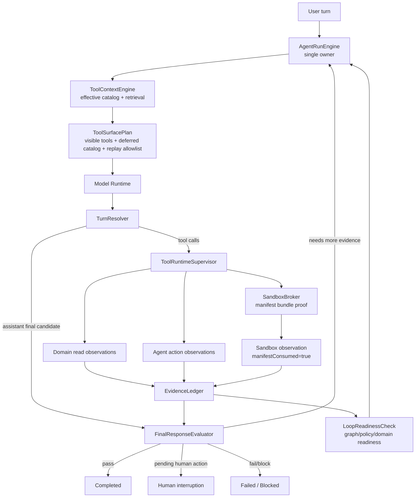

# ADR 0027: OpenClaw-Style Hard Runtime Boundaries

> Enforcement amendment: Agentic OS ADR0079 deletes the historical local
> process implementation referenced below. The current xox integration uses
> only the Agentic OS hardened production sandbox and scoped business bundles.

Status: Accepted; sandbox execution enforcement superseded by Agentic OS ADR0079

Date: 2026-06-03

Refines: ADR 0016 Manifest-Scoped Sandbox Tool, ADR 0018 AgentRunEngine v2 Single-Loop Harness, ADR 0020 Progressive Tool Discovery Runtime, ADR 0023 OpenClaw-Style Converged Single-Loop Harness, ADR 0025 OpenClaw-Style Evidence-First Response Loop, ADR 0026 Real Manifest-Scoped Sandbox Runtime

## Context

Recent real runs exposed three serious harness gaps:

1. Tool discovery degraded-mode handling can still become too broad.
2. Intermediate evaluator wording and state can imply completion before the final assistant answer exists.
3. Sandbox execution can produce a successful observation without proving the code consumed the server-owned manifest bundle.

These are not product-copy or UI projection bugs. They are runtime boundary bugs.

The project already has strong assets:

- TypeScript backend and server-owned agent state.
- `AgentRunEngine` single-loop direction.
- Progressive tool discovery.
- Tenant-scoped memory.
- Editable confirmation cards.
- Evidence-first response evaluation.
- Real sandbox backend contract.

The upgrade should not replace those assets. It should harden them using the mature patterns from OpenClaw, Hermes Agent and OpenAI Agents JS.

Core requirement:

```text
Only AgentRunEngine decides the next loop state.
Other modules may provide context, tool surfaces, observations, policy findings or final-answer checks,
but they must not expand authority, mark completion, or claim sandbox evidence without a runner-verifiable proof.
```

## Reference Findings

### OpenClaw

Local reference: `C:\Github\openclaw`.

Relevant files and docs:

- `docs/tools/tool-search.md`
- `docs/concepts/agent-loop.md`
- `docs/gateway/sandboxing.md`
- `src/agents/tool-search.ts`
- `src/agents/embedded-agent-runner/run/attempt.tool-search-run-plan.ts`
- `src/agents/embedded-agent-runner/run/incomplete-turn.ts`
- `src/agents/session-tool-result-guard.ts`
- `src/agents/session-transcript-repair.ts`
- `src/agents/sandbox/context.ts`
- `src/agents/sandbox/backend.ts`
- `src/agents/bash-tools.exec.ts`

Useful practices:

- Tool Search degraded modes change only the model-facing shape:
  - `tool_search_code` in code mode;
  - `tool_search`, `tool_describe`, `tool_call` in structured degraded mode.
- Both modes use the same effective catalog and execution path.
- A degraded mode never broadens the tool authority surface.
- Tool Search control tools are auto-added only by the runner, not by the general tool factory.
- The run plan separates:
  - visible tool names;
  - replay-allowed tool names;
  - auto-added control names;
  - cataloged tools that count for empty-allowlist validation.
- A model turn ending in tool use is incomplete until matching tool results are returned and a later assistant answer is produced.
- Tool result repair and synthetic results are provider transcript hygiene, not business completion logic.
- Sandbox context resolves session, scope, workspace, backend and tool policy before execution.
- `exec host=sandbox` fails closed if sandbox runtime is unavailable.

Direct implication for `xox-model`:

- Remove broad business surface recovery.
- Keep tool discovery degraded mode inside the same effective catalog.
- Treat graph/readiness checks as loop-state input, not completion.
- Make sandbox evidence a verified runtime contract, not an output shape.

### Hermes Agent

Local reference: `C:\Github\hermes-agent`.

Useful practices:

- Tool retrieval is a discovery layer, not a second executor.
- Real tool calls still route through one dispatcher.
- Code execution uses child process or remote backend mechanics with scrubbed environment, timeouts, output caps and centralized redaction.

Direct implication for `xox-model`:

- Keep Hermes-style retrieval as one collaborator inside `ToolContextEngine`.
- Do not add a second runtime adapter or universal product-facing `tool_call` wrapper.
- Reuse process-execution hardening ideas for sandbox backends, but keep SaaS manifest and tenant boundaries.

### OpenAI Agents JS

Local reference: `C:\Github\openai-agents-js`.

Useful practices:

- Runner-side guardrails, tracing, interruptions, handoffs and sandbox boundaries sit outside business tools.
- Deferred tool loading is a runner capability and must not be combined with forced named tool choices.
- Sandbox concepts use workspace/session/manifest/capability boundaries.

Direct implication for `xox-model`:

- Keep provider adapters thin.
- Keep guardrails, tracing and sandbox authority in the run engine/tool runtime, not inside domain tool builders.
- Future OpenAI native deferred tool or sandbox support should adapt behind project-native `ToolContextEngine` and `SandboxBroker`, not replace SaaS contracts.

## Decision

Adopt three hard runtime boundaries.



### Boundary 1: Effective Tool Surface

`ToolContextEngine` owns the effective tool surface.

It must return a `ToolSurfacePlan`:

```ts
type ToolSurfacePlan = {
  strategy: 'progressive_tool_discovery';
  selectedCapabilities: AgentToolCapability[];
  requiredActionCapabilities: AgentToolCapability[];
  effectiveCatalog: ToolManifest[];
  visibleTools: ChatTool[];
  visibleToolNames: string[];
  deferredCatalog: ToolManifest[];
  replayAllowedToolNames: string[];
  autoAddedControlNames: string[];
  emptySurfaceStatus:
    | 'has_callable_tools'
    | 'direct_answer_only'
    | 'needs_clarification'
    | 'needs_retrieval'
    | 'fail_closed';
  discoveryTrace: ToolDiscoveryTrace;
};
```

Rules:

- Delete `router_fallback_business_core`.
- Router-empty or retrieval-empty states must not expose broad business tools.
- Degraded mode may change model-facing shape, but not effective catalog authority.
- If no business tool is confidently selected:
  - direct-answer lane may answer ordinary conversation;
  - `ask_user_clarification` may ask for missing information;
  - required read/inspect tools may be exposed only when the run contract explicitly needs them;
  - tool-search controls may search the same policy-filtered catalog;
  - otherwise fail closed with a repairable runtime observation.
- Provider tool calls outside `visibleToolNames` or valid deferred catalog ids fail closed.
- The failure becomes a tool-surface repair observation, not silent dropping and not automatic broadening.

OpenClaw mapping:

| OpenClaw concept | xox-model target |
| --- | --- |
| `visibleAllowedToolNames` | `visibleToolNames` |
| `replayAllowedToolNames` | provider transcript/tool-result allowlist |
| `autoAddedControlNames` | tool discovery controls that do not mask empty catalogs |
| same catalog for code/tools degraded mode | same effective catalog for direct/deferred materialization |

### Boundary 2: Loop Readiness Is Not Completion

The current `CompletionEvaluator` name and events are too broad.

Split semantics:

```ts
type LoopReadinessStatus =
  | 'ready_for_final_answer'
  | 'continue_with_observations'
  | 'await_confirmation'
  | 'await_clarification'
  | 'blocked'
  | 'failed';

type FinalResponseStatus =
  | 'pass'
  | 'continue'
  | 'interrupt'
  | 'failed';
```

Rules:

- Rename graph/policy/domain checks to `LoopReadinessCheck`.
- Reserve `Completion` language for the final user-visible answer only.
- A tool-call turn is incomplete until tool observations are replayed and the model produces a final assistant answer.
- Assistant preface before tool calls is progress, not final answer.
- Tool results, sandbox results and confirmation cards are observations/interruptions, not answers.
- `goal_status=completed` can be written only after:
  1. final assistant text exists;
  2. `FinalResponseEvaluator` passes against the `EvidenceLedger`;
  3. no confirmation or clarification remains pending.
- Technical trace may record internal checks, but main transcript must show only user-relevant tool/action/answer rows.

OpenClaw mapping:

| OpenClaw concept | xox-model target |
| --- | --- |
| `isIncompleteTerminalAssistantTurn` | tool-use provider turns cannot complete a run |
| `session-tool-result-guard` | tool call/result pairing and repair at runtime boundary |
| `session-transcript-repair` | provider transcript hygiene, not business completion |
| `assistant/tool/lifecycle` streams | project-native transcript channels with lifecycle hidden by default |

### Boundary 3: Sandbox Manifest Consumption Proof

Sandbox success must prove that model-authored code consumed the runner-owned input bundle.

Extend the sandbox input:

```ts
type SandboxInputEnvelope = {
  schemaVersion: 'xox.sandbox.input.v1';
  manifest: SandboxManifest & {
    manifestId: string;
    nonce: string;
  };
  bundle: {
    bundleId: string;
    contentHash: string;
    scope: SandboxDataScope;
    fields: string[];
    rows?: unknown[];
    structured: unknown;
  };
};
```

Require the sandbox output to include a consumption proof:

```ts
type SandboxResultEnvelope = {
  schemaVersion: 'xox.sandbox.result.v1';
  observedInput: {
    manifestId: string;
    bundleId: string;
    contentHash: string;
    nonce: string;
  };
  summary: string;
  structured: unknown;
  tables?: Array<{ name: string; rows: unknown[] }>;
};
```

Rules:

- `LocalScriptSandboxBackend` stages `input.json` and a small language helper:
  - Python: `xox_sandbox.py`
  - JavaScript: `xox_sandbox.mjs`
- Helper API:

```ts
type XoxSandboxApi = {
  input: {
    load(): SandboxInputEnvelope;
  };
  output: {
    emit(result: Omit<SandboxResultEnvelope, 'schemaVersion' | 'observedInput'>): void;
  };
};
```

- The helper automatically copies `manifestId`, `bundleId`, `contentHash` and `nonce` into `result.json`.
- Scripts may manually write `result.json`, but `ResultParser` must validate the same fields.
- `SandboxObservation` gets:

```ts
type SandboxObservation = {
  manifestScoped: true;
  manifestConsumed: boolean;
  manifestConsumption?: {
    manifestId: string;
    bundleId: string;
    contentHash: string;
    nonceMatched: boolean;
  };
};
```

Evaluator rule:

```text
requiresSandboxComputation passes only if:
executionMode == executed
status == completed
exitCode == 0
manifestScoped == true
manifestConsumed == true
structuredOutput is parseable and relevant to the final answer
```

Hardcoded code that copies numbers from earlier tool observations but does not load `input.json` must produce a sandbox observation, but it cannot satisfy sandbox evidence.

This is intentionally not a regex/code scan. It is a runtime handshake.

## Relationship To Existing ADRs

| ADR | Keep | Upgrade in ADR 0027 | Remove/forbid |
| --- | --- | --- | --- |
| ADR 0016 | Manifest-scoped sandbox contract | Add explicit manifest consumption proof | Treating manifest shape as calculation evidence |
| ADR 0018 | Single `AgentRunEngine` owner | Make loop readiness and final response separate states | Helper modules marking completion |
| ADR 0020 | Progressive disclosure + retrieval | Add `ToolSurfacePlan` and fail-closed empty surface | `router_fallback_business_core` |
| ADR 0023 | Converged single-loop harness | Turn the three hard boundaries into invariants | Sidecar next-step owners |
| ADR 0025 | Evidence-first final response | Make final-answer pass the only completion gate | Intermediate evaluator pass wording |
| ADR 0026 | Real sandbox runtime | Require real execution plus manifest consumption | Sandbox observations from unconsumed bundles satisfying evidence |

## Implementation Milestones

### 1. Tool surface hardening

Paths:

- `apps/api/src/agent/tool-gateway.ts`
- `apps/api/src/agent/tool-context-engine/*`
- `apps/api/src/agent/tool-runtime/effective-tool-inventory.ts`
- `apps/api/tests/tool-context-engine.test.ts`
- `apps/api/tests/tool-runtime.test.ts`
- `apps/api/tests/api.test.ts`

Changes:

- Remove `router_fallback_business_core` from production strategy types.
- Add `ToolSurfacePlan`.
- Preserve selected capability, retrieval and materialization, but make empty router output fail closed.
- Add an explicit tool-surface repair observation for invalid provider tool calls.
- Ensure `data_query_workspace` remains a prerequisite for fact-dependent write/calculation tasks.

Validation:

- Router empty result exposes no draft/ledger/version/share/sandbox business tools.
- Degraded mode keeps the same effective catalog and only changes visible control shape.
- Provider tool call outside visible/deferred catalog fails closed and is not silently dropped.
- `npm.cmd run test:api -- tool-context-engine`

### 2. Evaluator semantic split

Paths:

- `apps/api/src/agent/loop-readiness-check.ts`
- `apps/api/src/agent/response-evaluator.ts`
- `apps/api/src/agent/agent-run-engine.ts`
- `apps/api/src/agent/turn-resolver.ts`
- `apps/api/src/agent/agent-transcript-projector.ts`
- `apps/api/tests/response-evaluator.test.ts`
- `apps/api/tests/api.test.ts`

Changes:

- Rename graph/policy/domain intermediate evaluation to `LoopReadinessCheck`.
- Keep existing checks, but change status names and trace copy.
- Completion language appears only in final response evaluation.
- Main transcript hides internal readiness checks unless failed or user-actionable.

Validation:

- A run with tool observations but no final assistant text cannot complete.
- A graph readiness pass emits `ready_for_final_answer`, not `completed`.
- Pending confirmation and clarification keep run waiting.
- UI transcript does not display internal readiness-satisfied messages.
- `npm.cmd run test:api -- response-evaluator`

### 3. Sandbox manifest consumption proof

Paths:

- `packages/contracts/src/index.ts`
- `apps/api/src/agent/sandbox-service.ts`
- `apps/api/src/agent/sandbox/backends/local-script-backend.ts`
- `apps/api/src/agent/sandbox/backends/docker-backend.ts`
- `apps/api/src/agent/sandbox/result-parser.ts`
- `apps/api/src/agent/sandbox/backend.ts`
- `apps/api/tests/sandbox-tool.test.ts`
- `apps/api/tests/response-evaluator.test.ts`

Changes:

- Add `manifestId`, `bundleId`, `contentHash`, `nonce` handshake.
- Stage Python/JavaScript helper files into sandbox workdir.
- Parse and validate `observedInput`.
- Add `manifestConsumed` to observations and evidence ledger.
- Reject unconsumed sandbox output for `requiresSandboxComputation`.

Validation:

- Code using helper and bundle passes manifest-consumption validation.
- Code that hardcodes values and writes valid-looking `result.json` without observed input does not satisfy sandbox evidence.
- Policy-blocked or not-executed sandbox results do not satisfy sandbox evidence.
- `npm.cmd run test:api -- sandbox-tool`

### 4. Regression scenarios

Paths:

- `apps/api/tests/api.test.ts`
- `docs/acceptance.md`

Scenarios:

- `今天是几月几号` stays in direct answer lane with no tool catalog/evaluator.
- `我们现在有几个人` uses read-only domain observation and final assistant answer.
- Cross-domain request with read + ledger + shareholder update uses progressive discovery, not broad business surface recovery.
- ROI + inflation + bank loan task uses domain read -> sandbox with manifest consumption -> final answer -> response evaluator.

Validation:

- `npm.cmd run test:api`
- `npm.cmd run test:web`
- `npm.cmd run build:web`

## Acceptance Criteria

- No production runtime path emits or stores `router_fallback_business_core`.
- Tool discovery degraded mode cannot expose more tools than the effective policy-filtered catalog.
- Invalid provider tool calls fail closed with a structured repair observation.
- Intermediate graph/policy/domain checks do not write `goal_status=completed`.
- User-visible "completion" language appears only after final assistant text passes response evaluation.
- Sandbox evidence requires real execution and manifest consumption proof.
- A sandbox output without matching `manifestId/bundleId/contentHash/nonce` can be shown as a failed or incomplete observation, but cannot satisfy `requiresSandboxComputation`.
- Existing confirmation-card and automation-level semantics remain unchanged:
  - automation level controls execution authority only;
  - planning always pursues the full goal;
  - writes still create editable confirmation cards before execution.

## Non-Goals

- Do not replace the whole harness with OpenClaw.
- Do not introduce a second runtime adapter.
- Do not expose a generic product-facing `tool_call` wrapper.
- Do not let sandbox code call internal APIs, production databases, memory writes, provider keys, user sessions or business write services.
- Do not solve semantic ambiguity with keyword lists or regex business routers.
- Do not make OpenAI native deferred tools a requirement for this phase.

## Reuse Policy

OpenClaw, Hermes Agent and OpenAI Agents JS should be reused at the level that fits a SaaS product:

- Reuse architecture and small pure runtime helpers where license-compatible.
- Port pure utility code only with attribution comments when copied.
- Do not import local-agent control planes, global filesystem/session stores, host shell authority, plugin registries or single-user assumptions.
- Adapt concepts into xox-owned modules:
  - `ToolSurfacePlan`;
  - `LoopReadinessCheck`;
  - `FinalResponseEvaluator`;
  - `SandboxBroker`;
  - `SandboxInputEnvelope`;
  - `SandboxResultEnvelope`.

## Migration Notes

Implementation replaces the old intermediate evaluator name and broad tool-surface strategy:

- Introduce new names first.
- Move call sites.
- Delete old strategy/status names.
- Update tests in the same commit.
- Do not leave compatibility shims for `router_fallback_business_core` or intermediate completion copy.

## Open Questions

- Should tool-search controls be exposed as explicit provider-native tools in xox-model, or should retrieval remain entirely server-side until the catalog exceeds the current budget?
- Should Docker become the default sandbox backend for local development once available, leaving `local-script` only for trusted developer smoke?
- Should manifest consumption proof be enforced for every sandbox run immediately, or first only for `requiresSandboxComputation` goals and then tightened?
