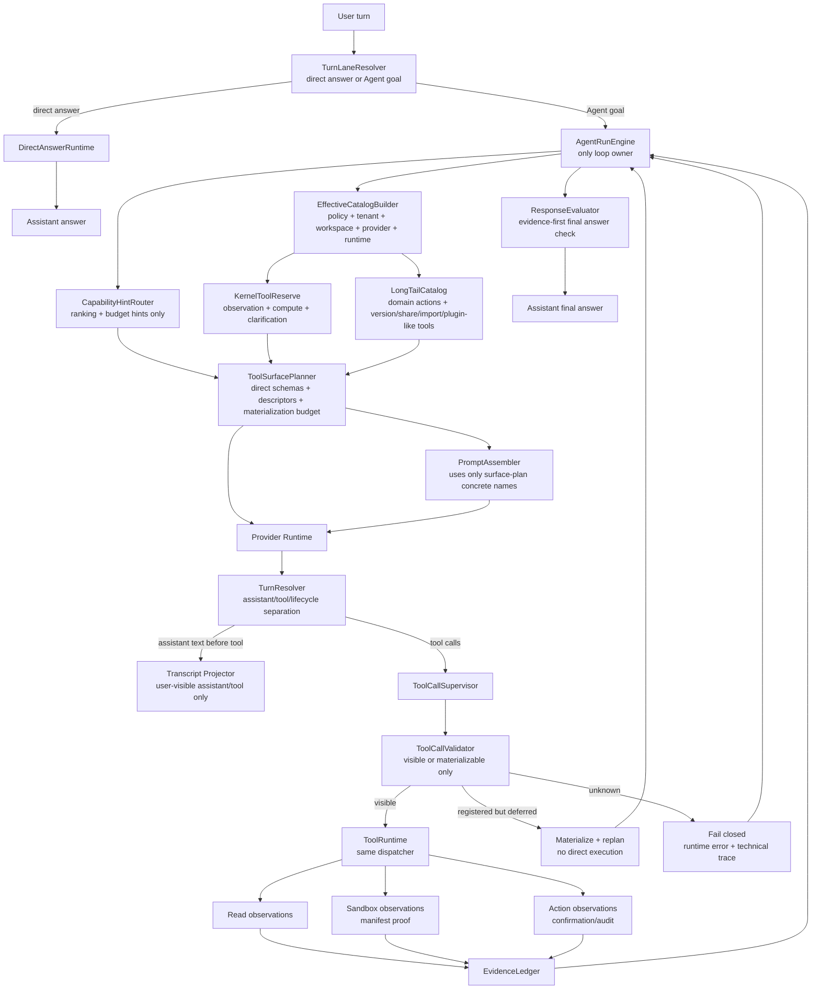

# ADR 0028: OpenClaw/Hermes Effective Tool Catalog Runtime

Status: Accepted

Date: 2026-06-04

Refines: ADR 0016 Manifest-Scoped Sandbox Tool, ADR 0018 AgentRunEngine v2 Single-Loop Harness, ADR 0020 Progressive Tool Discovery Runtime, ADR 0021 Turn Lane Resolution and Direct Answer Runtime, ADR 0023 OpenClaw-Style Converged Single-Loop Harness, ADR 0025 OpenClaw-Style Evidence-First Response Loop, ADR 0027 OpenClaw-Style Hard Runtime Boundaries

## Context

Conversation `0225bd7e` exposed a serious tool-runtime regression.

The user asked for a finance scenario:

```text
Predict my ROI if inflation is 5%. I am the first shareholder. My invested money is from a bank loan with 5% annual interest.
```

The model correctly tried to call `data_query_workspace` multiple times, but the runtime had exposed only a restricted surface such as `ask_user_clarification` and `account_forbidden`. The run then failed before the model could inspect workspace facts or use the sandbox for computation.

The root cause is not weak model semantics. The model selected the right class of tool. The root cause is that the current runtime sometimes lets a semantic capability router become an authority gate before the effective tool catalog exists:

```text
router-empty -> restricted surface -> useful read/compute tools hidden -> model calls unavailable tool -> run fails
```

That violates the architecture we have been converging toward:

```text
one main AgentRunEngine loop;
provider-native tool calls;
tool results as observations;
read/compute ground truth before final answer;
writes through editable confirmation cards.
```

The goal of this ADR is not to replace the existing xox-model harness. The goal is to absorb the strongest parts of OpenClaw, Hermes Agent, and OpenAI Agents JS into the current architecture and remove the weak ordering that caused the failure.

## Source References

### OpenClaw

Local reference: `C:\Github\openclaw`.

Relevant source/docs reviewed:

- `docs/tools/tool-search.md`
- `src/agents/tool-search.ts`
- `src/agents/embedded-agent-runner/run/attempt.tool-search-run-plan.ts`
- `src/agents/embedded-agent-runner/run/attempt.ts`
- `src/agents/session-tool-result-guard.ts`
- `src/agents/session-transcript-repair.ts`

Core ideas to reuse:

- Build an effective run-scoped catalog after policy, session, sandbox, MCP, plugin, and client-tool filtering.
- Compact the model-facing surface only after the effective catalog exists.
- Tool Search has different model-facing shapes (`code` bridge or structured tools), but both use the same catalog and execution path.
- Search/describe/call are discovery and bridge operations, not a second authority model.
- Real tool calls always return to the gateway, where policy, approval hooks, logging, telemetry, and result handling apply.
- Runtime telemetry records catalog size, visible tools, replay-allowed tools, auto-added control tools, search/describe/call counts, and final calls.
- Tool miss or transcript repair is runtime hygiene, not goal completion.

### Hermes Agent

Local reference: `C:\Github\hermes-agent`.

Relevant source reviewed:

- `tools/tool_search.py`
- `model_tools.py`
- `tests/tools/test_tool_search.py`

Core ideas to reuse:

- Core tools are never deferred.
- Tool search activates by threshold and catalog size, not by taste.
- The catalog is rebuilt from live tool definitions on every assembly so stale session catalogs cannot silently drop tools.
- Search documents are thin: tool name, description, and top-level parameter names.
- Bridge tools route through the same dispatcher as direct calls, so guardrails, hooks, approval flows, redaction, and result truncation still apply.
- UI/trajectory display unwraps the bridge and shows the underlying tool, not generic `tool_call`.

### OpenAI Agents JS

Local reference: `C:\Github\openai-agents-js`.

Relevant source reviewed:

- `examples/tools/tool-search.ts`
- `packages/agents-core/src/sandbox/runtime/agentPreparation.ts`
- `packages/agents-core/src/sandbox/runtime/manager.ts`
- `packages/agents-core/src/types/protocol.ts`
- `packages/agents-core/src/tracing/*`

Core ideas to reuse:

- Deferred tool loading is a runner-side capability. Tools can be namespaced, marked with `deferLoading`, then loaded on demand through `toolSearchTool`.
- Guardrails, tracing, interruptions, and sandbox boundaries belong to the runner/runtime side, not to domain tool implementations.
- Sandbox preparation binds capabilities to a live session, processes the manifest, validates required capability dependencies, composes tools/instructions/provider data, and preserves a runtime manifest.
- Sandbox sessions, manifests, capability instructions, and run-state serialization are explicit boundaries.

## Corrected Conclusion

The previous wording "progressive disclosure plus retrieval" is still right, but the implementation order must be corrected.

The runtime rule is:

```text
Effective catalog first.
Compaction second.
Router as hint only.
```

Meaning:

1. The system first builds the policy-filtered, tenant-scoped, run-scoped effective catalog.
2. Kernel observation and computation tools stay eligible whenever the turn is an Agent goal.
3. Capability/router output only ranks, budgets, and explains tool exposure. It does not own allow/deny authority.
4. Retrieval compresses long-tail tools; it does not decide what exists.
5. Provider-visible concrete tool names must match the actual executable or materializable inventory.

This preserves xox-model's SaaS safety while learning the mature runtime shape from OpenClaw and Hermes.

## Five Direct Inspirations

### 1. Effective Catalog Before Tool Search

OpenClaw builds the real catalog before deciding whether to expose direct tools or compact controls. xox-model must do the same.

The catalog is produced by:

```text
tool registry
-> tenant/workspace ownership
-> account/manual-only policy
-> lock/version/share/sandbox constraints
-> automation authority
-> provider capability profile
-> runtime state
```

Only after this step may the runtime choose:

- direct schemas;
- compact descriptors;
- search/describe/materialize controls;
- direct-answer-only lane.

### 2. Kernel Tools Never Disappear In Agent Goals

Hermes keeps core tools out of deferral. For xox-model, the SaaS kernel tool set is not "all business tools". It is the minimum observation/control/compute surface required for grounded loops:

- `data_query_workspace`
- `sandbox_run_code`
- `ask_user_clarification`
- `account_forbidden`

Optional kernel-adjacent tools may be always eligible only when their owning ADR says so:

- memory recall/search tools after ADR 0019 governance;
- UI navigation markers when a visible page transition is needed.

Direct-answer turns such as greetings or date/time questions still bypass the Agent goal catalog through ADR 0021. "Kernel tools never disappear" applies after the turn has entered the Agent goal lane.

### 3. Retrieval Is Compression, Not Authority

Hermes Tool Search and OpenClaw Tool Search reduce schema size. They do not decide whether a tool is legally callable.

For xox-model:

- tool search may hide full schemas for long-tail tools;
- tool search may return thin descriptors and then materialize selected schemas;
- tool search must never re-add a tool that policy removed;
- tool search must never hide kernel observation/compute tools needed for grounding.

### 4. Prompt Surface Must Match Runtime Inventory

If the prompt mentions a concrete tool, that tool must be visible or materializable in the same run-scoped `ToolSurfacePlan`.

The planner prompt must not contain static concrete tool lists that can drift from the current surface. It may refer to capability concepts, but concrete tool names come from the surface plan.

This fixes the failure mode where prompts encourage `data_query_workspace` while runtime inventory omitted it.

### 5. Tool Miss Is Catalog Repair Evidence, Not Completion

OpenClaw treats missing tool results and incomplete tool turns as transcript/runtime repair problems, not as successful answers.

For xox-model:

- a provider call to a registered but non-materialized tool is a catalog expansion signal;
- it must not execute outside the current surface;
- it must not be silently dropped;
- it must not let the evaluator pass on assistant preface text;
- the main loop may repair by materializing the requested known tool and re-planning with observations.

Unknown tools still fail closed.

## Upgraded Architecture



Invariant:

```text
Only AgentRunEngine decides the next step.
ToolContextEngine decides the next visible tool context.
ToolRuntime supervises execution.
AgentActionRuntime owns editable confirmations and writes.
SandboxBroker owns code execution evidence.
ResponseEvaluator owns final-answer acceptance.
```

## Relationship To Existing ADRs

### ADR 0016: Manifest-Scoped Sandbox Tool

Retained.

This ADR clarifies that `sandbox_run_code` is a kernel computation tool for Agent goals. It should be visible when the goal needs real calculation, file transformation, validation, or scenario computation. The sandbox still cannot write domain state and still needs manifest consumption proof.

### ADR 0018: Single-Loop Harness

Retained.

Tool search and catalog repair remain collaborators under `AgentRunEngine`. They do not become another planner or executor.

### ADR 0020: Progressive Tool Discovery Runtime

Refined.

ADR 0020 correctly fused progressive disclosure and retrieval. This ADR fixes the ordering:

```text
old risk: capability router -> narrow surface -> retrieval/materialization
new rule: effective catalog -> kernel reserve -> router hints -> retrieval/materialization
```

### ADR 0021: Turn Lane Resolution

Retained.

Direct answers stay before the Agent goal lane. A date/time or greeting should not pay the full catalog cost. Once a turn enters the Agent goal lane, kernel observation/compute tools must not disappear because of router output.

### ADR 0023 / 0025 / 0027

Retained.

This ADR strengthens the OpenClaw-style single-loop, evidence-first, hard-boundary model:

- tool results are observations;
- final answers require assistant text after observations;
- degraded tool discovery does not broaden authority;
- missing tool calls are repair/failure states, not success.

## Target Contracts

### Tool Surface Plan

The runtime should converge on one project-native surface contract:

```ts
type ToolSurfacePlan = {
  schemaVersion: 'xox.tool_surface.v2';
  turnLane: 'agent_goal';
  effectiveCatalog: ToolManifestRef[];
  kernelToolNames: string[];
  visibleToolNames: string[];
  materializableToolNames: string[];
  deferredToolRefs: ToolManifestRef[];
  replayAllowedToolNames: string[];
  autoAddedControlNames: string[];
  capabilityHints: {
    selectedCapabilities: AgentToolCapability[];
    requiredActionCapabilities: AgentToolCapability[];
    confidence: number;
    reason: string;
  };
  budget: {
    providerContextTokens: number | null;
    visibleSchemaTokenEstimate: number;
    deferredSchemaTokenEstimate: number;
    toolSearchActivated: boolean;
  };
  emptySurfaceStatus:
    | 'has_callable_tools'
    | 'direct_answer_only'
    | 'needs_clarification'
    | 'needs_tool_search'
    | 'fail_closed';
  discoveryTraceId: string;
};
```

Rules:

- `effectiveCatalog` is authority-bearing.
- `visibleToolNames` are directly callable provider-native schemas.
- `materializableToolNames` may be promoted to visible schemas in a repair/replan turn.
- `capabilityHints` cannot remove a tool from `effectiveCatalog`.
- `replayAllowedToolNames` exists for provider transcript/tool-result consistency, not as a hidden execution channel.

### Tool Manifest

Each tool manifest should carry both rich internal metadata and a thin search document:

```ts
type ToolManifest = {
  name: string;
  title: string;
  description: string;
  capability: AgentToolCapability;
  kind: 'kernel' | 'read' | 'action' | 'sandbox' | 'memory' | 'navigation' | 'account';
  risk: 'none' | 'low' | 'medium' | 'high' | 'manual_only';
  confirmation: 'none' | 'required' | 'manual_only';
  deferrable: boolean;
  schemaTokenEstimate: number;
  searchDocument: {
    text: string;
    parameterNames: string[];
  };
  navigationTarget?: string;
  providerCompatibility: string[];
};
```

No runtime module should scan user prose with keyword lists to decide which manifest is needed.

### Catalog Miss

Provider-selected missing tools must be typed:

```ts
type ToolCatalogMiss =
  | {
      type: 'registered_deferred_tool';
      toolName: string;
      action: 'materialize_and_replan';
    }
  | {
      type: 'registered_policy_blocked_tool';
      toolName: string;
      action: 'fail_closed';
    }
  | {
      type: 'unknown_tool';
      toolName: string;
      action: 'fail_closed';
    };
```

This replaces vague categories that mix provider output hygiene with tool authority.

## Reuse Plan

Reuse means porting small, well-bounded ideas or pure modules with attribution, not importing another product's control plane.

### From OpenClaw

Prefer to adapt:

- run-scoped effective catalog shape;
- visible/replay/auto-added control split;
- search/describe/call telemetry;
- tool miss as runtime repair/failure;
- compact bridge concepts for future code-mode discovery.

Do not import:

- OpenClaw control plane;
- local session store;
- local filesystem authority;
- plugin registry ownership;
- channel delivery/runtime ownership.

### From Hermes Agent

Prefer to adapt:

- core-vs-deferrable split;
- threshold activation using schema token estimate;
- compact search document generation;
- stateless live catalog assembly;
- tests proving core tools never defer and unknown tools stay visible/fail safe.

Do not import:

- Hermes CLI config as authority;
- local-agent execution assumptions;
- universal product-facing `tool_call` as the main xox action execution path.

### From OpenAI Agents JS

Prefer to adapt:

- runner-side guardrail/tracing/sandbox boundary discipline;
- namespace/deferred loading concepts as future provider optimization;
- capability-bound sandbox preparation pattern;
- manifest/session/capability validation pattern.

Do not let:

- OpenAI native deferred loading become the only path;
- OpenAI SDK tool callbacks execute xox writes directly;
- provider-specific tool search replace project-native SaaS contracts.

## Implementation Plan

### Milestone 1: Surface Contract And Catalog Builder

Edit paths:

- `packages/contracts/src/index.ts`
- `apps/api/src/agent/tool-context-engine/tool-manifest.ts`
- `apps/api/src/agent/tool-runtime/effective-tool-inventory.ts`
- `apps/api/src/agent/tool-context-engine/index.ts`

Changes:

- Add `ToolSurfacePlan v2`.
- Make effective catalog construction the first step.
- Add `kind`, `deferrable`, `schemaTokenEstimate`, and `searchDocument`.
- Reserve kernel tools after policy filtering and before budget ranking.

Validation:

- Unit test: `data_query_workspace`, `sandbox_run_code`, `ask_user_clarification`, and `account_forbidden` remain eligible in Agent-goal turns even when capability hints are empty.
- Unit test: direct-answer lane does not build the Agent-goal catalog.

### Milestone 2: Capability Router Becomes Hint-Only

Edit paths:

- `apps/api/src/agent/tool-gateway.ts`
- `apps/api/src/agent/runtime-planning-call.ts`
- `apps/api/src/agent/prompts/planner.system.md`
- `apps/api/src/agent/prompt-registry.ts`

Changes:

- Rename router output in code and traces to capability hints.
- Remove any path where empty router output creates the executable allowlist.
- Generate concrete tool-name prompt sections from `ToolSurfacePlan.visibleToolNames` and descriptors only.
- Remove static concrete tool-name promises from prompts.

Validation:

- Regression test for `0225bd7e` style prompt: first Agent-goal surface includes read/compute kernel tools.
- Prompt test: no concrete tool name appears in model prompt unless it is visible or materializable in the same `ToolSurfacePlan`.

### Milestone 3: Hermes-Style Threshold And Thin Retrieval

Edit paths:

- `apps/api/src/agent/tool-context-engine/tool-search-document.ts`
- `apps/api/src/agent/tool-context-engine/tool-search-index.ts`
- `apps/api/src/agent/tool-context-engine/tool-reranker.ts`
- `apps/api/src/agent/tool-context-engine/schema-materializer.ts`

Changes:

- Implement core/deferrable split.
- Activate search/materialization by threshold and provider context budget.
- Keep small catalogs direct.
- Build live search docs from current manifests every planning turn.

Validation:

- Unit test: below threshold, no compact tool search surface is used.
- Unit test: above threshold, long-tail tools are deferred but kernel tools remain direct.
- Unit test: unknown/unclassified tools are not silently dropped.

### Milestone 4: OpenClaw-Style Catalog Miss Repair

Edit paths:

- `apps/api/src/agent/runtime/tool-call-validator.ts`
- `apps/api/src/agent/tool-runtime/tool-call-supervisor.ts`
- `apps/api/src/agent/runtime-plan-reader.ts`
- `apps/api/src/agent/runtime-trace-events.ts`

Changes:

- Classify missing calls as `registered_deferred_tool`, `registered_policy_blocked_tool`, or `unknown_tool`.
- For `registered_deferred_tool`, materialize and replan without executing outside the surface.
- For blocked/unknown, fail closed with technical evidence and a user-visible error only when no safe repair exists.

Validation:

- Unit test: registered deferred tool call triggers materialize-and-replan.
- Unit test: unknown tool does not execute and cannot be evaluated as complete.
- Trace test: catalog-miss repair remains in technical log unless it produces a real visible tool row or final failure.

### Milestone 5: Grounded Computation Path

Edit paths:

- `apps/api/src/agent/sandbox/sandbox-broker.ts`
- `apps/api/src/agent/sandbox-service.ts`
- `apps/api/src/agent/response-evaluator.ts`
- `apps/api/tests/agent-*.test.ts`

Changes:

- Make sandbox use mandatory when the goal contract requires derived calculation beyond existing domain summaries.
- Feed domain observations and sandbox observations back to the model before final answer.
- Preserve pending confirmation/clarification interrupts as non-complete states.

Validation:

- Real-provider smoke: inflation/loan/ROI prompt reads current workspace facts, performs or requests sandbox computation when needed, and returns a final answer grounded in observations.
- No confirmation cards are created for read-only scenario questions.

## Acceptance Criteria

1. `0225bd7e`-class finance scenario no longer starts with a restricted-only surface. It can inspect workspace data and use sandbox computation when needed.
2. Capability hints cannot remove kernel observation/compute tools in Agent-goal turns.
3. Direct-answer turns remain lightweight and do not invoke memory recall, tool catalog, or evaluator loops.
4. Long-tail tools are compressed only when threshold/budget requires it.
5. Search/describe/materialize controls never broaden authority beyond the effective catalog.
6. Provider prompts never mention concrete tool names absent from the current surface.
7. Provider calls to registered-but-deferred tools cause materialization/replan, not direct execution and not terminal fake success.
8. Provider calls to unknown or policy-blocked tools fail closed.
9. Writes still use typed provider-native tools and server-owned editable confirmation cards.
10. Tool results and sandbox outputs are observations for the model, not user-facing final answers by themselves.
11. Main transcript shows underlying tools, not generic bridge calls.
12. Technical traces record catalog size, strategy, visible names, deferred count, search/materialization count, and catalog misses.

Commands after implementation:

```bash
npm.cmd run test:api
npm.cmd run test:web
npm.cmd run build:web
npm.cmd run smoke:agent
```

## Non-Goals

- Do not replace `AgentRunEngine`.
- Do not adopt OpenClaw's local control plane.
- Do not adopt Hermes' CLI config or local-only runtime as authority.
- Do not rely on OpenAI-native deferred tool loading as the only transport.
- Do not add backend keyword/regex intent routing.
- Do not make sandbox execution a write-capable domain tool.

## Migration Notes

This ADR started as an upgrade plan and now owns the runtime contract for effective-catalog-first tool assembly.

The safest migration sequence is:

1. land the new surface contract and tests while preserving current behavior;
2. make the router hint-only behind tests;
3. activate threshold-based deferral;
4. add catalog-miss materialization repair;
5. add real-provider smoke cases for the known failed prompts.

## Implementation Notes

Implemented on 2026-06-04:

- `ToolSurfacePlan v2` is now part of `packages/contracts`.
- `ToolContextEngine` builds the run-scoped effective catalog first, reserves the Agent-goal kernel tools, and then materializes the provider-visible surface.
- Capability router output is treated as ranking/budget hints; `requiredActionCapabilities` are no longer cropped by router-selected capabilities.
- Kernel tools for Agent goals are `data_query_workspace`, `sandbox_run_code`, `ask_user_clarification`, and `account_forbidden`.
- Registered deferred tool calls are classified as `tool_call_registered_but_deferred`, then materialized and replanned without executing outside the visible surface.
- Materialized replans receive a fresh inventory snapshot that includes the newly visible tools, so `ToolCallSupervisor` still enforces the same authority boundary.
- The tool catalog run event now records visible, kernel, materializable, deferred, replay-allowed, auto-added, budget, and surface-plan details.

Validation evidence:

- `npm.cmd run test --workspace @xox/api -- tests/tool-context-engine.test.ts tests/provider-runtime.test.ts tests/api.test.ts --testNamePattern "tool|materializes a registered deferred"` passed.
- `npm.cmd run test:api` passed with 175/175 tests.
- `npm.cmd run build --workspace @xox/api` passed.
- `npm.cmd run test:web` passed with 75/75 tests.
- `npm.cmd run build:web` passed.
- `npm.cmd run test` passed with web 75/75 and api 175/175.
- `npm.cmd run build` passed.
- `npm.cmd run smoke:agent` passed against DeepSeek `deepseek-v4-pro`, including real provider tool calls, memory injection, editable confirmations, ledger writes, version/share/import/export actions, and a 50-member complex operating model.

Each step must remove the old parallel path when the new path owns the behavior. Compatibility shims are allowed only during a single migration PR and must be deleted before the milestone is accepted.

## Open Questions

- Whether `memory_search` should be a kernel-adjacent always-eligible tool for Agent goals or only exposed by memory governance signals.
- Whether UI navigation should remain as explicit tool schemas or as non-provider runtime side effects attached to selected tools.
- Whether OpenAI native `toolSearchTool` should be used only for OpenAI-family providers after project-native behavior is stable.
