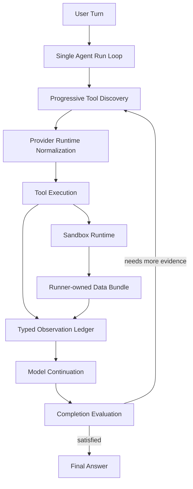
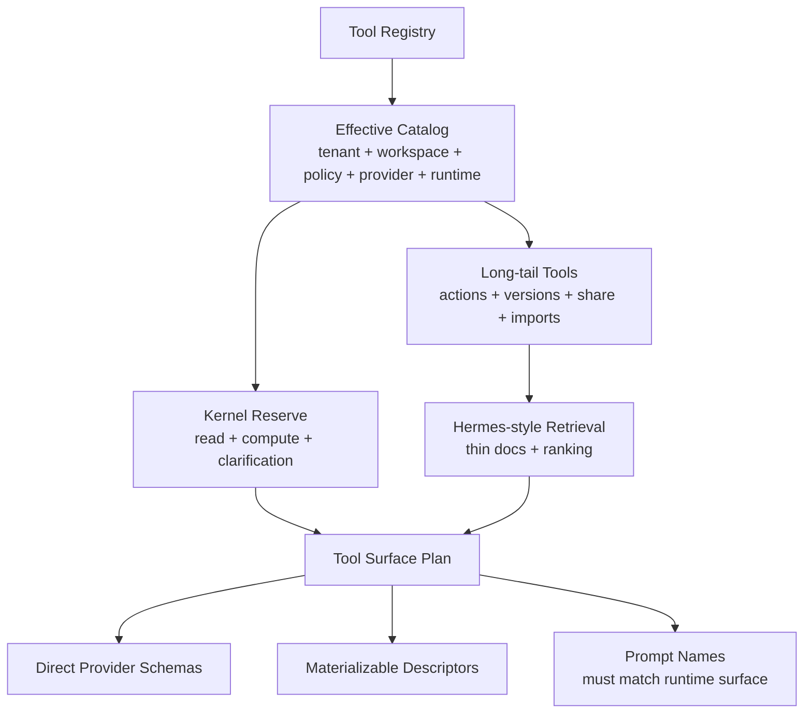
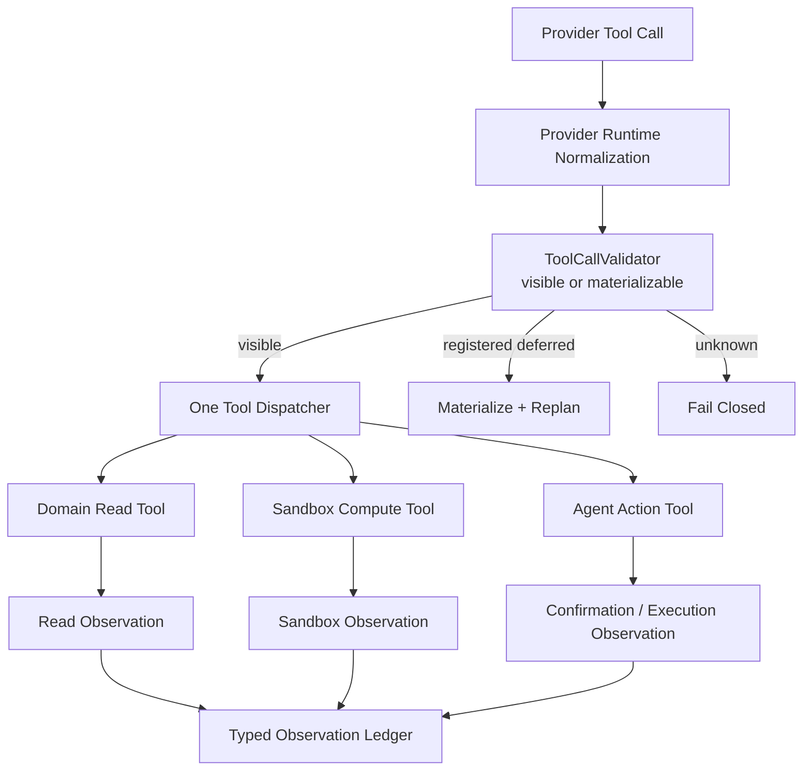
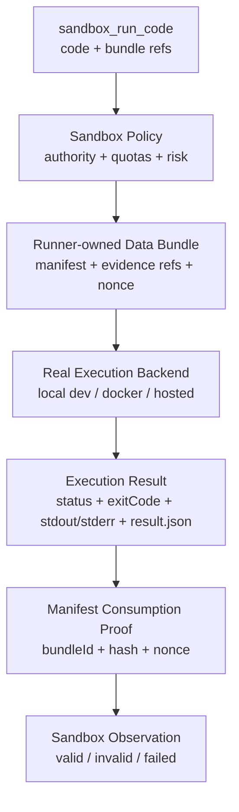
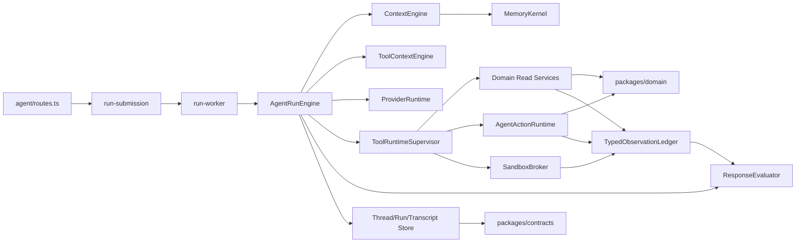

# ADR 0029: Runner-Owned Evidence Main Loop Upgrade

Status: Proposed

Date: 2026-06-05

Refines: ADR 0016 Manifest-Scoped Sandbox Tool, ADR 0018 AgentRunEngine v2 Single-Loop Harness, ADR 0020 Progressive Tool Discovery Runtime, ADR 0021 Turn Lane Resolution and Direct Answer Runtime, ADR 0023 OpenClaw-Style Converged Single-Loop Harness, ADR 0025 OpenClaw-Style Evidence-First Response Loop, ADR 0026 Real Manifest-Scoped Sandbox Runtime, ADR 0028 OpenClaw/Hermes Effective Tool Catalog Runtime

## Context

Conversation `03226d6a` exposed a subtle but serious harness flaw.

The user asked:

```text
给我预测一下，如果目前的通胀率是5%，我的投资回报率是多少？
我是第一个股东，我投入的钱都是银行贷款出来的，银行利率是年利率5%
```

The run looked superficially correct:

- it entered the Agent goal lane;
- it called read tools for workspace and shareholders;
- it called `sandbox_run_code`;
- it generated a final assistant answer;
- no write action was created.

But the deeper evidence path was not fully correct:

- `goalFacts.requiresSandboxComputation` was empty even though the model chose a calculation tool;
- the sandbox call used hardcoded numbers rather than a runtime-bound manifest bundle;
- `manifestConsumed` was false;
- evidence could be downgraded to `domain_read` instead of staying an invalid sandbox observation;
- provider streaming for large tool arguments still needed repair/retry;
- evaluator acceptance depended too much on pre-classified goal facts and too little on actual trajectory.

The root problem is not one missing if-statement. It is that `xox-model` still has partially separate ownership for:

- tool discovery;
- provider payload normalization;
- sandbox proof;
- evidence authority;
- final-answer evaluation.

Mature harnesses keep these under the runner loop.

## Reference Findings

### OpenClaw

Local reference: `C:\Github\openclaw`.

Relevant files and docs:

- `docs/concepts/agent-loop.md`
- `docs/agent-runtime-architecture.md`
- `src/agents/tool-search.ts`
- `packages/tool-call-repair/src/payload.ts`
- `packages/tool-call-repair/src/stream-normalizer.ts`
- `src/agents/embedded-agent-runner/run/attempt.ts`
- `src/agents/embedded-agent-runner/run/incomplete-turn.ts`
- `src/agents/test-helpers/agent-tools-sandbox-context.ts`
- `src/agents/sandbox/*`

Reusable ideas:

- one serialized session loop owns intake, context assembly, model inference, tool execution, streaming, persistence and terminal state;
- streams are cleanly separated into assistant, tool and lifecycle;
- tool-search projections are replayed as real assistant tool-call plus matching tool-result messages;
- provider stream normalization is layered through wrappers, not patched per tool;
- malformed tool names/arguments, plain-text tool calls, thinking/reasoning replay, idle timeout and incomplete turns are runtime concerns;
- sandbox context is runner-owned: workspace access, root filesystem, network, Linux capabilities, user and tool policy are not model-authored;
- incomplete turns after tool use must continue until a final assistant answer is produced.

Do not copy:

- OpenClaw's local control plane;
- local filesystem memory/session assumptions;
- broad host shell authority;
- plugin/channel infrastructure that does not fit SaaS tenancy.

### Hermes Agent

Local reference: `C:\Github\hermes-agent`.

Relevant files:

- `CONTRIBUTING.md`
- `AGENTS.md`
- `tools/tool_search.py`
- `tools/code_execution_tool.py`
- `agent/agent_runtime_helpers.py`

Reusable ideas:

- the core loop is model -> tool calls -> tool results -> model continuation -> final answer;
- core tools are never deferred;
- tool search is compression and discovery, not authority;
- bridge tools route through the same dispatcher as direct calls so guardrails, approval, truncation and trajectory recording still apply;
- tool definitions are reassembled from the live tool registry so stale catalogs do not silently drop tools;
- `execute_code` really executes code in a scrubbed child/remote sandbox, returns status/output/tool call counts, and sanitizes secrets before model replay;
- corrupted tool-call arguments and malformed histories are repaired before provider calls.

Do not copy:

- broad local computer authority;
- arbitrary tool RPC inside the sandbox;
- global single-user memory assumptions.

### OpenAI Agents JS

Local reference: `C:\Github\openai-agents-js`.

Relevant files and docs:

- `packages/agents-core/src/agent.ts`
- `packages/agents-core/src/run*`
- `packages/agents-core/src/sandbox/*`
- `examples/docs/human-in-the-loop/index.ts`
- `examples/docs/sandbox-agents/*`
- `examples/tools/tool-search.ts`

Reusable ideas:

- runner-side tool execution and continuation are first-class concepts;
- default tool use behavior is to run tools and then run the model again;
- guardrails, tracing, interruptions and approvals are runner-side capabilities;
- SandboxAgent keeps normal agent semantics while changing the execution boundary;
- sandbox work is scoped by workspace/session/manifest/capability;
- deferred tools are loaded by runner capability, not by domain tool code.

Do not copy:

- SDK-specific contracts into `packages/contracts`;
- SDK tool callbacks as direct domain write executors;
- OpenAI Responses-only assumptions into DeepSeek/Qwen/Kimi/GLM/Doubao-compatible paths.

## Corrected Judgments

### 1. Evidence requirements come from trajectory, not only goal facts

`goalFacts` can help the model and evaluator, but it must not be the only source of evidence requirements.

If the actual trajectory contains `sandbox_run_code`, the final assistant answer must be evaluated against a valid sandbox observation. The run cannot pass merely because a pre-classified `requiresSandboxComputation` flag is absent.

Correct rule:

```text
Evidence requirements are derived from:
1. structured goal facts when available;
2. actual tool trajectory;
3. final answer claims;
4. pending confirmations/clarifications;
5. evaluator findings from prior loop turns.
```

### 2. Manifest consumption must be guaranteed by runtime shape

The model should not be responsible for remembering to read `input.json`.

Bad shape:

```text
model emits long code and hardcoded business facts
-> runtime later checks whether manifest was consumed
```

Target shape:

```text
model emits small code + inputBundleRef/evidenceRefs
-> runner materializes data bundle and fixed read API/path
-> sandbox broker records bundle id/hash/nonce consumption
```

The sandbox tool contract must make manifest consumption the normal execution path, not a prompt compliance issue.

### 3. Invalid sandbox observations must not downgrade to domain reads

If a sandbox tool executed but did not satisfy manifest proof, the observation is invalid sandbox evidence.

It must not silently become `authority=domain_read`.

Correct statuses:

```ts
type AgentObservationValidity =
  | 'valid'
  | 'invalid'
  | 'failed'
  | 'blocked'
  | 'pending';
```

Evaluator behavior:

- `valid sandbox` can support derived calculation claims;
- `invalid sandbox` is evidence of a failed proof and must trigger repair or failure;
- `failed sandbox` must be visible to the model as a tool observation;
- no invalid sandbox result can satisfy `requiresSandboxComputation`.

### 4. Tool results are observations, not user answers

A tool result may contain numbers, rows, files or calculation output. It is still not the final answer.

The user-facing answer must come from a model-authored assistant message after observations are replayed.

OpenClaw and Hermes both keep this shape:

```text
assistant preface
-> tool call
-> tool result
-> model continuation
-> assistant final answer
```

For `xox-model`, this means:

- read tools return structured facts;
- sandbox returns calculation evidence;
- action tools return confirmation/execution observations;
- ResponseEvaluator accepts only final assistant prose grounded in the evidence ledger.

### 5. Provider tool-call repair is a unified runtime layer

Malformed streamed JSON, plain-text tool calls, name whitespace, encoded arguments, reasoning-only turns and incomplete tool-use turns are provider-runtime concerns.

The fix must not be:

```text
if deepseek-v4 and sandbox then non-stream first
```

The fix should be:

```text
provider stream
-> provider capability profile
-> tool-call normalizers
-> argument repair/promote/sanitize
-> structured runtime tool calls
-> normal ToolRuntimeSupervisor
```

Long tool payloads must also be reduced by contract. The model should not be asked to emit huge JSON/code blobs through provider-native tool arguments when a bundle reference is enough.

## Decision

Adopt a **Runner-Owned Evidence Main Loop**.

This does not replace the existing `AgentRunEngine`. It tightens the ownership contract:

```text
Only AgentRunEngine decides continue / wait / complete / block / fail.
All other modules return inputs, observations, interruptions or evaluations.
No helper module may independently decide the next step.
```

Canonical loop:



This canonical loop is the main architecture. It is intentionally small.

It answers one question only:

```text
How does one Agent run move from user input to grounded final answer?
```

Do not expand every implementation collaborator into this diagram. OpenClaw and Hermes are not simple internally, but their top-level architecture stays readable because they do not mix loop, module, policy, provider repair, sandbox proof, transcript and UI storage in one graph. Their complexity is hidden behind stage-owned modules:

- Hermes keeps the top loop as model -> tool calls -> tool results -> model continuation -> final response, then places tool search, code execution, registry dispatch and message repair in focused modules.
- OpenClaw keeps the top loop as intake -> context assembly -> model inference -> tool execution -> streaming replies -> persistence, then places provider wrappers, tool search, sandbox, compaction, transcript repair and thinking replay in focused modules.

`xox-model` should follow the same diagram discipline:

```text
main loop stays minimal;
boundary contracts stay hard;
implementation details are split into stage-level views;
evidence remains unified.
```

### Implementation View: Tool Surface

The tool-surface view explains how the model receives the right tool context. It is not the main loop.



Rules:

- build the effective catalog first;
- retrieval and progressive disclosure are compression, not authority;
- kernel observation/compute tools do not disappear in Agent-goal turns;
- registered deferred tools materialize and replan, never execute outside inventory.

### Implementation View: Tool Runtime

The tool-runtime view explains how selected tools become observations. It is not the main loop.



Rules:

- tool results are observations, not answers;
- all tool calls route through one supervisor/dispatcher;
- bridge or search calls unwrap to the underlying tool in transcript and evidence;
- writes still create editable confirmation cards before execution.

### Implementation View: Sandbox Runtime

The sandbox view explains how computation evidence is produced. It is not the main loop.



Rules:

- manifest consumption is guaranteed by runtime shape, not prompt wording;
- fake backends cannot produce valid sandbox evidence;
- invalid sandbox observations stay invalid;
- sandbox cannot write business state.

## Module Division

### `AgentRunEngine`

Primary path:

- `apps/api/src/agent/agent-run-engine.ts`

Responsibilities:

- owns the authoritative loop;
- requests context and tool surface per iteration;
- invokes provider runtime;
- sends tool calls to `ToolRuntimeSupervisor`;
- appends observations to the ledger;
- replays valid observations to the model;
- invokes final-answer evaluation;
- decides continue, wait, complete, block or fail.

Forbidden:

- keyword/regex semantic routing;
- direct domain writes;
- provider-specific payload hacks;
- transcript layout logic.

### `ToolContextEngine`

Target paths:

- `apps/api/src/agent/tool-context-engine/`
- existing `apps/api/src/agent/tool-gateway.ts` during migration only.

Responsibilities:

- build effective catalog before compaction;
- reserve kernel observation/compute tools for Agent-goal turns;
- apply policy, tenant, workspace, locks and automation authority;
- use Hermes-style thin retrieval docs for long-tail tools;
- materialize provider-visible schemas only from the effective catalog.

Forbidden:

- treating retrieval hits as authority;
- widening authority on router failure;
- exposing prompt tool names that are not visible or materializable in the same run.

### `ProviderRuntimeNormalization`

Target paths:

- `apps/api/src/agent/provider-runtime/`
- existing provider adapter modules during migration.

Responsibilities:

- map provider capabilities;
- normalize tool names and streamed arguments;
- repair/promote provider-compatible tool calls;
- preserve provider-authored preface text;
- handle reasoning-only/incomplete turns as continuation events;
- emit provider-neutral assistant/tool/lifecycle events.

Reusable source ideas:

- OpenClaw `packages/tool-call-repair`;
- OpenClaw stream wrapper layering in embedded runner;
- Hermes `sanitize_tool_call_arguments` and message sequence repair.

### `ToolRuntimeSupervisor`

Target paths:

- `apps/api/src/agent/tool-runtime/`
- `apps/api/src/agent/runtime-intent-handlers.ts`
- `apps/api/src/agent/agent-action-runtime.ts`
- `apps/api/src/agent/sandbox-service.ts`

Responsibilities:

- validate provider tool calls against the current surface;
- fail closed on unknown tools;
- materialize and replan on registered deferred tools;
- route visible calls to read, sandbox or action runtime;
- return typed observations only;
- preserve tool call id / result id pairing.

Forbidden:

- returning final assistant answers;
- silently dropping unavailable provider calls;
- executing deferred tools outside the surface plan.

### `SandboxBroker`

Target paths:

- `apps/api/src/agent/sandbox/`
- existing `apps/api/src/agent/sandbox-service.ts` during migration only.

Responsibilities:

- accept small code plus data bundle references;
- materialize server-owned input bundle;
- run code in a real backend;
- prove bundle consumption by runtime handshake;
- return typed observation with status, stdout/stderr, structured output, artifacts and resource usage;
- redact secrets and cap output before model replay.

Forbidden:

- fake production backends;
- inheriting API process env, provider keys, DB handles, session tokens or memory stores;
- returning sandbox authority without execution and bundle-consumption proof.

### `TypedObservationLedger`

Target paths:

- `apps/api/src/agent/evidence-ledger.ts`
- future `apps/api/src/agent/observation-ledger.ts`

Responsibilities:

- store run-scoped observations;
- distinguish valid/invalid/failed/blocked/pending;
- expose model replay summaries;
- expose evaluator facts;
- keep invalid observations invalid.

Forbidden:

- downgrading invalid sandbox results to domain reads;
- promoting run evidence to long-term memory;
- replacing write audit logs.

### `Response + Completion Evaluator`

Target paths:

- `apps/api/src/agent/response-evaluator.ts`
- `apps/api/src/agent/completion-evaluator.ts`

Responsibilities:

- evaluate final assistant candidates after observations exist;
- derive evidence obligations from goal facts, trajectory, final answer claims and pending interruptions;
- reject final answers that depend on invalid observations;
- request repair when more observations are needed;
- keep confirmations/clarifications as waiting states, not completion.

Forbidden:

- marking graph readiness as final completion;
- accepting tool output as final answer;
- passing sandbox-derived claims without valid sandbox observation.

## Dependency Graph



Dependency rule:

```text
routes -> worker/submission -> AgentRunEngine -> collaborators -> domain/db

No reverse dependency may decide loop continuation or completion.
```

## Reuse Plan

### Reuse from OpenClaw

Prefer direct reuse only for small pure modules or clearly isolated patterns:

- tool-call payload parsing and stream normalization ideas from `packages/tool-call-repair`;
- stream wrapper layering pattern from embedded runner;
- tool-search projection as real tool-call/result transcript pairs;
- sandbox context vocabulary: workspace access, read-only root, network policy, capability boundary;
- incomplete-turn continuation discipline.

Do not reuse:

- local gateway/control-plane runtime;
- local filesystem transcript/memory storage;
- broad exec/process tools;
- channel plugins.

### Reuse from Hermes

Prefer direct reuse or adaptation for:

- tool search threshold and live catalog reassembly principles;
- thin search docs: name, description, parameter summary;
- bridge calls routed through the same dispatcher;
- code execution process hygiene: temp dir, UTF-8 script write, timeout, secret redaction, output caps, cleanup;
- message/tool-call repair concepts.

Do not reuse:

- arbitrary RPC access to all local tools inside sandbox;
- global single-user tool assumptions.

### Reuse from OpenAI Agents JS

Prefer adapter-level reuse for:

- runner-side guardrail/tracing/interrupt mental model;
- `run_llm_again` tool behavior;
- HITL state/resume shape;
- sandbox workspace/session/manifest/capability vocabulary;
- deferred tool loading as runner capability.

Do not expose:

- SDK types in product contracts;
- SDK callbacks as direct business write executors;
- provider-specific tracing as the sole audit mechanism.

## Migration Plan

### Phase 1: Document and Guard Existing Behavior

Goal:

- freeze this architecture as the implementation target;
- add architecture tests before large refactors.

Expected edits later:

- `docs/adr/0029-runner-owned-evidence-main-loop-upgrade.md`
- `apps/api/tests/agent-architecture-boundaries.test.ts`

Acceptance:

- tests prevent routes, provider adapters, tool context and sandbox from importing forbidden boundaries;
- no production regex/keyword semantic routing reappears.

### Phase 2: Observation Ledger Hardening

Goal:

- prevent invalid sandbox observations from being accepted or downgraded.

Expected edits later:

- `apps/api/src/agent/evidence-ledger.ts`
- `apps/api/src/agent/response-evaluator.ts`
- `apps/api/tests/response-evaluator.test.ts`

Acceptance:

- `manifestConsumed=false` sandbox result remains invalid;
- invalid sandbox evidence cannot satisfy derived calculation claims;
- final answer requiring sandbox evidence fails or repairs until a valid observation exists.

### Phase 3: Sandbox Contract Reshape

Goal:

- make manifest consumption runtime-owned.

Expected edits later:

- `apps/api/src/agent/sandbox-service.ts`
- `apps/api/src/agent/sandbox/*`
- `packages/contracts/src/index.ts`

Acceptance:

- `sandbox_run_code` accepts code plus bundle/evidence refs, not large hardcoded business facts;
- broker materializes input bundle and records bundle id/hash/nonce proof;
- real backend result is required for `authority=sandbox`;
- fake/mock results cannot enter production evidence as valid sandbox evidence.

### Phase 4: Provider Runtime Normalization Layer

Goal:

- move tool-call repair from ad hoc call sites into a provider-neutral normalization pipeline.

Expected edits later:

- `apps/api/src/agent/provider-runtime/*`
- `apps/api/src/agent/runtime-planning-call.ts`
- provider adapter tests

Acceptance:

- streamed and non-streamed tool calls pass through the same normalized event model;
- provider preface text is preserved;
- malformed tool arguments are either repaired with evidence or fail closed;
- no provider-specific sandbox-only streaming workaround remains.

### Phase 5: Effective Catalog + Tool Search Convergence

Goal:

- enforce effective-catalog-first for all Agent-goal turns.

Expected edits later:

- `apps/api/src/agent/tool-gateway.ts`
- `apps/api/src/agent/tool-context-engine/*`
- tool catalog tests

Acceptance:

- kernel observation/compute tools remain available in Agent-goal turns;
- retrieval never broadens authority;
- registered deferred tools materialize/replan rather than execute outside inventory;
- prompt-visible concrete tool names match runtime surface.

### Phase 6: End-to-End Regression Scenarios

Goal:

- prove the target loop with real-provider and deterministic harness tests.

Scenarios:

- `03226d6a` style inflation + bank interest + first shareholder ROI;
- direct answer date/time should bypass Agent goal lane;
- read -> sandbox -> final assistant answer with valid evidence;
- invalid sandbox proof fails or repairs;
- long tool argument streaming repair does not become provider-specific code;
- deferred tool miss materializes/replans or fails closed.

Validation:

```powershell
npm.cmd run test:api
npm.cmd run test:web
npm.cmd run build:web
```

Real-provider smoke remains opt-in and must use user-provided tenant provider settings without writing keys to repo files.

## Acceptance Criteria

- There is exactly one owner of loop continuation: `AgentRunEngine`.
- Tool discovery produces an effective catalog before compaction/retrieval.
- Provider tool calls are normalized before execution and never silently dropped.
- Tool results become typed observations, never final user answers.
- Sandbox computation evidence requires real execution and manifest-consumption proof.
- Invalid sandbox observations stay invalid and are visible to evaluator/model repair.
- Final completion requires model-authored assistant prose accepted against observations.
- Confirmation and clarification remain human interruptions.
- No production regex/keyword semantic router is introduced.
- Docs and tests identify which OpenClaw/Hermes/OpenAI Agents JS patterns are reused and which are intentionally excluded for SaaS safety.

## Non-Goals

- Do not rebuild xox-model into OpenClaw.
- Do not introduce Claude Agent SDK.
- Do not make sandbox code capable of business writes.
- Do not expose provider keys, tenant data or production DB handles inside sandbox.
- Do not add a second runtime adapter that independently decides next steps.
- Do not make native OpenAI Responses tool search a prerequisite.

## Risk Notes

- This upgrade may make some currently "passing" runs fail because they relied on weak evidence. That is intended.
- Real sandbox execution has resource and security costs. The first backend should be narrow, time-limited, output-capped and observation-only.
- Provider normalization must be tested across streamed and non-streamed paths. Otherwise a repair layer can accidentally hide provider incompatibilities.
- The biggest implementation risk is partial migration. A halfway state with both old goalFacts authority and new trajectory authority would be worse than either model alone.

## Summary

The target architecture is simple:

```text
The runner loop owns the truth.
Tools provide observations.
Sandbox provides proven computation observations.
The model writes the final answer after seeing observations.
The evaluator checks that final answer against the observations.
```

This is the clean convergence point between:

- OpenClaw's single loop, channel discipline, tool-search projection, stream repair and sandbox context;
- Hermes' live tool catalog, tool-search compression and real code execution hygiene;
- OpenAI Agents JS runner-side guardrail/tracing/HITL/sandbox boundaries;
- xox-model's SaaS tenant isolation, editable confirmation cards, domain services and audit requirements.
