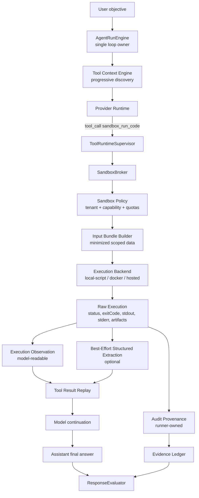

# ADR 0030: OpenClaw/Hermes-Style Sandbox Observation Runtime

Status: Proposed

Date: 2026-06-05

Refines: ADR 0016 Manifest-Scoped Sandbox Tool, ADR 0025 OpenClaw-Style Evidence-First Response Loop, ADR 0026 Real Manifest-Scoped Sandbox Runtime, ADR 0029 Runner-Owned Evidence Main Loop Upgrade

## Context

Recent sandbox-backed finance runs exposed a design mistake in the current sandbox evidence contract.

The specific failure pattern:

- the model correctly chose `sandbox_run_code` for a derived ROI calculation;
- the sandbox really executed model-authored Python;
- the process exited with `exitCode=0`;
- stdout contained a usable calculation result;
- the run still failed because the script did not write `output/result.json` with `observedInput.manifestId / bundleId / contentHash / nonce`.

This failure was originally diagnosed as "the script did not consume the manifest". That diagnosis is too strict and partially wrong.

For an agent harness, code execution output is first a **tool observation for the model**. The model can read text, JSON, Markdown, tables and stderr traces from context. A script that prints a correct result should not be rejected only because it did not satisfy a private xox JSON envelope.

The deeper issue is that xox-model currently mixes three different concerns:

1. **Execution observation**: what actually happened when code ran.
2. **Structured extraction**: whether the output can be parsed into fields/tables/artifacts for UI and deterministic checks.
3. **Audit provenance**: what data bundle, runtime and code were provided by the runner.

The current `manifestConsumed` hard gate pretends these are one fact. It also overclaims what the runner can prove. A script can copy an `observedInput` block without using the data. Conversely, a script can compute from previous tool observations or stdout-friendly input and still omit the proof block. The runner can prove what it mounted and executed; it cannot prove semantic consumption from a model-authored proof field.

## Reference Findings

### Hermes Agent

Local reference: `C:\Github\hermes-agent`.

Relevant files/docs:

- `tools/code_execution_tool.py`
- `website/docs/user-guide/features/code-execution.md`
- `agent/conversation_loop.py`

Reusable practices:

- `execute_code` really runs Python in a child process or remote backend.
- The model-authored script communicates through normal stdout/stderr.
- Only the script's stdout returns to the model; intermediate tool results stay out of the context window.
- Execution result includes status, output, tool-call count, duration and errors.
- Non-zero exit code, timeout and interruption return structured failure observations so the model can repair or rewrite.
- Environment scrubbing, output caps and process termination are runner-owned.

Direct implication for xox-model:

- Do not require model-authored scripts to produce a private result envelope before the model can read the result.
- Preserve stdout/stderr as first-class observations.
- Let runtime safety and audit live outside the script.

### OpenClaw

Local reference: `C:\Github\openclaw`.

Relevant files:

- `packages/agent-core/src/agent-loop.ts`
- `packages/agent-core/src/types.ts`
- `src/plugin-sdk/tool-payload.ts`
- `packages/tool-call-repair/src/*`

Reusable practices:

- The canonical loop is assistant tool call -> runtime execution -> tool result -> model continuation.
- `details` is preferred when present, but content text is a valid fallback.
- JSON text may be parsed opportunistically; non-JSON text remains usable as text.
- Tool result repair and provider payload repair are runtime concerns.
- `beforeToolCall` / `afterToolCall` hooks may block, transform or mark errors, but they do not require every tool to fit one output shape.

Direct implication for xox-model:

- Treat sandbox stdout/stderr as observation content.
- Prefer structured output when available, but do not make it the only successful result form.
- Keep final answers model-authored after tool observations are replayed.

### OpenAI Agents JS

Local reference: `C:\Github\openai-agents-js`.

Relevant ideas:

- Tool execution, guardrails, tracing, approvals and sandbox boundaries are runner-side capabilities.
- Sandbox sessions have workspace/session/manifest/capability boundaries.
- The outer runner owns continuation and final state.

Direct implication for xox-model:

- Keep `AgentRunEngine` as the only loop owner.
- Keep sandbox execution behind the current `SandboxBroker`.
- Do not let sandbox output bypass confirmation cards, domain services or audit for durable writes.

## Decision

Adopt a **Sandbox Observation Runtime** that treats executed code output as a model-readable observation first, with structured extraction and provenance as separate layers.

This ADR does not remove the SaaS safety boundary from ADR 0016 or the real execution requirement from ADR 0026. It changes the success and evidence contract:

```text
Real execution + readable output is enough for model reasoning.
Structured output is an optional enhancement.
Runner-owned provenance is audit metadata, not a model-authored proof requirement.
```

## Architecture



## Contract Split

### 1. Execution Observation

The sandbox tool must always return an execution observation to the model after code runs or fails.

Canonical fields:

```ts
type SandboxExecutionObservation = {
  observationType: 'sandbox_execution';
  executionMode: 'executed' | 'not_executed';
  status: 'completed' | 'failed' | 'blocked' | 'timeout' | 'cancelled';
  backendId: string;
  sessionId: string;
  exitCode: number | null;
  durationMs: number;
  stdout: string;
  stderr: string;
  outputText: string;
  artifacts: SandboxArtifactRef[];
};
```

Model-readable success:

```text
executionMode == executed
status == completed
exitCode == 0
and at least one of stdout, outputText, parsedOutput or artifacts is non-empty
```

This is sufficient for the model to continue and answer the user.

### 2. Structured Extraction

Structured extraction is optional and best-effort.

Extraction order should follow the OpenClaw payload idea:

1. explicit structured result file, if present;
2. JSON parsed from stdout, if stdout is JSON;
3. table/Markdown/text summarization, if practical;
4. raw text fallback.

Canonical fields:

```ts
type SandboxStructuredExtraction = {
  extractionStatus: 'parsed' | 'text_only' | 'empty' | 'failed';
  parsedOutput?: unknown;
  tables?: Array<{ name: string; rows: unknown[] }>;
  summary?: string;
  warnings?: string[];
};
```

Structured extraction helps UI previews, deterministic tests and later business action drafts. It is not required for ordinary model-readable reasoning.

### 3. Audit Provenance

Provenance is runner-owned and should not depend on script-authored proof.

Replace the hard semantic meaning of `manifestConsumed` with runner-owned facts:

```ts
type SandboxAuditProvenance = {
  manifestId: string;
  bundleId: string;
  bundleContentHash: string;
  inputBundleMounted: boolean;
  codeHash: string;
  stdoutHash?: string;
  stderrHash?: string;
  outputArtifactHashes: string[];
  capabilityProfile: SandboxCapabilityProfile;
  resourceUsage?: {
    stdoutBytes: number;
    stderrBytes: number;
    memoryBytesPeak?: number;
    cpuMs?: number;
  };
};
```

Important invariant:

```text
The runner can prove what it mounted and what code/output it observed.
The runner cannot prove semantic input consumption from a model-authored field.
```

## Evaluator Rules

The response evaluator should reason over observation usability, not private output shape.

### Valid for model reasoning

A sandbox result can ground a final assistant answer when:

- code really executed;
- status completed;
- exit code is zero;
- output is non-empty and available to the model as tool result content;
- the final assistant answer is produced after the observation replay.

### Valid for structured UI/evidence

A sandbox result is valid for structured UI or deterministic follow-up when:

- it is valid for model reasoning; and
- structured extraction succeeded or enough typed artifacts exist.

### Invalid or repairable

The evaluator should ask the main loop to continue or repair when:

- execution failed with stderr/traceback;
- output is empty;
- the final assistant answer ignores the sandbox observation;
- the answer makes numeric claims not supported by the sandbox output or domain reads;
- a business write is attempted from sandbox output without an action confirmation card.

It should not reject a completed sandbox run solely because `result.json` is absent.

## Repair Semantics

Code execution failures are normal agent work, not product failure by default.

| Condition | Tool observation | Next-loop behavior |
| --- | --- | --- |
| Syntax/runtime exception | `status=failed`, stderr included | Model may patch or rewrite code. |
| Timeout | `status=timeout`, partial stdout/stderr included | Model may reduce work or ask user. |
| Empty output | `status=completed`, `outputText=''`, warning | Model may rerun with explicit print/output. |
| Text output, no JSON | `status=completed`, `extractionStatus=text_only` | Model can answer from text. |
| JSON stdout | `status=completed`, `extractionStatus=parsed` | Model can answer; UI can show fields. |
| Artifacts only | `status=completed`, artifacts listed | Model can inspect or summarize artifact metadata. |
| Business write requested | sandbox observation only | Model must call normal action tool to create confirmation card. |

The model decides whether to edit or rewrite code from the returned observation. The runner supplies the facts and enforces loop limits.

## Module Changes

This is a targeted refinement, not a new runtime.

### Contracts

Edit `packages/contracts/src/index.ts`:

- add `SandboxExecutionObservation`;
- add `SandboxStructuredExtraction`;
- add `SandboxAuditProvenance`;
- deprecate `manifestConsumed` as a hard evaluator field;
- keep backward-compatible fields only during migration and remove the hard gate after tests are updated.

### Sandbox Runtime

Edit:

- `apps/api/src/agent/sandbox/result-parser.ts`
- `apps/api/src/agent/sandbox-service.ts`
- `apps/api/src/agent/sandbox/backends/local-script-backend.ts`
- `apps/api/src/agent/sandbox/backends/docker-backend.ts`

Changes:

- always preserve stdout/stderr as model-readable output;
- parse `result.json` if present;
- parse stdout as JSON if possible;
- otherwise return text-only extraction;
- record runner-owned provenance from mounted bundle and observed output;
- do not require script-authored `observedInput` to consider execution usable.

### Evidence Ledger

Edit `apps/api/src/agent/evidence-ledger.ts`.

Changes:

- split evidence validity into:
  - `valid_for_model_reasoning`;
  - `valid_structured`;
  - `invalid`;
- keep sandbox observations as sandbox authority even when structured extraction fails;
- do not downgrade invalid or text-only sandbox results to domain reads;
- store provenance facts separately from parsed facts.

### Response Evaluator

Edit `apps/api/src/agent/response-evaluator.ts`.

Changes:

- if a sandbox-backed calculation is required, require usable sandbox observation, not private manifest proof;
- accept text-only sandbox output for final answer grounding;
- require structured extraction only when a later action/UI path needs typed fields;
- if output is empty or the final answer ignores the observation, continue/repair.

### Transcript

Edit transcript projection only if needed:

- show stdout/text output under the sandbox tool row;
- show structured extraction when available;
- do not expose `manifestConsumed` as a user-facing failure reason.

## Relationship To Existing ADRs

### ADR 0016

Preserved:

- manifest-scoped input;
- no production DB/API/secrets/session access;
- no business writes from sandbox;
- output is an observation.

Refined:

- "manifest-scoped" means the runner controls mounted input and capability policy.
- It does not mean every script must emit a model-authored manifest proof.

### ADR 0026

Preserved:

- fake backend must not satisfy real sandbox runs;
- code must really execute;
- stdout/stderr/status must come from the runtime.

Refined:

- `result.json` is preferred, not mandatory.
- raw stdout can be valid model-readable calculation evidence.
- "structured calculation requirements" should be split from "answer grounding requirements".

### ADR 0029

Preserved:

- the main loop is runner-owned;
- observations must replay before final assistant answers;
- invalid observations must not disappear.

Refined:

- invalidity must be about actual failure, empty output, policy violation or unsupported final claims.
- absence of private `observedInput` is not by itself a failed calculation.

## Implementation Plan

1. **Contract first**
   - Add the three sandbox output layers to `packages/contracts`.
   - Update tests to express text-only sandbox success and structured extraction success separately.

2. **Parser and backend refinement**
   - Make `result-parser.ts` produce `ExecutionObservation + StructuredExtraction + Provenance`.
   - Preserve existing helper-based `result.json` path as an optimized path.
   - Add stdout JSON and raw text fallback.

3. **Evidence ledger migration**
   - Replace `manifestConsumed` hard gate with observation usability checks.
   - Keep provenance fields for audit/debug but remove them from completion pass/fail logic.

4. **Evaluator loop**
   - Require final assistant answer after sandbox observation.
   - Accept text-only sandbox observation when it grounds the answer.
   - Repair on empty output, failed code, or unsupported final claims.

5. **Transcript polish**
   - Render text output as the tool return.
   - Render parsed output when present.
   - Keep audit/provenance details in technical logs, not the main user lane.

6. **Documentation and lessons**
   - Update ADR 0016/0026 references if implementation changes the public contract.
   - Record the preventive rule in `.agent/lessons.md`.

## Acceptance Criteria

- A sandbox script that prints a JSON object to stdout and does not write `result.json` is accepted as a completed sandbox observation and can ground a final model-authored answer.
- A sandbox script that prints a human-readable table or Markdown result is accepted as text-only observation and can ground a final model-authored answer.
- A sandbox script with syntax/runtime error returns stderr/traceback as a failed tool observation, and the model can retry within loop limits.
- A sandbox script with empty output does not complete the answer; the loop asks the model to repair or fails cleanly after budget.
- `result.json` with structured output still works and is preferred for UI/table/artifact rendering.
- `manifestConsumed=false` or missing `observedInput` no longer fails a run by itself.
- Runner-owned provenance records mounted input bundle id/hash, code hash, stdout/stderr hashes and backend/session facts.
- Sandbox output never writes durable business state; business changes still require normal action tools and confirmation cards.
- User-facing transcript shows the real sandbox output, not a private manifest proof error.
- Tests cover stdout JSON, stdout text, result.json structured output, empty output, failed execution and final-answer grounding.

## Non-Goals

- Do not add arbitrary internal API access to sandbox code.
- Do not add tool RPC from sandbox into xox business tools.
- Do not let sandbox artifacts become durable workspace state without confirmation.
- Do not create a second Agent loop for sandbox.
- Do not force all future code execution through one vendor's sandbox API.

## Design Principle

```text
Sandbox is a real execution tool.
Execution output is observation.
Structure is optional extraction.
Provenance is runner-owned audit.
Only confirmed Agent actions write business state.
```
