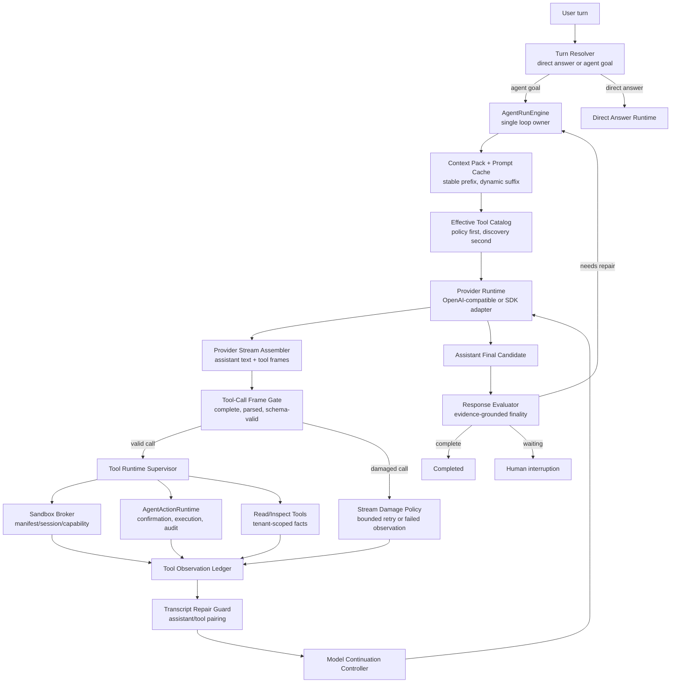

# ADR 0031: OpenClaw/Hermes Streamed Tool-Call Observation Runtime

Status: Accepted / Implemented

Date: 2026-06-07

Refines: ADR 0006 OpenClaw-Style Streamed Tool Call Repair, ADR 0016 Manifest-Scoped Sandbox Tool, ADR 0018 AgentRunEngine v2 Single-Loop Harness, ADR 0020 Progressive Tool Discovery Runtime, ADR 0021 Turn Lane Resolution and Direct Answer Runtime, ADR 0023 OpenClaw-Style Converged Single-Loop Harness, ADR 0025 OpenClaw-Style Evidence-First Response Loop, ADR 0028 OpenClaw/Hermes Effective Tool Catalog Runtime, ADR 0029 Runner-Owned Evidence Main Loop Upgrade, ADR 0030 OpenClaw/Hermes-Style Sandbox Observation Runtime

## Context

Recent runs exposed two related runtime flaws:

1. A model can correctly select a long structured tool such as `sandbox_run_code`, but provider streaming can truncate or corrupt the tool-call arguments before the runtime has a complete executable call.
2. Once a tool call is damaged, the current harness can still drift into a weak final answer path if another read observation exists, instead of treating the missing or invalid tool observation as a required repair point.

This is not a sandbox-only problem and should not be fixed with another local branch such as "if sandbox then special retry". It is a general tool-call observation runtime problem:

```text
assistant tool call
-> provider stream assembly
-> validation
-> execution or explicit non-execution observation
-> model-visible tool observation
-> model continuation
-> final assistant answer
```

The goal is to absorb the mature runtime ideas from OpenClaw, Hermes Agent and OpenAI Agents JS while preserving xox-model's existing SaaS assets:

- TypeScript backend;
- `AgentRunEngine` single-loop ownership;
- progressive tool discovery;
- tenant-scoped memory kernel;
- editable confirmation cards;
- manifest-scoped sandbox contract;
- server-owned action graph, audit and transcript projection.

The change should not create a second runtime adapter, a domain intent router, or a patchwork of tool-specific recovery rules.

## Reference Findings

### OpenClaw

Local reference: `C:\Github\openclaw`.

Relevant files/docs reviewed:

- `docs/concepts/agent-loop.md`
- `src/agents/session-transcript-repair.ts`
- `src/agents/session-tool-result-guard.ts`
- `src/agents/session-tool-result-state.ts`
- `src/agents/transport-stream-shared.ts`
- `src/agents/tool-replay-repair.live.test.ts`

Reusable ideas:

- One serialized session loop owns intake, context assembly, model inference, tool execution, streaming, persistence and terminal state.
- User-visible streams are separated into `assistant`, `tool` and `lifecycle`.
- Tool start/update/end events are runtime events, not assistant prose.
- Tool result content is model-visible; `details` is runtime/UI metadata.
- Missing or displaced tool results are repaired at transcript boundaries by inserting synthetic error tool results only to satisfy provider replay shape.
- Pending tool calls are tracked until matching tool results arrive or a strict boundary flushes them.
- Oversized tool results are capped/redacted before persistence while preserving a model-readable result.
- `before_tool_call`, `after_tool_call` and `tool_result_persist` are runner-side hooks, not tool-local hidden logic.

Direct implication for xox-model:

- Use OpenClaw's transcript-repair and pending-tool-result patterns as the shape for xox-model's provider-neutral tool-call observation ledger.
- Synthetic repair results must be marked as synthetic errors and must never count as successful evidence.
- Preserve clean assistant/tool/lifecycle separation in persisted runtime events and UI projection.

### Hermes Agent

Local reference: `C:\Github\hermes-agent`.

Relevant files/tests reviewed:

- `agent/conversation_loop.py`
- `tools/tool_executor.py`
- `tests/run_agent/test_partial_stream_finish_reason.py`
- `tests/run_agent/test_streaming_tool_call_repair.py`
- `tests/run_agent/test_tool_call_guardrail_runtime.py`

Reusable ideas:

- Streaming truncation is detected before execution.
- If a tool call is incomplete or its JSON arguments are clearly truncated, Hermes refuses to execute it.
- Bounded retries are provider/runtime behavior, not a user-facing retry loop.
- Invalid JSON caused by model formatting can be retried; after retry exhaustion, Hermes injects tool error results so the model can correct itself.
- A tool call followed by no useful assistant text is continued until the model processes the tool results.
- Tool failures remain observations for the model; the agent can decide whether to fix, rewrite or choose a different valid path.
- Conversation history is repaired before provider calls to keep assistant/tool role pairing valid.

Direct implication for xox-model:

- A streamed tool-call argument fragment is progress, not executable state.
- xox-model must not execute a tool call until arguments are complete, parsed and schema-valid.
- A damaged tool call must either be retried into a valid provider-native tool call or become a model-visible failed tool observation.
- The final answer must be generated after the model sees the valid or failed observation.

### OpenAI Agents JS

Local reference: `C:\Github\openai-agents-js`.

Relevant files/docs reviewed:

- `packages/agents-core/src/runner/runLoop.ts`
- `packages/agents-core/src/runner/turnResolution.ts`
- `packages/agents-core/src/runner/toolExecution.ts`
- `packages/agents-core/src/runner/streamReconciliation.ts`
- `packages/agents-core/src/runner/toolSearch.ts`
- `packages/agents-core/src/sandbox/*`
- `docs/src/content/docs/guides/sandbox-agents.mdx`
- `docs/src/content/docs/guides/streaming.mdx`
- `docs/src/content/docs/guides/tools.mdx`

Reusable ideas:

- Tool execution, parse errors, approvals, guardrails, tracing and tool outputs are runner-owned capabilities.
- Tool argument parse failures become function-call output items that the model can observe, instead of crashing or pretending the tool succeeded.
- Stream abort reconciliation tracks pending function calls and can produce incomplete function-call outputs for replay consistency.
- Tool search/deferred tools are runner-side catalog compression, not domain-specific permission logic.
- Sandbox work has explicit workspace/session/manifest/capability boundaries.

Direct implication for xox-model:

- Keep OpenAI SDK-specific types out of `packages/contracts`, but reuse the runner-side boundary shape.
- The xox runtime should own parse errors, approval interruption, guardrails, tracing, sandbox scope and observation replay.
- Domain tools should stay simple: validate domain inputs, return observations, and never decide the next loop step.

## Decision

Adopt a **Streamed Tool-Call Observation Runtime** under the single `AgentRunEngine` loop.

The runtime has one job:

```text
Convert provider-emitted tool-call intent into either:
1. a validated, executed tool observation; or
2. a validated, model-visible non-execution observation.
```

It must never:

- execute incomplete tool arguments;
- silently drop provider-emitted tool calls;
- treat tool output as the final assistant answer;
- let a synthetic transcript repair result satisfy evidence requirements;
- fall back to local text heuristics or keyword routing;
- broaden tool authority after discovery damage;
- let evaluator repair loops decide the next tool outside the main loop.

## Relationship To Existing ADRs

### ADR 0016 Manifest-Scoped Sandbox Tool

Retained.

ADR 0031 does not weaken SaaS sandbox isolation. Manifest/session/capability boundaries remain the execution contract. The sandbox is one kind of tool runtime under the same observation ledger.

### ADR 0018 AgentRunEngine v2 Single-Loop Harness

Retained and strengthened.

The new runtime is not a second loop. It is a phase inside `AgentRunEngine`:

```text
provider call -> tool-call frame assembly -> tool runtime -> observation replay -> model continuation
```

### ADR 0020 Progressive Tool Discovery Runtime

Retained.

Tool discovery decides the effective and materialized tool surface. ADR 0031 starts after the provider has emitted a concrete tool-call intent.

Tool discovery may retry or materialize deferred tools, but it must still hand a concrete, executable catalog to the tool-call runtime.

### ADR 0021 Turn Lane Resolution and Direct Answer Runtime

Retained.

Direct answer remains the fast path for greetings, identity/capability answers, and ambient date/time questions that do not need workspace facts. ADR 0031 applies after the run enters a tool-capable lane.

### ADR 0028 Effective Tool Catalog Runtime

Retained.

The tool-call runtime consumes the effective catalog produced by ADR 0028. Unknown or deferred tool calls are catalog errors, not semantic intent hints.

### ADR 0029 Runner-Owned Evidence Main Loop Upgrade

Refined.

Evidence obligations should be derived from:

1. structured goal facts;
2. actual tool trajectory;
3. final answer claims;
4. pending confirmations or clarifications;
5. evaluator findings from prior loop turns.

ADR 0031 makes actual tool trajectory reliable by producing a typed observation for every accepted tool-call intent.

### ADR 0030 Sandbox Observation Runtime

Retained, with a narrower boundary.

ADR 0030 defines how a real sandbox execution becomes model-readable evidence. ADR 0031 defines how the runtime reaches that execution or records why it could not.

If a sandbox tool call is truncated before execution, ADR 0031 owns recovery. If sandbox code executes and returns stdout/stderr/artifacts, ADR 0030 owns observation semantics.

## Target Architecture



The canonical loop is intentionally small:

```text
resolve lane
-> prepare context and tool surface
-> call model
-> execute/observe tools
-> continue model
-> evaluate final answer
-> finish, wait or repair
```

All other modules are collaborators inside this loop. They do not decide "what happens next" independently.

## Core Contracts

### ToolCallFrame

Provider deltas are assembled into frames before any execution.

```ts
type ToolCallFrame = {
  id: string;
  providerCallId?: string;
  index: number;
  name: string | null;
  argumentText: string;
  argumentObject?: unknown;
  status: 'assembling' | 'complete' | 'truncated' | 'malformed' | 'aborted';
  damage?: {
    kind:
      | 'provider_stream_interrupted'
      | 'provider_length_stop'
      | 'invalid_json'
      | 'schema_invalid'
      | 'unknown_tool'
      | 'catalog_deferred'
      | 'tool_observation_missing';
    message: string;
    retryable: boolean;
  };
  providerMeta: {
    provider: string;
    model: string;
    finishReason?: string;
    responseId?: string;
  };
};
```

Naming rule:

- use concrete runtime names such as `provider_stream_interrupted`, `invalid_json`, `tool_observation_missing`;
- avoid vague legacy names that hide whether the failure came from the stream, catalog, schema or observation path;
- avoid domain-specific names in provider/runtime contracts.

### ToolObservation

Every accepted tool-call intent ends in a tool observation.

```ts
type ToolObservation = {
  id: string;
  toolCallId: string;
  toolName: string;
  status:
    | 'completed'
    | 'failed'
    | 'blocked'
    | 'not_executed'
    | 'invalid_arguments'
    | 'interrupted';
  authority: 'domain_read' | 'sandbox' | 'agent_action' | 'clarification' | 'runtime';
  modelVisible: {
    contentType: 'text' | 'json' | 'mixed';
    text: string;
    json?: unknown;
  };
  runtimeOnly?: {
    synthetic?: boolean;
    redacted?: boolean;
    truncated?: boolean;
    retryCount?: number;
    traceEventIds?: string[];
  };
  evidence?: {
    valid: boolean;
    invalidReasons?: string[];
    claimsSupported?: string[];
  };
};
```

Important invariants:

- A synthetic transcript repair observation has `runtimeOnly.synthetic = true` and `evidence.valid = false`.
- Tool results are model context, not user answers.
- UI projection may summarize observations, but the model must receive the model-visible observation before final answering.

### ToolCallDamagePolicy

The runtime handles damaged tool calls through a provider-neutral policy.

```ts
type ToolCallDamageDecision =
  | { type: 'retry_provider_call'; reason: string; retrySurface: 'same_tools' | 'single_tool' | 'non_stream' }
  | { type: 'materialize_deferred_tool'; toolName: string }
  | { type: 'append_failed_observation'; observation: ToolObservation }
  | { type: 'fail_run'; reason: string };
```

Rules:

1. If stream ends before a complete tool-call frame exists, do not execute.
2. If a provider-selected tool name is known but arguments are truncated, retry with the narrowest equivalent tool surface.
3. If a provider repeatedly emits malformed but complete JSON, append an invalid-arguments observation and let the model correct.
4. If a provider calls a tool outside the effective catalog, materialize only if the catalog says it is deferred and permitted. Otherwise append a failed runtime observation.
5. If a required observation remains missing after bounded repair, fail closed.

## Hermes-Inspired Stream Truncation Handling

### Detection

The stream assembler should mark a frame damaged when:

- the provider stream ends while a tool argument buffer is open;
- `finish_reason` or provider status indicates length/incomplete;
- the argument text cannot be parsed and appears cut off;
- a tool name is present but schema validation cannot run because arguments are incomplete;
- a transport error occurs after tool-call deltas were observed.

### Recovery

Use a bounded retry policy:

```text
first damage:
  retry once with the same effective catalog and a non-stream or single-tool surface when supported

second damage:
  retry once with the already observed provider-selected tool, if policy permits

after retry budget:
  append failed tool observation and continue the model, or fail closed if the observation is required for the final answer
```

This is intentionally not:

```text
retry broad catalog
retry with local regex intent extraction
execute partial JSON
ask user to restate the request
pretend the read observation is enough
```

### Model continuation

If a damaged tool call becomes a failed observation, the model sees the failure in normal tool-result form. It can:

- retry with smaller arguments;
- use a different permitted tool;
- explain that it cannot complete;
- ask for clarification only when a real user fact is missing.

The model should not receive a user-message-style shim for routine runtime repair unless the provider protocol requires it. Prefer assistant/tool role pairing.

## OpenClaw-Inspired Transcript Repair

Before each provider call, the runtime must repair the replay transcript:

```text
assistant tool calls
-> matching tool observations immediately after
-> duplicate or orphan tool observations dropped from replay
-> missing observations synthesized only as marked error observations
-> provider-owned thinking preserved when replay-safe
```

The repair guard owns replay shape only. It does not rewrite trusted domain payloads, does not infer user intent, and does not transform a missing result into success.

Expected behavior:

- real late-arriving observations replace synthetic missing observations;
- synthetic observations are excluded from evidence success;
- large observation details are capped/redacted for persistence;
- model-visible text remains available to the model;
- `assistant`, `tool` and `lifecycle` streams stay separate.

## Sandbox Semantics

For sandbox tools, this ADR adopts the following boundary:

```text
Tool-call runtime decides whether a complete sandbox call exists.
Sandbox broker decides whether code can execute.
Sandbox observation runtime records stdout/stderr/artifacts.
Response evaluator decides whether final answer is grounded.
```

The sandbox tool should really execute code when policy permits. It should not be a fake backend or contract-only simulator.

The sandbox result does not have to be valid JSON for the model to understand it. JSON, tables and artifacts are useful, but stdout/stderr text is still a valid observation form. Structured extraction is an enhancement, not the only truth path.

However, if a goal requires sandbox computation and the sandbox call never produced a valid executed observation, the evaluator must not pass the final answer on domain reads alone.

## Evidence And Evaluator Rules

The evaluator should inspect both trajectory and final claims.

### Required evidence sources

Evidence requirements come from:

- structured goal facts;
- actual tool-call trajectory;
- action graph state;
- sandbox/read/action observations;
- final assistant claims;
- pending confirmation or clarification state.

### Fail-closed conditions

The run cannot complete when:

- a provider-emitted tool call was dropped without a tool observation;
- a required `sandbox_run_code` call was truncated and never repaired;
- a synthetic missing-tool observation is the only evidence for a required tool;
- the final answer makes a calculation claim not supported by read or sandbox observations;
- a pending confirmation card or clarification is still waiting;
- an auto-executed action has no audit and observation record.

### Repair conditions

The run may continue when:

- a tool returned a normal failure observation and the model can fix the call;
- the model needs a smaller tool call after Hermes-style truncation;
- a deferred tool must be materialized under the same effective catalog;
- transcript repair inserted a synthetic error only to let the next provider call proceed.

## Reuse Plan

### Reuse From OpenClaw

Prefer direct small-module ports after license verification:

- tool-call ID extraction and normalization patterns;
- pending tool-call state;
- transcript pairing repair;
- synthetic missing-result marker shape;
- tool-result size/redaction guard;
- assistant/tool/lifecycle stream separation concepts;
- live replay tests that send repaired history to real providers.

Do not reuse:

- OpenClaw's local control plane;
- broad host shell authority;
- local filesystem session store;
- plugin/channel infrastructure;
- single-user memory assumptions.

### Reuse From Hermes Agent

Prefer behavior and test-pattern ports:

- partial stream stub detection;
- dropped tool names in stream damage metadata;
- invalid JSON retry budget;
- "do not execute truncated args" rule;
- tool-result recovery after invalid arguments;
- post-tool continuation when the model returns no final answer;
- same-tool failure guidance as model-visible tool observation.

Only copy code directly after license review. If direct code reuse is not appropriate, port the behavior into TypeScript with tests that mirror Hermes cases.

### Reuse From OpenAI Agents JS

Prefer SDK/runtime boundary reuse:

- runner-owned tool execution shape;
- function parse error as tool result;
- tool input/output guardrail boundary;
- approval/interruption handling shape;
- stream abort reconciliation idea;
- sandbox workspace/session/manifest/capability boundary;
- deferred tool loading and tool search concepts.

Do not leak SDK-specific protocol types into `packages/contracts`. Keep xox-model contracts provider-neutral.

## Implementation Plan

This ADR is a design proposal. Implementation should be staged after review.

### Milestone 1: Contracts And Trace Shape

Edit:

- `packages/contracts/src/index.ts`
- `apps/api/src/agent/runtime-trace-events.ts`
- `docs/adr/0031-openclaw-hermes-streamed-tool-call-observation-runtime.md`

Add:

- `ToolCallFrame`
- `ToolObservation`
- `ToolCallDamageDecision`
- provider-neutral damage reasons;
- transcript stream categories `assistant | tool | lifecycle` if not already canonical.

Validation:

- contracts type tests compile;
- no SDK-specific OpenAI/OpenClaw/Hermes types leak into public contracts.

### Milestone 2: Provider Stream Frame Assembler

Edit or add under:

- `apps/api/src/agent/runtime/`
- `apps/api/src/agent/provider-runtime/`
- `apps/api/tests/provider-runtime.test.ts`

Implement:

- per-call-index/id argument assembly;
- complete/truncated/malformed statuses;
- provider finish-reason classification;
- Hermes-style retry decisions.

Validation:

- simulated truncated streamed `sandbox_run_code` arguments are not executed;
- non-stream retry can recover a complete call;
- repeated truncation becomes a failed observation.

### Milestone 3: Observation Ledger

Edit or add under:

- `apps/api/src/agent/runtime/`
- `apps/api/src/agent/tool-gateway.ts`
- `apps/api/tests/agent-transcript.test.ts`

Implement:

- one observation per accepted tool-call intent;
- model-visible text/json separation from runtime-only details;
- evidence validity separate from observation authority;
- synthetic observations excluded from success evidence.

Validation:

- tool result is replayed to model before final response;
- final assistant message is never created from raw tool result text alone.

### Milestone 4: Transcript Repair Guard

Edit or add under:

- `apps/api/src/agent/runtime/`
- `apps/api/src/agent/thread-store.ts`
- `apps/api/tests/provider-runtime.test.ts`

Implement OpenClaw-style pairing repair:

- assistant tool calls matched with tool observations;
- displaced observations moved in replay order;
- duplicates/orphans removed from replay;
- synthetic missing observation inserted only for provider replay consistency.

Validation:

- strict provider replay tests pass for missing/displaced tool results;
- synthetic missing observations fail evidence checks.

### Milestone 5: Sandbox Integration

Edit:

- `apps/api/src/agent/sandbox/*`
- `apps/api/src/agent/tool-gateway.ts`
- `apps/api/tests/sandbox-runtime.test.ts`

Implement:

- sandbox executions return stdout/stderr/artifact observations;
- script failures become failed observations for model repair;
- invalid or missing sandbox observations cannot be downgraded to `domain_read`;
- manifest/session/capability metadata remains runner-owned.

Validation:

- script syntax/runtime error is visible to the model as a tool observation;
- the next loop can fix/rewrite code;
- final answer cannot pass without valid sandbox evidence when sandbox was required by trajectory or claims.

### Milestone 6: Response Evaluator Integration

Edit:

- `apps/api/src/agent/response-evaluator.ts`
- `apps/api/src/agent/agent-run-engine.ts`
- `apps/api/tests/api.test.ts`

Implement:

- trajectory-derived evidence requirements;
- incomplete/damaged tool-call blockers;
- pending confirmation/clarification blockers;
- final answer must be model-authored after observations.

Validation:

- runs like `c9eedf22`, `fd85e284` and `d8064e91` cannot pass on weak read-only evidence when sandbox/tool observation is missing;
- ordinary direct-answer turns still bypass the full goal harness.

### Milestone 7: UI Projection

Edit:

- `apps/web/src/components/agent/AgentChatTimeline.tsx`
- `apps/api/src/agent/agent-transcript-projector.ts`
- `apps/api/tests/agent-transcript.test.ts`
- `apps/web/src/components/agent/AgentChatTimeline.test.tsx`

Implement:

- damaged tool calls visible as compact tool rows;
- retry/repair events remain in technical log unless user-actionable;
- final assistant summary appears only after observation continuation;
- assistant/tool/lifecycle streams are not mixed.

Validation:

- user sees tool rows and final model answer in order;
- technical stream damage details are available behind technical log;
- no raw provider chunks or secrets are exposed.

## Acceptance Criteria

### Streamed tool-call truncation

- A streamed tool call with incomplete JSON is never executed.
- The runtime records the damaged tool name and provider metadata.
- The runtime retries within a bounded provider-neutral policy.
- If recovery fails, a model-visible failed observation is appended or the run fails closed.

### Tool observation correctness

- Every provider-emitted tool-call intent either executes or produces a non-execution observation.
- Tool observations are replayed to the model before final answering.
- Synthetic transcript repair observations cannot satisfy evidence requirements.
- Tool output is not displayed or persisted as an assistant answer.

### Sandbox correctness

- `sandbox_run_code` uses a real execution backend when policy permits.
- stdout/stderr/artifacts are model-readable observations.
- Script failures are observations that the model may repair.
- Missing or invalid sandbox evidence blocks final answers that depend on sandbox computation.

### Single-loop correctness

- `AgentRunEngine` remains the only owner of next-step control.
- Provider adapters, transcript repair, sandbox runtime, tool catalog, evaluator and UI projection cannot independently complete the run.
- Automation level only affects execution authority, not planning effort or repair effort.

### Reuse and cleanliness

- Directly reused OpenClaw/Hermes code is license-checked and attributed.
- Copied modules are small, pure runtime helpers, not foreign control planes.
- Deprecated local special cases are removed when replaced.
- No keyword/regex semantic routing is introduced.

### Validation commands after implementation

- `npm.cmd run test:api`
- `npm.cmd run test:web`
- `npm.cmd run build:web`
- targeted real-provider smoke for:
  - truncated streamed `sandbox_run_code`;
  - sandbox script failure then model repair;
  - malformed JSON tool args;
  - missing tool observation replay repair;
  - direct-answer date/time lane.

## Implementation Notes

Implemented in this change:

- `apps/api/src/agent/runtime/tool-call-stream-assembler.ts`
  - Adds provider-neutral `ToolCallFrame` status and damage metadata.
  - Uses the existing OpenClaw-inspired balanced JSON boundary to distinguish complete, truncated, malformed and aborted frames.
- `apps/api/src/agent/runtime/tool-call-repair.ts`
  - Classifies provider argument parse failures as `tool_call_arguments_truncated` or `tool_call_arguments_invalid`.
  - Keeps unknown/deferred/handler-missing catalog failures separate from provider stream failures.
- `apps/api/src/agent/runtime/openai-compatible-chat-adapter.ts`
  - Tracks streamed `finish_reason`, emits tool-call damage trace events, and fails before execution when frames are incomplete.
  - Preserves the single `AgentRunEngine` loop; the adapter only returns typed runtime facts.
- `apps/api/src/agent/runtime/provider-failover-policy.ts`
  - Retries only recoverable provider/tool-call frame failures with non-stream or single-tool requests.
  - Does not retry effective-catalog violations or missing handlers.
- `apps/api/src/agent/runtime-trace-events.ts`
  - Persists damaged tool frames as tool-channel runtime events.
- `apps/api/src/agent/runtime-plan-reader.ts`
  - Shows a specific fail-closed status when model-selected tool calls never form executable arguments.
- `apps/api/tests/provider-runtime.test.ts` and `apps/api/tests/api.test.ts`
  - Cover truncated streamed tool arguments, recoverable retry classification, damage trace emission, and fail-closed malformed non-stream retries.

Validation completed during implementation:

- `npm.cmd run test:api -- provider-runtime`
- `npm.cmd run test --workspace @xox/api -- api.test.ts -t "retries malformed streamed tool-call arguments"`
- `npm.cmd run test --workspace @xox/api -- api.test.ts -t "fails closed instead of returning 500"`
- `npm.cmd run test --workspace @xox/api -- response-evaluator.test.ts`
- `npm.cmd run test:api`
- `npm.cmd run test:web`
- `npm.cmd run test`
- `npm.cmd run build:web`

Remaining validation before release:

- Real-provider smoke for long streamed `sandbox_run_code` once a provider key and network path are confirmed in the runtime environment.

## Risks

- Provider-specific stream formats differ. The frame assembler must be provider-neutral but profile-aware.
- Some providers may not support non-stream retries reliably. The policy must classify that as a failed observation rather than widening tool authority.
- Direct code reuse may be blocked by license or coupling. In that case, port behavior with attribution to source ideas and tests.
- Synthetic transcript repair is easy to misuse as success evidence. Tests must prove it remains invalid for evaluator success.
- Sandbox output can be large or sensitive. OpenClaw-style result capping/redaction is mandatory before persistence and UI projection.

## Non-Goals

- No implementation in this ADR-only step.
- No new domain keyword extraction.
- No fake sandbox backend.
- No replacement of the whole xox-model harness.
- No OpenClaw control-plane import.
- No Hermes single-user memory/runtime import.
- No OpenAI SDK protocol leakage into xox-model public contracts.

## Summary

The desired shape is not another patch for `sandbox_run_code`. It is a clean runner-owned runtime:

```text
Hermes handles damaged streams before execution.
OpenClaw preserves clean assistant/tool/lifecycle streams and repairs transcript pairing.
OpenAI Agents JS keeps parsing, guardrails, approvals, tracing and sandbox boundaries runner-side.
xox-model keeps SaaS tenant isolation, editable confirmation cards, action graph, audit and domain services.
```

This gives xox-model a more mature harness without abandoning its current architecture.
