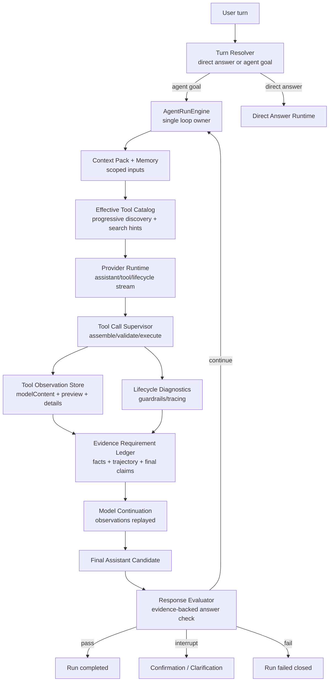
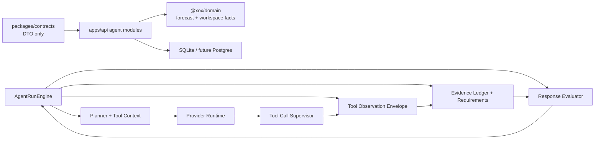

# ADR 0032: OpenClaw/Hermes Runner-Owned Evidence Contract v2

Status: Proposed

Date: 2026-06-07

Refines: ADR 0018 AgentRunEngine v2 Single-Loop Harness, ADR 0020 Progressive Tool Discovery Runtime, ADR 0021 Turn Lane Resolution and Direct Answer Runtime, ADR 0025 OpenClaw-Style Evidence-First Response Loop, ADR 0028 OpenClaw/Hermes Effective Tool Catalog Runtime, ADR 0029 Runner-Owned Evidence Main Loop Upgrade, ADR 0030 OpenClaw/Hermes-Style Sandbox Observation Runtime, ADR 0031 OpenClaw/Hermes Streamed Tool-Call Observation Runtime

## Context

Conversation `f5eed78b` is materially better than earlier weak runs:

- the turn entered the Agent goal lane;
- progressive tool discovery produced a narrow surface: `sandbox_run_code`, `data_query_workspace`, `ask_user_clarification`, `account_forbidden`;
- the model first called `data_query_workspace`;
- the model then called `sandbox_run_code`;
- the sandbox really executed Python with `executionMode=executed` and `exitCode=0`;
- the final assistant answer was generated after tool observations and passed response evaluation.

However it still does not fully match the target Agent OS contract.

The user asked:

```text
给我预测一下，如果目前的通胀率是15%，我的投资回报率是多少？
我是第2个股东，我投入的钱都是银行贷款出来的，银行利率是年利率3%
```

Observed gaps:

1. `goalFacts` stayed empty even though the request required derived calculation and ordered shareholder facts.
2. The sandbox observation persisted to the visible run graph was truncated mid-JSON:

   ```json
   "realROI_noInterest_percent"
   ```

3. A `no_progress` loop guardrail was emitted immediately before the run passed final response evaluation, making the lifecycle look internally inconsistent.

The conclusion is not "add another keyword detector". The deeper issue is that xox-model still lacks one clean runner-owned evidence contract that unifies:

- structured goal facts;
- actual tool trajectory;
- sandbox observation usability;
- final assistant answer claims;
- loop terminal state.

## Reference Findings

### OpenClaw

Local reference: `C:\Github\openclaw`.

Relevant files reviewed:

- `packages/agent-core/src/agent-loop.ts`
- `packages/agent-core/src/types.ts`
- `packages/llm-core/src/types.ts`
- `packages/tool-call-repair/src/stream-normalizer.ts`
- `docs/web/webchat.md`

Reusable ideas:

- The canonical loop is `assistant -> tool calls -> tool results -> assistant continuation`.
- `turn_end` contains the assistant message and the tool results for that turn.
- Tool results have model-visible `content` and optional runtime/UI `details`.
- `beforeToolCall` and `afterToolCall` are runner hooks; they can block, replace or mark tool results, but do not decide the next semantic step outside the loop.
- The UI/transcript separates `assistant`, `tool` and `lifecycle` lanes; WebChat does not write arbitrary status/helper text into the durable model transcript.
- Truncated visible assistant messages can be expanded through a side reader; preview truncation is a display concern, not evidence loss.

Direct implication for xox-model:

- Treat `displayPreview` as UI-only.
- Persist a complete model-readable tool observation separately from preview text.
- Make final assistant text an explicit terminal candidate after observation replay.
- Keep lifecycle diagnostics out of evidence unless they are typed blockers.

### Hermes Agent

Local reference: `C:\Github\hermes-agent`.

Relevant files reviewed:

- `agent/chat_completion_helpers.py`
- `agent/agent_runtime_helpers.py`
- `agent/conversation_loop.py`
- `tools/code_execution_tool.py`
- `AGENTS.md`

Reusable ideas:

- Streaming tool-call deltas are assembled before execution.
- Function names are treated as atomic identifiers; argument deltas are accumulated and repaired before use.
- Unrepairable or truncated tool arguments are not executed.
- Tool result history is sanitized before provider calls: orphaned results are dropped, missing results are stubbed so provider replay stays valid.
- Code execution communicates through stdout/stderr and returns a model-readable observation.
- Tool failures are observations; the model may repair, rewrite or choose another valid route.

Direct implication for xox-model:

- The runner must distinguish executable tool output from display preview.
- A failed or incomplete tool turn must remain visible as a tool observation or blocker, not disappear into a successful final answer.
- We should reuse the Hermes idea of pre-provider transcript hygiene, but avoid its local-computer assumptions and broad host authority.

### OpenAI Agents JS

Local reference: `C:\Github\openai-agents-js`.

Relevant files reviewed:

- `packages/agents-core/src/runner/runLoop.ts`
- `packages/agents-core/src/runner/toolExecution.ts`
- `packages/agents-core/src/runner/turnResolution.ts`
- `packages/agents-core/src/runner/streamReconciliation.ts`
- `packages/agents-core/src/runner/toolSearch.ts`
- `packages/agents-core/src/sandbox/*`

Reusable ideas:

- Tool argument parse errors, approvals, guardrails, tracing and tool outputs are runner-owned.
- Tool outputs are normalized once into structured protocol items.
- Approval interruptions are stateful runner outcomes, not arbitrary tool text.
- Sandbox work is scoped by workspace/session/manifest/capability.
- Deferred tool search is catalog compression, not a second permission system.

Direct implication for xox-model:

- Keep SDK-specific types out of `packages/contracts`, but reuse the runner-side boundary shape.
- `AgentRunEngine` remains the only owner of "continue / interrupt / final / failed".
- Tool discovery, sandbox execution, response evaluation and transcript projection must feed one evidence contract instead of parallel facts.

## Decision

Adopt a **Runner-Owned Evidence Contract v2**.

The contract has four layers:

```text
1. Evidence requirements: what must be proven before final answer.
2. Tool observations: what the environment actually returned.
3. Final answer candidate: model-authored answer after observations.
4. Terminal decision: pass / continue / interrupt / fail.
```

Only `AgentRunEngine` may advance the loop. Supporting modules may add facts, observations or findings, but they cannot independently decide the next step.

## Relationship To Existing ADRs

### Kept

- ADR 0018: one main `AgentRunEngine` loop.
- ADR 0020 / 0028: progressive tool discovery and effective catalog.
- ADR 0021: direct answer lane for trivial ambient turns.
- ADR 0029: evidence obligations derive from trajectory, not only preclassified facts.
- ADR 0030: sandbox stdout/stderr/text output is valid model-readable observation.
- ADR 0031: streamed tool-call damage is detected before execution.

### Moved Into A Single Contract

- Runtime goal facts become one input into an evidence requirement ledger, not the ledger itself.
- Sandbox observation preview becomes UI metadata, not model/evaluator evidence.
- Loop guardrails become typed lifecycle diagnostics that cannot masquerade as completion state.
- Response evaluation becomes the final gate after a named final assistant candidate.

### Removed / Forbidden

- No prose keyword scanners for semantic goal facts.
- No display-preview truncation as the source of model/evaluator evidence.
- No `no_progress` warning after a valid final-answer candidate has already been produced.
- No successful run completion from tool output alone.
- No fallback that broadens tool authority when evidence is missing.

## Target Architecture



This is the same main loop, with a clearer contract boundary. It should be easier to draw and reason about than the current expanded diagram because every side module feeds the loop rather than becoming another loop.

## Contract 1: Evidence Requirement Ledger

Create a runner-owned ledger of required evidence.

Inputs:

- sanitized structured `goalFacts` from the model-selected tool context gateway;
- actual tool trajectory: selected tools, emitted tool calls, executed tool observations, failed/non-executed observations;
- structured tool arguments, not user prose;
- final assistant candidate claims, extracted through a schema-bound evaluator prompt when needed;
- prior evaluator findings.

Non-goals:

- no regex or keyword lists over user language;
- no English/Chinese-specific business phrase matching;
- no local semantic router that bypasses model tool selection.

Example requirements for `f5eed78b`:

```ts
[
  {
    authority: 'domain_read',
    subject: 'shareholder',
    reason: 'Final answer makes a personal shareholder ROI claim.'
  },
  {
    authority: 'sandbox',
    subject: 'calculation',
    reason: 'Trajectory includes sandbox_run_code and final answer contains derived ROI numbers.'
  },
  {
    authority: 'assistant_final',
    subject: 'answer',
    reason: 'Tool observations cannot be the user-facing answer.'
  }
]
```

Implementation target:

- Prefer extending `apps/api/src/agent/evidence-ledger.ts`.
- Add a small module only if necessary: `apps/api/src/agent/evidence-requirements.ts`.
- Continue reading sanitized runtime facts from `apps/api/src/agent/runtime-goal-facts.ts`.
- Store derived requirements in `response_evaluated.data.requiredEvidence` and, if needed for repair, a `runtime_evidence_required` event.

## Contract 2: Tool Observation Envelope

Split every tool observation into three explicit parts:

```ts
type AgentToolObservationEnvelope = {
  toolCallId: string;
  toolName: string;
  status: 'completed' | 'failed' | 'cancelled' | 'not_executed';
  authority: 'domain_read' | 'sandbox' | 'action' | 'memory';
  modelContent: string;
  displayPreview: string;
  details?: unknown;
  rawOutputRef?: {
    storage: 'db' | 'artifact';
    id: string;
    sha256: string;
    bytes: number;
    truncatedForDisplay: boolean;
    truncatedForModel: boolean;
  };
};
```

Rules:

- `modelContent` is what the model receives on observation replay.
- `displayPreview` is only what the transcript row initially shows.
- `details` is structured UI/evaluator metadata when available.
- `rawOutputRef` preserves full stdout/stderr/artifact metadata when the preview is capped.
- A truncated preview must not be counted as evidence content.

For sandbox:

- keep stdout/stderr/outputText as model-readable observation;
- parse JSON stdout opportunistically;
- if the preview must be shortened, make the preview syntactically honest:

  ```json
  {
    "preview": "...",
    "truncatedForDisplay": true,
    "rawOutputRef": "..."
  }
  ```

- never cut JSON in a way that looks like a complete result.

Implementation target:

- `apps/api/src/agent/sandbox-service.ts`: replace `displayPreview(observation)` as the evidence source.
- `apps/api/src/agent/action-graph-store.ts`: persist preview separately from model content/details.
- `apps/api/src/agent/tool-observation-continuation.ts`: replay model content, not display preview.
- `packages/contracts/src/index.ts`: add DTOs only if the frontend needs typed details.

## Contract 3: Final Assistant Candidate

Introduce an explicit final-answer phase inside `AgentRunEngine`.

States:

```ts
type AgentFinalAnswerState =
  | { type: 'none' }
  | { type: 'planning_preface'; text: string }
  | { type: 'candidate'; text: string; afterObservationCount: number }
  | { type: 'accepted'; text: string }
  | { type: 'rejected'; reason: string };
```

Rules:

- A provider assistant message after tool observations is a `candidate`, not another planning row.
- `no_progress` guardrails run only before a final-answer candidate exists.
- `response_evaluated` is the only event that accepts or rejects a candidate.
- `run_completed` requires an accepted final assistant candidate, unless the run is waiting on confirmation or clarification.

Implementation target:

- `apps/api/src/agent/agent-run-engine.ts`: name the candidate phase and suppress `no_progress` after candidate creation.
- `apps/api/src/agent/turn-resolver.ts`: return a final-answer candidate when assistant text appears after observations and no new tool/action rows were produced.
- `apps/api/src/agent/tool-runtime/tool-loop-guardrails.ts`: guardrail should not flag final-candidate turns as no-progress.
- `apps/api/src/agent/agent-transcript-projector.ts`: lifecycle diagnostics stay in technical log; final candidate and accepted answer stay in assistant lane.

## Contract 4: Response Evaluation

`ResponseEvaluator` should evaluate the final answer against the evidence requirement ledger.

Checks:

- If the answer contains derived calculation numbers, there must be valid sandbox evidence or an explicitly accepted domain formula evidence.
- If the answer makes personal/entity-specific claims, there must be ordered entity facts in domain evidence or sandbox input/output details.
- If sandbox evidence exists but is invalid, the run cannot pass on domain read evidence alone.
- If model content is missing but tool observations exist, require final answer continuation.
- If pending confirmations or clarifications exist, return an interruption state instead of completion.

The evaluator may use a schema-bound model check for final-answer claims, but it must be runner-owned and evidence-scoped. It must not become a second planner.

## Module Plan

### Existing Paths To Extend

- `apps/api/src/agent/agent-run-engine.ts`
  - Own final-answer candidate state.
  - Emit clear candidate/evaluation/completion events.

- `apps/api/src/agent/evidence-ledger.ts`
  - Build evidence items and requirements from observations and trajectory.
  - Keep invalid sandbox as sandbox authority.

- `apps/api/src/agent/response-evaluator.ts`
  - Evaluate against explicit requirements.
  - Require ordered entity evidence when final claims are personal/entity-specific.

- `apps/api/src/agent/sandbox-service.ts`
  - Preserve full model-readable output.
  - Separate preview from evidence content.

- `apps/api/src/agent/tool-observation-continuation.ts`
  - Replay observation model content.
  - Do not replay UI-only preview.

- `apps/api/src/agent/tool-runtime/tool-loop-guardrails.ts`
  - Apply no-progress only to turns that have no final candidate and still owe evidence/action.

- `packages/contracts/src/index.ts`
  - Add typed DTOs only for stable frontend-visible observation envelopes and final-answer state.

### New Paths Only If Needed

- `apps/api/src/agent/evidence-requirements.ts`
  - Extract requirement derivation if `evidence-ledger.ts` becomes too broad.

- `apps/api/src/agent/tool-observation-envelope.ts`
  - Extract observation envelope shaping if multiple tools need the same preview/model-content split.

## Dependency Graph



## Reuse Plan

### Reuse From OpenClaw

- `content` vs `details` mental model for tool results.
- `turn_end` style grouping: assistant message plus tool results.
- clean `assistant/tool/lifecycle` lanes.
- runner hooks that transform/block/mark tool observations without taking over loop control.
- display truncation side-reader idea for full message/output expansion.

Do not copy OpenClaw's local control plane, local filesystem authority, plugin runtime, or single-user session assumptions.

### Reuse From Hermes Agent

- streamed tool-call assembly and repair posture;
- strict non-execution of incomplete tool arguments;
- pre-provider transcript hygiene for missing/orphan tool results;
- stdout/stderr-first code execution observation;
- failed tool results as model-readable observations.

Do not copy Hermes' broad local computer authority or prompt-level regex acknowledgements.

### Reuse From OpenAI Agents JS

- runner-owned tool execution, parse errors, approval interruptions and guardrails;
- normalized tool output item shape;
- sandbox workspace/session/manifest/capability boundaries;
- tool search as catalog compression only.

Do not copy OpenAI SDK types into xox contracts or make Responses-only behavior a provider requirement.

## Acceptance Criteria

### `f5eed78b` Class Of Runs

- A run with empty initial `goalFacts` but actual `sandbox_run_code` trajectory still requires valid sandbox evidence before passing.
- A final answer with personal shareholder ROI claims requires ordered shareholder evidence.
- The visible sandbox preview must not be a misleading cut-off JSON fragment.
- Full sandbox stdout/stderr/output or an artifact reference is available for audit and model replay.
- A successful final-answer path must not emit `no_progress` immediately before `response_evaluated pass`.

### Tests

- `apps/api/tests/response-evaluator.test.ts`
  - empty goal facts + sandbox trajectory requires sandbox evidence;
  - personal/entity-specific final answer without ordered entity evidence returns `needs_more_evidence`;
  - invalid sandbox evidence cannot be satisfied by domain-read evidence.

- `apps/api/tests/sandbox-tool.test.ts`
  - stdout JSON is preserved as model-readable content;
  - display preview truncation sets `truncatedForDisplay=true` and does not cut JSON as if complete;
  - `modelContent` remains complete within the configured cap or has an explicit raw output reference.

- `apps/api/tests/tool-runtime.test.ts`
  - a final-answer candidate after observations does not trigger `no_progress`;
  - `no_progress` still fires for a genuine no-observation/no-action repair turn.

- `apps/api/tests/api.test.ts`
  - a finance ROI run follows `data_query_workspace -> sandbox_run_code -> final assistant candidate -> response_evaluated pass`;
  - same run without shareholder facts returns `needs_more_evidence` instead of completion.

### Commands

Expected validation commands after implementation:

```powershell
npm.cmd run test:api -- response-evaluator
npm.cmd run test:api -- sandbox-tool
npm.cmd run test:api -- tool-runtime
npm.cmd run test:api
npm.cmd run test:web
npm.cmd run test
```

## Rollout Plan

1. Add types and tests for evidence requirements and final-answer candidate state.
2. Split sandbox model content from display preview.
3. Extend evidence ledger with requirement derivation from trajectory and final answer claims.
4. Adjust `AgentRunEngine` and `turn-resolver` so final candidates are explicit.
5. Update transcript projection so lifecycle diagnostics stay technical and accepted assistant final stays in the assistant lane.
6. Re-run the `f5eed78b` scenario with a real provider key in the user's local environment.

## Open Questions

- Whether final-answer claim extraction should initially be deterministic over structured final-answer metadata or model-scored with a strict JSON schema. The preferred direction is model-scored because it avoids multilingual keyword routing.
- Whether full raw sandbox output should live in `agent_plan_steps.description` or a dedicated `agent_tool_observations` table. A dedicated table is cleaner if output expansion and audit become first-class UI features.
- Whether the UI should expose raw output via current technical log or a tool-row "full output" drawer. This is a product display decision and should not affect the model/evaluator evidence path.

## Summary

The fix is not another local rule. The fix is to make evidence a first-class runner contract:

```text
tool trajectory + model-readable observation + final assistant candidate + evidence evaluation
```

OpenClaw gives the clean assistant/tool/lifecycle transcript and turn loop. Hermes gives robust tool-call repair and stdout/stderr execution observations. OpenAI Agents JS gives runner-owned guardrail/approval/sandbox boundaries. xox-model should absorb those ideas inside the existing `AgentRunEngine`, not by adding another runtime or by scanning user prose.
