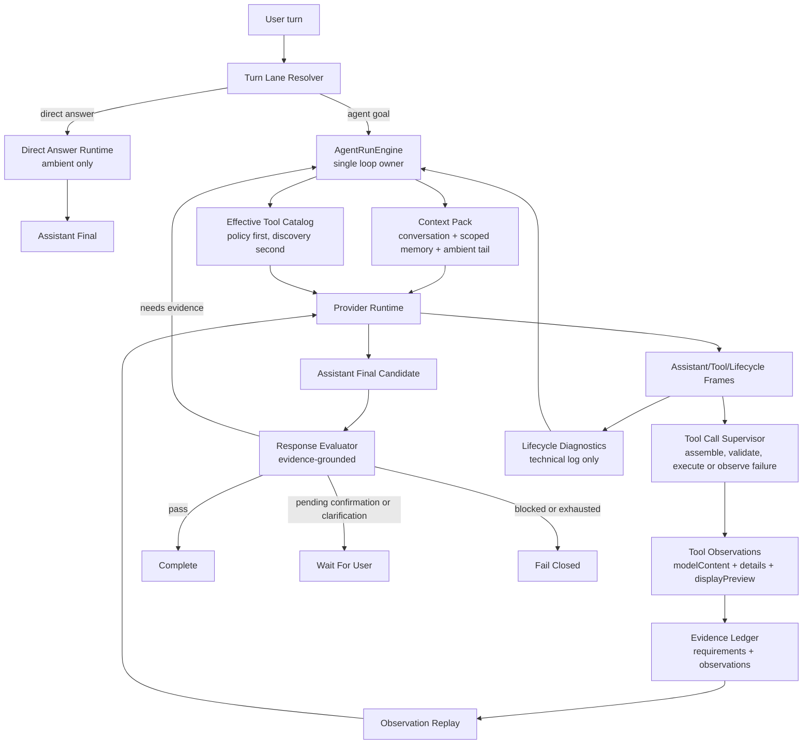

# ADR 0033: OpenClaw/Hermes Canonical Loop And Runtime Hygiene Convergence

Status: Implemented

Date: 2026-06-07

Implementation: 2026-06-07

Refines: ADR 0018 AgentRunEngine v2 Single-Loop Harness, ADR 0020 Progressive Tool Discovery Runtime, ADR 0021 Turn Lane Resolution and Direct Answer Runtime, ADR 0025 Evidence-First Response Loop, ADR 0028 Effective Tool Catalog Runtime, ADR 0029 Runner-Owned Evidence Main Loop Upgrade, ADR 0031 Streamed Tool-Call Observation Runtime, ADR 0032 Runner-Owned Evidence Contract v2

## Context

`xox-model` already has the right major assets:

- TypeScript backend and shared domain/contracts packages;
- one `AgentRunEngine`;
- progressive tool discovery;
- tenant-scoped memory;
- editable confirmation cards;
- manifest-scoped sandbox contract;
- response/evidence evaluation;
- unified transcript and technical log separation.

But recent conversations still show the harness can drift:

- tool observations can be present while the final assistant answer is weak or missing;
- evaluator findings can become user-visible repair prose instead of loop obligations;
- required domain facts such as ordered shareholders can be identified but not converted into the next read observation;
- streamed tool-call damage can be treated as ordinary answer failure instead of a runtime observation failure;
- repair iterations can widen tool surfaces or loop around without a clean canonical shape.

The root issue is not one missing tool or one bad prompt. The root issue is that previous ADRs improved individual pieces, but the implementation still needs one final convergence rule:

```text
OpenClaw provides the canonical loop shape.
Hermes provides provider/tool-call/message hygiene.
OpenAI Agents JS provides runner-side guardrail, tracing, approval and sandbox boundaries.
All three must feed the single xox-model AgentRunEngine, not create side loops.
```

## Reference Findings

### OpenClaw

Local reference: `C:\Github\openclaw`.

Relevant files reviewed:

- `packages/agent-core/src/agent-loop.ts`
- `packages/agent-core/src/types.ts`
- `packages/agent-core/src/harness/agent-harness.ts`
- `docs/concepts/agent-loop.md`

Reusable implementation ideas:

- The canonical loop is `assistant -> tool calls -> tool results -> assistant continuation`.
- `turn_end` contains the assistant message and matching tool results.
- Tool results have model-visible `content` and runtime/UI `details`.
- `beforeToolCall` and `afterToolCall` are runner hooks. They can block or transform a tool result, but they do not decide the next semantic step outside the loop.
- Tool-not-found, blocked tools, invalid arguments and execution errors become error tool results that are fed back to the model.
- `prepareNextTurn` and `shouldStopAfterTurn` are loop-owned extension points, not sidecar evaluators.
- Assistant, tool and lifecycle events stay separate.

Do not copy:

- local control plane;
- local filesystem/session assumptions;
- host shell authority;
- plugin/channel infrastructure that does not fit SaaS tenancy.

License note:

- OpenClaw is MIT licensed. Small pure modules or shapes can be ported with attribution when useful. Do not import its control plane.

### Hermes Agent

Local reference: `C:\Github\hermes-agent`.

Relevant files reviewed:

- `agent/conversation_loop.py`
- `agent/tool_executor.py`
- `agent/chat_completion_helpers.py`
- `agent/agent_runtime_helpers.py`
- `agent/tool_dispatch_helpers.py`
- `tools/tool_search.py`
- `tools/code_execution_tool.py`

Reusable implementation ideas:

- Tool execution appends `role: "tool"` messages with the original `tool_call_id`.
- Streaming tool-call deltas are accumulated before execution.
- Function names are treated as atomic identifiers; argument deltas are appended and repaired before use.
- Unrepairable or truncated tool arguments are not executed.
- Conversation history is sanitized before provider calls: orphaned tool results are removed, missing tool results are stubbed to preserve provider replay shape.
- User steering or repair guidance is appended to the latest tool result when possible, preserving role alternation.
- Tool search is compression/discovery; bridge execution unwraps to the real tool so guardrails, approvals, hooks and result shaping still see the real tool.
- Code execution returns stdout/stderr/status/tool-call counts as model-readable observations.

Do not copy:

- broad local computer authority;
- global single-user memory assumptions;
- universal product-facing `tool_call` wrapper as the normal SaaS transcript shape.

License note:

- Hermes Agent is MIT licensed. Port only small pure hygiene modules or algorithms with attribution.

### OpenAI Agents JS

Local reference: `C:\Github\openai-agents-js`.

Reusable implementation ideas:

- runner-owned tool execution, parse errors, guardrails, tracing and interruptions;
- approval/HITL as runner state, not assistant prose;
- sandbox workspace/session/manifest/capability boundaries;
- deferred tools and tool search as runner-side catalog compression.

Do not copy:

- SDK-specific types into `packages/contracts`;
- OpenAI Responses-only assumptions into OpenAI-compatible provider paths;
- SDK tool callbacks as direct domain write executors.

License note:

- OpenAI Agents JS is MIT licensed. Runtime boundary shapes can be reused without leaking SDK contracts into xox-model.

## Decision

Adopt a **Canonical Loop And Runtime Hygiene Convergence**.

This ADR does not add another runtime. It makes the existing `AgentRunEngine` the only place where a run may decide:

```text
continue / wait for user / final-answer candidate / complete / fail
```

Everything else becomes input to that loop:

- tool discovery returns an effective catalog;
- provider runtime returns assistant/tool/lifecycle frames;
- tool runtime returns observations;
- sandbox returns computation observations;
- action runtime returns confirmation/execution observations;
- memory returns scoped context;
- evaluator returns evidence findings;
- transcript projector renders state but never decides completion.

## Canonical Loop



Short form:

```text
resolve lane
-> prepare context and effective tool surface
-> call model
-> execute or observe tool calls
-> replay observations to model
-> receive final assistant candidate
-> evaluate against evidence
-> complete, continue, wait, or fail closed
```

## Hard Invariants

1. **Tool output is never the user answer.**

   Tool output is model evidence. The user-facing answer must be a model-authored assistant final candidate after observation replay.

2. **Evaluator findings are loop obligations, not assistant prose.**

   If the evaluator requires ordered shareholder facts, sandbox evidence, a confirmation card, or a clarification, the run loop converts that finding into the next tool/context obligation. It must not surface a repair prompt as the assistant answer.

3. **Every provider-emitted tool intent must become an observation.**

   The observation can be successful, failed, blocked, invalid, cancelled or not executed. It cannot be silently dropped.

4. **Provider/tool-call/message hygiene is below the domain layer.**

   Stream repair, truncated tool arguments, orphan tool results, missing tool results and provider replay shape are runtime concerns, not business-tool concerns.

5. **Tool discovery cannot broaden authority after damage.**

   Recovery may retry or materialize prerequisite tools, but it must remain inside the effective policy-filtered catalog.

6. **Only `AgentRunEngine` decides the next step.**

   Tool context, memory, provider adapters, sandbox broker, action runtime, response evaluator and transcript projection never independently decide finality.

## Relationship To Existing ADRs

### ADR 0018: AgentRunEngine v2

Kept and strengthened.

`AgentRunEngine` remains the only loop owner. This ADR clarifies that evaluator findings and tool-call repair are phases inside that loop, not side loops.

### ADR 0020 / 0028: Tool Discovery And Effective Catalog

Kept.

Tool discovery decides the smallest useful tool context. Hermes-style retrieval can rank and materialize tools, but execution still uses real xox-model tools and the same policy/audit/confirmation path.

### ADR 0021: Direct Answer Runtime

Kept.

Direct answer remains the fast path for greetings, identity/capability answers and ambient date/time questions. It should bypass domain tool discovery, long-term memory recall and completion evaluator.

### ADR 0025 / 0029 / 0032: Evidence-First And Runner-Owned Evidence

Kept and made operationally strict.

Evidence requirements must be derived from:

1. structured goal facts;
2. actual tool trajectory;
3. final answer claims;
4. pending confirmations/clarifications;
5. prior evaluator findings.

The output of this derivation is a typed obligation for the main loop, not a local keyword router and not user-visible repair prose.

### ADR 0031: Streamed Tool-Call Observation Runtime

Kept.

This ADR makes ADR 0031 non-optional: damaged streamed tool calls must become failed/non-executed observations or bounded retries. They cannot be ignored while another weak read result allows completion.

## Module Convergence Plan

### 1. Main Loop Contract

Primary paths:

- `apps/api/src/agent/agent-run-engine.ts`
- `apps/api/src/agent/turn-resolver.ts`
- `apps/api/src/agent/tool-observation-continuation.ts`

Target:

- Name explicit loop phases:
  - `awaiting_model_turn`
  - `awaiting_tool_observation`
  - `awaiting_model_final`
  - `evaluating_final`
  - `waiting_user`
  - `completed`
  - `failed`
- Treat assistant text after observations as a final candidate.
- Treat evaluator repair findings as loop obligations.
- Stop emitting final assistant repair prose for unmet obligations.

### 2. OpenClaw-Style Tool Result Shape

Primary paths:

- `apps/api/src/agent/tool-runtime/*`
- `apps/api/src/agent/action-graph-store.ts`
- `packages/contracts/src/index.ts`

Target:

```ts
type AgentToolObservation = {
  toolCallId: string;
  toolName: string;
  status: 'completed' | 'failed' | 'blocked' | 'cancelled' | 'not_executed' | 'invalid';
  authority: 'ambient' | 'domain_read' | 'sandbox' | 'action' | 'memory';
  modelContent: string;
  details?: unknown;
  displayPreview?: string;
  synthetic?: boolean;
};
```

Rules:

- `modelContent` is replayed to the model.
- `details` is for evaluator/UI/audit.
- `displayPreview` is never the evidence source.
- `synthetic` error/stub observations keep provider transcript shape but cannot satisfy evidence requirements.

### 3. Hermes-Style Provider Hygiene

Primary paths:

- `apps/api/src/agent/provider-runtime/*`
- `apps/api/src/agent/tool-runtime/tool-call-supervisor.ts`
- `apps/api/src/agent/tool-runtime/provider-output-repair.ts`

Target reusable patterns:

- accumulate streamed tool-call arguments before execution;
- assign function names atomically;
- bounded JSON repair for malformed arguments;
- no execution for unrepairable/truncated arguments;
- failed/non-executed observation for damaged tool intent;
- transcript hygiene before provider calls:
  - remove orphan tool results from provider input;
  - add synthetic error/stub result only when needed to satisfy provider replay shape;
  - keep synthetic observations out of successful evidence.

### 4. Evidence Obligation Queue

Primary paths:

- `apps/api/src/agent/evidence-ledger.ts`
- `apps/api/src/agent/response-evaluator.ts`
- optional `apps/api/src/agent/evidence-obligations.ts`

Target:

```ts
type EvidenceObligation = {
  id: string;
  authority: 'ambient' | 'domain_read' | 'sandbox' | 'action' | 'memory' | 'assistant_final';
  subject: 'workspace' | 'shareholder' | 'member' | 'ledger_entry' | 'forecast' | 'calculation' | 'answer';
  reason: string;
  status: 'open' | 'satisfied' | 'waiting_user' | 'failed';
  requiredToolNames?: string[];
};
```

Rules:

- `domain_read/shareholder` maps to read-observation obligation, not prose repair.
- `sandbox/calculation` maps to sandbox-observation obligation.
- `assistant_final/answer` maps to model final continuation.
- pending confirmation/clarification maps to `waiting_user`.

### 5. Tool Discovery Repair Surface

Primary paths:

- `apps/api/src/agent/tool-context-engine.ts`
- `apps/api/src/agent/tool-catalog-gateway.ts`
- `apps/api/src/agent/tool-runtime/*`

Target:

- use obligations to reserve prerequisite tools before ordinary ranked tools;
- expose only obligation-relevant tools on repair turns;
- never broaden to a large business tool surface because a previous turn failed;
- preserve Hermes-style retrieval as ranking/materialization, not authority.

### 6. Transcript Projection

Primary paths:

- `apps/api/src/agent/agent-transcript-projector.ts`
- `apps/web/src/components/agent/*`

Target:

- assistant preface and final answer stay in assistant lane;
- tool observations stay in tool lane;
- lifecycle diagnostics stay in technical log;
- failed obligations show as concise user-visible failures only when actionable.

## Reuse Plan

### Port From OpenClaw

Candidate pure concepts/modules:

- `AgentToolResult` shape: model-visible `content` plus runtime `details`;
- `beforeToolCall` / `afterToolCall` hook semantics;
- `turn_end` grouping of assistant message plus tool results;
- "tool-not-found becomes error tool result" behavior;
- event separation into assistant/tool/lifecycle.

Porting rule:

- Prefer small MIT-attributed TypeScript utilities or direct local implementation based on the same boundary.
- Do not import OpenClaw's runner/control plane as a dependency.

### Port From Hermes

Candidate pure concepts/modules:

- streamed tool-call accumulator;
- bounded argument repair;
- pre-provider transcript sanitizer;
- role alternation preservation;
- failed/non-executed tool observations;
- tool-search bridge unwrapping discipline so hooks see the underlying real tool.

Porting rule:

- Port algorithms, not the local-agent authority model.
- Any ported code must be TypeScript, provider-neutral and tenant-safe.

### Reuse From OpenAI Agents JS

Candidate concepts:

- runner-owned guardrails and tool execution;
- approval/interruption as state;
- sandbox workspace/session/manifest/capability boundaries;
- tracing as runner events, not business-tool text.

Porting rule:

- Keep SDK details inside runtime adapters.
- `packages/contracts` remains xox-model-owned and provider-neutral.

## Implementation Milestones

### Milestone 1: Contract Tests Before Refactor

Paths:

- `apps/api/tests/agent-run-engine.test.ts`
- `apps/api/tests/tool-runtime.test.ts`
- `apps/api/tests/response-evaluator.test.ts`
- `apps/api/tests/provider-runtime.test.ts`

Expected tests:

- tool result cannot be final answer;
- evaluator finding becomes obligation, not assistant repair prose;
- missing ordered shareholder facts schedules a read obligation;
- damaged streamed tool call becomes failed/non-executed observation;
- synthetic tool result cannot satisfy sandbox/domain evidence.

### Milestone 2: Tool Observation Envelope

Paths:

- `apps/api/src/agent/tool-runtime/*`
- `apps/api/src/agent/action-graph-store.ts`
- `packages/contracts/src/index.ts`

Expected result:

- one typed observation envelope for read, sandbox, action, memory and ambient tools;
- full model content separated from display preview;
- failed/non-executed observations persisted and replayable.

### Milestone 3: Obligation-Driven Repair Loop

Paths:

- `apps/api/src/agent/evidence-ledger.ts`
- `apps/api/src/agent/response-evaluator.ts`
- `apps/api/src/agent/agent-run-engine.ts`

Expected result:

- evaluator findings produce typed obligations;
- `AgentRunEngine` consumes obligations when preparing the next model turn;
- repair turns do not expose broad unrelated tools.

### Milestone 4: Provider Hygiene Layer

Paths:

- `apps/api/src/agent/provider-runtime/*`
- `apps/api/src/agent/tool-runtime/tool-call-supervisor.ts`

Expected result:

- stream assembly and argument repair are centralized;
- unrepairable tool calls are not executed;
- provider replay shape is sanitized before calls;
- no provider-specific tool-call workaround in domain modules.

### Milestone 5: Transcript And Technical Log Cleanup

Paths:

- `apps/api/src/agent/agent-transcript-projector.ts`
- `apps/web/src/components/agent/*`

Expected result:

- user-facing transcript shows assistant/tool/action state only;
- lifecycle diagnostics remain in technical log;
- repair obligation text never appears as a fake assistant answer.

## Implementation Notes

Implemented in this pass:

- `apps/api/src/agent/evidence-obligations.ts`
  - converts response evaluator findings into typed runner obligations;
  - keeps obligations as input to `AgentRunEngine` instead of letting the evaluator decide the next step.
- `apps/api/src/agent/agent-run-engine.ts`
  - persists obligations in `response_evaluated` run events;
  - uses obligation-shaped repair messages for the next runner iteration.
- `apps/api/src/agent/runtime-plan-reader.ts`
  - materializes provider tool-call boundary failures as model-readable tool observations;
  - emits one observation per damaged provider tool intent.
- `apps/api/src/agent/runtime-planning-call.ts`
  - preserves the first damaged tool intent when retry returns plain assistant text without a matching observation;
  - fails closed through the same planning/session path instead of allowing unrelated text to progress.
- `apps/api/src/agent/action-draft-builder.ts` and `apps/api/src/agent/action-graph-store.ts`
  - persist synthetic `not_executed` / `invalid` observations without overloading plan-step status.
- `apps/api/src/agent/evidence-ledger.ts`
  - treats `not_executed` and `invalid` observations as invalid evidence.
- `packages/contracts/src/index.ts`
  - extends the shared tool observation status contract.

This keeps the existing TypeScript backend, AgentRunEngine, progressive discovery, memory kernel, confirmation cards, and sandbox contract. It changes the boundary semantics, not the product-level tool API.

Validation evidence:

- `npm.cmd run test:api` passed: api 190/190.
- `npm.cmd run test:web` passed: web 75/75.
- `npm.cmd run build:web` passed.
- `npm.cmd run test` passed: web 75/75 + api 190/190.

## Acceptance Criteria

### Behavioral

- For a finance question requiring personal shareholder ROI and sandbox math:
  - model reads current workspace financials;
  - model reads ordered shareholder facts;
  - model runs sandbox or a valid domain formula;
  - observations are replayed;
  - final assistant answer is model-authored;
  - response evaluator passes only after evidence is satisfied.

- If ordered shareholder facts are missing:
  - run continues with a read obligation if the data exists;
  - asks clarification only if tenant-scoped data cannot resolve it;
  - does not ask the user for facts already in workspace state.

- If streamed tool-call arguments are truncated:
  - the tool is not executed;
  - runtime retries within provider policy or creates a failed/non-executed observation;
  - the model sees that observation and can repair;
  - the run cannot complete from unrelated read output.

- If evaluator still has unmet obligations after budget:
  - run fails closed with structured missing evidence;
  - no repair prompt is saved as final assistant answer.

### Architectural

- `AgentRunEngine` remains the only owner of next-step state.
- Tool discovery never broadens authority as a fallback.
- Provider adapters do not know xox business semantics.
- Domain tools do not know provider replay rules.
- Transcript projectors do not decide completion.
- No regex/keyword semantic router is introduced.

### Validation Commands

Expected after implementation:

```powershell
npm.cmd run test:api -- agent-run-engine
npm.cmd run test:api -- tool-runtime
npm.cmd run test:api -- response-evaluator
npm.cmd run test:api -- provider-runtime
npm.cmd run test:api
npm.cmd run test:web
npm.cmd run test
```

### Real-Provider Smoke

Use a saved tenant-scoped provider key, not a repo-stored key.

Smoke cases:

1. direct answer: `今天是几月几号`;
2. read-only workspace question: `我们现在有几个人`;
3. finance calculation with ordered shareholder reference and sandbox;
4. truncated/long tool-call stress case;
5. write action with confirmation card and high automation.

Pass condition:

- each run has a clean assistant/tool/lifecycle trajectory;
- no tool observation is presented as final answer;
- no technical repair text leaks into user-facing assistant answer;
- evidence evaluator status matches actual evidence.

## Migration Notes

This ADR intentionally avoids a big-bang rewrite.

Recommended order:

1. add tests that pin the canonical failures;
2. introduce the typed observation envelope;
3. route evaluator findings into obligations;
4. centralize provider hygiene;
5. simplify transcript projection after backend state is reliable;
6. delete obsolete compatibility paths only after tests prove the new path owns behavior.

Do not create parallel runtimes. Every step must make the existing `AgentRunEngine` smaller and more authoritative.

## Summary

The target is not "OpenClaw inside xox-model" and not "Hermes inside xox-model".

The target is:

```text
xox-model SaaS Agent OS
= OpenClaw canonical loop discipline
+ Hermes provider/tool-call/message hygiene
+ OpenAI runner-side guardrail/sandbox/approval boundaries
+ xox-model tenant isolation, confirmation cards, domain services and audit.
```

This resolves the current weakness at the root: the product no longer patches individual failures with local rules. It runs one loop, converts every environment fact into an observation, evaluates final answers against evidence, and fails closed when the evidence is not sufficient.
