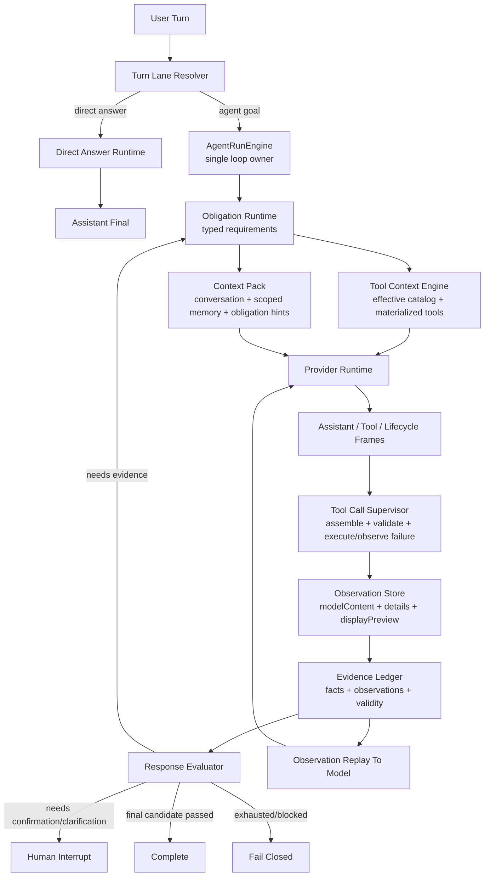
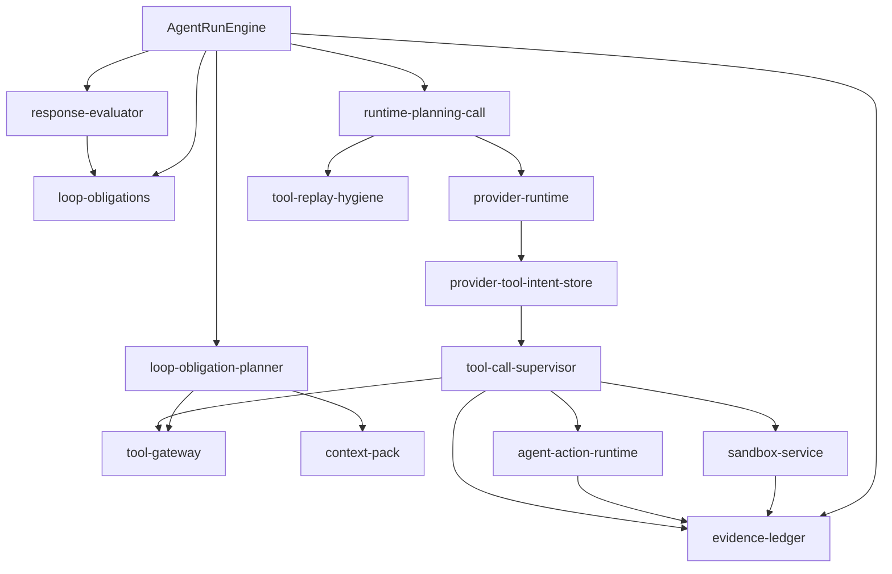

# ADR 0034: OpenClaw/Hermes Runner-Owned Obligation Runtime

Status: Implemented

Date: 2026-06-07

Refines: ADR 0016 Manifest-Scoped Sandbox Tool, ADR 0018 AgentRunEngine v2 Single-Loop Harness, ADR 0020 Progressive Tool Discovery Runtime, ADR 0021 Turn Lane Resolution and Direct Answer Runtime, ADR 0025 Evidence-First Response Loop, ADR 0029 Runner-Owned Evidence Main Loop Upgrade, ADR 0032 Runner-Owned Evidence Contract v2, ADR 0033 Canonical Loop and Runtime Hygiene Convergence

## Context

Conversation `c07be2f5` exposed a remaining harness flaw after ADR 0033.

The user asked:

```text
给我预测一下，如果目前的通胀率是15%，我的投资回报率是多少？
我是第2个股东，我投入的钱都是银行贷款出来的，银行利率是年利率3%
```

The run partially matched the target architecture:

- it stayed in the Agent goal lane;
- it used read tools and the real sandbox;
- it failed closed instead of returning a weak success;
- tool output was not directly treated as a completed user answer.

But it still missed the product contract:

- the evaluator correctly discovered missing ordered-shareholder evidence;
- that finding became a textual `nextMessage`, not a runner-owned typed obligation;
- the model kept producing text or unrelated plans instead of being forced through the required entity read;
- internal obligation JSON leaked into user-facing assistant text;
- sandbox bundle metadata such as `fields: ["shareholders"]` was mistaken for evidence availability, even though the actual shareholder order was not persisted as a model/evaluator evidence fact.

The conclusion is:

```text
The previous fix did not fail because it was too small.
It failed because it fixed the wrong layer.
```

Evaluator findings must not be prompt text. They must be typed loop obligations owned by `AgentRunEngine`.

## Reference Findings

### OpenClaw

Local reference: `C:\Github\openclaw`.

Relevant files reviewed:

- `docs/concepts/agent-loop.md`
- `src/agents/transport-message-transform.ts`
- `src/agents/session-transcript-repair.ts`
- `src/agents/tool-replay-repair.live.test.ts`

Reusable ideas:

- A run is one serialized session lane.
- Assistant, tool and lifecycle streams are separate.
- Tool calls and tool results are paired as transcript/runtime structure, not as arbitrary prose.
- Missing tool results are materialized as synthetic error tool results for replay repair.
- Failed streamed assistant turns can be dropped before provider replay.
- Tool-call ids can be mapped across model/provider boundaries.
- Transcript repair moves or synthesizes tool results before the next provider call, instead of letting the model see malformed history.

Direct implication for `xox-model`:

- Missing evidence must become a structured continuation state, not assistant prose.
- A failed or missing observation must be represented as an observation item and replayed to the model.
- User-facing assistant text must be produced only by a final assistant candidate, never by the repair instruction itself.

Do not copy:

- OpenClaw local control plane;
- local filesystem/session memory assumptions;
- broad host shell authority;
- plugin/channel infrastructure that does not fit SaaS tenancy.

### Hermes Agent

Local reference: `C:\Github\hermes-agent`.

Relevant files reviewed:

- `agent/chat_completion_helpers.py`
- `agent/conversation_loop.py`
- `agent/agent_runtime_helpers.py`
- `agent/tool_dispatch_helpers.py`
- `tools/tool_search.py`

Reusable ideas:

- Streamed `tool_calls` are accumulated before execution.
- Function names are treated as atomic identifiers; argument deltas are appended.
- Partially observed tool names are preserved so a broken stream does not silently erase model intent.
- Invalid JSON arguments are retried or converted into tool error results for model recovery.
- Message history is sanitized before every provider call: orphan tool results are removed, missing results are stubbed, consecutive user messages are merged.
- Tool search is progressive disclosure and retrieval, not a permission bypass; bridge execution unwraps to the real tool path so guardrails and hooks still apply.
- Prompt-cache stability is maintained by injecting volatile context into per-turn user content rather than rewriting the stable system prompt.

Direct implication for `xox-model`:

- Provider/tool-call/message hygiene belongs below the domain layer.
- If the provider emitted tool intent, the runner must preserve it as executed, failed, invalid, blocked or not-executed observation.
- Repair must preserve role/tool alternation and avoid user-visible internal scaffolding.

Do not copy:

- broad local computer authority;
- global single-user memory assumptions;
- universal product-facing `tool_call` wrapper as normal SaaS UI.

### OpenAI Agents JS

Local reference: `C:\Github\openai-agents-js`.

Reusable ideas:

- Runner-side tool execution and turn resolution;
- guardrails, tracing, approvals and sandbox boundaries as runner capabilities;
- tool parse errors and HITL interruptions as stateful runner outcomes;
- Sandbox workspace/session/manifest/capability boundaries.

Direct implication for `xox-model`:

- Keep provider SDK types out of `packages/contracts`.
- Keep domain writes behind xox-model confirmation/action runtime.
- Reuse the runner-side boundary shape: tools produce items; guardrails produce interruptions; sandbox produces scoped observations; runner decides next.

## Decision

Adopt a **Runner-Owned Obligation Runtime**.

This is not a new agent framework and not a second evaluator. It is a typed state layer inside the existing `AgentRunEngine`.

The runtime owns the following contract:

```text
Evaluator finding
-> typed obligation
-> constrained next loop preparation
-> required observation or human interruption
-> observation replay
-> final assistant candidate
-> response evaluation
```

No module except `AgentRunEngine` may decide finality.

## Canonical Loop With Obligations



Short form:

```text
resolve lane
-> initialize obligations
-> prepare effective context and tool surface
-> call model
-> supervise every tool intent into an observation
-> evaluate evidence requirements
-> if missing evidence, materialize a typed repair obligation
-> replay observations and continue
-> accept only a model-authored final answer
```

## Obligation Types

Obligations are structured runner state, not text prompts.

```ts
type AgentLoopObligation =
  | DomainFactObligation
  | ToolObservationObligation
  | SandboxComputationObligation
  | ActionConfirmationObligation
  | ClarificationObligation
  | FinalAnswerObligation;
```

### `DomainFactObligation`

Requires a tenant-scoped read observation.

Examples:

- ordered shareholder list;
- current member roster;
- current investment amounts;
- active month/period;
- version list or selected release version;
- lock state.

Rules:

- must name the required read capability;
- must name acceptable tools, such as `data_query_workspace`;
- must narrow scope, for example `entity_summary`;
- must not be derived by scanning user prose with keywords.

### `ToolObservationObligation`

Requires every provider-emitted tool intent to become an observation.

Statuses:

```ts
type ToolObservationStatus =
  | 'completed'
  | 'failed'
  | 'blocked'
  | 'invalid_arguments'
  | 'not_executed'
  | 'cancelled';
```

Rules:

- no provider tool intent may disappear;
- failed tools must be replayable observations;
- tool result text is never the final user answer.

### `SandboxComputationObligation`

Requires real sandbox execution and manifest proof when a derived calculation depends on code.

Rules:

- fake/contract-only sandbox output cannot satisfy this obligation;
- sandbox output must include `executionMode=executed`, exit status, model-readable output, and manifest/bundle proof when a manifest is involved;
- unstructured stdout is valid model evidence if the tool observation is real and complete;
- structured output is preferred for UI/follow-up actions, not required for the model to understand the result.

### `ActionConfirmationObligation`

Requires editable confirmation cards before writes.

Rules:

- automation level controls execution authority only;
- all write actions still pass through the same confirmation/action runtime;
- pending confirmation prevents final completion unless the user explicitly asked only to prepare cards.

### `ClarificationObligation`

Requires a user answer when the workspace cannot provide a necessary fact.

Rules:

- do not ask for facts already available through scoped read tools;
- the clarification should interrupt only the dependent action;
- independent read/write preparations should continue when safe.

### `FinalAnswerObligation`

Requires a model-authored final answer after all required observations are available.

Rules:

- final answer cannot be tool output;
- final answer cannot be an evaluator repair message;
- final answer cannot contain internal obligation/debug JSON;
- final answer must pass response evaluation against evidence.

## Module Division

### New / Refined Modules

Planned paths:

- `apps/api/src/agent/loop-obligations.ts`
  - typed obligation model;
  - conversion from evaluator findings to obligations;
  - status transitions.

- `apps/api/src/agent/loop-obligation-planner.ts`
  - converts active obligations into constrained next-loop inputs;
  - selects required read/tool/sandbox context by typed capability;
  - never parses user prose.

- `apps/api/src/agent/tool-replay-hygiene.ts`
  - OpenClaw/Hermes-inspired transcript hygiene;
  - missing result materialization;
  - orphan result handling;
  - failed streamed turn handling.

- `apps/api/src/agent/provider-tool-intent-store.ts`
  - preserves provider-emitted tool names, ids, raw/normalized arguments, parse status and retry status.

- `apps/api/src/agent/final-answer-boundary.ts`
  - separates final assistant candidate from repair/system/lifecycle messages;
  - prevents `nextMessage` or evaluator JSON from becoming assistant text.

### Existing Modules To Refine

- `apps/api/src/agent/agent-run-engine.ts`
  - remains the only owner of next-step decisions;
  - consumes obligations instead of textual repair prompts;
  - fails closed with user-safe summaries.

- `apps/api/src/agent/evidence-obligations.ts`
  - should become an obligation derivation helper or be replaced by `loop-obligations.ts`;
  - must not expose `obligationRepairMessage` as a user-visible string.

- `apps/api/src/agent/runtime-planning-call.ts`
  - receives constrained tool/context hints from obligations;
  - does not decide finality.

- `apps/api/src/agent/tool-gateway.ts`
  - remains the effective-catalog and tool policy gateway;
  - reserves prerequisite observation tools for active obligations.

- `apps/api/src/agent/sandbox-service.ts`
  - exposes complete model-readable sandbox observations;
  - bundle metadata must not be confused with evidence facts.

- `apps/api/src/agent/response-evaluator.ts`
  - emits structured findings;
  - does not generate repair prose as the next model message.

## Dependency Direction



Allowed direction:

```text
AgentRunEngine -> obligations/planner/runtime/evaluator/evidence
planner -> tool/context boundaries
runtime -> provider/hygiene
tool supervisor -> tool/action/sandbox services
services -> evidence observations
evaluator -> findings only
```

Forbidden direction:

```text
evaluator -> provider call
tool gateway -> finality decision
sandbox -> assistant answer
transcript projector -> completion status
obligation helper -> user-visible repair prose
```

## Reuse Plan

### OpenClaw Reuse

Port small MIT-attributed pure logic where useful:

- transcript repair shape from `session-transcript-repair.ts`;
- transport replay idea from `transport-message-transform.ts`;
- missing tool result as a synthetic error observation;
- assistant/tool/lifecycle stream separation semantics.

Do not port:

- OpenClaw runner/control plane;
- filesystem session manager;
- plugin/channel/auth infrastructure.

### Hermes Reuse

Port small MIT-attributed pure logic where useful:

- streamed tool-call accumulation;
- partial tool-name preservation;
- invalid argument observation/retry shape;
- message sequence sanitizer principles;
- tool search catalog rebuilding discipline.

Do not port:

- local host authority;
- global memory model;
- universal product-facing bridge tool UI.

### OpenAI Agents JS Reuse

Reuse concepts, not contracts:

- runner-side guardrail/interruption shape;
- approval as stateful interruption;
- sandbox manifest/session/capability boundary;
- tracing as runtime events.

Do not port:

- SDK-specific DTOs into `packages/contracts`;
- OpenAI Responses-only semantics into OpenAI-compatible adapters.

## Migration Plan

### Phase 1: Remove Repair Prose From Finality

Goal:

- ensure no evaluator obligation string can become assistant text.

Edits:

- `apps/api/src/agent/agent-run-engine.ts`
- `apps/api/src/agent/evidence-obligations.ts`
- `apps/api/tests/agent-transcript.test.ts`
- `apps/api/tests/agent-run-engine*.test.ts`

Validation:

- a failed obligation produces a user-safe failure summary;
- technical details remain in run events / technical log;
- assistant message does not include `Runner evidence obligations`.

### Phase 2: Typed Obligation Runtime

Goal:

- convert response evaluator findings into typed `AgentLoopObligation` records.

Edits:

- add `apps/api/src/agent/loop-obligations.ts`;
- add `apps/api/src/agent/loop-obligation-planner.ts`;
- update `agent-run-engine.ts`;
- update response evaluator tests.

Validation:

- missing ordered-shareholder evidence becomes a `DomainFactObligation`;
- active obligation narrows the next tool context to required read tools;
- no keyword/regex intent extraction is introduced.

### Phase 3: Observation-First Repair Turns

Goal:

- the next loop after missing evidence executes or requests the required observation before final-answer retry.

Edits:

- `runtime-planning-call.ts`;
- `tool-gateway.ts`;
- `context-pack*`;
- `evidence-ledger.ts`.

Validation:

- `第2个股东` style runs first collect entity-summary evidence if missing;
- model can then compute with sandbox or answer from available observations;
- no broad fallback catalog is exposed just because repair is active.

### Phase 4: Provider Tool Intent Hygiene

Goal:

- every provider-emitted tool intent is preserved and materialized as an observation.

Edits:

- add `tool-replay-hygiene.ts`;
- add `provider-tool-intent-store.ts`;
- update provider runtime adapters;
- update streamed tool-call tests.

Validation:

- invalid/truncated args do not execute;
- failed provider-selected tool appears as failed/invalid observation;
- retry cannot erase prior provider tool intent and complete from unrelated text.

### Phase 5: Sandbox Evidence Separation

Goal:

- sandbox bundle metadata, complete model content, display preview and evidence facts are separated.

Edits:

- `sandbox-service.ts`;
- `evidence-ledger.ts`;
- sandbox tests;
- transcript projection tests.

Validation:

- `fields: ["shareholders"]` alone does not satisfy ordered-shareholder evidence;
- complete sandbox stdout/modelContent is preserved for model replay;
- UI preview truncation cannot change evaluator evidence.

## Acceptance Criteria

### Conversation `c07be2f5` Class

Given:

```text
给我预测一下，如果目前的通胀率是15%，我的投资回报率是多少？
我是第2个股东，我投入的钱都是银行贷款出来的，银行利率是年利率3%
```

Expected:

- runner identifies ordered shareholder facts as required evidence;
- if missing, it constrains the next loop to obtain entity summary;
- sandbox computation uses observed shareholder investment/dividend facts;
- final answer is model-authored after observation replay;
- no internal obligation JSON appears in assistant text;
- if the tool/model cannot obtain required evidence after bounded repair, the run fails closed with a user-safe explanation.

### Regression Requirements

- Direct-answer turns still bypass the full goal harness.
- Read-only business inspections still return model-authored answers after read observations.
- Writes still create editable confirmation cards before execution.
- Pending confirmation or clarification prevents false completion.
- Tool discovery never broadens authority after provider damage.
- Provider-emitted invalid tool calls become observations, not dropped events.
- Sandbox fake/contract-only results cannot satisfy computation obligations.

### Commands

```powershell
npm.cmd run test:api
npm.cmd run test:web
npm.cmd run build:web
npm.cmd run test
```

Expected:

- all commands pass;
- API tests include the obligation path, user-safe failure path and `c07be2f5`-style missing entity evidence path;
- frontend tests confirm technical details are not projected into the main transcript.

## Non-Goals

- Do not replace `AgentRunEngine`.
- Do not introduce another planner runtime.
- Do not add keyword/regex semantic routing.
- Do not expose a product-facing universal `tool_call` wrapper.
- Do not port OpenClaw/Hermes control planes.
- Do not let sandbox or tool output answer the user directly.

## Naming Rules

Use:

- `AgentLoopObligation`
- `DomainFactObligation`
- `ToolObservationObligation`
- `SandboxComputationObligation`
- `ActionConfirmationObligation`
- `ClarificationObligation`
- `FinalAnswerObligation`
- `ToolObservation`
- `ProviderToolIntent`
- `ToolReplayHygiene`

Avoid:

- `Business*` for generic Agent runtime modules;
- `RepairPrompt` for runner state;
- `fallback` for authority broadening;
- `fake` or `contract-only` sandbox backends;
- prose-oriented names for structured loop obligations.

## Summary

This ADR keeps the existing `xox-model` assets and corrects the layer where the last failure happened.

OpenClaw teaches the loop shape and transcript/tool-result pairing.

Hermes teaches provider/tool-call/message hygiene.

OpenAI Agents JS teaches runner-side guardrail, approval, tracing and sandbox boundaries.

The xox-model-specific decision is:

```text
Evaluator findings become typed runner obligations.
Typed obligations constrain the next loop.
Required observations are collected as tool results.
Only a model-authored final answer can complete the run.
```

## Implementation Notes

Implemented on 2026-06-07:

- replaced prose `evidence-obligations` repair prompts with typed `AgentLoopObligation` / `AgentLoopObligationPlan`;
- made `AgentRunEngine` carry obligation plans as runner state instead of `nextMessage` text;
- added a runner-owned tool-surface override in `Tool Catalog Gateway`;
- when a loop obligation specifies `requiredToolNames`, the next repair turn exposes only those tools;
- attached compact obligation context to the provider context pack, not to user-visible assistant text;
- converted exhausted obligation repair into user-safe failure summaries;
- added API coverage for the `c07be2f5` class: sandbox answer missing ordered shareholder evidence, constrained entity-summary repair, final model-authored answer, and no internal obligation leak.

Still intentionally left as maturity phases from this ADR:

- broader provider intent persistence beyond existing provider-response boundary handling;
- deeper sandbox evidence separation beyond current executed/validity checks;
- dedicated `ToolReplayHygiene` and `ProviderToolIntent` modules if later provider traces show another replay-shape issue.
