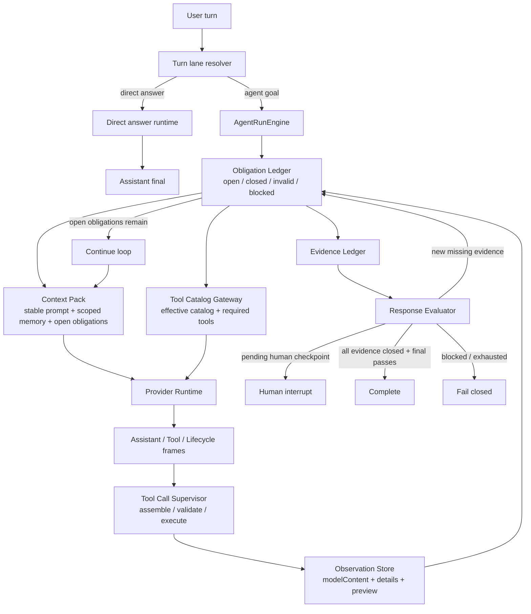

# ADR 0035: OpenClaw/Hermes Obligation Ledger State Machine

Status: Proposed

Date: 2026-06-07

Refines: ADR 0016 Manifest-Scoped Sandbox Tool, ADR 0018 AgentRunEngine v2 Single-Loop Harness, ADR 0020 Progressive Tool Discovery Runtime, ADR 0021 Turn Lane Resolution and Direct Answer Runtime, ADR 0025 Evidence-First Response Loop, ADR 0029 Runner-Owned Evidence Main Loop Upgrade, ADR 0032 Runner-Owned Evidence Contract v2, ADR 0033 Canonical Loop and Runtime Hygiene Convergence, ADR 0034 OpenClaw/Hermes Runner-Owned Obligation Runtime

## Context

ADR 0034 correctly identified the architectural target: evaluator findings must become runner-owned typed obligations, not prose repair prompts.

The current implementation partially followed that direction:

- `loop-obligations.ts` converts response-evaluator findings into typed obligation plans.
- `AgentRunEngine` passes an active obligation plan into `planResponse`.
- `Tool Catalog Gateway` can constrain the next provider call with `runner-obligation-plan`.
- The system can fail closed instead of publishing weak answers.

However, conversation `1b62b4f9` showed that this is still not enough.

The failing user objective was:

```text
给我预测一下，如果目前的通胀率是15%，我的投资回报率是多少？
我是第2个股东，我投入的钱都是银行贷款出来的，银行利率是年利率3%
```

The run did get real observations:

- `data_query_workspace` returned workspace-level financial summary.
- `sandbox_run_code` executed real code and produced a shareholder ROI calculation.

But the final result still failed because ordered shareholder evidence was not durably closed before the system allowed a final-answer attempt.

The root cause is precise:

```text
ADR 0034 made obligations structured, but not durable.
It implemented a one-shot active obligation plan, not an OpenClaw/Hermes-style loop state machine.
```

The current code can set `activeObligationPlan`, but it clears that plan after an observation continuation. There is no persistent ledger that tracks:

- which obligations are open;
- which observation closes which obligation;
- which observations are invalid or insufficient;
- whether a final assistant answer is allowed.

This means the implementation can still behave as:

```text
response evaluator finding
-> one constrained next call
-> one observation
-> obligation cleared
-> assistant-only text becomes final candidate
-> evaluator rejects too late
```

That is not the target harness architecture.

## Reference Findings

### OpenClaw

Local reference: `C:\Github\openclaw`.

Relevant mechanisms:

- `src/agents/session-tool-result-state.ts`
- `src/agents/session-tool-result-guard.ts`
- `src/agents/session-transcript-repair.ts`
- `packages/tool-call-repair/src/stream-normalizer.ts`
- `packages/tool-call-repair/src/payload.ts`

OpenClaw's important design is not the exact file/session implementation. The reusable idea is the invariant:

```text
assistant tool call creates pending runtime state;
matching tool result closes that state;
pending state cannot silently disappear before the next valid loop transition.
```

For xox-model, the equivalent is:

```text
evaluator finding / provider tool intent creates an open obligation;
validated observation or human interrupt closes that obligation;
open obligations cannot silently disappear before final answer acceptance.
```

Reusable pieces and ideas:

- Pending-state object with explicit `track`, `delete`, `clear`, `getPendingIds`.
- Transcript repair before provider replay.
- Tool-call ids and tool-result ids as runtime structure, not prose.
- Synthetic error tool results for replay hygiene when a provider requires matched tool result messages.
- Plain-text or damaged tool-call stream repair only inside provider/tool runtime, never in business logic.

Do not copy:

- OpenClaw's local control plane.
- Broad host shell authority.
- Local filesystem session assumptions.
- Plugin/channel infrastructure that does not fit SaaS tenancy.

### Hermes Agent

Local reference: `C:\Github\hermes-agent`.

Relevant mechanisms:

- `website/docs/developer-guide/agent-loop.md`
- `agent/conversation_loop.py`
- `agent/agent_runtime_helpers.py`
- `agent/tool_dispatch_helpers.py`

Hermes' important design is the simple loop:

```text
model call
-> if tool_calls: execute tools, append tool results, loop
-> if text response and no pending tool work: return final response
```

Reusable pieces and ideas:

- Strict message alternation: `assistant(tool_calls) -> tool* -> assistant`.
- Tool-call arguments are repaired before replay or converted into tool error results.
- Orphan tool messages are removed or repaired before provider calls.
- Invalid tool JSON does not become user-facing final answer.
- Empty responses after tools are nudged to continue rather than accepted.
- Prompt-cache stable system prompt; volatile loop context goes into per-turn context.

Do not copy:

- Global single-user memory assumptions.
- Local computer authority.
- Hermes' product-facing universal tool wrapper as the xox-model user UI.

### OpenAI Agents JS

Local reference: `C:\Github\openai-agents-js`.

Reusable ideas:

- Runner owns turn progression.
- Tools produce typed items.
- Guardrails, tracing, HITL and sandbox boundaries are runner-side concerns.
- Tool parse errors and approvals are stateful outcomes, not prompt text.
- Sandbox workspace/session/manifest/capability boundaries are explicit contracts.

Direct implication:

- `AgentRunEngine` remains the only module allowed to accept finality.
- Provider SDK details stay below the runtime adapter.
- Domain writes stay behind xox-model confirmation/action runtime.

## Decision

Introduce an **Obligation Ledger State Machine** inside `AgentRunEngine`.

This is not a new framework and not a second evaluator. It is the missing durable state layer between:

- response evaluation,
- tool discovery,
- tool execution,
- sandbox observations,
- human confirmation,
- final assistant acceptance.

The ledger owns this invariant:

```text
No final assistant candidate may be accepted, or even treated as a valid final attempt,
while required obligations remain open.
```

ADR 0034's `AgentLoopObligationPlan` remains useful, but it becomes a projection of ledger state, not the ledger itself.

## Canonical Loop



Short form:

```text
resolve lane
-> initialize / hydrate obligation ledger
-> prepare context and effective tool catalog from open obligations
-> call provider
-> supervise every provider tool intent into an observation
-> update ledger from observations
-> evaluate response/evidence
-> add or close obligations
-> continue while obligations remain
-> accept only model-authored final answer after ledger is closed
```

## Obligation Ledger Contract

### State

```ts
type AgentLoopObligationStatus =
  | 'open'
  | 'satisfied'
  | 'invalid'
  | 'blocked'
  | 'cancelled';

type AgentLoopObligationKind =
  | 'domain_fact'
  | 'tool_observation'
  | 'sandbox_calculation'
  | 'action_confirmation'
  | 'clarification'
  | 'assistant_final_answer';

type AgentLoopObligation = {
  id: string;
  kind: AgentLoopObligationKind;
  status: AgentLoopObligationStatus;
  source: 'goal_contract' | 'response_evaluator' | 'provider_tool_intent' | 'policy' | 'human_interrupt';
  reason: string;
  requiredTools: string[];
  requiredCapabilities: string[];
  requiredDataScopes?: string[];
  requiredMetrics?: string[];
  requiredSubjects?: string[];
  createdAtIteration: number;
  closedAtIteration?: number;
  evidenceIds: string[];
  invalidReasons: string[];
};

type AgentLoopObligationLedger = {
  schemaVersion: 'xox.loop_obligation_ledger.v1';
  runId: string;
  iteration: number;
  obligations: AgentLoopObligation[];
};
```

### Rules

- Obligations are durable for the whole run.
- `continue_with_observations` may close obligations, but must not clear unrelated open obligations.
- Every observation must be offered to the ledger for closure.
- Every response-evaluator finding must either close an existing obligation, update one, or open a new one.
- Every provider-emitted tool intent must become an observation with status `completed`, `failed`, `blocked`, `invalid_arguments`, `not_executed`, or `cancelled`.
- Assistant-only text is a final candidate only when all non-final-answer obligations are closed.
- `assistant_final_answer` can close only after the response evaluator passes the answer against evidence.
- Exhaustion reports open obligations, not prompt text.

## Module Division

### `apps/api/src/agent/loop-obligation-ledger.ts`

Owns durable in-memory run ledger operations:

- `initializeLedger(goalFacts, runtimeFacts)`
- `applyResponseEvaluation(ledger, responseEvaluation)`
- `applyObservation(ledger, observation)`
- `openObligations(ledger)`
- `canAttemptFinalAnswer(ledger)`
- `toObligationPlan(ledger)`
- `userSafeOpenObligationSummary(ledger)`

This module replaces one-shot `activeObligationPlan` semantics. It may reuse the existing `loop-obligations.ts` types initially, but the source of truth must be the ledger.

### `apps/api/src/agent/loop-obligations.ts`

Keep as a projection/compatibility helper during migration, then reduce it to:

- typed obligation constructors;
- response-evaluator-to-obligation conversion;
- no finality decisions;
- no one-shot plan ownership.

### `apps/api/src/agent/agent-run-engine.ts`

Becomes the only finality owner:

- hydrates ledger at run start;
- updates ledger after each planning result and observation;
- passes `toObligationPlan(ledger)` to `planResponse` while open obligations remain;
- blocks assistant-only final candidates while obligations remain;
- fails closed with ledger summary when iterations are exhausted.

Remove the current pattern:

```ts
let activeObligationPlan: AgentLoopObligationPlan | null = null
activeObligationPlan = null
```

The replacement is not another boolean or local prompt string; it is ledger transition logic.

### `apps/api/src/agent/tool-gateway.ts`

Continue using progressive tool discovery, but treat open obligations as hard requirements:

- effective catalog is still policy filtered first;
- required tools from ledger are reserved before ordinary ranked tools;
- degraded routing must not broaden authority;
- if a required tool is unavailable, create a blocked ledger obligation and fail closed or ask for clarification.

### `apps/api/src/agent/runtime-planning-call.ts`

Inject open obligations as loop context, not user-visible prose:

- stable system prompt remains stable;
- volatile ledger state goes into scoped per-turn context;
- no internal JSON appears in assistant-visible final text;
- provider stream text before tool calls remains preface, not final answer.

### `apps/api/src/agent/tool-runtime/*`

Adopt OpenClaw/Hermes-style hygiene below business logic:

- preserve provider-emitted tool ids and names;
- assemble streamed tool arguments before execution;
- turn parse failures into failed observations;
- replay failed observations to the model when the loop can recover;
- keep provider/tool repair out of business intent routing.

### `apps/api/src/agent/evidence-ledger.ts`

Remain the evidence projection layer.

Change relationship:

```text
Observation Store -> Obligation Ledger -> Evidence Ledger -> Response Evaluator
```

The evidence ledger summarizes facts; the obligation ledger owns what is still required.

## Reuse Plan

### OpenClaw-inspired reuse

Port only small MIT-compatible pure mechanisms:

- pending-state shape;
- pairing/closure transition style;
- stream tool-call repair ideas;
- transcript hygiene rules.

Do not import OpenClaw runtime, control plane, local session manager, plugin registry, shell/tool authority or filesystem memory.

### Hermes-inspired reuse

Reuse the loop discipline:

- tool calls always produce tool observations;
- tool observations loop back to the model;
- final text is accepted only at the loop boundary;
- malformed provider messages are repaired below the harness.

Do not import Hermes global runtime, local computer tools, memory assumptions or CLI control flow.

### OpenAI Agents JS-inspired reuse

Keep the runner-side boundary:

- guardrails and HITL are runner outcomes;
- sandbox is a scoped tool capability;
- provider SDK types do not leak into xox contracts;
- tracing observes state transitions instead of deciding state.

## Implementation Plan

### Milestone 1: Ledger Contract And Tests

Paths:

- `apps/api/src/agent/loop-obligation-ledger.ts`
- `apps/api/tests/loop-obligation-ledger.test.ts`
- `docs/adr/0035-openclaw-hermes-obligation-ledger-state-machine.md`
- `.agent/lessons.md`

Validation:

- Creating a sandbox and ordered-shareholder requirement opens two obligations.
- A sandbox observation closes only sandbox, not shareholder facts.
- An `entity_summary` observation with shareholders closes ordered-shareholder facts.
- Assistant-only text is not final while any non-final obligation is open.

### Milestone 2: AgentRunEngine Integration

Paths:

- `apps/api/src/agent/agent-run-engine.ts`
- `apps/api/src/agent/turn-resolver.ts`
- `apps/api/src/agent/runtime-planning-call.ts`

Validation:

- Remove `activeObligationPlan = null` as a control-flow reset.
- Existing observations update ledger.
- `hasFinalAssistantCandidate` requires ledger final readiness.
- Iteration exhaustion reports open obligation summaries.

### Milestone 3: Tool Catalog Hard Requirements

Paths:

- `apps/api/src/agent/tool-gateway.ts`
- `apps/api/src/agent/tool-context-engine.ts`
- `apps/api/tests/tool-context-engine.test.ts`

Validation:

- Required ledger tools are reserved before ranked tools.
- Required `data_query_workspace` for entity facts cannot be pushed out by budget.
- Router-empty/degraded mode does not broaden authority.

### Milestone 4: Provider Tool Intent Observations

Paths:

- `apps/api/src/agent/provider-runtime/*`
- `apps/api/src/agent/tool-runtime/*`
- `apps/api/tests/provider-runtime.test.ts`

Validation:

- Invalid tool arguments become failed observations.
- Registered-but-deferred tool calls materialize or create blocked observations.
- Provider tool intent never disappears from the run trace.

### Milestone 5: Scenario Regression

Paths:

- `apps/api/tests/api.test.ts`
- `apps/api/tests/response-evaluator.test.ts`

Validation:

- Reproduce `1b62b4f9`:
  - first read global data;
  - sandbox computes shareholder ROI;
  - ordered shareholder fact remains open;
  - next loop must call entity read before final answer;
  - final answer names the second shareholder based on entity evidence.
- Reproduce failure case:
  - sandbox succeeds but entity evidence is never produced;
  - run fails closed;
  - no assistant message claims final ROI.

## Acceptance Criteria

- `npm.cmd run test:api` passes.
- Existing `npm.cmd run test:web` remains green if frontend contracts are touched.
- No production code uses keyword/regex scanning of user prose to derive obligations.
- `AgentRunEngine` has one durable obligation ledger per run.
- Open obligations survive observation continuation until closed.
- Assistant-only final candidates are blocked while open non-final obligations exist.
- Tool output is never treated as final user answer.
- Response evaluator findings become ledger transitions, not user-visible repair prose.
- Provider-emitted tool intent always becomes a completed/failed/blocked/invalid/cancelled observation.
- Technical diagnostics remain in technical logs, not the main transcript.

## Non-Goals

- Do not rewrite the entire harness.
- Do not replace xox-model with OpenClaw, Hermes or OpenAI Agents JS.
- Do not add a second runtime adapter.
- Do not broaden SaaS sandbox authority.
- Do not change confirmation-card policy.
- Do not change direct-answer lane behavior except where finality gating is shared.

## Risks

- A too-strict ledger may loop longer than needed. Mitigation: each obligation must have a closure predicate and max retry budget.
- A too-loose closure predicate recreates the current bug. Mitigation: closure must inspect structured observation content, not display previews.
- Tool catalog constraints may hide useful tools. Mitigation: required tools are reserved; optional tools remain ranked by progressive discovery.
- Migrating all obligation types at once may be risky. Mitigation: start with sandbox + ordered entity facts because they caused the current failures.

## Verification Checklist

- Inspect run events for `1b62b4f9`-style objective:
  - open sandbox obligation;
  - close sandbox after real execution;
  - ordered shareholder obligation remains open;
  - constrained next catalog includes `data_query_workspace`;
  - close shareholder obligation only after entity summary observation;
  - final answer accepted only after ledger is closed.
- Confirm no internal obligation JSON appears in assistant messages.
- Confirm UI transcript shows tool calls/observations and final assistant summary in order.
- Confirm technical log contains diagnostics for obligation transitions.

## Success Definition

The upgrade is successful when xox-model behaves like this:

```text
The model can be imperfect.
The provider can be noisy.
The sandbox can fail.
The first plan can miss facts.

But the runner never forgets what remains required,
never lets a tool result masquerade as an answer,
and never accepts final output until required obligations are closed.
```
