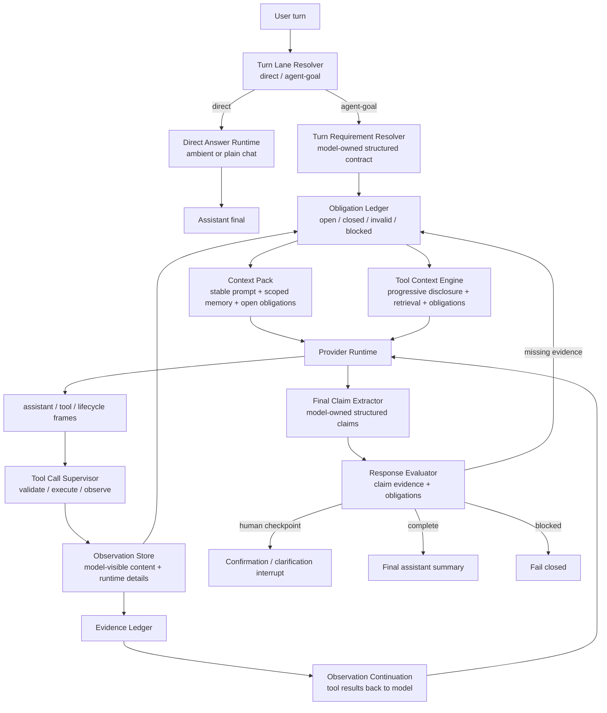

# ADR 0036: OpenClaw/Hermes Claim-Grounded Observation Loop

Status: Proposed

Date: 2026-06-08

Refines: ADR 0016 Manifest-Scoped Sandbox Tool, ADR 0018 AgentRunEngine v2 Single-Loop Harness, ADR 0020 Progressive Tool Discovery Runtime, ADR 0021 Turn Lane Resolution and Direct Answer Runtime, ADR 0025 Evidence-First Response Loop, ADR 0029 Runner-Owned Evidence Main Loop Upgrade, ADR 0032 Runner-Owned Evidence Contract v2, ADR 0033 Canonical Loop and Runtime Hygiene Convergence, ADR 0034 OpenClaw/Hermes Runner-Owned Obligation Runtime, ADR 0035 OpenClaw/Hermes Obligation Ledger State Machine

## Context

ADR 0035 made evaluator findings durable by introducing a runner-owned obligation ledger. That fixed an important failure mode: an evaluator finding should not disappear after one repair turn.

Conversation `9d67ad6e` exposed the next boundary problem. The user asked:

```text
给我预测一下，如果目前的通胀率是15%，我的投资回报率是多少？
我是第2个股东，我投入的钱都是银行贷款出来的，银行利率是年利率3%
```

The final answer was numerically plausible, but the route was not design-conformant:

- the run used a workspace financial summary;
- the sandbox calculation relied on shareholder-specific values;
- the run did not first obtain ordered shareholder evidence;
- `goalFacts` stayed empty;
- the final evaluator accepted the answer because sandbox evidence existed, even though the final answer made entity-specific shareholder claims.

The precise root cause is:

```text
ADR 0035 made obligations durable after they exist.
It did not define how user requirements and final-answer claims create obligations.
```

This is why the harness can still pass an answer that is backed by a calculation observation but not by the domain facts needed for that calculation.

This ADR closes that gap without adding a second planner, a second evaluator, or localized keyword rules.

## Reference Findings

### OpenClaw

Local reference: `C:\Github\openclaw`.

Relevant source areas:

- `packages\agent-core\src\agent-loop.ts`
- `packages\agent-core\src\types.ts`
- `src\agents\session-tool-result-guard.ts`
- `src\agents\session-transcript-repair.ts`

Reusable design:

- one loop owns model call, tool execution, observation replay and stop decisions;
- `beforeToolCall`, `afterToolCall`, `prepareNextTurn`, `shouldStopAfterTurn` are runner hooks, not business-tool decisions;
- tool result `content` is model-visible observation, while `details` is runtime/UI metadata;
- missing or damaged tool results are repaired as protocol artifacts, not by rewriting user prompts;
- finality is a loop transition, not whatever text the model most recently produced.

Direct implication for xox-model:

- Keep `AgentRunEngine` as the single loop owner.
- Do not add a side evaluator that decides the next step.
- Add missing requirement/claim grounding as runner-owned loop state.
- Keep UI projection separate from model-visible observation content.

Do not copy:

- OpenClaw local host authority;
- broad filesystem/shell execution;
- local-only session and memory assumptions.

### Hermes Agent

Local reference: `C:\Github\hermes-agent`.

Relevant source areas:

- `website\docs\developer-guide\agent-loop.md`
- `agent\conversation_loop.py`
- `agent\agent_runtime_helpers.py`
- `agent\tool_dispatch_helpers.py`

Reusable design:

- the loop shape is simple: model call -> tool calls -> tool results -> model call -> final;
- tool-call JSON damage is normalized before replay or converted into a tool error result;
- message alternation is repaired before provider calls;
- tool results remain attached to the model context and cannot be skipped by an assistant-only answer;
- prompt-cache-stable system instructions are separated from volatile turn state.

Direct implication for xox-model:

- Reuse Hermes-style provider/message hygiene below the provider runtime.
- Never let damaged tool intent disappear after retry.
- Do not accept a final answer when required observations are still missing.

Do not copy:

- single-user memory;
- local computer authority;
- a universal tool wrapper that hides xox confirmation cards and audit semantics.

### OpenAI Agents JS

Local reference: `C:\Github\openai-agents-js`.

Relevant source areas:

- `packages\agents-core\src\runner\turnResolution.ts`
- `packages\agents-core\src\runner\toolExecution.ts`
- `packages\agents-core\src\runner\turnPreparation.ts`
- `packages\agents-extensions\src\ai-sdk\index.ts`

Reusable design:

- runner owns turn resolution;
- tools produce typed items;
- approvals, guardrails, tracing, interruptions and sandbox boundaries are runner-side concerns;
- tool outputs and pending approvals control whether another loop iteration is required;
- provider adapters preserve tool-call/tool-result pairing and reasoning artifacts.

Direct implication for xox-model:

- Keep guardrails, HITL, tracing, sandbox and confirmation policy under the runner.
- Keep domain writes behind xox action runtime.
- Use Agents JS as a boundary model, not as a replacement for the SaaS harness.

## Decision

Introduce a **Claim-Grounded Observation Loop** inside the existing `AgentRunEngine`.

This is not a new framework. It is the missing binding between:

- user requirements;
- model-selected tools;
- real domain/sandbox observations;
- final assistant claims;
- the existing durable obligation ledger.

The new invariant is:

```text
Every final answer claim that depends on workspace state, entity identity,
or derived calculation must be backed by a typed observation before finality.
```

The runner must be able to answer:

```text
What did the user require?
What facts did the model claim?
Which observation backs each claim?
Which obligation remains open?
```

If that chain is incomplete, the loop continues, interrupts for clarification, or fails closed. It must not publish a plausible answer that is not grounded in observations.

## Relationship To Existing ADRs

### ADR 0018

Keep the single-loop harness. This ADR adds another source of loop state, not another loop.

### ADR 0020

Keep progressive tool discovery. This ADR makes tool discovery obligation-aware:

- ordinary turns still use effective catalog ranking;
- open domain-fact obligations force the relevant read tools into the visible pack;
- open sandbox obligations force the sandbox tool into the visible pack;
- empty router output cannot erase required obligations or broaden tool authority.

### ADR 0021

Keep direct-answer lane resolution.

Plain chat and ambient facts can still use direct answer. But once a turn is in the agent-goal lane, final assistant text must pass claim grounding.

This ADR does not change `read_inspect` handling. It only adds the missing grounding path for agent-goal answers.

### ADR 0033

Keep canonical loop hygiene.

OpenClaw/Hermes-style message repair and provider frame normalization stay below `AgentRunEngine`. They supply reliable observations; they do not decide business semantics.

### ADR 0035

Keep the durable obligation ledger.

ADR 0035 answers:

```text
How do obligations persist and close?
```

This ADR answers:

```text
How are obligations created from user requirements and final-answer claims?
```

## Canonical Loop



Short form:

```text
resolve lane
-> resolve turn requirements
-> open obligations
-> build obligation-aware tool context
-> model/tool loop
-> persist observations
-> extract final claims
-> evaluate claim evidence
-> continue / interrupt / complete / fail
```

## Core Contracts

### Turn Requirement

The requirement resolver is model-owned structured output, not keyword matching.

It should produce a small contract:

```ts
type AgentTurnRequirement = {
  directAnswerAllowed: boolean;
  needsClarification?: Array<{
    question: string;
    missingFields: string[];
  }>;
  requiredDomainFacts?: Array<{
    subject: "workspace" | "shareholder" | "member" | "employee" | "ledger" | "version";
    locator:
      | { kind: "explicit_name"; value: string }
      | { kind: "ordinal"; index: number }
      | { kind: "current_user" }
      | { kind: "current_workspace" };
    scope: "summary" | "entity_summary" | "ledger_history" | "draft_config" | "version_history";
    reason: string;
  }>;
  requiredCalculations?: Array<{
    kind: "scenario" | "allocation" | "projection" | "financial_metric";
    inputEvidenceSubjects: string[];
    reason: string;
  }>;
  expectedActions?: Array<{
    capability: "domain_read" | "sandbox_compute" | "action_preview" | "action_execute";
    reason: string;
  }>;
};
```

This contract is allowed to be imperfect. The runner validates it against tool observations and final claims. It is not allowed to be replaced by local text branches over user prose.

### Final Answer Claim

Before final acceptance, model-authored final text is converted into structured claims:

```ts
type AgentFinalAnswerClaim = {
  claimId: string;
  kind: "domain_fact" | "entity_specific" | "derived_calculation" | "action_status" | "refusal" | "clarification";
  subject?: {
    type: "workspace" | "shareholder" | "member" | "employee" | "ledger" | "version";
    locator?: string;
  };
  dependsOn?: string[];
  text: string;
};
```

The current code already has an `AgentFinalAnswerClaim` shape in `evidence-ledger.ts`. The implementation work is to make final-answer claim extraction a required loop step for agent-goal runs, then feed the claims into the existing evaluator/ledger.

### Observation Evidence

Every observation that can ground a claim needs stable evidence metadata:

```ts
type AgentObservationEvidence = {
  evidenceId: string;
  source: "domain_read" | "sandbox" | "action_request" | "action_execution" | "ambient";
  subjects: Array<{
    type: "workspace" | "shareholder" | "member" | "employee" | "ledger" | "version";
    locator?: string;
  }>;
  capabilities: Array<"read" | "compute" | "preview" | "execute">;
  modelContent: string;
  details?: unknown;
};
```

`modelContent` is the observation returned to the model. `details` is for UI/runtime projection. This follows OpenClaw's important separation between tool result content and runtime metadata.

## Required Behavior For The Failing Class

For a request like:

```text
给我预测一下，如果目前的通胀率是15%，我的投资回报率是多少？
我是第2个股东，我投入的钱都是银行贷款出来的，银行利率是年利率3%
```

The expected route is:

1. `Turn Requirement Resolver` emits:
   - shareholder entity fact required by ordinal locator;
   - workspace financial summary required;
   - sandbox calculation required.
2. `Obligation Ledger` opens:
   - `domain_fact: shareholder[2]`;
   - `domain_fact: workspace_summary`;
   - `sandbox_calculation: shareholder inflation/loan ROI`.
3. `Tool Context Engine` must expose the smallest useful tool pack that can satisfy those obligations.
4. `data_query_workspace` or the appropriate domain read must return ordered shareholder evidence.
5. `sandbox_run_code` receives a manifest bundle referencing the domain evidence IDs.
6. Sandbox output is persisted as a calculation observation.
7. Final answer is extracted into claims:
   - shareholder identity/investment/dividend claim;
   - ROI calculation claim;
   - inflation-adjusted ROI claim;
   - loan-rate-adjusted result claim.
8. `Response Evaluator` accepts finality only if each claim has matching evidence.

If any required observation is missing, the run continues or fails closed. It must not answer from model memory or from prompt-only assumptions.

## Tool Discovery Upgrade

The existing Progressive Tool Discovery Runtime remains the right direction. The missing piece is obligation input.

Current source of tool context:

```text
goal + memory + page state + capability router + retrieval
```

Target source of tool context:

```text
goal + memory + page state + capability router + retrieval + open obligations
```

Rules:

- Open obligations are not tool-choice hints; they are required context constraints.
- The catalog should still be small.
- Required tools are injected only to satisfy typed obligations.
- Retrieval can choose among multiple tools that satisfy the same obligation.
- Router-empty results cannot cause broad fallback if obligations are specific.
- Tool names are never inferred from localized keyword tables.

This fuses:

- OpenClaw-style progressive effective inventory;
- Hermes-style retrieval and schema materialization;
- xox-model's SaaS policy, confirmation and audit boundaries.

## Sandbox Upgrade

Sandbox remains a manifest-scoped observation tool.

It must not become arbitrary production code execution.

Required constraints:

- sandbox input is a minimized, tenant-scoped bundle;
- bundle contains evidence IDs and typed data, not secrets or database handles;
- sandbox has no business write channel;
- sandbox output is model-visible observation content;
- structured output is optional but useful;
- stdout/stderr/artifacts are valid observations when execution succeeds;
- evaluator checks that required sandbox evidence exists, not that the model followed one rigid output format.

This keeps the OpenClaw/Hermes principle:

```text
The model can use environment feedback to compute.
The runner validates provenance and boundaries.
The runner does not demand one brittle print format before the model can reason.
```

## Provider And Message Hygiene

Provider dirty edges must be handled below `AgentRunEngine`:

- streamed tool-call argument assembly;
- incomplete JSON;
- orphan tool messages;
- assistant tool calls without matching tool results;
- retries that erase damaged tool intent;
- provider-specific thinking/reasoning payloads;
- message alternation repair.

The upgrade should reuse or port small, pure pieces from:

- OpenClaw transcript/tool-result repair;
- Hermes message sequence and tool-argument repair;
- OpenAI Agents JS runner item and tool-result pairing boundaries.

If code is copied, preserve license attribution and isolate it in provider/runtime utility modules. Do not import local-agent control planes.

## What This ADR Explicitly Forbids

- No keyword, regex, alias or localized `includes` logic over user prose for semantic routing.
- No hidden goal-fact extractor that guesses capabilities from natural language.
- No accepting final answers from tool result prose alone.
- No treating sandbox success as sufficient for entity-specific claims.
- No broad fallback that exposes many tools because the router returned nothing.
- No synthetic user message that tells the model to continue after tool results.
- No second planner that competes with `AgentRunEngine`.
- No business writes outside action requests, confirmation cards, domain services and audit logs.

## Implementation Plan

### Milestone 1: Contracts

Edit:

- `packages/contracts/src/index.ts`
- `apps/api/src/agent/evidence-ledger.ts`
- `apps/api/src/agent/agent-run-engine.ts`

Add or consolidate:

- `AgentTurnRequirement`
- `AgentRequirementSource`
- `AgentFinalAnswerClaim`
- `AgentObservationEvidence`

Validation:

- TypeScript build catches all contract consumers.
- No new semantic keyword tables.

### Milestone 2: Turn Requirement Resolver

Edit:

- `apps/api/src/agent/turn-lane-resolver.ts`
- `apps/api/src/agent/runtime-planning-call.ts`
- new focused module only if the existing resolver would mix responsibilities.

Behavior:

- model-owned structured call emits requirements;
- direct-answer lane remains lightweight;
- agent-goal lane opens requirement obligations before first tool context build;
- deterministic code may validate schema and pending-action state, but not infer semantics from text.

Validation:

- multilingual tests for Chinese and English objectives;
- direct date/plain-chat cases do not invoke full business tools;
- shareholder ordinal request opens entity-fact obligation.

### Milestone 3: Obligation-Aware Tool Context

Edit:

- `apps/api/src/agent/tool-context-engine/*`
- `apps/api/src/agent/tool-catalog-gateway.ts`
- `apps/api/src/agent/runtime-planning-call.ts`

Behavior:

- open obligations become catalog constraints;
- required read/sandbox tools are materialized narrowly;
- retrieval still ranks within the allowed set;
- router-empty cannot erase obligations.

Validation:

- for shareholder ROI scenario, `entity_summary`/shareholder read is available before sandbox;
- for simple read, catalog remains small;
- for write goals, confirmation/action tools remain policy-gated.

### Milestone 4: Observation Evidence Binding

Edit:

- `apps/api/src/agent/tool-gateway.ts`
- `apps/api/src/agent/action-runtime.ts`
- `apps/api/src/agent/sandbox/*`
- `apps/api/src/agent/thread-store.ts`

Behavior:

- each domain read, action preview/execution and sandbox result emits evidence metadata;
- tool result model content and UI details are stored separately;
- sandbox manifest references evidence IDs;
- action execution observations include executed state and change details.

Validation:

- evidence IDs survive persistence and transcript projection;
- sandbox cannot satisfy entity facts by itself;
- tool rows show observation evidence without pretending to be assistant answers.

### Milestone 5: Final Claim Extraction

Edit:

- `apps/api/src/agent/response-evaluator.ts`
- `apps/api/src/agent/agent-run-engine.ts`
- provider test fixtures.

Behavior:

- final assistant text in agent-goal lane is claim-extracted before acceptance;
- extracted claims are fed into `buildEvidenceRequirements`;
- missing evidence opens ledger obligations and continues the loop;
- pending confirmation/clarification interrupts instead of accepting finality.

Validation:

- shareholder-specific final claim cannot pass without shareholder evidence;
- derived calculation cannot pass without sandbox or accepted calculation observation;
- direct-answer lane remains fast for ambient/plain chat.

### Milestone 6: Provider Repair Reuse

Edit:

- `apps/api/src/agent/provider-runtime/*`
- `apps/api/src/agent/runtime-trace-events.ts`
- tests around streamed tool-call damage.

Behavior:

- OpenClaw/Hermes-style repairs happen below the runner;
- damaged tool intent becomes typed boundary observation;
- retry cannot erase original damaged intent;
- final answer after damaged tool intent must repair or fail closed.

Validation:

- truncated streamed tool-call args reproduce as frame damage, not silent final answer;
- orphan tool messages are repaired before provider replay;
- no business code sees malformed provider messages.

## Acceptance Criteria

### Harness Correctness

- The shareholder inflation/loan ROI request cannot complete unless ordered shareholder facts and sandbox calculation evidence both exist.
- If final text mentions `第2个股东`, `股东 B`, investment amount, dividend rate or shareholder-specific ROI, those claims have matching domain evidence.
- If final text mentions inflation-adjusted ROI or loan-rate-adjusted ROI, those claims have matching calculation evidence.
- If evidence is missing, the loop continues with a narrower required tool context or fails closed with a clear runtime error.

### Tool Selection

- The effective tool catalog remains small.
- Open obligations can force necessary tools into the pack.
- Empty router/retrieval output cannot create broad tool exposure.
- No semantic tool routing uses keyword/regex/alias tables over user prose.

### Sandbox

- Sandbox code really executes in the manifest-scoped sandbox.
- Sandbox receives minimized evidence bundles, not raw workspace handles.
- Sandbox output is an observation; it is not accepted as final answer by itself.
- Structured output is parsed when present, but successful stdout/stderr/artifacts remain model-readable observations.

### Provider Hygiene

- Streamed tool-call argument truncation is represented as typed frame damage.
- Invalid or missing tool results are repaired as protocol artifacts.
- Provider retries cannot erase a damaged tool intent.
- Provider-specific thinking payloads stay inside provider family modules.

### User-Facing Transcript

- User transcript shows assistant text, compact tool rows, observations, confirmation cards and errors.
- Technical lifecycle noise stays behind technical logs.
- Tool results are evidence rows, not assistant summaries.
- Final assistant summary is model-authored and appears after required observations.

## Migration Notes

This is an evolutionary refactor:

- keep `AgentRunEngine`;
- keep `Tool Context Engine`;
- keep `Obligation Ledger`;
- keep memory kernel;
- keep confirmation cards and action runtime;
- keep manifest-scoped sandbox;
- keep provider-native tool calls.

Replace only the ambiguous seams:

- create obligations from structured requirements and final claims;
- bind observations to evidence IDs;
- make tool context obligation-aware;
- move provider/message repair under provider runtime;
- remove any remaining semantic keyword routers.

## Out Of Scope

- Replacing xox-model with OpenClaw, Hermes or OpenAI Agents JS wholesale.
- Importing local-agent filesystem/shell authority.
- Changing SaaS tenant isolation.
- Changing confirmation-card policy.
- Changing web transcript layout.
- Adding arbitrary production code execution.

## Consequences

Positive:

- final answers become auditable;
- cross-domain complex requests become safer;
- sandbox calculations cannot float free of domain facts;
- tool discovery becomes faster and more accurate because obligations narrow the catalog;
- the architecture aligns with OpenClaw/Hermes/OpenAI runner-side boundaries.

Tradeoffs:

- one extra structured model step may be needed for agent-goal turns;
- tests must script requirement and claim extraction explicitly;
- old fixtures that relied on assistant-only finality need updates;
- evidence metadata must be carried through persistence and transcript projection.

The tradeoff is acceptable because the current failure mode is worse: a plausible but ungrounded final answer can pass the harness.
