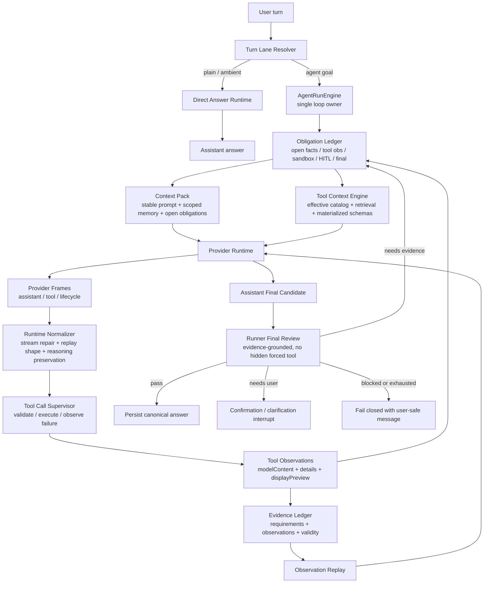

# ADR 0037: OpenClaw/Hermes Single-Loop Final Review Upgrade

Status: Implemented

Date: 2026-06-08

Implemented: 2026-06-08

Refines: ADR 0016 Manifest-Scoped Sandbox Tool, ADR 0018 AgentRunEngine v2 Single-Loop Harness, ADR 0020 Progressive Tool Discovery Runtime, ADR 0021 Turn Lane Resolution and Direct Answer Runtime, ADR 0033 OpenClaw/Hermes Canonical Loop And Runtime Hygiene Convergence, ADR 0034 OpenClaw/Hermes Runner-Owned Obligation Runtime, ADR 0035 OpenClaw/Hermes Obligation Ledger State Machine, ADR 0036 OpenClaw/Hermes Claim-Grounded Observation Loop

## Context

The current `xox-model` harness already owns the right core assets:

- one TypeScript `AgentRunEngine`;
- progressive tool discovery inspired by OpenClaw inventory discipline and Hermes Tool Search;
- tenant-scoped memory;
- editable confirmation cards;
- manifest-scoped real sandbox contract;
- provider-neutral runtime adapters;
- observation continuation;
- runner-owned evidence and obligation ledgers;
- unified user transcript plus hidden technical log.

But recent real conversations still show the same class of failure repeating:

- a run can collect useful read/sandbox observations and still fail because a hidden final-review provider call does not produce a required tool call;
- a model-authored final candidate can be treated as a helper failure instead of the normal terminal answer attempt;
- sandbox code can calculate a plausible number with model-invented formulas instead of a domain-owned calculation contract;
- provider stream/tool-call damage can bubble into domain evaluation instead of staying in provider/runtime hygiene;
- implementation patches tend to fix the currently visible exit path while leaving the main loop shape unstable.

The root issue is not that the project lacks features. The root issue is that some features still sit at the wrong layer.

This ADR defines the next upgrade plan: keep the existing xox-model assets, but absorb the mature boundary discipline from OpenAI Agents JS, OpenClaw and Hermes into one single-loop final-review architecture.

## Reference Findings

### OpenClaw

Local reference: `C:\Github\openclaw`.

Relevant source areas reviewed:

- `src\agents\session-transcript-repair.ts`
- `src\agents\session-tool-result-guard.ts`
- `src\agents\sessions\agent-session.ts`
- `CHANGELOG.md`
- `AGENTS.md`

Reusable ideas:

- The visible final answer should be the canonical assistant answer, not accumulated pre-tool text or tool output fragments.
- Transcript repair normalizes assistant/tool-result pairing, preserves real late tool results when possible, and uses synthetic missing results only as protocol repair artifacts.
- Aborted or errored assistant tool-use turns should not synthesize invalid tool results that poison the next provider replay.
- Tool result content is model-visible observation; runtime details and UI metadata are separate.
- Prompt-cache stability is preserved by keeping volatile turn facts outside the stable system prompt.
- Assistant, tool and lifecycle streams stay separated.

Direct implication for `xox-model`:

- Final answer review must not become a hidden provider tool loop.
- Tool observations should be replayed to the model and then evaluated as a canonical final assistant candidate.
- Transcript/runtime repair belongs below domain logic.
- User-facing transcript must not display internal repair artifacts as product output.

Do not copy:

- OpenClaw's local control plane;
- broad host shell authority;
- single-user local filesystem/session assumptions;
- plugin/channel infrastructure that does not fit SaaS tenancy.

### Hermes Agent

Local reference: `C:\Github\hermes-agent`.

Relevant source areas reviewed:

- `agent\conversation_loop.py`
- `agent\tool_executor.py`
- `agent\chat_completion_helpers.py`
- `agent\agent_runtime_helpers.py`
- `agent\tool_dispatch_helpers.py`
- `tools\tool_search.py`
- `tools\code_execution_tool.py`

Reusable ideas:

- The loop shape is simple: model call, tool calls, tool results, next model call, final text.
- Tool execution appends `role: "tool"` results with the original `tool_call_id`.
- Invalid tools and invalid JSON arguments become tool-result observations or controlled retries, not silent drops.
- Streaming tool-call deltas are accumulated per call before execution.
- Message history is sanitized before provider calls: orphan tool results are removed, missing results are stubbed only to preserve replay shape, and thinking-only/empty post-tool responses are continued instead of treated as user-visible success.
- Tool Search compresses the model-facing catalog, but bridge execution unwraps to real tools so hooks, approval, result shaping and audit still see the underlying tool.

Direct implication for `xox-model`:

- Provider/tool-call/message hygiene must sit inside the runtime adapter and transcript normalizer.
- Tool results are observations for the next model turn, not final answers.
- Dirty provider output should not bypass the single loop and should not be repaired through domain keyword logic.
- Tool discovery and tool execution must remain one runtime path, not two adapters.

Do not copy:

- global single-user memory;
- broad local computer authority;
- universal product-facing `tool_call` wrappers that hide xox confirmation cards and audit semantics.

### OpenAI Agents JS

Local reference: `C:\Github\openai-agents-js`.

Relevant source areas reviewed:

- runner-side tool execution and turn resolution;
- guardrail and approval items;
- tracing spans;
- sandbox runtime manager, session state and manifest handling.

Reusable ideas:

- Runner owns tool execution, parse errors, guardrails, approvals, interruptions and tracing.
- Sandbox has workspace/session/manifest/capability boundaries.
- Tool outputs and pending approvals are runner state, not ad hoc assistant prose.
- Provider-specific SDK details should stay below the application contract.

Direct implication for `xox-model`:

- Keep `packages/contracts` provider-neutral.
- Keep domain writes behind `AgentActionRuntime`.
- Reuse the boundary shape: tools produce items, guardrails produce interruptions, sandbox produces scoped observations, runner decides next.

Do not copy:

- OpenAI Responses-only assumptions into OpenAI-compatible provider paths;
- SDK tool callbacks as direct domain write executors;
- OpenAI SDK types into domain/contracts packages.

## Problem Statement

The current design has the right nouns but still lets several modules behave like side loops.

The most important example is the final-answer claim extraction path. It asks the provider to call a hidden tool such as `final_answer_extract_claims`. If the provider returns text instead of that specific tool call, the whole run can fail even after the main loop collected valid observations and the model produced a normal assistant answer candidate.

That design violates the target harness principle:

```text
Only AgentRunEngine decides continue / wait / final candidate / complete / fail.
All other modules provide inputs, observations or review results.
```

It also violates the OpenClaw/Hermes lesson:

```text
Tool calls and tool results are part of the model loop.
Final answer review is runner-owned.
It is not another hidden tool-call requirement.
```

## Decision

Adopt an **OpenClaw/Hermes Single-Loop Final Review Upgrade**.

This is not a new framework. It is a layer correction.

The upgrade keeps:

- `AgentRunEngine` as the only loop owner;
- progressive tool discovery;
- tool observations;
- real manifest-scoped sandbox;
- durable obligations;
- evidence ledger;
- confirmation cards;
- SaaS tenant isolation;
- unified transcript.

The upgrade changes:

- final claim extraction becomes runner-side review, not a mandatory hidden provider tool call;
- final assistant text becomes the single canonical user-answer source;
- missing final-answer evidence becomes a typed loop obligation or repair observation;
- domain calculations get named contracts instead of free-form sandbox formulas;
- provider dirty-output handling moves fully below the domain/evaluator layer.

## Canonical Loop



Short form:

```text
resolve lane
-> prepare obligations, context and effective tool surface
-> call model
-> normalize provider frames
-> execute or observe every tool intent
-> replay observations to model
-> receive final assistant candidate
-> runner reviews evidence
-> complete, continue, wait or fail closed
```

## Target Module Boundaries

### `AgentRunEngine`

Owns:

- the only loop;
- continuation decisions;
- run budget;
- obligation open/close transitions;
- final candidate acceptance;
- fail-closed decision.

Must not:

- delegate finality to provider adapters;
- treat a tool result as the final answer;
- require a second hidden provider tool call before every final answer.

### `Provider Runtime Adapter`

Owns:

- provider request shaping;
- streamed tool-call assembly;
- provider-specific tool-call repair;
- reasoning/thinking preservation;
- replay-message sanitation;
- error classification.

Must not:

- infer domain intent;
- decide completion;
- silently drop provider-emitted tool intent.

### `Tool Call Supervisor`

Owns:

- executing provider-emitted real tools;
- validating tool names against the current materialized catalog;
- validating JSON/schema;
- converting invalid, blocked, failed or not-executed calls into observations;
- preserving tool-call identity and order.

Must not:

- turn tool output into assistant prose;
- bypass confirmation policy for writes;
- execute tools outside the effective catalog.

### `Runner Final Review`

Owns:

- checking final assistant candidate against evidence and obligations;
- extracting or matching claims through runner-owned deterministic/LLM-assisted review;
- deciding whether more evidence is needed;
- producing typed repair obligations.

Must not:

- require the provider to call a hidden final-answer tool;
- leak review prompts or internal tool names into user-facing answers;
- close a goal without a model-authored final assistant answer.

### `Domain Calculation Contracts`

Own:

- product-specific formulas;
- input facts;
- output semantics;
- explanation fields.

For example, shareholder ROI projection should be a named contract with fields such as:

```ts
type ShareholderRoiProjection = {
  shareholderRef: {
    ordinal?: number;
    name: string;
  };
  investmentAmount: number;
  dividendRate: number;
  totalProfit: number;
  profitShare: number;
  loanAnnualRate?: number;
  inflationRate?: number;
  nominalReturnAmount: number;
  nominalRoi: number;
  realRoi?: number;
  formula: string;
  assumptions: string[];
};
```

The sandbox may execute calculations, stress tests or transformations. It should not be the owner of domain formula semantics.

### `Sandbox Runtime`

Owns:

- real code execution;
- manifest-scoped inputs;
- no domain writes;
- resource limits;
- stdout/stderr/artifacts;
- manifest consumption proof.

Must not:

- accept production database handles or provider keys;
- satisfy domain calculation evidence without manifest proof;
- force every useful result into one rigid JSON shape when model-readable text is enough for observation replay.

Structured output is preferred when UI or follow-up tools need it. It is not the only acceptable observation form.

## What To Keep, Move, Remove

### Keep

- ADR 0018's single `AgentRunEngine`;
- ADR 0020's progressive tool discovery plus Hermes-style retrieval;
- ADR 0021 direct-answer lane;
- ADR 0016/0026 real manifest-scoped sandbox;
- ADR 0034/0035 durable obligation ledger;
- confirmation/action runtime and audit;
- tenant-scoped memory and provider settings;
- user transcript / technical log separation.

### Move

- Final claim/evidence review moves fully under runner-owned final review.
- Streamed tool-call damage, orphaned tool results and reasoning replay move fully under provider runtime / transcript normalizer.
- Formula semantics move from model-authored sandbox snippets into domain calculation contracts.
- Sandbox evidence validation moves from prompt expectations to runtime/evidence-ledger proof.

### Remove

- mandatory hidden `final_answer_extract_claims` as a terminal run gate;
- any semantic keyword/regex classifiers that decide intent, tools or completion;
- compatibility shims for deprecated fake sandbox or old final-answer extraction behavior;
- final-answer acceptance based on tool previews, raw sandbox output, or lifecycle messages.

## Dependency Direction

```text
web transcript
  -> contracts
  -> api routes
  -> AgentRunEngine
  -> Turn Lane Resolver
  -> Context Pack / Tool Context Engine / Obligation Ledger
  -> Provider Runtime Adapter
  -> Tool Call Supervisor
  -> AgentActionRuntime / Read Tools / Sandbox Runtime / Memory
  -> Domain Services
  -> DB

Runner Final Review
  -> Evidence Ledger
  -> Domain Calculation Contracts
  -> optional provider-neutral reviewer
```

No dependency should point from domain services or sandbox runtime back into provider-specific SDK types.

## Reuse Plan

### From OpenClaw

Port or mirror only small MIT-attributed pure logic where useful:

- transcript repair shape: tool-call/result pairing, late real-result preference, orphan result dropping;
- final-answer delivery invariant: canonical assistant final only;
- prompt-cache boundary discipline;
- tool result content/details split.

Do not port:

- local agent control plane;
- plugin registry;
- host shell assumptions;
- local session storage.

### From Hermes Agent

Port or mirror only small MIT-attributed pure logic where useful:

- streamed tool-call accumulator;
- invalid JSON/truncation classification;
- message sanitation before provider calls;
- tool result message construction discipline;
- Tool Search thin-document ranking concepts.

Do not port:

- global single-user memory;
- broad local computer tools;
- product-facing universal bridge execution.

### From OpenAI Agents JS

Reuse architectural boundaries:

- runner-owned tool execution;
- guardrail/tracing/interruption items;
- approval as runner state;
- sandbox workspace/session/manifest/capability concepts.

Do not leak:

- SDK types into `packages/contracts`;
- Responses-only assumptions into OpenAI-compatible providers;
- SDK tool callbacks into domain writes.

## Implementation Milestones

### 1. Final Review Boundary

Goal:

- remove mandatory hidden final-answer tool-call gating from the main terminal path.

Paths:

- `apps/api/src/agent/agent-run-engine.ts`
- `apps/api/src/agent/final-answer-claim-extractor.ts`
- `apps/api/src/agent/response-evaluator.ts`
- `apps/api/tests/*agent*`

Expected result:

- a final assistant candidate can be reviewed without requiring a provider-emitted `final_answer_extract_claims` tool call;
- reviewer uncertainty becomes a typed obligation or safe failed review, not a raw provider/tool error.

### 2. Provider/Transcript Hygiene Boundary

Goal:

- move dirty stream/tool-call/message replay handling into one runtime normalizer.

Paths:

- `apps/api/src/agent/provider-*`
- `apps/api/src/agent/runtime-*`
- `apps/api/src/agent/tool-gateway.ts`
- `apps/api/tests/*provider*`

Expected result:

- truncated tool-call args retry or fail as tool observations;
- orphaned/missing tool results are repaired only as protocol artifacts;
- lifecycle diagnostics stay out of user-facing transcript.

### 3. Tool Observation Continuation

Goal:

- guarantee tool results are model observations before final answers.

Paths:

- `apps/api/src/agent/agent-run-engine.ts`
- `apps/api/src/agent/tool-observation*`
- `apps/api/src/agent/obligation-*`
- `apps/api/tests/*observation*`

Expected result:

- read/sandbox/action tool results cannot be accepted as final answers;
- every provider-emitted tool intent becomes completed/failed/blocked/invalid/not-executed observation.

### 4. Domain Calculation Contracts

Goal:

- make shareholder ROI, loan-rate and inflation-sensitive calculations domain-owned.

Paths:

- `packages/domain/src/*`
- `packages/contracts/src/*`
- `apps/api/src/agent/tools/*`
- `apps/api/tests/*sandbox*`

Expected result:

- entity-specific finance questions first collect ordered entity facts;
- calculation formulas are named and testable;
- sandbox can execute but does not invent formula semantics.

### 5. Sandbox Evidence Runtime

Goal:

- preserve real code execution while making manifest proof and observation output first-class.

Paths:

- `apps/api/src/agent/sandbox-*`
- `apps/api/src/agent/evidence-ledger.ts`
- `apps/api/tests/*sandbox*`

Expected result:

- real execution plus manifest proof can satisfy sandbox obligations;
- parseable JSON is preferred but not required for model-readable observation;
- failed sandbox runs interrupt calculation completion and return to the loop.

### 6. Transcript/UI Projection Cleanup

Goal:

- render only user-facing assistant/tool/action states; keep repair internals in technical log.

Paths:

- `apps/api/src/agent/agent-transcript-projector.ts`
- `apps/web/src/components/agent/*`
- `apps/web/src/hooks/useAgentThread.ts`
- `apps/web/src/components/agent/*.test.*`

Expected result:

- final answer appears after work cycle;
- hidden review/tool repair names never leak;
- technical details remain available only under technical log.

## Acceptance Criteria

### Architecture

- There is still exactly one main run loop owner: `AgentRunEngine`.
- No provider adapter, final reviewer, transcript projector, tool gateway, sandbox runtime or memory module independently decides run finality.
- Final answer review is runner-owned and does not require a forced hidden provider tool call.
- Provider stream/tool-call/message repair is below domain/evaluator logic.
- Domain calculations that affect user-visible finance answers have named contracts.

### Behavioral

- A simple direct-answer turn such as date/time does not enter the full product harness.
- A read-only domain question executes read tools, replays observations to the model, and returns a final assistant summary.
- A shareholder ROI question with ordinal shareholder reference first obtains ordered shareholder facts or opens a domain-fact obligation before calculation.
- A sandbox-required derived calculation cannot complete from weak domain read alone if sandbox execution failed or manifest proof is missing.
- A provider that returns text instead of hidden claim-extraction tool calls does not fail the run solely for that reason.
- Tool output never appears as the assistant's final answer.

### Regression Cases

- Conversations like `f20c975c` must not end with `Provider did not return the required final_answer_extract_claims tool call`.
- Conversations like `c07be2f5`, `1b62b4f9`, `9d67ad6e` and `f20c975c` must either:
  - produce a grounded final assistant answer, or
  - fail closed with a user-safe missing-evidence reason.
- No raw hidden tool names, provider repair prompts, lifecycle messages or evaluator scaffolding should appear in the main transcript.

### Validation Commands

Implementation should run:

```powershell
npm.cmd run test:api
npm.cmd run test:web
npm.cmd run build:web
npm.cmd run test
```

Real-provider validation should run a small high-value smoke suite with the saved tenant provider settings:

- direct answer;
- read-only workspace question;
- shareholder ROI with loan and inflation;
- sandbox-required derived calculation;
- write confirmation card path.

## Risks

- Removing the forced hidden final-answer tool can reduce structured claim visibility if not replaced by a disciplined runner reviewer.
- Domain calculation contracts must be designed carefully; otherwise they become another hardcoded shortcut.
- Provider hygiene ports must stay small and attributed; importing an external control plane would violate SaaS boundaries.
- If transcript cleanup happens before runtime cleanup, UI may hide useful failures. Runtime evidence must be fixed first.

## Non-Goals

- Replace `AgentRunEngine` with OpenClaw, Hermes or OpenAI Agents JS.
- Introduce Claude Agent SDK.
- Give SaaS sandbox access to production DB, provider keys or write APIs.
- Add local keyword intent routing.
- Build another model-planner sidecar.

## Summary

The upgrade is a layer correction:

```text
OpenClaw gives the loop shape.
Hermes gives dirty provider/tool-call/message resilience.
OpenAI Agents JS gives runner-side guardrail, approval, tracing and sandbox boundaries.
xox-model keeps the SaaS domain, tenant isolation, confirmation cards and audit.
```

The target architecture is simpler, not larger:

```text
one loop,
real tools,
real observations,
runner-owned review,
domain-owned formulas,
canonical assistant final answer.
```

## Implementation Notes

The first implemented slice removes the hidden forced final-answer claim tool as a completion gate:

- `AgentRunEngine` still owns finality through `evaluateAssistantResponse`.
- `final_answer_extract_claims` is now an optional claim-review signal. If the provider returns text, no tool call, or otherwise cannot produce structured claims, the run records `final_answer_claim_extraction_unavailable` as an informational event.
- Existing evidence and obligation ledgers still decide whether the final answer is grounded enough to pass, continue, wait, or fail closed.
- API coverage now includes a provider that returns ordinary assistant text during claim review; the run completes from observation-backed evidence instead of failing on the missing hidden tool call.
