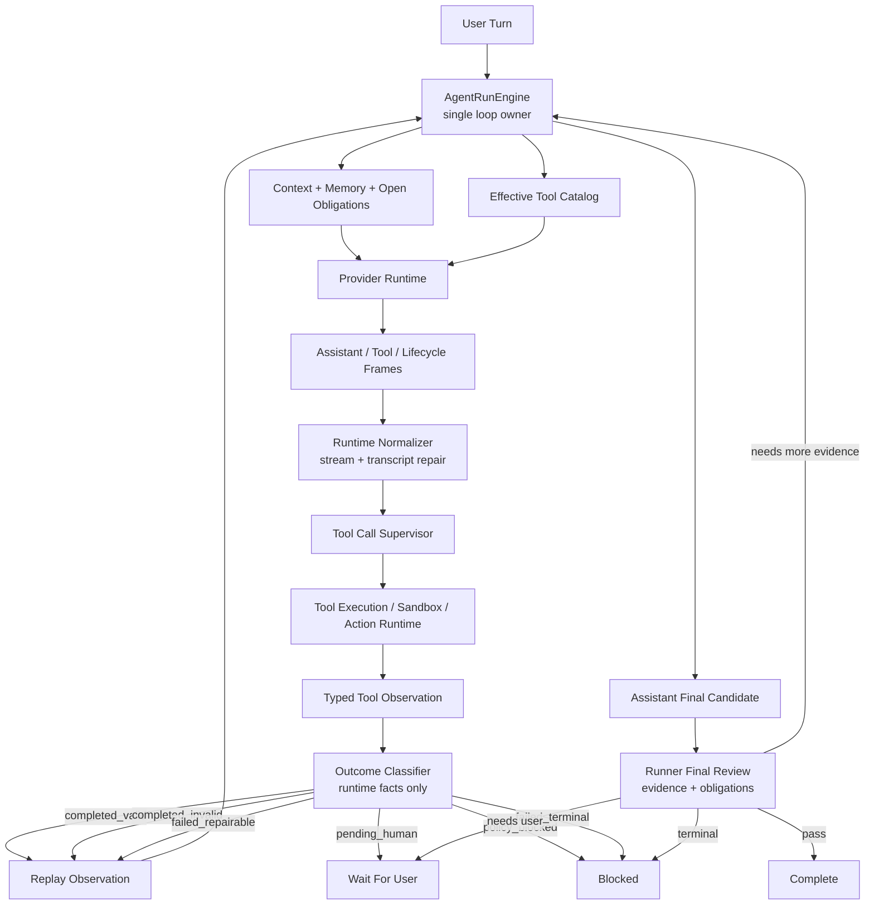

# ADR 0038: OpenClaw/Hermes Repairable Tool Observation Loop

Status: Implemented

Date: 2026-06-08

Refines: ADR 0016 Manifest-Scoped Sandbox Tool, ADR 0018 AgentRunEngine v2 Single-Loop Harness, ADR 0020 Progressive Tool Discovery Runtime, ADR 0026 Real Manifest-Scoped Sandbox Runtime, ADR 0031 Streamed Tool-Call Observation Runtime, ADR 0033 OpenClaw/Hermes Canonical Loop And Runtime Hygiene Convergence, ADR 0035 Obligation Ledger State Machine, ADR 0037 OpenClaw/Hermes Single-Loop Final Review Upgrade

## Context

`xox-model` has already absorbed many mature harness ideas:

- a TypeScript `AgentRunEngine` as the intended single loop;
- provider-native tool calls;
- progressive tool discovery inspired by OpenClaw inventory discipline and Hermes Tool Search;
- real manifest-scoped sandbox execution;
- runner-owned evidence and obligation ledgers;
- provider transcript replay;
- final answer review;
- SaaS tenant isolation, confirmation cards, audit, and domain services.

Recent real runs still reveal one repeated failure class:

1. The model correctly decides that a tool is needed.
2. The runtime executes the tool or sandbox.
3. The tool fails with useful machine feedback, such as stderr, invalid JSON, unknown tool, missing result, or runtime exception.
4. The failure is recorded as an observation.
5. The evaluator marks the run as failed because the action graph contains a failed step.
6. The main loop stops, or a separate observation finalizer runs with no tools available.

This is the wrong layer boundary. A failed tool call is often not a final product failure. In an agent harness it is normally environmental feedback for the next model turn.

For example, a `sandbox_run_code` syntax error is not evidence that the user goal is impossible. It is evidence that the model should see stderr and revise the code in the same run loop.

## Reference Findings

### OpenClaw

Local reference: `C:\Github\openclaw`.

Relevant implementation areas:

- `src\agents\session-transcript-repair.ts`
- `src\agents\session-tool-result-guard.ts`
- `src\agents\embedded-agent-runner\run\attempt.tool-call-argument-repair.ts`
- `src\agents\tool-replay-repair.live.test.ts`

Reusable ideas:

- Assistant, tool result, and lifecycle data are distinct streams.
- Transcript repair fixes provider replay shape, not business completion.
- Tool calls must be immediately paired with matching tool results before provider replay.
- Missing tool results can be represented as synthetic error tool results so the next provider call remains protocol-valid.
- Synthetic repair artifacts are not trusted product evidence.
- Aborted or errored assistant tool-call turns are handled carefully; the runtime does not invent successful results for incomplete tool intents.
- Tool-call argument repair happens before execution and is bounded by provider/runtime capability.
- Live replay tests validate repaired transcripts against real providers, not only fake fixtures.

Direct implication for `xox-model`:

- Provider transcript repair belongs below `AgentRunEngine`.
- Failed or missing tool results should remain model-visible tool observations.
- Repair artifacts can preserve loop continuity, but they must not satisfy domain/sandbox evidence.
- `graph.failed_steps` must not blindly terminate repairable tool failures.

### Hermes Agent

Local reference: `C:\Github\hermes-agent`.

Relevant implementation areas:

- `agent\conversation_loop.py`
- `agent\agent_runtime_helpers.py`
- `agent\chat_completion_helpers.py`
- `agent\tool_dispatch_helpers.py`

Reusable ideas:

- The core loop is simple: model turn, tool calls, tool results, next model turn, final text.
- Unknown tools become tool error messages with the original `tool_call_id`; the model can correct in the next turn.
- Invalid tool arguments are retried or injected as tool error results; they are not silently dropped.
- Tool execution errors are represented as tool results so role alternation remains valid.
- Message sanitation before provider calls removes orphan tool results and stubs missing results when needed.
- Tool result content is model-readable observation, while UI/runtime metadata stays separate.

Direct implication for `xox-model`:

- Runtime errors from `sandbox_run_code`, `data_query_workspace`, or other tools must feed the same main loop when repairable.
- The model, not a keyword branch or hidden helper, should decide whether to retry, choose another tool, ask the user, or produce a safe final answer.
- A final answer should only be accepted when all open repairable tool observations and obligations are closed.

### OpenAI Agents JS

Local reference: `C:\Github\openai-agents-js`.

Reusable ideas:

- Tool execution, guardrails, approvals, tracing, interruptions, sandbox boundaries, and retries are runner-side concerns.
- Tool outputs and pending approvals are typed runner items.
- Sandbox execution is bounded by workspace/session/manifest/capability.
- Provider SDK details should not leak into domain contracts.

Direct implication for `xox-model`:

- Keep xox confirmation cards, tenant policy, domain services, and audit as the SaaS authority boundary.
- Reuse runner-side item/guardrail/sandbox boundary discipline.
- Do not let provider adapters, finalizers, projectors, or evaluators become secondary loops.

## Problem Statement

The current implementation has the right pieces but still contains a wrong continuation boundary.

The problematic shape is:

```text
model tool_call
-> tool executes and fails
-> failed plan step
-> evaluator returns failed
-> turn resolver returns failed
-> run stops or finalizer summarizes without tools
```

The desired harness shape is:

```text
model tool_call
-> tool executes and fails
-> failed tool observation with stderr/error/provenance
-> model sees observation in the next main-loop turn
-> model retries, chooses another tool, asks user, or produces a safe answer
-> evaluator validates final evidence
```

This difference explains why repeated local fixes did not solve the real issue:

- real sandbox execution fixed fake execution, but not failed-code repair;
- streamed tool-call repair fixed damaged provider arguments, but not valid code that fails at runtime;
- evidence and obligation ledgers prevented weak final answers, but still let repairable failures become terminal graph failures;
- final review prevented ungrounded answers, but did not restore failed tool observations into the main loop.

## Decision

Adopt an **OpenClaw/Hermes Repairable Tool Observation Loop**.

This is not a new framework and not a second runtime. It is a layer correction inside the existing `AgentRunEngine`.

The runner must classify every tool observation outcome before evaluation finality:

```ts
type ToolObservationOutcome =
  | 'completed_valid'
  | 'completed_invalid'
  | 'failed_repairable'
  | 'failed_terminal'
  | 'pending_human'
  | 'policy_blocked'
```

The names above are design names. Implementation may use equivalent existing contracts if they preserve the same semantics.

The classification must come from typed runtime facts, not user-language keyword matching:

- tool execution status;
- exit code;
- sandbox policy status;
- provider boundary code;
- schema validation result;
- approval state;
- tenant/domain policy result;
- registered tool capability metadata.

## Outcome Semantics

### `completed_valid`

The tool executed successfully and produced evidence that can be replayed to the model.

Examples:

- `data_query_workspace` returned current workspace facts;
- `sandbox_run_code` exited 0 and produced stdout/artifacts;
- a write action executed after confirmation and audit recorded the result.

Loop behavior:

- replay observation to the model when the next answer depends on it;
- allow final review to use it as evidence.

### `completed_invalid`

The tool executed but its result is not sufficient evidence.

Examples:

- sandbox exited 0 but produced no readable output for a required calculation;
- a tool returned a structurally valid payload that fails evidence requirements.

Loop behavior:

- continue when the model can fix by rerunning or choosing another tool;
- fail closed only after loop budget or a terminal policy reason.

### `failed_repairable`

The tool did not complete, but the model can reasonably repair the next step.

Examples:

- sandbox syntax error or runtime exception with stderr;
- invalid JSON tool arguments after safe parsing failed;
- unknown tool name when a close valid tool is available through catalog;
- missing tool result repaired with a synthetic error result;
- transient read-tool error with a retryable runtime code.

Loop behavior:

- do not mark the run as terminal through `graph.failed_steps`;
- replay the failed observation to the model with the same `tool_call_id` lineage where applicable;
- expose the relevant tool or narrowed effective catalog for repair;
- keep the obligation open until a valid observation replaces or supersedes the failure.

### `failed_terminal`

The tool failed in a way the model must not repair autonomously.

Examples:

- cross-tenant access denial;
- account-impacting forbidden operation;
- sandbox policy violation;
- missing provider authentication;
- exhausted loop budget after repeated repair attempts.

Loop behavior:

- fail closed or ask the user, depending on the policy;
- do not retry through normal model tool calls.

### `pending_human`

The next step requires user confirmation, editing, or clarification.

Examples:

- editable confirmation card pending;
- ambiguous member/shareholder identity after domain read;
- user must approve a medium/high risk write.

Loop behavior:

- interrupt the loop and wait for the user.

### `policy_blocked`

The requested action is not allowed for the agent.

Examples:

- logout, delete account, change password;
- direct database write;
- sandbox network or secret access.

Loop behavior:

- refuse or route to manual UI, with no retry loop.

## Canonical Loop Update



Short form:

```text
tool failure is an observation first
-> outcome classifier decides repairable vs terminal
-> repairable observations re-enter the main loop
-> only final review decides completion
```

## Required Implementation Changes

### 1. Remove the agent-goal observation finalizer side path

Current risk:

- a post-loop finalizer can call the model with `tools: []`;
- this can summarize observations but cannot repair failed tools;
- it becomes a hidden side loop outside `AgentRunEngine`.

Target:

- agent-goal observation continuation must use the main planning path with protocol-native observation replay and an effective tool catalog;
- `tools: []` finalization may remain only for explicitly non-agent summarization paths, if any, and must not run while repairable obligations are open.

Expected paths:

- `apps/api/src/agent/agent-run-engine.ts`
- `apps/api/src/agent/tool-observation-continuation.ts`
- `apps/api/src/agent/runtime-planning-call.ts`

### 2. Add typed tool observation outcome classification

Current risk:

- `status === failed` is treated as a generic failed graph step;
- evaluator cannot distinguish "syntax error, please rerun sandbox" from "policy denied".

Target:

- classify outcomes from runtime facts;
- store or derive the classification consistently for evaluator, transcript, and replay;
- do not classify from natural-language titles, localized strings, or user prose.

Expected paths:

- `apps/api/src/agent/tool-runtime/tool-call-supervisor.ts`
- `apps/api/src/agent/runtime/tool-call-boundary.ts`
- `apps/api/src/agent/evidence-ledger.ts`
- `packages/contracts/src/index.ts`

### 3. Make loop readiness ignore repairable failures as terminal graph failures

Current risk:

- any failed plan step creates `graph.failed_steps`;
- repairable sandbox/tool errors stop the run before the model can repair them.

Target:

- `failed_repairable` observations create open repair obligations;
- only `failed_terminal`, `policy_blocked`, and exhausted repair budgets become terminal `graph.failed_steps`;
- evaluator findings should carry machine-readable outcome ids.

Expected paths:

- `apps/api/src/agent/loop-readiness-check.ts`
- `apps/api/src/agent/loop-obligation-ledger.ts`
- `apps/api/src/agent/turn-resolver.ts`

### 4. Replay repairable failures protocol-natively

Current risk:

- synthetic user prompts or summary prompts can turn loop mechanics into brittle prompt text;
- failed observations may lose `tool_call_id`, tool name, stderr, or provider lineage.

Target:

- use assistant `tool_calls` plus matching `tool` result messages when provider protocol supports it;
- preserve `tool_call_id`, tool name, arguments, stderr/stdout, exit code, and synthetic-repair marker;
- keep UI display summaries separate from model-visible observation content.

Expected paths:

- `apps/api/src/agent/runtime/provider-transcript-replay.ts`
- `apps/api/src/agent/runtime-planning-call.ts`
- `apps/api/src/agent/agent-transcript-projector.ts`

### 5. Apply OpenClaw-style transcript repair below domain logic

Current risk:

- transcript pairing and synthetic missing-result handling can leak into evaluator semantics;
- malformed replay can cause provider errors that appear as business failures.

Target:

- port or adapt the small MIT-licensed OpenClaw transcript repair shape:
  - pair assistant tool calls with matching tool results;
  - move late matching tool results;
  - drop orphan or duplicate results;
  - synthesize missing error tool results only to preserve provider replay;
  - mark synthetic repair artifacts so they cannot satisfy real evidence.

Expected paths:

- `apps/api/src/agent/runtime/provider-transcript-replay.ts`
- `apps/api/src/agent/runtime/provider-payload-sanitizer.ts`
- `apps/api/tests/agent-transcript.test.ts`

### 6. Apply Hermes-style dirty tool-call handling before execution

Current risk:

- malformed tool arguments and invalid tool names can either disappear or become domain failures;
- provider stream damage can erase original tool intent.

Target:

- accumulate streamed tool-call deltas before execution;
- do not execute incomplete or unrepairable arguments;
- materialize boundary failures as tool observations;
- if provider retry erases a damaged tool intent, preserve the original boundary failure as a `failed_repairable` or `failed_terminal` observation according to runtime facts.

Expected paths:

- `apps/api/src/agent/runtime/provider-streaming.ts`
- `apps/api/src/agent/runtime/tool-call-argument-repair.ts`
- `apps/api/src/agent/tool-runtime/tool-call-supervisor.ts`

### 7. Final review must require no open repairable observations

Current risk:

- a final answer can be evaluated while a failed sandbox/tool observation remains unresolved;
- weak domain-read evidence can satisfy a calculation goal after sandbox failed.

Target:

- final review fails or continues when open `failed_repairable` obligations exist;
- final answers depending on calculations require a valid sandbox observation if sandbox was attempted or required;
- synthetic repair results are replay continuity, not evidence.

Expected paths:

- `apps/api/src/agent/response-evaluator.ts`
- `apps/api/src/agent/evidence-ledger.ts`
- `apps/api/src/agent/loop-obligation-ledger.ts`

## Non-Goals

- Do not introduce a second runtime adapter.
- Do not replace xox-model confirmation cards, domain services, audit, or tenant policy with local-agent behavior.
- Do not add user-language keyword/regex logic to decide repairability.
- Do not force every failed tool to retry. Policy, auth, tenancy, and safety failures remain terminal.
- Do not let synthetic transcript repair artifacts count as successful sandbox/domain evidence.
- Do not broaden the tool catalog after failure unless the main loop explicitly requests a scoped repair surface.

## Migration Plan

### Phase 1: Outcome Contract

- Add the typed observation outcome contract.
- Map existing tool execution statuses to outcomes.
- Preserve existing DB shape where possible; add JSON metadata if a schema migration is unnecessary.
- Add tests for classification from runtime facts.

### Phase 2: Main-Loop Continuation

- Route repairable failures through `continue_with_observations`.
- Prevent `graph.failed_steps` from terminalizing repairable failures.
- Disable agent-goal `tools: []` observation finalization while open repairable obligations exist.

### Phase 3: Protocol-Native Replay

- Ensure prior assistant tool calls and tool results replay with matching ids.
- Port/adapt OpenClaw transcript repair hygiene with attribution if code is copied.
- Add tests for missing, late, duplicate, and synthetic tool results.

### Phase 4: Sandbox Repair Loop

- Add a regression where model-authored sandbox code fails once with a syntax error, receives stderr, reruns corrected code, and then finalizes.
- Ensure sandbox failure cannot be bypassed by domain-read evidence when the goal requires calculation.

### Phase 5: Provider Dirty-Output Hardening

- Add Hermes-style tests for invalid JSON arguments, truncated streamed tool calls, unknown tools, and provider retry erasing damaged tool intent.
- Verify no invalid/incomplete tool call is executed.

## Acceptance Criteria

- A real or scripted run can follow:

  ```text
  data_query_workspace
  -> sandbox_run_code fails with SyntaxError
  -> failed_repairable observation is replayed
  -> sandbox_run_code succeeds
  -> final assistant answer is accepted
  ```

- A failed `sandbox_run_code` does not create terminal `graph.failed_steps` until repair budget is exhausted or policy marks it terminal.
- A final answer cannot pass while an open repairable sandbox/tool obligation exists.
- Unknown tool, malformed JSON, missing result, late result, and duplicate result cases are model-visible runtime observations or transcript repairs, not domain/evaluator keyword patches.
- Synthetic missing tool results preserve provider replay only and never satisfy domain/sandbox evidence.
- Observation replay remains provider-protocol-native; no synthetic user prompt is required to tell the model to continue.
- Existing confirmation-card, audit, tenant isolation, and domain write paths remain unchanged.
- Tests cover at least:
  - repairable sandbox syntax error;
  - terminal sandbox policy block;
  - invalid streamed tool-call arguments not executed;
  - missing tool result replay repair;
  - final answer blocked by unresolved repairable observation;
  - valid observation replay to final assistant answer.

## Documentation Impact

When implemented, update:

- `docs/agent-design.md`
- `docs/api.md` if contracts change
- `.agent/lessons.md`
- any ADR status lines from Proposed to Implemented

## Implementation Notes

Prefer reusing mature reference shapes:

- OpenClaw transcript pairing and missing-result repair ideas can be ported as a small runtime hygiene module with MIT attribution.
- Hermes dirty tool-call handling should be adapted as runner behavior: invalid names/arguments become tool observations, not user prompts.
- OpenAI Agents JS runner boundaries should guide naming: guardrails, approvals, sandbox, tracing, and interruptions stay runner-side.

Do not import their local-agent control planes. `xox-model` remains a SaaS product with strict tenant isolation and domain-authorized writes.

Implemented in this repo as:

- `packages/contracts/src/index.ts`: `AgentToolObservationOutcome`.
- `apps/api/src/agent/tool-observation-outcome.ts`: the shared outcome classifier.
- `apps/api/src/agent/tool-runtime/tool-call-supervisor.ts`: per-tool runtime events now carry outcome metadata.
- `apps/api/src/agent/loop-readiness-check.ts`: repairable/invalid observations continue the main loop; terminal failures still fail closed.
- `apps/api/src/agent/agent-run-engine.ts`: repairable observations bypass the `tools: []` finalizer and fail closed if unresolved after loop budget.
- `apps/api/src/agent/turn-resolver.ts`: failed evaluations with fresh repairable observations continue through the same loop.
- `apps/api/src/agent/sandbox-service.ts`: real sandbox exits are classified from execution facts.
- `apps/api/tests/api.test.ts`: regression for `data_query_workspace -> sandbox syntax error -> repaired sandbox -> final answer`.
- `apps/api/tests/tool-observation-outcome.test.ts`: classification boundary tests.

Validation evidence:

- `npm.cmd run test:api` passed on 2026-06-08 with 14 files / 203 tests.

## Expected Result

After this upgrade, a broken sandbox script or malformed provider tool turn should feel like a normal agent iteration:

```text
I tried the calculation.
The code failed with a syntax error.
I repaired the code and reran it.
Here is the computed answer.
```

The user should not see a false success, a hidden finalizer answer, or a terminal run failure for a repairable tool mistake.
