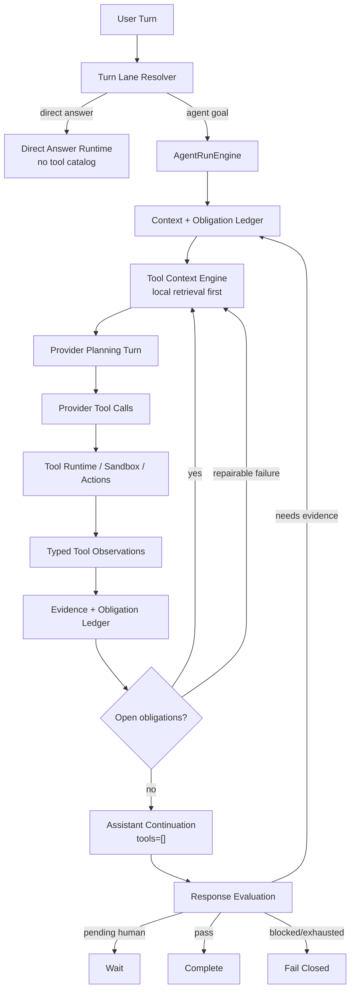

# ADR 0039: OpenClaw/Hermes Fast Accurate Main Loop

Status: Proposed

Date: 2026-06-09

Refines: ADR 0018 AgentRunEngine v2 Single-Loop Harness, ADR 0020 Progressive Tool Discovery Runtime, ADR 0021 Turn Lane Resolution and Direct Answer Runtime, ADR 0033 OpenClaw/Hermes Canonical Loop And Runtime Hygiene Convergence, ADR 0035 Obligation Ledger State Machine, ADR 0037 Single-Loop Final Review Upgrade, ADR 0038 Repairable Tool Observation Loop

## Context

The real run `6af70c27` exposed a performance and loop-shape regression.

The user asked a computation-heavy but read-only question:

```text
给我预测一下，如果目前的通胀率是15%，我的投资回报率是多少？
我是第2个股东，我投入的钱都是银行贷款出来的，银行利率是年利率3%
```

The run completed, but it took about 150 seconds. The actual work was small:

1. read workspace summary;
2. read ordered shareholder facts;
3. run one sandbox calculation;
4. generate a final assistant answer.

The harness did extra work around that path:

- every planning turn performed a provider-backed capability-router call before the real planning call;
- a failed sandbox observation was treated as both repairable feedback and missing sandbox evidence;
- repair iterations reopened broader tool surfaces than the failed obligation required;
- final answer claim review performed another provider call even after deterministic evidence was already present;
- successful tool observations were only converted to a no-tool assistant continuation through a late fallback, not as a first-class loop phase.
- structured `goalFacts.requiredActionCapabilities` produced by turn-lane resolution did not enter the Tool Context Engine, so repair turns knew a write was missing but the next tool surface could still be assembled from generic local retrieval and push the exact write tool into the deferred set.

This violates the product requirement:

```text
Agent OS must be both accurate and fast.
The model should use tools from environment feedback, but the harness must not add
hidden model calls and broad tool surfaces that make simple loops slow and unstable.
```

## Reference Findings

### OpenClaw

Local reference: `C:\Github\openclaw`.

Reusable ideas:

- The loop shape is simple: assistant, tool calls, tool results, assistant continuation.
- Tool-call argument repair and replay repair are runtime hygiene below the business layer.
- DeepSeek DSML/Harmony/XML-ish tool-call text is transport damage, not assistant prose. OpenClaw recovers standalone/provider-channel tool-call blocks into structured tool calls when the tool is allowed, and keeps assistant/tool/lifecycle channels separate.
- Tool failures become model-visible observations when they are repairable.
- Assistant/tool/lifecycle streams are separated, but they feed one runner-owned loop.
- The runner decides whether to continue, wait, fail, or complete.

Direct implication:

- `AgentRunEngine` should treat successful observations and repairable observations as next-turn inputs in the same loop.
- A final answer after tool observations should be generated through an assistant continuation stage with no tools, not through another full tool-discovery planning round when no open obligation remains.
- A failed sandbox attempt is still a sandbox observation. It can be invalid or repairable, but it is not "missing".

### Hermes Agent

Local reference: `C:\Github\hermes-agent`.

Reusable ideas:

- Tool search is a local registry assembly concern, not a provider call before every model turn.
- The tool catalog is rebuilt from live registry state and scoped to the current session.
- Core tools are never deferred.
- Search indexes compact tool docs, names, descriptions and top-level parameters.
- Bridge or deferred tools still unwrap to real tools so hooks, approval and result shaping stay unified.
- Dirty provider/tool-call sequences are normalized as tool-result observations, not hidden side effects.
- Leaked tool-call protocol text is treated as incomplete/dirty provider output, never as a confident final summary.

Direct implication:

- xox-model already has a local `ToolSearchIndex`; it should become the primary fast path.
- Capability-router output may remain a hint source, but it must not be mandatory on the hot path.
- Repair turns should be driven by runner-owned obligations and local retrieval, not another broad provider router.

### OpenAI Agents JS

Local reference: `C:\Github\openai-agents-js`.

Reusable ideas:

- Runner-side state owns tool execution, guardrails, interruptions, approvals, tracing and sandbox boundaries.
- Run items and next-step resolution are typed runner concepts.
- Provider adapters shape protocol details; they do not choose business semantics.

Direct implication:

- Final review, sandbox, tool catalog and confirmation cards must remain runner-side phases under `AgentRunEngine`.
- Provider-specific capability differences can be represented as runtime capabilities, but not as business-logic branches.

## Decision

Adopt a **fast accurate main loop**.

This ADR keeps the current xox-model assets and changes where they are used:



The important change is not a new runtime. It is the removal of unnecessary side calls from the hot path.

## Hard Invariants

1. **No semantic keyword routing.**

   Server code may use typed runtime status, provider capability flags, registered tool metadata, obligation kinds and structured tool output. It must not use user-language keyword lists, regex intent matching or case-specific branches to decide business semantics.

2. **Capability routing is hint-only and not mandatory.**

   The default tool surface is assembled locally from:

   - model-owned structured `goalFacts` in the run contract;
   - active obligations;
   - registered tool metadata;
   - kernel tools;
   - Hermes-style local retrieval over compact tool docs;
   - policy scope and automation authority.

   A provider capability router may be used later as an optional hint, but it cannot be required before every planning turn.

   Structured `requiredActionCapabilities` are not backend intent routing. They are part of the model-owned turn-lane contract and must be sanitized, persisted in the goal contract, and passed into Tool Context Engine so the visible surface includes the right write-capability families without scanning user prose.

3. **Repair turns do not broaden authority.**

   When a failed or invalid observation creates an active obligation, the next tool surface is built from the obligation plan. It should include the failed tool and any required prerequisite read tools, not a broad catalog.

4. **Sandbox failed attempt is not missing sandbox.**

   `sandbox_run_code` with `failed_repairable`, `completed_invalid` or `failed_terminal` is an observation. Readiness may require repair, but it must not also report `runtime.sandbox.observation_missing`.

5. **Tool output is never final user answer.**

   Data/sandbox/action observations are model evidence. The assistant final answer must come from a model turn after observations are replayed.

6. **Assistant continuation is a main-loop phase.**

   When observations exist and there are no open non-final obligations, the runner should call the model with `tools=[]` to produce the final answer candidate. This is not a late fallback and not a parallel finalizer.

   The continuation path must emit the same `final_answer_candidate` assistant-channel run event as a normal post-observation assistant turn. Transcript/UI code should not infer final answers from tool results or lifecycle rows.

7. **Deferred tool calls materialize and replay.**

   If the provider selects a registered but deferred tool, the runtime should materialize that exact tool schema and replan under the same effective inventory. The first damaged or deferred intent is a runner/tool-call boundary fact; it must not be silently dropped, and a final answer cannot pass while the goal still requires the missing write/action observation.

8. **Final claim review is not a required hot-path call.**

   Final answer claim extraction is optional review. It may run only when deterministic evidence/obligation state is insufficient and the provider capability allows the review without forcing unsupported tool choice. It must not add a provider call after the runner already has satisfied evidence.

9. **Direct answer stays direct.**

   Ambient questions such as date/time/weather-style general questions should use `Direct Answer Runtime` and bypass goal contract, memory recall, tool catalog and evaluator unless the lane resolver chooses an agent goal.

10. **Provider protocol text is not assistant final.**

   If a provider emits DSML/Harmony/XML-ish tool-call syntax as assistant text, the runtime boundary must treat it as protocol output:

   - when tools are available and every tool name is in the effective allowlist, promote it into structured `tool_calls`;
   - when the artifact is malformed or outside the effective inventory, return a provider/tool-call boundary failure;
   - when it appears in a no-tools final-answer candidate, ResponseEvaluator must reject it as `needs_final_answer`;
   - the UI must never display the raw protocol block as the assistant answer.

   This is provider hygiene, not semantic routing. It may parse provider protocol grammar, but it must not parse user prose to choose business actions.

11. **Sandbox inputs are self-describing runtime contracts.**

   A sandbox tool call should not need a separate domain read merely to discover project summary or ordered shareholder facts already required by the same calculation. `workspace_summary` and `forecast_months` bundles must carry:

   - workspace summary fields such as total revenue, total cost, total profit, ROI, ending cash and payback;
   - month rows with both domain-native fields and tool-schema aliases such as `plannedRevenue`, `plannedCost`, `plannedProfit` and `cash`;
   - ordered shareholder facts such as `shareholders` and `firstShareholder`.

   This keeps the hot path small: one sandbox call can read the current business facts and run a reproducible calculation.

12. **Sandbox helper functions hide envelope shape.**

   Model-written code should not need to know the internal input envelope `{ schemaVersion, manifest, bundle }`. The staged sandbox runtime provides helpers:

   - Python: `xox_sandbox.load_structured()`, `xox_sandbox.load_rows()`, `xox_sandbox.emit(...)`;
   - JavaScript: `loadStructured()`, `loadRows()`, `emit(...)` from `./xox_sandbox.mjs`;
   - envelope-level `load()` remains for manifest/provenance inspection only.

   This follows the OpenClaw/Hermes principle that provider/runtime dirtiness is normalized below the business reasoning layer.

## Module Plan

### `apps/api/src/agent/tool-gateway.ts`

- Keep `buildRuntimeToolCatalogProjection`.
- Make local progressive discovery the default for agent-goal tool surfaces.
- Accept run-scoped `goalFacts` from the goal contract and merge `requiredActionCapabilities` into the local Tool Context Engine input.
- Preserve provider-backed capability selection only as a non-hot optional hint path when explicitly enabled.
- Keep `tool_catalog_ready` trace data, but mark local selection reason clearly.

### `apps/api/src/agent/tool-context-engine/*`

- Reuse the existing Hermes-style local search index.
- Ensure kernel tools and high-score local retrieval can expose task-relevant tools even when no model-selected capabilities exist.
- Keep capability metadata as formal tool taxonomy, not user-language routing.

### `apps/api/src/agent/loop-readiness-check.ts`

- Treat any `sandbox_run_code` plan step as sandbox observation presence.
- Let failed/invalid sandbox outcomes be handled by repairable observation and response-evidence paths.

### `apps/api/src/agent/agent-run-engine.ts`

- Move observation-to-assistant continuation into the main loop when:
  - observations were produced;
  - there are no open non-final obligations;
  - there is no pending confirmation/clarification;
  - the latest observations are not repairable failures needing another tool turn.
- Keep repairable observations inside the main loop with a narrowed obligation plan.
- Pass sanitized goal contract facts into planner calls so Tool Gateway does not lose turn-lane constraints between iterations.
- Emit `final_answer_candidate` for both normal assistant-only final attempts and tool-observation continuation attempts.

### `apps/api/src/agent/runtime/openai-compatible-chat-adapter.ts`

- Keep provider-compatible protocol repair below the business planner.
- Recover OpenClaw-style standalone or provider-channel plain-text tool calls only through the effective tool allowlist.
- Normalize DeepSeek DSML tool-call blocks into provider-native `tool_calls` before planner steps are built.
- Preserve any provider-authored preface as assistant text, but strip the raw protocol block from assistant content.
- Surface malformed or out-of-inventory protocol artifacts as typed provider/tool-call boundary failures.
- Treat complete or truncated provider protocol artifacts as failures when `tools=[]`; a no-tool assistant continuation may produce natural language only, not another plain-text tool-call block.

### `apps/api/src/agent/response-evaluator.ts`

- Reject DSML/Harmony/XML-ish protocol artifacts in final assistant text.
- Treat such text as a missing natural-language final answer, not as evidence or a completed reply.

### `apps/api/src/agent/sandbox-service.ts`

- Build `workspace_summary` and `forecast_months` from one shared projection-bundle helper.
- Keep forecast rows aligned with `sandbox_run_code.dataRequest.fields` by exposing planned aliases alongside internal domain names.
- Include ordered shareholders in summary/forecast bundles so ordinal shareholder calculations do not require a second entity read.

### `apps/api/src/agent/sandbox/backends/staged-sandbox-io.ts`

- Keep the manifest envelope as the persisted boundary.
- Add language helpers that expose `structured` and `rows` directly to model-written code.
- Keep helper output observation-only; durable business writes still go through normal action tools and confirmation cards.

### `apps/api/src/agent/planning-context.ts`

- Carry `goalFacts` as runner context, not as prompt-only text.
- Keep `goalFacts` structured and sanitized; never add prose-derived capability guesses.

### `apps/api/src/agent/final-answer-claim-extractor.ts`

- Add a runner-side gate for optional claim review.
- Skip review when the evidence ledger and runtime facts already satisfy the response evaluator without claims.
- Do not force provider-specific unsupported review behavior.

### Tests

- Update API tests to assert:
  - local progressive discovery does not call the capability router on the hot path;
  - repair obligation turns use runner obligation plans;
  - sandbox failures are not also missing observations;
  - final answer after satisfied sandbox/data evidence uses assistant continuation without another tool catalog round;
  - provider plain-text tool-call artifacts are promoted or rejected at the runtime boundary;
  - truncated provider protocol markers are rejected even without a closing tag;
  - final-answer candidates containing provider tool-call syntax are rejected by ResponseEvaluator;
  - forecast sandbox bundles include summary fields, ordered shareholders and planned field aliases;
  - sandbox helper functions expose structured data and rows without requiring the model to parse the envelope;
  - direct ambient questions do not enter the agent-goal harness.

## Dependency Graph

```text
AgentRunEngine
  -> Tool Context Engine
     -> Tool Manifest / Search Index / Reranker / Schema Materializer
  -> Provider Runtime Adapter
  -> Tool Runtime / Sandbox / Action Runtime
  -> Evidence Ledger / Obligation Ledger
  -> Response Evaluator
  -> Transcript Projection

Provider Runtime Adapter
  -> provider capability/replay/stream hygiene only

Tool Context Engine
  -> no DB writes
  -> no completion decisions

Response Evaluator
  -> findings/obligations only
  -> no tool execution
```

## Validation

Automated:

```text
npm.cmd run test:api
npm.cmd run test:web
npm.cmd run build:web
```

Current implementation evidence:

- `npm.cmd run test:api` passes with 204/204 tests.
- API tests cover direct ambient date lanes, local progressive discovery, deferred tool materialization, sandbox observation continuation, cross-domain read -> write -> final-answer loops, and no regex/prose-based goal fact extraction.

Targeted real-provider smoke:

1. Complex ROI case:

   ```text
   请你用我经常测试用的给我预测一下，如果目前的通胀率是15%，我的投资回报率是多少？
   我是第2个股东，我投入的钱都是银行贷款出来的，银行利率是年利率3%
   ```

   Expected:

   - no write actions;
   - at least one workspace data observation;
   - sandbox calculation observation when the model decides computation is needed;
   - no broad repair catalog after sandbox failure;
   - final assistant answer after observations;
   - no unsupported forced claim-review failure on the hot path;
   - materially faster than the prior 150s path.

2. Ambient question:

   ```text
   今天天气怎么样
   ```

   Expected:

   - direct answer lane or a clarification-style direct response if location is needed;
   - no goal contract;
   - no tool catalog;
   - no memory recall;
   - no completion evaluator.

## Non-Goals

- Do not add keyword/regex intent routing.
- Do not remove confirmation cards, memory kernel, sandbox contract or progressive tool discovery.
- Do not copy OpenClaw local computer authority or Hermes local single-user assumptions.
- Do not add a second runtime adapter.

## Acceptance Criteria

- The two user-provided real-provider cases complete with correct lane shape and no leaked API key.
- The complex ROI run avoids repeated provider-backed capability-router calls.
- Sandbox repair remains model-driven through observations, not hardcoded scripts or server-side semantic branches.
- DSML/Harmony/XML-ish tool-call text is never accepted as a final answer; with tools enabled it is promoted to structured tool calls or fails closed.
- Direct ambient questions bypass the Agent goal harness.
- Existing web and API tests pass after test expectations are updated to the new hot path.
- `.agent/lessons.md` records the root cause: capability selection and review must be runner-side/local-first hot paths, not hidden provider side calls.
