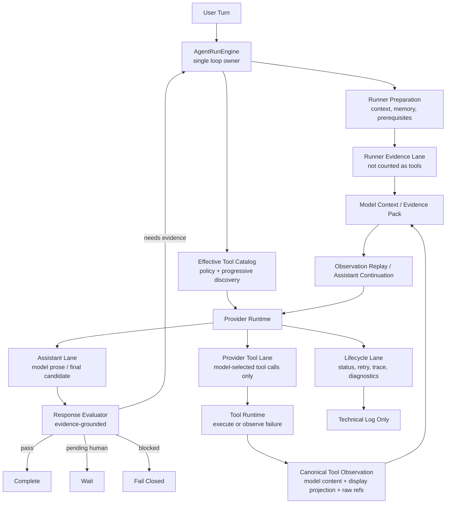

# ADR 0040: OpenClaw/Hermes Assistant Tool Lifecycle Evidence Lanes

Status: Implemented

Date: 2026-06-09

Refines: ADR 0011 Layered Agent Transcript Disclosure, ADR 0012 Tool Result Observation Continuation Loop, ADR 0016 Manifest Scoped Sandbox Tool, ADR 0032 Runner-Owned Evidence Contract v2, ADR 0033 Canonical Loop And Runtime Hygiene Convergence, ADR 0039 Fast Accurate Main Loop

## Context

Conversation `719f76f9` exposed two boundary failures in the current harness.

The user asked a read-only derived finance question:

```text
给我预测一下，如果目前的通胀率是15%，我的投资回报率是多少？
我是第2个股东，我投入的钱都是银行贷款出来的，银行利率是年利率3%
```

The final numeric answer was correct, but the run graph did not fully match the Agent OS contract:

1. A runner-owned prerequisite read (`data_query_workspace`) was persisted and displayed as if it were a model/provider-selected tool call.
2. The real `sandbox_run_code` result contained structured parsed output for the model, but the user-visible projection only showed a weak completion preview and hid the useful structured return.

These are not prompt problems and should not be fixed with keyword rules. They are lane and projection problems:

- runner preparation/evidence was mixed with provider tool calls;
- model-facing observation content was mixed with UI preview content;
- the transcript counted internal harness evidence as user-visible tool work.

## Reference Findings

### OpenClaw

Local reference: `C:\Github\openclaw`.

Relevant files reviewed:

- `packages/acp-core/src/runtime/types.ts`
- `src/agents/tools/common.ts`
- `src/chat/tool-content.ts`
- `ui/src/ui/chat/tool-cards.ts`
- `apps/android/app/src/main/java/ai/openclaw/app/tools/ToolDisplay.kt`

Reusable ideas:

- Assistant, tool and lifecycle/status events are separate runtime event kinds.
- Tool progress is a UI side channel. The model-facing result remains in tool content.
- Tool display summaries are bounded UI projections over raw tool data.
- Tool cards pair tool calls and tool results by id/name instead of flattening all runtime events into one row list.
- Provider tool content normalization is provider/runtime hygiene, not business logic.

Do not copy:

- OpenClaw's local control plane;
- local filesystem/session assumptions;
- host authority or plugin infrastructure that does not fit SaaS tenancy.

Reusable implementation boundary:

- Port only small MIT-attributed pure shapes/algorithms when useful, such as event lane names, tool-content id normalization and bounded display-summary logic.
- Keep xox-model's SaaS persistence, tenant isolation, confirmation cards and domain services.

### Hermes Agent

Local reference: `C:\Github\hermes-agent`.

Relevant files reviewed:

- `agent/transports/codex_event_projector.py`
- `agent/tool_dispatch_helpers.py`
- `tools/tool_result_storage.py`
- `agent/tool_executor.py`
- `agent/chat_completion_helpers.py`

Reusable ideas:

- Only real tool-shaped events become `assistant tool_call + tool result` pairs.
- Plan, hook, lifecycle and unknown events are recorded as opaque notes or diagnostics; they do not fabricate tool-call structure.
- Tool results are canonical model messages with `name`, `tool_call_id` and content.
- Large or structured tool results use a three-layer model: inline preview, persisted raw/reference, and aggregate budget.
- Provider/tool-call dirtiness is normalized before the next model call.

Do not copy:

- broad local computer authority;
- global single-user memory assumptions;
- product-facing universal `tool_call` wrappers as normal SaaS UI.

Reusable implementation boundary:

- Port the idea of `make_tool_result_message` and three-layer tool-result persistence/projection into TypeScript, not Hermes' Python runtime wholesale.
- Keep every result scoped by user/workspace/thread/run and redacted through xox-model policy.

### OpenAI Agents JS

Local reference: `C:\Github\openai-agents-js`.

Relevant files reviewed:

- `packages/agents-core/src/runner/modelPreparation.ts`
- `packages/agents-core/src/runner/toolExecution.ts`
- `packages/agents-core/src/runner/turnResolution.ts`
- `packages/agents-core/src/runner/tracing.ts`

Reusable ideas:

- Runner preparation collects enabled tools/handoffs as a capability snapshot for the model and tracing.
- Tool execution, tool input/output guardrails, tracing spans and interruptions are runner-owned.
- If a model turn contains tool calls or approvals, the runner must loop again so the model can see tool results before a final answer.
- Plain assistant text is final only when no tool calls/actions remain in the turn.

Do not copy:

- SDK-specific public types into `packages/contracts`;
- OpenAI Responses-only assumptions into OpenAI-compatible provider paths;
- SDK tool callbacks as direct domain-write executors.

Reusable implementation boundary:

- Keep OpenAI Agents JS as a runner-boundary reference. xox-model remains provider-neutral and SaaS-owned.

## Decision

Adopt **assistant / provider tool / runner evidence / lifecycle** lanes.

This ADR does not create another runtime and does not replace `AgentRunEngine`. It tightens the existing single-loop architecture:



Short rule:

```text
Only provider/model-selected tool calls belong to the user-visible tool lane.
Runner evidence can inform the model and evaluator, but it is not a tool call.
Lifecycle can explain the run to engineers, but it is not user-facing work.
```

## Implementation Notes

Implemented on 2026-06-09 without adding a parallel runtime or a new persistence table.

The current implementation uses a small formal lane contract first:

- `packages/contracts/src/index.ts` defines `AgentToolObservationLane = "provider_tool" | "runner_evidence"`.
- `apps/api/src/agent/action-draft-builder.ts` and `apps/api/src/agent/tool-observation-continuation.ts` carry the lane on read drafts and observations.
- `apps/api/src/agent/prerequisite-observations.ts` marks ordered entity prerequisites as `runner_evidence` and stops emitting plan-ready user events for that runner-owned read.
- `apps/api/src/agent/action-graph-store.ts` stores runner evidence as model/evaluator observation only; it does not insert a user-visible `agent_plan_steps` tool row, so tool counts stay provider-owned.
- `apps/api/src/agent/runtime/provider-transcript-replay.ts` replays provider tool observations as assistant `tool_calls` plus `tool` messages, while runner evidence is injected as source-aware evidence context instead of a fake provider tool result.
- `apps/api/src/agent/sandbox-service.ts` preserves `extraction.parsedOutput` in the display preview, alongside bounded text previews and raw-output refs.
- `apps/web/src/components/agent/AgentChatTimeline.test.ts` locks the expanded sandbox tool row so structured result fields remain visible.

This intentionally does not add `agent_run_evidence` yet. The existing in-loop observation path is sufficient for the current failure mode and avoids introducing a second source of truth. A future table is still valid if cross-run runner evidence auditing becomes a product requirement, but it must not reintroduce prerequisite-as-tool rows.

## Hard Invariants

1. **Provider tool lane is model-owned.**

   A row counted as "调用 N 个工具" must originate from a provider/model-selected tool call or from a provider tool-call repair that preserves that selected intent.

2. **Runner evidence is not a tool call.**

   Prerequisite reads, memory recall, context hydration, readiness checks, evaluator obligations and run preparation may be persisted as runner evidence or lifecycle diagnostics. They must not be inserted into the user-visible tool group or counted as provider tools.

3. **No fake tool ids for runner-owned work.**

   Names such as `prerequisite_<runId>_entity_summary` must not be used to make runner work look like a provider `tool_call_id`. If a model replay needs evidence, use a source-aware evidence message or context pack, not a persisted fake tool row.

4. **Tool output is model evidence, not final user answer.**

   A successful tool result may support a final answer, but the final answer must be model-authored after observation replay.

5. **Model content and display projection are separate.**

   `modelContent` is the canonical model-readable observation. `displayProjection` is bounded UI/audit presentation. `rawArtifactRef` points to large or exact artifacts. UI preview must never be the only copy of evidence.

6. **Sandbox observation must be inspectable.**

   For `sandbox_run_code`, the display projection must expose:

   - execution status, backend id, exit code and runtime duration;
   - structured extraction status and parsed output summary;
   - stdout/stderr snippets when present;
   - generated artifacts and raw-output references;
   - manifest/bundle consumption proof when available.

7. **Structured sandbox results must not be hidden behind "completed".**

   If `extraction.parsedOutput` exists, the tool row expansion should show its key values or compact table before raw JSON. "已完成" alone is not an acceptable result preview.

8. **Transcript projector is a renderer, not a classifier.**

   It may render lanes and pair tool calls/results. It may not decide that runner evidence is a tool or that a tool preview is an assistant answer.

9. **No keyword or regex semantic routing.**

   This ADR fixes lane/projection boundaries. It does not authorize scanning user prose to infer business intent.

10. **No compatibility shadow paths.**

    Replace the incorrect path cleanly. Do not keep a parallel "legacy prerequisite-as-tool" renderer or fake observation shim.

## Target Contracts

### `AgentProviderToolObservation`

Represents a model/provider-selected tool call and its execution result.

Required fields:

- `lane: "provider_tool"`
- `toolCallId`
- `toolName`
- `arguments`
- `status`
- `modelContent`
- `displayProjection`
- `rawArtifactRefs`
- `sourceRunId`
- `sequence`

### `AgentRunnerEvidence`

Represents runner-owned facts prepared for the loop.

Required fields:

- `lane: "runner_evidence"`
- `evidenceId`
- `evidenceKind`
- `scope`
- `modelUse`
- `visibility`
- `payload`
- `displayProjection`
- `sourceRunId`
- `sequence`

Rules:

- `visibility` defaults to `technical`.
- `modelUse` may be `context_pack`, `replay_evidence`, `evaluator_only` or `none`.
- It is never counted in user-visible tool totals.

### `AgentLifecycleEvent`

Represents technical run status.

Required fields:

- `lane: "lifecycle"`
- `eventKind`
- `status`
- `visibility`
- `payload`

Rules:

- User-facing transcript shows lifecycle only when it is an actionable failure/interruption.
- Technical log may show full lifecycle.

### `AgentObservationProjection`

Splits model and UI surfaces:

```text
modelContent: full redacted model-readable observation
displayProjection: bounded user/audit projection
rawArtifactRefs: exact persisted artifacts, never inline secrets
```

For sandbox, `displayProjection` must include:

- `summary`;
- `structuredPreview`;
- `stdoutPreview`;
- `stderrPreview`;
- `artifacts`;
- `rawOutputRef`;
- `manifestProof`.

## Module Plan

### `packages/contracts/src/index.ts`

Add provider-neutral lane contracts:

- `AgentTranscriptLane = "assistant" | "provider_tool" | "runner_evidence" | "lifecycle"`;
- `AgentProviderToolObservation`;
- `AgentRunnerEvidence`;
- `AgentObservationProjection`;
- `AgentObservationArtifactRef`.

Do not expose provider SDK types.

### `apps/api/src/agent/prerequisite-observations.ts`

Rename or refactor into a runner-evidence producer.

New behavior:

- returns `AgentRunnerEvidence[]`;
- does not create `readKind: "tool_observation"`;
- does not assign provider-looking tool call ids;
- can still feed Context Pack / evaluator / replay as evidence.

### `apps/api/src/agent/action-graph-store.ts`

Persist only provider tool calls and user-visible actions into action graph tool rows.

New behavior:

- `planSteps` tool rows come from `AgentProviderToolObservation` only;
- runner evidence persists separately as run evidence or technical events;
- counts such as "调用 N 个工具" ignore runner evidence.

### `apps/api/src/agent/runtime/provider-transcript-replay.ts`

Replay observations with lane awareness.

New behavior:

- provider tool observations replay as assistant tool-call + tool result protocol messages;
- runner evidence replays through a context/evidence message or a dedicated evidence pack;
- replay artifacts preserve source lane for evaluator/audit;
- no persisted fake provider `tool_call_id` is created for runner evidence.

### `apps/api/src/agent/sandbox-service.ts`

Upgrade sandbox projection.

New behavior:

- keep current full `modelContent`;
- build `displayProjection.structuredPreview` from `extraction.parsedOutput`;
- show stdout/stderr snippets and artifact refs;
- preserve raw output refs for large results;
- never reduce a successful structured calculation to "completed" only.

### `apps/api/src/agent/tool-runtime/*`

Normalize executor output into `AgentProviderToolObservation`.

New behavior:

- every provider tool call produces one observation: completed, failed, blocked, invalid or cancelled;
- observation carries model content, display projection and raw refs;
- tool result persistence follows the Hermes three-layer idea.

### `apps/api/src/agent/agent-transcript-projector.ts`

Render lanes instead of inferring them.

New behavior:

- provider tool lane renders compact tool rows;
- runner evidence stays in technical log unless explicitly user-facing;
- lifecycle stays technical except actionable failures;
- assistant final summary remains separate from tool results.

### `apps/web/src/components/agent/AgentChatTimeline.tsx`

Render compact provider tool rows from the lane contract.

New behavior:

- one user-visible tool row per provider-selected tool call;
- runner evidence does not appear under "调用 N 个工具";
- sandbox tool expansion shows structured result preview and raw refs.

## Data Model Options

Preferred path:

- Add `agent_run_evidence` for runner evidence, or add a typed lane column to existing run-event storage if that keeps the schema smaller.
- Keep `agent_plan_steps` for user-visible action graph and provider tool rows.
- Keep technical lifecycle events in `agent_run_events`.

Do not store runner prerequisites as plan steps.

## Migration Plan

1. Add contracts and tests for the four lanes.
2. Move prerequisite reads from tool-observation planned items to runner evidence.
3. Update action graph persistence and transcript projection so only provider tool observations count as tools.
4. Upgrade sandbox display projection to include structured parsed output and raw refs.
5. Update UI timeline to render the new structured sandbox projection.
6. Add real conversation regression tests using a fixture shaped like `719f76f9`.
7. Remove dead compatibility code that rendered prerequisite observations as tools.

## Acceptance Criteria

For a replay or fixture equivalent to `719f76f9`:

- the user-visible work group shows exactly one provider tool row: `sandbox_run_code`;
- runner prerequisite evidence exists in runner evidence / technical log but is not counted as a tool;
- `sandbox_run_code` expansion shows parsed output values such as shareholder profit, loan interest, nominal ROI and real ROI;
- the final assistant answer is model-authored after observation replay;
- no tool result text is displayed as the assistant answer;
- no fake `prerequisite_*` tool call id appears in user-visible transcript rows;
- API tests prove `prerequisite-observations` cannot create plan-step tool rows;
- API tests prove sandbox structured output survives display projection;
- UI tests prove tool counts exclude runner evidence and sandbox expansion shows structured result;
- no regex/keyword intent-routing logic is added.

Commands:

```powershell
npm.cmd run test:api
npm.cmd run test:web -- AgentChatTimeline
npm.cmd run build:web
```

Implemented validation:

- `npm.cmd run test:api` passed: 14 files, 211 tests.
- `npm.cmd run test:web -- AgentChatTimeline` passed: 1 file, 19 tests.
- `npm.cmd run test:web` passed: 11 files, 76 tests.
- `npm.cmd run build:web` passed.

Manual smoke:

```text
给我预测一下，如果目前的通胀率是15%，我的投资回报率是多少？
我是第2个股东，我投入的钱都是银行贷款出来的，银行利率是年利率3%
```

Expected behavior:

- model may receive runner evidence and sandbox result;
- UI counts only real provider tools;
- final answer includes the derived calculation;
- technical log may show prerequisite evidence, but the main transcript remains clean.

## Relationship To Existing ADRs

### Keeps

- ADR 0018 / 0033: one `AgentRunEngine` owns finality.
- ADR 0020 / 0039: progressive tool discovery and fast local catalog remain.
- ADR 0032: runner-owned evidence remains the acceptance basis.
- ADR 0016 / 0026: manifest-scoped real sandbox remains the computation boundary.

### Clarifies

- Runner-owned evidence is not the same thing as provider tool observation.
- Display preview is not the same thing as model-readable observation.
- Technical lifecycle events are not user-visible work.

### Moves

- Prerequisite reads move out of action graph tool rows and into runner evidence.
- Sandbox structured output moves into a first-class display projection instead of hiding in `modelContent`.

### Removes

- Fake provider-looking tool ids for prerequisites.
- User-visible tool counts that include runner work.
- Any compatibility path that preserves prerequisite-as-tool behavior.

## Reuse Plan

OpenClaw:

- Reuse event-lane separation and bounded tool-display-summary ideas.
- Port only small MIT-attributed pure code if a direct algorithm is useful.

Hermes:

- Reuse canonical tool-result message shape and three-layer result persistence idea.
- Port only small pure normalization/projection helpers when useful; keep SaaS scoping and redaction local.

OpenAI Agents JS:

- Reuse runner-owned preparation/tool execution/turn resolution boundary concepts.
- Do not leak SDK contracts into shared xox-model contracts.

## Non-Goals

- No new provider.
- No new main loop.
- No account-impacting Agent actions.
- No keyword/regex semantic routing.
- No UI-only fix that leaves backend evidence mixed.
- No fake sandbox or contract-only execution path.
