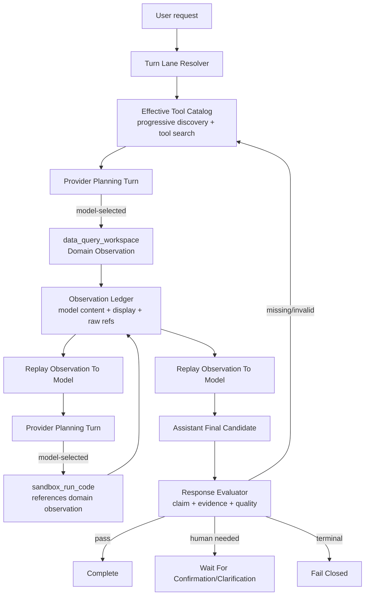

# ADR 0041: OpenClaw-Style Observe-Before-Sandbox Quality Loop

Status: Superseded by ADR 0042 for runtime policy; retained as regression analysis

Date: 2026-06-10

Refines: ADR 0016 Manifest Scoped Sandbox Tool, ADR 0020 Progressive Tool Discovery Runtime, ADR 0032 Runner-Owned Evidence Contract v2, ADR 0036 Claim-Grounded Observation Loop, ADR 0039 Fast Accurate Main Loop, ADR 0040 Assistant Tool Lifecycle Evidence Lanes

Superseded by ADR 0042: the hardcoded observe-before-sandbox route and write-SDK policy-stop semantics are no longer normative. The retained lesson is contract unification: provider tool calls and sandbox SDK calls must use the same tool names, argument schemas and output contracts.

## Context

Recent regression comparisons between `6af70c27` and `9010a623` exposed a quality loss after the fast-path optimization:

- the better run first called `data_query_workspace`, then used sandbox code with observed business facts;
- the worse run skipped the model-visible domain read and asked `sandbox_run_code` to mount workspace data directly;
- the sandbox executed, but the generated code misunderstood the bundle shape (`totalRevenue` vs `grossSales`, `rows` as one summary row rather than twelve month rows);
- the final answer became shorter and less informative because the finalizer prompt also pushed a global short-answer policy.

The mistake was not only that sandbox mounted data directly. The deeper issue is that `xox_sandbox.load_structured()` is a low-level bundle helper, while the model thinks in provider tools such as `data_query_workspace`. If the provider turn teaches the model one tool contract and the sandbox code asks it to use another unrelated helper contract, the harness has created two mental models.

For xox-model, OpenClaw remains the benchmark: one main loop, model observes environment feedback, tools return observations, and the assistant final answer is generated after those observations. Hermes contributes provider/tool-call hygiene and tool-result persistence discipline. OpenAI Agents JS contributes runner-side guardrail, tracing, HITL and sandbox boundaries.

## Reference Findings

### OpenClaw

Local reference: `C:\Github\openclaw`.

Relevant areas:

- `packages/llm-runtime/src/stream.ts`
- `packages/tool-call-repair/src/stream-normalizer.ts`
- `docs/tools/tool-search.md`
- `docs/tools/code-execution.md`
- `ui/src/ui/chat/tool-cards.ts`

Reusable ideas:

- Tool results are environment feedback, not assistant answers.
- Provider protocol repair belongs below the business loop.
- Assistant, tool and lifecycle events must stay separate.
- Code execution is a tool observation inside the same loop; failures are feedback for the model to repair.
- Tool search narrows inventory, but the selected tool still executes through the canonical tool-result path.

Do not copy:

- OpenClaw local control plane, local filesystem authority, plugin registry or host session assumptions.

### Hermes Agent

Local reference: `C:\Github\hermes-agent`.

Relevant areas:

- `agent/anthropic_adapter.py`
- `agent/agent_init.py`
- `tools/tool_search.py`
- `tools/tool_result_storage.py`
- `tools/code_execution_tool.py`

Reusable ideas:

- Tool calls and tool results are paired in the model message sequence.
- Dirty provider sequences are normalized without pretending to understand business intent.
- Large tool results have separate inline preview, stored raw result and model-readable content.
- Code execution can be powerful, but it must stay tool-mediated and bounded.

Do not copy:

- Hermes local machine authority, unrestricted local tool execution, or local user/session model.

### OpenAI Agents JS

Local reference: `C:\Github\openai-agents-js`.

Relevant areas:

- `packages/agents/README.md`
- `docs/src/content/docs/ko/guides/agents.mdx`
- `docs/src/content/docs/ko/guides/guardrails.mdx`
- `docs/src/content/docs/ko/guides/human-in-the-loop.mdx`
- `docs/src/content/docs/ko/guides/sandbox-agents.mdx`

Reusable ideas:

- Runner owns guardrails, tracing, HITL and sandbox boundaries.
- Tools receive typed context instead of reaching into arbitrary global state.
- Sandbox/session/manifest/capability boundaries are runner-side concepts, not business-tool shortcuts.

Do not copy:

- OpenAI-specific Responses-only assumptions into xox-model's OpenAI-compatible provider runtime.

## Superseded Decision

ADR 0041 originally proposed an **Observe-Before-Sandbox Quality Loop** for tasks combining current workspace data with external assumptions, scenario math, financing assumptions, inflation/discounting, or other derived calculations. This fixed route solved one regression but overfit the harness.

The old shape was:



Superseded invariant:

```text
Historical invariant, no longer normative: workspace-data calculations should not hide ground truth from the model; ADR 0042 now implements this through one unified tool runtime rather than a fixed tool order.
```

ADR 0042 replaces this with a more general OpenClaw/Hermes contract: the model decides the next tool from observations inside the single loop; sandbox code can call the same tools through `xox_sandbox.<tool_name>(...)`; the runtime enforces tenant policy, approval, audit and repair. A domain observation is often the right next step, but it is not a hardcoded path.

## Contract

### Canonical Domain Observation

`data_query_workspace` is the canonical model-visible domain read for current workspace facts.

Target shape:

```ts
type DomainObservation = {
  id: string
  toolName: 'data_query_workspace'
  scope:
    | 'workspace_summary'
    | 'period_summary'
    | 'member_summary'
    | 'team_summary'
    | 'entity_summary'
    | 'top_months'
    | 'variance_detail'
    | 'ledger_history'
  schemaVersion: 'domain-observation.v1'
  structured: Record<string, unknown>
  rows?: Array<Record<string, unknown>>
  rowKind?: 'forecast_month' | 'ledger_entry' | 'variance_item' | 'none'
  entities?: Record<string, unknown>
  display: {
    title: string
    preview: string
  }
}
```

Important rules:

- `workspace_summary` is a summary object; it must not pretend that `rows` are month rows.
- Month-level data must use `rowKind: "forecast_month"` and explicit month rows.
- Ordered shareholders, members and cost objects must be represented in `entities` or in named structured fields.
- Field aliases used by tools (`grossSales`, `totalProfit`, `roi`, `shareholders`, `plannedRevenue`) must be shared with sandbox bundles.

### Generated Sandbox Tool SDK

`sandbox_run_code` remains a real manifest-scoped execution tool, but code inside the sandbox should use a **generated tool-shaped SDK** that mirrors the model-facing provider tools.

The point is not that `data_query_workspace` is a special sandbox entrypoint. It is only one example of the broader rule:

```text
AGENT_TOOL_REGISTRY / buildToolManifests
-> provider tool definitions
-> sandbox SDK function definitions
-> docs/agent-tool-manifest.md
```

Every provider tool should have a generated sandbox SDK function with the same semantic name, argument schema and documented result contract. This gives the model one vocabulary across tool calls and sandbox code instead of forcing it to paste prior observations into code as prose.

Python authoring shape:

```python
import xox_sandbox

summary = xox_sandbox.data_query_workspace(
    scope="workspace_summary",
    metrics=["roi", "cash", "payback"],
)

entities = xox_sandbox.data_query_workspace(
    scope="entity_summary",
    metrics=["shareholderNames", "shareholderInvestments"],
)

matches = xox_sandbox.rg(
    pattern="shareholder",
    paths=["tools/effective-tool-manifest.md", "observations/domain.json"],
)

xox_sandbox.emit({...})
```

JavaScript authoring shape:

```js
import { dataQueryWorkspace, rg, emit } from './xox_sandbox.mjs'

const summary = dataQueryWorkspace({
  scope: 'workspace_summary',
  metrics: ['roi', 'cash', 'payback'],
})

const matches = rg({
  pattern: 'shareholder',
  paths: ['tools/effective-tool-manifest.md', 'observations/domain.json'],
})

emit({...})
```

The sandbox SDK method names and argument schema must be generated from provider tools as closely as language conventions allow:

```text
provider tool: data_query_workspace
sandbox SDK:  xox_sandbox.data_query_workspace(...)
JS SDK:       dataQueryWorkspace(...)

provider tool: workspace_patch_config
sandbox SDK:  xox_sandbox.workspace_patch_config(...)
JS SDK:       workspacePatchConfig(...)
```

This paragraph is superseded by ADR 0042. The sandbox SDK is not a second implementation path, but it is a live bridge into the same Tool Runtime Gateway. Read and write tools keep the same name, argument schema and result contract as provider tool calls. Write-capable calls execute only through normal tenant policy, confirmation, domain service and audit boundaries, and may pause the whole sandbox run on one aggregate approval.

Target backing contract:

```ts
type SandboxToolRequest = {
  toolName: AgentToolName
  arguments: Record<string, unknown>
  sourceObservationIds?: string[]
}

type SandboxToolAuthority =
  | 'observation_replay'
  | 'manifest_search'
  | 'pure_calculation'
  | 'emit_output'
  | 'tool_runtime_bridge'
```

Rules:

- Read-only observation tools return the same structure the model saw from the corresponding provider tool.
- SDK functions may only read observations/bundles that the runner already authorized for the sandbox manifest.
- SDK functions must not call the production API, production database, internal HTTP endpoints or arbitrary tools.
- If requested data was not observed or bundled, the function fails with a typed missing-observation error; it must not invent data or silently broaden access.
- Write-capable provider tools are still represented as generated SDK functions, but their sandbox authority is `tool_runtime_bridge`. Calling them from sandbox must not access DB or domain services directly; it bridges to the same Tool Runtime Gateway, which may execute, return an action preview, or pause the whole sandbox run on one aggregate approval.
- `load_structured()` and `load_rows()` may remain as low-level escape hatches for generic file/data transformation, manifest debugging or non-domain bundles, but model-facing prompts and examples should prefer generated tool-shaped SDK functions.

### Tool Manifest And Scoped `rg`

The sandbox needs a searchable description of available tools and SDK façades. It should not infer tool availability from prompt prose or from ad hoc examples.

Add a canonical tool document:

```text
docs/agent-tool-manifest.md
```

Rules:

- The document is the human/model-readable tool reference.
- Its source of truth is still `AGENT_TOOL_REGISTRY` plus `buildToolManifests(...)`; implementation should generate or verify this document from code, not maintain a drifting second registry.
- It lists provider tool names, capabilities, risk levels, confirmation modes, navigation targets, prerequisites, read/write status and sandbox SDK façade names.
- The same document, or a run-scoped subset of it, is mounted read-only into sandbox manifests.

Sandbox SDK should expose a restricted ripgrep façade:

```python
matches = xox_sandbox.rg(
    pattern="data_query_workspace",
    paths=["tools/agent-tool-manifest.md"],
    context_lines=2,
    max_matches=20,
)
```

JavaScript equivalent:

```js
const matches = rg({
  pattern: 'data_query_workspace',
  paths: ['tools/agent-tool-manifest.md'],
  contextLines: 2,
  maxMatches: 20,
})
```

`rg` is a read-only search tool, not a filesystem capability.

Allowed search roots:

- `tools/agent-tool-manifest.md`: generated full or effective tool documentation.
- `tools/effective-tool-manifest.md`: current run's policy-filtered, materialized tool subset.
- `observations/*.json` and `observations/*.md`: model-visible observations already authorized for this run.
- `inputs/**`: user-uploaded or generated text artifacts that passed file policy and are explicitly in the sandbox manifest.

Forbidden search roots:

- production repository files;
- production database files;
- environment files and provider keys;
- server logs and run logs outside the current manifest;
- raw tenant data not minimized into the manifest;
- memory stores outside current authorized memory observations;
- arbitrary absolute paths, symlinks, `..` traversal and hidden host paths.

`xox_sandbox.rg(...)` returns structured matches:

```ts
type SandboxRgMatch = {
  path: string
  line: number
  text: string
  before?: string[]
  after?: string[]
  truncated?: boolean
}
```

Security and correctness rules:

- Search is literal by default; regex mode must be explicit.
- Server enforces max files, max bytes, max matches, max context lines and timeout.
- Search output is redacted with the same secret policy as tool observations.
- `rg` cannot discover tools that are not in the effective manifest; it can only help code use already documented/authorized tools correctly.
- If a model needs a tool outside the effective manifest, it must return to the main loop through `tool_discover` / progressive discovery, not use sandbox `rg` to bypass the catalog.

### Observation Replay

Tool results must be replayed to the model as observations. The model, not the tool result projector, writes the final user answer.

The replay order for derived finance questions is:

```text
data_query_workspace observation
-> model sees domain structure
-> sandbox_run_code observation
-> model sees executed calculation output
-> assistant final answer
-> response evaluation
```

## Final Answer Quality Policy

Remove this global prompt rule:

```text
默认短答：优先用 1 个结论句 + 最多 4 个关键数字/要点。
除非用户要求详细报告，不要生成长表格、长解释、长“关键解读”。
```

Replacement policy:

- Answer depth follows the task and evidence, not a global brevity cap.
- Simple direct-answer turns such as greetings or current date stay concise through the Turn Lane Resolver.
- Derived finance answers should preserve useful evidence from sandbox output: assumptions, formula口径, key values, alternative口径 when relevant, and caveats.
- The assistant may be concise only when the user asks a simple question or the evidence itself is simple.
- The evaluator should reject final answers that drop requested variables or materially under-explain a complex calculation.

## Relationship To Existing ADRs

### Keep

- ADR 0016: real manifest-scoped sandbox isolation. ADR 0042 corrects the interpretation: sandbox cannot write directly, but it may request writes through the unified Tool Runtime Gateway.
- ADR 0020: progressive tool discovery plus Hermes-style search/retrieval.
- ADR 0032: runner-owned evidence and response evaluation.
- ADR 0036: claim-grounded loop requiring domain facts before shareholder ROI claims.
- ADR 0040: assistant/tool/lifecycle lane separation and model/display/raw result split.

### Correct

ADR 0039's sandbox fast path must be narrowed, and ADR 0042 provides the current normative shape:

- Keep self-describing sandbox bundles and low-level helpers as internal/advanced APIs.
- Promote tool-shaped sandbox SDK methods such as `xox_sandbox.data_query_workspace(...)` as the model-facing code authoring API.
- Remove the claim that sandbox should use a private bundle/helper contract for facts the model needs to reason about.
- The optimization target is not "one sandbox call instead of a domain observation"; it is "one unified tool runtime, no duplicate capability-router churn, no repeated memory injection, no fake tool rows".

ADR 0040's runner evidence separation remains valid, but it does not mean current workspace facts should always be hidden as runner-only evidence. For workspace-data calculations, the domain read is part of model cognition and should be a model-visible observation. Hidden runner evidence may support safety or evaluator checks, but it cannot replace the model's observed domain tool result.

## Implementation Plan

### 1. Prompt Cleanup

Edit:

- `apps/api/src/agent/prompts/planner.system.md`
- `apps/api/src/agent/prompts/tool-observation-finalizer.system.md`

Changes:

- Delete the instruction that says not to call `data_query_workspace` before sandbox for the same summary.
- Replace it with unified tool-runtime language from ADR 0042.
- Delete the global short-answer rule.
- Keep simple direct-answer behavior in the turn resolver, not in the finalizer prompt.

### 2. Shared Domain Observation Contract

Edit:

- `docs/agent-tool-manifest.md`
- `packages/contracts/src/index.ts`
- `apps/api/src/agent/data-agent.ts`
- `apps/api/src/agent/tool-catalog.ts`
- `apps/api/src/agent/tool-context-engine/tool-manifest.ts`
- `apps/api/src/agent/sandbox-service.ts`
- `apps/api/src/agent/sandbox/backends/staged-sandbox-io.ts`

Changes:

- Introduce `DomainObservation` and `SandboxToolRequest` types.
- Add a generated or verified tool manifest document from `AGENT_TOOL_REGISTRY` and `buildToolManifests`.
- Make `data_query_workspace` response and sandbox bundles share field names and row semantics.
- Add `xox_sandbox.data_query_workspace(...)` and `dataQueryWorkspace(...)` SDK façades backed by the same observation contract.
- Add `xox_sandbox.rg(...)` and `rg(...)` as manifest-scoped read-only search over authorized virtual docs.
- Ensure `workspace_summary` does not expose ambiguous `rows`.
- Ensure `forecast_months` exposes month rows with a clear `rowKind`.
- Ensure `entity_summary` exposes ordered shareholders and investments.

### 3. Loop Obligation

Edit:

- `apps/api/src/agent/agent-run-engine.ts`
- `apps/api/src/agent/loop-obligations.ts`
- `apps/api/src/agent/loop-obligation-ledger.ts`
- `apps/api/src/agent/tool-context-engine/tool-reranker.ts`
- `apps/api/src/agent/runtime-planning-call.ts`

Changes:

- If a turn requires current workspace facts plus sandbox computation, open a `domain_observation_before_sandbox` obligation.
- Satisfy it only with same-run model-visible `data_query_workspace` observation or an explicitly replayed equivalent.
- Do not satisfy it with hidden runner-only prerequisites.
- After a matching domain observation exists, keep `sandbox_run_code` projected and make the sandbox request reference the observation id.

### 4. Sandbox And Result Quality Evaluation

Edit:

- `apps/api/src/agent/evidence-ledger.ts`
- `apps/api/src/agent/response-evaluator.ts`
- `apps/api/src/agent/loop-readiness-check.ts`

Changes:

- Treat sandbox results as valid computation evidence only when real execution completed and manifest consumption is proven.
- Add quality checks for structural anomalies:
  - `totalRevenue` or similar derived fields become zero while observed `grossSales` is non-zero;
  - `monthCount` is one when the user asked for a horizon/monthly calculation and domain evidence has many months;
  - final answer omits requested assumptions such as inflation rate, loan rate, shareholder index, investment amount, dividend ratio or selected ROI口径;
  - final answer ignores useful structured sandbox output.
- These checks must inspect typed observations and claims, not scan user prose with keyword lists.

### 5. Transcript Projection

Edit:

- `apps/api/src/agent/agent-transcript-projector.ts`
- `apps/api/src/agent/agent-timeline-projector.ts`
- `apps/web/src/components/agent/AgentChatTimeline.tsx`

Changes:

- Show model-selected `data_query_workspace` and `sandbox_run_code` as visible tools.
- Keep runner-only lifecycle and hidden prerequisites in technical logs.
- Show sandbox parsed output compactly in the tool row expansion.
- Ensure final assistant answer appears after tool observations.

### 6. Tests And Real-Provider Smoke

Edit:

- `apps/api/tests/api.test.ts`
- `apps/api/tests/response-evaluator.test.ts`
- `apps/api/tests/sandbox-tool.test.ts`
- `apps/api/tests/tool-runtime.test.ts`
- `apps/web/src/components/agent/AgentChatTimeline.test.ts`

Validation commands:

```powershell
npm.cmd run test:api -- response-evaluator
npm.cmd run test:api -- sandbox-tool
npm.cmd run test:api -- tool-runtime
npm.cmd run test:api
npm.cmd run test:web
npm.cmd run build:web
npm.cmd run test
```

Real-provider smoke cases:

```text
给我预测一下，如果目前的通胀率是15%，我的投资回报率是多少？
我是第2个股东，我投入的钱都是银行贷款出来的，银行利率是年利率3%
```

Expected trajectory:

```text
data_query_workspace
-> sandbox_run_code
-> assistant final answer
-> response_evaluated pass
```

```text
今天天气怎么样
```

Expected trajectory:

```text
direct answer or explicit unsupported-live-weather clarification
no workspace data tool
no sandbox
no goal/evaluator loop
```

## Acceptance Criteria

For the shareholder inflation/loan ROI class:

- The run cannot call `sandbox_run_code` as the first workspace-data observation.
- Provider and sandbox code must use the same tool contracts; ADR 0042 no longer requires `data_query_workspace` to appear before every sandbox run as a fixed path.
- Sandbox code reads the same structured contract the model observed through `xox_sandbox.data_query_workspace(...)`, not through a separate hidden bundle shape.
- Sandbox code can use `xox_sandbox.rg(...)` only to search the generated/effective tool manifest or other manifest-authorized read-only content.
- The final answer includes:
  - selected shareholder identity or ordinal;
  - investment amount;
  - dividend ratio or profit share;
  - base profit/shareholder profit;
  - loan interest;
  - nominal ROI;
  - loan-adjusted ROI;
  - inflation-adjusted ROI口径;
  - caveats when the model data lacks monthly cash-flow granularity.
- The final answer is allowed to be rich when the calculation is rich; no global short-answer rule may truncate it.
- ResponseEvaluator fails if sandbox output contains structural anomalies such as zero revenue from a non-zero workspace summary or one-month count from a twelve-month forecast.

For simple direct-answer turns:

- `今天是几月几号` uses the direct-answer lane and does not enter domain/sandbox harness.
- `你好` remains one concise assistant reply.

For UI/transcript:

- Tool rows show tool observations, not fake assistant answers.
- Technical lifecycle events remain behind technical log disclosure.
- Sandbox row expansion shows parsed output or raw artifact references, not only "completed".

## Non-Goals

- Do not add a second runtime adapter.
- Do not reintroduce keyword, regex or language-specific semantic routing.
- Do not use `xox_sandbox.load_structured()` as the primary domain-data API; keep it only as a low-level helper behind the tool-shaped SDK.
- Do not expose unrestricted filesystem `rg`; sandbox `rg` is a manifest-scoped virtual document search.
- Do not import OpenClaw/Hermes control planes.
- Do not make OpenAI Responses-only behavior a requirement.

## Migration Order

1. Prompt cleanup and documentation alignment.
2. Contract unification with tests for domain observation and sandbox bundle shape.
3. Loop obligation for unified tool-runtime evidence.
4. Evaluator quality checks.
5. Transcript projection checks.
6. Real-provider smoke with DeepSeek key supplied through local environment only.

This order is intentional: contract and observation shape must be fixed before evaluator strictness, otherwise the evaluator will only add another layer of noise.
