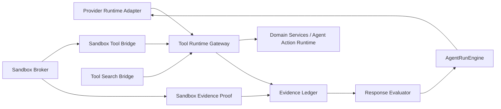

# ADR 0043: Evidence-Anchored Unified Tool Sandbox Runtime

Status: Proposed

Date: 2026-06-10

Refines: ADR 0016, ADR 0018, ADR 0020, ADR 0021, ADR 0032, ADR 0035, ADR 0040, ADR 0042

Supersedes: the acceptance parts of ADR 0042 that allow a sandbox result to count as authoritative evidence based only on `executionMode=executed`, `manifestScoped=true`, and readable output.

## Context

ADR 0042 established the right product direction: provider tool calls and sandbox code should share the same tool names, argument schemas, output contracts, policy, audit, and approval path. The regression exposed by conversation `79e9cd45` shows that the implementation still has a weaker evidence model:

- `sandbox_run_code` executed real code, but the script hardcoded financial constants instead of calling the same `data_query_workspace` surface available to the model.
- Runner-owned prerequisite observations injected an entity summary, then later evidence checks treated that hidden synthetic read as if the model had observed it.
- `xox_sandbox.data_query_workspace(...)` currently reads staged bundle data through `_read_tool_result`, so it looks like the provider tool but does not actually enter the same Tool Runtime Gateway.
- `ResponseEvaluator` accepted the final answer because there was one successful sandbox observation and enough-looking data evidence, not because the sandbox calculation was anchored to tool/runtime observations the model could inspect.

This is an architecture bug, not a prompt bug. The next upgrade must make ADR 0042 enforceable through a single evidence-anchored runtime.

## Reference Implementations

### OpenClaw

Relevant local references:

- `C:\Github\openclaw\packages\tool-call-repair\src\stream-normalizer.ts`
- `C:\Github\openclaw\packages\tool-call-repair\src\promote.ts`
- `C:\Github\openclaw\src\utils\transcript-tools.ts`
- `C:\Github\openclaw\packages\llm-runtime\src\stream.ts`

OpenClaw's useful ideas for xox-model:

- The model loop is canonical: model output becomes assistant text or tool calls; tool results become observations; observations feed the next model turn.
- Provider weirdness is normalized at the runtime boundary. Leaked text tool calls are promoted or scrubbed before the rest of the harness reasons about them.
- Tool-call and tool-result classification is centralized, so UI metrics, transcript replay, and runtime semantics do not drift.
- Tool execution artifacts are not treated as final answers. They are observations that the model must consume before answering.

### Hermes Agent

Relevant local references:

- `C:\Github\hermes-agent\tools\registry.py`
- `C:\Github\hermes-agent\tools\tool_search.py`
- `C:\Github\hermes-agent\tools\code_execution_tool.py`
- `C:\Github\hermes-agent\agent\tool_executor.py`
- `C:\Github\hermes-agent\agent\tool_dispatch_helpers.py`
- `C:\Github\hermes-agent\model_tools.py`

Hermes' useful ideas for xox-model:

- Tools register once with schema, handler, toolset, availability, and result limits. Downstream code reads the registry instead of maintaining parallel lists.
- Tool search defers non-core tools, but bridge calls still dispatch through the same `handle_function_call` path, so guardrails, hooks, approvals, and result truncation remain identical.
- Code execution is programmatic tool calling: generated stubs call back to the parent over RPC/file RPC, and the parent dispatches real tools. The script does not get a fake private implementation of those tools.
- Tool outputs are wrapped as untrusted observations before they return to the model, preserving message order and provider expectations.

### OpenAI Agents JS

Relevant local references:

- `C:\Github\openai-agents-js\docs\src\content\docs\guides\sandbox-agents\concepts.mdx`
- `C:\Github\openai-agents-js\docs\src\content\docs\guides\results.mdx`
- `C:\Github\openai-agents-js\docs\src\content\docs\guides\human-in-the-loop.mdx`
- `C:\Github\openai-agents-js\docs\src\content\docs\guides\guardrails.mdx`
- `C:\Github\openai-agents-js\packages\agents-extensions\src\sandbox\shared\manifest.ts`
- `C:\Github\openai-agents-js\packages\agents-extensions\src\sandbox\shared\types.ts`

OpenAI Agents JS's useful ideas for xox-model:

- Runner owns context, approvals, guardrails, tracing, interruptions, and resumable state.
- Sandbox definition, manifest, live sandbox session, capability attachment, and per-run sandbox config are distinct concepts.
- The result surface separates final output, rich run items, approvals, raw responses, and run context. This maps directly to our assistant/tool/lifecycle lanes.

## Decision

Keep the current xox-model assets:

- TypeScript API and domain services.
- `AgentRunEngine` single-loop direction.
- progressive tool discovery.
- OpenClaw-first memory kernel.
- confirmation cards and Agent action lifecycle.
- manifest-scoped sandbox contract from ADR 0016.
- unified tool/sandbox idea from ADR 0042.

Upgrade them with an evidence-anchored runtime:

```mermaid
flowchart TD
    A["User turn"] --> B["Turn Lane Resolution"]
    B -->|direct answer| C["Assistant lane"]
    B -->|agent goal| D["AgentRunEngine main loop"]

    D --> E["Context Pack + Memory + Effective Catalog"]
    E --> F["Provider Runtime Adapter"]
    F --> G["Normalized Assistant / Tool Events"]

    G -->|assistant candidate| H["Response Evaluator"]
    G -->|provider tool call| I["Tool Runtime Gateway"]
    G -->|sandbox_run_code| J["Sandbox Broker"]

    J --> K["Sandbox SDK stubs"]
    K -->|xox_sandbox.<tool>(args)| I
    I --> L["Tool Observation"]
    L --> M["Evidence Ledger"]
    M --> D

    H -->|pass| N["Final assistant answer"]
    H -->|missing or invalid evidence| O["Typed loop obligations"]
    O --> D
```

The invariant is simple:

> Any fact that can satisfy final-answer evidence must come from a model-visible tool observation or from a sandbox proof that is anchored to model-visible tool observations through the same Tool Runtime Gateway.

## Architecture Contract

### 1. One Tool Runtime Gateway

All executable tool surfaces must enter the same runtime:

```ts
type ToolInvocationSource =
  | 'provider_tool_call'
  | 'sandbox_sdk'
  | 'tool_search_bridge'
  | 'runner_observation'

type ToolRuntimeInvocation = {
  name: string
  arguments: Record<string, unknown>
  source: ToolInvocationSource
  tenant: { userId: string; workspaceId: string; threadId: string; runId: string }
  parentObservationId?: string
  approvalEnvelopeId?: string
  visibility: 'model_visible' | 'context_only' | 'technical'
}

type ToolRuntimeObservation = {
  observationId: string
  name: string
  arguments: Record<string, unknown>
  output: unknown
  authority: 'tool' | 'sandbox' | 'runner'
  status: 'completed' | 'failed' | 'pending_approval' | 'cancelled'
  visibility: 'model_visible' | 'context_only' | 'technical'
  synthetic: boolean
  provenance: ToolObservationProvenance
}
```

Provider tool calls, Hermes-style `tool_call` bridge calls, and sandbox SDK calls differ only by `source`. They do not get separate dispatch code, separate schema transforms, or separate result contracts.

### 2. Sandbox SDK Is RPC, Not A Fake Backend

The sandbox helper may expose:

- high-level tool functions generated from the Agent tool registry, for example `xox_sandbox.data_query_workspace(**args)`;
- low-level manifest helpers such as `load_structured`, `load_rows`, `read_file`, and output helpers.

Only high-level tool functions can satisfy domain-grounded evidence.

High-level functions must call back to the parent broker, and the parent broker must dispatch through `ToolRuntimeGateway.invoke(...)`. The implementation may use:

- local stdio or named-pipe RPC;
- file-based request/response RPC for a remote sandbox;
- a hosted sandbox client RPC channel.

It must not read a staged bundle and fabricate a result that merely resembles the provider tool output.

Low-level manifest helpers are still valid for file parsing, transformations, report generation, and artifact creation. They produce sandbox artifacts, not domain-tool evidence, unless the sandbox proof also records how those artifacts are tied to model-visible observations.

### 3. Evidence Proof For Sandbox Results

A sandbox observation can satisfy `requiresSandboxComputation` only when it has proof:

```ts
type SandboxEvidenceProof = {
  executionMode: 'executed'
  status: 'completed'
  exitCode: 0
  backendId: string
  codeHash: string
  outputHash: string
  manifest: {
    manifestId: string
    bundleId: string
    contentHash: string
    nonce: string
    consumed: boolean
  }
  sdkCalls: Array<{
    name: string
    argumentsHash: string
    observationId: string
    status: 'completed' | 'failed' | 'pending_approval'
  }>
  sourceObservationRefs: string[]
}
```

Passing only `manifestScoped=true` and having readable output is not enough.

For financial calculations like `79e9cd45`, a passing trajectory must prove one of these:

- the model first observed provider tool results, and the sandbox result references those observations; or
- the sandbox code called `xox_sandbox.<tool_name>(...)`, and those nested calls produced Tool Runtime Gateway observations; or
- both.

Hardcoded constants in sandbox code may still run, but they cannot satisfy a domain-grounded calculation evidence requirement unless they are explicitly declared as user-provided assumptions.

### 4. Synthetic Runner Observations Are Context Hints, Not Acceptance Evidence

Runner-owned prerequisites can still improve speed. Examples:

- current workspace roster summary;
- current date/time;
- current page context;
- selected workflow obligations from prior turns.

But they must be classified as `visibility='context_only'` or `authority='runner'` by default. They cannot close response evidence unless the runner turns them into a model-visible observation in the same loop.

This prevents hidden facts from making the evaluator pass while the transcript shows no corresponding tool observation.

### 5. Tool Discovery Stays Effective-Catalog-First

ADR 0020 remains valid:

- build the tenant/workspace/policy-filtered executable catalog first;
- keep kernel tools stable;
- use search/ranking only to materialize concrete schemas;
- never broaden authority because discovery degraded.

This ADR adds one rule: deferred or discovered tools still execute through the same Tool Runtime Gateway and produce the same `ToolRuntimeObservation`. Discovery can change what the model sees; it cannot create a second execution path.

### 6. Write Tools In Sandbox Use Aggregate Approval

Sandbox code may request write tools by calling the same generated SDK functions. It still cannot bypass approval.

If a sandbox run calls write tools whose risk exceeds the current automation setting, the whole sandbox write batch becomes one editable aggregate confirmation request:

- the card shows every nested write call and old/new preview;
- user edits are applied to the aggregate payload;
- confirmation executes through the same Agent action executor;
- audit logs link back to the sandbox observation and nested tool observations.

If automation allows the writes, the same confirmation request is still created, policy-checked, auto-confirmed, executed, and audited. There is no direct DB write path.

## Module Plan

### Existing Modules To Keep

- `apps/api/src/agent/agent-run-engine.ts`: remains the only owner of the loop.
- `apps/api/src/agent/tool-gateway.ts` and `apps/api/src/agent/tool-runtime/*`: become the single executable tool runtime boundary.
- `apps/api/src/agent/sandbox-service.ts`: continues to own sandbox broker orchestration.
- `apps/api/src/agent/evidence-ledger.ts`: becomes stricter and records proof, not just observation shape.
- `apps/api/src/agent/response-evaluator.ts`: evaluates final assistant candidates against the evidence ledger.
- `apps/api/src/agent/tool-context-engine/*`: keeps effective catalog and progressive discovery.

### Modules To Change

- `apps/api/src/agent/sandbox/backends/staged-sandbox-io.ts`
  - Remove staged fake implementations of high-level tools.
  - Generate RPC stubs for registry tools.
  - Keep low-level manifest helpers explicitly named as low-level helpers.

- `apps/api/src/agent/prerequisite-observations.ts`
  - Stop persisting hidden prerequisites as provider-selected tool evidence.
  - Emit context-only observations unless the main loop explicitly exposes them as model-visible tool observations.

- `apps/api/src/agent/evidence-ledger.ts`
  - Add sandbox proof validation.
  - Distinguish evidence authority from validity.
  - Reject sandbox evidence without manifest consumption and SDK/source-observation grounding.

- `apps/api/src/agent/response-evaluator.ts`
  - Build requirements from goal facts, actual trajectory, final claims, and tool observations.
  - Treat invalid sandbox evidence as a repair obligation, not as a successful read.

- `apps/api/src/agent/tool-runtime/`
  - Add `ToolRuntimeInvocation` and `ToolRuntimeObservation` as the shared protocol for provider, sandbox, tool-search bridge, and runner-observation calls.

### New Modules Allowed

- `apps/api/src/agent/sandbox/sandbox-tool-bridge.ts`
  - Parent-side broker for sandbox SDK tool RPC.
  - Calls `ToolRuntimeGateway.invoke(...)`.
  - Records nested observations and returns exact tool output to the child script.

- `apps/api/src/agent/sandbox/sandbox-evidence-proof.ts`
  - Builds and validates `SandboxEvidenceProof`.
  - Owns manifest content hashes, code hash, output hash, nested call refs, and invalid reasons.

No new semantic router, keyword extractor, or case-specific detector is allowed.

## Dependency Direction



Rules:

- `AgentRunEngine` decides loop continuation and finality.
- Runtime adapters normalize provider output but never decide completion.
- Sandbox backend executes code and brokers tool calls but never decides whether the answer is acceptable.
- Domain services never depend on agent UI or transcript projection.
- Transcript projection reads observations; it does not invent evidence.

## Implementation Milestones

1. Evidence schema first
   - Add tests that fail for `79e9cd45` class trajectories: executed sandbox plus hardcoded constants must not pass.
   - Add tests that pass when sandbox code calls `xox_sandbox.data_query_workspace(...)` through the gateway.

2. Tool Runtime Gateway unification
   - Define `ToolRuntimeInvocation` and `ToolRuntimeObservation`.
   - Route provider tool calls and tool-search bridge calls through it.
   - Preserve existing domain tool behavior.

3. Sandbox SDK bridge
   - Generate sandbox stubs from the same tool registry.
   - Implement parent-mediated RPC for read tools first.
   - Add aggregate approval envelope for write calls.

4. Prerequisite observation demotion
   - Reclassify hidden runner prerequisites as context-only by default.
   - Expose prerequisite reads only when the loop chooses to make them model-visible.

5. Evidence ledger enforcement
   - Require `SandboxEvidenceProof` for sandbox-backed calculation obligations.
   - Preserve model-readable parsed output separately from UI previews.

6. Response evaluator tightening
   - Accept final answers only when claims are covered by valid, model-visible evidence.
   - Convert missing/invalid sandbox proof into typed loop obligations.

7. Real smoke verification
   - Re-run the user's regular ROI/inflation/loan case through the frontend-style API path.
   - Re-run a direct-answer weather/date case to confirm simple turns do not enter the heavy tool loop.

## Acceptance Criteria

- A sandbox script that hardcodes workspace facts without tool observations may execute, but the run cannot pass evidence evaluation for a domain-grounded financial answer.
- `xox_sandbox.<tool_name>(**args)` returns the same structured output as the provider-visible tool with the same name and arguments.
- Sandbox SDK calls are visible in the evidence ledger as nested `ToolRuntimeObservation` records with parent sandbox observation ids.
- Hidden prerequisite observations cannot satisfy final-answer evidence unless exposed as model-visible observations.
- Tool-search bridge calls, provider tool calls, and sandbox SDK calls all use the same policy, tenant scope, result formatting, audit, and approval path.
- Sandbox write batches become editable aggregate confirmation cards when automation does not allow automatic execution.
- The `79e9cd45` class task produces either:
  - visible entity/workspace observations plus a sandbox proof referencing them, or
  - sandbox SDK nested reads plus a proof listing those nested observations.
- The final assistant response is generated after observations are replayed to the model, not by projecting tool output directly to the user.
- `npm.cmd run test:api`, `npm.cmd run test:web`, and `npm.cmd run build:web` pass after implementation.

## Non-Goals

- Do not require every sandbox run to call `data_query_workspace`. The loop decides tools from the task, observations, and catalog.
- Do not add keyword or regex intent routing.
- Do not add a second sandbox-only domain API.
- Do not remove low-level file/bundle helpers; just prevent them from pretending to be domain-tool evidence.
- Do not force short answers for complex financial analysis. Answer length is governed by task quality and evidence, not a global brevity rule.

## Migration Notes

- Existing tests that treat `sandbox_execution` with generic output as sufficient evidence must be rewritten.
- Existing UI transcript rows can remain mostly unchanged, but technical logs should expose nested sandbox SDK calls for debugging.
- Existing sandbox low-level helpers can stay; high-level `xox_sandbox.<tool>` functions must move to the bridge path.
- Existing prerequisite observations can continue to speed up context, but their `synthetic` and `visibility` fields must prevent them from closing evidence by default.

## Risks

- Bidirectional sandbox RPC adds implementation complexity. Mitigation: copy the Hermes shape conceptually: generated stubs plus parent broker dispatch through the existing runtime.
- Nested write approvals can create large cards. Mitigation: group by action type and show editable summaries with expandable details.
- Strict evidence validation may initially fail more runs. That is intended; failures should become typed loop obligations and repair turns, not silent final answers.

## Summary

ADR 0042 defined the unified tool/sandbox idea. ADR 0043 makes it enforceable:

- same tool name,
- same arguments,
- same output,
- same policy path,
- same evidence ledger,
- same model observation loop.

The key change is not another tool-selection rule. The key change is that the runner must be able to prove where answer-critical facts came from before accepting the final assistant response.
