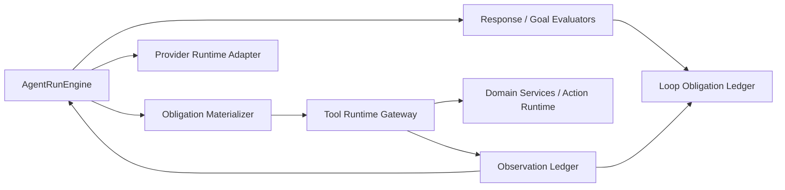

# ADR 0044: OpenClaw/Hermes Obligation-Materialized Observation Runtime

Status: Accepted

Date: 2026-06-11

Implementation: 2026-06-11

Refines: ADR 0018, ADR 0020, ADR 0021, ADR 0034, ADR 0035, ADR 0036, ADR 0042, ADR 0043

## Context

Conversation `0414189f` exposed a remaining architecture gap after ADR 0042 and ADR 0043.

The user asked for a shareholder-specific ROI calculation with external assumptions. The run started in the right direction by using `sandbox_run_code`, but then failed because the loop never materialized the evaluator's required ordered-shareholder evidence:

- The evaluator correctly required a model-visible `data_query_workspace` read for shareholder names and investments.
- `runPrerequisiteObservations(...)` could produce similar facts, but persisted them as hidden `runner_evidence` / `syntheticObservation`.
- `LoopObligationLedger.applyObservationToLedger(...)` correctly refused to let hidden synthetic observations close the obligation.
- The next planning turns still biased toward `sandbox_run_code` because `runtime-planning-call.ts` treated "prior observation exists + sandbox is available" as enough to select sandbox stable long-tool mode.
- The model never received the missing entity read as a real tool observation, so repair loops repeated and eventually failed.

This was not a DeepSeek issue, not a finance-specific prompt issue, and not a need for another keyword rule. The root cause is:

> Evaluator obligations are currently prompts and ledger state, but not first-class executable observation tasks in the single main loop.

## Reference Findings

### OpenClaw

Relevant local references:

- `C:\Github\openclaw\src\agents\session-tool-result-guard.ts`
- `C:\Github\openclaw\src\agents\session-transcript-repair.ts`
- `C:\Github\openclaw\src\utils\transcript-tools.ts`

OpenClaw treats assistant/tool pairing as a runtime invariant. If a tool result is required by the transcript, the runtime repairs, blocks, or replays the missing observation. It does not let hidden runner facts silently satisfy a model-visible tool obligation.

Useful ideas to absorb:

- Tool-call results are transcript obligations, not optional context hints.
- Repair happens at the protocol boundary before the next answer is accepted.
- The model sees tool results as observations and decides the next step from them.
- Runner-owned bookkeeping can guide the loop, but answer-critical facts must enter the visible observation stream.

### Hermes Agent

Relevant local references:

- `C:\Github\hermes-agent\model_tools.py`
- `C:\Github\hermes-agent\tools\tool_search.py`
- `C:\Github\hermes-agent\tools\code_execution_tool.py`
- `C:\Github\hermes-agent\agent\tool_executor.py`

Hermes keeps tool search, code execution, and normal tool calls on one execution path. A bridge may discover or unwrap tools, but execution still goes through the parent handler so hooks, approvals, guardrails, output limits, and observations stay consistent.

Useful ideas to absorb:

- Tool search is a catalog/access pattern, not a second executor.
- Code execution can call tools programmatically, but the parent runtime owns dispatch.
- Dirty provider/tool-call sequences are normalized into real tool observations or explicit tool failures.
- The loop does not rely on the model to rediscover mandatory repair tools after the runtime already knows what evidence is missing.

### OpenAI Agents JS

Relevant local references:

- `C:\Github\openai-agents-js\packages\agents-core\src\runner\turnResolution.ts`
- `C:\Github\openai-agents-js\packages\agents-core\src\runner\toolExecution.ts`
- `C:\Github\openai-agents-js\packages\agents-core\src\runner\runLoop.ts`
- `C:\Github\openai-agents-js\packages\agents-core\src\sandbox\runtime\manager.ts`
- `C:\Github\openai-agents-js\docs\src\content\docs\guides\results.mdx`
- `C:\Github\openai-agents-js\docs\src\content\docs\guides\guardrails.mdx`
- `C:\Github\openai-agents-js\docs\src\content\docs\guides\sandbox-agents\concepts.mdx`

OpenAI Agents JS keeps approvals, guardrails, tracing, tool outputs, interruptions, and sandbox session state on the runner side. In `turnResolution.ts`, the runner explicitly says that if a model turn contains tool calls or approvals, assistant text in the same turn must not be treated as final; the loop runs again so the model can see tool results and respond.

Useful ideas to absorb:

- The runner owns loop transitions.
- Tool outputs and approvals are rich run items, not final answers.
- Guardrails wrap tool execution before/after the tool call rather than being embedded in every business tool.
- Sandbox agent preparation is runner-managed; sandbox sessions provide execution, not finality.

## Decision

Add a **runner-owned obligation materialization stage** inside the existing `AgentRunEngine` single loop.

This is not a second loop, not a local classifier, and not a case-specific workflow. It converts typed evaluator obligations into model-visible tool observations through the same Tool Runtime Gateway used by provider tool calls, sandbox SDK calls, and tool-search bridge calls.

The invariant becomes:

> If the evaluator says a final answer cannot be accepted until fact/tool evidence E exists, the runner must either materialize E as a real model-visible observation through the Tool Runtime Gateway, wait for human approval, or fail closed with a typed terminal reason. It must not merely tell the model "please get E" and hope the next turn selects the right tool.

## Canonical Loop

```mermaid
flowchart TD
    User["User turn"] --> Lane["Turn lane resolution"]
    Lane --> Context["Context pack<br/>memory + page + prior transcript"]
    Context --> Catalog["Effective catalog<br/>core tools + searched tools"]
    Catalog --> Model["Provider model turn"]

    Model -->|assistant candidate| FinalGate["Final candidate gate"]
    Model -->|tool calls| Gateway["Tool Runtime Gateway"]
    Model -->|sandbox code| Sandbox["Sandbox broker"]

    Sandbox -->|xox_sandbox.tool(args)| Gateway
    Gateway --> Observation["Model-visible observation ledger"]
    Observation --> Model

    FinalGate --> Evaluator["Response / goal evaluator"]
    Evaluator -->|pass| Final["Final assistant answer"]
    Evaluator -->|pending human| Wait["Wait for confirmation / clarification"]
    Evaluator -->|missing evidence| Obligation["Typed obligation ledger"]
    Obligation --> TaskQueue["Runner observation task queue"]
    TaskQueue --> Gateway
    Evaluator -->|terminal policy/auth/tenant failure| Fail["Fail closed"]
```

The new box is `Runner observation task queue`. Everything still flows through one `AgentRunEngine` and one `Tool Runtime Gateway`.

## Architecture Contract

### 1. Obligations Are Typed Contracts

Evaluator output must be structural and language-neutral. It must never be derived from keyword scans over user prose.

```ts
type LoopObligation =
  | {
      kind: 'domain_observation_required'
      subject: 'workspace' | 'shareholder' | 'member' | 'ledger' | 'version' | string
      toolName: AgentToolName
      arguments: Record<string, unknown>
      authority: 'domain'
      reasonCode: string
      source: 'response_evaluator' | 'goal_evaluator' | 'claim_evaluator'
    }
  | {
      kind: 'calculation_observation_required'
      toolName: 'sandbox_run_code'
      inputObservationRefs: string[]
      reasonCode: string
      source: 'response_evaluator' | 'goal_evaluator' | 'claim_evaluator'
    }
  | {
      kind: 'action_confirmation_required'
      actionRequestIds: string[]
      reasonCode: string
      source: 'action_runtime' | 'goal_evaluator'
    }
  | {
      kind: 'assistant_finalization_required'
      observationRefs: string[]
      reasonCode: string
      source: 'agent_run_engine'
    }
```

The key field is `toolName + arguments`. If the evaluator knows the missing observation is `data_query_workspace({ scope: "entity_summary", metrics: [...] })`, that is an executable contract, not a natural-language hint.

### 2. Materialized Observation Tasks Are Model-Visible

```ts
type RunnerObservationTask = {
  id: string
  obligationId: string
  toolName: AgentToolName
  arguments: Record<string, unknown>
  source: 'runner_obligation'
  visibility: 'model_visible'
  retryBudget: number
  status: 'queued' | 'executing' | 'completed' | 'failed' | 'waiting_approval'
}
```

When a task executes, it calls `ToolRuntimeGateway.invoke(...)` with `source='runner_obligation'` and `visibility='model_visible'`.

This is intentionally different from hidden prerequisite context:

- Hidden prerequisites can improve speed and context.
- Materialized observation tasks can close evidence obligations.
- Both are runner-owned, but only model-visible gateway observations can satisfy final-answer evidence.

### 3. Prerequisites Are Demoted Unless Materialized

`apps/api/src/agent/prerequisite-observations.ts` must not create provider-looking tool evidence. It can emit context-only facts, but those facts cannot close obligations.

If a prerequisite fact becomes answer-critical, the runner must materialize it as a `RunnerObservationTask` and execute it through the gateway.

### 4. Runtime Planning Must Respect Active Obligations

Provider stable-tool mode must be selected from the active loop state, not from broad heuristics such as "sandbox is available and prior observations exist".

Rules:

- If a non-final obligation has a concrete `toolName`, that tool outranks sandbox stable mode.
- `sandbox_run_code` stable mode is valid only when the active obligation is calculation-specific or the model explicitly selected sandbox.
- If an obligation task can be executed by the runner without model creativity, execute it before asking the model to replan.
- If the task needs human input or approval, pause with a real confirmation/clarification item.

This prevents the `0414189f` failure mode where `data_query_workspace(entity_summary)` stayed open while every repair turn kept leaning into sandbox.

### 5. Tool Results Re-Enter The Model Before Final Answer

OpenAI Agents JS and OpenClaw both enforce this shape:

- tool call;
- tool result observation;
- next model turn;
- final assistant answer only after observations are visible.

xox-model must preserve that for provider tools, runner materialized observations, sandbox SDK nested calls, and tool-search bridge calls.

### 6. No Business-Specific Standard Paths

This ADR does not require "domain read then sandbox" for every financial question.

It requires that when the loop already knows a missing fact or calculation proof is mandatory, the runner makes that requirement executable. The model still decides the reasoning path from observations, tools, and evaluator feedback.

### 7. Assistant / Tool / Lifecycle Lanes Stay Clean

Materialized runner observation tasks are not provider-selected tool calls, so the UI must not count them as "model called N tools" unless product design explicitly wants to show runner evidence.

Canonical lanes:

- `assistant`: model-authored visible text.
- `tool`: model/provider-selected tool calls and results.
- `lifecycle`: run state, memory, catalog, evaluator, runner tasks, debug facts.

Runner materialized observations may be replayed to the model as tool messages, but transcript projection must preserve their source metadata so user-facing UI can choose whether to show them.

## Relationship To Existing ADRs

### ADR 0018

Keeps the single-loop harness. This ADR adds a missing internal stage to that loop; it does not create a control plane or second planner.

### ADR 0020

Keeps progressive tool discovery. Tool discovery still controls what the model sees. Obligation materialization is not discovery; it is execution of a typed missing-evidence contract through the existing gateway.

### ADR 0021

Keeps direct-answer and turn-lane separation. Ordinary ambient answers should not enter this heavy path. Once a turn is classified as an agent goal and evaluator obligations exist, direct-answer lanes cannot satisfy them.

### ADR 0034 / ADR 0035

These ADRs defined runner-owned obligations and the obligation ledger state machine. ADR 0044 fixes the missing placement: obligations must materialize into executable observation tasks before repair replanning, not remain prompt hints.

### ADR 0036 / ADR 0043

These ADRs tighten claim/evidence validation. ADR 0044 adds the enforcement mechanism that lets validation failures become successful repair trajectories instead of repeated failed prompts.

### ADR 0042

Keeps the unified provider/sandbox/tool-search runtime. Obligation materialization must use that same runtime; it must not add a runner-only domain API.

## Module Plan

### Keep

- `apps/api/src/agent/agent-run-engine.ts`
  - Single loop owner.
  - Owns when to materialize obligations, when to re-enter the model, and when to fail closed.

- `apps/api/src/agent/tool-gateway.ts`
  - Continues as the executable boundary.

- `apps/api/src/agent/tool-runtime/*`
  - Shared invocation/observation contracts for provider, sandbox, tool-search bridge, and runner-obligation surfaces.

- `apps/api/src/agent/evidence-ledger.ts`
  - Remains the source of evidence validity.

- `apps/api/src/agent/response-evaluator.ts`
  - Produces typed missing-evidence obligations.

### Change

- `apps/api/src/agent/agent-run-engine.ts`
  - Insert an obligation-materialization phase after evaluator output and before repair provider planning.
  - If materialized observations were produced, replay them to the model before accepting final output.
  - If materialization fails for repairable reasons, produce model-visible failure observations.

- `apps/api/src/agent/loop-obligation-ledger.ts`
  - Track whether each obligation has a corresponding `RunnerObservationTask`.
  - Close obligations only with model-visible gateway observations or explicit approved action/clarification states.
  - Keep synthetic/context-only observations as helpful but non-closing.

- `apps/api/src/agent/prerequisite-observations.ts`
  - Stop trying to close obligations.
  - Either stay context-only or delegate to the new materializer when evidence must be visible.

- `apps/api/src/agent/runtime-planning-call.ts`
  - Replace broad sandbox stable-mode heuristics with active-obligation-aware planning.
  - Never prefer sandbox stable mode when the open obligation names a different concrete tool.

- `apps/api/src/agent/agent-transcript-projector.ts`
  - Preserve source metadata so runner materialized evidence does not masquerade as provider-selected user-visible tool calls.

### New Module Allowed

- `apps/api/src/agent/obligation-materializer.ts`
  - Converts `LoopObligation` into `RunnerObservationTask`.
  - Executes tasks through `ToolRuntimeGateway.invoke(...)`.
  - Owns retry budget, terminal-vs-repairable classification, and generated observation refs.
  - Contains no natural-language keyword routing.

This module is allowed because the missing concept is real and shared. It must stay small and only convert structured obligations to tool invocations.

## Dependency Direction



Rules:

- Evaluators say what evidence is missing.
- The materializer executes missing-evidence tasks.
- The gateway owns execution, tenant policy, approval, audit, and result shape.
- The model consumes observations and authors final text.
- No evaluator, materializer, or transcript projector decides user-facing completion alone.

## Implementation Milestones

1. Regression-first tests
   - Add a fixture for `0414189f`: final answer requiring ordered shareholder facts must not pass until a model-visible `entity_summary` observation exists.
   - Add a repair-loop test where evaluator emits a concrete `data_query_workspace` obligation and the runner materializes it without asking the model to rediscover the tool.
   - Add a negative test proving hidden synthetic prerequisite observations do not close obligations.

2. Obligation task contract
   - Define `LoopObligation` -> `RunnerObservationTask` mapping.
   - Persist task status and observation refs in existing run/observation state where possible.
   - Avoid new database tables unless existing run event/action tables cannot express task lifecycle.

3. Gateway execution path
   - Execute materialized tasks through `ToolRuntimeGateway.invoke(...)`.
   - Mark observations as `source='runner_obligation'`, `visibility='model_visible'`, `synthetic=false`.
   - Preserve audit and tenant/workspace checks.

4. Engine integration
   - Run materialization after evaluator finds unmet obligations.
   - If observations are produced, re-enter the provider loop with those observations.
   - If approval/clarification is needed, pause with real user-visible artifacts.
   - If terminal policy/auth/tenant failure occurs, fail closed.

5. Planning mode cleanup
   - Remove sandbox stable-mode selection based on broad prior-observation heuristics.
   - Make active obligation type and concrete tool contracts the only authority for forced/stable tool selection.

6. Transcript alignment
   - Keep provider-selected tools in the visible tool lane.
   - Put runner-obligation materialization in lifecycle/debug unless the product explicitly surfaces it as evidence.
   - Ensure final assistant output is model-authored after observations.

7. Real smoke verification
   - Run the user's regular ROI/inflation/loan scenario with the provided key through the same API path used by the frontend.
   - Run the "weather/date" direct-answer scenario and confirm it does not enter the heavy agent-goal obligation loop unless a real tool is needed.

## Acceptance Criteria

- In the `0414189f` class of runs, if the evaluator requires shareholder entity facts, the runner materializes a `data_query_workspace` observation with the requested scope/metrics before sandbox repair or final answer.
- Hidden prerequisite observations cannot close evidence obligations.
- Sandbox stable long-tool mode cannot preempt a concrete non-sandbox obligation.
- Tool-search bridge calls, provider tool calls, sandbox SDK calls, and runner-obligation calls all execute through the same Tool Runtime Gateway.
- Any tool result used to satisfy evidence is model-visible and replayable.
- Assistant text emitted before required tool observations is not accepted as final.
- No new keyword, regex, localized alias, or language-specific intent router is introduced.
- Existing ADR 0042 sandbox SDK rule remains true: `xox_sandbox.<tool_name>(args)` uses the same name, args, output, policy and audit path as provider tools.
- `npm.cmd run test:api`, `npm.cmd run test:web`, `npm.cmd run build:web`, and `npm.cmd run test` pass after implementation.

## Non-Goals

- Do not hardcode finance, inflation, shareholder, member, or weather-specific flows.
- Do not require every calculation to use sandbox.
- Do not require every financial question to run `data_query_workspace` first.
- Do not copy OpenClaw's local-machine filesystem model into SaaS.
- Do not add another runtime adapter beside the unified Tool Runtime Gateway.
- Do not expose hidden runner internals as ordinary user-visible tool calls by default.

## Risks

- Strict obligation materialization may initially expose more failed runs. This is acceptable if failures are typed, repairable where possible, and no longer pretend to be correct.
- Runner-owned task execution can become a second planner if it grows semantic routing. Mitigation: only execute typed obligations with concrete tool names and arguments from evaluators or action runtime.
- Transcript UI can become noisy if runner materialization is shown as normal tool calls. Mitigation: preserve source metadata and keep lifecycle/debug lanes distinct from provider-selected tools.

## Summary

ADR 0042 made provider tools and sandbox SDK tools one runtime. ADR 0043 made evidence acceptance stricter. ADR 0044 adds the missing repair mechanism:

- evaluator obligations become executable tasks;
- tasks execute through the same gateway;
- observations become model-visible;
- the model answers only after seeing those observations;
- hidden context never closes answer-critical evidence.

This is the OpenClaw/Hermes lesson applied to xox-model: keep one clean loop, keep one execution gateway, and turn missing evidence into real observations rather than prompt hints.

## Implementation Notes

- `apps/api/src/agent/obligation-materializer.ts` now converts active typed `domain_fact` obligations into `runner_obligation` observations.
- `runner_obligation` is model-visible and replayed as a tool observation, but it is not persisted as a provider-selected plan step and should not inflate user-facing model tool-call counts.
- Hidden `runner_evidence` remains context-only and cannot close evidence obligations.
- `runtime-planning-call.ts` still protects sandbox continuation turns from streamed argument truncation, but active non-sandbox obligations now block sandbox stable mode.
- The current gateway landing path reuses existing tool execution services (`answerWorkspaceDataQuestion` and `storePlannedActionGraph`) so arguments, result shape, tenant scope, observation replay, and ledger evidence stay aligned with provider-selected `data_query_workspace`.
