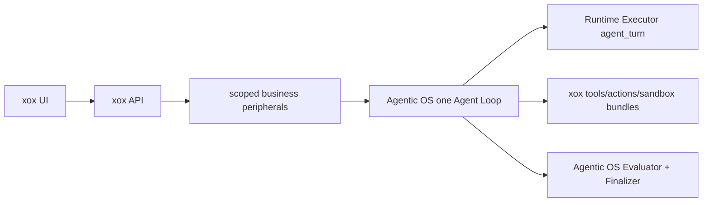

# ADR 0045: Agentic OS ADR0074 Runtime Source And Loop Ownership Migration

Status: Accepted / Implemented

Date: 2026-07-11

## Context

xox-model delegates its live harness to Agentic OS, but its DB, API,
host-profile, and UI still called provider/runtime identity a Planner. Agentic
OS ADR0074 removes that semantic plane and keeps inline model turns inside one
canonical Loop.

## Decision

1. Rename `AgentPlannerSource` to `AgentRuntimeSource`.
2. Rename API `planner` to `runtimeSource`.
3. Rename `agent_runs.planner_source` to `runtime_source` with one in-place
   database migration and no dual reader.
4. Rename host `PlannerContext` to `AgentTurnContext`, runtime step helpers,
   prompt files, and model-turn event labels.
5. Remove the `planning` Runtime purpose from the xox runtime profile.
6. Persist Agentic OS `AgentLoopStateV3` and transition V2 through the existing
   tenant/workspace/user scoped durable control backend.
7. Keep business operating-model `planning` configuration and business
   `agent_plan_steps`; neither is harness continuation authority.



## Consequences

- Runtime identity is diagnostic metadata, not a planner or loop callback.
- Existing databases migrate cleanly; ambiguous schemas containing both old
  and new columns fail closed.
- API and UI consumers move in the same release; no compatibility alias is
  retained.
- Business `planning` remains an operating-model domain concept.

## Verification

```powershell
npm run build
npm test
```
