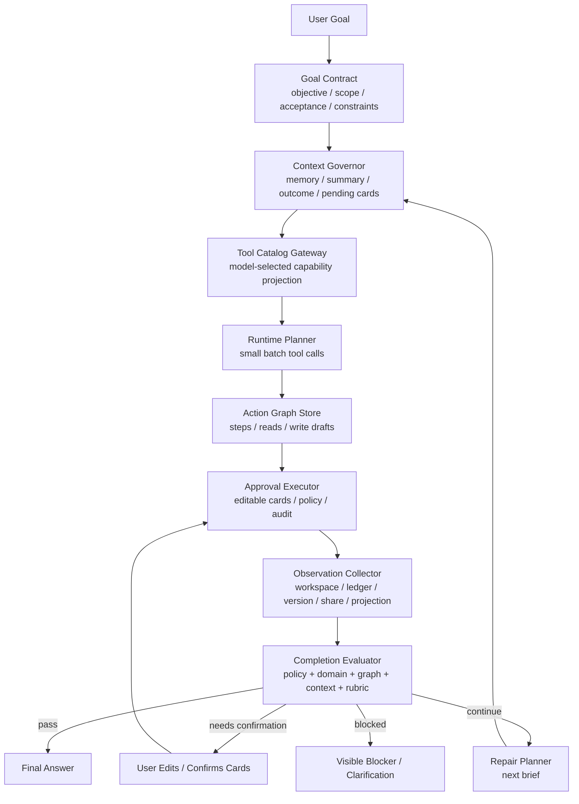

# Agent OS 设计

本文件描述 `xox-model` 的目标 Agent OS 架构。正式 runtime 采用策略见 [ADR 0001](adr/0001-agent-runtime-architecture.md)，Harness Agent 分层架构见 [ADR 0002](adr/0002-harness-agent-architecture.md)，历史收敛记录见 [ADR 0003](adr/0003-xox-model-agent-os-target-architecture.md)，可靠性核心参考 [ADR 0004: Evaluator-Centered Harness Agent 架构](adr/0004-evaluator-centered-harness-agent.md) 和 [ADR 0018: AgentRunEngine v2 Single-Loop Harness Upgrade](adr/0018-agent-run-engine-v2-single-loop-harness.md) 的历史收束经验；当前 production harness 已由版本化 `@agentic-os/core` 的 Agentic OS loop 承担，xox 只保留业务 port、context pack、tool gateway、evaluator/evidence、sandbox 和 transcript/trace 投影。受控代码执行边界见 [ADR 0016: Manifest-Scoped Sandbox Tool](adr/0016-manifest-scoped-sandbox-tool.md)，统一工具/sandbox 运行面见 [ADR 0042: OpenClaw/Hermes Unified Tool Sandbox Runtime](adr/0042-openclaw-hermes-unified-tool-sandbox-runtime.md)：sandbox 只能在服务端生成的 manifest 内运行，不能直接访问 DB、secrets、internal HTTP 或领域服务；但 sandbox 内的 `xox_sandbox.<tool_name>(...)` 必须桥回同一个 Tool Runtime Gateway，按同一套租户、权限、确认、导航、领域服务和审计链路执行。Memory Kernel 后续以 [ADR 0019: OpenClaw-First Memory Kernel v2](adr/0019-openclaw-first-memory-kernel-v2.md) 为准：记忆不是日志池，必须按 working/session/semantic/procedural/episodic/diagnostic/archive 分层治理，OpenClaw 是 active recall、hybrid retrieval、promotion 和 compaction flush 的优先参考。

Agentic OS 抽取已经从 compatibility pilot 进入 production harness replacement：`agent-kernel.ts` 的复杂目标路径现在进入 `apps/api/src/agent/agentic-os/xox-agentic-os-host-kit.ts`，由版本化 `@agentic-os/core` 的 Agentic OS loop 承担单循环 harness。xox 继续拥有 evaluator、action graph、memory、sandbox、provider settings、tenant boundary 和业务工具语义，并把通用不变量反哺 Agentic OS。

## 目标

把测算、调模型、记账、预实分析、版本发布、恢复版本、分享、锁账等平台能力开放给 Agent。Agent 不是绕过页面和权限的后门，而是一个受控操作系统层：它能理解用户指令、显式切换页面、拆分多步骤任务、生成可编辑确认卡，并在用户确认后调用同一套领域服务执行。

用户仍可手动操作页面；原则上页面上能手动修改的业务能力，都必须能通过 Agent 对话完成。账号登录、退出、注册、注销、删除账号和改密码不开放给 Agent 自动执行。

## 当前全量覆盖设计

本轮目标是补齐网页手动能力和 Agent 工具层之间的断层。设计要求如下：

- 模块划分：`tool-catalog.ts` 同源维护 provider-native schema 和工具 metadata；`tool-gateway.ts` 负责 runtime tool projection；`runtime-planning-call.ts` 协调 Context Pack、Tool Gateway、Runtime Adapter 和 stream trace；`planner.ts` 只协调 planning session 与 action graph store；`runtime-intent-handlers.ts` 把 provider tool intent 交给对应 draft builder；`tool-policy.ts` 只做权限、导航、风险和租户校验；`tool-executor.ts` 只调用现有 `workspace / ledger / share` 领域模块；React 主界面只消费后端投影的 `AgentTimelineItem`。
- 依赖方向：`web -> contracts -> api agent routes -> planner/session -> runtime-intent-handlers -> domain draft builders -> domain/workspace/ledger/share -> db`。Agent 工具不得直接写 DB，不得越过确认卡调用执行模块。
- 复用策略：员工、成员、股东、成本项等结构性草稿变更继续复用 `@xox/domain` 的 `create*` 和 `hydrateModelConfig`；账本动作复用 `createActualEntry / updateActualEntry / voidEntry / restoreEntry`；版本提升复用 `rollbackToVersion + publishVersion`。
- 命名一致性：模型工具采用 provider 友好的蛇形名，例如 `employee_add`、`ledger_create_entry`、`ledger_update_entry`；内部 intent 使用点分名，例如 `employee.add`、`ledger.create_entry`；确认卡 action kind 复用稳定业务动作，例如 `workspace.update_draft`、`ledger.create_entry`，只有非草稿/非账本语义新增 action kind。
- 确认卡协议：所有写入都必须有 `navigation / riskLevel / details / payload`，并且确认卡可编辑。编辑后仍通过 `assertActionExecutionAllowed` 和领域服务二次校验。
- 多步骤协议：模型可以一次返回多个 tool call；服务端也可以把一个 batch tool 展开为多张确认卡。前端统一时间线按后端 `timelineItems` 顺序展示，用户可逐项编辑/确认/取消。
- 只读筛选协议：账本历史筛选和预实深度追问不写业务数据，走 `data_query_workspace`。返回的 `AgentNavigationEvent` 可携带页面过滤状态，React 显式切到对应页面并应用筛选。
- 受控沙箱执行：复杂预测、临时数据清洗、校验对账、敏感输入裁剪后的公式实验、常见文件格式处理和短期 artifact 生成可以走 `sandbox_run_code`。沙箱只接收当前租户的 manifest-scoped 最小化数据包；代码里可调用与 provider 工具同名、同参、同出参的 `xox_sandbox.<tool_name>(...)`。读写都必须桥回同一个 Tool Runtime Gateway；写入动作按正常确认卡、自动化策略、领域服务和审计链路处理。如果 sandbox 内多个写入超过当前自动化等级，整次 sandbox run 生成一张聚合授权/确认，而不是逐个许可或一刀切拒绝。

新增覆盖点：

| 网页能力 | Agent 设计 |
| --- | --- |
| 新增/删除员工 | `employee_add / employee_delete`，执行为 `workspace.update_draft`，导航到 `调模型 / 成本` |
| 工作区改名 | `workspace_rename`，新增 `workspace.rename` action kind，执行时保存当前草稿和新工作区名 |
| 其他收入/普通支出/按人支出入账 | `ledger_create_entry`，按科目名或 subjectKey 解析科目，按成员/员工名解析归属对象 |
| 一键入账多笔 | `ledger_create_planned_member_income_batch` 和 `ledger_create_planned_related_expense_batch` 展开为多张 `ledger.create_entry` 确认卡 |
| 修改历史分录 | `ledger_update_entry`，按 entryId 或筛选条件定位分录，生成 `ledger.update_entry` 确认卡 |
| 取消作废/恢复分录 | `ledger_restore_entry`，定位已作废手工分录，生成 `ledger.restore_entry` 确认卡 |
| 精确作废某一笔 | 增强 `ledger_void_entry`，支持 entryId、金额、日期、科目、对象、关键词过滤，无法唯一定位时澄清 |
| 把快照发布为正式版 | `workspace_promote_version`，新增 `workspace.promote_version` action kind，执行 rollback 后 publish release |
| 预实分析深度追问 | `data_query_workspace` 新增 `variance_detail` scope，返回科目级计划/实际/差异 |
| 账本历史筛选 | `data_query_workspace` 新增 `ledger_history` scope，支持月份、方向、状态、日/周、关键词筛选，并驱动页面筛选状态 |

## 架构决策摘要

| 方案 | 决策 | 边界 |
| --- | --- | --- |
| OpenAI Agents SDK | 主 runtime 方向 | 用于 orchestration、tool、handoff、guardrail、tracing、session/context；不托管业务权限、确认卡和审计 |
| OpenClaw | 架构参考 | 借鉴模型外壳、approval、observability 和 context 思想；不复制 control plane / gateway |
| DeepSeek | provider adapter 与真实模型测试通道 | 使用 OpenAI-compatible Chat Completions `tool_calls`，不作为 Agent OS 架构底座 |
| Claude Code | 交互模式参考 | 不引入 Claude Agent SDK；只借鉴 memory、subagents、hooks、skills、MCP 的产品模式 |
| Skills | 可选过程知识层 | 不能替代 server tools，不能绕过确认、权限、审计 |
| MCP | 外部工具和连接器边界 | 核心财务业务能力继续走受控 server tools |

## Evaluator-Centered Agentic OS Harness

`xox-model` 的 Agent OS 不是一次 provider tool-call 规划器。复杂目标必须进入 Agentic OS host kit，由 harness 多轮执行：

```text
Goal Interpreter
  -> Context Governor
  -> Tool Catalog Gateway
  -> Runtime Planner
  -> Action Graph Store
  -> Approval Executor
  -> Observation Collector
  -> Completion Evaluator
  -> Repair Planner
  -> next iteration or final answer
```

核心变化：

- `planner.ts` 只负责一轮 provider-native planning，不再代表完整任务已经完成。
- `agent-kernel.ts` 委托 `agentic-os/xox-agentic-os-host-kit.ts` 负责把复杂目标推进成多轮 `plan -> confirm/execute -> observe -> evaluate -> repair`。
- 模型每轮只需要选择下一批工具；是否继续、是否阻断、是否完成由 Completion Evaluator 根据 server-owned action graph 和领域状态决定。
- 模型 final text 不能直接结束复杂 run；`before_stop` 必须先运行 evaluator。
- `automationLevel` 的旧解释已由 ADR 0015 取代：它表示执行授权程度，不表示 planner 推进力度。Planner/evaluator 始终全力推进；写入动作先落 `agent_action_requests`，再按 Automation Policy Engine 判定自动执行或等待用户编辑/确认。

当前已实现的运行切片：

- `goal-contract.ts` 持久化 `AgentGoalContract`，并把 `goalStatus` 投影到 run/thread state。
- `agentic-os/xox-agentic-os-host-kit.ts` 把 xox 的 Completion Evaluator、evidence review、action graph 和业务 observation 映射到 Agentic OS loop ports；`continue` 会把上一轮工具 observation 注入下一轮带工具 planning，`needs_confirmation` 会停止等待用户确认。工具 observation 会先按 `completed_valid / completed_invalid / failed_repairable / failed_terminal / pending_human / policy_blocked` 分类；可修复工具失败继续主循环，终态失败才进入 failed。达到最大修复轮次仍未满足时，run/goal 必须 fail closed，不能伪装完成。
- `data_query_workspace(scope=entity_summary)` 是当前成员、股东、员工和成本对象的只读实体检查工具。模型遇到“第一个股东”“当前成员”“现有投资额”等工作区内已有事实时，应先读取该工具，再继续生成写入确认卡或澄清真正缺失的信息。
- `planning-context.ts` 的 `planningTurn='evaluator_repair'` 让修复回合作为一次 harness-driven model call，不被用户多步骤分隔逻辑拆散。
- `completion-evaluator.ts` 以 action graph、确认卡、audit、Tool Catalog Gateway 的结构化信号和领域投影为硬事实；经营模型草稿还会检查非零收入/成本驱动输入，避免空壳草稿被默认值误判通过。
- `runtime-goal-facts.ts` 只校验模型在 `tool_catalog_select_capabilities` 中给出的结构化 `goalFacts`；服务端不再从用户原话做关键词/正则式目标推断。无变化的 `workspace_patch_config` 作为 observation 返回给模型，不生成伪确认卡。
- `memory-candidate-detector.ts` 和 `memory-consolidator.ts` 会在 action 执行后主动沉淀 scoped episodic/procedural memory；显式 `memory_remember` 仍保留为用户可控记忆入口。
- `sandbox-service.ts` 已收敛为 manifest-scoped sandbox tool façade：模型只能请求 `sandbox_run_code`，服务端生成 `SandboxManifest`、最小化数据包、同名工具 SDK 和输出策略，再交给 `SandboxBroker` 选择真实 backend 执行。默认 `local-script` backend 在临时工作区启动 Python/Node 子进程；`docker` backend 可通过配置切换。sandbox observation 会记录真实 `executionMode/backendId/exitCode/structuredOutput`，Response Evaluator 只接受 executed + completed + exitCode 0 的计算证据；业务写入只能通过 `xox_sandbox.<tool_name>(...)` 桥回 Tool Runtime Gateway，继续走确认卡、自动化策略、领域服务和审计。
- sandbox 内的工具说明必须来自同一个工具 manifest，而不是另一套私有协议。`docs/agent-tool-manifest.md` 是面向模型和 sandbox 的工具文档目标面，后续应由 `AGENT_TOOL_REGISTRY` 与 `buildToolManifests(...)` 生成或校验。`sandbox_run_code` 内应提供由 provider tool registry 生成的 `xox_sandbox.<tool_name>(...)` / JS camelCase SDK 函数；函数名、入参和返回契约必须与模型看到的 tool calls 保持一致。写入类函数不是 policy-stop stub，而是同一 Tool Runtime 的 sandbox 入口；当自动化等级不足时，整次 sandbox run 生成聚合授权。`xox_sandbox.rg(...)` 只能检索 manifest 授权的工具文档、同轮 observation 文档、安全输入文本和当前 sandbox SDK 文档，不能访问 repo、DB、env、日志或其他租户数据。
- React `AgentConsole` 已显示最新目标、评估轮次、满足/未满足数量、blocker 和下一轮 planner brief。

验证命令：

- `npm.cmd run build:api`
- `npm.cmd run build:web`
- `npm.cmd run test:api`
- `npm.cmd run test:web`

目标运行图：



Completion Evaluator 分层：

| Evaluator | 类型 | 判定对象 | 权限 |
| --- | --- | --- | --- |
| Policy Evaluator | deterministic | 账号动作、跨 workspace、锁账、版本不可变、派生分录、secret 泄漏 | 可阻断 |
| Domain Evaluator | deterministic | draft 结构、成员/员工/股东/成本/月度节奏、账本、版本、分享、projection、audit | 可阻断或要求继续 |
| Action Graph Evaluator | deterministic | 多步骤是否可见、依赖是否正确、写入是否有确认卡、失败后是否停止后续依赖 | 可阻断或要求继续 |
| Context Evaluator | deterministic + heuristic | memory 作用域、summary、上下文预算、未完成动作是否保留 | 可要求压缩或 reset |
| LLM Rubric Evaluator | model-assisted | 解释质量、分析深度、复杂追问是否覆盖 | 只能补软指标，不能覆盖硬事实 |
| Human Evaluator | user decision | 高风险确认、业务口径歧义、修改待执行动作 | 用户决定 |

Goal Contract 至少需要包含：

- `objective`：用户原始目标的结构化目标。
- `scope`：当前 workspace、允许页面、允许 capability。
- `acceptanceCriteria`：能由 domain state、action graph 或 evaluator rubric 检查的验收项。
- `forbiddenActions`：账号动作、未请求发布、跨 workspace、未确认写入等禁止项。
- `automationLevel`：`manual | low | medium | high`。
- `maxIterations`：防止无限循环；达到上限必须把未满足项展示给用户。
- `contextStrategy`：memory scope、summary/reset、handoff 规则。

对于“50 位成员 + 多股东 + 成本 + 12 个月预测 + 后续记账/发布”这类任务，正确行为不是一次性暴露全部工具并期待模型一次完成，而是：

1. Goal Interpreter 建立可评估 contract。
2. 第一轮 planner 选择经营模型配置、必要查询或澄清工具。
3. 写入 draft 先生成 server-owned action request 和可编辑确认卡；随后由 Automation Policy Engine 判定 eligible 动作自动执行还是等待用户确认。
4. Observation Collector 读取 draft、projection、audit 和 action graph。
5. Completion Evaluator 检查成员数、股东、成本项、12 个月、预测结果、确认卡和 audit 是否满足 contract。
6. 若缺项存在，Repair Planner 生成下一轮 brief，让模型补齐缺口；禁止用后端正则从原始文本猜语义。
7. 直到 evaluator pass、需要用户确认/澄清、阻塞或取消。

这套设计直接解决工具过多问题：

- Capability Router 由模型通过 provider-native tool_call 选择能力域。
- Tool Catalog Gateway 只投影本轮必要工具。
- Evaluator findings 给下一轮 planner 一个小而具体的 brief。
- 高阶工具处理完整经营模型、批量导入、批量草稿；低阶工具处理用户精修。
- 服务端永远不使用关键词或正则替模型选择业务工具。

## 目标模块划分

```text
apps/web Agent OS
  -> packages/contracts Agent Protocol
  -> apps/api Agent Kernel
      -> runtime adapters
      -> memory/context
      -> prompt/skill registry
      -> tool policy/hooks
      -> action graph
      -> approval executor
      -> audit/events
  -> business tool facade
      -> workspace / ledger / share / variance modules
  -> db
```

### `packages/domain`

承载共享业务模型、默认配置、预测计算、预测科目生成和导入归一化。前端和后端都从这里引用同一套模型逻辑，避免前后端计算漂移。

### `packages/contracts`

承载 REST DTO 和 Agent Protocol。这里不能依赖具体 provider SDK。

目标协议包括：

- `AgentRun`
- `AgentMessage`
- `AgentEvent`
- `AgentActionGraph`
- `AgentPlanStep`
- `AgentActionRequest`
- `AgentToolDescriptor`
- `AgentToolPermission`
- `AgentMemoryRecord`
- `AgentRuntimeProvider`
- `AgentErrorCode`

### `apps/api/src/agent/runtime`

provider adapter 层。所有 provider 必须输出统一的内部 plan/event，不允许直接写库。

- `openai-agents-adapter.ts`
- `openai-compatible-chat-adapter.ts`
- `rules` 本地/CI no-op 路径
- `runtime-adapter.ts`

当前代码边界是目标架构中的一段可验证运行切片：

```text
agent/routes.ts
  -> REST / SSE auth, DTO parse, thread publish
  -> run-submission.ts / run-worker.ts
      -> enqueue / recover / cancel run
  -> planner.ts
      -> build tenant/workspace planning context
      -> runtime/adapter-router.ts
          -> runtime/openai-agents-adapter.ts
              -> OpenAI Agents SDK Agent / Runner / tools
          -> runtime/openai-compatible-chat-adapter.ts
              -> OpenAI-compatible Chat Completions tools/tool_calls
          -> runtime/runtime-adapter.ts
              -> provider-neutral plan result
      -> normalize runtime steps into read steps / action request drafts
  -> approval-executor.ts
      -> persist editable confirmation cards
      -> edit / confirm / cancel / execute lifecycle
  -> action-graph-store.ts
      -> persist plan steps and action graph run events
```

边界约束：

- runtime adapter 只接收已脱敏、已按当前用户 / 当前工作区过滤过的 planning context。
- runtime adapter 不读取数据库、不写数据库、不创建确认卡、不执行业务工具。
- OpenAI Agents SDK adapter 使用 SDK 的 `Agent / Runner / tool / OpenAIChatCompletionsModel` 做 orchestration；SDK tool 的 `execute` 只把工具参数收集为内部 `AgentToolCallStep`，返回 model-visible preview receipt，不执行领域服务。
- `LLM_PROVIDER=openai` 只选择 OpenAI Agents SDK adapter；`LLM_PROVIDER=openai-compatible / deepseek / doubao / qwen` 继续走通用 Chat Completions adapter。两条路径都输出同一个 `RuntimePlanResult`。
- Runtime 当前通过 `tool-gateway.ts` 暴露 provider-neutral runtime tool catalog。`tool-catalog.ts` 只维护 `AGENT_TOOL_REGISTRY` 源数据：每个工具同时带有 Chat Completions schema、capability、risk level、confirmation mode 和 navigation target。不再保留 `tool-projector.ts` 这种误导性边界。模型负责语义 tool selection；服务端负责确认卡、policy、租户隔离、审计和领域服务执行。Tool Catalog Gateway 先让模型通过 provider-native `tool_catalog_select_capabilities` 选择本轮需要的能力域，再只投影这些能力域下的业务工具；它不能用关键词或正则替模型判断用户意图。
- `planner.ts` 负责协调 planning session、runtime intent handler registry 和 action graph store；它不处理 HTTP DTO、不执行已确认写入，也不内联单次 runtime 调用、多段 session loop 或业务 intent handler map。
- `planning-context.ts` 持有 Agent planning context 类型，draft builders、run worker、planning session 都从这里依赖上下文协议，不再 type-import `planner.ts`。
- `planning-session.ts` 负责一次用户消息内的多段拆分、workspace bundle artifact 替换、多次 runtime planning 调用聚合和 provider source 合并；planner 只提供单次 runtime 调用能力，并注入 runtime intent handler registry。
- `runtime-planning-call.ts` 负责单次 provider planning call：构造 Context Pack、请求 Tool Catalog Gateway、调用 Runtime Adapter、接入 provider stream trace；planner 不再直接 import `context-pack.ts`、`tool-gateway.ts`、`runtime/adapter-router.ts` 或 `runtime-trace-events.ts`。
- `runtime-intent-handlers.ts` 持有 provider tool_call intent 到只读/data/action draft builder 的 handler registry；planner 只把该 registry 交给 `planning-session.ts`，不再直接 import 各业务 draft builder。
- `runtime-plan-reader.ts` 负责把 provider `RuntimePlanResult` 中的 assistant text、空响应和 provider 错误转成只读 `ReadDraft`，并提供 provider-neutral planner source 判定；planner 不再拼认证失败、网络失败或普通 assistant 回复文案。
- `agent/routes.ts` 负责 HTTP routes、SSE 和 DTO 序列化；run 创建在 `run-submission.ts`，queue/recovery/cancel 和 worker lease 回写在 `run-worker.ts`，不再保留 `modules/agent.ts` 作为 Agent API 边界。
- 确认卡创建、编辑、确认、取消、执行状态更新、assistant message、run event 和审计已下沉到 `apps/api/src/agent/approval-executor.ts`；route 只负责认证、HTTP DTO 序列化和 thread publish。Action graph step 的写入留在 `action-graph-store.ts`，避免 Approval Executor 混入 timeline 持久化职责。
- 已确认 action 的业务执行已下沉到 `apps/api/src/agent/tool-executor.ts`；Approval Executor 先做 policy，再把当前 workspace/user 和 action payload 交给 executor 调用 workspace / ledger / share 模块。
- 高风险版本 / 分享动作的确认卡预览已下沉到 `apps/api/src/agent/version-action-drafts.ts`；planner 不再内联发布、快照、回滚、快照发布、删除版本、创建/撤销分享和重置草稿的业务预览，runtime intent handler registry 只做 provider tool intent 到 builder 的显式绑定。
- 账本类写入 preview 已下沉到 `apps/api/src/agent/ledger-action-drafts.ts`；`runtime-intent-handlers.ts` 只负责把 provider 已选中的账本 intent 分发给 draft builder，planner 不再内联成员收入、普通收支、一键入账、历史修改、作废/恢复和锁账/解锁的确认卡生成。
- 结构化模型变更 preview 继续按同一边界下沉到 `apps/api/src/agent/model-structure-action-drafts.ts`：成员、员工、股东、基础成本项、专项成本类型的新增/删除都由该模块读取当前草稿、生成 normalized config、输出可编辑 `workspace.update_draft` action draft。planner 不持有这些领域对象构造、删除校验、依赖数组同步和确认卡细节。
- 通用工作区和草稿 preview 下沉到 `apps/api/src/agent/workspace-action-drafts.ts`：线上系数试算/写入、通用草稿 patch、工作区改名、bundle 导入导出都由该模块读取当前草稿或 workspace bundle，输出只读结果或可编辑确认卡。planner 不再持有模型投影、config path 写入、workspace rename 或 bundle preview 细节。

本轮结构化模型变更拆分的依赖方向固定为：

```text
planner.ts
  -> planning-session.ts
      -> action-draft-builder.ts
      -> runtime-intent-handlers.ts
          -> model-structure-action-drafts.ts
              -> action-draft-utils.ts
              -> config-patch.ts
              -> @xox/domain factories / hydration
              -> approval-executor.ts types only
```

命名保持现有 handler intent 风格，例如 `team_member.add -> planAddTeamMemberFromStep`、`stage_cost_type.delete -> planDeleteStageCostTypeFromStep`。验证必须至少运行 `npm.cmd run build`、`npm.cmd run test`，并在涉及真实 provider 行为时运行 `npm.cmd run smoke:agent`。

本轮 workspace/draft/bundle 拆分的依赖方向固定为：

```text
planner.ts
  -> planning-session.ts
      -> action-draft-builder.ts
      -> runtime-intent-handlers.ts
          -> workspace-action-drafts.ts
              -> action-draft-utils.ts
              -> config-patch.ts
              -> modules/workspace.ts
              -> @xox/domain projection / hydration
              -> approval-executor.ts types only
```

复用计划：`workspace.update_online_factor`、`workspace.patch_config`、`workspace.rename`、`workspace.export_bundle` 和 `workspace.import_bundle` 的 runtime handler 都只把 provider-native tool args 交给 workspace draft builder。handler registry 不选择工具、不理解自然语言；它只处理已经由模型选中的 intent。workspace draft 模块可以读取当前 workspace 草稿和导出 bundle，但不持久化 action request、不执行写入、不参与语义 tool selection。

命名保持 handler intent 风格，例如 `workspace.patch_config -> planWorkspacePatch`、`workspace.import_bundle -> planImportBundleFromValue`。验收要求构建证明 `planner.ts` 不再引用 `projectModel`、`hydrateModelConfig`、`config-patch.ts` 或 `modules/workspace.ts` 的业务 draft 依赖。

### 完整经营模型配置工具

复杂经营简报不能退回到“暴露全部低层工具，然后希望模型连续调用几十次”。这会让 50 个成员、多个成本项、12 个月节奏这类目标变成脆弱的低层操作序列，也会让 provider 在长上下文里更容易返回空计划。因此新增一个通用高阶工具：

```text
provider tool: workspace_configure_operating_model
internal intent: workspace.configure_operating_model
confirmation action: workspace.update_draft
```

适用范围是用户一次性提供完整经营模型、投资结构、批量成员分层、员工编制、固定和变动成本、月份节奏，并要求生成预测。它不是任何项目名或文本模板的特调，也不解析原始自然语言；模型必须通过 provider-native tool call 把经营简报整理成 `plan` 结构。服务端只做确定性的领域模型生成和预览。

依赖方向固定为：

```text
planning-session.ts
  -> runtime-intent-handlers.ts
      -> workspace-action-drafts.ts
          -> action-draft-utils.ts
          -> @xox/domain factories / hydration / projection
          -> approval-executor.ts types only
```

模块分工：

- `tool-catalog.ts` 定义 `workspace_configure_operating_model` 的 provider schema，包含股东、成员分层、员工、基础成本、专项成本、启动成本、月度节奏和模型假设。
- `runtime-intent-handlers.ts` 只把 `workspace.configure_operating_model` 分发给 workspace draft builder，不做关键词或正则语义判断。
- `workspace-action-drafts.ts` 复用 `@xox/domain` 的 `createShareholder / createMember / createEmployee / createCostItem / createStageCostItem / createMonth / hydrateModelConfig / projectModel`，生成一个可编辑 `workspace.update_draft` 确认卡和一个只读预测摘要。
- `tool-executor.ts` 不需要新增执行路径；确认后仍执行既有 `workspace.update_draft`，所以编辑、policy、revision、audit 和保存草稿能力保持统一。

确认卡必须展示至少这些信息：目标工作区名、预测周期、股东数和总投资、成员数和分层摘要、员工数、成本项数量、总收入、总成本、总利润、期末现金、回本月份、最亏和最赚钱月份、服务端近似假设。用户可以直接编辑确认卡 payload，确认执行时仍由既有 policy 和 domain hydration 二次校验。

长结构化输入的拆分规则只允许根据文本形态决定是否保留换行，例如长度、有效行数、列表行数量、JSON 深度。它不能根据业务关键词决定工具，也不能为某个测试场景硬编码命中条件。紧凑的多动作句子继续按分号和换行拆成多次模型规划；完整经营简报保持为一次模型调用，让模型看到全局约束后选择高阶工具。

### 自动化与确认策略

ADR 0015 已取代这里的旧语义：`automationLevel` 是执行授权策略，不是 planner 推进力度。Agentic OS harness、provider planner、tool catalog、observation loop、evaluator 和 repair planner 都必须始终全力推进用户目标；自动化级别只在 action draft 已生成后决定是否可以自动执行。写入自动化策略由 `@agentic-os/core` 的 approval policy composer 提供，xox 不维护第二套 composer。

```text
manual  -> 读操作自动执行；所有写入保持可编辑 pending 确认卡
low     -> 读操作和低风险写入可自动执行；中/高风险写入等待确认
medium  -> 读操作、低风险写入、中风险写入可自动执行；高风险写入等待确认
high    -> 读操作、低风险写入、中风险写入可自动执行；高风险写入按 action kind 策略决定
```

设计原则：

- 自动化是用户显式执行授权，不是模型自己决定权限，也不是降低或提高规划质量。
- 写入工具必须先生成 server-owned action request、导航事件、预览和 transcript 行；自动执行也必须走同一条确认卡生命周期，只是由 Automation Policy Engine 代替用户确认 eligible action。
- 自动执行和用户确认执行都必须调用同一个 Approval Executor、`assertActionExecutionAllowed`、domain service 和 audit 写入路径。
- 高自动化不是万能绕过。账号动作永远 forbidden；跨租户、锁账、派生分录、版本不可变、删除/覆盖/发布等高风险动作仍由 action kind policy 决定是否可自动执行。
- `agent_runs` 持久化本轮 `automation_level`，这样 background worker、SSE、恢复和同步请求看到同一个执行授权策略。默认值是 `manual`，兼容已有调用。
- 前端只把用户选择的自动化级别传给 API；它不本地执行确认卡，也不推断哪些动作应该执行。

依赖方向固定为：

```text
web AgentConsole automation selector
  -> contracts AgentAutomationLevel
  -> routes/run-submission persist agent_runs.automation_level
  -> agent-run-engine / planner / action-graph-store
      -> Automation Policy Engine
      -> pending or auto-executed agent_action_requests
      -> user confirm when required
      -> approval-executor.executeAgentActionRequest
      -> tool-policy/domain services/audit
```

验收要求：

- fake provider tool call 能用一个 `workspace_configure_operating_model` 生成可编辑 `workspace.update_draft` 确认卡和预测摘要。
- 确认执行后草稿包含预期股东、成员、员工、成本、12 个月节奏，并能由 `projectModel` 计算。
- 真实 DeepSeek smoke 中，复杂经营简报必须产生 tool call 和 action graph，而不是空回复或低层工具爆炸。
- 现有 50-direction smoke 不回退，低层新增/删除/记账/版本/分享工具仍可独立被模型选择。
- `automationLevel` 不改变 planner/evaluator 的推进力度；同一个复杂经营目标在不同自动化级别下应产生等价目标推进，只改变 eligible 写入动作是 pending 还是 auto-executed。

本轮 Tool Catalog Gateway 拆分的依赖方向固定为：

```text
planner.ts
  -> tool-gateway.ts
      -> tool-surface-manifest.ts
          -> @agentic-os/core tool surface runtime
      -> tool-catalog.ts
      -> run-events.ts
```

模块职责：`tool-gateway.ts` 负责把 registry 投影成 runtime 可用工具目录、记录 `tool_catalog_ready` run event，并暴露投影策略和工具 metadata 给技术日志。ADR 0039 后，当前主策略已收敛为 `progressive_tool_discovery`：Tool Gateway 先从 tenant/workspace/policy 过滤后的 effective catalog、Agentic OS tool surface runtime 的 Hermes-style tool search、kernel tools、runner obligations 和模型结构化 `goalFacts.requiredActionCapabilities` 组装小工具面；provider-backed capability router 只允许作为可选 hint，不在热路径上强制调用。`requiredActionCapabilities` 来自 turn-lane 结构化 contract，不来自后端关键词/正则扫描；它必须进入 Tool Gateway 的 Agentic OS surface adapter，否则 evaluator 知道缺少写动作而下一轮工具面仍可能投影错工具。`account / clarification / tool_discover` 等协议工具按 runner 策略保留，业务工具和数据工具自己返回导航事件，不需要把 `ui_navigate` 常驻暴露给所有任务。该模块不能使用后端关键词/正则做语义选择。

复用计划：`runtime-planning-call.ts` 向 gateway 传入已脱敏用户消息、Context Pack、provider settings、run-scoped `goalFacts` 和当前 obligation plan；gateway 调用 `tool-surface-manifest.ts` 把 xox 业务 manifest overrides 交给 `@agentic-os/core`，由 Agentic OS 负责 search/rank/materialize/budget/trace，然后 gateway 写入 `tool_catalog_ready` trace 并把投影后的 `tools` 交回主 planning call。runtime adapter 仍只接收 provider-neutral tool schema，不读取 registry metadata、不写 run event、不执行领域服务。

### `apps/api/src/agent/kernel`

Agent OS 内核，和具体 provider 解耦：

- `agent-kernel.ts`：推进单次 run 的核心业务循环，协调 runtime planning、action graph、assistant message 和 memory compaction；它不注册 HTTP routes、不持有 worker queue、不直接确认执行写入。
- `action-graph.ts`：多步骤计划、依赖关系、状态转移。
- `confirmation-service.ts`：创建、编辑、确认、取消 action request。
- `run-events.ts`：持久化 run 级 trace，并发布 thread state 刷新信号。
- `tool-policy.ts`：风险等级、权限、账号动作拒绝、写入确认规则。
- `memory.ts`：租户内记忆的 list/delete/注入，以及 `memory_remember` tool_call 的服务端存储边界。
- `context-compactor.ts`：长对话压缩。
- `prompt-registry.ts`：系统提示词、工具说明和 skills 说明文件读取。
- `event-stream.ts`：向前端输出 streaming event。

当前 run lifecycle 拆分为 `apps/api/src/agent/agent-kernel.ts` 与 `apps/api/src/agent/run-worker.ts`：

- `agent-kernel.ts` 模块职责：在已获得 lease 的上下文中调用 planner，持久化模型规划 trace、action graph、assistant message，并触发 thread memory compaction。
- `run-worker.ts` 模块职责：持有后台 run controller、worker lease heartbeat、run completion finalization、run cancellation、进程重启恢复和队列 sweep；它只处理 server-owned run lifecycle，不注册 HTTP routes。
- 依赖方向：

```text
agent/routes.ts
  -> agent/run-worker
    -> agent/agent-kernel
    -> agent/planner
    -> agent/run-lease
    -> agent/run-events
    -> agent/thread-store
    -> agent/memory
    -> agent/provider-settings
    -> db
```

- 复用计划：继续复用现有 `planResponse`、`claimAgentRunLease`、`addRunEvent`、`buildThreadState`、`compactThreadContextIfNeeded` 和 `agentThreadEvents`；不新增并行业务执行路径。`run-worker.ts` 通过 `executeAgentKernelRun` 进入内核，并在每次状态写入前刷新 lease。
- 命名风格：保持现有 `AgentRun*` / `run_*` 命名，导出 `completeAgentRun`、`recoverRunningAgentRuns`、`scheduleAgentRunQueueDrain`、`startAgentRunQueueWorker`、`cancelRunningAgentRun` 和 `safeRunErrorMessage`。
- 验收：现有 API 测试中的 background run、取消、lease 恢复、worker sweep、迟到模型结果防护和 SSE thread state 必须继续通过。

下一步流式状态边界落在 `apps/api/src/agent/thread-state-stream.ts`：

- 模块职责：把 `AgentThreadEventBroker` 的信号投影成 SSE `thread_state` event，统一 heartbeat、close/abort cleanup 和错误事件写入。
- 依赖方向：`agent/routes.ts -> agent/thread-state-stream -> agent/thread-store + agent/thread-events`。
- 复用计划：继续使用 `buildThreadState` 作为唯一状态序列化来源，避免 React 与 REST/SSE 出现两套 action graph 视图。
- 验收：`streams server-owned thread state through SSE and keeps events tenant scoped` 这类 API 测试必须继续通过。

消息提交边界落在 `apps/api/src/agent/run-submission.ts`：

- 模块职责：处理 `POST /agent/messages` 背后的 server-owned run 创建、user message 持久化、queued event、background run 入队和同步 run completion 返回；它不做认证、不解析 HTTP request、不暴露 provider 细节，也不从用户文本中正则提取业务或记忆意图。
- 依赖方向：`agent/routes.ts -> agent/run-submission -> agent/run-worker + agent/thread-store + agent/run-events`。
- 复用计划：继续复用 `getOrCreateThread`、`addMessage`、`addRunEvent`、`completeAgentRun` 和 `scheduleAgentRunQueueDrain`；不新增第二套 run 创建、memory 写入路径或 action graph 序列化。
- 验收：前台消息、后台消息、thread history、memory、run event、确认卡和 action graph 相关 API 测试必须继续通过。

版本 / 分享确认卡边界落在 `apps/api/src/agent/version-action-drafts.ts`：

- 模块职责：为版本管理和分享类写入动作构造可编辑确认卡 preview，包括保存快照、发布正式版、发布并分享、恢复版本、把快照发布为正式版、删除版本、创建/撤销分享链接、重置草稿。
- 依赖方向：`agent/planner -> agent/version-action-drafts -> modules/workspace`；该模块只读取当前 workspace 的 draft revision 和版本列表，不执行写入、不持久化确认卡、不绕过 action policy。
- 复用计划：运行时 tool-call handler 和本地多步骤拆分共用同一组 `plan*VersionAction` / `planShareAction` builder；发布确认卡共用 `buildPublishReleaseDraft`，版本定位共用模块内 `versionFromMessage`。
- 命名风格：使用 `plan<Action>VersionAction` / `planShareAction`，保持返回 `AgentActionDraft | null` 的 planner builder 约定。
- 验收：版本/分享 API 测试必须覆盖发布、快照发布、回滚、分享、删除和重置草稿确认卡；构建必须证明 planner 没有继续引用旧的版本预览函数。

账本确认卡边界落在 `apps/api/src/agent/ledger-action-drafts.ts`：

- 模块职责：为记账、计划一键入账、普通收入/支出、按人支出、历史分录修改、作废、恢复和锁账/解锁构造可编辑确认卡 preview 或必要的只读澄清步骤。
- 依赖方向：`agent/planner -> agent/ledger-action-drafts -> modules/ledger + modules/workspace + @xox/domain`；该模块只读取当前 workspace 的 draft、账期、科目和分录，不执行写入、不创建 action request。
- 复用计划：运行时 tool-call handler 与本地多步骤拆分共用同一套 ledger builder；账本定位、科目解析、按人支出推导、导航事件统一在 ledger 模块内部复用。
- 命名风格：使用 `planLedger<Action>Action` 和 `planLedger<Action>FromStep`，继续返回 `PlannedItem | PlannedItem[] | null`。
- 验收：API 测试必须继续覆盖成员收入入账、普通收入/支出、按人支出批量入账、历史分录修改、精确作废、恢复、锁账拒绝和 action graph 展示。

### `apps/api/src/agent/tools`

受控业务工具层。工具只调用现有领域服务或模块服务，不直接写数据库，也不依赖 provider SDK。

- `tool-executor.ts`：执行已通过确认卡和 policy 的 server write tools，调用现有 workspace / ledger / share 模块。
- `ui-tools.ts`
- `workspace-tools.ts`
- `ledger-tools.ts`
- `version-tools.ts`
- `share-tools.ts`
- `variance-tools.ts`
- `tool-registry.ts`

### `apps/api/src/agent/tool-policy.ts`

当前落地的策略切片集中处理 Agent 写入动作的安全边界，避免策略散落在 route handler、planner 和领域服务里：

- `assertActionDraftAllowed`：创建确认卡前校验 action kind、风险等级和必需导航；写入动作不能没有显式页面导航。
- `assertActionUpdateAllowed`：用户编辑待执行确认卡时，仍必须保留该 action kind 的必需导航和合法风险等级；可编辑不等于可绕过策略。
- `assertActionExecutionAllowed`：确认执行前校验 action request 属于当前 user/workspace，payload 指向的账期、分录、版本、分享版本仍在当前 workspace 内；锁定账期和系统派生提成分录直接编辑/作废/恢复会在 policy 层先被拒绝。

依赖方向：

```text
agent routes / confirmation flow
  -> approval-executor
      -> tool-policy
      -> db read-only ownership/status checks
      -> tool-executor
          -> workspace / ledger / share modules
```

Tool Policy 只做权限、状态和可见导航校验，不执行业务写入，不生成确认卡，不调用 provider。

### `apps/api/src/agent/approval-executor.ts`

当前落地的 Approval Executor 边界。它统一处理：

- `addAgentActionRequest`：模型 tool call 被归一为写入动作草稿后，先持久化 pending confirmation card。
- `confirmAgentActionRequest`：确认时重新执行 tool policy，再调用 `tool-executor.ts`，最后更新 action/plan 状态，写 assistant message、run event 和 audit log。
- `cancelAgentActionRequest`：取消 pending 确认卡并同步取消关联 plan step。
- `updateAgentActionRequest`：用户编辑确认卡后，重新校验风险等级和显式导航要求，并把 plan step 的标题/描述/导航同步到服务端状态。

route module 不再直接拼确认卡状态，避免确认、编辑、取消、执行、恢复和 SSE 看到不同版本的状态。

### `apps/api/src/agent/action-graph-store.ts`

当前落地的 action graph store 边界。它接收 Action Draft Builder 输出的 `PlannedItem[]`，负责把只读步骤和写入确认卡持久化为 server-owned action graph：

- 写入 draft：调用 Approval Executor 的 `addAgentActionRequest` 生成 pending confirmation card，再由本模块生成关联 step。
- 只读结果：直接调用 `addAgentPlanStep` 生成 executed/info/failed step，并保留显式导航事件。
- Run trace：统一写入 `tool_plan_ready` 和 `confirmation_ready`，并发布 `plan_ready` thread event。
- Assistant 摘要：根据 stored plan/action 数量生成返回给 route/worker 的 assistant 文本。

依赖方向：

```text
planner.ts
  -> action-graph-store.ts
      -> approval-executor.ts
      -> action-draft-builder.ts
      -> run-events.ts
      -> run-lease.ts
      -> thread-events.ts
```

该模块不调用 runtime adapter、不读取 provider response、不构造业务 draft、不执行 domain service；它只持久化模型规划后的服务端 action graph。

### `apps/api/src/agent/tool-executor.ts`

当前落地的 server tool executor 边界。它只接收已经通过确认卡和 policy 的 action row、当前 user/workspace，职责是把 action kind + payload 映射到既有领域服务：

- ledger tools：`createActualEntry`、`updateActualEntry`、`voidEntry`、`restoreEntry`、`setPeriodStatus`。
- workspace/version tools：`saveDraft`、`publishVersion`、`rollbackToVersion`、`deleteVersion`、`importWorkspaceBundle`、`getWorkspaceDraft`。
- share tools：`createVersionShare`、`revokeVersionShare`。

Executor 不读取 provider 原始响应，不创建确认卡，不做 HTTP 序列化；新增工具时应优先扩展这里或后续更细的 `agent/tools/*`，避免 execution 分支回流到 routes。

### `apps/api/src/agent/prompts`

系统提示词和过程说明文件：

- `operator.system.md`
- `planner.system.md`
- `memory.system.md`
- `tool-policy.system.md`
- `skills/*.md`

Skills 只用于教模型如何使用工具或执行离线流程，不能直接获得业务写权限。

### `apps/web/src/components/agent`

React Agent OS：

- `AgentShell`：承载 100% 尺寸主工作台和 Agent 容器布局；默认底部半透明抽屉，可上下拖动高度，也可切换为右侧插件栏并左右拖动宽度。
- `AgentConsole`：布局无关的对话输入、历史、记忆、provider 设置和统一时间线编排。
- `AgentChatTimeline`：把模型回复、工具调用、工具结果、导航、确认卡、动作编辑、记忆和评估投影为同一个紧凑对话时间线。
- `AgentActionCard`：写入确认卡，可内联编辑摘要、明细、导航和执行载荷。
- `agentNavigation`：把后端导航目标投影为用户可读页面/面板/记录标签。
- `AgentMemoryPanel`：查看和删除当前用户 / 当前工作区 memory。
- `AgentProviderSettings`：在 Agent 台内配置当前用户 / 当前工作区 OpenAI-compatible provider；已保存 key 只以密码掩码显示，不回显真实 key；点击保存会先执行 provider probe，只有测试通过才写入配置。
- `AgentTechnicalLog`：只在显式展开时显示 run/event/tool 诊断状态。

前端统一时间线的实现约束：

- 模块划分：`AgentConsole` 只编排输入、记忆入口、provider 设置入口、历史入口和 unified timeline；`AgentChatTimeline` 负责渲染后端 `timelineItems`；`AgentActionCard` 只负责单个写入动作的确认、取消和编辑。
- 依赖图：`useAgentThread -> api/contracts -> AgentConsole -> AgentChatTimeline -> AgentActionCard`。展示层不得重新推导业务权限，也不得维护第二套动作状态。
- 复用与抽象：`AgentChatTimeline` 只消费后端 `AgentTimelineItem`，用 `actionRequestId` 关联编辑 diff，用 `agentNavigation` 渲染“打开页面 / 面板 / 定位记录”，并导出纯函数供测试覆盖。
- 命名与样式：用户可见运行态统一叫 `timeline / tool row / confirmation / technical log`；中文界面使用 `对话时间线 / 工具调用 / 导航 / 确认 / 执行 / 失败`；紧凑 SaaS 工作台样式保持 8px 以内圆角、信息密度优先，不做营销式大卡片。
- Agent 容器：底部抽屉覆盖页面但不缩放主工作台，宽度与主页面 `max-w-[1520px]` 内容容器对齐，输入区保持半透明 sticky；对话区可收起但输入区常驻；主页面尾部按抽屉可见高度追加滚动预留空间，避免用户滚到底仍被覆盖。右侧栏让出主页面宽度，窄屏临时回退到底部抽屉但保留用户布局偏好。
- Agent 侧栏面板：侧栏不是窄版底部抽屉，而是 Codex / VSCode 插件栏式的垂直信息架构。顶部只保留 Agent 标识、当前运行短状态、新建对话、历史/记忆/模型和切回底部抽屉等图标级入口，不放侧栏内无效的收起/展开按钮；底部常驻命令盒只承载输入、Codex-style 权限 chip 和发送动作，自动化级别通过浅色 chip 弹出菜单选择，选项只写 `手动 / 低 / 中 / 高` 和完整可读的差异化短说明，不重复“全力规划”这类内部策略文案，也不放无实际附件/上下文能力的 `+` 入口，避免窄宽度下按钮换行挤压标题。历史、记忆和模型入口必须显示选中态；对话区收起时点击这些入口会先展开对话区并打开目标面板。历史和记忆不是头部里的两行下拉列表，打开后占据对话中部可用空间，一个面板独占剩余高度，两个面板同时打开时平分可用高度，各自内部滚动，输入区仍固定可用；记忆标题、搜索、类型筛选和刷新在宽抽屉中保持同一工具行，在窄侧栏中允许压缩但不能挤占输入区。
- Agent 输入：使用多行 textarea；Enter 发送，Shift+Enter 换行，发送按钮只是同一路径的显式触发。
- 验收：一条多步骤消息必须在同一条前端时间线展示用户消息、模型回复、工具行、导航目标、内联确认卡、编辑 diff、失败原因和取消状态；执行或取消后，timeline 必须随后端返回的 `timelineItems` 刷新。

## Agent 协议

Agent 输出由事件组成：

- `message`：自然语言回复。
- `navigation`：显式打开页面、面板或定位记录。
- `plan_step`：多步骤计划中的一个步骤。
- `action_request`：待确认写入动作。
- `tool_progress`：工具调用、预览、执行和刷新进度。
- `error`：可恢复或不可恢复错误。

写入生命周期固定为：

```text
model tool_call
  -> normalize intent
  -> policy check
  -> preview
  -> action_request
  -> user edit / confirm / cancel
  -> execute
  -> audit
  -> refresh
```

读取、解释和预测可以自动执行；会改变草稿、版本、分享、账务、锁账状态、导入/导出或重置工作区的动作必须先生成 server-owned action request。随后由 ADR 0015 定义的 Automation Policy Engine 决定 eligible 写入自动执行还是等待用户编辑/确认。

## 工具权限矩阵

| 工具类型 | 示例 | 执行授权 | 说明 |
| --- | --- | --- | --- |
| Client | `ui.navigate`, `ui.openPanel`, `ui.focusRecord` | 自动 | 只改变 React UI 状态 |
| Read | 查询草稿、版本、账期、分录、预实分析、预测试算 | 自动 | 不写库，可自动执行 |
| Draft Write | 修改模型字段、新增/删除团队成员、导入、重置草稿 | 按风险/级别 | 先生成可编辑 action request；中风险可随中/高自动化执行，高风险默认确认 |
| Ledger Write | 记账、修改分录、作废/恢复、锁账/解锁 | 按风险/级别 | 记账/普通修改是中风险；作废、恢复、锁账为高风险 |
| Version Write | 保存快照、发布、恢复版本、删除版本 | 按风险/级别 | 保存快照是低风险；发布、恢复和删除属于高风险策略动作 |
| Share Write | 创建、复制、撤销分享 | 按风险/级别 | 撤销分享是中风险；创建公开链接是高风险 |
| Account | 登录、退出、注册、注销、删除账号、改密码 | 不支持 | Agent 必须拒绝自动执行 |

## Tool Calling 语义

Tool call 不是业务执行结果，只是模型请求调用工具。服务端必须重新做：

- 当前登录用户校验。
- 当前工作区成员关系校验。
- action kind 与权限校验。
- 锁账、revision、分摊金额、派生提成、发布版不可变等领域校验。
- 写入 action request 创建。
- Automation Policy Engine 判定自动执行或等待确认。
- 自动执行或用户确认后的执行和审计。

禁止以下链路：

- `model tool_call -> 直接写数据库`
- `模型输出 JSON -> 当作已执行工具`
- `模型选择 workspaceId/userId -> 查询数据`
- `skill markdown -> 直接变更业务状态`

## 多步骤与可编辑确认

用户的一条消息可以拆成多个步骤，例如：

```text
记 3 月成员 A 收入；把 4 月线上系数改成 0.3；发布并分享
```

系统必须展示为多个 `planSteps`，每一步有独立状态：

- `pending`
- `ready`
- `executing`
- `executed`
- `cancelled`
- `failed`
- `info`

写入步骤会关联 `agent_action_requests`。用户确认前可以编辑标题、摘要、明细、导航和执行载荷；执行时仍然走同一套领域服务，因此用户编辑后的载荷也必须被服务端重新校验。

### 团队成员结构性变更

团队成员、股东、基础成本项和专项成本类型新增/删除属于结构性草稿变更，不应让模型通过 `workspace_patch_config` 直接重写整个数组。当前实现将其注册为专用 tool call：

- `team_member_add`：模型只提供新增成员名称和可选薪酬/销量参数；服务端用 `createMember` 生成完整成员对象，形成 `workspace.update_draft` 确认卡。
- `team_member_delete`：模型必须提供明确的 `memberName` 或 `memberId`；服务端匹配当前草稿成员，生成高风险 `workspace.update_draft` 确认卡。
- `shareholder_add / shareholder_delete`：服务端用 `createShareholder` 生成或删除股东，删除最后一个股东会被拒绝；已有股东字段编辑继续使用 `workspace_patch_config`。
- `cost_item_add / cost_item_delete`：服务端按 `monthlyFixed / perEvent / perUnit` 修改基础成本项列表。
- `stage_cost_type_add / stage_cost_type_delete`：服务端修改专项成本类型，并同步模板和所有月份的 `specialCosts`，避免类型和月份值漂移。

这些确认卡都会显式导航到对应的 `调模型` 子页面，用户可在执行前编辑载荷。确认执行前 `tool-policy.ts` 还会校验草稿至少保留 1 个成员和 1 个股东，防止用户通过编辑确认卡把模型改到不可计算状态。

## Memory 与上下文压缩

SaaS memory 必须分层隔离：

| 层级 | 范围 | 用途 |
| --- | --- | --- |
| user memory | `userId` | 用户偏好、展示习惯 |
| workspace memory | `workspaceId + userId` | 当前工作区业务别名、默认记账习惯 |
| thread memory | `threadId + workspaceId + userId` | 当前对话状态 |
| thread conversation log | `threadId` 最近消息 | 本轮短期指代、省略、用户纠正，例如“今天是...”“第一个...” |
| run context | `runId` | 本次临时事实 |

要求：

- memory 查询、删除、prompt 注入都必须按当前登录用户和当前工作区过滤。
- memory 写入必须由模型显式调用 `memory_remember`；服务端不在 message submission 阶段用关键词、正则或穷举从用户文本中猜测“应该记住什么”。
- secrets、API key、token、密码、验证码等不得写入 memory。
- context summary 只来自同一 thread、同一 user、同一 workspace。
- context summary、`threadConversationLog` 和后续 provider prompt 注入的短期日志必须经过 secret redaction；即使用户在旧消息里粘贴过 key/token，也不能进入长期摘要或下一轮运行上下文。
- `threadConversationLog` 是短期对话上下文，不是长期 memory，也不是业务特化规则。Planner 和 tool-observation finalizer 都应把它作为同线程最近对话注入给模型，用来消解“今天”“第一个”“上面那个”等指代；如果日志加当前工作区数据仍不能唯一确定对象，才调用 `ask_user_clarification`。
- 不用提示词特例修复某个业务短语。例如“第一个股东注资”应由模型基于当前工具 schema、草稿结构和同线程日志理解，不应在 prompt 或后端代码里写死 `shareholders[0]` 的业务规则。
- 删除 memory 后，后续 prompt 不再注入；如果 summary 中包含同类信息，需要重新压缩或标记失效。
- 压缩内容只保留业务目标、已确认事实、未完成动作、用户偏好和重要错误。

## Provider 配置

Provider 配置有两层，业务行为仍然只由工具协议、权限策略和领域服务决定。

1. 当前用户 / 当前工作区优先：`agent_provider_settings` 保存用户配置的 OpenAI-compatible provider、base URL、model 和 server-side API key。运行时只把 key 注入 adapter，不通过 REST、SSE、run event、prompt 日志或确认卡返回。
2. 服务端环境变量兜底：当用户没有保存 provider 设置时，才读取部署环境中的默认 provider。

```text
LLM_PROVIDER=openai-compatible | deepseek | doubao | qwen | rules
OPENAI_COMPATIBLE_PROVIDER=deepseek
OPENAI_COMPATIBLE_BASE_URL=https://api.deepseek.com
OPENAI_COMPATIBLE_MODEL=deepseek-v4-pro
OPENAI_COMPATIBLE_API_KEY=<local-only>
AGENT_PROVIDER_KEY_ENCRYPTION_SECRET=<deployment-secret>
```

REST 管理接口：

- `GET /api/v1/agent/provider-settings`：返回当前用户 / 工作区设置，响应只包含 `provider / baseUrl / model / hasApiKey / updatedAt`。
- `PUT /api/v1/agent/provider-settings`：保存或更新当前用户 / 工作区设置；首次保存必须带 `apiKey`，后续可省略 key 以保留旧 key。
- `DELETE /api/v1/agent/provider-settings`：删除当前用户 / 工作区设置，运行时回到环境变量兜底。

DeepSeek 的 `DEEPSEEK_BASE_URL / DEEPSEEK_MODEL / DEEPSEEK_API_KEY` 仍作为默认 smoke 兼容变量。豆包、Qwen 等服务只要兼容 OpenAI Chat Completions `tools / tool_calls`，就通过用户配置或 `OPENAI_COMPATIBLE_*` 接入，不改业务工具代码；`tool_choice` 只允许作为 `auto` 提示或被 adapter 省略，xox-model 不发送 forced named `tool_choice`。密钥只允许放在用户提交的 server-side provider 设置、本地 `.env` 或部署环境变量中，不写入仓库、文档、测试夹具或日志。配置 `AGENT_PROVIDER_KEY_ENCRYPTION_SECRET` 后，`agent_provider_settings.api_key` 使用 AES-256-GCM 存储为 `enc:v1` ciphertext；旧明文记录仍可读，便于升级。生产 SaaS 应把该 secret 放在 KMS/secret vault 或部署平台 secret 中，并建立轮换策略。

## 真实 Provider Smoke Harness

真实模型验收不能停留在一次性手工命令。仓库需要一个受控 smoke harness，专门证明 OpenAI-compatible `tool_calls` 链路能驱动 Agent OS 的关键产品能力。默认真实 provider 是 DeepSeek，但它只是兼容 provider 之一。

### 模块划分

- `apps/api/src/agent/real-provider-smoke.ts`：CLI 和可复用 smoke runner。只负责创建临时 API harness、发起 Agent API 请求、断言结果和输出结构化摘要。
- `apps/api/src/server.ts`、`apps/api/src/db/database.ts`：复用正式 Fastify app、迁移和 SQLite database 初始化，不创建 parallel API path。
- `apps/api/src/agent/routes.ts` 与 `apps/api/src/agent/*`：复用真实 Agent planner、tool catalog、memory/context、确认卡、执行和审计逻辑。
- `docs/operations.md`：记录如何通过环境变量运行真实 smoke，明确 key 不入库。

### 依赖图

```text
npm smoke:agent
  -> apps/api/src/agent/real-provider-smoke.ts
      -> createApp(settings, tempDb)
      -> /api/v1/auth/register
      -> /api/v1/agent/messages
      -> /api/v1/agent/memories
      -> /api/v1/agent/action-requests/:id/confirm
      -> audit_logs assertion
  -> stdout structured summary
```

Smoke harness 不直接调用业务模块，不跳过 HTTP 路由，不直接写 `agent_action_requests` 或业务表。这样它验证的是前端会使用的真实 API 语义，而不是内部函数的 happy path。

### 真实模型覆盖矩阵

`smoke:agent` 不只验证一条 happy path。它必须通过真实 OpenAI-compatible `tool_calls` 覆盖至少以下方向：

- 只读预测试算
- memory 写入
- 新对话 memory 注入
- 多步骤拆解
- 账号动作拒绝
- 记账确认卡
- 确认卡载荷编辑后执行
- 团队成员新增确认卡
- 团队成员删除确认卡
- 运营员工新增/删除确认卡
- 工作区改名确认卡
- 股东新增/删除确认卡
- 基础成本项新增/删除确认卡
- 专项成本类型新增/删除确认卡
- 通用其他收入、普通支出、员工按人支出
- 批量计划入账展开多张确认卡
- 历史账本分录修改、精确作废和恢复作废
- 预实科目差异深度追问
- 账本历史按日期/状态/关键词筛选
- 草稿专用字段保存
- 通用草稿 patch
- 工作区 bundle 导出
- 工作区 bundle 导入确认卡
- 锁账
- 解锁
- 保存快照
- 把指定快照发布为正式版
- 发布并创建分享链接
- 撤销分享链接
- 恢复版本
- 删除快照 / 版本
- 重置草稿
- Agent 执行审计

### 复用 / 抽象规则

- 复用正式 `createApp`、`createDatabase`、migrations 和 Agent routes。
- 本轮不抽象新的 test framework；只保留一个小型 `SmokeClient`，避免把测试 helper 泄漏到生产路由。
- 临时 SQLite 路径使用 OS temp dir，运行结束关闭 Fastify 和 DB，不污染本地数据。
- 后续 provider-neutral runtime adapter 落地后，smoke runner 只更换 provider settings，不改业务断言。

### 命名与安全规则

- 命令名：`smoke:agent`，表示外网真实模型 smoke，不纳入默认 `npm test`。
- 输出只包含 provider、model、planner source、步骤数量、动作类型、金额、审计数量等验收摘要。
- `OPENAI_COMPATIBLE_API_KEY` / `DEEPSEEK_API_KEY` 只能来自环境变量或本地 `.env`，脚本不得打印 key，也不得把 key 写入任何 fixture、snapshot、日志文件或文档。
- 如果没有 key，命令必须失败并说明缺少环境变量，不能悄悄回退到规则规划；否则 smoke 会变成无意义 demo。

当前实现支持：

- `openai_agents`
- `openai_compatible_tool_calls`
- `rules`

provider-neutral source 当前固定为：

- `openai_agents`
- `openai_compatible_tool_calls`
- `rules`

### 模型规划不可伪造

- 业务工具规划必须来自 provider-native tool calls：OpenAI Agents SDK 的 function tool 执行，或 OpenAI-compatible Chat Completions 的 `message.tool_calls`。
- 兼容 provider 不再接受 assistant 文本里的 JSON steps 作为工具计划。模型如果只返回 assistant 文本，后端把它作为普通回复持久化，不生成确认卡、不触发本地规则、不产生任何业务副作用。
- `POST /api/v1/agent/messages` 不允许静默回退到本地规则/正则生成业务动作。这样可以防止“模型没调用工具，但页面仍靠代码猜测生成确认卡”的假 Agent。
- 普通对话、问候、身份说明和能力说明直接使用 assistant 文本返回；不保留 `agent_reply` 这类把普通回复包装成工具调用的废弃路径。
- `rules` 只保留给明确配置的本地/CI 生命周期路径；它不能根据自然语言生成业务确认卡。业务动作测试必须使用 fake OpenAI-compatible provider 返回 provider-native `tool_calls`；真实 smoke 和产品验收必须使用 provider key，并验证 planner source 为 `openai_agents` 或 `openai_compatible_tool_calls`。
- Tool catalog 的 `description` 要把常见中文业务动词映射到目标工具和关键参数，例如锁定/锁账/封账/关闭账期必须对应 `ledger_set_period_lock` 且 `locked=true`。这不是规则兜底，而是提供给不同 OpenAI-compatible 模型做 provider-native tool selection 的语义说明。
- Capability projection 可以为跨域工具做显式扩展：例如 `workspace_reset_draft` 的实现和版本面板相关，但用户语义是“用默认模型覆盖当前草稿”，所以 draft 能力域也会投影该工具。这是工具目录治理，不是根据用户文本做后端意图路由。

### Data Agent 只读问答

简单数据问答不走自由 SQL，也不让后端用正则猜问题。模型必须调用 `data_query_workspace`，把用户问题归一成 `scope / monthLabel / memberName / metrics / order / limit` 等结构化参数；服务端再用当前租户内的 domain services 和账本汇总计算答案。团队成员数量、成员名单和团队构成使用 `scope=team_summary`，不要落到工作区财务总览。

当前只读回答生成落在 `apps/api/src/agent/data-agent.ts`。该模块只读取当前 workspace 的 draft projection 和 ledger period summary，返回 `ReadDraft` 风格的回答与导航事件；它不创建确认卡、不调用写入工具、不读取跨租户参数，也不接触 provider 原始响应。

当前支持：

- `workspace_summary`：基准场景总收入、总成本、总利润、期末现金、ROI、回本周期。
- `period_summary`：某月计划/实际收入、成本、利润。
- `member_summary`：某成员某月或全周期计划收入、提成、公司净贡献。
- `top_months`：按计划利润、收入、成本或累计现金做月份排行。

Data agent 工具是只读工具，不生成确认卡，不写 `agent_action_requests`，但仍会生成 `agent_plan_steps` 和显式导航事件，便于用户核对回答口径。

## 对话历史与恢复

Agent OS 的对话状态必须以服务端为事实源。前端只允许保存“当前打开的 threadId”这种可丢失指针，不能把 messages、确认卡或运行步骤当成本地唯一状态。这样用户刷新、短暂断网或重新打开页面后，仍可以从后端恢复同一个对话、同一批待确认动作和最新统一时间线。

### 模块划分

```text
packages/contracts
  -> AgentThreadSummary / AgentThreadState / AgentRunRecord

apps/api/src/agent/thread-store.ts
  -> getOrCreateThread / getThreadForUser
  -> buildThreadSummary / buildThreadState
  -> serializeMessage / serializeAction / serializePlanStep
  -> touchThreadAfterRun

apps/api/src/agent/routes.ts
  -> GET /api/v1/agent/threads
  -> GET /api/v1/agent/threads/:threadId
  -> POST /api/v1/agent/messages
  -> action request confirm / cancel / edit

apps/web/src/hooks/useAgentThread.ts
  -> refreshThreads()
  -> loadThread(threadId)
  -> current threadId localStorage pointer
  -> server-owned thread state / timelineItems hydration

apps/web/src/components/agent/AgentConsole.tsx
  -> history drawer
  -> unified AgentChatTimeline
  -> inline pending confirmation cards
```

### 依赖图

```text
React Agent Shell
  -> api.listAgentThreads / api.getAgentThread
  -> EventSource /agent/threads/:threadId/events
  -> contracts DTO
  -> Fastify agent routes
  -> Kysely agent_* tables

POST /agent/messages
  -> agent_runs(running)
  -> model/runtime planner
  -> agent_action_requests / agent_plan_steps
  -> agent_runs(completed | failed, planner_source)
  -> agent_threads(updated_at, title)
```

### 实时事件通道

REST thread state 是恢复事实源；SSE 是更低延迟的投影通道。前端不能因为有 SSE 就维护第二套动作状态。

模块划分：

```text
apps/api/src/agent/thread-events.ts
  -> in-process broker
  -> subscribe(threadId, listener)
  -> publish(threadId, reason)

apps/api/src/agent/routes.ts
  -> 所有 message/run/action/memory 变更后 publish
  -> GET /api/v1/agent/threads/:threadId/events
  -> 每次事件都调用 thread-store buildThreadState 后发送

apps/web/src/hooks/useAgentThread.ts
  -> 优先 EventSource 订阅 thread_state
  -> 断线或浏览器不支持 EventSource 时回退到 REST polling
  -> applyThreadState 仍是唯一前端状态入口
```

依赖图：

```text
domain/tool execution
  -> agent_* tables
  -> agentThreadEvents.publish(threadId)
  -> SSE route validates user/workspace/thread
  -> thread-store buildThreadState
  -> React applyThreadState
```

约束：

- SSE 事件只发送 `AgentThreadState`，不发送 provider 原始响应、token、key 或内部 worker lease 信息。
- SSE 不替代数据库事实源；刷新、网络断开、多实例进程切换后，前端仍用 `GET /api/v1/agent/threads/:threadId` 恢复。
- 现阶段 broker 是单 API 进程内事件总线；多实例部署下如果浏览器连接到非执行 worker，前端会自动回到 polling。后续持久化队列/Redis pubsub 才能把 SSE 做成跨实例强实时。
- 每个 SSE 连接必须先通过 `getThreadForUser` 校验 `workspace_id + user_id`；越权不能建立事件流。
- 写入动作确认、取消、编辑、run 完成、run 失败、run 取消、启动后台 run 都要 publish，保证确认卡、timeline 和消息区不会等到下一轮轮询。

### 持久化 Run Trace

SSE 只能保证连接期间低延迟；用户刷新或重新打开历史对话后，仍需要看到 Agent 像 Codex 一样的执行轨迹。因此 run 级事件要持久化到数据库，而不是只写日志或前端临时状态。

模块划分：

```text
packages/contracts
  -> AgentRunEvent
  -> AgentThreadState.runEvents

apps/api/src/db/schema.ts + migrations.ts
  -> agent_run_events

apps/api/src/agent/run-events.ts
  -> addRunEvent / serializeRunEvent

apps/api/src/agent/runtime/*
  -> provider-native stream chunks
  -> sanitized provider_stream_* run events

apps/api/src/agent/routes.ts
  -> buildThreadState loads latest run events
  -> queue / claim / model planning / tool result / confirmation / completion / failure publish events

apps/web/src/components/agent/AgentConsole.tsx
  -> compose input/settings/history/memory around unified timeline

apps/web/src/components/agent/AgentChatTimeline.tsx
  -> render backend-projected timelineItems
  -> inline pending confirmations and collapsed tool rows
  -> no local inference of progress
```

依赖图：

```text
Agent worker lifecycle
  -> agent_run_events(status/title/message)
  -> agentThreadEvents.publish(threadId)
  -> GET thread state / SSE thread_state
  -> React timeline trace
```

约束：

- `agent_run_events` 只记录 provider-neutral 事件类型、标题、摘要和小型 `data_json`，不保存原始 provider response、prompt 全文、API key、token 或含敏感值的 tool arguments。
- Run event 是诊断和 UI 轨迹，不是权限来源；写入权限仍以 `agent_action_requests` 和领域服务校验为准。
- 前端只展示 `AgentThreadState.runEvents`，不根据 loading spinner 自行补“模型正在思考”等状态，避免刷新后状态不一致。
- 同步 run、background worker、restart recovery 和取消路径都必须写 trace，历史对话恢复时能看到完整轨迹。

### Provider Chunk Streaming

Provider token / chunk streaming 复用服务端 thread state SSE，而不是前端本地伪造打字机效果。runtime adapter 在真实 provider 返回 `text/event-stream` 时把 chunk 转成 provider-neutral `RuntimeStreamEvent`，`runtime-trace-events.ts` 只持久化脱敏、截断后的摘要事件：

```text
OpenAI-compatible Chat Completions
  -> stream: true
  -> SSE data chunks
  -> RuntimeStreamEvent(content_delta | tool_call_delta)
  -> runtime-trace-events.ts
  -> agent_run_events(provider_stream_started | provider_stream_delta | provider_stream_completed)
  -> agentThreadEvents.publish(threadId)
  -> SSE thread_state
  -> React AgentConsole + AgentChatTimeline unified transcript

OpenAI Agents SDK
  -> Runner.run
  -> SDK function tool execute callback
  -> RuntimeStreamEvent(stream_started | tool_call_delta | stream_completed)
  -> runtime-trace-events.ts
  -> agent_run_events(provider_stream_started | provider_stream_delta | provider_stream_completed)
```

事件约束：

- `provider_stream_started` 只记录 provider、model 和 adapter source。
- `provider_stream_delta` 只记录短 `delta`、累计 `preview`、tool call index、tool name 和 arguments preview；所有字段先经过 secret-like redaction，并有长度上限。
- OpenAI-compatible adapter 按时间和长度合并 content/tool argument trace。它仍实时消费 provider stream，但不会把每个 token 都同步写入 DB；长 tool-call 参数只落阶段性 preview 和完成事件，防止 DeepSeek/Qwen/Doubao 等 provider 因客户端消费过慢而中断。
- 如果兼容 provider 的 stream 已经暴露 tool name，但最终 arguments 是不完整 JSON，Runtime Planner 记录 `provider_retrying`，并用同一 provider 非流式重试一次；重试只投影已暴露的单个工具，但仍让 provider 通过正常 `tool_calls` 返回结果，不发送 forced named `tool_choice`。若 provider 明确拒绝 `tool_choice` 参数，OpenAI-compatible adapter 会保留当前工具投影并去掉 `tool_choice` 再试一次。没有 backend 语义路由：工具选择仍来自第一次 provider-native tool call，重试仍必须返回合法 provider-native tool call，否则 fail closed。
- Provider request timeout 是 Agentic OS harness 的运行预算，不是 adapter 内部不可见常量。模块分工如下：
  - `settings.ts` 定义部署默认值和 env 下限，生产默认要覆盖复杂 tool-call JSON 生成时间。
  - `runtime-planning-call.ts` 根据结构化输入长度、工具目录规模和 `maxTokens` 生成本轮 `requestTimeoutMs`；普通问答保持轻量预算，复杂经营模型、批量记账或宽工具目录自动升到长预算。
  - `runtime-adapter.ts` 暴露 provider-neutral `requestTimeoutMs` 字段，具体 provider adapter 只负责执行 HTTP/stream timeout，不决定业务复杂度。
  - `openai-compatible-chat-adapter.ts` 把超时归类为 `provider_timeout`，不同于认证、HTTP、网络和响应格式错误；如果超时前已流出 tool name，重试继续沿用这个 provider-native 选择，并切到单工具非流式请求。
  - `runtime-trace-events.ts` 在 `provider_stream_started` 中记录脱敏的 `requestTimeoutMs`，便于从技术日志判断是否走了复杂任务预算。
  - `runtime-plan-reader.ts` 用“模型服务响应超时”解释超时，不再误报为 base URL/网络不可达。
  - 依赖方向保持为 `Agentic OS host kit -> Runtime Planning Call -> Runtime Adapter -> Runtime Trace`；Tool Catalog Gateway 仍只投影工具，不承担 timeout 或业务意图判断。
- `provider_stream_completed` 只记录内容长度和 tool call 数量。
- 不保存 provider 原始 SSE 行、完整 prompt、API key、HTTP headers、完整 tool arguments 或 provider 原始 JSON。
- OpenAI-compatible / DeepSeek / Qwen / Doubao 等兼容 Chat Completions `stream + tools + tool_calls` 的 provider 走 token/chunk 路径；如果 provider 返回普通 JSON，adapter 仍用非流式 tool_calls 解析，但不会伪造 token delta。
- OpenAI Agents SDK adapter 已把 runner start、SDK function tool execute 和 runner completed 映射到同一套 provider-neutral run event；SDK 原生 tracing、guardrail 细节和 human-in-the-loop event 仍是独立 maturity gate。
- `runtime-planning-call.ts` 只把 runtime adapter 的 `onStreamEvent` 连接到 runtime trace service，不直接拼 `provider_stream_*` payload。

### 恢复语义

- `GET /api/v1/agent/threads` 返回当前登录用户、当前工作区内的线程摘要，包含最近消息、最新 run 状态、planner source 和待确认动作数量。
- `GET /api/v1/agent/threads/:threadId` 返回完整可恢复状态：messages、runs、最新 run 的 runEvents、planSteps、该线程 actionRequests、navigationEvents 和 planner source。
- `GET /api/v1/agent/threads/:threadId/events` 建立 SSE 事件流，初始发送一次 `thread_state`，后续每次服务端状态变化推送新的 `thread_state`。连接失败不影响 REST 恢复语义。
- 前端启动时先加载历史列表，再尝试读取 `localStorage` 中的当前 `threadId` 并调用 state API 恢复；如果线程不存在或越权，清掉本地指针。
- 新建对话只清前端指针和当前视图，不删除服务端历史。
- 确认、取消、编辑确认卡后更新线程 `updated_at`，历史列表能反映最后活动。
- 前端发送消息使用 background run：`POST /api/v1/agent/messages` 传 `background=true` 后立即返回 `threadId/runId/status=running` 和用户消息；请求路径只把 run 写入 `agent_runs` 队列，Agent run worker 认领 lease 后继续执行模型规划并持久化结果。
- 前端拿到 `threadId` 后立即写入本地指针，并优先订阅 `GET /api/v1/agent/threads/:threadId/events`；如果 SSE 断开、浏览器不支持或多实例连接到非执行 worker，则回退到轮询 `GET /api/v1/agent/threads/:threadId`。刷新、网络断开或请求响应丢失后，只要浏览器已拿到启动响应，就能恢复 running/completed/failed run、消息、统一时间线和待确认动作。
- 普通同步模式仍保留给 API 集成测试和后端调用；产品 UI 默认使用 background 模式。
- `agent_runs` 持久化 `input_message_id` 和 `input_message`，使 running run 在 API 进程重启后仍有足够输入上下文恢复模型规划。
- API 启动和周期 worker 会扫描 `status=running` 的 run：如果该 run 还没有 `planSteps/actionRequests` 产物，则重新调用同一套 planner/tool/confirmation 流程并落库为 completed/failed；如果已有部分产物，则 fail-closed 标记为 failed 并写 assistant 提示，避免重复创建确认卡或让用户确认半成品动作。
- 用户可取消当前 running run：`POST /api/v1/agent/runs/:runId/cancel` 会把 run 标记为 `cancelled`、取消该 run 下尚未执行的确认卡和计划步骤、写入 assistant 提示，并中止当前进程里的 provider 请求（OpenAI-compatible adapter 通过 `AbortSignal`）。
- 取消是服务端状态，不是前端假按钮；即使模型响应晚于取消请求，后台任务在回写前会重新检查 run 状态，不能把 cancelled run 改回 completed，也不能留下 pending 确认卡。
- 该恢复/取消机制覆盖单实例 API 进程重启和临时崩溃后的安全续跑；多实例并发抢占通过 run lease gate 管理。当前 OpenAI-compatible provider chunk 已作为持久 run event 进入 thread state SSE；跨实例强实时和 OpenAI Agents SDK tracing 仍是下一阶段 maturity gate。

### 多实例后台 Run 租约

用户可刷新、断网或切换历史对话，但 SaaS 后端也可能多实例部署。后台 run 因此不能只靠内存里的 `AbortController` 判断归属，必须在数据库里记录 worker 所有权。

模块划分：

```text
apps/api/src/agent/run-lease.ts
  -> claimAgentRunLease / refreshAgentRunLease / startAgentRunLeaseHeartbeat
  -> 只依赖 Settings、Kysely Database、UTC 时间

apps/api/src/agent/routes.ts
  -> 创建 background run 后只入队，不在请求线程里直接执行模型
  -> sync/recovery/worker 都通过 completeAgentRun 的 lease guard 回写
  -> 取消仍由路由按用户 + workspace 校验后写最终状态

apps/api/src/agent/run-worker.ts queue worker
  -> scheduleAgentRunQueueDrain
  -> startAgentRunQueueWorker
  -> recoverRunningAgentRuns / drainAgentRunQueue
  -> 只认领无 lease、同 worker 或过期 lease 的 running run

apps/api/src/db/schema.ts + migrations.ts
  -> agent_runs.worker_id
  -> agent_runs.lease_expires_at
  -> agent_runs.heartbeat_at
```

依赖图：

```text
POST /agent/messages
  -> insert agent_runs(status=running)
  -> background=true: publish thread_started, schedule queue drain, return threadId/runId
  -> background=false: claimAgentRunLease(settings.agentWorkerId), completeAgentRun

Agent queue worker
  -> periodic drain every AGENT_RUN_WORKER_POLL_MS
  -> claim recoverable running runs
  -> skip runs already active in this process
  -> completeAgentRun
      -> startAgentRunLeaseHeartbeat
      -> runtime planner
      -> refresh lease before confirmation/message/status writes
      -> final status guarded by worker_id

API startup / recovery
  -> scan running runs
  -> claim only unleased, same-worker, or expired leases
  -> replay safe run or fail-closed partial output
```

命名和复用规则：

- `worker_id` 表示当前拥有执行权的 API worker；默认来自 `AGENT_WORKER_ID`，未配置时由进程生成，不进入前端 contract。
- `lease_expires_at` 是抢占边界；其他实例只能认领未租约、同 worker 或过期租约的 `running` run。
- `heartbeat_at` 是诊断字段；长模型调用期间由 heartbeat 刷新，避免 DeepSeek/OpenAI-compatible 慢响应期间租约自然过期。
- `AGENT_RUN_WORKER_POLL_MS` 控制每个 API worker 的后台扫描间隔；默认较低延迟，测试可调小。
- 所有模型 provider 共用同一 lease 层；DeepSeek、Doubao、Qwen 等 OpenAI-compatible provider 不允许各自特调 run 状态逻辑。
- `run-worker.ts` 只判断“是否仍拥有 lease”，不直接拼接 worker id 规则，避免多个回写点出现重复判断。

验收：

- stale/unleased run 可以被当前 worker 认领并恢复。
- background 请求返回后即使请求处理栈结束，worker loop 也会认领并执行未租约 run。
- 未来未过期、属于其他 worker 的 run 不会被当前 worker 恢复。
- provider 响应晚于租约丢失时，旧 worker 不能写入 assistant message、plan step 或 pending confirmation card。
- 取消路径仍能终结当前用户自己的 running run，并中止本进程里的 provider 请求。

### SaaS 隔离规则

- 每个 thread 必须同时匹配 `workspace_id` 和 `user_id`；跨用户或跨工作区访问历史、确认卡、run state 都返回 `403/404`，不能返回部分数据。
- 记忆注入只从当前用户 + 当前工作区读取，thread recovery 不额外扩大 memory 作用域。
- `agent_runs.planner_source` 只保存 provider-neutral planner source，不保存原始模型响应或 provider key。

## 当前实现与缺口

当前已经完成：

- TypeScript API。
- `agent_action_requests`、`agent_plan_steps`、确认/取消/编辑/执行接口。
- `action-graph-store.ts`，负责把 planned items 持久化为 `agent_plan_steps` / `agent_action_requests`、写 `tool_plan_ready` / `confirmation_ready` run events，并发布 `plan_ready`。
- `planning-context.ts`，持有 Agent planning context 类型；draft builders 和 run worker 不再 type-import planner。
- `planning-session.ts`，负责多段消息拆分、bundle artifact 替换、多次 runtime planning 调用和 planned item 聚合；planner 不再内联 session loop。
- `runtime-planning-call.ts`，负责单次 provider planning call、Context Pack、Tool Catalog Gateway 和 provider stream trace wiring；planner 不再直接协调 runtime adapter 细节。
- `context-pack.ts`，负责注入当前日期、工作区事实、租户记忆、可写字段目录和同线程短期 `threadConversationLog`；业务指代靠模型在这个上下文中理解，不在后端写关键词分支。
- `runtime-intent-handlers.ts`，负责 provider tool_call intent 到业务 draft/read builder 的 handler registry；planner 不再直接依赖各业务 draft builder。
- `apps/api/src/agent/prompts`。
- `tool-catalog.ts`。
- `tool-gateway.ts`，负责 runtime tool projection 和 `tool_catalog_ready` run event；当前使用模型选择的 capability router 生成 task-relevant tool projection，不使用后端关键词/正则路由。
- `memory.ts`。
- `runtime/openai-agents-adapter.ts`，`LLM_PROVIDER=openai` 时通过 OpenAI Agents SDK 的 `Agent / Runner / tool / OpenAIProvider` 收集 tool call plan，并规范化为内部 `RuntimePlanResult`。
- `runtime/openai-compatible-chat-adapter.ts` 和 `adapter-router.ts`，OpenAI-compatible `tool_calls` 不再写在 route module 内，也不与 DeepSeek 绑定。
- `runtime-plan-reader.ts`，负责把 provider `RuntimePlanResult` 的 assistant text、空结果和 provider error 转成只读 planned item，并统一 planner source 判定；planner 只消费这个边界。
- `runtime-trace-events.ts`，负责 provider-neutral stream event 的脱敏、截断和 `provider_stream_*` run event 持久化；runtime adapter 不写库，planner 不拼 trace payload。
- `tool-coverage.ts`，把资本、收入、成员、成本、员工、月份模板和工作区 bundle 导入导出等手动可编辑能力注册为 Agent 覆盖矩阵，并把账号动作列为明确手动项。
- `config-patch.ts`，集中处理 `workspace_patch_config` 的 dot/array path 解析、旧值读取、写入和模型克隆，通用草稿修改不再在 route/planner 文件里手写路径遍历。
- `team_member_add` / `team_member_delete`、`shareholder_add` / `shareholder_delete`、`cost_item_add` / `cost_item_delete`、`stage_cost_type_add` / `stage_cost_type_delete` 已作为结构性草稿变更专用工具接入 tool catalog；服务端负责创建完整领域对象、删除目标校验、依赖数组同步、最后成员/股东保护和确认卡预览。
- 显式 `LLM_PROVIDER=rules` 的本地/CI no-op 路径；真实 provider 配置下不再用规则冒充模型 tool call，业务动作测试也必须走 fake provider tool_call。
- 记账、线上系数试算/保存、发布、恢复、分享、锁账等主链路测试。

当前关键实现状态：

- 已持久化 `AgentGoalContract`、`AgentEvaluationResult` 和 run `goalStatus`，并通过 ThreadState / SSE 投影到前端。
- `agent-kernel.ts` 已委托 Agentic OS host kit 执行多轮 `plan -> action graph -> execute/confirm -> observe -> evaluate -> repair`；旧 `agent-run-engine.ts` 已删除，xox 不再维护第二套 production harness loop。
- Completion Evaluator 已作为每轮停止前的强制关口；模型 final text、空 tool-call 或失败 action 不能绕过 evaluator。
- React Agent Console 已展示 Goal/Evaluation 面板，包括目标、评估轮次、满足/未满足数量、blocker 和下一轮 brief。
- DeepSeek 真实 smoke 已升级为最终 domain outcome 验收：`npm.cmd run smoke:agent` 使用真实 OpenAI-compatible `tool_calls` 跑通核心方向，复杂经营模型先生成 50 个成员、12 个月草稿确认卡，确认后保存，并验证 action graph、memory 注入和 audit。

当前 maturity gates：

- LLM rubric evaluator 仍未接入为软指标评分器；硬事实已由 deterministic evaluator 覆盖。
- Memory promotion 目前已主动提取并写入 scoped episodic/procedural candidate，独立后台 promotion scheduler 和 Memory Panel 的候选解释视图仍可继续增强。
- 多实例强实时 pub/sub 仍是后续能力；当前 SSE 使用单进程 broker，跨实例依赖 REST polling 恢复事实源。

### Server-side Workspace Bundle

为补齐“导入 / 导出”这类原本只在浏览器文件系统中完成的手动能力，后端提供 server-side bundle 工具：

```text
GET  /api/v1/workspace/bundle
POST /api/v1/workspace/bundle/import
Agent: workspace_export_bundle
Agent: workspace_import_bundle
```

设计约束：

- bundle 格式复用前端 `WorkspaceBundle` 概念：`schemaVersion / workspaceName / currentConfig / snapshots / lastSavedAt`。
- export 是只读动作，可由 Agent 自动执行并返回摘要；前端后续可把结果转成下载文件。
- import 是写入动作，必须先生成确认卡，再通过 `saveDraft` 覆盖当前草稿。
- import 当前只对齐现有前端语义：导入 `currentConfig` 到当前草稿，不恢复历史 snapshots 到后端版本表。
- 不允许 Agent 直接读写本地文件系统。用户可把 bundle JSON 粘贴给 Agent，或后续由前端上传文件后转为 server-side import payload。
- 用户粘贴的大块 JSON 先由服务端 artifact parser 解析和校验摘要，再交给模型规划。模型只需调用 `workspace_import_bundle` 并声明使用已解析 artifact，不能被要求把完整 bundle 原样复制进 tool 参数。

目标架构后续落地点：

- `apps/api/src/agent/routes.ts` 是当前 Agent API Boundary，只承载认证、HTTP DTO、SSE route 和 thread publish；run queue/recovery/cancel 与 worker lifecycle 已在 `run-worker.ts`。
- `apps/api/src/agent/agent-kernel.ts` 已承接单次 run 的 planning/action graph/message/memory 协调；下一阶段可以继续收敛 kernel 输入输出命名，但 routes 和 worker 不应回收模型规划职责。
- OpenAI Agents SDK adapter 已形成可验证 runtime adapter 路径，并把 runner lifecycle / function tool execute 映射为 provider-neutral run events；SDK 原生 streaming/tracing/guardrail/human-in-the-loop event 细节后续必须进入 provider-neutral run events 或 harness hooks。
- 前端已有后端状态刷新式 unified timeline / memory panel，OpenAI-compatible provider chunk 和 OpenAI Agents SDK lifecycle/tool trace 已进入统一时间线；后续要继续做跨实例 pubsub 和 SDK tracing。
- 任何 SDK 原生成熟化增强都必须进入 provider-neutral run events 或 Tool Policy hooks，不能替代确认卡、租户隔离、domain services 或 audit。
- ADR 0017 的本地 Tool Runtime Maturity Layer 已继续收敛：approval policy composer、tool-loop guardrails、effective inventory snapshot builder 和 tool-call supervisor runner 已迁入 `@agentic-os/core` / `@agentic-os/runtime-openai-compatible`；xox 已删除整个 `apps/api/src/agent/tool-runtime` 目录，当前只在 `planning-session.ts` 的真实 planning boundary 保留 business action-draft callback、localized run-event copy、DTO mapping 和业务 action policy，不再保留本地 agent control plane。
- ADR 0018 的本地单循环核心已作为成熟度压力源被迁移到 Agentic OS host kit：xox 不再保留本地 `agent-run-engine.ts`、`turn-resolver.ts`、`agent-action-runtime.ts` 或 `context-engine/index.ts`，而是通过 Agentic OS ports 复用 loop ownership，并保留业务 evidence projection、tool gateway、action graph 和 transcript/trace 投影。
- ADR 0019 的 OpenClaw-first Memory Kernel v2 已落地：记忆不再是日志池，而是 Agentic OS host kit 调用的上下文能力。OpenClaw-derived 纯模块进入 `packages/agent-memory-core`，负责 memory budget、flush plan、citation、MMR retrieval 和 short-term promotion scoring；`memory_search / memory_get` 是一等只读工具；`agent_memories` 继续承载 SaaS durable memory 和治理字段；`agent_memory_notes` 映射 OpenClaw daily notes；`agent_memory_recall_signals` 映射短期召回信号；`agent_memory_dream_reports` 映射 DREAMS/review surface。普通 prompt 只允许相关的可注入 working/semantic/procedural 记忆进入，candidate/diagnostic/episodic/archive/expired/superseded 默认不可注入；压缩摘要先写日记忆，不直接写长期候选。

## 迁移顺序

1. 固化 ADR 和设计文档。
2. 把 contracts 改为 provider-neutral Agent Protocol。
3. 拆分 `modules/agent.ts` 到 `runtime / kernel / tools / routes`。（已完成 routes、worker、runtime、tools、approval、context 和 kernel façade 的代码边界）
4. 把兼容 Chat Completions provider 迁入 `openai-compatible-chat-adapter.ts`。（已完成 provider-native tool_calls 与 chunk streaming）
5. 实现 OpenAI Agents SDK adapter。（已完成可验证 runtime adapter 路径和 lifecycle/tool trace；SDK 原生 streaming/tracing/guardrail/human-in-the-loop events 后续进入 provider-neutral run events 或 harness hooks）
6. 增强 React Agent OS 的 unified timeline、event projection、memory 管理。（已完成后端状态刷新式统一时间线、provider chunk 预览、内联确认卡和 run-scoped navigation replay；跨实例实时 pub/sub 是后续 maturity gate）
7. 用真实 provider 分别跑只读、确认写入、多步骤、拒绝账号动作、memory 隔离测试。
8. 增加 Goal Contract / Goal Store / Evaluation Result contract 与持久化。
9. 把 `agent-kernel.ts` 委托给 Agentic OS host kit：多轮 planning、执行/确认、observation、Completion Evaluator、Repair Planner。（已完成，旧本地 harness 文件已删除。）
10. 前端新增 Goal Panel 与 evaluator findings，真实 DeepSeek smoke 改为验证最终 domain outcome 和 evaluator pass。

## 验收标准

- `npm.cmd run test:api` 通过。
- `npm.cmd run test:web` 通过。
- `npm.cmd run build:api` 通过。
- `npm.cmd run build:web` 通过。
- `npm.cmd run test` 通过。
- 配置真实 OpenAI-compatible provider key 后，跑通只读试算、多步骤确认写入、账号动作拒绝和 memory 隔离；默认用 DeepSeek key 做 smoke。
- `LLM_PROVIDER=openai` 时，OpenAI Agents SDK adapter 至少跑通一条只读 tool call 和一条确认卡写入预览。
- 模型草稿、记账、版本、分享和工作区 bundle 导入导出等主要手动业务能力已映射到 tool registry / tool coverage；账号动作继续保持 `manual_only`。
- 所有写入动作都有 `agent_action_requests` 和 `audit_logs`。
- Memory list/delete/context injection 均证明不会跨用户或跨工作区。
- 复杂目标必须通过 Agentic OS host kit 多轮 `plan -> execute/confirm -> observe -> evaluate -> repair` 闭环；模型 final text 不能绕过 Completion Evaluator。
- `AgentEvaluationResult` 必须能解释每个未满足验收项，并把下一步 brief 或 blocker 展示到 Action Graph / Goal Panel。
- DeepSeek 复杂经营 smoke 必须验证最终 draft/projection/ledger/version/share/audit outcome，而不是只验证 provider 返回了 tool_call。

## 参考资料

- ADR 0004：`docs/adr/0004-evaluator-centered-harness-agent.md`
- ADR 0017：`docs/adr/0017-tool-runtime-maturity-upgrade.md`
- OpenAI Agents guide：`https://platform.openai.com/docs/guides/agents`
- OpenAI Agents SDK JS：`https://openai.github.io/openai-agents-js/`
- OpenAI Agents SDK running agents：`https://openai.github.io/openai-agents-js/guides/running-agents/`
- OpenAI Agents SDK human-in-the-loop：`https://openai.github.io/openai-agents-js/guides/human-in-the-loop/`
- Anthropic Building Effective Agents：`https://www.anthropic.com/engineering/building-effective-agents`
- Anthropic Demystifying Evals for AI Agents：`https://www.anthropic.com/engineering/demystifying-evals-for-ai-agents`
- Anthropic Effective Harnesses for Long-Running Agents：`https://www.anthropic.com/engineering/effective-harnesses-for-long-running-agents`
- Anthropic Harness Design for Long-Running Application Development：`https://www.anthropic.com/engineering/harness-design-long-running-apps`
- Claude Code memory：`https://code.claude.com/docs/en/memory`
- Claude Code subagents：`https://code.claude.com/docs/en/sub-agents`
- Claude Code hooks：`https://code.claude.com/docs/en/hooks`
- Claude Code MCP：`https://code.claude.com/docs/en/mcp`
- Claude Code skills：`https://code.claude.com/docs/en/skills`
- OpenClaw system architecture：`https://openclawlab.com/en/docs/concepts/system-architecture/`
- DeepSeek Tool Calls：`https://api-docs.deepseek.com/zh-cn/guides/tool_calls`
