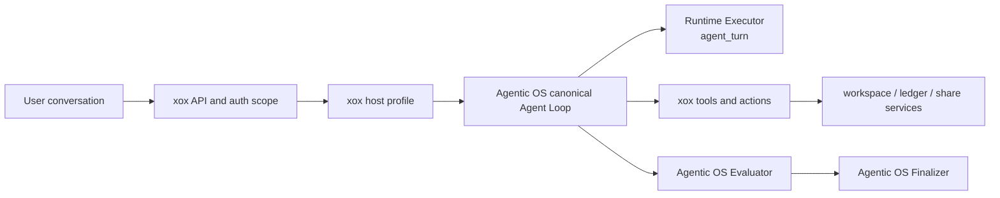
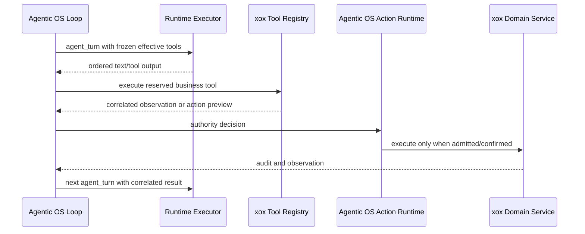

# xox-model Agent Host Design

Status: Current after Agentic OS ADR 0074

xox-model is a SaaS business host for Agentic OS. It provides scoped context,
tools, actions, skills, memory persistence, sandbox input bundles, model
configuration, and product projection. It does not own model continuation,
evaluation repair, or terminal state.

## Ownership



Agentic OS owns:

- `AgentLoopStateV3` and transition V2;
- one inline model-turn path and exact resume;
- provider tool-call/result causality;
- approval, clarification, wait, handoff, child-run, and compaction control;
- progress-plan state as an optional ordinary tool result;
- Evaluator obligations and finalization.

xox-model owns:

- tenant/workspace/user authentication and authorization;
- business context and provider/runtime configuration facts;
- business tool schemas, validation, previews, execution, and audit;
- tenant-scoped stores and sandbox input materialization;
- localized action cards and product artifact renderers.

The host cannot select a new runtime on each turn, return a precomputed next
step, mutate progress state, or bypass the Evaluator. Runtime selection is
declarative and frozen by Agentic OS for an attempt.

## Runtime Source

`agent_runs.runtime_source` and API `runtimeSource` identify the provider leaf
used for diagnostics:

- `openai_agents`
- `openai_compatible_tool_calls`
- `rules` for the explicit local/CI path

This field has no scheduling or continuation authority. Existing databases
rename the former column in place. Current API and UI have no compatibility
alias.

## Tool And Action Path



Read tools return observations. Writes first produce server-owned action
requests and editable confirmation cards. Execution rechecks scope, revision,
risk, and payload through the same domain services used by the ordinary UI.
No model/provider adapter writes the database directly.

## Sandbox

The business host decides which user files and normalized datasets are placed
in a sandbox input bundle. Agentic OS supplies the manifest, command/file
runtime, result normalization, and causal tool-result boundary. A sandbox
cannot access the API process, database, provider credentials, internal HTTP,
another tenant, or container-external paths.

## Memory And Skills

Business skills and memory providers are host peripherals. Agentic OS owns
manifest admission, controlled materialization, memory tool contracts,
compaction flush, and model-visible bounded projection. xox stores only scoped
records and never adds a second continuation loop.

## Frontend

The ordinary user surface is one interleaved timeline: assistant stream,
tools, sandbox activity, progress, approvals, child activity, review, and final
answer. xox adds product action cards and artifacts through renderer slots.
Operator/developer detail is permission gated; hidden reasoning, secrets,
worker-local paths, and unbounded payloads are never projected.

## Invariants

1. Every normal model call has Runtime purpose `agent_turn`.
2. Tool results keep canonical and provider tool-call correlation.
3. Text plus actionable calls cannot finalize a run.
4. Evaluator repair returns as an observation, not a host callback.
5. Runtime/provider identity is exposed only as `runtimeSource`.
6. All stores and events are tenant/workspace/run scoped.
7. Business operating-model fields named `planning` remain business data and
   are not harness control state.

## Verification

```powershell
npm run build
npm test
```

Historical pre-ADR0074 design detail is retained in
`docs/history/agent-design-pre-adr0074.md`.
