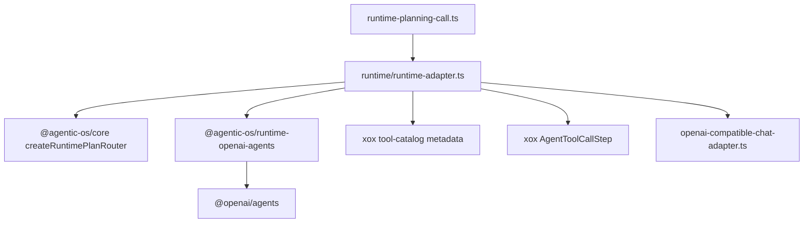

# M107 删除 OpenAI Agents 宿主 Adapter

Status: implemented
Date: 2026-06-20

## 目标

删除 `apps/api/src/agent/runtime/openai-agents-adapter.ts`。

这个文件在 M89 之后已经不再拥有 OpenAI Agents SDK 的真实 runtime 能力。`@agentic-os/runtime-openai-agents` 已经负责 SDK `Agent / Runner / OpenAIProvider / tool` 生命周期、provider cleanup、tool-call capture、assistant text projection、runtime events 和 SDK error redaction。

xox 继续保留一个同名宿主 adapter 文件，会误导后续 `navigation` 接入：未来 SaaS host 不应该复制一个 runtime adapter 目录，而应该在自己的 provider router 边界传入 settings、prompt、tool metadata 和业务 DTO mapper。

## 参考实现结论

- `openai-agents-js` 的 `Runner` 拥有 model response -> turn result -> next step 的循环。
- Hermes 的 `run_conversation()` 是主循环，`turn_context.py` 只负责 turn prologue，tool executor 把 tool result 追加回消息列表再进入下一轮。
- OpenClaw 把 replay safety、effective tool policy、provider artifact 和 terminal result shaping 放在 app 边界之下，产品层只做投影。

因此，xox 本轮不新增 host adapter 文件，只把必要的 xox DTO 映射收敛进现有 `runtime/runtime-adapter.ts`。

## 模块分工

Agentic OS：

- `@agentic-os/runtime-openai-agents`
  - OpenAI Agents SDK lifecycle；
  - canonical `AgentToolCall[]`；
  - provider-neutral runtime events；
  - `RuntimeTurnOutput`。

xox：

- `apps/api/src/agent/runtime/runtime-adapter.ts`
  - xox runtime DTO types；
  - `Settings.llmProvider` provider selection；
  - private `planWithOpenAIAgentsRuntime()` bridge；
  - xox `ChatTool` -> Agentic OS `RuntimeToolDescriptor` metadata fill；
  - canonical tool call -> xox `AgentToolCallStep` mapping。
- `apps/api/src/agent/runtime/openai-compatible-chat-adapter.ts`
  - 暂时继续作为 OpenAI-compatible provider transport boundary。

删除：

- `apps/api/src/agent/runtime/openai-agents-adapter.ts`

## 依赖图



## 命名和复用计划

- 保留既有 public API：`configuredRuntimePlannerSource()`、`planWithRuntimeAdapter`。
- 新 helper 全部是 `runtime-adapter.ts` 私有函数，不导出。
- 不导入 `@openai/agents`；只调用 `@agentic-os/runtime-openai-agents`。
- 不引入兼容 shim，不创建新的 `openai-agents-*` 文件。

## 验证

```bash
npm.cmd run build:api
npm.cmd run test --workspace @xox/api -- tests/agent-architecture.test.ts tests/provider-runtime.test.ts tests/agentic-os-adapter.test.ts
npm.cmd run test:api
```

预期：

- build 通过；
- focused tests 通过；
- full API suite 通过；
- architecture guard 断言 `runtime/openai-agents-adapter.ts` 不存在；
- `apps/api/src/agent/runtime` 从 3 个文件降到 2 个文件。

已验证：

- `npm.cmd run build:api` 通过；
- `npm.cmd run test --workspace @xox/api -- tests/agent-architecture.test.ts tests/provider-runtime.test.ts tests/agentic-os-adapter.test.ts` 通过，3 个文件 / 55 个测试；
- `npm.cmd run test:api` 通过，15 个文件 / 238 个测试；
- `C:\Github\agentic-os` 的 `npm.cmd run check` 通过，证明 Agentic OS runtime 包未回退。
