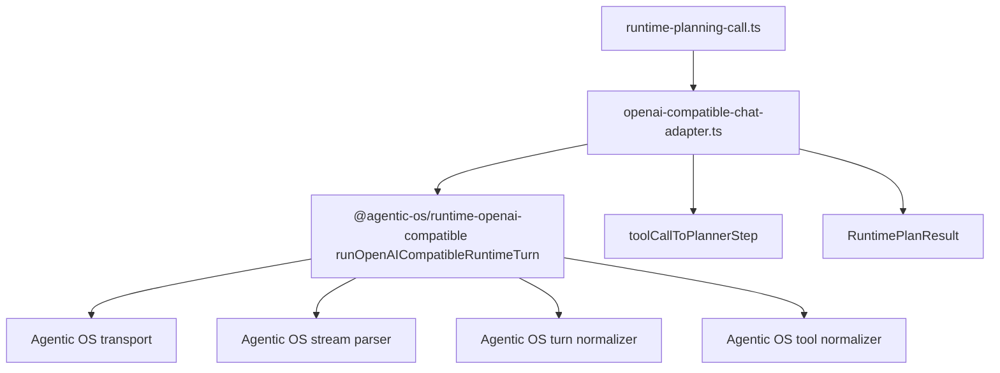

# M108 删除 OpenAI-Compatible 宿主 Runtime Turn 框架

Status: implemented
Date: 2026-06-20

## 目标升级

当前目标升级为：删除宿主 agent 框架，而不是只迁移调用点。

`xox-model` 是 Agentic OS 的第一个下游应用，但不能让 Agentic OS 全盘按 xox 形状长出来。xox 应该像主板一样提供业务设置、工具定义、业务 DTO 和 UI 事件约定；Agentic OS 像 CPU 一样提供统一 harness loop 与 provider runtime turn。

本轮先处理 `apps/api/src/agent/runtime/openai-compatible-chat-adapter.ts`：这个文件必须从“本地 provider turn 框架”降级成“xox 业务适配层”。

## 问题

当前 xox adapter 仍然拥有这些通用 harness 能力：

- provider request shaping；
- chat completions transport；
- SSE stream parsing；
- JSON/stream turn normalization；
- provider tool call normalization；
- argument repair；
- stream interruption / timeout / damage frame mapping；
- provider artifact 和 replay assistant message 组装。

这些都是 Agentic OS 应承担的 SaaS harness CPU 职责。xox 保留它们会导致未来 `navigation` 接入时继续复制宿主 agent 框架，违背“快速热插拔”的目标。

## 参考实现结论

- `openai-agents-js` 的 `Runner` 拥有 model response 到 next-step 的核心循环。
- Hermes 保持一个清晰 loop：模型 turn、工具执行、observation 追加、继续 turn。
- OpenClaw 把 stream frame integrity、provider boundary、replay safety 放在宿主边界之下。

xox 本轮只保留业务投影：把 Agentic OS 的 generic provider turn output 转成 `RuntimePlanResult`。

## 模块分工

Agentic OS：

- `@agentic-os/runtime-openai-compatible`
  - 新增 `runOpenAICompatibleRuntimeTurn()`；
  - 负责 request shaping、transport、stream parsing、turn normalization、tool-call normalization、provider boundary error、provider artifact、provider assistant replay message。

xox：

- `apps/api/src/agent/runtime/openai-compatible-chat-adapter.ts`
  - 保留类名兼容现有测试和 runtime router；
  - 读取 `Settings` 并调用 Agentic OS runtime turn；
  - 把 normalized provider tool call 映射成 `AgentToolCallStep`；
  - 把 Agentic OS runtime error 映射成 xox `RuntimePlanResult.error`；
  - 只桥接 xox 现有 stream event source 字段。
- `apps/api/tests/agent-architecture.test.ts`
  - 守住边界，禁止低层 provider framework 名称回流。

## 依赖图



## 复用和命名计划

- 复用 Agentic OS 的 provider runtime turn，不在 xox 新建 provider helper。
- 保留 `OpenAICompatibleChatAdapter` 名字，只作为 xox 兼容入口。
- xox helper 只允许出现 DTO 映射语义，例如 `plannerStepsFromProviderToolCalls()`。
- 不新增 parallel abstraction，不保留低层 framework shim。

## 验证

```bash
npm.cmd run build:api
npm.cmd run test --workspace @xox/api -- tests/agent-architecture.test.ts tests/provider-runtime.test.ts
npm.cmd run test:api
```

预期：

- build 通过；
- provider runtime 行为测试通过；
- full API suite 通过；
- architecture guard 断言 xox adapter 不再包含低层 provider runtime turn 框架名。

同时在 `C:\Github\agentic-os` 运行：

```bash
npm.cmd run check
```

预期：Agentic OS 全包构建和测试通过。

已验证：

- `C:\Github\agentic-os`: `npm.cmd run build -w @agentic-os/runtime-openai-compatible` 通过；
- `C:\Github\agentic-os`: `npm.cmd run test -w @agentic-os/runtime-openai-compatible` 通过，47 个测试；
- `C:\Github\agentic-os`: `npm.cmd run check` 通过，core 147、server 29、runtime-openai-compatible 47、runtime-openai-agents 5、testing 11；
- `C:\Github\xox-model`: `npm.cmd run build:api` 通过；
- `C:\Github\xox-model`: `npm.cmd run test --workspace @xox/api -- tests/agent-architecture.test.ts tests/provider-runtime.test.ts` 通过，2 个文件 / 51 个测试；
- `C:\Github\xox-model`: `npm.cmd run test:api` 通过，15 个文件 / 238 个测试。

## 完成标准

- `@agentic-os/runtime-openai-compatible` 暴露 `runOpenAICompatibleRuntimeTurn()`。
- xox adapter 不再 import 或出现以下名称：
  - `requestOpenAICompatibleChatCompletion`
  - `shapeOpenAICompatibleChatRequest`
  - `parseOpenAICompatibleStreamResponse`
  - `normalizeOpenAICompatibleJsonTurnResult`
  - `normalizeOpenAICompatibleStreamTurnResult`
  - `normalizeProviderToolCallsForExecution`
  - `OpenAICompatibleProviderStreamTimeoutError`
  - `OpenAICompatibleProviderStreamInterruptedError`
- xox adapter 只保留业务 DTO 映射、settings 映射、event source 桥接。
- xox 当前测试效果不低于替换前。
