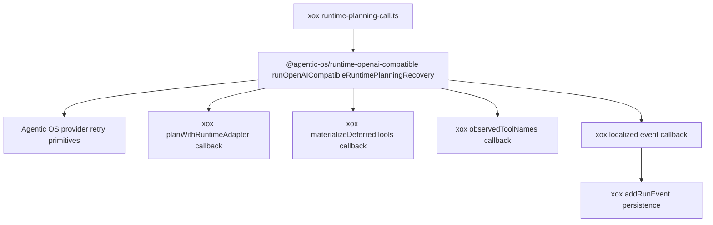

# M109 删除宿主 Runtime Planning Recovery 框架

Status: implemented
Date: 2026-06-20

## 目标升级

当前目标进一步升级为：删除宿主 agent 框架。M109 的对象是 `apps/api/src/agent/runtime-planning-call.ts` 中仍由 xox 本地拥有的 same-turn planning recovery 编排。

xox 作为下游 SaaS host，可以保留业务主板能力：

- context/tool catalog/provider settings wiring；
- `workspace_configure_operating_model`、`sandbox_run_code` 这类 xox 高容量业务工具预算；
- 中文 run event 文案和 DB 持久化；
- xox `RuntimePlanResult` / planner-step DTO 投影。

但 xox 不应继续拥有通用 harness CPU 编排：

- 首次 provider planning attempt；
- deferred tool schema materialization 后重试；
- recoverable provider/runtime retry；
- retry input patch 生成与应用；
- provider boundary 后缺失 observation 的恢复判定；
- recovery event sequence。

## 问题

M108 后，单次 OpenAI-compatible provider turn 已进入 Agentic OS runtime，但 `runtime-planning-call.ts` 仍然像一个小型本地 harness runner：

- 调用 `planWithRuntimeAdapter()`；
- 检查 `tool_call_registered_but_deferred`；
- materialize deferred tool schemas；
- 再次调用 runtime planner；
- 检查 provider error 是否可恢复；
- 构造 retry patch 并重放；
- 发现 retry 没有产生 tool observation 时追加 evidence requirement。

这段控制流不依赖 xox 财务业务。未来 `navigation` 如果也需要 provider retry/recovery，不应该复制这段逻辑。

## 参考实现结论

- `openai-agents-js` 的 Runner 拥有 response -> tool output -> next turn 的循环决定。
- Hermes 的 `run_conversation()` 把模型 turn、工具执行、tool result message 追加和继续循环放在 harness 内。
- OpenClaw 把 retry、recovery、history repair 放在应用边界之下。

所以 M109 的边界是：Agentic OS 拥有 planning recovery orchestration，xox 只提供业务回调。

## 模块分工

Agentic OS：

- `@agentic-os/runtime-openai-compatible`
  - 新增 `runOpenAICompatibleRuntimePlanningRecovery()`；
  - 复用 provider retry primitives；
  - 统一 deferred materialization、provider retry、missing-observation recovery；
  - 暴露 typed event，供 host 记录产品事件；
  - 不理解 xox DTO、数据库或中文文案。

xox：

- `apps/api/src/agent/runtime-planning-call.ts`
  - 调用 Agentic OS recovery runner；
  - 通过 callback materialize xox tool catalog；
  - 通过 callback 投影 observed provider tool name；
  - 通过 callback 追加 xox evidence requirement；
  - 通过 callback 记录中文 run event；
  - 不再直接导入 retry patch primitive。
- `apps/api/tests/agent-architecture.test.ts`
  - 防止本地 recovery framework 回流。

## 依赖图



## 复用和命名计划

- 复用 `@agentic-os/runtime-openai-compatible` 的 retry primitives，不在 xox 新建 facade。
- 新 API 命名为 `runOpenAICompatibleRuntimePlanningRecovery()`，强调它拥有 planning recovery sequence。
- xox 只保留 `XOX_HIGH_VOLUME_STRUCTURED_*` 这类 host policy 命名。
- 不新增 parallel abstraction，不保留旧 control-flow helper。

## 验证

```bash
npm.cmd run build:api
npm.cmd run test --workspace @xox/api -- tests/agent-architecture.test.ts tests/provider-runtime.test.ts
npm.cmd run test:api
```

预期：

- API build 通过；
- provider runtime 和 architecture tests 通过；
- full API suite 通过；
- architecture guard 断言 `runtime-planning-call.ts` 不再包含本地 retry/deferred/missing-observation orchestration helper。

同时在 `C:\Github\agentic-os` 运行：

```bash
npm.cmd run build -w @agentic-os/runtime-openai-compatible
npm.cmd run test -w @agentic-os/runtime-openai-compatible
npm.cmd run check
```

预期：Agentic OS runtime package 和全包 check 通过。

已验证：

- `C:\Github\agentic-os`: `npm.cmd run build -w @agentic-os/runtime-openai-compatible` 通过；
- `C:\Github\agentic-os`: `npm.cmd run test -w @agentic-os/runtime-openai-compatible` 通过，49 个测试；
- `C:\Github\agentic-os`: `npm.cmd run check` 通过，core 147、server 29、runtime-openai-compatible 49、runtime-openai-agents 5、testing 11；
- `C:\Github\xox-model`: `npm.cmd run build:api` 通过；
- `C:\Github\xox-model`: `npm.cmd run test --workspace @xox/api -- tests/agent-architecture.test.ts tests/provider-runtime.test.ts` 通过，2 个文件 / 52 个测试；
- `C:\Github\xox-model`: `npm.cmd run test:api` 通过，15 个文件 / 239 个测试。

## 完成标准

- `@agentic-os/runtime-openai-compatible` 暴露 `runOpenAICompatibleRuntimePlanningRecovery()`。
- xox `runtime-planning-call.ts` 不再 import 或出现以下名称：
  - `shouldRetryProviderRuntimeResult`
  - `buildProviderRuntimeRetryPatch`
  - `applyProviderRuntimeRetryPatch`
  - `deferredToolNamesFromBoundary`
  - `missingObservationToolNames`
- xox 只通过 callback 保留业务预算、工具 materialization、localized event 和 DTO projection。
- xox 行为与 main 一样好或更好。
