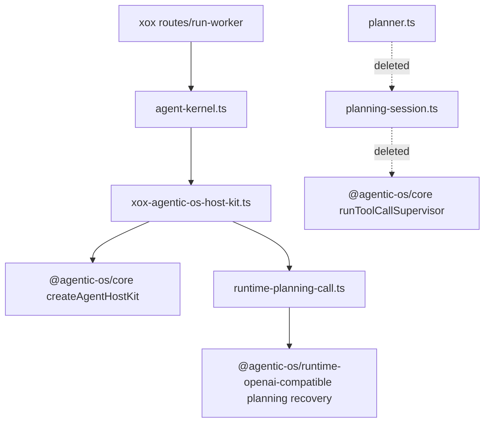

# M110 删除宿主 Planner Session 框架

Status: implemented
Date: 2026-06-20

## 目标

M110 改为按“删除宿主 agent 框架”推进，不再按单个 helper 迁移。

本轮先砍掉已经没有生产入口的旧 xox planner/session 层：

- `apps/api/src/agent/planner.ts`
- `apps/api/src/agent/planning-session.ts`
- `apps/api/tests/agent-planning-session.test.ts`

这些文件保留的是旧宿主 planner/session 的形状：按用户文本拆多步、调用 runtime planner、跑 tool supervisor、再写 action graph。当前生产入口已经由 `agent-kernel.ts -> xox-agentic-os-host-kit.ts -> createAgentHostKit()` 承担；`planner.ts` 在源码内没有入边，`planning-session.ts` 只被这个死入口和测试引用。

## 模块分工

xox 保留：

- `apps/api/src/agent/agent-kernel.ts`
  - 当前生产入口；
  - direct answer 和 Agentic OS harness 的分流壳。
- `apps/api/src/agent/agentic-os/xox-agentic-os-host-kit.ts`
  - 暂时仍是 host adapter；后续 M111/M112 继续压薄。
- `apps/api/src/agent/runtime-planning-call.ts`
  - provider planning boundary；M109 后 recovery 编排已迁入 Agentic OS。
- `apps/api/src/agent/runtime-intent-handlers.ts`
  - xox 业务工具到 action/read/sandbox 的映射。

xox 删除：

- 死的旧 planner entrypoint；
- 死的旧 planning session runner；
- 只验证死 session 内部分词函数的测试。

Agentic OS：

- 本轮不新增代码；
- 继续作为生产 harness loop、tool supervisor、provider recovery 和 run-plane primitive 的 owner。

## 依赖图



## 复用和命名计划

- 不为死代码保留兼容 shim。
- 不把 `splitRequestedSteps()` 搬到另一个 xox 文件，因为生产入口已经不用它；保留它只会延续旧 session 框架。
- Architecture guard 直接断言 `planner.ts` 和 `planning-session.ts` 不存在。

## 验证

```bash
npm.cmd run build:api
npm.cmd run test --workspace @xox/api -- tests/agent-architecture.test.ts
npm.cmd run test:api
```

预期：

- build 通过，证明没有生产 import 依赖旧 planner/session；
- architecture guard 通过，证明旧框架文件被删除；
- full API suite 通过，证明生产 Agentic OS harness 行为不低于删除前。

已验证：

- `C:\Github\xox-model`: `npm.cmd run build:api` 通过；
- `C:\Github\xox-model`: `npm.cmd run test --workspace @xox/api -- tests/agent-architecture.test.ts` 通过，1 个文件 / 32 个测试；
- `C:\Github\xox-model`: `npm.cmd run test:api` 通过，14 个文件 / 236 个测试。

## 完成标准

- `planner.ts` 删除；
- `planning-session.ts` 删除；
- `agent-planning-session.test.ts` 删除；
- `agent-architecture.test.ts` 防止旧文件回流；
- xox 生产行为保持不变。
